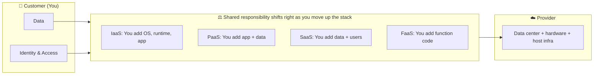

# Shared Responsibility Matrix — At a Glance

> CompTIA CV0-004 loves this matrix. Memorize the customer-managed columns.

| Layer | On-Prem | IaaS | PaaS | SaaS | FaaS |
|---|:---:|:---:|:---:|:---:|:---:|
| **Data** | You | **You** | **You** | **You** | **You** |
| **Identity / IAM** | You | **You** | **You** | **You** (config) | **You** |
| **Application** | You | **You** | **You** | Provider | **You** (code) |
| **Runtime / Middleware** | You | **You** | Provider | Provider | Provider |
| **OS** | You | **You** | Provider | Provider | Provider |
| **Virtualization** | You | Provider | Provider | Provider | Provider |
| **Servers / Hardware** | You | Provider | Provider | Provider | Provider |
| **Storage** | You | Provider | Provider | Provider | Provider |
| **Networking (physical)** | You | Provider | Provider | Provider | Provider |
| **Networking (config — SGs, NACLs, routes)** | You | **You** | **You** | Provider (limited) | Provider |
| **Physical data center** | You | Provider | Provider | Provider | Provider |

**Bold = customer responsibility.** Plain = provider.

## Exam Decoding Triggers

- "We want full OS control." → **IaaS**
- "We want to push code only." → **PaaS** or **FaaS**
- "Email for 5,000 users." → **SaaS**
- "We need to patch our VMs." → **IaaS** (customer patches)
- "Our cloud provider patches the OS." → **PaaS** or higher
- "Our provider patches the OS and runtime, we just bring data." → **SaaS**

## Visual

## Related Objectives

- [1.1 — Cloud Service Models & Shared Responsibility](../objectives/domain-1/1.1-cloud-service-models-and-shared-responsibility.md)
- [1.5 — Cloud-Native Design](../objectives/domain-1/1.5-cloud-native-design-concepts.md)
- [1.6 — Containerization](../objectives/domain-1/1.6-containerization-concepts.md)
