# CI/CD Pipeline

> Source: Domain 4 (planned) — DevOps Fundamentals

```mermaid
flowchart LR
    Dev(["👨‍💻 Developer"]) -->|git push| Repo[("📦 Source Repo<br/>GitHub / GitLab")]
    Repo -->|webhook| CI[CI: Build + Test]
    CI -->|unit + integration| Tests[🧪 Test Suite]
    Tests -->|pass| SAST[🔍 SAST + SCA scan]
    SAST -->|pass| Image[🐳 Build Container Image]
    Image -->|sign + push| Registry[("🗃️ Container Registry<br/>ECR / ACR / GCR / GHCR")]
    Registry -->|deploy| CD[CD Pipeline]
    CD -->|canary| Staging[🧪 Staging]
    Staging -->|approval| Prod[🚀 Production]
    Prod -->|monitor| Obs[📊 Observability<br/>CloudWatch / Monitor / Cloud Logging]
    Obs -->|alerts| OnCall["📟 On-call engineer"]
    OnCall -.feedback.-> Dev

    subgraph IaC["🛠️ Infrastructure as Code"]
        TF[Terraform / Bicep / CloudFormation]
        Plan[Plan + Review]
        Apply[Apply]
        TF --> Plan --> Apply
        Apply -.provisions.-> Prod
    end

    classDef dev fill:#d0bfff,stroke:#5f3dc4
    classDef sec fill:#ffec99,stroke:#f08c00
    classDef deploy fill:#b2f2bb,stroke:#2f9e44
    classDef obs fill:#a5d8ff,stroke:#1864ab
```

## Pipeline Stages

| Stage | Purpose | Common tools |
|---|---|---|
| **Source** | Trigger on git push / PR | GitHub, GitLab, Bitbucket |
| **Build** | Compile, package, containerize | Docker, Buildpacks, Bazel |
| **Test** | Unit, integration, contract | JUnit, pytest, Jest, Postman |
| **Scan** | SAST, SCA, secret detection | Snyk, Trivy, SonarQube, GitGuardian |
| **Stage** | Deploy to non-prod for validation | ArgoCD, Spinnaker, Flux |
| **Deploy** | Promote to production (canary / blue-green) | Argo Rollouts, Spinnaker, Harness |
| **Observe** | Metrics, logs, traces, SLOs | Prometheus, Grafana, OpenTelemetry |

## Key Principles

- **Build once, deploy many** — same artifact across environments.
- **Immutable infrastructure** — replace, don't mutate.
- **Policy as code** — OPA / Sentinel gates before prod.
- **GitOps** — Git is the single source of truth for both app and infra.
- **Shift-left security** — scan as early as the PR.

---

🔗 See also: [1.5 — Cloud-Native Design Concepts](../objectives/domain-1/1.5-cloud-native-design-concepts.md) · [1.6 — Containerization Concepts](../objectives/domain-1/1.6-containerization-concepts.md)
