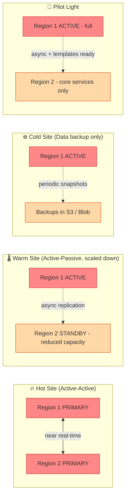

# Disaster Recovery Strategies

> Source: Domain 1.2 — RTO, RPO, hot/warm/cold sites, pilot light

## Strategy Comparison

| Strategy | Cost | RTO | RPO | When to choose |
|---|---|---|---|---|
| **Backup & Restore (Cold)** | $ | Hours–Days | Hours | Non-critical, dev/test, archival |
| **Pilot Light** | $$ | 10s of min | Minutes | Critical apps, acceptable short downtime |
| **Warm Standby** | $$$ | Minutes | Seconds | Important, near-zero data loss tolerated |
| **Hot Standby (Multi-Site Active-Active)** | $$$$ | Seconds | Near zero | Mission-critical, zero-tolerance |

> 📐 **AWS / Azure / GCP equivalents:** AWS Elastic Disaster Recovery · Azure Site Recovery · Google Cloud DR Service

---

🔗 See also: [1.2 — Service Availability Concepts](../objectives/domain-1/1.2-service-availability-concepts.md) · [Domain 1 Cheatsheet](../cheatsheets/domain-1-cheatsheet.md)
