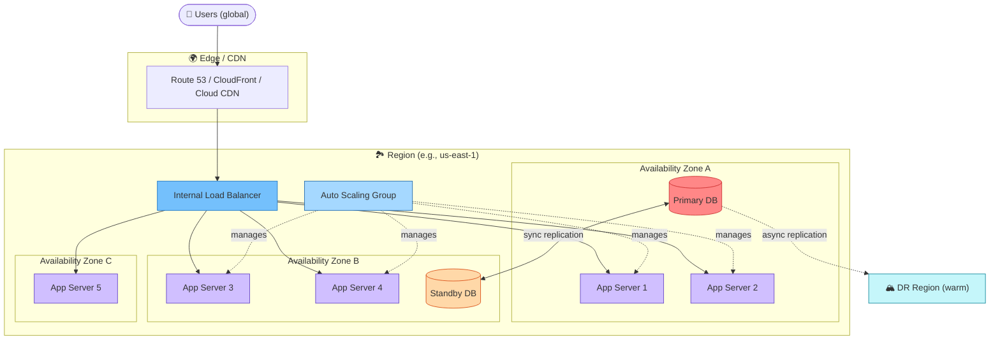

# High Availability Architecture (Multi-AZ)

> Source: Domain 1.2 — Service Availability Concepts

### Key Properties

| Property | Provided by |
|---|---|
| DNS-level failover | Route 53 / Traffic Manager / Cloud DNS |
| Edge caching | CloudFront / Cloud CDN / Azure Front Door |
| AZ-level redundancy | Multi-AZ deployment |
| Instance redundancy | Auto Scaling Group + health checks |
| Database HA | Synchronous replication between AZs |
| Region-level DR | Asynchronous replication to warm DR region |

### SLA Math (illustrative)

- Single EC2 instance SLA: **90%** → ~72 hrs downtime / year
- Multi-AZ service (e.g., ALB + ASG + RDS Multi-AZ): typically **99.99%** → ~52 min / year
- Multi-region active-active: can reach **99.999%** ("five nines") → ~5 min / year

---

🔗 See also: [1.2 — Service Availability Concepts](../objectives/domain-1/1.2-service-availability-concepts.md)
