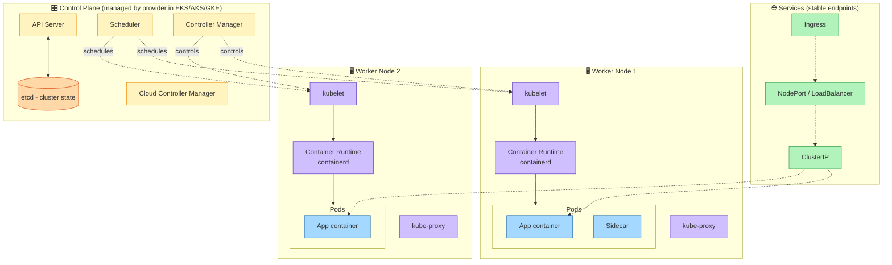

# Kubernetes Architecture

> Source: Domain 1.6 — Containerization Concepts

## Key Components

| Component | Role |
|---|---|
| **API Server** | Front door to the cluster; only component that talks to etcd |
| **etcd** | Distributed key-value store; source of truth for cluster state |
| **Scheduler** | Decides which node a new pod runs on |
| **Controller Manager** | Runs reconciliation loops (replicas, nodes, endpoints…) |
| **kubelet** | Node agent that ensures containers in pods are running |
| **kube-proxy** | Maintains network rules for service IP → pod IP |
| **Container runtime** | Runs containers (containerd, CRI-O) |
| **Pod** | Smallest deployable unit; 1+ co-scheduled containers |
| **Service** | Stable virtual IP + DNS for a set of pods |
| **Ingress** | L7 routing for external traffic into the cluster |

## Serverless Containers (PaaS-ish)

- **AWS Fargate** — run containers without managing nodes (EKS or ECS).
- **Azure Container Apps** — managed K8s without the YAML.
- **Google Cloud Run** — scale-to-zero containers, HTTP-driven.

---

🔗 See also: [1.6 — Containerization Concepts](../objectives/domain-1/1.6-containerization-concepts.md)
