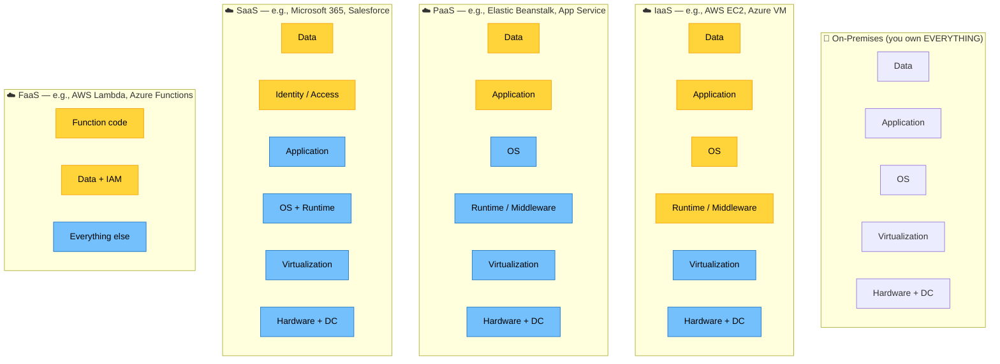

# Shared Responsibility Model

> Source: Domain 1.1 — Cloud Service Models & Shared Responsibility

**Legend:** 🟨 Customer-managed · 🟦 Provider-managed

### Rule of Thumb

- The customer **always** owns: **Data** and **Identity**.
- The provider **always** owns: **Physical DC**, **Hardware**, and **Host infrastructure**.
- OS ownership flips at the IaaS ↔ PaaS line.

---

🔗 See also: [1.1 — Cloud Service Models & Shared Responsibility](../objectives/domain-1/1.1-cloud-service-models-and-shared-responsibility.md) · [Cheatsheet: Shared Responsibility Matrix](../cheatsheets/shared-responsibility-matrix.md)
