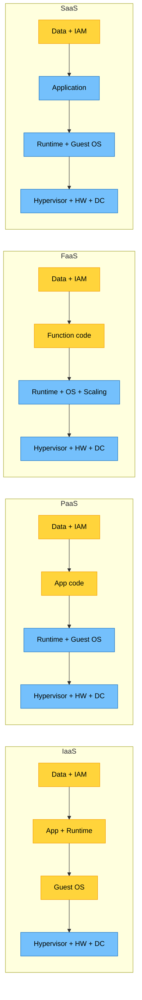
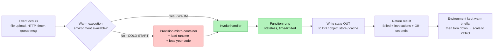
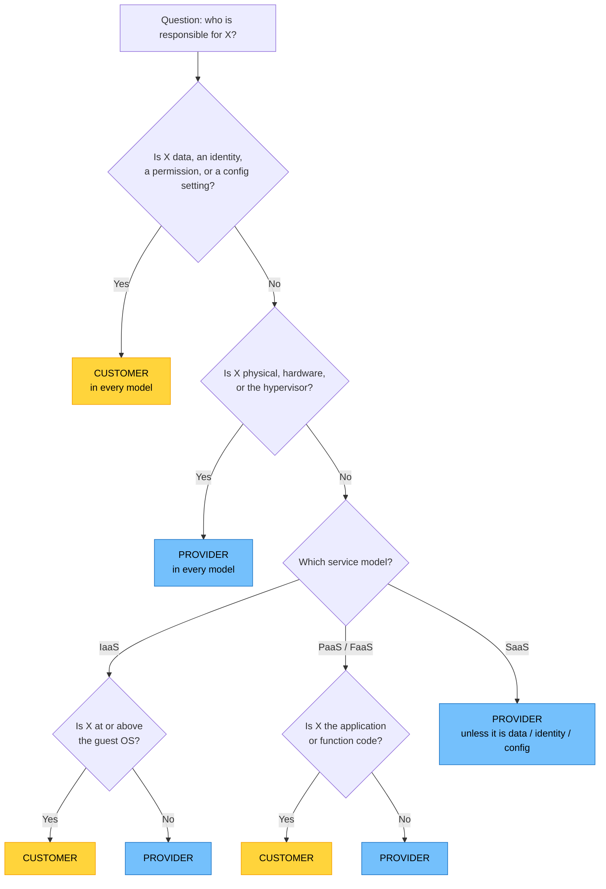

# Objective 1.1 — Given a scenario, use the appropriate cloud service model

> **Domain 1.0 — Cloud Architecture (23% of exam)** · Exam CV0-004 V4 · Objectives doc v5.0
> **Status:** Exam-ready · **Version:** 2.0 (enhanced) · Supersedes `full notes/Objective-1.1-Cloud-Service-Models.md`

---

## 0. How to use this note

| Pass | What to read | Time |
|---|---|---|
| **1st (learn)** | Sections 1 → 6 in order | ~45 min |
| **2nd (drill)** | Section 7 (traps) + Section 8 (keyword triggers) | ~15 min |
| **3rd (test)** | Section 9 (practice) + Section 10 (PBQ) | ~30 min |
| **Exam eve** | Section 11 (60-second recall sheet) only | ~5 min |

---

## 1. Official objective coverage

CompTIA's published wording for 1.1 is short — everything below maps to it, nothing is invented scope:

> **1.1 Given a scenario, use the appropriate cloud service model.**
> - **Cloud service models**
>   - Infrastructure as a service (IaaS)
>   - Platform as a service (PaaS)
>   - Software as a service (SaaS)
>   - Function as a service (FaaS)
> - **Shared responsibility model**

**Coverage checklist — tick each before you call 1.1 done:**

- [ ] I can define IaaS / PaaS / SaaS / FaaS and state *exactly* which layers I manage in each
- [ ] I can pick the right model from a 3-sentence business scenario
- [ ] I can state the shared responsibility split for all four models
- [ ] I know the three things that are **always** the customer's, in every model
- [ ] I know the three things that are **always** the provider's, in every model
- [ ] I can name 2+ real products per model (AWS / Azure / GCP)
- [ ] I recognise the adjacent acronyms on CompTIA's list: **CaaS**, **DBaaS**, **XaaS**, **VDI**
- [ ] I can spot the classic distractors (Section 7)

**Two words that decide the question type:**

| Verb in the stem | What CompTIA wants |
|---|---|
| "Given a scenario… **which model**" | Match business need → IaaS/PaaS/SaaS/FaaS |
| "**Who is responsible** for…" | Shared responsibility boundary |

> ⚠️ **1.1 is never a definition question.** The exam gives you a situation and asks you to choose or assign. Memorising definitions alone will not pass this objective — you must practise the *mapping*.

---

## 2. The core mental model

### 2.1 The stack — who manages which layer

This one picture answers roughly 60% of everything in 1.1. Learn it cold.

The `═══` line in each column is that model's **responsibility boundary**: everything above it is yours, everything below it is the provider's.

```text
               ON-PREM        IaaS         PaaS         FaaS         SaaS
             ┌──────────┐ ┌──────────┐ ┌──────────┐ ┌──────────┐ ┌──────────┐
Data         │   YOU    │ │   YOU    │ │   YOU    │ │   YOU    │ │   YOU    │ ← ALWAYS yours
             ├──────────┤ ├──────────┤ ├──────────┤ ├──────────┤ ├──────────┤
IAM / access │   YOU    │ │   YOU    │ │   YOU    │ │   YOU    │ │   YOU    │ ← ALWAYS yours
             ├──────────┤ ├──────────┤ ├──────────┤ ├──────────┤ ├══════════┤ ← SaaS boundary
App code     │   YOU    │ │   YOU    │ │   YOU    │ │   YOU    │ │ PROVIDER │
             ├──────────┤ ├──────────┤ ├══════════┤ ├══════════┤ ├──────────┤ ← PaaS / FaaS boundary
Runtime      │   YOU    │ │   YOU    │ │ PROVIDER │ │ PROVIDER │ │ PROVIDER │
             ├──────────┤ ├──────────┤ ├──────────┤ ├──────────┤ ├──────────┤
Middleware   │   YOU    │ │   YOU    │ │ PROVIDER │ │ PROVIDER │ │ PROVIDER │
             ├──────────┤ ├──────────┤ ├──────────┤ ├──────────┤ ├──────────┤
Guest OS ★   │   YOU    │ │   YOU    │ │ PROVIDER │ │ PROVIDER │ │ PROVIDER │ ← ★ MOST-TESTED ROW
             ├──────────┤ ├══════════┤ ├──────────┤ ├──────────┤ ├──────────┤ ← IaaS boundary
Hypervisor   │   YOU    │ │ PROVIDER │ │ PROVIDER │ │ PROVIDER │ │ PROVIDER │
             ├──────────┤ ├──────────┤ ├──────────┤ ├──────────┤ ├──────────┤
Servers / HW │   YOU    │ │ PROVIDER │ │ PROVIDER │ │ PROVIDER │ │ PROVIDER │
             ├──────────┤ ├──────────┤ ├──────────┤ ├──────────┤ ├──────────┤
Storage      │   YOU    │ │ PROVIDER │ │ PROVIDER │ │ PROVIDER │ │ PROVIDER │
             ├──────────┤ ├──────────┤ ├──────────┤ ├──────────┤ ├──────────┤
Network      │   YOU    │ │ PROVIDER │ │ PROVIDER │ │ PROVIDER │ │ PROVIDER │
             ├──────────┤ ├──────────┤ ├──────────┤ ├──────────┤ ├──────────┤
Physical /DC │   YOU    │ │ PROVIDER │ │ PROVIDER │ │ PROVIDER │ │ PROVIDER │ ← ALWAYS provider's
             └──────────┘ └──────────┘ └──────────┘ └──────────┘ └──────────┘

              MOST ◄────────── YOUR CONTROL & OPS EFFORT ──────────► LEAST
              LEAST ◄───────── PROVIDER ABSTRACTION ────────────────► MOST
```

**★ The single most-tested line on this whole objective** is the *Guest OS* row:
**IaaS = you patch the OS. PaaS / FaaS / SaaS = provider patches the OS.**

### 2.2 The boundary slides — visual

**Yellow = customer manages · Blue = provider manages**



Read it left to right: **the blue block shrinks as you move up the stack.** The bottom (physical) is always green; the top (data + identity) is always blue.

### 2.3 Analogy ladder — pizza / housing

| Model | Pizza analogy | Housing analogy |
|---|---|---|
| **On-prem** | Make pizza from scratch at home | Own the house — you fix the roof |
| **IaaS** | Buy frozen pizza, bake in **your** oven | Unfurnished rental — landlord does the building, you do everything inside |
| **PaaS** | Pizza delivered — **your** table, drinks, plates | Serviced apartment — furnished, you just live in it |
| **FaaS** | Pizza by the **slice**, only when you're hungry, no fridge | Hotel room by the hour — no idle cost |
| **SaaS** | Eat at the **restaurant** | Staying at a hotel — nothing is yours to maintain |

> FaaS sits *lower than SaaS in control* but *higher than PaaS in abstraction* — that's why the ladder is **IaaS → PaaS → FaaS → SaaS** by "how little you manage," but **IaaS → PaaS → SaaS** by NIST's classic three-model taxonomy. CompTIA tests the four-model version.

---

## 3. The four service models in depth

### 3.1 Infrastructure as a Service (IaaS)

| | |
|---|---|
| **Definition** | Provider delivers virtualised **compute, storage, and networking**. You get a bare VM (or bare-metal instance) and everything above the hypervisor is yours. |
| **You manage** | Guest OS + patching, middleware, runtime, app code, data, IAM, security groups / NACLs, host-based firewall, encryption config, backups of your data |
| **Provider manages** | Physical DC, power/cooling, hardware, storage arrays, network fabric, hypervisor, host OS |
| **Billing** | Per **instance-hour / instance-second**, plus provisioned storage (GB-month), plus data egress |
| **Elasticity** | You configure auto-scaling groups; **does not scale itself by default** |
| **Best for** | Lift-and-shift migrations, legacy apps, custom/unsupported OS or kernel modules, licence-bound software, workloads needing OS-level hardening or specific drivers (GPU, HPC), full control over the network path |
| **Limitations** | Highest ops burden; you own patching, AV/EDR, OS hardening, capacity planning; idle VMs still cost money |
| **Exam triggers** | "full control", "install our own OS", "lift and shift", "legacy application", "we must harden the operating system", "custom kernel/drivers", "root access", "sysadmins manage servers" |

**Real products:** AWS **EC2**, EBS, VPC · Azure **Virtual Machines**, Managed Disks, VNet · GCP **Compute Engine**, Persistent Disk · Oracle Cloud Compute · Linode / DigitalOcean Droplets

> 💡 **Object storage (S3, Blob, Cloud Storage) is normally counted as IaaS-level infrastructure** — the customer owns the bucket policy and access configuration. This is why "public bucket leak = customer's fault" is a shared-responsibility question, not an IaaS question.

---

### 3.2 Platform as a Service (PaaS)

| | |
|---|---|
| **Definition** | Provider delivers a **managed application platform**: OS, runtime, web server, middleware, and often a managed database. You supply code and configuration only. |
| **You manage** | Application code, app dependencies/libraries, application configuration, data, IAM/users, app-layer security |
| **Provider manages** | Everything IaaS covers **plus** guest OS patching, runtime version, middleware, load balancing, platform auto-scaling, TLS termination |
| **Billing** | Per **platform instance / app plan tier / hour**, often bundled with the managed database |
| **Elasticity** | Provider-managed auto-scaling, usually configured by a policy you set |
| **Best for** | Rapid development, small teams with no ops staff, standard web/API stacks (Node, Python, Java, .NET), managed databases (DBaaS), predictable app architectures |
| **Limitations** | **Vendor lock-in** (proprietary buildpacks/APIs), restricted OS access, limited to supported runtimes/versions, harder to debug at the OS layer, less network control |
| **Exam triggers** | "developers focus on writing code", "we don't want to patch servers", "managed database", "no ops team", "deploy quickly", "the platform handles scaling", "push code and it runs" |

**Real products:** AWS **Elastic Beanstalk**, App Runner, RDS/Aurora (DBaaS) · Azure **App Service**, Azure SQL Database · GCP **App Engine**, Cloud SQL · Heroku · Red Hat OpenShift

> ⚠️ **Trap:** a *managed database* (RDS, Azure SQL, Cloud SQL) is **PaaS/DBaaS**, even though it obviously runs on VMs underneath. If the customer cannot SSH into it, it is not IaaS.

---

### 3.3 Software as a Service (SaaS)

| | |
|---|---|
| **Definition** | Provider delivers a **finished, ready-to-use application** over the network, usually multi-tenant and browser-accessed. |
| **You manage** | Your **data**, your **users and permissions**, tenant-level settings, integrations, and any client devices |
| **Provider manages** | The entire stack including the application code, its vulnerabilities, upgrades, and availability |
| **Billing** | Per **user (seat) per month**, sometimes per transaction or storage tier |
| **Elasticity** | Completely transparent — you add licences, not capacity |
| **Best for** | Email/collaboration, CRM, HR, accounting, ticketing; organisations with little or no IT staff; commodity functions where custom code adds no value |
| **Limitations** | Minimal customisation; **data resides with the provider** (residency/sovereignty concerns); integration limited to the vendor's API; exit/data-portability risk; you inherit the vendor's outage |
| **Exam triggers** | "accessed through a web browser", "per-user monthly subscription", "off-the-shelf", "no installation required", "the vendor upgrades it automatically", "email and document collaboration" |

**Real products:** Microsoft 365 · Google Workspace · Salesforce · ServiceNow · Zoom · Dropbox · Slack · Xero/QuickBooks Online · Amazon WorkSpaces (DaaS/VDI flavour of SaaS)

> 💡 In SaaS the provider secures the app — but **you still own MFA enforcement, role assignment, sharing settings, and what data you put in.** A SaaS breach caused by a user with a reused password and no MFA is the *customer's* failure.

---

### 3.4 Function as a Service (FaaS) — "serverless"

| | |
|---|---|
| **Definition** | Provider executes **individual, stateless functions** in response to **events**. No persistent server exists between invocations; the platform scales from zero to N automatically. |
| **You manage** | Function code + its dependencies, the event/trigger configuration, the function's IAM execution role, memory/timeout settings, data |
| **Provider manages** | OS, runtime, patching, container lifecycle, scaling, availability, capacity — everything below your code |
| **Billing** | Per **invocation** + **GB-seconds** of execution time. **Scales to zero — zero idle cost.** |
| **Elasticity** | Automatic and instantaneous, per-request; subject to a concurrency quota |
| **Best for** | Event-driven glue (file uploaded → process it), scheduled jobs, webhooks, API backends with spiky traffic, stream/queue processing, IoT ingestion, chat/bot handlers |
| **Limitations** | **Stateless** (must externalise state to a DB/cache/object store); **cold start** latency on first invoke; **maximum execution timeout** (e.g. ~15 min on AWS Lambda); limited local disk; concurrency limits; harder distributed debugging; potential lock-in to the event model |
| **Exam triggers** | "event-driven", "triggered when a file is uploaded", "pay only for execution time", "no servers to manage", "bursty/sporadic/unpredictable workload", "runs for a few seconds", "scale to zero" |

**Real products:** AWS **Lambda** · Azure **Functions** · Google **Cloud Functions** · Cloudflare Workers · IBM Cloud Functions

**FaaS execution lifecycle — where "cold start" comes from:**



> ⚠️ **"Serverless" does not mean there are no servers.** It means *you* never see, size, patch, or pay for an idle one. CompTIA loves this distractor.

---

## 4. The shared responsibility model

### 4.1 The one-line definition

> **The provider secures the cloud. The customer secures what they put *in* the cloud.**
> The dividing line moves **up** the stack as the service model becomes more abstract.

### 4.2 The three constants (memorise these — they are free marks)

```text
┌──────────────────────────────────────────────────────────────────────┐
│  ALWAYS THE CUSTOMER'S — in IaaS, PaaS, FaaS *and* SaaS              │
│    1. Data — its content, classification, and who may see it         │
│    2. Identity & access — accounts, roles, permissions, MFA          │
│    3. How the service is configured & used (sharing, public access)  │
├──────────────────────────────────────────────────────────────────────┤
│  ALWAYS THE PROVIDER'S — in IaaS, PaaS, FaaS *and* SaaS              │
│    1. Physical data centre security, power, cooling                  │
│    2. Hardware, storage media, network fabric, media destruction     │
│    3. The hypervisor / host virtualisation layer                     │
├──────────────────────────────────────────────────────────────────────┤
│  SHIFTS WITH THE MODEL                                               │
│    Guest OS · runtime · middleware · app code · scaling · patching   │
└──────────────────────────────────────────────────────────────────────┘
```

If an exam question asks "who is responsible for X?" and X is **data, identity, or a configuration setting** → the answer is **the customer**, whatever the model.
If X is **physical, hardware, or hypervisor** → the answer is **the provider**, whatever the model.

### 4.3 Full responsibility matrix

| Layer / duty | On-prem | IaaS | PaaS | FaaS | SaaS |
|---|:--:|:--:|:--:|:--:|:--:|
| Data classification & content | C | **C** | **C** | **C** | **C** |
| Identity, accounts, roles, MFA | C | **C** | **C** | **C** | **C** |
| Client/endpoint devices | C | **C** | **C** | **C** | **C** |
| Application code & its vulns | C | **C** | **C** | **C** | P |
| App dependencies / libraries | C | **C** | **C** | **C** | P |
| Runtime & middleware | C | **C** | P | P | P |
| **Guest OS + OS patching** ★ | C | **C** | P | P | P |
| Network traffic rules (SG/NACL/WAF) | C | **C** | Shared | Shared | P |
| Encryption **in transit** | C | Shared | Shared | Shared | P |
| Encryption **at rest** (enabling it) | C | **C** | **C** | **C** | P |
| Encryption **key management** | C | Shared (BYOK/CMK) | Shared | Shared | Shared |
| Scaling configuration | C | **C** | Shared | P | P |
| Backups of *your* data | C | **C** | Shared | **C** | Shared |
| Hypervisor / host | C | P | P | P | P |
| Physical hardware & network | C | P | P | P | P |
| Data-centre physical security | C | P | P | P | P |

**C = customer · P = provider · Shared = both, split by feature**

### 4.4 Decision flow — "who is responsible?"



### 4.5 RACI — how responsibility is documented in practice

CompTIA lists **RACI** on the CV0-004 acronym list. A RACI matrix is the artefact organisations use to write the shared responsibility model down for a specific service:

| Letter | Meaning | In a cloud context |
|---|---|---|
| **R** — Responsible | Does the work | Whoever performs the patch/config |
| **A** — Accountable | Owns the outcome; only **one** party | The customer remains accountable for their data even when the provider is responsible for the platform |
| **C** — Consulted | Two-way input | Security/compliance team, CSP support |
| **I** — Informed | One-way updates | Business owners, auditors |

> 🎯 **Exam-grade nuance:** responsibility can be delegated to a provider; **accountability for your own data cannot be.** Regulators fine *you*, not your CSP.

### 4.6 Worked example — one breach, four models

A customer database is exposed to the internet.

| Model in use | Root cause | Whose fault | Why |
|---|---|---|---|
| IaaS | Security group left open `0.0.0.0/0` on 3306 | **Customer** | Network rules are customer-configured in IaaS |
| PaaS | Managed DB set to "allow public network access" | **Customer** | The setting is a customer configuration choice |
| FaaS | Function's IAM role granted `*` on all tables | **Customer** | Execution-role scoping is customer-owned |
| SaaS | Records shared via a public link | **Customer** | Sharing settings and data are customer-owned |

**All four are the customer's.** That is the point of the objective — the provider's secure infrastructure never absolves you of configuration and data duties.

---

## 5. Adjacent "as-a-Service" terms you must recognise

These appear on CompTIA's **acronym list** and as distractors in 1.1 questions, even though they are not their own sub-objectives.

| Term | Expansion | Where it sits | One-line meaning |
|---|---|---|---|
| **CaaS** | Containers as a Service | Between IaaS and PaaS | Managed container runtime/orchestration — you supply images, provider runs the cluster (EKS/AKS/GKE, ECS Fargate, Cloud Run) |
| **DBaaS** | Database as a Service | PaaS family | Managed database engine — provider patches/backs up/replicates; you own schema + data (RDS, Azure SQL, Cloud SQL) |
| **DaaS / VDI** | Desktop as a Service / Virtual Desktop Interface | SaaS-leaning | Hosted virtual desktops delivered to thin clients (WorkSpaces, Azure Virtual Desktop) |
| **XaaS** | Anything as a Service | Umbrella | Generic term for the consumption model itself |
| **Serverless** | — | FaaS + managed backends | Marketing umbrella: no server management, event-driven, scale-to-zero billing |
| **Managed service** | — | Any | Any offering where the provider assumes operational duties above the base infrastructure |

**Where CaaS lands on the ladder:**

```text
 IaaS ──────── CaaS ──────── PaaS ──────── FaaS ──────── SaaS
  ▲             ▲             ▲             ▲             ▲
 You own      You own       You own      You own      You own
 the OS       the image     the code     a function   nothing but
                            (+ deps)     (stateless)  data & users
```

> If a scenario says "we package our app in **containers** and want the provider to run the cluster" → that's **CaaS**, but in a four-option 1.1 question with no CaaS choice, pick **PaaS** (managed platform, provider handles the OS). If it says "we run Kubernetes ourselves on VMs" → **IaaS**.

---

## 6. Comparison tables

### 6.1 At a glance

| Attribute | IaaS | PaaS | FaaS | SaaS |
|---|---|---|---|---|
| **What you rent** | Virtual machines, storage, networks | A managed runtime platform | Function execution | A finished application |
| **Your unit of deployment** | A server image | An application | A function | A user licence |
| **You manage** | OS → app | App + data | Function code | Data + users |
| **Provider manages** | Hypervisor down | OS down | OS + scaling down | Everything |
| **Typical consumer** | Sysadmins, cloud engineers | Developers | Developers | End users / business |
| **Control** | Highest | Medium | Low (code only) | Lowest |
| **Ops effort** | Highest | Medium | Low | Lowest |
| **Billing unit** | Instance-hour/second | Platform tier/hour | Invocation + GB-second | User/month |
| **Idle cost** | Yes (VM running) | Yes (plan reserved) | **No — scales to zero** | Yes (seats) |
| **Scaling** | You configure | Provider, policy-driven | Automatic, per-request | Transparent |
| **State** | Any | Any | **Stateless only** | Provider-held |
| **Lock-in risk** | Low | **High** | Medium–high | High (data + workflow) |
| **Time to first deploy** | Days | Hours | Minutes | Minutes |

### 6.2 Scenario clue → model

| Clue in the scenario | Answer | Why |
|---|---|---|
| "Lift-and-shift a legacy app unchanged" | **IaaS** | Needs OS-level parity |
| "We must install a custom kernel module / specific driver" | **IaaS** | Only IaaS exposes the OS |
| "Compliance requires us to harden and patch the OS ourselves" | **IaaS** | Guest OS = customer in IaaS |
| "Developers should focus on code, not servers" | **PaaS** | Managed runtime |
| "We need a managed relational database with automatic backups" | **PaaS (DBaaS)** | Provider operates the engine |
| "Small team, no ops engineer, launch in 3 months" | **PaaS** | Lowest ops for custom code |
| "Process each image the moment it's uploaded" | **FaaS** | Event-driven trigger |
| "Traffic is unpredictable and often zero" | **FaaS** | Scale-to-zero billing |
| "Pay only for the milliseconds our code runs" | **FaaS** | Per-invocation billing |
| "Staff need email and shared documents in a browser" | **SaaS** | Finished application |
| "Per-user monthly fee, vendor handles upgrades" | **SaaS** | Seat-based subscription |
| "We want zero infrastructure responsibility at all" | **SaaS** | Maximum abstraction |
| "Provider must patch the OS but we still deploy our own app" | **PaaS** | The OS/app split defines PaaS |

### 6.3 Multi-cloud product mapping

| Model | AWS | Azure | Google Cloud |
|---|---|---|---|
| **IaaS** | EC2, EBS, VPC, S3 | Virtual Machines, Managed Disks, VNet, Blob Storage | Compute Engine, Persistent Disk, VPC, Cloud Storage |
| **CaaS** | ECS, EKS, Fargate | AKS, Container Apps, Container Instances | GKE, Cloud Run |
| **PaaS** | Elastic Beanstalk, App Runner, RDS/Aurora | App Service, Azure SQL Database | App Engine, Cloud SQL |
| **FaaS** | **Lambda** | **Azure Functions** | **Cloud Functions** |
| **SaaS** | WorkSpaces, Amazon Connect, Marketplace ISV apps | Microsoft 365, Dynamics 365 | Google Workspace |
| **Shared responsibility doc** | AWS Shared Responsibility Model | Azure Shared Responsibility | Google Shared Fate / responsibility matrix |

### 6.4 Cost & control trade-off

```text
   HIGH │  IaaS ●
        │        ╲
        │         ╲
CONTROL │          ● PaaS
        │           ╲   ● CaaS
        │            ╲
        │             ● FaaS
        │              ╲
    LOW │               ● SaaS
        └──────────────────────────────────────
          LOW          OPS EFFORT          HIGH
                    (inverted axis)

   Control and ops effort move together.
   You cannot get IaaS-level control at SaaS-level effort — every
   1.1 scenario is really asking you where on this line the business sits.
```

---

## 7. Exam traps & distractor patterns

| # | Trap | The truth |
|---|---|---|
| 1 | "Serverless means there are no servers" | Servers exist; **you** just don't manage or pay for idle ones |
| 2 | "The provider is responsible for security, so my data is safe" | Data, identity and configuration are **always** yours |
| 3 | "A managed database is IaaS because it runs on a VM" | No SSH/OS access → **PaaS/DBaaS** |
| 4 | "In PaaS the provider patches everything" | Provider patches the **OS/runtime**; you patch your **app libraries and dependencies** |
| 5 | "In SaaS I have no security duties" | You own accounts, MFA, roles, sharing links, and what data you upload |
| 6 | "FaaS is always cheapest" | Steady, high-volume, long-running workloads are cheaper on IaaS/PaaS; FaaS wins on **spiky/idle** patterns |
| 7 | "IaaS gives the fastest time to market" | IaaS is fastest to *migrate*, slowest to *build*; PaaS/SaaS are fastest to market |
| 8 | "Object storage is SaaS because it's just a web service" | It is **infrastructure** — you own the bucket policy |
| 9 | "FaaS can run any workload" | Stateless + time-limited (~15 min) + cold starts + limited local disk |
| 10 | "Choosing SaaS eliminates compliance obligations" | You remain **accountable**; you must vet the vendor (SOC 2, ISO, GDPR) |
| 11 | Question says "developer" so the answer must be PaaS | Check for the word **event** or **trigger** → that's **FaaS** |
| 12 | Question says "no servers to manage" so it must be FaaS | SaaS also has no servers to manage; look at **who writes the code** — code = FaaS/PaaS, no code = SaaS |
| 13 | "Encryption at rest is the provider's job" | The provider **offers** it; enabling it and managing keys is generally **yours** (BYOK/CMK) |
| 14 | "Physical security might be mine in IaaS" | Never. Physical is provider-only in **all** cloud models |

**Disambiguation drill — the three hardest pairs:**

| Pair | The deciding question |
|---|---|
| **IaaS vs PaaS** | *Do I need to touch the operating system?* Yes → IaaS. No → PaaS. |
| **PaaS vs FaaS** | *Does it run continuously, or only when an event fires?* Continuous → PaaS. Event → FaaS. |
| **PaaS vs SaaS** | *Do I write the application?* Yes → PaaS. No, I just use it → SaaS. |

---

## 8. Keyword → answer trigger table (drill this)

| If you see… | Think |
|---|---|
| root access · kernel · driver · custom OS · lift-and-shift · hypervisor-adjacent · full control | **IaaS** |
| managed runtime · deploy code · buildpack · managed DB · no patching · small dev team · app plan | **PaaS** |
| event · trigger · on upload · webhook · per-execution · GB-second · scale to zero · stateless · bursty · cold start | **FaaS** |
| browser · per seat · subscription · off-the-shelf · vendor upgrades · CRM/email/collaboration | **SaaS** |
| container image · cluster · orchestration managed by provider | **CaaS** (or PaaS if CaaS isn't an option) |
| who patches the guest OS | IaaS → **customer**; PaaS/FaaS/SaaS → **provider** |
| who owns the data / who classifies it | **Customer**, always |
| who secures the data centre / hardware / hypervisor | **Provider**, always |
| bucket left public · security group open · MFA not enforced · over-broad IAM role | **Customer misconfiguration** |
| R / A / C / I assignment for a cloud service | **RACI matrix** documenting shared responsibility |

---

## 9. Practice questions

<details>
<summary><b>Q1.</b> A hospital must run a legacy application that requires a specific, unsupported Linux kernel version. Which cloud service model is MOST appropriate?</summary>

**A. IaaS** · B. PaaS · C. SaaS · D. FaaS

**Correct: A — IaaS.** Only IaaS exposes the guest OS, letting the customer install and pin a specific kernel.
- **B wrong:** PaaS restricts you to the runtimes and OS versions the provider supports.
- **C wrong:** SaaS provides a finished app; there is no OS to configure.
- **D wrong:** FaaS provides a managed, ephemeral runtime with no kernel control.
</details>

<details>
<summary><b>Q2.</b> Under the shared responsibility model, who patches the guest operating system on an IaaS virtual machine?</summary>

A. The provider · **B. The customer** · C. Shared equally · D. The hypervisor vendor

**Correct: B.** In IaaS the boundary sits at the hypervisor — everything above it, starting with the guest OS, is the customer's.
- **A wrong:** The provider patches the *host*/hypervisor, not your guest OS.
- **C wrong:** Guest OS patching is not shared in IaaS; it is entirely the customer's.
- **D wrong:** The hypervisor vendor has no access to your VM.
</details>

<details>
<summary><b>Q3.</b> A retailer needs to generate a thumbnail every time a product photo is uploaded. Volume is unpredictable and often zero overnight. Which model BEST fits?</summary>

A. IaaS · B. PaaS · C. SaaS · **D. FaaS**

**Correct: D — FaaS.** Event-driven trigger + unpredictable volume + zero idle cost is the textbook FaaS profile.
- **A wrong:** IaaS would run and bill VMs all night for no work.
- **B wrong:** PaaS keeps a platform instance reserved; it does not scale to zero.
- **C wrong:** SaaS is a finished application, not custom image processing.
</details>

<details>
<summary><b>Q4.</b> An organisation stores customer records in a SaaS CRM. An employee shares a report via a public link and the data leaks. Who is responsible?</summary>

**A. The customer** · B. The SaaS provider · C. The hosting IaaS provider · D. No one, it was a product flaw

**Correct: A.** Sharing settings and data handling are customer responsibilities in every model, including SaaS.
- **B wrong:** The provider secures the application; it did not misuse the sharing feature.
- **C wrong:** The underlying IaaS is invisible and irrelevant to the tenant's configuration.
- **D wrong:** The feature worked as designed; the configuration was the failure.
</details>

<details>
<summary><b>Q5.</b> Which billing model is characteristic of FaaS?</summary>

A. Per instance-hour · B. Per user per month · **C. Per invocation plus GB-seconds of execution** · D. Annual licence

**Correct: C.** FaaS meters the number of executions and the memory-time consumed.
- **A wrong:** That is IaaS.
- **B wrong:** That is SaaS.
- **D wrong:** That is a traditional on-prem/perpetual model.
</details>

<details>
<summary><b>Q6.</b> A four-developer startup with no operations staff must launch a web app with a relational backend in eight weeks. Which model minimises operational work while keeping custom code?</summary>

A. IaaS · **B. PaaS** · C. SaaS · D. On-premises

**Correct: B — PaaS.** A managed runtime plus a managed database removes patching and scaling work while still running their own code.
- **A wrong:** IaaS forces the team to build and maintain OS, patching, and scaling.
- **C wrong:** SaaS cannot host a custom application.
- **D wrong:** On-prem is the highest-effort, slowest option.
</details>

<details>
<summary><b>Q7.</b> Which responsibility belongs to the cloud provider in **every** service model?</summary>

A. Encryption key rotation · B. User account provisioning · **C. Physical security of the data centre** · D. Data classification

**Correct: C.** Physical/facility security is provider-only in all cloud models.
- **A wrong:** Key management is typically customer or shared (BYOK/CMK).
- **B wrong:** Identity is always customer-owned.
- **D wrong:** Data classification is always customer-owned.
</details>

<details>
<summary><b>Q8.</b> A company deploys code to a managed platform. The provider patches the OS. A vulnerability is found in a third-party library the developers imported. Who must remediate it?</summary>

**A. The customer** · B. The provider · C. The library author only · D. The regulator

**Correct: A.** In PaaS the provider owns the OS/runtime; application code **and its dependencies** remain the customer's.
- **B wrong:** The provider does not manage your imported packages.
- **C wrong:** The author may publish a fix, but deploying it is the customer's duty.
- **D wrong:** Regulators audit; they do not remediate.
</details>

<details>
<summary><b>Q9.</b> Which statement about "serverless" is TRUE?</summary>

A. No physical servers are involved · B. The customer must size the servers · **C. Servers exist but the customer never provisions, patches, or pays for idle ones** · D. It is another name for IaaS

**Correct: C.** Serverless is an operating and billing abstraction, not the absence of hardware.
- **A wrong:** Provider hardware still runs the code.
- **B wrong:** Sizing is exactly what the customer avoids.
- **D wrong:** IaaS is the opposite end of the abstraction ladder.
</details>

<details>
<summary><b>Q10.</b> An accounting firm of 12 staff wants email, documents, and video calls with no servers and no IT team. Which model?</summary>

A. IaaS · B. PaaS · **C. SaaS** · D. FaaS

**Correct: C — SaaS.** Commodity productivity functions with no custom code and no infrastructure duty.
- **A/B wrong:** Both require the customer to build or operate something.
- **D wrong:** FaaS requires the customer to write functions.
</details>

<details>
<summary><b>Q11.</b> Which model gives the customer the GREATEST control over the technology stack?</summary>

**A. IaaS** · B. PaaS · C. FaaS · D. SaaS

**Correct: A.** Control decreases as abstraction increases; IaaS sits at the bottom of the abstraction ladder.
- **B/C/D wrong:** Each hands progressively more of the stack to the provider.
</details>

<details>
<summary><b>Q12.</b> A managed relational database service where the customer cannot access the underlying operating system is BEST classified as:</summary>

A. IaaS · **B. PaaS (DBaaS)** · C. SaaS · D. FaaS

**Correct: B.** No OS access + provider-run engine and backups = a managed platform service.
- **A wrong:** IaaS would grant OS/root access.
- **C wrong:** It is a platform component, not a finished business application.
- **D wrong:** It is not event-triggered function execution.
</details>

<details>
<summary><b>Q13.</b> Which of the following is a limitation the customer MUST design around when choosing FaaS? (Choose the BEST answer.)</summary>

A. Inability to use any programming language · **B. Statelessness and a maximum execution timeout** · C. Requirement to patch the OS · D. Per-seat licensing

**Correct: B.** Functions are ephemeral, so state must be externalised, and each invocation has a hard time limit.
- **A wrong:** Multiple runtimes are supported.
- **C wrong:** OS patching is the provider's in FaaS.
- **D wrong:** FaaS is not seat-licensed.
</details>

<details>
<summary><b>Q14.</b> A regulated bank must demonstrate that it hardens and patches its own operating systems to meet an audit requirement. Which model allows this?</summary>

**A. IaaS** · B. PaaS · C. SaaS · D. FaaS

**Correct: A.** Only IaaS gives the customer ownership of the guest OS, which is what the auditor wants evidence of.
- **B/C/D wrong:** In all three the provider owns OS patching, so the customer cannot produce that evidence itself.
</details>

<details>
<summary><b>Q15.</b> Under shared responsibility, what does "security **of** the cloud" mean?</summary>

A. Customer data protection · **B. The provider securing infrastructure, hardware, and the hypervisor** · C. The customer's IAM policies · D. Application code review

**Correct: B.** "Of the cloud" = the provider's infrastructure; "in the cloud" = the customer's data, identities, and configuration.
- **A/C/D wrong:** All three are "in the cloud" — customer-side.
</details>

<details>
<summary><b>Q16.</b> An organisation runs Kubernetes clusters it installs and upgrades itself on rented virtual machines. What model is it consuming?</summary>

**A. IaaS** · B. PaaS · C. SaaS · D. FaaS

**Correct: A.** Renting VMs and managing everything above them — including the cluster — is IaaS consumption.
- **B wrong:** It would be PaaS/CaaS only if the provider ran the control plane.
- **C/D wrong:** Neither describes self-managed cluster infrastructure.
</details>

<details>
<summary><b>Q17.</b> Which duty remains with the customer in ALL four service models?</summary>

A. Hypervisor patching · **B. Managing user identities and access** · C. Hardware refresh · D. Physical network cabling

**Correct: B.** Identity and access management never transfers to the provider.
- **A/C/D wrong:** All three are provider-owned in every cloud model.
</details>

<details>
<summary><b>Q18.</b> A finance team wants to avoid vendor lock-in and retain portability of its workloads across providers. Which model BEST supports that goal?</summary>

**A. IaaS** · B. PaaS · C. SaaS · D. FaaS

**Correct: A.** Standard VM images and OS-level workloads move between providers with the least rework.
- **B wrong:** PaaS buildpacks and proprietary platform APIs create lock-in.
- **C wrong:** SaaS locks in both data and workflow.
- **D wrong:** FaaS ties code to a provider-specific event and runtime model.
</details>

<details>
<summary><b>Q19.</b> A workload runs continuously at high, steady volume 24/7. Compared with FaaS, which is likely MORE cost-effective?</summary>

**A. IaaS or PaaS with reserved capacity** · B. FaaS is always cheaper · C. SaaS · D. Cost is identical

**Correct: A.** Per-invocation pricing loses its advantage under constant load; committed/reserved capacity is cheaper.
- **B wrong:** FaaS wins on spiky or idle-heavy patterns, not steady load.
- **C wrong:** SaaS cannot host a custom compute workload.
- **D wrong:** The pricing models differ materially.
</details>

<details>
<summary><b>Q20.</b> In a FaaS deployment, which item is the customer responsible for configuring?</summary>

A. The container image of the runtime · B. The host OS kernel · **C. The function's IAM execution role and event triggers** · D. Hypervisor scheduling

**Correct: C.** Customers define what the function may access and what invokes it.
- **A/B/D wrong:** All are managed by the provider in FaaS.
</details>

<details>
<summary><b>Q21.</b> Which acronym describes a managed offering where the provider operates the container orchestration platform?</summary>

A. DBaaS · **B. CaaS** · C. VDI · D. XaaS

**Correct: B — Containers as a Service.**
- **A wrong:** DBaaS is a managed database.
- **C wrong:** VDI is virtual desktops.
- **D wrong:** XaaS is the generic umbrella term.
</details>

<details>
<summary><b>Q22.</b> An enterprise adopts a SaaS HR platform. Which compliance statement is accurate?</summary>

A. The provider assumes all regulatory liability · **B. The enterprise remains accountable for its data and must assess the provider's controls** · C. SaaS is exempt from data-protection law · D. Only the provider can be audited

**Correct: B.** Responsibility can be delegated; accountability for your data cannot.
- **A wrong:** Regulators act against the data controller — the customer.
- **C wrong:** No such exemption exists.
- **D wrong:** The customer is audited on its own governance and vendor assessment.
</details>

<details>
<summary><b>Q23.</b> Which pairing is INCORRECT?</summary>

A. AWS Lambda → FaaS · B. Azure App Service → PaaS · **C. Amazon EC2 → SaaS** · D. Google Workspace → SaaS

**Correct: C.** EC2 provides virtual machines, which is IaaS.
- **A/B/D wrong:** All three pairings are correct.
</details>

<details>
<summary><b>Q24.</b> A team must decide between PaaS and FaaS for an API that receives a few hundred requests per day in short unpredictable bursts, with sub-second processing. Which is BEST and why?</summary>

**A. FaaS — per-invocation billing and scale-to-zero suit bursty, short workloads** · B. PaaS — it is always cheaper · C. FaaS — because it allows OS access · D. PaaS — because it is stateless

**Correct: A.** Low, bursty volume with short execution is the ideal FaaS economic profile.
- **B wrong:** A reserved PaaS plan bills continuously even when idle.
- **C wrong:** FaaS gives no OS access.
- **D wrong:** Statelessness is a FaaS constraint, not a PaaS property.
</details>

<details>
<summary><b>Q25.</b> Which of the following BEST describes the effect of moving up the service-model stack from IaaS to SaaS?</summary>

A. Customer control and provider effort both increase · **B. Customer control and effort decrease while provider responsibility increases** · C. Both stay constant · D. Provider responsibility decreases

**Correct: B.** Abstraction transfers work and responsibility from the customer to the provider.
- **A/C/D wrong:** They contradict the direction of the abstraction ladder.
</details>

---

## 10. PBQ-style drills

CV0-004 includes **performance-based questions**. Expect drag-and-drop matching and matrix completion on this objective.

### Drill A — Complete the responsibility matrix

Fill in **C** (customer) or **P** (provider) from memory, then check against Section 4.3.

| Duty | IaaS | PaaS | FaaS | SaaS |
|---|---|---|---|---|
| Patch the guest OS | ? | ? | ? | ? |
| Write and secure application code | ? | ? | ? | ? |
| Classify and protect the data | ? | ? | ? | ? |
| Secure the hypervisor | ? | ? | ? | ? |
| Configure user roles and MFA | ? | ? | ? | ? |
| Manage auto-scaling of the platform | ? | ? | ? | ? |
| Physically destroy failed disks | ? | ? | ? | ? |

<details><summary>Answers</summary>

| Duty | IaaS | PaaS | FaaS | SaaS |
|---|---|---|---|---|
| Patch the guest OS | **C** | P | P | P |
| Write and secure application code | **C** | **C** | **C** | P |
| Classify and protect the data | **C** | **C** | **C** | **C** |
| Secure the hypervisor | P | P | P | P |
| Configure user roles and MFA | **C** | **C** | **C** | **C** |
| Manage auto-scaling of the platform | **C** | P | P | P |
| Physically destroy failed disks | P | P | P | P |

</details>

### Drill B — Match the scenario to the model

| # | Scenario | Model? |
|---|---|---|
| 1 | Nightly batch job triggered by a queue message, runs 40 seconds | |
| 2 | ERP suite accessed by 300 staff via browser, billed per seat | |
| 3 | Migrating 40 Windows Server 2016 VMs unchanged into the cloud | |
| 4 | Node.js API pushed to a managed platform with a managed Postgres | |
| 5 | Self-managed Kubernetes control plane on rented VMs | |
| 6 | Provider-run Kubernetes cluster; team supplies container images | |
| 7 | Data-science team needs GPU drivers pinned to a specific version | |

<details><summary>Answers</summary>

1 → **FaaS** (event trigger, short run) · 2 → **SaaS** (finished app, per seat) · 3 → **IaaS** (lift-and-shift) · 4 → **PaaS** (managed runtime + DBaaS) · 5 → **IaaS** (customer owns everything above the VM) · 6 → **CaaS** (choose PaaS if CaaS is not offered) · 7 → **IaaS** (OS/driver control)

</details>

### Drill C — Order the models

Arrange by **customer management effort, highest → lowest**.

<details><summary>Answer</summary>

**IaaS → CaaS → PaaS → FaaS → SaaS**

(FaaS is above SaaS in effort because you still write and maintain code; below PaaS because you never manage a platform instance.)

</details>

---

## 11. 60-second recall sheet

```text
╔══════════════════════════════════════════════════════════════════════╗
║  1.1 — CLOUD SERVICE MODELS & SHARED RESPONSIBILITY                  ║
╠══════════════════════════════════════════════════════════════════════╣
║  IaaS  = rent the SERVER   → you own OS↑   → per instance-hour       ║
║  PaaS  = rent the PLATFORM → you own CODE↑ → per platform tier       ║
║  FaaS  = rent the FUNCTION → you own CODE  → per invocation + GB-s   ║
║  SaaS  = rent the APP      → you own DATA  → per user per month      ║
║  CaaS  = rent the CLUSTER  → you own IMAGE → between IaaS and PaaS   ║
╠══════════════════════════════════════════════════════════════════════╣
║  ★ THE LINE: Guest OS patching                                       ║
║      IaaS → CUSTOMER      PaaS / FaaS / SaaS → PROVIDER              ║
╠══════════════════════════════════════════════════════════════════════╣
║  ALWAYS CUSTOMER : data · identity & access · configuration          ║
║  ALWAYS PROVIDER : physical DC · hardware · hypervisor               ║
║  Responsibility can be delegated. ACCOUNTABILITY cannot.             ║
╠══════════════════════════════════════════════════════════════════════╣
║  DECIDER QUESTIONS                                                   ║
║   Need the OS?          yes → IaaS                                   ║
║   Write the code?       no  → SaaS                                   ║
║   Event-triggered?      yes → FaaS                                   ║
║   Else                      → PaaS                                   ║
╠══════════════════════════════════════════════════════════════════════╣
║  TRAPS: serverless ≠ no servers · managed DB = PaaS not IaaS ·       ║
║  SaaS ≠ no security duty · FaaS ≠ always cheapest ·                  ║
║  PaaS provider patches OS, YOU patch your libraries                  ║
╚══════════════════════════════════════════════════════════════════════╝
```

---

## 12. Cross-references

| Related objective | Connection |
|---|---|
| **1.5 Cloud-native design** | Serverless, microservices, and event-driven patterns build on FaaS/PaaS |
| **1.6 Containerization** | CaaS sits between IaaS and PaaS on the same ladder |
| **1.7 Virtualization** | The hypervisor is the IaaS responsibility boundary |
| **1.8 Cost considerations** | Each model's billing unit drives CapEx/OpEx and TCO analysis |
| **2.1 Deployment models** | Service model (IaaS/PaaS/SaaS/FaaS) is *orthogonal* to deployment model (public/private/hybrid) — you can have private-cloud PaaS |
| **4.2 Compliance** | The shared responsibility split determines audit scope and evidence ownership |
| **4.3 IAM** | Identity is the one control that stays customer-owned in every model |

> 🔑 **Do not confuse service models with deployment models.** 1.1 = *what you rent* (IaaS/PaaS/SaaS/FaaS). 2.1 = *where it runs* (public/private/hybrid/community/multicloud). Exam questions mix them deliberately.

---

*Source of truth: CompTIA Cloud+ CV0-004 V4 Exam Objectives, document version 5.0. Product names are illustrative; the exam is vendor-neutral.*
