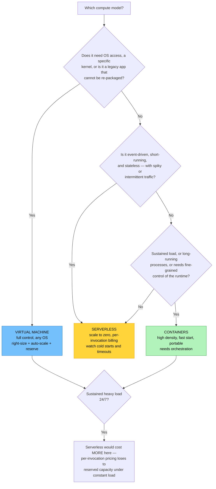
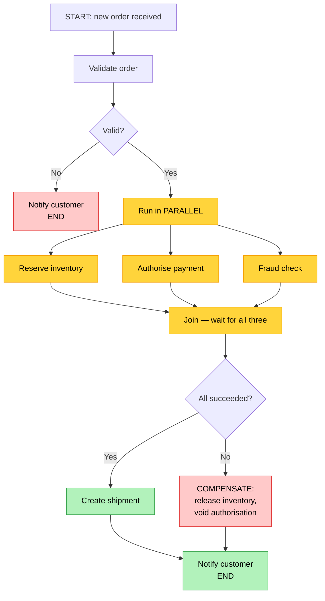

# Objective 1.10 — Compare and contrast methods for optimizing workloads using cloud resources

> **Domain 1.0 — Cloud Architecture (23% of exam)** · Exam CV0-004 V4 · Objectives doc v5.0
> **Status:** Exam-ready · **Version:** 2.0 (enhanced) · Supersedes `full notes/Objective-1.10-Optimizing-Workloads.md`

---

## 0. How to use this note

| Pass | What to read | Time |
|---|---|---|
| **1st (learn)** | Sections 1 → 9 in order | ~70 min |
| **2nd (drill)** | Section 2.2 (the five levers) + 5.3 (orchestration vs workflow) + 6.1 (latency vs throughput) | ~25 min |
| **3rd (test)** | Section 12 (practice) + Section 13 (PBQ drills) | ~30 min |
| **Exam eve** | Section 14 (60-second recall sheet) only | ~5 min |

> 📌 **1.10 is the Domain 1 capstone.** It re-asks 1.1 (serverless), 1.4 (IOPS/throughput), 1.5 (managed services), 1.6 (containers/orchestration), and 1.7 (VMs) as one question: *"given this workload, which option is best?"* If those objectives are solid, this one is mostly synthesis — but two things here are genuinely new: **orchestration vs workflow** (Section 5.3) and **latency vs throughput as independent dimensions** (Section 6.1).

---

## 1. Official objective coverage

> **1.10 Compare and contrast methods for optimizing workloads using cloud resources.**
> - **Compute resources**
>   - VM
>   - Container
>   - Serverless
> - Orchestration
> - Workflow
> - **Network**
>   - Latency
>   - Throughput
> - **Storage**
>   - Input/output operations per second (IOPS)
>   - Throughput
> - Managed services

### 1.1 What the verb tells you

**"Compare and contrast"** — the fourth and final use in Domain 1 (with 1.4, 1.6, 1.7). The contrast pairs that carry the marks:

- **VM vs container vs serverless**
- **orchestration vs workflow** ← the one people confuse
- **network latency vs network throughput**
- **storage IOPS vs storage throughput**
- **managed vs self-managed**

### 1.2 Coverage checklist

- [ ] I can pick VM, container, or serverless from a workload description
- [ ] I know the **limitations** of each compute model, not just the benefits
- [ ] I can state the difference between **orchestration** and **workflow** in one sentence
- [ ] I know latency and throughput are **independent** — and that adding bandwidth does not reduce latency
- [ ] I can name at least four techniques for reducing **latency** and four for raising **throughput**
- [ ] I know when a workload is **IOPS-bound** vs **throughput-bound**
- [ ] I can state the trade-off of adopting **managed services**
- [ ] I know to **measure and find the bottleneck before optimising**
- [ ] I can name the optimisation levers: right-size, scale, cache, distribute, offload, parallelise

---

## 2. The core mental model

### 2.1 ★ Measure first — find the actual bottleneck

```text
   ┌──────────────────────────────────────────────────────────────┐
   │  RULE ZERO: OPTIMISE THE BOTTLENECK, NOT THE OBVIOUS THING   │
   │                                                              │
   │  A system is only as fast as its slowest constrained         │
   │  resource. Improving anything else changes NOTHING.          │
   └──────────────────────────────────────────────────────────────┘

   THE FOUR CANDIDATE BOTTLENECKS

   ┌──────────┬──────────────────────────┬─────────────────────────┐
   │ RESOURCE │ SYMPTOM                  │ TYPICAL FIX             │
   ├──────────┼──────────────────────────┼─────────────────────────┤
   │ CPU      │ high utilisation, queued │ scale up/out, optimise  │
   │          │ runnable threads         │ code, offload           │
   ├──────────┼──────────────────────────┼─────────────────────────┤
   │ MEMORY   │ swapping, OOM kills,     │ add RAM, fix leaks,     │
   │          │ GC pressure              │ right-size              │
   ├──────────┼──────────────────────────┼─────────────────────────┤
   │ DISK I/O │ high queue depth, high   │ faster volume type,     │
   │          │ await, IOPS at the cap   │ more IOPS, caching      │
   ├──────────┼──────────────────────────┼─────────────────────────┤
   │ NETWORK  │ link saturated, retrans- │ more bandwidth, CDN,    │
   │          │ mits, high RTT           │ compression, move closer│
   └──────────┴──────────────────────────┴─────────────────────────┘

   ⚠ Adding CPU to a disk-bound database changes nothing except the bill.
```

**The workflow:** baseline → identify the constraint → change **one** thing → re-measure → repeat. Optimisation without measurement is guessing.

### 2.2 ★ The optimisation levers

Every technique in this objective is one of six moves:

```text
   ① RIGHT-SIZE     Match capacity to measured demand.
                    (Also 1.8 — the cheapest win, no architecture change)

   ② SCALE          UP (bigger) for stateful/simple; OUT (more) for
                    stateless/elastic. Auto-scaling makes it dynamic.

   ③ CACHE          Serve repeat work from memory instead of redoing it.
                    Application cache, CDN, database query cache, read
                    replicas. Usually the biggest win per unit of effort.

   ④ DISTRIBUTE     Move compute/data closer to the consumer.
                    Regions, edge, CDN, replicas, placement groups.

   ⑤ OFFLOAD        Hand work to the provider (managed services) or to a
                    specialised tier (queue, CDN, GPU, search engine).

   ⑥ PARALLELISE /  Do more at once, or amortise per-unit overhead.
      BATCH         Multiple streams, sharding, batching, async processing.
```

### 2.3 The compute spectrum

```text
   MORE CONTROL ◄──────────────────────────────────────► LESS CONTROL
   MORE OPS WORK                                      LESS OPS WORK
   SLOWER TO START                                    FASTER TO START

   ┌──────────────┐    ┌──────────────┐    ┌──────────────┐
   │      VM      │    │  CONTAINER   │    │  SERVERLESS  │
   ├──────────────┤    ├──────────────┤    ├──────────────┤
   │ own OS+kernel│    │ shares kernel│    │ no server at │
   │ GBs, seconds │    │ MBs, ms      │    │ all to you   │
   │ to boot      │    │ to start     │    │ ms, scale→0  │
   │ billed while │    │ billed while │    │ billed PER   │
   │ RUNNING      │    │ RUNNING      │    │ INVOCATION   │
   │ any workload │    │ stateless-   │    │ short,       │
   │ any OS       │    │ friendly     │    │ STATELESS,   │
   │              │    │              │    │ event-driven │
   └──────────────┘    └──────────────┘    └──────────────┘
   Idle cost: HIGH     Idle cost: MEDIUM    Idle cost: ZERO
   Density:   LOW      Density:   HIGH      Density:   N/A
```

---

## 3. Compute resources

### 3.1 Virtual machines

| | |
|---|---|
| **Optimise by** | **Right-sizing** the instance (vCPU, RAM, network tier) to measured demand · choosing the correct **instance family** (compute-optimised, memory-optimised, storage-optimised, GPU, burstable) · **auto-scaling** groups across AZs · **scheduling** non-production off-hours · reserved/spot purchasing (1.8) |
| **Strengths** | Runs anything — any OS, any legacy application, kernel-level control; strong isolation; predictable, dedicated performance; the lift-and-shift target |
| **★ Limitations** | Slowest to start (seconds to minutes) → **poor at absorbing sudden spikes**; lowest density; **you pay while it runs, idle or not**; you own OS patching and hardening |
| **Optimise for** | Steady, long-running, stateful workloads; legacy applications; anything needing OS control or specialised hardware |
| **Exam triggers** | "legacy application", "requires OS access", "steady predictable load", "specific kernel/driver", "lift and shift" |

**Instance family matching is an easy, high-value optimisation:** a memory-bound workload on a compute-optimised instance wastes CPU and starves on RAM. Match the family to the bottleneck (Section 2.1).

### 3.2 Containers

| | |
|---|---|
| **Optimise by** | **Small base images** (faster pulls, fewer CVEs) · accurate **resource requests and limits** so the scheduler can **bin-pack** densely · **horizontal pod autoscaling** on real metrics · cluster autoscaling for nodes · readiness probes so traffic only hits ready pods |
| **Strengths** | **Start in milliseconds** → excellent for elastic scaling; **high density** (hundreds per host) → far better hardware utilisation; portable and consistent across environments; fast rolling deployments |
| **★ Limitations** | Requires **orchestration** and the operational maturity that implies; **weaker isolation** than VMs (shared kernel — see 1.6/1.7); stateful workloads need deliberate design (StatefulSets, persistent volumes); still billed while running |
| **Optimise for** | Microservices, variable load, high-density workloads, anything needing fast rollout and rollback |
| **Exam triggers** | "microservices", "package with dependencies", "high density", "fast startup", "portable across environments", "scale quickly" |

> 💡 **The single biggest container optimisation is setting accurate requests and limits.** A pod requesting 256 MB but using 90 MB wastes two-thirds of its footprint — correcting it can let the same cluster run three times as many pods on the same nodes.

### 3.3 Serverless

| | |
|---|---|
| **Optimise by** | Keeping functions **short and single-purpose** · **right-sizing memory** (which usually also scales CPU, so more memory can be both *faster and cheaper*) · minimising package size and dependencies to cut cold starts · reusing connections and clients outside the handler · using provisioned concurrency for latency-critical paths |
| **Strengths** | **Scales to zero — no idle cost**; instant elastic scaling per request; no servers to patch or size; billed per invocation and GB-second |
| **★ Limitations** | **Cold-start latency**; **stateless only**; **maximum execution timeout** (commonly ~15 minutes); limited local disk; concurrency quotas; can **exhaust database connections** at scale (see 1.9); harder to debug; **more expensive than a VM under sustained heavy load** |
| **Optimise for** | Event-driven, spiky, intermittent, short-running work; glue between services; scheduled jobs; APIs with unpredictable traffic |
| **Exam triggers** | "event-driven", "unpredictable/bursty", "pay only when it runs", "no servers", "scale to zero", "runs for seconds" |

### 3.4 Choosing a compute model



---

## 4. Orchestration

| | |
|---|---|
| **Definition** | Automated **arrangement, coordination, and management of infrastructure and compute resources** as a single declared system. You declare a **desired state**; the orchestrator continuously **reconciles** actual state against it. |
| **What it optimises** | **Utilisation** (bin-packing many workloads onto fewer hosts) · **availability** (self-healing, rescheduling) · **elasticity** (automatic scale-out/in) · **consistency** (identical deployments, no manual drift) · **human time** (no one paged to restart a process) |
| **Two flavours** | **Container/workload orchestration** — Kubernetes, ECS, Nomad: schedules containers across nodes. **Infrastructure orchestration** — Terraform, CloudFormation, Bicep, Ansible: provisions and configures the underlying resources (see 2.5) |
| **★ Costs** | Significant platform complexity — a control plane, networking and storage plugins, RBAC, monitoring, and the skills to run them |
| **Exam triggers** | "desired state", "maintain N replicas", "automatically restart failed workloads", "reschedule to a healthy node", "bin-pack for utilisation", "manage many containers across hosts" |

**How orchestration optimises cost:** bin-packing. Given accurate resource requests, the scheduler packs workloads densely onto fewer nodes, and a cluster autoscaler removes nodes that are no longer needed. Manual placement almost always leaves capacity stranded.

---

## 5. Workflow

| | |
|---|---|
| **Definition** | Automation of a **multi-step process** in which each step's output feeds the next, with built-in **sequencing, branching, parallelism, retries, error handling, and state tracking**. Often called workflow orchestration, a state machine, or a pipeline. |
| **What it optimises** | Removes manual hand-offs and fragile scripts; **retries transient failures automatically**; **runs independent steps in parallel** to cut total duration; gives **visibility** into where a process is and why it failed; keeps state so a long process survives restarts |
| **Patterns** | Sequential steps · **parallel branches (fan-out/fan-in)** · conditional branching · loops · **retry with exponential backoff** · error/catch handlers · **compensating transactions (saga)** · human approval steps · timeouts |
| **Implementations** | Managed workflow/state-machine services, Apache Airflow, Argo Workflows, Temporal, CI/CD pipelines |
| **Exam triggers** | "multi-step process", "each step feeds the next", "retry failed steps automatically", "ETL pipeline", "approval step", "orchestrate a business process", "visibility into which step failed" |

### 5.1 A workflow, visualised



**Where the optimisation is:** the three middle steps run **in parallel**, so total duration is the slowest one rather than the sum of all three. Failures trigger **compensation** rather than leaving the order half-processed, and transient failures retry without human involvement.

### 5.2 Orchestration vs workflow — ★ the key contrast

```text
   ORCHESTRATION                        WORKFLOW
   "keep these RESOURCES in the         "run these STEPS in the
    state I declared"                    right order"
   ┌──────────────────────────┐         ┌──────────────────────────┐
   │  DESIRED: 5 replicas     │         │  Step 1 → Step 2 → Step 3│
   │  ACTUAL:  4 replicas     │         │           ↓ (on failure) │
   │  ACTION:  start 1 more   │         │        retry / branch    │
   │  ...then check again,    │         │           ↓              │
   │  forever                 │         │        Step 4 → END      │
   └──────────────────────────┘         └──────────────────────────┘
   CONTINUOUS reconciliation            A PROCESS with a beginning
   loop — never "finishes"              and an end — it COMPLETES
   Subject: INFRASTRUCTURE              Subject: TASKS / BUSINESS
            and workloads                        LOGIC
   State: desired vs actual             State: which step am I on?
   Kubernetes, ECS, Terraform           Step Functions, Airflow,
                                        Logic Apps, Argo Workflows
```

| Aspect | **Orchestration** | **Workflow** |
|---|---|---|
| Manages | **Resources** — containers, VMs, infrastructure | **Tasks/steps** in a process |
| Model | **Declarative desired state**, continuously reconciled | **Sequence/graph of steps** with transitions |
| Lifecycle | **Never completes** — runs forever | **Has a start and an end** — it finishes |
| Core question | "Does actual match desired?" | "Which step is next?" |
| Failure handling | Restart/reschedule the resource | **Retry the step**, branch, or compensate |
| Optimises | Utilisation, availability, elasticity | Process duration, reliability, visibility |
| Typical tools | Kubernetes, ECS, Terraform | Step Functions, Airflow, Temporal, Argo |

> ★ **The one-sentence discriminator:** **orchestration keeps resources in a desired state; workflow moves a process through a sequence of steps.** If the scenario says "maintain N replicas" it is orchestration. If it says "after step A completes, do step B" it is workflow.

---

## 6. Network optimisation

### 6.1 ★ Latency vs throughput — independent dimensions

```text
   THINK OF A PIPE

   LATENCY = how long the FIRST drop takes to arrive  ── the LENGTH
   THROUGHPUT = how much water flows per second       ── the WIDTH

   ┌────────────────────────────────────────────────────────────────┐
   │  ═══════════════════════  short + wide  → fast AND high volume │
   │  ══════════════════════════════════════  long + wide  → high   │
   │                                          volume but slow start │
   │  ═                        short + narrow → responsive but      │
   │                                            low volume          │
   └────────────────────────────────────────────────────────────────┘

   ★ ADDING BANDWIDTH DOES NOT REDUCE LATENCY.
     A 100 Gbps link to another continent still has ~150 ms RTT.
     Latency is bounded by PHYSICS: light travels ~200,000 km/s in
     fibre → ~5 ms per 1,000 km ONE WAY, ~10 ms ROUND TRIP.
     The ONLY way to cut it is to SHORTEN THE DISTANCE.
```

| | **Latency** | **Throughput** |
|---|---|---|
| Measures | **Delay per operation** (ms) | **Volume per second** (Mbps/Gbps) |
| Bounded by | **Distance / physics**, hops, processing | Link capacity, protocol efficiency, congestion |
| Hurts | Interactive apps, chatty protocols, real-time | Bulk transfer, backups, replication, video |
| Fix by | **Move closer** — CDN, edge, region choice, fewer round trips | **Widen the pipe** — bigger link, parallel streams, compression |
| Symptom | "The app feels sluggish" | "The nightly backup doesn't finish in the window" |

**The bandwidth-delay product — why a fast link can still transfer slowly:**

```text
   BDP = bandwidth × round-trip time
       = how much data must be "IN FLIGHT" to keep the link full

   Example: 1 Gbps link, 150 ms RTT
            = 1,000,000,000 bits/s × 0.15 s ÷ 8 = ~18.75 MB in flight

   A single TCP stream with a small window cannot keep 18.75 MB
   outstanding → the link sits mostly IDLE even though it is "1 Gbps".

   FIX: TCP window scaling, or MULTIPLE PARALLEL STREAMS.
   ★ This is why a single-threaded copy across a continent is slow on
     a fat link, and why parallel transfer tools are dramatically faster.
```

### 6.2 Reducing latency

| Technique | How it helps |
|---|---|
| **CDN / edge caching** | Serves content from a PoP near the user — removes the round trip to origin entirely |
| **Choose a closer region** | The single biggest lever; distance is the dominant term |
| **Edge computing** | Run the logic near the data source (see 1.2) |
| **Reduce round trips** | Batch requests, use HTTP/2 multiplexing or gRPC, avoid chatty APIs |
| **Connection reuse / keep-alive** | Avoids a new TCP + TLS handshake (2–3 RTTs) per request |
| **Caching (any layer)** | The fastest request is the one never made |
| **Placement groups** | Physically co-locate instances that talk to each other constantly |
| **Enhanced networking / SR-IOV** | Lower per-packet latency and jitter (see 1.7) |
| **Anycast / global load balancing** | Routes users to the nearest healthy endpoint |

### 6.3 Raising throughput

| Technique | How it helps |
|---|---|
| **Larger instance/network tier** | Instance network bandwidth is tiered by size |
| **Dedicated connection** | Guaranteed bandwidth vs best-effort internet (see 1.3) |
| **Parallel streams / multipart transfer** | Overcomes single-stream BDP limits |
| **Compression** | Trades CPU for bytes on the wire |
| **Jumbo frames (MTU 9000)** | Fewer packets, less per-packet overhead — for bulk transfer inside a VPC |
| **Batching** | Amortises per-request overhead across many records |
| **Protocol choice** | HTTP/2, gRPC, QUIC reduce overhead versus HTTP/1.1 |
| **Offload to a CDN** | Removes bulk read traffic from the origin link entirely |

> ⚠️ **Watch for the wrong-lever distractor.** "Users on another continent report slow page loads" is a **latency** problem — upgrading bandwidth will not help. "The nightly 2 TB backup misses its window" is a **throughput** problem — a CDN will not help.

---

## 7. Storage optimisation

### 7.1 IOPS vs throughput

Same distinction as 1.4, framed as optimisation actions:

| | **IOPS** | **Throughput** |
|---|---|---|
| Measures | Operations per second | MB/s |
| Bound by | Many **small, random** operations | Few **large, sequential** transfers |
| Typical workload | Databases, OLTP, VDI, boot storms | Backups, analytics scans, media, log shipping |
| Symptom | High disk **queue depth**, slow queries, rising latency at the same MB/s | Transfer rate flatlines at a ceiling while IOPS is low |
| Optimise by | **Provisioned-IOPS SSD**, more IOPS, caching, better indexes, smaller working set | **Throughput-optimised volume**, larger block size, parallel streams, striping |

`Throughput (MB/s) = IOPS × block size (KB) ÷ 1024`

### 7.2 Storage optimisation techniques

| Technique | When |
|---|---|
| **Match the volume type to the access pattern** | Random → SSD; large sequential → throughput-optimised HDD (cheaper and adequate) |
| **Provision IOPS/throughput independently of size** | Modern volume types decouple performance from capacity — no need to over-buy size for speed |
| **Add a cache layer** | Removes repeat reads from storage entirely — usually the cheapest win |
| **Tune block size** | Match the application's I/O size; mismatches waste both IOPS and throughput |
| **Increase queue depth / parallelism** | A low queue depth cannot saturate a fast device |
| **Use local/ephemeral NVMe for scratch** | Fastest option where persistence is unnecessary (see 1.6) |
| **Tier cold data** | Move inactive data off expensive fast storage (see 1.4) |
| **Watch burst credits** | Burstable volumes drop to a much lower baseline once credits are exhausted |

---

## 8. Managed services

| | |
|---|---|
| **Definition** | Offerings where the **provider operates** the software — provisioning, patching, HA, backups, scaling — while you configure and consume it (see 1.5). |
| **How it optimises workloads** | Removes **undifferentiated operational work**; delivers provider-grade HA and scaling **by default**; frees engineering time for product work; often more efficient at scale than a self-run equivalent; reduces the risk of human error in patching and backups |
| **★ Trade-offs** | **Vendor lock-in**; **less control** and limited tuning; **service quotas** you cannot exceed; a **management premium** in the price; you inherit the provider's maintenance windows and outages |
| **Common substitutions** | Self-run database → **DBaaS** · self-run broker → **managed queue/topic** · self-run Redis → **managed cache** · self-run Kubernetes → **managed control plane** · self-run ELK → **managed logging/monitoring** · self-run auth → **managed identity** |
| **Exam triggers** | "reduce operational overhead", "no staff to run it", "provider handles patching and backups", "focus on the application", "built-in high availability" |

> 💡 **Managed services are an optimisation of *engineering time*, not necessarily of *cost*.** They usually cost more per hour and less per outcome. If a question emphasises a small team, speed to market, or reliability, managed is the answer; if it emphasises deep control or an unsupported version, it is not.

---

## 9. Comparison tables

### 9.1 ★ VM vs container vs serverless

| Aspect | **VM** | **Container** | **Serverless** |
|---|---|---|---|
| Unit | A whole machine | A process + dependencies | A function |
| Isolation | **Strongest** (own kernel) | Process-level (shared kernel) | Provider-managed |
| Start time | **Seconds–minutes** | **Milliseconds** | Milliseconds (+ **cold start**) |
| Density | Low (tens/host) | **High (hundreds/host)** | N/A |
| **Idle cost** | **High** | Medium | **ZERO — scales to zero** |
| Billing | Instance-hours | Instance-hours (of the nodes) | **Per invocation + GB-second** |
| Max runtime | Unlimited | Unlimited | **Limited (~15 min)** |
| State | Any | Any (with volumes) | **Stateless only** |
| OS control | **Full** | None (shares host kernel) | None |
| Scaling speed | Slow | Fast | **Instant, per request** |
| Ops burden | **Highest** | High (needs orchestration) | **Lowest** |
| Best for | Legacy, stateful, OS-specific, steady load | Microservices, variable load, density | Event-driven, spiky, short tasks |
| Worst for | Spiky traffic, high density | Workloads needing hard isolation | Long-running, stateful, **sustained heavy load** |

### 9.2 Symptom → optimisation lever

| Symptom | Lever |
|---|---|
| Instances at 10% CPU all month | **Right-size** (1.8) |
| Traffic spikes overwhelm a fixed fleet | **Auto-scale horizontally** |
| Same expensive query runs thousands of times | **Cache** |
| Overseas users report slow page loads | **CDN / closer region** — a **latency** fix |
| Nightly bulk transfer misses its window | **Throughput** — parallel streams, compression, bigger link |
| Database slow with high disk queue depth | **More IOPS / provisioned-IOPS SSD** |
| Analytics scan limited by MB/s | **Throughput-optimised volume, larger blocks** |
| Team spends all its time patching a database | **Managed service** |
| Containers crash and nobody notices | **Orchestration** (self-healing) |
| A 5-step nightly job breaks and must be re-run by hand | **Workflow engine** with retries |
| Cluster nodes are half-empty | **Orchestration bin-packing + accurate requests** |
| Function is idle 23 hours a day but billed 24 | **Serverless** (scale to zero) |
| Serverless costs exceed a VM at constant load | **Move back to VM/container with reserved capacity** |

### 9.3 Multi-cloud mapping

| Concept | AWS | Azure | Google Cloud |
|---|---|---|---|
| VM | EC2 | Virtual Machines | Compute Engine |
| Container orchestration | ECS, **EKS** | **AKS**, Container Apps | **GKE**, Cloud Run |
| Serverless functions | **Lambda** | **Azure Functions** | **Cloud Functions** |
| **Workflow** | **Step Functions** | **Logic Apps**, Durable Functions | **Workflows**, Cloud Composer |
| Infrastructure orchestration | CloudFormation, CDK | Bicep, ARM | Deployment Manager |
| CDN (latency) | CloudFront | Front Door / CDN | Cloud CDN |
| Dedicated bandwidth | Direct Connect | ExpressRoute | Cloud Interconnect |
| Provisioned IOPS | EBS io2 | Ultra Disk / Premium SSD v2 | Extreme PD |
| Throughput-optimised | EBS st1 | Standard HDD | Balanced/Standard PD |
| Managed cache | ElastiCache | Cache for Redis | Memorystore |
| Right-sizing advisor | Compute Optimizer | Azure Advisor | Recommender |

---

## 10. Exam traps & distractor patterns

| # | Trap | The truth |
|---|---|---|
| 1 | "Serverless is always cheapest" | Under **sustained heavy load** a reserved VM or container is cheaper. Serverless wins on **spiky/idle** patterns |
| 2 | "Containers are always better than VMs" | VMs win for **legacy apps, OS control, and hard isolation** (see 1.6/1.7) |
| 3 | "Adding bandwidth reduces latency" | **No.** Latency is bounded by distance and hops. Only moving closer (CDN, edge, region) reduces it |
| 4 | "More IOPS fixes a slow bulk transfer" | Bulk sequential work is **throughput**-bound. More IOPS changes nothing |
| 5 | "Orchestration and workflow are the same" | Orchestration keeps **resources** in a desired state, continuously. Workflow moves a **process** through steps and completes |
| 6 | "Scale up first when performance is poor" | **Measure first.** Scaling CPU on a disk-bound system changes only the bill |
| 7 | "Managed services always reduce cost" | They reduce **operational effort**. Per-hour price usually **increases** |
| 8 | "Managed services have no downside" | **Lock-in, less control, quotas, provider maintenance windows** |
| 9 | "Serverless has no limits" | **Cold starts, ~15-minute timeout, stateless only, concurrency quotas**, and database connection exhaustion |
| 10 | "Auto-scaling solves everything" | It cannot fix a **stateful** app that can't scale out, and it reacts with a lag — scheduled or predictive scaling handles known spikes better |
| 11 | "A 10 Gbps link means 10 Gbps of transfer" | A single TCP stream over a high-**BDP** path leaves the link mostly idle. Use parallel streams or window scaling |
| 12 | "Bin-packing happens automatically" | Only with **accurate resource requests**. Over-requesting strands capacity |
| 13 | "Caching is a last resort" | It is usually the **cheapest, highest-impact** optimisation available |
| 14 | "Vertical scaling is unlimited" | It has a **hard ceiling** and usually requires downtime; horizontal is the elastic path |
| 15 | "More memory for a function is always more expensive" | Memory often scales CPU too, so the function may finish **fast enough to cost less** overall |

**Disambiguation drill:**

| Pair | The deciding question |
|---|---|
| **VM vs container** | Does it need **its own OS/kernel** or hard isolation? |
| **Container vs serverless** | Is it **long-running/sustained** (container) or **short and event-driven** (serverless)? |
| **Orchestration vs workflow** | Maintaining **resources** in a state, or sequencing **steps** to completion? |
| **Latency vs throughput** | "Feels slow" (latency) vs "doesn't finish in time" (throughput) |
| **IOPS vs throughput** | Many **small random** ops vs few **large sequential** transfers |
| **Managed vs self-managed** | Is **control** worth the operational cost? |
| **Scale up vs out** | Stateful/simple (up, with a ceiling) vs stateless/elastic (out) |

---

## 11. Keyword → answer trigger table

| If you see… | Think |
|---|---|
| legacy app · OS access · specific kernel · steady long-running · lift and shift | **VM** |
| microservices · high density · fast start · portable · variable load | **Container** |
| event-driven · bursty · idle most of the time · pay per execution · scale to zero | **Serverless** |
| sustained 24/7 heavy load, serverless bill is high | **Move to reserved VM/container** |
| desired state · maintain N replicas · self-healing · reschedule · bin-pack | **Orchestration** |
| multi-step process · step B after step A · retry failed steps · ETL pipeline · approval step · which step failed | **Workflow** |
| users far away report slow loads · reduce round trips · responsiveness | **Latency → CDN, edge, closer region** |
| backup misses the window · bulk transfer too slow · saturated link | **Throughput → parallel streams, compression, bigger link** |
| fast link but slow single transfer across a long distance | **Bandwidth-delay product → parallel streams / window scaling** |
| database slow, high disk queue depth, small random reads | **IOPS → provisioned-IOPS SSD** |
| analytics scan capped at MB/s, large sequential reads | **Storage throughput → throughput-optimised volume** |
| no staff to patch it · reduce operational overhead · built-in HA | **Managed services** |
| repeated identical requests · reduce load and latency at once | **Caching** |
| nodes half-empty · poor utilisation | **Bin-packing with accurate requests** |
| performance is poor, cause unknown | **Measure first — find the bottleneck** |
| known daily traffic pattern | **Scheduled (or predictive) scaling** |

---

## 12. Practice questions

<details>
<summary><b>Q1.</b> An image-processing task runs for about three seconds whenever a file is uploaded. Upload volume is unpredictable and often zero for hours. Which compute model is MOST cost-effective?</summary>

A. A dedicated VM · B. A container running continuously · **C. Serverless functions** · D. A bare-metal server

**Correct: C — serverless.** Event-driven, short-running, and idle-heavy is the profile where scale-to-zero and per-invocation billing win decisively.
- **A/B wrong:** Both bill continuously while idle.
- **D wrong:** Even more idle cost with no elasticity.
</details>

<details>
<summary><b>Q2.</b> What is the PRIMARY difference between orchestration and workflow?</summary>

A. Orchestration is manual; workflow is automated · **B. Orchestration continuously reconciles resources against a declared desired state, while a workflow sequences tasks through a process that starts and completes** · C. They are interchangeable terms · D. Workflow manages containers; orchestration manages functions

**Correct: B.** Orchestration never "finishes" — it keeps checking. A workflow has a beginning and an end.
- **A wrong:** Both are automated.
- **C wrong:** The distinction is the core contrast of this objective.
- **D wrong:** Orchestration is what manages containers.
</details>

<details>
<summary><b>Q3.</b> Users in Asia report slow page loads from an application hosted only in North America. The link is far from saturated. What will MOST improve their experience?</summary>

A. Upgrade to a higher-bandwidth connection · **B. Deploy a CDN with edge locations near the users, or add a regional deployment** · C. Increase storage IOPS · D. Add more application server CPU

**Correct: B.** This is a **latency** problem caused by distance. Serving from a nearby edge or region is the only way to shorten it.
- **A wrong:** Bandwidth does not reduce latency — the link is already under-used.
- **C/D wrong:** Neither addresses geographic round-trip time.
</details>

<details>
<summary><b>Q4.</b> A nightly 2 TB database backup fails to finish inside its maintenance window. The link is saturated throughout. What should be addressed?</summary>

A. Latency · **B. Throughput** · C. IOPS · D. Cold starts

**Correct: B — throughput.** Bulk sequential transfer is bandwidth-bound; remedies include a larger link, compression, parallel streams, or a dedicated connection.
- **A wrong:** Latency affects responsiveness, not bulk-transfer volume.
- **C wrong:** IOPS constrains small random operations.
- **D wrong:** Cold starts are a serverless concern.
</details>

<details>
<summary><b>Q5.</b> A transactional database shows high disk queue depth and rising query latency, while its measured MB/s is low. What is the constraint?</summary>

**A. IOPS** · B. Storage throughput · C. Network latency · D. Memory

**Correct: A — IOPS.** Many small random operations with a deep queue and low MB/s is the classic IOPS-bound signature; move to a provisioned-IOPS SSD or add caching.
- **B wrong:** Low MB/s shows throughput is not the ceiling.
- **C wrong:** The bottleneck is at the storage layer.
- **D wrong:** Memory pressure would show as swapping or OOM behaviour.
</details>

<details>
<summary><b>Q6.</b> A five-stage nightly ETL job is implemented as a chain of cron scripts. When one stage fails, an engineer must manually determine where it stopped and re-run it. What is the BEST improvement?</summary>

A. Move it to larger VMs · **B. Implement it in a workflow service with retries, branching, and step-level state tracking** · C. Add a container orchestrator · D. Increase storage IOPS

**Correct: B.** Workflow engines provide sequencing, automatic retry of transient failures, error handling, and visibility into exactly which step failed.
- **A wrong:** Sizing is not the problem.
- **C wrong:** Orchestration manages resources, not process steps.
- **D wrong:** Nothing indicates a storage constraint.
</details>

<details>
<summary><b>Q7.</b> A workload runs continuously at high, steady load 24/7. It is currently on serverless functions and the bill is very high. What should be done?</summary>

A. Increase the function memory · **B. Move it to containers or VMs with reserved capacity** · C. Add more concurrency · D. Move to a workflow service

**Correct: B.** Per-invocation pricing is efficient for spiky, idle-heavy work; under constant load, committed capacity is far cheaper.
- **A wrong:** More memory raises per-invocation cost here.
- **C wrong:** More concurrency increases spend.
- **D wrong:** Workflow addresses process sequencing, not compute pricing.
</details>

<details>
<summary><b>Q8.</b> Application performance is poor, but the team does not know why. What should they do FIRST?</summary>

**A. Measure to identify which resource is the bottleneck** · B. Double the instance size · C. Add a CDN · D. Migrate to serverless

**Correct: A.** Optimising anything other than the actual constraint changes nothing except cost.
- **B/C/D wrong:** All are plausible fixes for *specific* bottlenecks, but choosing one before measuring is guesswork.
</details>

<details>
<summary><b>Q9.</b> A Kubernetes cluster's nodes are consistently half empty, yet the platform team keeps adding nodes. What is the MOST likely cause?</summary>

A. Insufficient storage IOPS · **B. Pods request far more CPU/memory than they actually use, so the scheduler cannot bin-pack efficiently** · C. Network latency between nodes · D. Missing workflow engine

**Correct: B.** The scheduler places pods by their **requests**; over-requesting strands capacity and forces unnecessary nodes.
- **A/C wrong:** Neither affects scheduling density.
- **D wrong:** Workflow is unrelated to pod placement.
</details>

<details>
<summary><b>Q10.</b> A single-stream file transfer over a 10 Gbps intercontinental link achieves only a fraction of the available bandwidth. What explains this?</summary>

A. The link is oversubscribed · **B. The bandwidth-delay product is large, so one TCP stream with a limited window cannot keep enough data in flight** · C. Storage IOPS is too low · D. The CDN is misconfigured

**Correct: B.** On a high-bandwidth, high-latency path a single stream leaves the link idle; parallel streams or TCP window scaling fix it.
- **A wrong:** Possible, but the described pattern is the classic BDP symptom.
- **C wrong:** Nothing indicates a storage limit.
- **D wrong:** CDNs cache content; they do not accelerate a point-to-point bulk transfer.
</details>

<details>
<summary><b>Q11.</b> Which optimisation is BEST when the same expensive database query is executed thousands of times per minute with unchanged results?</summary>

A. Add more application servers · **B. Introduce a caching layer** · C. Increase network bandwidth · D. Shard the database

**Correct: B.** Caching removes the repeated work entirely, cutting both latency and database load — typically the cheapest, highest-impact optimisation available.
- **A wrong:** More servers would issue *more* identical queries.
- **C wrong:** Bandwidth is not the constraint.
- **D wrong:** Sharding addresses write scaling and adds significant complexity.
</details>

<details>
<summary><b>Q12.</b> A team wants to reduce the time spent patching, backing up, and failing over its message broker. Which method applies?</summary>

A. Container orchestration · B. Workflow automation · **C. Adopt a provider-managed messaging service** · D. Increase IOPS

**Correct: C.** Managed services offload operational work to the provider, at the cost of some control and increased lock-in.
- **A wrong:** Orchestration would still leave them running the broker.
- **B/D wrong:** Neither addresses operational burden.
</details>

<details>
<summary><b>Q13.</b> Which characteristic makes containers well suited to workloads with rapidly varying demand?</summary>

A. They provide stronger isolation than VMs · **B. They start in milliseconds and pack densely, so capacity can be added and removed very quickly** · C. They run without an operating system · D. They eliminate the need for monitoring

**Correct: B.** Fast start plus high density is exactly what elastic scaling needs.
- **A wrong:** VMs isolate more strongly.
- **C wrong:** They share the host kernel — an OS is still involved.
- **D wrong:** Monitoring becomes more important, not less.
</details>

<details>
<summary><b>Q14.</b> Which scenario BEST justifies choosing a VM over a container or serverless function?</summary>

A. A short event-driven task · B. A stateless microservice with variable load · **C. A legacy application requiring a specific kernel module and full OS control** · D. A workload that must scale to zero

**Correct: C.** OS and kernel-level requirements can only be met by a virtual machine.
- **A wrong:** That is the serverless profile.
- **B wrong:** That is the container profile.
- **D wrong:** Only serverless scales to zero.
</details>

<details>
<summary><b>Q15.</b> A workflow contains three independent validation steps that currently run one after another, taking 90 seconds total. How can total duration be reduced?</summary>

A. Increase instance size · **B. Run the three independent steps in parallel, so total time equals the slowest step rather than the sum** · C. Add retries · D. Move to a larger storage volume

**Correct: B.** Parallel branches (fan-out/fan-in) are the primary duration optimisation in workflow design.
- **A wrong:** The steps are sequenced, not resource-constrained.
- **C wrong:** Retries improve reliability, not duration.
- **D wrong:** Storage is not indicated as the constraint.
</details>

<details>
<summary><b>Q16.</b> Which is a genuine DRAWBACK of adopting managed services for optimisation?</summary>

A. Reduced availability · **B. Increased vendor lock-in, less configuration control, and service quotas that cannot be exceeded** · C. More patching work for the customer · D. Loss of data durability

**Correct: B.** Managed services trade control and portability for reduced operational effort.
- **A/D wrong:** Both typically improve.
- **C wrong:** Patching is exactly what is removed.
</details>

<details>
<summary><b>Q17.</b> An analytics workload performs large sequential reads and is limited at a fixed MB/s ceiling while IOPS remains low. Which storage change helps MOST?</summary>

A. Provisioned-IOPS SSD · **B. A throughput-optimised volume type, larger block sizes, or parallel reads** · C. More instance memory · D. A CDN

**Correct: B.** Sequential scans are throughput-bound; buying IOPS would be paying for the wrong dimension.
- **A wrong:** IOPS is not the constraint here.
- **C wrong:** Memory would help caching but does not raise the storage ceiling.
- **D wrong:** CDNs cache web content.
</details>

<details>
<summary><b>Q18.</b> Which statement about serverless memory configuration is CORRECT?</summary>

A. Memory has no effect on cost · **B. Allocating more memory often increases CPU proportionally, so a function may complete fast enough to cost the same or less** · C. Memory always doubles the cost · D. Memory affects only cold starts

**Correct: B.** Because billing is memory × duration, a larger allocation that shortens execution can be cost-neutral or cheaper — a genuinely counter-intuitive optimisation.
- **A wrong:** Memory is a billing dimension.
- **C wrong:** Cost depends on duration as well.
- **D wrong:** It affects runtime performance generally.
</details>

<details>
<summary><b>Q19.</b> A retail platform experiences a predictable traffic surge every weekday at 09:00. Reactive auto-scaling lags and users see errors for several minutes. What is the BEST improvement?</summary>

A. Increase the scaling cooldown · **B. Add scheduled (or predictive) scaling to pre-warm capacity before the known surge** · C. Move to a workflow engine · D. Add storage IOPS

**Correct: B.** Reactive scaling responds *after* the metric crosses a threshold; a known, recurring pattern should be pre-provisioned on a schedule.
- **A wrong:** A longer cooldown makes it slower still.
- **C/D wrong:** Neither addresses compute capacity timing.
</details>

<details>
<summary><b>Q20.</b> Which method keeps a specified number of container replicas running, restarting and rescheduling them automatically when they fail?</summary>

A. Workflow · **B. Orchestration** · C. Caching · D. Right-sizing

**Correct: B — orchestration.** Continuous reconciliation of desired versus actual state is exactly this behaviour.
- **A wrong:** Workflow sequences process steps.
- **C/D wrong:** Neither manages running resources.
</details>

<details>
<summary><b>Q21.</b> A team doubles the CPU of a database server, but performance is unchanged. Disk queue depth remains very high. What went wrong?</summary>

A. They needed more network bandwidth · **B. They optimised a resource that was not the bottleneck — the constraint is disk I/O** · C. The database needs a workflow engine · D. CPU scaling requires a restart

**Correct: B.** A system runs at the speed of its constrained resource; changing anything else only adds cost.
- **A wrong:** Nothing indicates a network constraint.
- **C wrong:** Irrelevant to a resource bottleneck.
- **D wrong:** A restart would not change the outcome.
</details>

<details>
<summary><b>Q22.</b> Which pairing of optimisation method to goal is INCORRECT?</summary>

A. CDN → reduce latency for distant users · B. Provisioned IOPS → improve random small-I/O performance · **C. Increasing bandwidth → reduce round-trip latency** · D. Managed services → reduce operational overhead

**Correct: C.** Bandwidth raises throughput; latency is bounded by distance and hops and can only be reduced by moving closer or removing round trips.
- **A/B/D wrong:** All three pairings are correct.
</details>

<details>
<summary><b>Q23.</b> Which workload characteristic makes serverless a POOR fit?</summary>

A. Unpredictable traffic · B. Short execution time · **C. A long-running stateful process that must execute for several hours** · D. Event-driven triggers

**Correct: C.** Serverless functions are stateless and time-limited (commonly around 15 minutes), so multi-hour stateful processing does not fit.
- **A/B/D wrong:** All three are ideal serverless characteristics.
</details>

<details>
<summary><b>Q24.</b> An organisation wants to improve utilisation across a fleet of hosts running many small services. Which method addresses this MOST directly?</summary>

A. Vertical scaling · **B. Container orchestration with accurate resource requests, enabling dense bin-packing** · C. A workflow engine · D. Increasing network MTU

**Correct: B.** The scheduler packs workloads onto fewer hosts when requests reflect real usage, and a cluster autoscaler removes surplus nodes.
- **A wrong:** Bigger hosts do not improve packing efficiency.
- **C wrong:** Workflow sequences tasks.
- **D wrong:** MTU affects bulk transfer efficiency, not host utilisation.
</details>

<details>
<summary><b>Q25.</b> Which set correctly matches each dimension to its unit and the workload it constrains?</summary>

A. Latency in MB/s for bulk transfer; throughput in ms for interactive apps · **B. Latency in milliseconds constraining interactive/chatty workloads; throughput in MB/s or Gbps constraining bulk transfer** · C. Both measured in IOPS · D. Both are unrelated to workload type

**Correct: B.** Latency is delay per operation; throughput is volume per unit time. They are independent dimensions with different remedies.
- **A wrong:** The units are swapped.
- **C/D wrong:** IOPS is a storage operation metric, and both dimensions are workload-specific.
</details>

---

## 13. PBQ-style drills

### Drill A — Pick the compute model

| # | Workload | VM / Container / Serverless? |
|---|---|---|
| 1 | Thumbnail generation triggered on upload, bursty | |
| 2 | 20-year-old ERP needing a specific kernel version | |
| 3 | 40 stateless microservices with variable load | |
| 4 | Batch job that runs for four hours nightly | |
| 5 | Webhook receiver, a few hundred calls a day | |
| 6 | High-traffic API at constant load 24/7 | |

<details><summary>Answers</summary>

1 → **Serverless** (event-driven, short, bursty)
2 → **VM** (kernel/OS control)
3 → **Containers** (density, fast scaling, portability)
4 → **VM or container** — **not serverless** (exceeds the ~15-minute limit)
5 → **Serverless** (idle most of the day, scale to zero)
6 → **Container or VM with reserved capacity** — serverless would cost more at constant load
</details>

### Drill B — Orchestration or workflow?

| # | Requirement | Which? |
|---|---|---|
| 1 | Keep five replicas running; replace any that crash | |
| 2 | Validate → transform → load → notify, with retries | |
| 3 | Reschedule pods off a failed node automatically | |
| 4 | Pause for a manager's approval, then continue | |
| 5 | Bin-pack workloads onto the fewest possible nodes | |
| 6 | Run three checks in parallel, then join and decide | |

<details><summary>Answers</summary>

1 → **Orchestration** · 2 → **Workflow** · 3 → **Orchestration** · 4 → **Workflow** · 5 → **Orchestration** · 6 → **Workflow**

**The test:** maintaining *resources* in a state = orchestration. Sequencing *steps* to completion = workflow.
</details>

### Drill C — Latency or throughput?

| # | Symptom | Which, and the fix? |
|---|---|---|
| 1 | Users in another continent see 300 ms page loads | |
| 2 | A 5 TB dataset copy takes 14 hours | |
| 3 | A chatty API makes 40 sequential calls per page | |
| 4 | Video streaming buffers during peak hours | |
| 5 | A 10 Gbps link achieves 200 Mbps on one transfer | |

<details><summary>Answers</summary>

1 → **Latency** → CDN, edge, closer region
2 → **Throughput** → parallel/multipart transfer, compression, dedicated connection
3 → **Latency** (amplified by round trips) → batch the calls, HTTP/2 multiplexing, caching
4 → **Throughput** → CDN offload, higher bandwidth, adaptive bitrate
5 → **Latency-limited throughput (BDP)** → parallel streams or TCP window scaling
</details>

### Drill D — Name the bottleneck and the lever

| # | Observation | Bottleneck + lever? |
|---|---|---|
| 1 | CPU at 95%, disk idle, memory fine | |
| 2 | Disk queue depth 40, CPU 20%, low MB/s | |
| 3 | Host swapping, frequent OOM kills | |
| 4 | Link saturated, CPU idle | |
| 5 | Instances at 9% CPU all month | |
| 6 | Same 200 records fetched thousands of times per minute | |

<details><summary>Answers</summary>

1 → **CPU-bound** → scale up/out, optimise code, offload work
2 → **IOPS-bound** → provisioned-IOPS SSD, caching, better indexes
3 → **Memory-bound** → add RAM, fix leaks, right-size (see 1.7)
4 → **Network throughput-bound** → more bandwidth, compression, CDN offload
5 → **Over-provisioned** → right-size (see 1.8)
6 → **Repeated work** → caching
</details>

---

## 14. 60-second recall sheet

```text
╔══════════════════════════════════════════════════════════════════════╗
║  1.10 — OPTIMIZING WORKLOADS  (the Domain 1 capstone)                ║
╠══════════════════════════════════════════════════════════════════════╣
║  ★ RULE ZERO: MEASURE FIRST. Optimise the BOTTLENECK, not the        ║
║    obvious thing. Candidates: CPU · MEMORY · DISK I/O · NETWORK      ║
║  SIX LEVERS: RIGHT-SIZE · SCALE (up/out) · CACHE · DISTRIBUTE ·      ║
║              OFFLOAD (managed) · PARALLELISE/BATCH                   ║
╠══════════════════════════════════════════════════════════════════════╣
║  COMPUTE                                                             ║
║   VM         own kernel · seconds to boot · any OS · STRONG isolation║
║              → legacy, stateful, OS control, steady load             ║
║   CONTAINER  ms start · HIGH DENSITY · portable · needs orchestration║
║              → microservices, variable load, bin-packing             ║
║   SERVERLESS SCALE TO ZERO · per-invocation · ⚠ cold start,          ║
║              STATELESS, ~15 MIN TIMEOUT, conn. exhaustion            ║
║              → event-driven, bursty, idle-heavy                      ║
║   ⚠ Serverless is MORE expensive under SUSTAINED HEAVY load          ║
╠══════════════════════════════════════════════════════════════════════╣
║  ★ ORCHESTRATION vs WORKFLOW                                         ║
║   ORCHESTRATION = keep RESOURCES in a DESIRED STATE, reconciled      ║
║                   CONTINUOUSLY, never finishes (K8s, ECS, Terraform) ║
║   WORKFLOW      = sequence TASKS/STEPS through a process that        ║
║                   STARTS and COMPLETES; retries, branching,          ║
║                   PARALLEL steps, compensation (Step Functions,      ║
║                   Airflow, Logic Apps)                               ║
║   "maintain N replicas" → orchestration                              ║
║   "after step A, do step B" → workflow                               ║
╠══════════════════════════════════════════════════════════════════════╣
║  ★ NETWORK — INDEPENDENT DIMENSIONS                                  ║
║   LATENCY = delay per op (ms) · bounded by DISTANCE/PHYSICS          ║
║     ~5 ms per 1,000 km ONE WAY (~10 ms round trip) in fibre          ║
║     FIX: CDN · edge · closer region · fewer round trips · keep-alive ║
║     ⚠ MORE BANDWIDTH DOES NOT REDUCE LATENCY                         ║
║   THROUGHPUT = volume/s (Mbps) · FIX: bigger link · PARALLEL STREAMS ║
║     · compression · jumbo frames · batching · CDN offload            ║
║   BDP = bandwidth × RTT → a fat, long link needs MANY STREAMS or     ║
║     window scaling, or it sits idle                                  ║
╠══════════════════════════════════════════════════════════════════════╣
║  STORAGE  IOPS = many SMALL RANDOM ops (databases) → provisioned SSD ║
║           THROUGHPUT = few LARGE SEQUENTIAL (backups, scans) →       ║
║                        throughput-optimised volume, bigger blocks    ║
║           Throughput = IOPS × block size ÷ 1024                      ║
║           High queue depth + low MB/s → IOPS-bound                   ║
╠══════════════════════════════════════════════════════════════════════╣
║  MANAGED SERVICES optimise ENGINEERING TIME, not necessarily cost    ║
║   + speed, built-in HA, no patching  − LOCK-IN, less control, quotas ║
╚══════════════════════════════════════════════════════════════════════╝
```

---

## 15. Cross-references

| Related objective | Connection |
|---|---|
| **1.1 Service models** | Serverless **is** FaaS; managed services are PaaS. This objective re-asks the same choice as a performance/cost question |
| **1.2 Service availability** | Edge computing and CDN reduce latency; auto-scaling and orchestration maintain availability |
| **1.3 Cloud networking** | CDN, dedicated connections, MTU/jumbo frames, and load balancing are the network levers |
| **1.4 Storage** | **IOPS vs throughput, random vs sequential, volume types** — the same content applied to optimisation |
| **1.5 Cloud-native design** | Managed services, loose coupling, and statelessness are what make scaling and workflow possible |
| **1.6 Containerization** | Orchestration, bin-packing, requests/limits, and probes in depth |
| **1.7 Virtualization** | VM right-sizing, oversubscription, NUMA, and enhanced networking/SR-IOV |
| **1.8 Cost considerations** | **Right-sizing is the shared lever**; the compute choice drives the billing model |
| **1.9 Database concepts** | Caching, read replicas, sharding, and connection pooling are database-layer optimisations |
| **3.1 Observability** | You cannot optimise what you do not measure — this is where the metrics come from |
| **3.2 Scaling** | Horizontal/vertical, reactive/scheduled/predictive auto-scaling in depth |
| **6.x Troubleshooting** | Bottleneck analysis is the same skill applied to faults rather than to cost and speed |

> 🔑 **Carry this forward:** every optimisation question is answered in two steps — **name the bottleneck**, then **pick the lever that moves it**. Choosing a lever before naming the constraint is the wrong answer, however sensible the lever sounds.

---

*Source of truth: CompTIA Cloud+ CV0-004 V4 Exam Objectives, document version 5.0. Latency figures derive from the propagation speed of light in optical fibre (~200,000 km/s). Product names are illustrative; the exam is vendor-neutral.*
