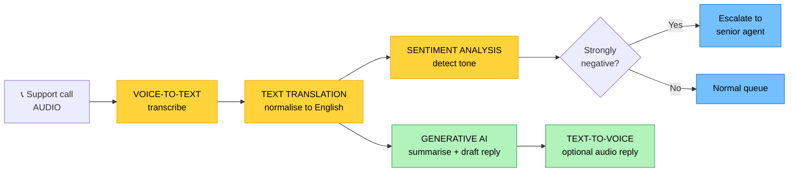
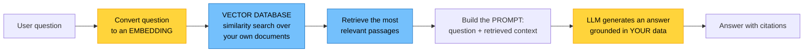

# Objective 1.11 — Identify evolving technologies in the cloud

> **Domain 1.0 — Cloud Architecture (23% of exam)** · Exam CV0-004 V4 · Objectives doc v5.0
> **Status:** Exam-ready · **Version:** 2.0 (enhanced) · Supersedes `full notes/Objective-1.11-Evolving-Technologies.md`

---

## 0. How to use this note

| Pass | What to read | Time |
|---|---|---|
| **1st (learn)** | Sections 1 → 9 in order | ~55 min |
| **2nd (drill)** | Section 3.1 (the seven capabilities by input→output) + 6.4 (protocol selection) | ~15 min |
| **3rd (test)** | Section 12 (practice) + Section 13 (PBQ drills) | ~25 min |
| **Exam eve** | Section 14 (60-second recall sheet) only | ~4 min |

> 📌 **This is a recognition objective, not a build objective.** You will never be asked to train a model or configure a broker. You *will* be given a business scenario and asked which capability or protocol fits. Learn the **input → output** mapping for the seven AI capabilities and the **range/power/bandwidth** trade-off for IoT protocols, and you have most of the marks.

---

## 1. Official objective coverage

> **1.11 Identify evolving technologies in the cloud.**
> - **Machine learning and artificial intelligence (AI)**
>   - Text recognition
>   - Text translation
>   - Visual recognition
>   - Sentiment analysis
>   - Voice-to-text
>   - Text-to-voice
>   - Generative AI
> - **Internet of Things (IoT)**
>   - Sensors
>   - Gateways
>   - Communication
>   - Transmission protocols

### 1.1 What the verb tells you

**"Identify"** — the **fifth and lightest** verb style in Domain 1. The complete set:

| Verb | Objectives | Depth demanded |
|---|---|---|
| "Given a scenario" | 1.1 | Apply judgement to a situation |
| "Explain" | 1.2, 1.3, 1.5, 1.9 | Precise definitions and mechanisms |
| "Compare and contrast" | 1.4, 1.6, 1.7, 1.10 | Differences along specific axes |
| "Summarize" | 1.8 | Describe at a high level |
| **"Identify"** | **1.11** | **Recognise the technology and what it does** |

**Practical consequence:** you need to *recognise the right name* for a described capability. Questions are almost always "a company wants to do X — which technology?" Depth beyond that is wasted study time.

> ⚠️ **A note on the v1 file:** it opens with "Explain the importance of evolving technologies." The official verb is **"Identify."** The material was right; the framing was slightly heavier than the exam requires.

### 1.2 Coverage checklist

- [ ] I can map each of the **seven AI capabilities** to its **input and output**
- [ ] I can distinguish **text recognition** from **visual recognition**
- [ ] I know **voice-to-text** and **text-to-voice** are inverses
- [ ] I know **sentiment analysis operates on text**, so audio must be transcribed first
- [ ] I can distinguish **generative** AI from the six **analytical** capabilities
- [ ] I recognise the generative-AI vocabulary: prompt, token, **hallucination**, **RAG**, fine-tuning, embeddings
- [ ] I know the main **AI risks**: bias, hallucination, data privacy, explainability
- [ ] I can describe the four **IoT components** and the layered architecture
- [ ] I know what an IoT **gateway** does beyond forwarding
- [ ] I know **MQTT** is publish/subscribe and lightweight, and **HTTP** is request/response and heavy
- [ ] I can trade off **range vs power vs bandwidth** across IoT network technologies
- [ ] I know the main **IoT security** weaknesses

---

## 2. The core mental model

### 2.1 How the AI terms nest

```text
   ┌──────────────────────────────────────────────────────────────┐
   │  ARTIFICIAL INTELLIGENCE (AI)                                │
   │  any technique making machines perform tasks that would      │
   │  otherwise need human intelligence                           │
   │  ┌────────────────────────────────────────────────────────┐  │
   │  │  MACHINE LEARNING (ML)                                 │  │
   │  │  systems that LEARN PATTERNS FROM DATA rather than     │  │
   │  │  following explicitly programmed rules                 │  │
   │  │  ┌──────────────────────────────────────────────────┐  │  │
   │  │  │  DEEP LEARNING                                   │  │  │
   │  │  │  multi-layered neural networks — powers modern   │  │  │
   │  │  │  vision, speech, and language                    │  │  │
   │  │  │  ┌────────────────────────────────────────────┐  │  │  │
   │  │  │  │  GENERATIVE AI                             │  │  │  │
   │  │  │  │  foundation models / LLMs that CREATE new  │  │  │  │
   │  │  │  │  content from a prompt                     │  │  │  │
   │  │  │  └────────────────────────────────────────────┘  │  │  │
   │  │  └──────────────────────────────────────────────────┘  │  │
   │  └────────────────────────────────────────────────────────┘  │
   └──────────────────────────────────────────────────────────────┘
```

**Two terms worth separating:**

| | **Training** | **Inference** |
|---|---|---|
| What | Building the model from data | **Using** the trained model on new input |
| Cost | Very expensive, GPU-heavy, batch | Cheap per call, latency-sensitive |
| Where | Large cloud GPU clusters | Cloud API, or **at the edge** (see 1.2) |
| Who does it | Providers train the models you consume | **You** — this is what a managed AI API does |

> 💡 **The cloud angle CompTIA cares about:** organisations **consume these as managed API services** rather than training models themselves. You send an image or a sentence and get a result — this is a **managed service** (1.5) with all the usual trade-offs: fast to adopt, no ops, but lock-in and less control.

### 2.2 ★ Analytical vs generative — the organising split

```text
   SIX ANALYTICAL ("discriminative") CAPABILITIES
   input → the model RECOGNISES, CLASSIFIES, or CONVERTS it
   ┌──────────────────┬──────────────┬─────────────────────────────┐
   │ CAPABILITY       │ INPUT        │ OUTPUT                      │
   ├──────────────────┼──────────────┼─────────────────────────────┤
   │ Text recognition │ IMAGE/scan   │ TEXT (the characters in it) │
   │ Visual recognition│ IMAGE/video │ LABELS (objects, faces,     │
   │                  │              │ scenes, unsafe content)     │
   │ Text translation │ TEXT (lang A)│ TEXT (lang B)               │
   │ Sentiment analysis│ TEXT        │ TONE (positive/negative/    │
   │                  │              │ neutral/mixed)              │
   │ Voice-to-text    │ AUDIO        │ TEXT                        │
   │ Text-to-voice    │ TEXT         │ AUDIO                       │
   └──────────────────┴──────────────┴─────────────────────────────┘

   ONE GENERATIVE CAPABILITY
   ┌──────────────────┬──────────────┬─────────────────────────────┐
   │ Generative AI    │ PROMPT       │ BRAND-NEW CONTENT — text,   │
   │                  │ (natural     │ code, images, audio, video  │
   │                  │  language)   │ that did not previously     │
   │                  │              │ exist                       │
   └──────────────────┴──────────────┴─────────────────────────────┘

   ★ THE TEST: does it ANALYSE something that already exists,
     or CREATE something new? Six analyse. One creates.
```

### 2.3 The IoT stack

```text
   ┌─────────────────────────────────────────────────────────────┐
   │ ④ APPLICATION / ANALYTICS                                   │
   │    dashboards · alerts · ML models · business logic         │
   ├─────────────────────────────────────────────────────────────┤
   │ ③ CLOUD IoT PLATFORM                                        │
   │    device registry · message broker · device shadows/twins  │
   │    · rules engine · security and identity                   │
   ├─────────────────────────────────────────────────────────────┤
   │ ② GATEWAY / EDGE                        ← aggregation point │
   │    aggregate · filter · protocol-translate · buffer ·       │
   │    secure · run local ML (edge computing — see 1.2)         │
   ├─────────────────────────────────────────────────────────────┤
   │ ① SENSORS / DEVICES                     ← the data source   │
   │    measure the physical world · constrained CPU, memory,    │
   │    battery · often cannot reach the internet directly       │
   └─────────────────────────────────────────────────────────────┘
              ▲                                    │
              └──── commands / desired state ◄─────┘
                    (two-way, not just telemetry)
```

---

## 3. The seven AI/ML capabilities

### 3.1 Quick reference

| Capability | Also called | Recognise it from | Classic use |
|---|---|---|---|
| **Text recognition** | **OCR** | "extract text from **scanned documents/images**", invoices, receipts, ID cards, forms | Automated document processing |
| **Text translation** | Machine translation | "convert **language A to language B**", localisation, multilingual support | Global product listings, support tickets |
| **Visual recognition** | Computer vision | "identify **objects/faces/scenes** in images or video", content moderation, defect detection | Moderation, quality inspection, shelf monitoring |
| **Sentiment analysis** | Opinion mining (NLP) | "determine **emotional tone**", positive/negative, customer mood | Escalating angry support tickets |
| **Voice-to-text** | **ASR**, speech recognition, transcription | "convert **speech/audio to text**", captions, meeting notes | Call-centre transcription, accessibility captions |
| **Text-to-voice** | **TTS**, speech synthesis | "convert **text into spoken audio**", IVR, screen readers | Voice assistants, audio articles |
| **Generative AI** | LLM, foundation model | "**create new** content", prompts, chatbots, summarisation, code generation | Chatbots, drafting, summarising |

### 3.2 The three confusable pairs

| Pair | The deciding question |
|---|---|
| **Text recognition vs visual recognition** | Are you reading **characters** (OCR) or identifying **objects/faces/scenes** (visual)? Both take an image — the *output* differs |
| **Voice-to-text vs text-to-voice** | Which direction? **Audio in → text out** vs **text in → audio out**. They are exact inverses |
| **Sentiment analysis vs translation** | Sentiment judges **tone** and leaves the language alone; translation changes the **language** and leaves the tone alone |

> ⚠️ **Sentiment analysis works on text only.** A scenario about analysing the mood of *phone calls* needs **voice-to-text first, then sentiment analysis** — a two-step pipeline, and a favourite exam construction.

### 3.3 Chaining capabilities — how real pipelines look



**Common pipelines to recognise:**

| Pipeline | Purpose |
|---|---|
| Voice-to-text → sentiment analysis | Measure customer mood from calls |
| Voice-to-text → translation → generative AI | Multilingual call summarisation |
| Text recognition (OCR) → generative AI | Extract and then summarise scanned documents |
| Visual recognition → generative AI | Auto-tag images and write descriptions |
| Generative AI → text-to-voice | Conversational voice assistant |

---

## 4. Generative AI

| | |
|---|---|
| **Definition** | Large models — **large language models (LLMs)** for text and code, diffusion models for images — that **produce new content** in response to a **natural-language prompt**, rather than classifying existing input. |
| **Cloud angle** | Providers offer **foundation models as managed APIs**, so organisations consume state-of-the-art models without training them. Training a foundation model requires enormous GPU clusters; **inference** is an API call |
| **Exam triggers** | "creates new content", "prompt", "chatbot", "summarise documents", "generate code/images", "foundation model", "conversational assistant" |

### 4.1 Vocabulary you should recognise

| Term | Meaning |
|---|---|
| **Foundation model / LLM** | A large, general-purpose pre-trained model adapted to many tasks |
| **Prompt** | The natural-language instruction given to the model |
| **Token** | The unit a model processes (roughly a word fragment); **usage is billed per token** |
| **Context window** | How much text the model can consider at once — a hard limit |
| **★ Hallucination** | The model producing **confident but false** output. The defining risk of generative AI |
| **★ RAG** (retrieval-augmented generation) | **Grounding** the model in your own data: retrieve relevant documents, then include them in the prompt so answers cite real sources |
| **Embeddings** | Numeric vector representations of meaning, enabling **similarity search** — stored in a **vector database** (see 1.9) |
| **Fine-tuning** | Further training a base model on your own data to specialise it — more effort and cost than RAG |
| **Prompt engineering** | Structuring prompts to get better results — the cheapest adaptation method |
| **Guardrails / content filtering** | Controls limiting what the model will accept or produce |
| **Inference** | Running the model to get an answer — what you pay for per call |

### 4.2 The three ways to adapt a model — cheapest first

```text
   ① PROMPT ENGINEERING     no infrastructure · instant · cheapest
      ↓                     "answer in this format, using this style"

   ② RAG                    retrieve YOUR documents → inject into the
      ↓                     prompt → model answers FROM YOUR DATA
                            ✓ reduces HALLUCINATION, cites sources,
                              data stays current, no retraining
                            → needs a VECTOR DATABASE + embeddings

   ③ FINE-TUNING            retrain the model on your own examples
                            ✓ best for a specific style/format/task
                            ✗ expensive, needs curated data, must be
                              redone as the base model updates
```

> ★ **The most common exam-relevant recommendation:** if a scenario says "the chatbot gives confident but incorrect answers about our products," the fix is **RAG** — ground it in your actual documentation. Fine-tuning is the heavier, more expensive answer, and prompt engineering alone will not supply missing facts.

### 4.3 A RAG pipeline



---

## 5. AI/ML considerations and risks

CompTIA's "identify" verb still expects you to recognise the **downsides** — expect at least one question here.

| Risk | What it means | Mitigation |
|---|---|---|
| **Hallucination** | Confidently wrong output presented as fact | **RAG grounding**, citations, human review, guardrails |
| **Bias** | The model reflects bias present in its training data, producing unfair outcomes | Diverse training data, bias testing, human oversight, auditing |
| **★ Data privacy** | Sending customer PII, health records, or confidential IP to a **third-party model** may breach policy or regulation, and prompts may be retained or used for training | Data classification before use, private/dedicated model endpoints, contractual terms, redaction, on-prem/private models |
| **Explainability** | Deep models are **black boxes** — you cannot always justify a decision, which matters in regulated lending, hiring, and healthcare | Simpler interpretable models where required, decision logging, human-in-the-loop |
| **Intellectual property** | Generated content may reproduce training material; ownership and licensing of output can be unclear | Legal review, provenance filters, indemnity terms |
| **Accuracy / drift** | Model performance degrades as the real world changes | Monitoring, periodic retraining, feedback loops |
| **Cost at scale** | Per-token/per-call inference costs grow quickly with volume | Caching, smaller models for simple tasks, batching, budgets (1.8) |
| **Prompt injection** | Malicious input embedded in data manipulates the model into ignoring its instructions | Input validation, output filtering, least-privilege tool access |
| **Shadow AI** | Staff pasting confidential data into unapproved public AI tools | Policy, approved tooling, DLP, training |

> ⚠️ **The data-privacy point is the most examinable.** "Can we send our customer records to a public AI service?" is a **governance and compliance** question (see 4.2), not a technical one — and the safe answer involves classification, contracts, and private endpoints.

---

## 6. Internet of Things (IoT)

### 6.1 Sensors

| | |
|---|---|
| **Definition** | Physical devices that **measure real-world conditions** — temperature, humidity, motion, light, pressure, vibration, GPS location, air quality — and convert them into digital **telemetry**. |
| **Characteristics** | **Constrained**: limited CPU, memory, and often **battery power**; frequently deployed in large numbers; often cannot reach the internet directly; expected to run for years unattended |
| **Also** | **Actuators** are the counterpart — devices that *act* on the physical world (valves, motors, locks, relays). Sensors sense; actuators do |
| **Exam triggers** | "measure the physical world", "telemetry", "battery-powered devices", "thousands of small devices", "temperature/humidity/motion readings" |

### 6.2 Gateways

| | |
|---|---|
| **Definition** | An **edge device that sits between local sensors and the cloud**, aggregating their data and bridging local device networks to the internet. |
| **★ What it does beyond forwarding** | **Aggregation** — collect from many sensors · **Filtering/pre-processing** — send summaries and anomalies instead of raw data, cutting bandwidth · **Protocol translation** — Zigbee/BLE/Modbus on one side, MQTT/HTTPS on the other · **Buffering** — store readings during connectivity loss and forward on reconnect · **Security** — provide identity, encryption, and a controlled egress point for devices too weak to do it themselves · **Local compute** — run ML inference at the edge for real-time decisions with no round trip (see 1.2) |
| **Why it exists** | Most sensors are too constrained to speak TLS, hold certificates, or reach the internet. The gateway does that on their behalf |
| **Exam triggers** | "aggregate data from many sensors", "protocol translation", "buffer during outages", "process locally before sending", "edge device" |

### 6.3 Communication

| | |
|---|---|
| **Definition** | The **messaging model** by which devices, gateways, and the cloud exchange data — typically **publish/subscribe through a broker**, plus device state constructs. |
| **Publish/subscribe** | Devices **publish** telemetry to **topics**; interested consumers **subscribe**. Neither needs the other's address, so the system is **loosely coupled** and scales to millions of intermittently connected devices (the same fan-out pattern as 1.5) |
| **Device shadow / digital twin** | A cloud-side **virtual representation** holding the device's **last reported state** and its **desired state**. An app can set a desired value while the device is offline; the device applies it on reconnect. A **digital twin** is the broader concept — a full virtual model of a physical asset used for simulation and monitoring |
| **Two-way** | IoT is not only telemetry upward — **command and control** flows downward (firmware updates, configuration, actuator commands) |
| **Exam triggers** | "publish/subscribe", "broker", "topics", "device shadow/twin", "set the desired state while offline", "command and control" |

```text
   PUBLISH / SUBSCRIBE WITH A BROKER

   [Sensor A] ──publish──►┐
   [Sensor B] ──publish──►│   ╔═══════════════╗   ├──► [Dashboard]
   [Sensor C] ──publish──►┼──►║    BROKER     ║───┼──► [Alerting rule]
                          │   ║ topic: floor2/║   ├──► [Data lake]
   [Mobile app] ◄─subscribe──►║ temperature   ║   └──► [ML model]
        │                     ╚═══════════════╝
        └── publishes DESIRED STATE ──► device shadow ──► applied
            ("set 21°C")                                  on reconnect

   ✓ Publishers don't know subscribers · add consumers with no device change
   ✓ Devices can be offline and catch up
```

### 6.4 Transmission protocols

**The two the exam names explicitly:**

| | **MQTT** | **HTTP/HTTPS** |
|---|---|---|
| Model | **Publish/subscribe** via a broker | **Request/response** |
| Weight | **Very lightweight** — tiny headers | **Heavy** — verbose headers per request |
| Connection | **Persistent**, long-lived | Typically new per request |
| Power use | **Very low** — ideal for battery devices | Higher |
| Push to device | ✅ **Native** (subscribe) | ❌ Requires polling or WebSockets |
| Works on poor networks | ✅ Designed for it | Less tolerant |
| Firewall friendliness | Needs port 1883/**8883 (TLS)** | ✅ Universally allowed |
| Best for | **Many constrained, battery-powered devices**; frequent small telemetry | Occasional calls, web integration, less constrained devices |

**MQTT details worth recognising:**

| Feature | Meaning |
|---|---|
| **Broker** | The central server routing messages between publishers and subscribers |
| **Topic** | Hierarchical address, e.g. `factory/floor2/machine7/temperature`, with wildcards |
| **QoS 0** | **At most once** — fire and forget; may be lost. Lowest overhead |
| **QoS 1** | **At least once** — acknowledged; **duplicates possible** (so consumers should be idempotent — see 1.5) |
| **QoS 2** | **Exactly once** — four-way handshake; highest overhead and latency |
| **Retained message** | The broker keeps the last message on a topic so new subscribers get current state immediately |
| **Last will and testament (LWT)** | A message the broker publishes automatically if a device disconnects unexpectedly — how you detect a dead device |

**Other protocols that appear as options:**

| Protocol | Note |
|---|---|
| **CoAP** | Very lightweight RESTful protocol over **UDP** — for the most constrained devices |
| **AMQP** | Richer, reliable message queuing; heavier than MQTT; enterprise integration |
| **WebSocket** | Persistent bidirectional channel over HTTP — useful where only web ports are open |

### 6.5 IoT network technologies — the range/power/bandwidth trade-off

```text
   ★ YOU CANNOT HAVE ALL THREE: LONG RANGE · LOW POWER · HIGH BANDWIDTH

   BANDWIDTH ▲
             │  Wi-Fi ●              ● 5G
             │  (50 m, high power)    (wide, high power,
             │                         very low latency)
             │        ● Cellular 4G
             │
             │  ● BLE / Zigbee / Z-Wave
             │    (10-100 m, mesh, LOW power,
             │     home & building automation)
             │
             │                  ● NB-IoT / LTE-M
             │                    (wide area, low power, licensed)
             │                              ● LoRaWAN
             │                                (2-15 km, ULTRA low power,
             │                                 TINY payloads, unlicensed)
             └──────────────────────────────────────────────► RANGE

   Pick by the CONSTRAINT the scenario emphasises:
     "battery must last years, tiny readings, kilometres apart" → LoRaWAN
     "in-building mesh, low power, hundreds of devices"         → Zigbee/BLE
     "video or firmware transfer, mains powered"                → Wi-Fi / 5G
     "wide area, carrier-managed, low power"                    → NB-IoT / LTE-M
     "massive device density + ultra-low latency"               → 5G
```

---

## 7. IoT security

IoT is one of the weakest links in most environments, and CompTIA tests the recognition of why.

| Weakness | Why it matters | Mitigation |
|---|---|---|
| **Default/weak credentials** | Shipped passwords are rarely changed — the root cause of large IoT botnets | Unique credentials per device, forced change on provisioning |
| **No/late firmware updates** | Devices run vulnerable firmware for years | **Secure OTA update** capability as a purchase requirement |
| **Weak device identity** | Anything can impersonate a device | **Per-device X.509 certificates**, mutual TLS |
| **Unencrypted transmission** | Telemetry and commands readable and forgeable | **TLS (MQTT on 8883)**, encrypted payloads |
| **Physical access** | Devices sit in public or unattended locations | Tamper detection, secure elements, assume compromise |
| **Flat networks** | One compromised device reaches everything | **Network segmentation / dedicated IoT VLAN** (see 1.3) |
| **Massive scale** | Thousands of endpoints multiply the attack surface | Automated fleet provisioning, monitoring, revocation |
| **Long lifecycles** | Devices outlive their vendor support | Lifecycle planning, compensating controls |

> ⚠️ **The classic IoT breach pattern:** compromise a poorly secured device on a flat network, then move laterally to valuable systems, or conscript the device into a **botnet for DDoS**. Segmentation and per-device identity are the standard answers.

---

## 8. Adjacent evolving technologies

Not official sub-bullets, but they appear as distractors and in "evolving technologies" phrasing:

| Technology | One line |
|---|---|
| **Edge computing** | Processing near the data source — the natural partner of IoT (see 1.2) |
| **5G** | High bandwidth, very low latency, and massive device density — an IoT and edge enabler |
| **Digital twin** | A live virtual model of a physical asset or system, used for monitoring and simulation |
| **Blockchain / DLT** | Distributed, tamper-evident ledger — supply-chain provenance, smart contracts |
| **Quantum computing** | Emerging compute for specific problem classes; the near-term security concern is **future decryption of today's captured traffic**, driving post-quantum cryptography |
| **Big data / analytics** | Large-scale processing pipelines feeding ML |
| **AR / VR / spatial computing** | Latency-sensitive rendering, often edge-assisted |
| **Serverless / containers** | Covered in 1.1, 1.6 — still "evolving" in CompTIA's framing |

---

## 9. Comparison tables

### 9.1 ★ The seven AI capabilities by input and output

| Capability | Input | Output | Analytical or generative |
|---|---|---|---|
| **Text recognition (OCR)** | Image / scan | **Text** | Analytical |
| **Visual recognition** | Image / video | **Labels** — objects, faces, scenes | Analytical |
| **Text translation** | Text (lang A) | **Text (lang B)** | Analytical |
| **Sentiment analysis** | **Text** | **Tone** — pos/neg/neutral/mixed | Analytical |
| **Voice-to-text (ASR)** | **Audio** | **Text** | Analytical |
| **Text-to-voice (TTS)** | **Text** | **Audio** | Analytical |
| **Generative AI** | **Prompt** | **New content** — text, code, images, audio | **Generative** |

### 9.2 MQTT vs HTTP for IoT

| Factor | **MQTT** | **HTTP/HTTPS** |
|---|---|---|
| Pattern | Pub/sub via broker | Request/response |
| Overhead per message | **Minimal** | High |
| Battery impact | **Low** | Higher |
| Server-initiated push | ✅ Yes | ❌ Polling required |
| Unreliable networks | ✅ Designed for | Poorer |
| Firewall traversal | Port 1883/8883 | ✅ Universal |
| Choose when | **Thousands of constrained devices, frequent small telemetry** | Occasional calls, web integration, simplicity |

### 9.3 IoT component responsibilities

| Component | Responsibility |
|---|---|
| **Sensor** | Measure the physical world; produce telemetry; constrained and often battery-powered |
| **Gateway** | Aggregate, filter, translate protocols, buffer, secure, run local inference |
| **Communication** | Pub/sub messaging, topics, brokers, device shadows, command and control |
| **Transmission protocol** | The wire format and rules — MQTT, HTTP, CoAP, AMQP — plus the network technology carrying it |

### 9.4 Multi-cloud mapping

| Capability | AWS | Azure | Google Cloud |
|---|---|---|---|
| Text recognition (OCR) | Textract | AI Document Intelligence | Document AI |
| Visual recognition | Rekognition | AI Vision | Vision AI |
| Text translation | Translate | AI Translator | Cloud Translation |
| Sentiment analysis | Comprehend | AI Language | Natural Language AI |
| Voice-to-text | Transcribe | AI Speech to Text | Speech-to-Text |
| Text-to-voice | Polly | AI Text to Speech | Text-to-Speech |
| **Generative AI** | **Bedrock**, SageMaker | **Azure OpenAI**, AI Foundry | **Vertex AI**, Gemini |
| ML platform | SageMaker | Azure Machine Learning | Vertex AI |
| IoT platform | IoT Core | IoT Hub | IoT solutions / Pub/Sub |
| IoT edge runtime | IoT Greengrass | IoT Edge | Distributed Cloud Edge |
| Vector database | OpenSearch, Aurora pgvector | AI Search | Vertex AI Vector Search |

---

## 10. Exam traps & distractor patterns

| # | Trap | The truth |
|---|---|---|
| 1 | "Text recognition and visual recognition are the same" | Both take an image. **OCR outputs the characters**; visual recognition outputs **object/face/scene labels** |
| 2 | "Sentiment analysis can process audio directly" | It works on **text**. Audio must go through **voice-to-text first** |
| 3 | "Voice-to-text and text-to-voice are interchangeable" | They are **exact inverses** — check the direction |
| 4 | "Generative AI just classifies input better" | It **creates new content**. The other six analyse existing input |
| 5 | "Generative AI output is factually reliable" | **Hallucination** is its defining risk. Ground it with **RAG**, cite sources, keep humans in the loop |
| 6 | "Fine-tuning is the fix for wrong product answers" | **RAG** is usually the correct, cheaper answer — supply the facts rather than retrain the model |
| 7 | "Sending customer data to a public AI API is a technical decision" | It is a **privacy and compliance** decision — classification, contracts, and private endpoints (see 4.2) |
| 8 | "Sensors send data straight to the cloud" | Most are too constrained; a **gateway** provides connectivity, security, and protocol translation |
| 9 | "A gateway just forwards packets" | It also **aggregates, filters, translates protocols, buffers during outages, secures, and runs local inference** |
| 10 | "HTTP is fine for thousands of battery sensors" | HTTP's per-request overhead drains batteries and bandwidth. **MQTT** is the IoT answer |
| 11 | "MQTT QoS 1 delivers exactly once" | QoS 1 is **at least once — duplicates possible**. QoS 2 is exactly once, at the highest cost |
| 12 | "LoRaWAN is good for video" | LoRaWAN carries **tiny payloads** over long range at ultra-low power. Video needs Wi-Fi or 5G |
| 13 | "Longer range just means a better protocol" | Range, power, and bandwidth **trade off against each other** — you cannot maximise all three |
| 14 | "IoT devices are low risk because they're small" | Weak credentials, no patching, and flat networks make them a **primary lateral-movement and botnet target** |
| 15 | "Device shadows are just a cache" | They hold **reported and desired state**, enabling commands to devices that are currently offline |
| 16 | "You must train your own models to use AI in the cloud" | Providers offer **pre-trained managed APIs** — you perform **inference**, not training |

**Disambiguation drill:**

| Pair | The deciding question |
|---|---|
| **OCR vs visual recognition** | Reading **characters** or identifying **things**? |
| **Voice-to-text vs text-to-voice** | Which **direction**? |
| **Sentiment vs translation** | Judging **tone** or changing **language**? |
| **Analytical vs generative** | Does it **analyse** existing input or **create** new content? |
| **RAG vs fine-tuning** | Supply **facts** (RAG) or change **style/behaviour** (fine-tune)? |
| **MQTT vs HTTP** | **Many constrained devices, frequent small messages** (MQTT) or occasional web-integrated calls (HTTP)? |
| **Sensor vs gateway** | **Measures** the world (sensor) or **aggregates and bridges** (gateway)? |
| **LoRaWAN vs Wi-Fi** | **Kilometres and years of battery** vs **bandwidth and mains power**? |

---

## 11. Keyword → answer trigger table

| If you see… | Think |
|---|---|
| extract text from scanned invoices/receipts/ID cards · digitise paper forms | **Text recognition (OCR)** |
| identify objects, faces, or scenes · content moderation · defect detection from images | **Visual recognition** |
| convert language A to language B · localise content · multilingual listings | **Text translation** |
| positive/negative/neutral · customer mood · escalate angry messages | **Sentiment analysis** |
| transcribe calls · captions · meeting notes · speech to text | **Voice-to-text (ASR)** |
| read text aloud · IVR menu · screen reader · voice assistant output | **Text-to-voice (TTS)** |
| create new text/code/images · prompt · chatbot · summarise · draft | **Generative AI** |
| confidently wrong answers about company data | **Hallucination → fix with RAG** |
| ground the model in our own documents, with citations | **RAG + vector database + embeddings** |
| adapt the model's style/format to our own examples | **Fine-tuning** |
| can we send customer PII to a public model? | **Data privacy/compliance — classify, contract, private endpoint** |
| measures temperature/humidity/motion · telemetry · battery-powered | **Sensors** |
| aggregates many sensors · protocol translation · buffers during outages · local ML | **Gateway** |
| publish/subscribe · broker · topics · desired state while offline | **Communication (pub/sub + device shadow)** |
| thousands of battery devices sending small frequent readings | **MQTT** |
| occasional call, web integration, must traverse any firewall | **HTTP/HTTPS** |
| at least once, duplicates possible | **MQTT QoS 1** |
| detect that a device dropped off unexpectedly | **Last will and testament (LWT)** |
| kilometres of range, years of battery, tiny payloads | **LoRaWAN** |
| in-building mesh, low power, home automation | **Zigbee / Z-Wave / BLE** |
| massive device density plus ultra-low latency | **5G** |
| compromised device used for lateral movement or DDoS | **IoT security — segmentation, per-device certificates** |
| live virtual model of a physical asset | **Digital twin** |

---

## 12. Practice questions

<details>
<summary><b>Q1.</b> An insurance company must extract policy numbers and totals from 50,000 scanned paper claim forms. Which capability is required?</summary>

**A. Text recognition (OCR)** · B. Visual recognition · C. Sentiment analysis · D. Text-to-voice

**Correct: A — text recognition.** OCR locates and extracts machine-readable characters from images and scanned documents.
- **B wrong:** Visual recognition identifies objects, faces, and scenes — not the characters on a form.
- **C wrong:** Sentiment analysis judges emotional tone.
- **D wrong:** Text-to-voice produces audio.
</details>

<details>
<summary><b>Q2.</b> A contact centre wants to measure customer mood from recorded phone calls. Which pipeline is required?</summary>

A. Sentiment analysis alone · **B. Voice-to-text, then sentiment analysis** · C. Text-to-voice, then translation · D. Visual recognition, then sentiment analysis

**Correct: B.** Sentiment analysis operates on **text**, so audio must first be transcribed.
- **A wrong:** It cannot consume audio directly.
- **C wrong:** Text-to-voice goes the wrong direction.
- **D wrong:** Visual recognition processes images, not audio.
</details>

<details>
<summary><b>Q3.</b> Which capability CREATES new content rather than analysing existing input?</summary>

A. Visual recognition · B. Text recognition · **C. Generative AI** · D. Sentiment analysis

**Correct: C.** Generative AI produces new text, code, images, or audio from a prompt; the other six capabilities classify or convert existing input.
- **A/B/D wrong:** All are analytical (discriminative) services.
</details>

<details>
<summary><b>Q4.</b> A company deploys thousands of battery-powered soil-moisture sensors that report small readings hourly and must run for years on one battery. Which transmission protocol is MOST appropriate?</summary>

A. HTTPS · **B. MQTT** · C. FTP · D. SMTP

**Correct: B — MQTT.** Its lightweight publish/subscribe design and persistent connection minimise power and bandwidth for constrained devices on unreliable networks.
- **A wrong:** HTTP's per-request header overhead drains battery and bandwidth.
- **C/D wrong:** Neither is an IoT telemetry protocol.
</details>

<details>
<summary><b>Q5.</b> A factory has 500 sensors using Zigbee that cannot reach the internet directly. What device bridges them to the cloud?</summary>

A. A load balancer · **B. An IoT gateway** · C. A message broker · D. A sensor hub actuator

**Correct: B — gateway.** It aggregates local sensor data, translates protocols, buffers during outages, secures the connection, and can run local processing.
- **A wrong:** Load balancers distribute network traffic across servers.
- **C wrong:** The broker lives in the cloud platform; the gateway is the edge bridge to it.
- **D wrong:** Actuators act on the physical world.
</details>

<details>
<summary><b>Q6.</b> An internal chatbot built on a foundation model gives confident but incorrect answers about company products. What is the MOST appropriate remedy?</summary>

A. Increase the context window · **B. Implement retrieval-augmented generation (RAG) to ground responses in the company's own documentation** · C. Switch to sentiment analysis · D. Use text-to-voice for the answers

**Correct: B — RAG.** The model has no knowledge of internal products; retrieving relevant documents and including them in the prompt grounds answers in real data and reduces hallucination.
- **A wrong:** A larger window does not supply facts the model never had.
- **C/D wrong:** Neither addresses factual accuracy.
</details>

<details>
<summary><b>Q7.</b> Which BEST describes an IoT device shadow (digital twin)?</summary>

A. A backup copy of device firmware · **B. A cloud-side representation holding the device's last reported state and its desired state, so commands apply when it reconnects** · C. A duplicate physical sensor for redundancy · D. An encrypted tunnel to the device

**Correct: B.** Shadows decouple applications from device connectivity, enabling command-and-control for intermittently connected devices.
- **A/C/D wrong:** None describe the state-synchronisation construct.
</details>

<details>
<summary><b>Q8.</b> A social platform must automatically flag prohibited images uploaded by users. Which capability applies?</summary>

A. Text recognition · **B. Visual recognition** · C. Text translation · D. Voice-to-text

**Correct: B.** Content moderation of images and video is a computer-vision task.
- **A wrong:** OCR extracts characters, not scene or object classification.
- **C/D wrong:** Neither processes images.
</details>

<details>
<summary><b>Q9.</b> Which MQTT quality-of-service level guarantees delivery at least once, with duplicates possible?</summary>

A. QoS 0 · **B. QoS 1** · C. QoS 2 · D. QoS 3

**Correct: B — QoS 1.** Messages are acknowledged and retried, so duplicates can occur; consumers should therefore be idempotent.
- **A wrong:** QoS 0 is at-most-once, fire and forget.
- **C wrong:** QoS 2 is exactly once, at the highest overhead.
- **D wrong:** There is no QoS 3.
</details>

<details>
<summary><b>Q10.</b> An agricultural operation needs sensors spread across 10 km of farmland, sending tiny readings, powered by batteries expected to last several years. Which network technology fits BEST?</summary>

A. Wi-Fi · B. Bluetooth Low Energy · **C. LoRaWAN** · D. 5G

**Correct: C — LoRaWAN.** It provides multi-kilometre range at ultra-low power for very small payloads, which is exactly this profile.
- **A wrong:** Wi-Fi range is tens of metres and power draw is high.
- **B wrong:** BLE is a short-range personal-area technology.
- **D wrong:** 5G offers high bandwidth but far higher power consumption and cost per device.
</details>

<details>
<summary><b>Q11.</b> Which is the PRIMARY risk associated with generative AI output?</summary>

A. It cannot process images · **B. Hallucination — producing confident but factually incorrect content** · C. It requires on-premises hardware · D. It only works in English

**Correct: B.** Plausible-sounding but false output is the defining risk, mitigated with grounding (RAG), citations, guardrails, and human review.
- **A/C/D wrong:** All are inaccurate about modern managed generative services.
</details>

<details>
<summary><b>Q12.</b> A hospital wants to use a public generative-AI API to summarise patient records. What is the MOST important consideration?</summary>

A. The model's context window size · **B. Data privacy and regulatory compliance — sending protected health information to a third-party model may breach regulation, and prompts may be retained** · C. The API's response latency · D. Whether the model supports text-to-voice

**Correct: B.** This is a governance question first: data classification, contractual terms, retention policy, and private or dedicated endpoints.
- **A/C wrong:** Real considerations, but secondary to lawfulness.
- **D wrong:** Irrelevant to the requirement.
</details>

<details>
<summary><b>Q13.</b> What does an IoT gateway do BEYOND forwarding data to the cloud?</summary>

A. Nothing — it only forwards · **B. Aggregates sensor data, filters and pre-processes it, translates protocols, buffers during outages, and provides security** · C. Replaces the cloud platform entirely · D. Generates telemetry itself

**Correct: B.** Those functions are precisely why gateways exist — most sensors are too constrained to do any of them.
- **A wrong:** It understates the role substantially.
- **C wrong:** It complements the cloud platform.
- **D wrong:** Sensors generate telemetry.
</details>

<details>
<summary><b>Q14.</b> An e-commerce site must display Japanese customer reviews to English-speaking shoppers. Which capability applies?</summary>

A. Sentiment analysis · **B. Text translation** · C. Text recognition · D. Generative AI

**Correct: B.** Converting text from one language to another is machine translation.
- **A wrong:** Sentiment judges tone without changing language.
- **C wrong:** OCR extracts text from images.
- **D wrong:** Generative AI could paraphrase, but translation is the direct and correct service.
</details>

<details>
<summary><b>Q15.</b> Which statement about MQTT and HTTP is CORRECT?</summary>

A. HTTP uses publish/subscribe; MQTT uses request/response · **B. MQTT is a lightweight publish/subscribe protocol suited to constrained devices; HTTP is a heavier request/response protocol that traverses firewalls easily** · C. Both consume identical bandwidth · D. MQTT cannot be encrypted

**Correct: B.** That captures the model, weight, and practical trade-off correctly.
- **A wrong:** The models are reversed.
- **C wrong:** MQTT's overhead is dramatically lower.
- **D wrong:** MQTT runs over TLS on port 8883.
</details>

<details>
<summary><b>Q16.</b> Which IoT security weakness is MOST commonly exploited to build large botnets?</summary>

**A. Unchanged default credentials on internet-exposed devices** · B. Excessive encryption overhead · C. Device shadows · D. Use of MQTT

**Correct: A.** Shipped default passwords that are never changed are the classic entry point for mass IoT compromise.
- **B wrong:** Encryption is a protection, not a weakness.
- **C wrong:** Shadows are a state-management feature.
- **D wrong:** MQTT is a protocol, and is secure over TLS.
</details>

<details>
<summary><b>Q17.</b> A news application converts written articles into natural-sounding audio for commuters. Which capability is used?</summary>

A. Voice-to-text · **B. Text-to-voice** · C. Text recognition · D. Sentiment analysis

**Correct: B — text-to-voice (TTS).** Text in, spoken audio out.
- **A wrong:** That is the inverse — audio in, text out.
- **C/D wrong:** Neither produces audio.
</details>

<details>
<summary><b>Q18.</b> Which describes the relationship between AI, ML, and generative AI?</summary>

A. They are three unrelated fields · **B. ML is a subset of AI; deep learning is a subset of ML; generative AI is built on deep learning** · C. AI is a subset of ML · D. Generative AI is a subset of IoT

**Correct: B.** The terms nest, with generative AI as the most specific.
- **A/C/D wrong:** All misstate the hierarchy.
</details>

<details>
<summary><b>Q19.</b> An organisation wants an LLM to answer questions using its internal policy documents, with citations, without retraining the model. What should it implement?</summary>

A. Fine-tuning · **B. Retrieval-augmented generation with a vector database** · C. Sentiment analysis · D. Text-to-voice

**Correct: B — RAG.** Documents are embedded into a vector database, retrieved by similarity at query time, and injected into the prompt so answers are grounded and citable.
- **A wrong:** Fine-tuning requires retraining and is better for style than for supplying facts.
- **C/D wrong:** Neither is relevant.
</details>

<details>
<summary><b>Q20.</b> Why do most IoT deployments send data through a gateway rather than directly from each sensor to the cloud?</summary>

A. Cloud platforms cannot accept sensor data · **B. Sensors are constrained in power, compute, and connectivity, and often cannot handle TLS, certificates, or internet routing themselves** · C. Gateways are required by regulation · D. It increases bandwidth consumption

**Correct: B.** The gateway performs the connectivity, security, and protocol work that constrained devices cannot.
- **A wrong:** They can, for capable devices.
- **C wrong:** No such general requirement exists.
- **D wrong:** Gateways typically **reduce** bandwidth by filtering and aggregating.
</details>

<details>
<summary><b>Q21.</b> Which pairing of capability to input/output is INCORRECT?</summary>

A. Voice-to-text: audio in, text out · B. Text recognition: image in, text out · **C. Sentiment analysis: audio in, tone out** · D. Text-to-voice: text in, audio out

**Correct: C.** Sentiment analysis takes **text** in, not audio — transcription must happen first.
- **A/B/D wrong:** All three mappings are correct.
</details>

<details>
<summary><b>Q22.</b> A manufacturer wants a live virtual model of a production line for monitoring and simulation. What is this called?</summary>

A. A container image · **B. A digital twin** · C. A vector database · D. A message broker

**Correct: B — digital twin.** A continuously updated virtual representation of a physical asset or system.
- **A/C/D wrong:** None describe a virtual model of physical equipment.
</details>

<details>
<summary><b>Q23.</b> Which MQTT feature lets the broker notify subscribers automatically when a device disconnects unexpectedly?</summary>

A. Retained message · **B. Last will and testament (LWT)** · C. QoS 2 · D. Topic wildcard

**Correct: B — LWT.** The device registers a message that the broker publishes on its behalf if the connection drops abnormally.
- **A wrong:** Retained messages give new subscribers the last known value.
- **C wrong:** QoS governs delivery guarantees.
- **D wrong:** Wildcards are a subscription pattern.
</details>

<details>
<summary><b>Q24.</b> Which statement about consuming cloud AI services is MOST accurate?</summary>

A. Organisations must train their own models before using them · **B. Providers offer pre-trained models as managed APIs, so customers perform inference rather than training** · C. All AI services require on-premises GPUs · D. AI services cannot be used with IoT data

**Correct: B.** Consuming managed AI APIs is exactly the managed-service pattern from 1.5 — fast to adopt, no ops, with lock-in and reduced control as the trade-offs.
- **A/C wrong:** Training is what the provider has already done.
- **D wrong:** IoT telemetry feeding ML models is one of the most common architectures.
</details>

<details>
<summary><b>Q25.</b> A retailer wants to identify empty shelves from in-store camera footage and automatically generate restocking descriptions. Which combination is required?</summary>

A. OCR then translation · **B. Visual recognition then generative AI** · C. Sentiment analysis then text-to-voice · D. Voice-to-text then OCR

**Correct: B.** Visual recognition detects the shelf state from imagery; generative AI produces the written output.
- **A wrong:** OCR reads characters, not shelf conditions.
- **C/D wrong:** Neither handles image analysis.
</details>

---

## 13. PBQ-style drills

### Drill A — Name the capability

| # | Requirement | Capability? |
|---|---|---|
| 1 | Digitise 10,000 scanned purchase orders | |
| 2 | Auto-flag prohibited photos on a marketplace | |
| 3 | Escalate angry support emails first | |
| 4 | Provide subtitles for recorded webinars | |
| 5 | Read gate-change announcements aloud | |
| 6 | Serve product listings in six languages | |
| 7 | Draft first-pass replies to customer emails | |

<details><summary>Answers</summary>

1 → **Text recognition (OCR)** · 2 → **Visual recognition** · 3 → **Sentiment analysis** · 4 → **Voice-to-text** · 5 → **Text-to-voice** · 6 → **Text translation** · 7 → **Generative AI**
</details>

### Drill B — Build the pipeline

For each outcome, list the capabilities in order.

| # | Outcome |
|---|---|
| 1 | Measure customer mood from Spanish-language phone calls |
| 2 | Summarise scanned contracts for executives |
| 3 | A voice assistant that answers spoken questions aloud |

<details><summary>Answers</summary>

1 → **Voice-to-text** → **text translation** → **sentiment analysis**
2 → **Text recognition (OCR)** → **generative AI** (summarise)
3 → **Voice-to-text** → **generative AI** → **text-to-voice**
</details>

### Drill C — Pick the IoT protocol or network

| # | Scenario | Choice? |
|---|---|---|
| 1 | 5,000 battery sensors, small readings every minute | |
| 2 | Sensors 8 km apart, tiny payloads, multi-year battery | |
| 3 | In-building mesh of low-power light and occupancy sensors | |
| 4 | A vending machine posting a sales record twice a day | |
| 5 | Streaming camera footage from a mains-powered device | |
| 6 | Message must be delivered exactly once | |

<details><summary>Answers</summary>

1 → **MQTT** · 2 → **LoRaWAN** · 3 → **Zigbee / Z-Wave / BLE** · 4 → **HTTPS** (occasional, simple, firewall-friendly) · 5 → **Wi-Fi or 5G** (bandwidth) · 6 → **MQTT QoS 2**
</details>

### Drill D — Identify the AI risk

| # | Situation | Risk? |
|---|---|---|
| 1 | The chatbot invents a product feature that does not exist | |
| 2 | A hiring model rejects candidates from certain backgrounds | |
| 3 | Staff paste confidential contracts into a public AI tool | |
| 4 | A regulator asks why a loan was declined and nobody can explain | |
| 5 | Inference costs triple after a feature launch | |

<details><summary>Answers</summary>

1 → **Hallucination** → ground with RAG, cite sources, human review
2 → **Bias** in training data → diverse data, bias testing, oversight
3 → **Shadow AI / data privacy leak** → policy, approved tooling, DLP
4 → **Explainability / black-box** → interpretable models, decision logging, human-in-the-loop
5 → **Cost at scale** → caching, smaller models, batching, budgets (1.8)
</details>

---

## 14. 60-second recall sheet

```text
╔══════════════════════════════════════════════════════════════════════╗
║  1.11 — EVOLVING TECHNOLOGIES  (verb = "IDENTIFY" → recognition      ║
║                                  only. Lightest objective in Dom 1.) ║
╠══════════════════════════════════════════════════════════════════════╣
║  ★ SEVEN AI CAPABILITIES — learn INPUT → OUTPUT                      ║
║   TEXT RECOGNITION (OCR)  image/scan → THE CHARACTERS                ║
║   VISUAL RECOGNITION      image/video → OBJECT/FACE/SCENE LABELS     ║
║   TEXT TRANSLATION        text lang A → text lang B                  ║
║   SENTIMENT ANALYSIS      TEXT → tone (pos/neg/neutral)              ║
║                           ⚠ TEXT ONLY — audio needs voice-to-text 1st║
║   VOICE-TO-TEXT (ASR)     AUDIO → TEXT                               ║
║   TEXT-TO-VOICE (TTS)     TEXT → AUDIO   (exact inverse of ASR)      ║
║   GENERATIVE AI           PROMPT → BRAND-NEW CONTENT                 ║
║   ★ SIX ANALYSE what exists · ONE CREATES something new              ║
║   AI ⊃ ML ⊃ DEEP LEARNING ⊃ GENERATIVE AI                            ║
║   You consume MANAGED APIs = INFERENCE. Providers did the TRAINING.  ║
╠══════════════════════════════════════════════════════════════════════╣
║  GEN-AI: prompt · token (billing) · context window ·                 ║
║   ★ HALLUCINATION = confident but WRONG → fix with RAG               ║
║   RAG = embeddings + VECTOR DB → retrieve YOUR docs → into the prompt║
║   Adapt cheapest→dearest: PROMPTING → RAG → FINE-TUNING              ║
║   RISKS: hallucination · bias · DATA PRIVACY (PII to 3rd party!) ·   ║
║          explainability · IP · drift · cost · prompt injection       ║
╠══════════════════════════════════════════════════════════════════════╣
║  IoT STACK  SENSORS → GATEWAY/EDGE → CLOUD PLATFORM → APPLICATION    ║
║   SENSORS  measure the world · constrained CPU/battery · many        ║
║   GATEWAY  ★ more than forwarding: AGGREGATE · FILTER · PROTOCOL     ║
║            TRANSLATE · BUFFER during outages · SECURE · local ML     ║
║   COMMUNICATION  PUB/SUB via broker + topics · DEVICE SHADOW/TWIN    ║
║            (last reported + DESIRED state → applies on reconnect) ·  ║
║            two-way: telemetry UP, commands DOWN                      ║
║   PROTOCOLS  MQTT = lightweight PUB/SUB, persistent, low power       ║
║              → THE IoT answer for many constrained devices           ║
║              QoS 0 at-most-once · QoS 1 AT-LEAST-once (DUPLICATES) · ║
║              QoS 2 exactly-once · LWT = detect unexpected disconnect ║
║              HTTP = request/response, heavy, firewall-friendly       ║
║              CoAP (UDP, tiniest) · AMQP (rich queuing)               ║
╠══════════════════════════════════════════════════════════════════════╣
║  ★ RANGE ↔ POWER ↔ BANDWIDTH — YOU CANNOT HAVE ALL THREE             ║
║   LoRaWAN  km range, ULTRA low power, TINY payloads                  ║
║   BLE/Zigbee/Z-Wave  10-100 m mesh, low power, building automation   ║
║   Wi-Fi / 5G  high bandwidth, high power (5G adds density + low lat.)║
║   NB-IoT / LTE-M  wide area, low power, carrier-managed              ║
║  IoT SECURITY: default creds · no firmware updates · weak identity · ║
║   unencrypted · physical access · FLAT NETWORKS → botnets/lateral    ║
║   FIX: per-device CERTIFICATES · TLS · OTA updates · SEGMENTATION    ║
╚══════════════════════════════════════════════════════════════════════╝
```

---

## 15. Cross-references

| Related objective | Connection |
|---|---|
| **1.1 Service models** | Cloud AI capabilities are consumed as **managed services / SaaS APIs**; inference often runs on FaaS |
| **1.2 Service availability** | **Edge computing** is the natural partner of IoT — process locally, survive WAN outages, cut latency |
| **1.3 Cloud networking** | IoT devices belong on a **segmented VLAN**; MQTT over TLS uses port 8883 |
| **1.5 Cloud-native design** | IoT **publish/subscribe** is the same fan-out pattern; MQTT QoS 1 duplicates require **idempotent** consumers |
| **1.7 Virtualization** | **GPU pass-through** is what makes ML training and inference performant |
| **1.8 Cost considerations** | Per-token inference and per-device connectivity are metered costs that scale fast |
| **1.9 Database concepts** | **Vector databases** store embeddings for RAG and similarity search |
| **1.10 Optimizing workloads** | Inference at the edge vs in the cloud is a latency-vs-cost optimisation |
| **4.2 Compliance** | Sending PII to third-party AI services is a **regulatory** decision; AI governance is an emerging control area |
| **4.4 / 4.6 Security** | IoT device identity, certificate management, botnet detection, and prompt injection |

> 🔑 **Carry this forward:** for AI, identify the capability by its **input and output**. For IoT, identify the component by its **position in the stack**, and the protocol by which **constraint** the scenario emphasises — range, power, or bandwidth.

---

*Source of truth: CompTIA Cloud+ CV0-004 V4 Exam Objectives, document version 5.0. Generative-AI terminology (RAG, embeddings, hallucination) and IoT network technologies beyond MQTT/HTTP are included as supporting context, not official objective bullets. Product names are illustrative; the exam is vendor-neutral.*
