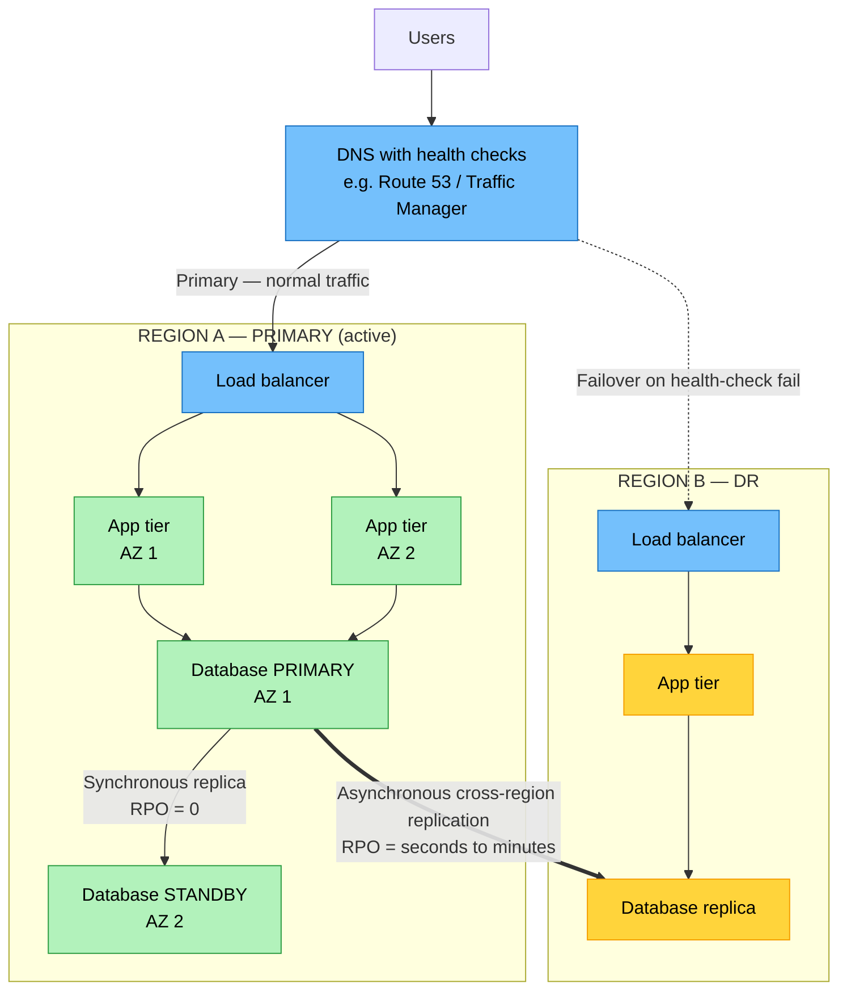
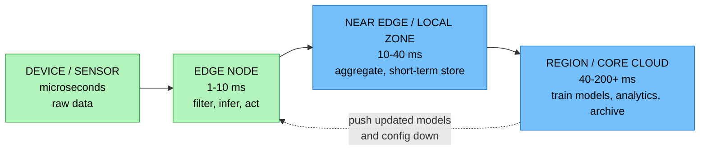

# Objective 1.2 — Explain concepts related to service availability

> **Domain 1.0 — Cloud Architecture (23% of exam)** · Exam CV0-004 V4 · Objectives doc v5.0
> **Status:** Exam-ready · **Version:** 2.0 (enhanced) · Supersedes `full notes/Objective-1.2-Service-Availability.md`

---

## 0. How to use this note

| Pass | What to read | Time |
|---|---|---|
| **1st (learn)** | Sections 1 → 6 in order | ~60 min |
| **2nd (drill)** | Section 2.4 (availability maths) + Section 4.1 (RTO/RPO timeline) until automatic | ~20 min |
| **3rd (test)** | Section 9 (practice) + Section 10 (PBQ drills) | ~35 min |
| **Exam eve** | Section 11 (60-second recall sheet) only | ~5 min |

> 📌 **The single highest-yield thing in this objective is the RTO/RPO timeline in Section 4.1.** If you learn one diagram from Domain 1, learn that one.

---

## 1. Official objective coverage

> **1.2 Explain concepts related to service availability.**
> - **Resource availability**
>   - Region
>   - Availability zone
>   - Cloud bursting
>   - Edge computing
>   - Availability monitoring
> - **Disaster recovery (DR)**
>   - Recovery time objective (RTO)
>   - Recovery point objective (RPO)
>   - Hot site
>   - Warm site
>   - Cold site
> - **Multicloud tenancy**

### 1.1 What the verb tells you

Objective 1.1 says *"Given a scenario…"*. This one says **"Explain concepts…"** — a different question style:

| | 1.1 "Given a scenario" | 1.2 "Explain concepts" |
|---|---|---|
| Question style | Match situation → choice | Define, compare, calculate, distinguish |
| What's tested | Judgement | Precision of definitions and numbers |
| Typical stem | "Which model should they use?" | "Which term describes…", "What is the RPO?", "How much downtime does 99.9% allow?" |

**Practical consequence:** you must know the *exact* boundaries between adjacent terms (region vs AZ, hot vs warm, RTO vs RPO, multicloud vs hybrid) and be able to do the **availability arithmetic**. Vague understanding fails this objective even though it passes 1.1.

> ⚠️ Performance-based questions still use scenarios — expect to be asked to assign RTO/RPO values to systems, or place hot/warm/cold sites against requirements. Section 10 drills exactly that.

### 1.2 Coverage checklist

- [ ] I can define region and AZ and state precisely what failure each protects against
- [ ] I know data does **not** automatically replicate across regions
- [ ] I can convert an availability percentage into downtime per year **and** per month
- [ ] I can compute availability for components in **series** and in **parallel**
- [ ] I can place RTO and RPO on a timeline without hesitating about which side is which
- [ ] I know RPO drives **backup frequency**; RTO drives **recovery capability**
- [ ] I can rank hot / warm / cold by RTO, RPO, and cost
- [ ] I can map hot/warm/cold onto the four cloud DR strategies (backup & restore, pilot light, warm standby, multi-site)
- [ ] I can distinguish cloud bursting from auto-scaling, and edge computing from CDN
- [ ] I can distinguish multicloud from hybrid, and multicloud from multitenancy
- [ ] I know SLA vs SLO vs SLI, and MTTD / MTTR / MTBF
- [ ] I know active-active vs active-passive, and failover vs failback

---

## 2. The core mental model

### 2.1 Availability answers two different questions

```text
   ┌────────────────────────────────┬────────────────────────────────┐
   │   RESOURCE AVAILABILITY        │   DISASTER RECOVERY (DR)       │
   │   "Where does it run, and      │   "What happens when it        │
   │    how do we keep it running?" │    breaks anyway?"             │
   ├────────────────────────────────┼────────────────────────────────┤
   │  Region                        │  RTO — how long down?          │
   │  Availability Zone             │  RPO — how much data lost?     │
   │  Cloud bursting                │  Hot site                      │
   │  Edge computing                │  Warm site                     │
   │  Availability monitoring       │  Cold site                     │
   ├────────────────────────────────┴────────────────────────────────┤
   │  MULTICLOUD TENANCY — spans both: resilience against an entire  │
   │  provider failing, plus lock-in avoidance                       │
   └─────────────────────────────────────────────────────────────────┘

   HIGH AVAILABILITY   =  avoid the outage      (proactive, always on)
   DISASTER RECOVERY   =  survive the outage    (reactive, invoked)
```

> ⚠️ **HA ≠ DR.** High availability keeps a service running through *component* failure (a dead VM, a failed AZ) with no human decision. Disaster recovery restores a service after a *site- or region-level* event, and is deliberately invoked. An exam answer that offers "multi-AZ" as DR for a *regional* outage is wrong — multi-AZ is HA within one region.

### 2.2 The physical hierarchy

```text
                          ☁  CLOUD PROVIDER (global)
                                     │
        ┌────────────────────────────┼────────────────────────────┐
        │                            │                            │
   ┌────▼─────┐                 ┌────▼─────┐                 ┌────▼─────┐
   │ REGION A │                 │ REGION B │                 │ REGION C │
   │ Singapore│                 │  Tokyo   │                 │  Sydney  │
   └────┬─────┘                 └──────────┘                 └──────────┘
        │   Geographic area · own power grid · data does NOT
        │   auto-replicate to other regions · chosen for
        │   LATENCY, SOVEREIGNTY, and DR separation
        │
   ┌────┴────────────┬─────────────────┐
   │                 │                 │
┌──▼───┐         ┌───▼──┐          ┌───▼──┐
│ AZ 1 │         │ AZ 2 │          │ AZ 3 │   ← independent power, cooling,
└──┬───┘         └───┬──┘          └───┬──┘     networking; km apart;
   │                 │                 │        linked by low-latency fibre
   │◄────── < ~2 ms round trip ───────►│        (synchronous replication OK)
   │                 │                 │
┌──▼────────┐   ┌────▼──────┐   ┌──────▼────┐
│ 1+ data   │   │ 1+ data   │   │ 1+ data   │
│ centres   │   │ centres   │   │ centres   │
└───────────┘   └───────────┘   └───────────┘


   ○ EDGE / POINT OF PRESENCE (PoP) — hundreds of them, outside this
     hierarchy, sitting close to users. Caching + light compute only.
     NOT a place you run your full application.
```

**What each layer protects you from:**

| Spread across… | Survives | Does **not** survive |
|---|---|---|
| Two VMs, same AZ | A single VM/host failure | AZ failure, region failure |
| Two AZs, same region | Building fire, power loss, flood in one AZ | **Region-wide** event, provider-wide event |
| Two regions | Region-wide disaster, natural disaster | Provider-wide (control-plane, billing, identity) outage |
| Two providers (multicloud) | An entire provider failing | Your own bad code/config deployed to both |

### 2.3 Reference architecture — multi-AZ HA with multi-region DR



**Read the two replication links — they are the whole exam point:**
- **Within a region (AZ→AZ): synchronous.** Low latency makes it possible → **RPO = 0**. This is **HA**.
- **Across regions: asynchronous.** Distance forbids synchronous without killing write performance → **RPO > 0** (seconds to minutes). This is **DR**.

### 2.4 Availability maths — the "nines"

Downtime allowed, based on a 365-day year:

| Availability | Per year | Per month (30 d) | Per week | Common label |
|---|---|---|---|---|
| 90% ("one nine") | 36.5 days | 72 hours | 16.8 h | Unusable |
| 99% ("two nines") | 3.65 days | 7.2 hours | 1.68 h | Dev/test |
| 99.9% ("three nines") | **8.76 hours** | **43.2 minutes** | 10.1 min | Standard business SLA |
| 99.95% | 4.38 hours | 21.6 minutes | 5.04 min | Enhanced |
| 99.99% ("four nines") | **52.6 minutes** | **4.32 minutes** | 1.01 min | High availability |
| 99.999% ("five nines") | **5.26 minutes** | 25.9 seconds | 6.05 s | Carrier grade |

> ⚠️ **The classic mix-up:** *43 minutes* is what 99.9% allows **per month**, not per year. Per **year**, 99.9% allows **8.76 hours**. If a question gives you a suspiciously round "43 minutes," check whether the stem said year or month. Likewise **52.6 minutes/year is 99.99%**, not 99.9%.

**Memory hook:** each extra nine divides downtime by 10.
`99% → 3.65 days` … `99.9% → 8.76 h` … `99.99% → 52.6 min` … `99.999% → 5.26 min`

**Combining components — the part most people get wrong:**

```text
  IN SERIES (dependency chain — ALL must work)     →  MULTIPLY
  ─────────────────────────────────────────────────────────────
     LB (99.9%) ──► App (99.9%) ──► DB (99.9%)
     Total = 0.999 × 0.999 × 0.999 = 0.997  →  99.7%   ⚠ WORSE than any part

  IN PARALLEL (redundant — ANY ONE is enough)      →  1 − (failure)ⁿ
  ─────────────────────────────────────────────────────────────
              ┌── App A (99%) ──┐
     LB ──────┤                 ├────►
              └── App B (99%) ──┘
     Total = 1 − (0.01 × 0.01) = 0.9999  →  99.99%   ✓ BETTER than any part
```

**The two rules to memorise:**
1. **Adding dependencies lowers availability** — more tiers in a chain = worse total.
2. **Adding redundancy raises availability** — but only if the copies are in *different failure domains*. Two VMs in the same AZ are **not** truly parallel; they share the AZ's failure.

**Availability from reliability metrics:**

```text
                    MTBF
   Availability = ───────────────
                  MTBF + MTTR

   Improve availability by raising MTBF (fail less)
   OR by lowering MTTR (recover faster).
   In cloud, lowering MTTR is usually cheaper — which is why
   automated failover beats trying to buy more reliable hardware.
```

---

## 3. Resource availability in depth

### 3.1 Region

| | |
|---|---|
| **Definition** | A distinct **geographic area** in which a provider operates a cluster of data centres, organised into two or more Availability Zones. Identified by a code such as `ap-southeast-1`. |
| **Isolation** | Regions are fully independent — separate power grids, separate physical infrastructure, and largely separate control planes. A disaster in one region does not propagate. |
| **Key rule** | **Data does NOT automatically replicate between regions.** Cross-region replication is an explicit, chargeable feature you must configure. |
| **Chosen for** | ① **Latency** — pick the region nearest your users. ② **Data sovereignty / residency** — law may require data stay in-country. ③ **Cost** — pricing varies by region. ④ **Service availability** — newer services launch in some regions first. ⑤ **DR separation**. |
| **Costs** | Cross-region data transfer (egress) is expensive and adds latency — the main reason people avoid multi-region until they must. |
| **Exam triggers** | "geographic area", "data residency", "sovereignty", "in-country", "GDPR/PDPA requires", "users in another continent", "region-wide outage" |

**Examples:** AWS `ap-southeast-1` (Singapore), `ap-southeast-5` (Malaysia) · Azure `southeastasia` · GCP `asia-southeast1`

### 3.2 Availability Zone (AZ)

| | |
|---|---|
| **Definition** | One or more discrete data centres **within a single region**, each with **independent power, cooling, and networking**, physically separated (typically kilometres apart) but connected by high-bandwidth, low-latency private fibre. |
| **Latency between AZs** | Typically **~1–2 ms** round trip — low enough for **synchronous** database replication. |
| **Protects against** | Fire, flood, power failure, cooling failure, or network failure affecting **one building**. |
| **Does NOT protect against** | A region-wide event, a provider control-plane outage, or your own bad deployment. |
| **How you use it** | Spread instances across **at least two** AZs behind a load balancer; run databases in Multi-AZ mode with a synchronous standby; spread auto-scaling groups across AZs. |
| **Costs** | Cross-AZ data transfer is charged (cheaply) — much less than cross-region. |
| **Exam triggers** | "independent power and cooling", "separate data centre in the same region", "high availability", "synchronous replication", "single building failure", "Multi-AZ" |

> ⚠️ **The most common HA design error, and a favourite exam distractor:** deploying two servers in the **same** AZ and calling it redundancy. It survives an instance failure but not an AZ failure — the two servers share a failure domain.

### 3.3 Cloud bursting

| | |
|---|---|
| **Definition** | A **hybrid** pattern: an application runs on private/on-prem infrastructure for its normal baseline load and **overflows ("bursts") into a public cloud** only when demand exceeds local capacity. |
| **Prerequisite** | You **must** have a hybrid architecture — private infrastructure *plus* public cloud, plus network connectivity (VPN/dedicated link) and compatible images between them. |
| **Why** | Pay for peak capacity only while you use it; keep steady-state workloads on already-paid-for hardware; avoid over-provisioning on-prem for a spike that lasts three days a year. |
| **Best for** | Predictable, short, extreme peaks — retail sale events, tax season, exam-results day, ticket sales, batch/HPC runs. |
| **Limitations** | **Data gravity** — the database usually stays on-prem, so burst nodes reach back across the WAN and add latency; egress charges; image/config drift between environments; licensing may not permit cloud execution; latency-sensitive apps handle the split badly; security/compliance must span both. |
| **Exam triggers** | "on-premises normally", "overflow", "peak/seasonal demand", "spills over to the public cloud", "avoid buying hardware for the spike" |

```text
                       NORMAL LOAD                        PEAK LOAD
                                                    (e.g. 11.11 sale)
   ┌──────────────────────────┐           ┌──────────────────────────┐
   │  ON-PREM / PRIVATE CLOUD │           │  ON-PREM / PRIVATE CLOUD │
   │   ████████░░░░  60%      │           │   ██████████ 100% FULL   │
   │   handles everything     │           │                          │
   └──────────────────────────┘           └────────────┬─────────────┘
                                                       │ threshold hit
                                                       │ BURST ▼
                                          ┌────────────┴─────────────┐
                                          │      PUBLIC CLOUD        │
                                          │   ████░░░░  overflow     │
                                          │   only, billed per hour, │
                                          │   released after peak    │
                                          └──────────────────────────┘
```

> ⚠️ **Bursting vs auto-scaling — a guaranteed distractor pair.**
> **Auto-scaling** adds capacity *within one environment* (more cloud VMs in the same cloud).
> **Cloud bursting** adds capacity *in a different environment* (on-prem → public cloud).
> If the scenario has no on-premises/private side, it is **not** bursting.

### 3.4 Edge computing

| | |
|---|---|
| **Definition** | Placing compute and storage **near the data source or the end user** — at cell towers, retail stores, factories, or provider points of presence — instead of sending everything to a centralised region. |
| **Why** | ① **Latency** — physics: light travels ~200,000 km/s in fibre, so ~5 ms per 1,000 km **one way** — roughly **10 ms round trip per 1,000 km**, before any processing. ② **Bandwidth** — filter/aggregate locally instead of shipping raw data. ③ **Resilience** — keep operating during a WAN outage. ④ **Sovereignty** — process sensitive data locally, send only derived results. |
| **Best for** | Industrial IoT and predictive maintenance, real-time video analytics, autonomous vehicles, AR/VR, gaming, retail point-of-sale, medical devices, 5G applications |
| **Limitations** | Limited compute/power/cooling at the edge; **physical security is weak** (a device in a shop is stealable); patching and monitoring thousands of sites is hard; eventual consistency with the core; higher per-unit cost |
| **Exam triggers** | "near the user", "at the cell tower", "on the factory floor", "sub-10 ms", "reduce bandwidth to the cloud", "must keep working if the link drops", "process locally, send summaries" |



> ⚠️ **Edge computing vs CDN.** A **CDN** *caches and serves content* closer to users (mostly read-only, static). **Edge computing** *runs your logic* close to the source. Every CDN PoP is an edge location, but not all edge computing is a CDN. If the stem says "cache static images to speed up page loads" → **CDN**. If it says "analyse the video stream on site" → **edge computing**.

**Examples:** AWS Local Zones, Wavelength, Outposts, Snowball Edge, CloudFront Functions · Azure Stack Edge, Private MEC · Google Distributed Cloud Edge

### 3.5 Availability monitoring

| | |
|---|---|
| **Definition** | Continuously observing, measuring, and alerting on whether a service is up, healthy, and meeting its targets — and triggering automated remediation or failover when it is not. |
| **Why it matters** | You cannot fail over from a failure you have not detected. Monitoring is what converts redundant infrastructure into *actual* availability, and it is how you evidence SLA compliance. |
| **Exam triggers** | "detect the outage before customers report it", "prove we met the SLA", "trigger automatic failover", "health check", "synthetic transaction" |

**The monitoring methods you should recognise:**

| Method | What it does | Catches |
|---|---|---|
| **Health check / heartbeat** | Load balancer or DNS probes an endpoint on a schedule | Dead or unresponsive instance → pulls it from rotation |
| **Synthetic monitoring (canary)** | Scripted fake transaction run on a timer from outside | Broken user journeys **before** a real user hits them; works at 3 a.m. with no traffic |
| **Real user monitoring (RUM)** | Instruments actual user sessions in the browser/app | True experienced performance, per geography and device |
| **Log aggregation** | Centralises logs from every component | Root cause, error spikes, audit trail |
| **APM / distributed tracing** | Follows a request across services | *Which* service in the chain is slow |
| **Dashboards & alerting** | Visualises SLIs, pages on-call | Human awareness and escalation |

**The three-letter terms — know the differences precisely:**

| Term | Full name | What it is | Example |
|---|---|---|---|
| **SLA** | Service Level **Agreement** | A **contract** with consequences (credits, penalties) | "99.9% monthly uptime or you get 10% credit" |
| **SLO** | Service Level **Objective** | Your **internal target**, set stricter than the SLA to leave headroom | "99.95% — alert us before we breach the contract" |
| **SLI** | Service Level **Indicator** | The **actual measurement** | "99.97% of requests succeeded this month" |

`SLI (measured) → compared against SLO (target) → which protects the SLA (promise)`

| Term | Meaning | Direction you want it |
|---|---|---|
| **MTTD** | Mean Time To **Detect** | ↓ lower |
| **MTTA** | Mean Time To **Acknowledge** | ↓ lower |
| **MTTR** | Mean Time To **Repair / Restore** | ↓ lower |
| **MTBF** | Mean Time **Between** Failures (repairable systems) | ↑ higher |
| **MTTF** | Mean Time To **Failure** (non-repairable, e.g. a disk) | ↑ higher |

> 💡 **Error budget:** if your SLO is 99.9%, you have 0.1% of failure you are *allowed* to spend — about 43 minutes a month. Teams use the remaining budget to decide whether it is safe to ship risky changes. Expect this in observability questions (3.1) as well.

---

## 4. Disaster recovery

### 4.1 ★ RTO vs RPO — the one diagram to memorise

```text
                    ◄────── RPO ──────►│◄────────── RTO ──────────►
                    (data you lose)    │      (time you are down)
                                       │
   ───●──────────●──────────●──────────╳──────────────────────────●────►  TIME
      │          │          │          │                          │
   backup     backup    LAST GOOD   DISASTER                   SERVICE
   09:00      10:00     BACKUP      STRIKES                    RESTORED
                        11:00       11:45                      14:45

              RPO = 11:00 → 11:45  =  45 min of data LOST
              RTO = 11:45 → 14:45  =  3 hours of DOWNTIME


   ┌─────────────────────────────────────────────────────────────────┐
   │  RPO looks BACKWARD from the disaster  →  HOW MUCH DATA?        │
   │      Fix by backing up / replicating MORE OFTEN                 │
   │                                                                 │
   │  RTO looks FORWARD from the disaster   →  HOW LONG DOWN?        │
   │      Fix by having standby capacity READY TO TAKE OVER          │
   └─────────────────────────────────────────────────────────────────┘
```

**Never-fail memory hook:**

> **R**ecovery **P**oint = the **P**oint in the **P**ast you recover to → **data loss** → **P for Past**
> **R**ecovery **T**ime = the **T**ime it **T**akes to get back → **downtime** → **T for Time**

| | RTO | RPO |
|---|---|---|
| Question it answers | "How long can we be down?" | "How much data can we lose?" |
| Measured in | Time (of outage) | Time (of data) |
| Direction from disaster | Forward | Backward |
| Driven by | Recovery capability, standby readiness, automation | **Backup frequency / replication mode** |
| To improve it, spend on | Hot standby, automated failover, pre-provisioned capacity | More frequent backups, synchronous replication |
| Value of **zero** means | No downtime tolerated → active-active | No data loss tolerated → **synchronous** replication |
| Typical for a trading system | Seconds | **0** |
| Typical for an internal wiki | 24–48 hours | 24 hours |

> ⚠️ **RPO = 0 requires synchronous replication**, which requires low latency, which in practice means **within a region (across AZs)**. Cross-region replication is asynchronous, so cross-region RPO is always > 0. A question offering "RPO = 0 across two continents" is describing something that does not work in practice.

### 4.2 The wider recovery vocabulary

```text
   DISASTER                                                    BUSINESS
   STRIKES                                                     AS USUAL
      │                                                            │
      │◄──────────── RTO ─────────────►│◄────── WRT ──────────────►│
      │   restore systems & data       │  verify, reconcile,       │
      │                                │  catch up backlog         │
      │◄────────────────── MTD / MTPD ────────────────────────────►│
      │        Maximum Tolerable Downtime — the business limit      │

              MTD  =  RTO  +  WRT      →  RTO must be set BELOW MTD
```

| Term | Meaning |
|---|---|
| **BIA** — Business Impact Analysis | The exercise that determines, per system, how much downtime and data loss the business can absorb. **BIA produces the RTO and RPO** — they are business decisions, not IT preferences. |
| **MTD / MTPD** | Maximum Tolerable Downtime — beyond this the business suffers unacceptable/irreversible harm |
| **WRT** | Work Recovery Time — after systems are technically back, the time to validate data and clear the backlog |
| **Failover** | Switching production to the standby site |
| **Failback** | Returning production to the primary site once it is repaired — **often forgotten and frequently tested** |
| **DR plan** | The documented procedure; useless until tested |

### 4.3 Hot, warm, and cold sites

```text
   COST ▲
        │                                                    ● HOT SITE
        │                                                      full live duplicate
        │                                                      auto failover
        │                                                      RTO: sec–min
        │                                                      RPO: ~0
        │                        ● WARM SITE
        │                          hardware + software ready
        │                          data restored from backup
        │                          RTO: hours   RPO: hours
        │
        │   ● COLD SITE
        │     space, power, network only
        │     provision + restore everything
        │     RTO: days   RPO: days
        │
        └────────────────────────────────────────────────────────────► 
          DAYS                     HOURS                    SECONDS
                        RECOVERY SPEED (RTO) ────────────────►

        Faster recovery always costs more. There is no cheap hot site.
```

| Feature | **Cold site** | **Warm site** | **Hot site** |
|---|---|---|---|
| Facility (space, power, network) | ✅ Yes | ✅ Yes | ✅ Yes |
| Hardware installed | ❌ No | ✅ Yes | ✅ Yes, full duplicate |
| OS / applications installed | ❌ No | ✅ Yes (may need updating) | ✅ Yes, current |
| **Live production data** | ❌ No | ❌ No — restore from backup | ✅ **Yes, continuously replicated** |
| Staffed / running | ❌ No | Partially | ✅ Fully, often serving traffic |
| **RTO** | Days–weeks | Hours (≈ 4–24 h) | **Seconds–minutes** |
| **RPO** | Days (last shipped backup) | Hours (last backup) | **Near zero** |
| **Cost** | 💲 Lowest | 💲💲 Medium | 💲💲💲💲 Highest |
| Failover | Fully manual, rebuild | Mostly manual, restore + start | **Automatic** |
| Best for | Archival, non-critical, compliance-only DR | Business-critical, cost-conscious | Mission-critical: payments, health, trading |

**The single distinguishing question:** *Is production data continuously replicated there right now?*
**Yes → hot.** **No, but the machines are ready → warm.** **No, and there are no machines → cold.**

### 4.4 Mapping to the four cloud DR strategies

CompTIA examines **hot/warm/cold**, but cloud providers document a four-tier model. Questions borrow both vocabularies, so know the mapping:

| Cloud strategy | What runs in the DR region | CompTIA equivalent | RTO | RPO | Cost |
|---|---|---|---|---|---|
| **Backup & restore** | Nothing — just backups in storage | **Cold site** | Hours–days | Hours–day | 💲 |
| **Pilot light** | Core minimal services only (e.g. a replicating database); app servers off | **Warm** (cold-leaning) | 10s of minutes–hours | Minutes | 💲💲 |
| **Warm standby** | A scaled-down but **running** copy of the full stack | **Warm site** | Minutes–hours | Seconds–minutes | 💲💲💲 |
| **Multi-site active-active** | A full-scale copy serving live traffic | **Hot site** | Seconds (near zero) | Near zero | 💲💲💲💲 |

> 💡 **Pilot light** is the term most often mis-sorted. Think of a gas heater: a small flame is *always lit* (the replicating database), and you turn up the gas when needed (start the app servers). Data is already flowing; compute is not.

### 4.5 Active-active vs active-passive

| | **Active-passive** (standby) | **Active-active** |
|---|---|---|
| Standby site | Idle or scaled down | Serving live traffic |
| Failover | Promote standby, redirect DNS/LB | Nothing to promote — just stop sending traffic to the failed site |
| RTO | Minutes–hours | Near zero |
| Cost | Lower (idle capacity) | Higher (full capacity, both sides) |
| Extra complexity | Failover must be tested or it fails when needed | **Data conflicts** — writes in two places need conflict resolution |
| Confidence | Standby is unproven until a disaster | Continuously proven — it is already handling traffic |

> 💡 **The strongest argument for active-active isn't speed — it's proof.** An idle standby you never use may be broken, out of date, or under-sized, and you find out at the worst possible moment. This is why DR **testing** exists.

### 4.6 DR testing — expect a question on this

| Test type | What happens | Disruption | Confidence |
|---|---|---|---|
| **Tabletop / walkthrough** | Team talks through the plan in a room | None | Low — finds gaps in documentation |
| **Simulation** | Scripted scenario exercised without touching production | Low | Medium |
| **Parallel test** | DR site brought up and validated **while production keeps running** | Low | High |
| **Full interruption / failover test** | Production is actually failed over to DR | **High** | **Highest** — the only true proof |

**An untested DR plan is an assumption, not a capability.** Test on a schedule, and test **failback** too.

---

## 5. Multicloud tenancy

### 5.1 The concept

| | |
|---|---|
| **Definition** | Deliberately using **two or more public cloud providers** (e.g. AWS *and* Azure) for a single organisation's workloads — either splitting different workloads across providers, or replicating one workload for resilience. |
| **Drivers** | ① **Avoid vendor lock-in** and retain negotiating leverage. ② **Resilience** — one provider's outage isn't total. ③ **Best-of-breed** — use each provider's strongest service. ④ **Regulatory** — some regulators require provider diversity for critical services. ⑤ **Data sovereignty** — a local provider may be the only compliant option in a country. ⑥ **Merger/acquisition inheritance** (often the real reason). |
| **Costs & risks** | Duplicated tooling; teams must be skilled in **every** platform; identity and network federation is hard; **inter-cloud egress fees**; no unified billing; the lowest-common-denominator effect (you avoid each provider's best proprietary services to stay portable); more attack surface and more compliance scope |
| **Enablers** | Containers/Kubernetes for portable workloads · Terraform for multi-provider IaC · federated identity (SAML/OIDC) · dedicated interconnects between clouds |
| **Exam triggers** | "two providers", "avoid lock-in", "one provider's outage should not take us down", "regulator requires diversity", "negotiating leverage" |

### 5.2 Multicloud vs the terms it gets confused with

| Term | Definition | Key distinguisher |
|---|---|---|
| **Multicloud** | Two or more **public cloud providers** | Multiple *vendors* |
| **Hybrid cloud** | **Private/on-prem** + **public cloud**, working as one | Includes something you own |
| **Public cloud** | One provider, shared infrastructure | Single vendor |
| **Community cloud** | Shared by organisations with common requirements (e.g. government, healthcare) | Shared by a *sector* |
| **Poly cloud** | Multicloud where each provider is chosen for its best service | A multicloud strategy variant |
| **Cloud agnostic** | Designed to run on any provider without change | A design *property*, not a deployment |

> ⚠️ **Hybrid ≠ multicloud.** On-prem + AWS is **hybrid**. AWS + Azure is **multicloud**. On-prem + AWS + Azure is **both**. And **cloud bursting requires hybrid** — it cannot be done with public cloud alone.

### 5.3 The other meaning of "tenancy" — know both

CompTIA's phrase is "multicloud **tenancy**", but "tenancy" alone is a separate concept that appears elsewhere in the exam:

| Model | Definition | Trade-off |
|---|---|---|
| **Multitenancy** | Many customers share the same physical infrastructure and often the same application instance, logically isolated | Cheaper, better utilisation; risks: **noisy neighbour**, side-channel/escape concerns, shared blast radius |
| **Single tenancy** | Infrastructure dedicated to one customer (dedicated hosts, dedicated instances, private cloud) | Isolation, predictable performance, easier compliance; higher cost, lower utilisation |

**Noisy neighbour:** one tenant's heavy I/O or CPU use degrades another's performance on shared hardware. The fix is dedicated/single-tenant capacity or provider-enforced resource limits — a recurring troubleshooting answer in Domain 6.

---

## 6. Comparison tables

### 6.1 Region vs AZ vs Edge

| Aspect | **Region** | **Availability Zone** | **Edge location / PoP** |
|---|---|---|---|
| Scope | Geographic area | 1+ DCs inside a region | Single small facility near users |
| Count per provider | Tens | 2–6 per region | Hundreds |
| Distance apart | Hundreds–thousands of km | Kilometres | Everywhere users are |
| Latency between | 30–250+ ms | ~1–2 ms | N/A — user to edge is the point |
| Purpose | Sovereignty, DR, user proximity | **In-region HA** | Caching + light compute |
| Replication feasible | **Asynchronous only** | **Synchronous** | Cache only |
| Auto-replication? | **No** — must configure | Optional (Multi-AZ) | Cache fill only |
| Run your full app there? | Yes | Yes | **No** |
| Protects against | Regional disaster | Building-level failure | Neither — it's a performance tool |

### 6.2 Cloud bursting vs auto-scaling vs edge computing

| Aspect | **Cloud bursting** | **Auto-scaling** | **Edge computing** |
|---|---|---|---|
| Problem solved | On-prem capacity ceiling | Varying demand | Latency & bandwidth |
| Requires hybrid? | **Yes** | No | No |
| Capacity added where | A *different* environment | The *same* environment | Near the user/source |
| Trigger | On-prem utilisation threshold | Metric threshold (CPU, queue, RPS) | Architectural, not demand-based |
| Direction | On-prem → public cloud | Out/in within one cloud | Cloud → outward to the edge |
| Main gotcha | Data gravity, WAN latency, egress | Scaling lag, cold starts | Physical security, patch sprawl |

### 6.3 HA vs DR vs backup

| | **High availability** | **Disaster recovery** | **Backup** |
|---|---|---|---|
| Protects against | Component/AZ failure | Site/region disaster | Data loss, corruption, deletion, ransomware |
| Scope | Within a region | Across regions/sites | Point-in-time copies |
| Invocation | Automatic, continuous | Deliberately declared | Restored on demand |
| Measured by | Uptime % (nines) | **RTO / RPO** | Retention, restore time |
| Typical mechanism | Multi-AZ + load balancer | Standby site + replication | Snapshots, vaulted copies |
| Does it protect against a bad `DELETE`? | ❌ No — it replicates the delete | ❌ Usually not | ✅ **Yes** |

> ⚠️ **Replication is not backup.** Replication faithfully copies your mistake to the other site in milliseconds. Only backups with **retention** let you go back to *before* the mistake — the reason ransomware guidance insists on immutable, offline, or versioned copies.

### 6.4 Multi-cloud provider mapping

| Concept | AWS | Azure | Google Cloud |
|---|---|---|---|
| Region | Region | Region | Region |
| AZ | Availability Zone | Availability Zone | Zone |
| Edge | CloudFront PoP, Local Zones, Wavelength, Outposts | Front Door PoP, Azure Stack Edge, Private MEC | Cloud CDN PoP, Distributed Cloud Edge |
| Availability monitoring | CloudWatch, Synthetics canaries, Route 53 health checks, X-Ray | Azure Monitor, Application Insights, Traffic Manager probes | Cloud Monitoring, Uptime checks, Cloud Trace |
| DNS failover | Route 53 | Traffic Manager / Front Door | Cloud DNS + Load Balancing |
| Synchronous multi-AZ DB | RDS Multi-AZ | Azure SQL zone-redundant | Cloud SQL HA |
| Async cross-region DB | Aurora Global Database | Azure SQL geo-replication | Cloud Spanner multi-region |
| Cold site | S3 + Glacier / Glacier Deep Archive | Blob Archive tier | Cloud Storage Archive |
| DR orchestration | Elastic Disaster Recovery | Azure Site Recovery | Backup and DR Service |
| Hybrid/burst link | Direct Connect, Outposts | ExpressRoute, Azure Arc/Stack | Cloud Interconnect, Anthos |

---

## 7. Exam traps & distractor patterns

| # | Trap | The truth |
|---|---|---|
| 1 | 99.9% allows ~43 minutes of downtime **per year** | 43 minutes is **per month**. Per year it is **8.76 hours**. 52.6 min/year = **99.99%** |
| 2 | RTO and RPO are used interchangeably | **RPO = data lost (backward)**, **RTO = downtime (forward)** |
| 3 | "Multi-AZ gives us disaster recovery" | Multi-AZ is **HA within one region**. A regional outage needs **multi-region** |
| 4 | Two servers in the same AZ = redundancy | Same failure domain — an AZ failure kills both |
| 5 | Data replicates across regions automatically | **Never.** Cross-region replication is explicit, configured, and billed |
| 6 | Replication protects against accidental deletion | It **replicates the deletion**. Only versioned/retained **backups** protect you |
| 7 | Any use of two clouds is multicloud | On-prem + one cloud is **hybrid**, not multicloud |
| 8 | Cloud bursting is just auto-scaling | Bursting **requires on-prem/private** capacity to burst *from* |
| 9 | Edge computing and CDN are the same | CDN **caches content**; edge computing **runs your logic** |
| 10 | A warm site keeps data continuously synced | It does **not** — warm restores from backup. Continuous sync = **hot** |
| 11 | Pilot light is a cold site | Pilot light keeps **data replicating** already; only compute is off — it is warm-leaning |
| 12 | RPO = 0 is achievable across continents | RPO 0 needs **synchronous** replication; distance makes that impractical |
| 13 | Lowering RTO is free if you already have backups | Low RTO needs **standby capacity ready to run**, which costs money continuously |
| 14 | An SLA guarantees uptime | An SLA promises **credits if it is missed**. Credits are not availability — design for it yourself |
| 15 | RTO/RPO are decided by the IT team | They come from the **BIA** — a business decision about tolerable loss |
| 16 | More tiers of redundancy always raise availability | Components **in series multiply** and lower it. Redundancy helps only **in parallel**, in **separate failure domains** |
| 17 | Failover is the whole DR plan | **Failback** is half of it and is where untested plans fall apart |
| 18 | Region = data centre | A region is a **geographic area** containing multiple AZs, each of which is 1+ data centres |

**Disambiguation drill — the hardest pairs:**

| Pair | The deciding question |
|---|---|
| **RTO vs RPO** | Is the sentence about **time down** or **data lost**? |
| **Region vs AZ** | Is the risk a **whole geography** or a **single building**? |
| **Hot vs warm** | Is production data **being replicated there right now**? Yes → hot |
| **Warm vs cold** | Are there **servers already installed**? Yes → warm |
| **Bursting vs auto-scaling** | Is there an **on-prem/private** side? Yes → bursting |
| **Edge vs CDN** | Does it **execute your logic** or just **serve cached content**? |
| **Multicloud vs hybrid** | Two **public providers** → multicloud. Includes **your own** infrastructure → hybrid |
| **HA vs DR** | Automatic and continuous → HA. Declared and invoked → DR |

---

## 8. Keyword → answer trigger table

| If you see… | Think |
|---|---|
| geographic area · sovereignty · residency · in-country · GDPR/PDPA · latency to users | **Region** |
| independent power and cooling · same region · separate building · synchronous · Multi-AZ · in-region HA | **Availability Zone** |
| on-prem normally · overflow · seasonal peak · spills into the public cloud | **Cloud bursting** |
| near the user · cell tower · factory floor · sub-10 ms · works offline · send summaries only | **Edge computing** |
| cache static content · speed up page loads for global users | **CDN** (not edge computing) |
| health check · synthetic transaction · canary · detect before customers do · prove the SLA | **Availability monitoring** |
| how long can we be down · restore within X hours · downtime tolerance | **RTO** |
| how much data can we lose · backup frequency · X minutes of transactions | **RPO** |
| no data loss allowed · zero data loss | **RPO = 0 → synchronous replication** |
| fully mirrored · automatic failover · seconds · most expensive | **Hot site** |
| servers ready but restore from backup · hours · balanced cost | **Warm site** |
| space and power only · provision from scratch · days · cheapest | **Cold site** |
| database already replicating, app servers switched off | **Pilot light** |
| both sites serving live traffic | **Active-active / multi-site** |
| two public providers · avoid lock-in · provider outage shouldn't kill us | **Multicloud** |
| on-prem plus public cloud as one environment | **Hybrid cloud** |
| another tenant's workload is slowing us down | **Noisy neighbour → single tenancy / dedicated** |
| contract, credits, penalties | **SLA** · internal target → **SLO** · measured value → **SLI** |
| accidental deletion, corruption, ransomware recovery | **Backup with retention** — not replication |

---

## 9. Practice questions

<details>
<summary><b>Q1.</b> An organisation can tolerate losing at most 15 minutes of transactions. Which metric does this define?</summary>

A. RTO · **B. RPO** · C. SLA · D. MTTR

**Correct: B — RPO.** The recovery point objective is the acceptable data-loss window, measured backward from the disaster.
- **A wrong:** RTO is the tolerable *downtime*, not data loss.
- **C wrong:** An SLA is a contractual uptime commitment.
- **D wrong:** MTTR is the average time taken to repair, not a target for data loss.
</details>

<details>
<summary><b>Q2.</b> An SLA promises 99.9% availability. Approximately how much downtime is permitted **per year**?</summary>

A. 43 minutes · B. 52 minutes · **C. 8.76 hours** · D. 3.65 days

**Correct: C.** 0.1% of 8,760 hours is 8.76 hours per year.
- **A wrong:** 43 minutes is what 99.9% allows **per month** — the most common trap on this objective.
- **B wrong:** ~52.6 minutes per year is **99.99%**.
- **D wrong:** 3.65 days per year is **99%**.
</details>

<details>
<summary><b>Q3.</b> A company deploys two web servers in the same Availability Zone behind a load balancer. Which failure will this design NOT survive?</summary>

**A. Loss of power to that Availability Zone** · B. Failure of one web server · C. A single instance reboot for patching · D. A failed health check on one server

**Correct: A.** Both servers share the AZ's failure domain, so an AZ-level power loss takes out both.
- **B/C/D wrong:** All three affect only one instance; the load balancer routes around it.
</details>

<details>
<summary><b>Q4.</b> Which requirement can only be satisfied by **synchronous** replication?</summary>

A. RTO of 4 hours · **B. RPO of zero** · C. A cold site · D. Cross-region asynchronous failover

**Correct: B.** Zero data loss requires the write to be committed at both sites before it is acknowledged — that is synchronous replication, which in practice means within a region.
- **A wrong:** A 4-hour RTO is comfortably met by restoring from backup.
- **C wrong:** A cold site has no replication at all.
- **D wrong:** Asynchronous replication by definition permits some data loss.
</details>

<details>
<summary><b>Q5.</b> An on-premises data centre handles normal load, but during an annual sale it automatically provisions extra capacity in a public cloud. This is:</summary>

A. Auto-scaling · **B. Cloud bursting** · C. Edge computing · D. Multicloud tenancy

**Correct: B — cloud bursting.** Overflow from private capacity into public cloud during a peak is the defining pattern.
- **A wrong:** Auto-scaling adds capacity within a single environment; here the overflow crosses into a different environment.
- **C wrong:** Edge computing is about proximity to users, not capacity overflow.
- **D wrong:** Multicloud means two or more *public* providers.
</details>

<details>
<summary><b>Q6.</b> A DR facility has racks, network, servers, and applications installed, but data must be restored from the most recent nightly backup. This is a:</summary>

A. Hot site · **B. Warm site** · C. Cold site · D. Edge site

**Correct: B — warm site.** Infrastructure is ready but there is no continuously replicated production data.
- **A wrong:** A hot site holds continuously replicated live data.
- **C wrong:** A cold site has no servers installed at all.
- **D wrong:** "Edge site" is not a DR tier.
</details>

<details>
<summary><b>Q7.</b> Which statement about regions is TRUE?</summary>

A. Data is automatically replicated between regions for durability · B. Regions share power and cooling infrastructure · **C. Cross-region replication must be explicitly configured and incurs transfer charges** · D. All services are available in every region

**Correct: C.** Regions are independent; replication between them is an opt-in, billed feature.
- **A wrong:** There is no automatic cross-region replication — a heavily tested point.
- **B wrong:** Regional independence is precisely what makes them useful for DR.
- **D wrong:** Service availability varies by region.
</details>

<details>
<summary><b>Q8.</b> A three-tier application has a load balancer (99.9%), an app tier (99.9%), and a database (99.9%), all required for the service to work. What is the approximate end-to-end availability?</summary>

A. 99.9% · **B. 99.7%** · C. 99.99% · D. 100%

**Correct: B.** Components in series multiply: 0.999³ ≈ 0.997, or **99.7%**.
- **A wrong:** Adding dependencies can only reduce total availability below any single component.
- **C wrong:** Availability improves above a component's own figure only through *parallel redundancy*.
- **D wrong:** No real system is 100%.
</details>

<details>
<summary><b>Q9.</b> A manufacturer runs real-time defect detection on the factory floor, sending only summary statistics to the cloud, and must keep working if the WAN link fails. This is:</summary>

A. Cloud bursting · **B. Edge computing** · C. A CDN deployment · D. A warm site

**Correct: B — edge computing.** Local processing for low latency, bandwidth reduction, and offline resilience.
- **A wrong:** Nothing is overflowing into a public cloud for capacity reasons.
- **C wrong:** A CDN caches and serves content; it does not run defect-detection logic.
- **D wrong:** A warm site is a DR facility, not a production processing tier.
</details>

<details>
<summary><b>Q10.</b> In a DR region, the database replicates continuously but all application servers are switched off until a disaster is declared. Which strategy is this?</summary>

A. Backup and restore · **B. Pilot light** · C. Multi-site active-active · D. Cold site

**Correct: B — pilot light.** Data is already flowing; compute is dormant and started on demand.
- **A wrong:** Backup and restore keeps no live replication.
- **C wrong:** Active-active would have the DR region serving live traffic.
- **D wrong:** A cold site has neither replication nor provisioned servers.
</details>

<details>
<summary><b>Q11.</b> Which pair correctly describes SLA, SLO, and SLI?</summary>

A. SLA is the measurement, SLI is the contract · **B. SLI is the measured value, SLO is the internal target, SLA is the contract** · C. All three are contractual · D. SLO is the measured value, SLI is the target

**Correct: B.** You measure the SLI, compare it to your SLO, and the SLO is set stricter than the SLA to protect it.
- **A/C/D wrong:** They invert or conflate the three roles.
</details>

<details>
<summary><b>Q12.</b> A financial institution's regulator requires it to avoid dependence on a single cloud provider for a critical service. Which approach addresses this?</summary>

A. Multi-AZ deployment · B. Hybrid cloud · **C. Multicloud tenancy** · D. Edge computing

**Correct: C.** Using two or more public providers removes single-provider dependence.
- **A wrong:** Multi-AZ is within one provider *and* one region.
- **B wrong:** Hybrid adds on-premises, but the cloud dependency remains on one provider.
- **D wrong:** Edge computing addresses latency, not provider concentration risk.
</details>

<details>
<summary><b>Q13.</b> Last good backup: 02:00. Disaster: 06:30. Service restored: 11:30. What are the RPO actually achieved and the RTO actually achieved?</summary>

A. RPO 5 h, RTO 4.5 h · **B. RPO 4.5 h, RTO 5 h** · C. RPO 9.5 h, RTO 5 h · D. RPO 4.5 h, RTO 9.5 h

**Correct: B.** RPO looks backward: 02:00 → 06:30 = **4.5 hours of data lost**. RTO looks forward: 06:30 → 11:30 = **5 hours of downtime**.
- **A wrong:** The two values are swapped.
- **C/D wrong:** 9.5 hours spans backup to restoration, which is neither metric.
</details>

<details>
<summary><b>Q14.</b> An engineer proposes cross-region replication as protection against a user accidentally deleting a production table. What is the flaw?</summary>

**A. Replication copies the deletion to the other region** · B. Cross-region replication is not supported for databases · C. It would raise the RTO · D. There is no flaw

**Correct: A.** Replication faithfully propagates the destructive change. Point-in-time backups with retention are required.
- **B wrong:** It is widely supported.
- **C wrong:** Replication generally lowers RTO.
- **D wrong:** The gap is real and is a classic exam point.
</details>

<details>
<summary><b>Q15.</b> Which monitoring method would detect a broken checkout flow at 03:00 when no real users are active?</summary>

A. Real user monitoring · **B. Synthetic monitoring / canary transactions** · C. Log aggregation · D. Cost anomaly detection

**Correct: B.** Synthetic monitoring runs scripted transactions on a schedule regardless of real traffic.
- **A wrong:** RUM needs real users, of whom there are none at 03:00.
- **C wrong:** Logs may show the error only once someone triggers it.
- **D wrong:** Cost monitoring is unrelated to availability.
</details>

<details>
<summary><b>Q16.</b> Which set of characteristics best describes a cold site?</summary>

A. Full live duplicate with automatic failover · B. Servers installed, restore from nightly backup · **C. Space, power, and connectivity only; equipment and data provisioned after the disaster** · D. Active-active traffic distribution

**Correct: C.** A cold site is a facility, not a running environment — cheapest, with RTO in days.
- **A wrong:** That is a hot site.
- **B wrong:** That is a warm site.
- **D wrong:** That is a multi-site active-active design.
</details>

<details>
<summary><b>Q17.</b> A team runs workloads on AWS and Azure while also retaining an on-premises data centre. How is this environment BEST described?</summary>

A. Multicloud only · B. Hybrid only · **C. Both hybrid and multicloud** · D. Community cloud

**Correct: C.** Two public providers makes it multicloud; retained on-premises infrastructure makes it hybrid.
- **A/B wrong:** Each captures only half the description.
- **D wrong:** A community cloud is shared between organisations with common requirements.
</details>

<details>
<summary><b>Q18.</b> Two application servers each have 99% availability and are deployed in **separate** AZs behind a load balancer. What is the approximate availability of the pair?</summary>

A. 99% · B. 98% · **C. 99.99%** · D. 99.9%

**Correct: C.** In parallel: 1 − (0.01 × 0.01) = 0.9999 → **99.99%**.
- **A wrong:** Redundancy improves on a single component's figure.
- **B wrong:** 98% would be the result of multiplying, which applies to components in *series*.
- **D wrong:** That understates the benefit of genuine parallel redundancy.
</details>

<details>
<summary><b>Q19.</b> Who determines the RTO and RPO for a business system?</summary>

A. The cloud provider, in the SLA · **B. The business, via a business impact analysis** · C. The DBA, based on backup windows · D. The compliance auditor

**Correct: B.** RTO and RPO express tolerable business loss, so a BIA sets them; IT then designs to meet them.
- **A wrong:** The provider's SLA covers its own service, not your recovery objectives.
- **C wrong:** Backup windows are an implementation detail chosen to *meet* the RPO.
- **D wrong:** Auditors verify; they do not set business tolerances.
</details>

<details>
<summary><b>Q20.</b> Which DR test provides the highest confidence that recovery will actually work?</summary>

A. Tabletop walkthrough · B. Simulation · C. Parallel test · **D. Full interruption (failover) test**

**Correct: D.** Actually failing production over is the only true proof, though it carries the most risk.
- **A wrong:** A tabletop only validates documentation.
- **B wrong:** A simulation never touches production systems.
- **C wrong:** A parallel test validates the DR site but never proves production can be cut over.
</details>

<details>
<summary><b>Q21.</b> A tenant reports that its database performance degrades unpredictably even though its own workload is constant. Other tenants share the underlying host. What is the MOST likely cause?</summary>

**A. Noisy neighbour on shared multitenant infrastructure** · B. An expired SLA · C. Cross-region latency · D. A failed health check

**Correct: A.** In multitenancy another tenant's resource consumption can degrade neighbours; the remedy is dedicated/single-tenant capacity.
- **B wrong:** An SLA is a contract and does not affect performance.
- **C wrong:** Nothing indicates a cross-region path.
- **D wrong:** A failed health check would remove the instance from service, not slow it intermittently.
</details>

<details>
<summary><b>Q22.</b> An application must be available during a whole-region outage with an RTO of about 10 minutes and an RPO of a few seconds. Which design is MOST appropriate?</summary>

A. Multi-AZ within one region · B. Backup and restore to archival storage · **C. Warm standby in a second region with asynchronous replication** · D. Cold site in a second region

**Correct: C.** A running, scaled-down copy in a second region meets a minutes-level RTO, and asynchronous replication gives a seconds-level RPO.
- **A wrong:** Multi-AZ does not survive a region-wide outage.
- **B wrong:** Restoring from archive takes hours to days.
- **D wrong:** A cold site gives an RTO measured in days.
</details>

<details>
<summary><b>Q23.</b> Which statement about an availability zone is MOST accurate?</summary>

A. It is a geographic region containing multiple countries · **B. It is one or more data centres in a region with independent power, cooling, and networking** · C. It is a CDN cache location near end users · D. It is a DR facility in a different country

**Correct: B.** Independent facilities within a region, close enough for synchronous replication.
- **A wrong:** That describes a region.
- **C wrong:** That describes an edge location/PoP.
- **D wrong:** That describes a DR site in another region.
</details>

<details>
<summary><b>Q24.</b> An organisation wants to reduce MTTR to improve availability. Which action MOST directly achieves this?</summary>

A. Buying more reliable server hardware · **B. Automating detection and failover so recovery does not wait on a human** · C. Increasing the backup retention period · D. Negotiating a stronger SLA

**Correct: B.** Availability = MTBF / (MTBF + MTTR); automating detection and failover cuts MTTR directly.
- **A wrong:** That raises MTBF — helpful, but not what the question asks, and usually costlier.
- **C wrong:** Retention affects recoverability from corruption, not restore speed.
- **D wrong:** An SLA changes compensation, not recovery time.
</details>

<details>
<summary><b>Q25.</b> Which is the PRIMARY difference between high availability and disaster recovery?</summary>

A. HA applies to databases; DR applies to applications · **B. HA automatically absorbs component or AZ failure within a site; DR restores service after a site- or region-level event and is deliberately invoked** · C. HA is cheaper because it needs no redundancy · D. There is no meaningful difference

**Correct: B.** HA is continuous and automatic within a region; DR is declared and spans sites/regions.
- **A wrong:** Both apply across all tiers.
- **C wrong:** HA is built entirely on redundancy.
- **D wrong:** Confusing the two is one of this objective's most-tested errors.
</details>

---

## 10. PBQ-style drills

### Drill A — Availability maths

Fill in from memory, then check.

| Availability | Downtime / year | Downtime / month |
|---|---|---|
| 99% | ? | ? |
| 99.9% | ? | ? |
| 99.99% | ? | ? |
| 99.999% | ? | ? |

<details><summary>Answers</summary>

| Availability | Downtime / year | Downtime / month |
|---|---|---|
| 99% | 3.65 days | 7.2 hours |
| 99.9% | **8.76 hours** | **43.2 minutes** |
| 99.99% | **52.6 minutes** | 4.32 minutes |
| 99.999% | 5.26 minutes | 25.9 seconds |

Each additional nine divides downtime by 10.
</details>

### Drill B — Read the timeline

Backups run hourly on the hour. A failure occurs at **14:20**. Service is restored at **17:50**.

1. What RPO was actually achieved?
2. What RTO was actually achieved?
3. The business requires RPO ≤ 15 minutes. What must change?
4. The business requires RTO ≤ 1 hour. What must change?

<details><summary>Answers</summary>

1. **RPO achieved = 1 hour 20 minutes** (last good backup 13:00 → failure 14:20).
2. **RTO achieved = 3 hours 30 minutes** (14:20 → 17:50).
3. **Increase backup/replication frequency** — hourly backups can never deliver a 15-minute RPO. Move to 15-minute incremental backups or continuous replication.
4. **Provide standby capacity ready to take over** — more frequent backups will not help RTO. Move from restore-from-backup (cold) toward pilot light / warm standby, and automate the failover.

**The lesson:** RPO problems are fixed with **backup frequency**; RTO problems are fixed with **recovery capability**. Fixing the wrong one wastes money and still fails the requirement.
</details>

### Drill C — Match the requirement to the DR tier

| # | Requirement | Tier? |
|---|---|---|
| 1 | Payment processing; no data loss; failover in seconds | |
| 2 | Internal HR system; 8-hour downtime acceptable; restore from last night's backup | |
| 3 | Seven-year regulatory archive; recovery within a week is fine | |
| 4 | Customer database replicating to region B; app servers stopped to save cost | |
| 5 | E-commerce site serving live traffic from two regions simultaneously | |

<details><summary>Answers</summary>

1 → **Hot site** (multi-site active-active; RPO 0 needs synchronous replication)
2 → **Warm site** (warm standby / restore from backup)
3 → **Cold site** (backup & restore from archival storage)
4 → **Pilot light** (data replicating, compute dormant — warm-leaning)
5 → **Hot site, active-active** (multi-site)
</details>

### Drill D — Classify the failure domain

For each design, state the **largest** failure it survives.

| # | Design | Survives up to…? |
|---|---|---|
| 1 | Two VMs, one AZ, behind a load balancer | |
| 2 | Auto-scaling group across three AZs in one region | |
| 3 | Active-passive across two regions, same provider | |
| 4 | Active-active across AWS and Azure | |
| 5 | Single VM with hourly snapshots | |

<details><summary>Answers</summary>

1 → **Instance/host failure only.** An AZ outage takes both down.
2 → **AZ failure.** A region-wide outage still takes it down.
3 → **Region failure.** A provider-wide control-plane outage may still affect both.
4 → **Whole-provider failure.** Still vulnerable to your own bad config/code deployed to both.
5 → **No availability protection at all** — snapshots give recoverability (RPO ~1 h), not availability. RTO depends entirely on restore speed.
</details>

### Drill E — Terminology sort

Assign each term to **Resource availability**, **Disaster recovery**, or **Both**:
`Region · RTO · Cloud bursting · Hot site · Multicloud tenancy · Availability zone · RPO · Edge computing · Cold site · Availability monitoring`

<details><summary>Answers</summary>

- **Resource availability:** Region, Availability zone, Cloud bursting, Edge computing, Availability monitoring
- **Disaster recovery:** RTO, RPO, Hot site, Cold site
- **Both:** Multicloud tenancy (resilience *and* lock-in avoidance) — and arguably Region and Availability monitoring, since regions underpin DR separation and monitoring triggers failover. This mirrors CompTIA's own grouping in the objective.
</details>

---

## 11. 60-second recall sheet

```text
╔══════════════════════════════════════════════════════════════════════╗
║  1.2 — SERVICE AVAILABILITY                                          ║
╠══════════════════════════════════════════════════════════════════════╣
║  HIERARCHY:  Provider ► REGION (geography) ► AZ (building) ► DC      ║
║              EDGE / PoP sits outside it, close to users              ║
║  Cross-AZ  ~1-2 ms  → SYNCHRONOUS possible → RPO 0 → this is HA      ║
║  Cross-region       → ASYNCHRONOUS only    → RPO > 0 → this is DR    ║
║  Data NEVER auto-replicates across regions.                          ║
╠══════════════════════════════════════════════════════════════════════╣
║  ★ RPO ◄──── disaster ────► RTO                                      ║
║    RPO = Point in the Past = DATA LOST → fix: BACKUP FREQUENCY       ║
║    RTO = Time to recover   = DOWNTIME  → fix: STANDBY CAPACITY       ║
╠══════════════════════════════════════════════════════════════════════╣
║  SITES — ask: "is production data replicating there RIGHT NOW?"      ║
║    HOT   yes, live duplicate, auto failover  RTO sec-min  RPO ~0  $$$$║
║    WARM  no, servers ready, restore backup   RTO hours    RPO hrs  $$ ║
║    COLD  no, space and power only            RTO days     RPO days $  ║
║    Cloud tiers: Backup&Restore=cold · PilotLight/WarmStandby=warm ·   ║
║                 Multi-site active-active=hot                         ║
╠══════════════════════════════════════════════════════════════════════╣
║  NINES / YEAR:  99%=3.65 d · 99.9%=8.76 h · 99.99%=52.6 min ·        ║
║                 99.999%=5.26 min      (43 min = 99.9% per MONTH)     ║
║  SERIES (all needed) → MULTIPLY, gets WORSE                          ║
║  PARALLEL (any one)  → 1-(fail)ⁿ, gets BETTER (diff failure domains!)║
║  Availability = MTBF / (MTBF + MTTR)                                 ║
╠══════════════════════════════════════════════════════════════════════╣
║  SLA=contract · SLO=internal target · SLI=measured value             ║
║  MTTD detect · MTTA acknowledge · MTTR repair · MTBF between fails   ║
╠══════════════════════════════════════════════════════════════════════╣
║  BURSTING needs on-prem (hybrid). AUTO-SCALING doesn't.              ║
║  EDGE runs logic. CDN caches content.                                ║
║  MULTICLOUD = 2+ public providers. HYBRID = includes your own kit.   ║
║  HA = absorb failure, automatic. DR = restore after, declared.       ║
║  REPLICATION IS NOT BACKUP — it copies the delete.                   ║
╚══════════════════════════════════════════════════════════════════════╝
```

---

## 12. Cross-references

| Related objective | Connection |
|---|---|
| **1.1 Service models** | The provider's SLA and the availability features you get depend on the model; in SaaS you inherit the vendor's availability entirely |
| **1.3 Cloud networking** | Load balancer health checks, DNS failover, and CDN are the mechanisms that *implement* availability |
| **1.4 Storage** | Replication, snapshots, and storage durability tiers implement the RPO |
| **1.8 Cost considerations** | Every step up the DR ladder multiplies cost — this is the core HA/DR trade-off |
| **2.1 Deployment models** | Cloud bursting requires **hybrid**; multicloud tenancy is a deployment decision |
| **3.1 Observability** | Availability monitoring expands into metrics, logs, traces, alerting, and error budgets |
| **3.2 Scaling** | Auto-scaling maintains availability under load; contrast it with cloud bursting |
| **3.3 Backup and recovery** | Where RPO becomes concrete: backup types, schedules, retention, and restore testing |
| **4.2 Compliance** | Data residency and sovereignty drive region selection; regulators may mandate DR testing |
| **6.x Troubleshooting** | Noisy neighbour, failed health checks, and failover that didn't fire are recurring fault scenarios |

> 🔑 **Carry this into every later domain:** availability is designed at the **failure-domain** level. Whenever you see a redundancy claim, ask *"do these two copies fail together?"* If yes, it isn't redundancy.

---

*Source of truth: CompTIA Cloud+ CV0-004 V4 Exam Objectives, document version 5.0. Availability figures are calculated on a 365-day year and 30-day month. Product names are illustrative; the exam is vendor-neutral.*
