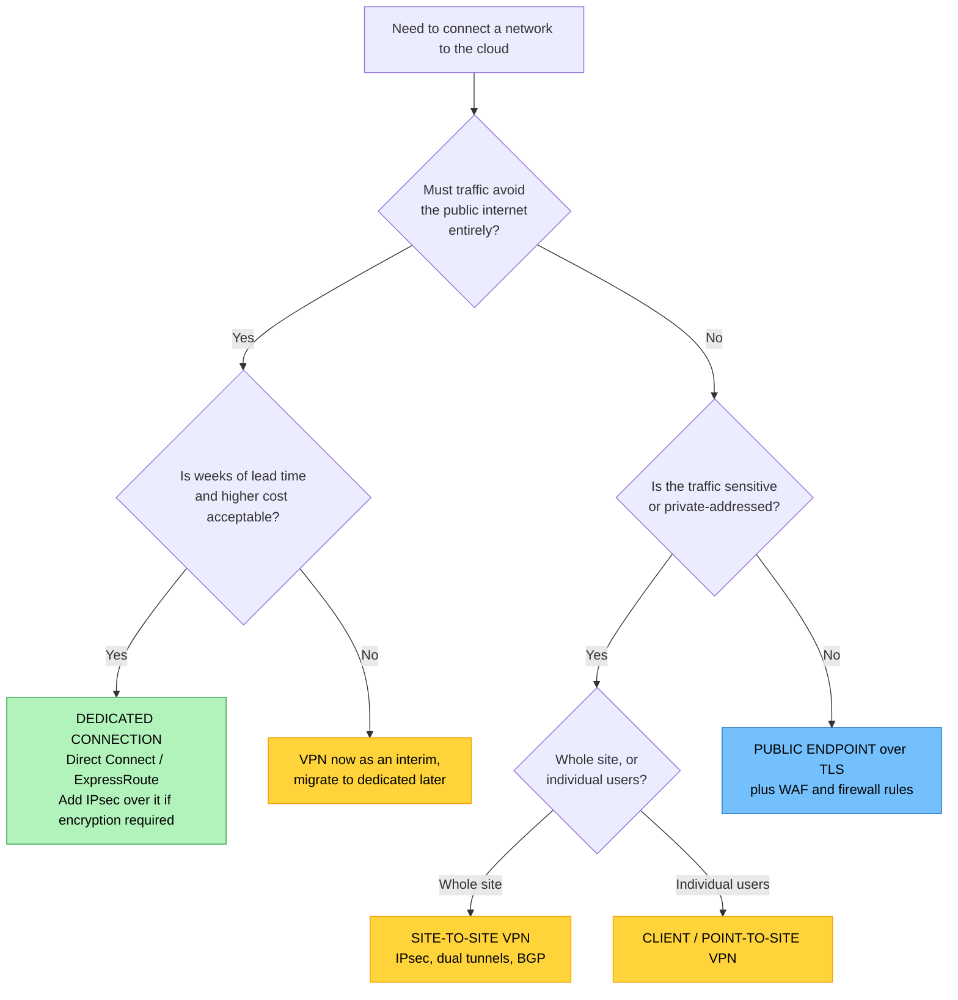
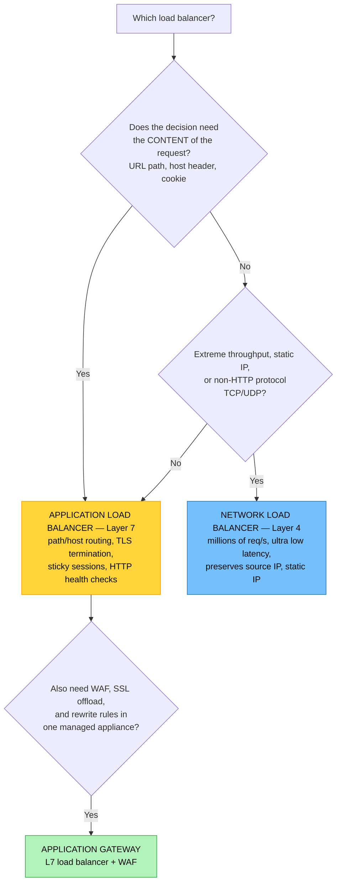

# Objective 1.3 — Explain cloud networking concepts

> **Domain 1.0 — Cloud Architecture (23% of exam)** · Exam CV0-004 V4 · Objectives doc v5.0
> **Status:** Exam-ready · **Version:** 2.0 (enhanced) · Supersedes `full notes/Objective-1.3-Cloud-Networking.md`

---

## 0. How to use this note

| Pass | What to read | Time |
|---|---|---|
| **1st (learn)** | Sections 1 → 7 in order | ~90 min |
| **2nd (drill)** | Section 2.1 (VPC anatomy) + 5.5 (route tables) + 6.4 (firewalls) until automatic | ~30 min |
| **3rd (test)** | Section 10 (practice) + Section 11 (PBQ drills) | ~40 min |
| **Exam eve** | Section 12 (60-second recall sheet) only | ~6 min |

> 📌 **This is the biggest objective in Domain 1** — 17 named sub-topics. It also feeds Domain 6 troubleshooting (6.2 is entirely network faults), so time spent here pays twice.
> **Assumed prior knowledge:** CompTIA expects Network+ or equivalent. Section 2.4 refreshes the CIDR/subnetting you must already have.

---

## 1. Official objective coverage

> **1.3 Explain cloud networking concepts.**
> - **Public and private connections to the cloud**
>   - Virtual private network (VPN)
>   - Dedicated connections
> - **Network functions, components, and services**
>   - Application load balancer
>   - Network load balancer
>   - Application gateway
>   - Content delivery network (CDN)
>   - Firewalls
>   - Virtual private cloud (VPC)
>     - Peering
>     - Transit gateway
>   - Subnets
>   - Routing and switching
>     - Virtual local area network (VLAN)
>     - Software-defined network (SDN)
>     - Border Gateway Protocol (BGP)
>     - Static routes
>     - Route tables

### 1.1 Coverage checklist

- [ ] I can read a CIDR block and say how many addresses it holds
- [ ] I know what makes a subnet **public** vs **private** (it is the route table, nothing else)
- [ ] I can choose between VPN and a dedicated connection from a requirements list
- [ ] I know a dedicated connection is **not encrypted by default**
- [ ] I know VPC peering is **non-transitive** and forbids **overlapping CIDRs**
- [ ] I can compute how many peering links a full mesh of *n* VPCs needs
- [ ] I know when a transit gateway beats peering
- [ ] I can apply **longest prefix match** to pick the winning route
- [ ] I can distinguish ALB (L7) from NLB (L4) and pick one from a scenario
- [ ] I know what an application gateway adds over a plain load balancer
- [ ] I can explain CDN cache hit vs miss and what TTL controls
- [ ] I know **security group = stateful**, **NACL = stateless**, and the ephemeral-port consequence
- [ ] I know where a WAF sits and what it blocks that a firewall does not
- [ ] I can define VLAN, SDN, BGP, static route, and route table without conflating them

### 1.2 What the verb tells you

Same as 1.2 — **"Explain concepts"**, so precision matters more than judgement. But because networking is inherently situational, expect a *mix*: definition questions on VLAN/SDN/BGP, and scenario questions on load balancer choice, connectivity choice, and firewall behaviour.

> ⚠️ Domain 6.2 (Troubleshooting: network) tests the *same* content from the failure side. Learning it once here, properly, covers both.

---

## 2. The core mental model

### 2.1 ★ Anatomy of a VPC — the master diagram

Almost every 1.3 question is about one component of this picture. Learn it as a whole.

```text
                              ☁ INTERNET
                                   │
                    ┌──────────────┴──────────────┐
                    │                             │
              ┌─────▼─────┐               ┌───────▼────────┐
              │ INTERNET  │               │  VPN GATEWAY / │◄══ encrypted tunnel ══╗
              │ GATEWAY   │               │  DEDICATED     │◄══ private circuit ═══╣
              │  (IGW)    │               │  CONNECTION    │                       ║
              └─────┬─────┘               └───────┬────────┘                  ┌────╨─────┐
   ═══════════════╪═══════════════════════════╪══════════════════════       │ ON-PREM  │
   ║  VPC   10.0.0.0/16                       │                      ║       │ DATA CTR │
   ║        └── your private, isolated, software-defined network     ║       └──────────┘
   ║                                                                 ║
   ║   ┌─────── AVAILABILITY ZONE 1 ───────┐ ┌─── AVAILABILITY ZONE 2 ───┐
   ║   │                                   │ │                            │
   ║   │  ┌─── PUBLIC SUBNET 10.0.1.0/24 ─┐│ │┌── PUBLIC SUBNET 10.0.2.0/24│
   ║   │  │  route: 0.0.0.0/0 → IGW  ★    ││ ││  route: 0.0.0.0/0 → IGW    │
   ║   │  │                               ││ ││                            │
   ║   │  │   [ LOAD BALANCER (ALB/NLB) ] ││ ││   [ LOAD BALANCER node ]   │
   ║   │  │   [ NAT GATEWAY ]─────────┐   ││ ││                            │
   ║   │  └───────────────────────────┼───┘│ │└────────────────────────────│
   ║   │              │               │    │ │            │                │
   ║   │  ┌─── PRIVATE SUBNET ────────┼───┐│ │┌── PRIVATE SUBNET ──────────│
   ║   │  │   10.0.11.0/24            │   ││ ││   10.0.12.0/24             │
   ║   │  │  route: 0.0.0.0/0 → NAT ◄─┘   ││ ││  route: 0.0.0.0/0 → NAT    │
   ║   │  │  (NO route to IGW) ★          ││ ││                            │
   ║   │  │   [ APP SERVERS ]  ← SG       ││ ││   [ APP SERVERS ]          │
   ║   │  └───────────────────────────────┘│ │└────────────────────────────│
   ║   │              │                     │ │            │                │
   ║   │  ┌─── DATA SUBNET 10.0.21.0/24 ───┐│ │┌── DATA SUBNET 10.0.22.0/24 │
   ║   │  │  route: local only (no egress) ││ ││                            │
   ║   │  │   [ DATABASE PRIMARY ]         ││ ││   [ DATABASE STANDBY ]     │
   ║   │  └────────────────────────────────┘│ │└────────────────────────────│
   ║   └────────────────────────────────────┘ └────────────────────────────┘
   ║        ▲ NACL guards each subnet border (stateless)
   ║        ▲ Security Group guards each instance (stateful)
   ═══════════════════════════════════════════════════════════════════════
                    │                                  │
              ┌─────▼──────┐                    ┌──────▼───────┐
              │ VPC PEERING│                    │   TRANSIT    │
              │ (1-to-1)   │                    │   GATEWAY    │
              └────────────┘                    │ (hub, many)  │
                                                └──────────────┘
```

**★ The two starred lines are the single most-tested fact in this objective:**

> **A subnet is "public" only because its route table has a route to the internet gateway.**
> **A subnet is "private" because it does not.** Nothing else — not its name, not its IP range, not a checkbox.

### 2.2 The OSI layers that matter here

| Layer | Name | Cloud networking items you must place here |
|---|---|---|
| **L7** | Application | **ALB**, **application gateway**, **WAF**, CDN, HTTP/HTTPS, DNS |
| L6/L5 | Presentation / Session | TLS termination, sticky sessions |
| **L4** | Transport | **NLB**, TCP/UDP, ports, **security groups**, **NACLs** |
| **L3** | Network | IP, **routing**, **route tables**, **BGP**, **static routes**, subnets, NAT, IPsec |
| **L2** | Data link | **VLAN** (802.1Q tags), switching, MAC, MTU |
| L1 | Physical | **Dedicated connection** cross-connect, fibre |

> 💡 **Fastest way to answer a load balancer question:** decide whether the requirement needs the *contents* of the request (URL, host header, cookie) — that is **L7 → ALB**. If it only needs address and port — that is **L4 → NLB**.

### 2.3 North-south vs east-west traffic

```text
                     ☁ INTERNET / USERS
                            │
                    NORTH-SOUTH traffic
                  (in and out of the cloud)
                   guarded by: IGW, WAF,
                   load balancer, NACL, SG
                            │
        ┌───────────────────▼───────────────────┐
        │                 VPC                    │
        │   [ web ] ◄── EAST-WEST ──► [ app ]   │
        │      ▲       (inside/between)   ▲     │
        │      └── EAST-WEST ──► [ database ]   │
        │        guarded by: SG, NACL, subnet   │
        │        segmentation, peering/TGW      │
        └────────────────────────────────────────┘
```

- **North-south** = client ↔ cloud. Where CDNs, load balancers, WAFs, and internet gateways live.
- **East-west** = service ↔ service inside the environment. Where subnet segmentation, security groups, peering, and transit gateways matter.
- **Why the exam cares:** most breaches escalate *east-west* after a north-south entry. Micro-segmentation and least-privilege security groups are the answer.

### 2.4 CIDR refresher — you need this to answer subnet questions

```text
   10.0.0.0 / 16
   └──┬───┘   └┬┘
   network    prefix length = how many bits are FIXED
              the remaining (32 − prefix) bits are host addresses
```

| CIDR | Total addresses | Usable in cloud¹ | Typical use |
|---|---:|---:|---|
| /16 | 65,536 | 65,531 | Whole VPC |
| /20 | 4,096 | 4,091 | Large subnet |
| /22 | 1,024 | 1,019 | Medium subnet |
| **/24** | **256** | **251** | **Standard subnet** |
| /26 | 64 | 59 | Small tier |
| /28 | 16 | 11 | Smallest usable in most clouds |
| /32 | 1 | — | A single host (used in rules/routes) |

¹ Cloud providers typically reserve **5 addresses per subnet** (network address, VPC router, DNS, a reserved address, and broadcast), so a /24 gives 251 usable, not 254 as on-prem.

**Private (RFC 1918) ranges — VPC CIDRs come from these:**
`10.0.0.0/8` · `172.16.0.0/12` · `192.168.0.0/16`

**Two rules with real consequences:**
1. **Do not overlap CIDRs** between networks you may ever need to connect — overlapping ranges make peering and VPN routing impossible without NAT.
2. **You usually cannot resize a VPC CIDR later** (you can add secondary blocks, but not shrink). Plan generously up front.

**Prefix cheat:** each step down the prefix **doubles** the addresses. `/24 = 256` → `/23 = 512` → `/22 = 1024`. Each step up halves it: `/25 = 128` → `/26 = 64`.

---

## 3. Public and private connections to the cloud

Three ways to reach cloud resources, in increasing order of privacy and cost:

```text
   ① OVER THE PUBLIC INTERNET       ② VPN OVER THE INTERNET     ③ DEDICATED CIRCUIT
   ─────────────────────────        ────────────────────────    ────────────────────
   ┌──────┐                         ┌──────┐                    ┌──────┐
   │ You  │──── plaintext or ──────►│ You  │══ IPsec tunnel ═══►│ You  │────────────►
   └──────┘     TLS, public route   └──────┘   over public       └──────┘  private
                                              internet                     fibre, no
   Cheap, instant                   Cheap, quick, encrypted      internet at all
   No privacy of path               Variable latency             Predictable, fast,
   Bandwidth = your ISP             Bandwidth-limited by         expensive, weeks
                                    encryption overhead          to provision
```

### 3.1 Virtual Private Network (VPN)

| | |
|---|---|
| **Definition** | An **encrypted tunnel across the public internet** that makes a remote network or device behave as if it were on the cloud private network. |
| **How** | Typically **IPsec** (site-to-site) or TLS/SSL (client). IPsec negotiates via IKE, then encrypts payloads with ESP in tunnel mode. |
| **Two flavours** | **Site-to-site** — gateway-to-gateway, connects a whole office/data centre to the VPC, always on. **Client / point-to-site / remote-access** — an individual user's device dials in, typically for admin access. |
| **Why choose it** | Fast to set up (hours), cheap, encrypted, works from anywhere with internet. |
| **Limitations** | **Latency and throughput follow the public internet** — variable and unguaranteed. Encryption overhead costs CPU and reduces effective MTU. Per-tunnel bandwidth caps (commonly ~1.25 Gbps) mean you need multiple tunnels + ECMP to scale. |
| **Resilience** | Use **two tunnels to two different endpoints**, and prefer **BGP (dynamic)** over static routing so failover is automatic. |
| **Exam triggers** | "encrypted tunnel over the internet", "quick to deploy", "low cost", "remote workers", "temporary/dev connectivity", "connect branch office" |

> ⚠️ **MTU trap (and a real-world Domain 6 fault):** IPsec adds ~50–60 bytes of overhead, so the usable MTU inside a VPN drops to roughly **1436** from the standard 1500. Applications that set the *don't fragment* bit then fail on large packets — the classic symptom is "small requests work, large uploads hang." The fix is MSS clamping or lowering MTU.

### 3.2 Dedicated connections

| | |
|---|---|
| **Definition** | A **private, physical circuit** from your data centre (or a colocation facility) directly into the cloud provider's network, **bypassing the public internet entirely**. |
| **Products** | AWS **Direct Connect** · Azure **ExpressRoute** · Google **Cloud Interconnect** (Dedicated or Partner) |
| **How** | You order a port (1/10/100 Gbps) at a provider-partnered facility, run a cross-connect, and establish **BGP** sessions to exchange routes. |
| **Why choose it** | **Consistent, predictable latency**; high and guaranteed bandwidth; lower per-GB egress cost at volume; path never traverses the public internet (a compliance argument); ideal for large data transfer, real-time systems, and hybrid storage. |
| **Limitations** | **Weeks to months** of lead time; expensive (port fee + cross-connect + carrier); a single circuit is a **single point of failure** — resilience needs a second circuit, ideally at a different location, or a VPN as backup. |
| **★ Critical nuance** | **A dedicated connection is NOT encrypted by default.** It is private, not confidential. If regulation requires encryption in transit, run **IPsec VPN over the dedicated connection**, or use link-layer encryption (MACsec) where offered. |
| **Exam triggers** | "consistent low latency", "guaranteed bandwidth", "must not traverse the internet", "large sustained data transfer", "predictable performance", "cost of egress at volume" |

### 3.3 Private access to provider services (adjacent, commonly tested)

Even inside a VPC, reaching a managed service like object storage may route over the public internet by default. Private endpoints fix that:

| Mechanism | What it does |
|---|---|
| **Private endpoint / interface endpoint** | Puts a private IP for the managed service **inside your subnet** (AWS PrivateLink, Azure Private Link). Traffic never leaves the provider network. |
| **Gateway endpoint** | A route-table entry sending traffic for a specific service (e.g. object storage) over the provider backbone rather than the internet. |
| **Why it matters** | Removes the need for an internet gateway or NAT for service access, reduces data-transfer cost, and satisfies "no internet route" security requirements. |

### 3.4 Choosing a connection



---

## 4. VPC, subnets, and VPC-to-VPC connectivity

### 4.1 Virtual Private Cloud (VPC)

| | |
|---|---|
| **Definition** | A **logically isolated, software-defined network** that you provision inside a public cloud provider, with your own private IP range, subnets, route tables, and gateways. |
| **Isolation** | Traffic is isolated from every other tenant *by default*. Nothing reaches it from the internet until you attach a gateway and add a route. |
| **What you define** | The CIDR block, subnets (per AZ), route tables, internet/NAT gateways, DHCP and DNS options, security groups and NACLs, endpoints, peering and gateway attachments |
| **Scope** | A VPC is **regional** — it spans all AZs in one region, but not across regions. |
| **Equivalents** | AWS VPC · Azure **VNet** · Google **VPC** (Google's is *global*, spanning regions — a rare cross-provider difference worth knowing) |
| **Exam triggers** | "logically isolated network", "private IP space", "we control the segmentation", "software-defined network in the cloud" |

### 4.2 Subnets

| | |
|---|---|
| **Definition** | A subdivision of the VPC CIDR, bound to **one Availability Zone**, that groups resources and attaches a route table and NACL. |
| **Public subnet** | Has a route `0.0.0.0/0 → internet gateway`. Resources also need a public IP to be reachable. |
| **Private subnet** | Has **no** route to the internet gateway. For outbound-only internet (patching, API calls), route `0.0.0.0/0 → NAT gateway`. |
| **Isolated / data subnet** | No default route at all — only the local VPC route. Used for databases. |
| **Why subnet at all** | ① **AZ fault tolerance** — one subnet per AZ per tier. ② **Tier isolation** — web/app/data separation limits blast radius. ③ **Granular routing** — each subnet gets its own route table. ④ **Compliance** — put regulated data in a subnet with no egress. |
| **Exam triggers** | "web tier must be reachable, database must not", "per availability zone", "no internet access but must download patches" |

**Internet gateway vs NAT gateway — a guaranteed distractor pair:**

| | **Internet gateway (IGW)** | **NAT gateway** |
|---|---|---|
| Direction | **Bidirectional** — inbound and outbound | **Outbound only** — replies allowed, new inbound denied |
| Sits in | Attached to the VPC | Inside a **public** subnet |
| Used by | Public subnets | **Private** subnets routing `0.0.0.0/0` to it |
| Needs public IP on instance | Yes | No — that's the point |
| Typical use | Load balancer, bastion, public web server | App servers fetching patches or calling external APIs |

> ⚠️ **A NAT gateway must live in a *public* subnet** (it needs its own path out via the IGW) while *serving* private subnets. Placing it in a private subnet is a classic misconfiguration and a Domain 6 troubleshooting scenario.

### 4.3 VPC peering

| | |
|---|---|
| **Definition** | A direct, private, **one-to-one** network connection between two VPCs, letting them route to each other using **private IPs** over the provider's backbone. |
| **Works across** | Accounts and regions (with the provider's cross-region peering). |
| **Cost/performance** | No bandwidth bottleneck or single point of failure — it is a routing construct, not an appliance. Data transfer is charged. |
| **★ Limitation 1 — NOT transitive** | If A↔B and B↔C are peered, **A cannot reach C**. Every pair needs its own peering connection. |
| **★ Limitation 2 — no overlapping CIDRs** | Peering fails if the two VPCs' address ranges overlap, because routing becomes ambiguous. |
| **Limitation 3 — no edge-to-edge routing** | You cannot use a peer's internet gateway, NAT gateway, or VPN connection. Each VPC needs its own path out. |
| **Scaling problem** | A full mesh of *n* VPCs needs **n(n−1)/2** connections: 4 VPCs = 6 · 10 VPCs = **45** · 20 VPCs = **190**. This is why transit gateways exist. |
| **Exam triggers** | "connect two VPCs privately", "a small number of VPCs", "without traversing the internet", "different accounts" |

### 4.4 Transit gateway

| | |
|---|---|
| **Definition** | A **regional hub** that many VPCs, VPN connections, and dedicated connections attach to, providing **transitive** routing between all of them through a single point. |
| **Topology** | **Hub-and-spoke** instead of mesh. *n* VPCs need *n* attachments, not n(n−1)/2 links. |
| **What it enables** | Transitive routing (A→hub→C works); centralised inspection (route all traffic through a firewall VPC); one place to attach hybrid links; separate route tables per attachment for segmentation (e.g. dev must not reach prod). |
| **Trade-offs** | It **is** an appliance — it has cost per attachment plus per-GB processing, and bandwidth limits per flow. Slightly higher latency than direct peering. |
| **Equivalents** | AWS Transit Gateway · Azure **Virtual WAN** / VNet peering with hub · GCP **Network Connectivity Center** |
| **Exam triggers** | "many VPCs", "hub-and-spoke", "central inspection point", "peering has become unmanageable", "connect VPCs and on-premises together" |

```text
   VPC PEERING — full mesh                TRANSIT GATEWAY — hub and spoke
   n(n−1)/2 connections                   n attachments

        VPC A ─────── VPC B                     VPC A     VPC B
          │  ╲       ╱  │                          ╲       ╱
          │    ╲   ╱    │                           ╲     ╱
          │      ╳      │                        ┌───▼───▼───┐
          │    ╱   ╲    │                        │  TRANSIT  │
          │  ╱       ╲  │                        │  GATEWAY  │◄══ VPN / Direct
        VPC C ─────── VPC D                      └───▲───▲───┘    Connect
                                                    ╱     ╲
     4 VPCs  =  6 links                          VPC C     VPC D
    10 VPCs  = 45 links   ← unmanageable
    20 VPCs  = 190 links                       4 VPCs = 4 attachments
                                              20 VPCs = 20 attachments
    NOT transitive: A↔B and B↔C               TRANSITIVE: A → TGW → C works
    does NOT give A↔C
```

---

## 5. Routing and switching

### 5.1 Virtual LAN (VLAN)

| | |
|---|---|
| **Definition** | **Layer 2** logical segmentation of a physical switched network — devices are grouped into separate broadcast domains regardless of physical location, using **802.1Q** tags in the Ethernet frame. |
| **Why** | Segmentation and security without buying separate physical switches; contains broadcast traffic; separates voice/data/management/guest traffic. |
| **Limits** | The VLAN ID field is **12 bits → 4,094 usable VLANs (1–4094)**, and VLANs do not stretch across routed boundaries. Both limits are fatal at cloud scale. |
| **Cloud successor** | **VXLAN** — an overlay that encapsulates L2 in UDP with a **24-bit** identifier → **~16 million** segments, and works across L3 boundaries. This is how multi-tenant cloud networks actually isolate tenants. (See also 1.7 — overlay networks.) |
| **Exam triggers** | "segment the network without new hardware", "broadcast domain", "802.1Q", "separate voice and data", "on-premises switch segmentation" |

### 5.2 Software-defined networking (SDN)

| | |
|---|---|
| **Definition** | An architecture that **separates the control plane** (decides where traffic goes) **from the data plane** (actually forwards packets), with a **centralised controller** programming the network through APIs. |
| **The three planes** | **Control plane** — routing decisions and topology. **Data/forwarding plane** — moves packets. **Management plane** — configuration, monitoring, policy. |
| **Interfaces** | **Northbound API** — applications and orchestrators talk to the controller. **Southbound API** — the controller programs switches/routers (e.g. OpenFlow). |
| **Why it matters here** | **Every cloud VPC is SDN.** It is why you can create a network, subnet, and route in seconds via an API call rather than cabling a switch — and why networks become code (IaC). |
| **Benefits** | Central policy, automation, elasticity, vendor-independent hardware, programmability |
| **Risks** | The controller is a **single point of failure and a high-value attack target**; needs HA controllers |
| **Exam triggers** | "separates control and data planes", "centrally programmable network", "network provisioned by API", "the underlying model of cloud networking" |

### 5.3 Border Gateway Protocol (BGP)

| | |
|---|---|
| **Definition** | The **path-vector, exterior gateway routing protocol** that exchanges reachability information between **autonomous systems (AS)** — it is the routing protocol of the internet. |
| **In cloud** | Used to **dynamically advertise routes** across hybrid links: over a **dedicated connection** (mandatory) and over a **dynamic VPN** (optional but recommended). Your on-prem router advertises your prefixes to the cloud, and the cloud advertises the VPC CIDR back. |
| **Key identifiers** | **ASN** — Autonomous System Number. Public ASNs are assigned by registries; **private ASNs are 64512–65534** and are what you normally use for a hybrid link. |
| **Why it beats static routes** | **Automatic failover.** If a circuit drops, BGP withdraws the routes and traffic moves to the backup path within seconds. Static routes keep blackholing traffic into a dead link until a human intervenes. |
| **Influencing path choice** | AS path prepending (make a path look longer/less attractive), local preference, MED. Used to make one circuit primary and another standby. |
| **Exam triggers** | "advertise on-premises routes to the cloud", "dynamic routing", "automatic failover between circuits", "autonomous system", "required for Direct Connect" |

### 5.4 Static routes

| | |
|---|---|
| **Definition** | A route **manually configured** by an administrator: "for destination X, send traffic to next-hop Y." |
| **Pros** | Simple, deterministic, no protocol overhead, no CPU cost, no neighbour relationships to break, full administrative control |
| **Cons** | **No failure detection** — a static route keeps pointing at a dead path. Does not scale (every change is manual, on every device). Error-prone at scale. |
| **When correct** | Small/simple topologies, a single path with no alternative, default routes (`0.0.0.0/0`), and cases where you deliberately want to override dynamic routing |
| **Exam triggers** | "manually configured", "simple network with one path", "administrator defines the path", "no routing protocol required" |

### 5.5 Route tables — and the rule that decides every routing question

| | |
|---|---|
| **Definition** | An ordered set of rules, associated with a subnet (or gateway), mapping a **destination CIDR** to a **target** (local, IGW, NAT gateway, peering connection, transit gateway, VPN gateway, network interface). |
| **The local route** | Every VPC route table automatically contains a route for the **VPC's own CIDR → local**. It cannot be removed or overridden — this is what makes all subnets in a VPC reach each other by default. |
| **★ Longest prefix match** | When several routes could match a destination, the **most specific route (longest prefix) wins** — regardless of order in the table. |

```text
   EXAMPLE PRIVATE SUBNET ROUTE TABLE

   ┌──────────────────┬───────────────────────┬─────────────────────────────┐
   │ DESTINATION      │ TARGET                │ Meaning                     │
   ├──────────────────┼───────────────────────┼─────────────────────────────┤
   │ 10.0.0.0/16      │ local                 │ Inside the VPC — automatic  │
   │ 172.31.0.0/16    │ pcx-peering-1         │ Reach the peered VPC        │
   │ 192.168.0.0/16   │ vgw-vpn-1             │ Reach on-prem over the VPN  │
   │ 203.0.113.50/32  │ eni-inspection-fw     │ Send THIS ONE host via FW   │
   │ 0.0.0.0/0        │ nat-gateway-1         │ Everything else → NAT out   │
   └──────────────────┴───────────────────────┴─────────────────────────────┘

   LONGEST PREFIX MATCH — traffic to 203.0.113.50:
      0.0.0.0/0        matches (prefix 0)
      203.0.113.50/32  matches (prefix 32)  ◄── WINS, most specific
   → sent to the inspection firewall, NOT the NAT gateway.

   Traffic to 203.0.113.99:  only 0.0.0.0/0 matches → NAT gateway.
```

> ⚠️ **Troubleshooting reflex:** if two resources cannot talk, check in this order — ① **route table** (is there a path?) ② **security group** (is it allowed at the instance?) ③ **NACL** (is it allowed at the subnet, *in both directions*?) ④ **DNS/name resolution** ⑤ the application itself. Missing routes and stateless NACL return rules are the two most common causes.

---

## 6. Network functions, components, and services

### 6.1 Load balancers — the L4 vs L7 split



**Application Load Balancer (L7)**
- Understands HTTP/HTTPS: routes on **URL path** (`/api` → one target group, `/images` → another), **host header** (`shop.example.com` vs `blog.example.com`), headers, methods, query strings
- **TLS termination** and certificate management; HTTP/2 and WebSocket support
- Original client IP is passed in the **`X-Forwarded-For`** header (because the LB is a proxy)
- **Sticky sessions** via a cookie
- Best for: web apps, APIs, microservices, container/serverless targets

**Network Load Balancer (L4)**
- Operates on TCP/UDP/TLS — address and port only, no content inspection
- **Millions of requests per second, ultra-low latency**, handles sudden traffic spikes
- **Preserves the client source IP** natively (no header needed) and supports **static/elastic IPs** — which matters when customers must allowlist your IP
- Best for: gaming, IoT, VoIP, database proxies, MQTT, non-HTTP protocols, or extreme performance

**Application gateway**
- A managed **L7 appliance combining load balancing with a Web Application Firewall**, SSL/TLS offload, URL rewriting, and redirection
- Azure's product is literally named *Application Gateway*; the concept maps to AWS **ALB + WAF** together
- Choose it when the requirement pairs **routing with application-layer protection** in one managed service

**Gateway load balancer (adjacent, worth recognising)** — transparently inserts third-party virtual appliances (firewalls, IDS/IPS) into the traffic path at L3, preserving the original packet.

**Load balancing algorithms — expect a definition question:**

| Algorithm | How it distributes | Best when |
|---|---|---|
| **Round robin** | Each server in turn, evenly | Servers are identical, requests are uniform |
| **Weighted round robin** | Proportional to assigned weight | Servers have different capacities |
| **Least connections** | To the server with fewest active connections | Sessions vary in duration |
| **Least response time** | Fewest connections *and* fastest response | Latency-sensitive workloads |
| **Source IP hash** | Same client always to the same server | Basic session affinity without cookies |
| **Random / power of two choices** | Random pick(s) | Very large fleets |

**Two supporting mechanisms:**
- **Health checks** — the LB probes each target on an interval; failures beyond a threshold remove the target from rotation. **This is what makes a load balancer an availability tool, not just a distribution tool** (ties directly to 1.2).
- **Sticky sessions / session affinity** — binds a client to one target. Necessary for stateful apps, but it **undermines even distribution and breaks graceful scaling**; the cloud-native fix is to externalise session state (see 1.5).

### 6.2 Content delivery network (CDN)

| | |
|---|---|
| **Definition** | A globally distributed network of **edge caches (PoPs)** that store copies of content close to users, so requests are served locally instead of from the origin. |
| **Benefits** | ① **Latency** — content served from a nearby PoP. ② **Origin offload** — fewer requests reach your servers, so they scale further and cost less. ③ **Egress cost** — CDN transfer is usually cheaper than origin egress. ④ **Availability** — cached content survives brief origin outages. ⑤ **Security** — absorbs DDoS at the edge, and typically integrates TLS and WAF. |
| **Key controls** | **TTL** — how long an object stays cached before revalidation. **Cache invalidation / purge** — force-expire content after a deployment. **Cache key** — what makes two requests "the same" object. **Origin shield** — a mid-tier cache that further reduces origin load. **Signed URLs/cookies** — restrict access to private content. |
| **Content types** | Best for **static** assets (images, CSS/JS, video, downloads). **Dynamic** content can still benefit from *dynamic acceleration* — optimised routing and persistent connections over the provider's backbone — even though it is not cacheable. |
| **Exam triggers** | "global users report slow load times", "reduce load on origin servers", "cache static content near users", "reduce egress cost", "absorb traffic spikes / DDoS" |

```text
   REQUEST 1 — CACHE MISS                  REQUEST 2 — CACHE HIT
   ──────────────────────                  ────────────────────
   User (Tokyo)                            User (Tokyo)
       │                                       │
       ▼  5 ms                                 ▼  5 ms
   ┌────────────┐                          ┌────────────┐
   │ EDGE PoP   │ ── not cached ──┐        │ EDGE PoP   │ ✓ cached, within TTL
   │  Tokyo     │                 │        │  Tokyo     │
   └────────────┘                 │        └─────┬──────┘
       ▲                          ▼              │
       │                   ┌────────────┐        ▼
       └── cache + serve ──│  ORIGIN    │    served immediately
              180 ms       │ (Virginia) │    TOTAL ≈ 5 ms
                           └────────────┘    origin never contacted
        TOTAL ≈ 185 ms
```

### 6.3 Firewalls — the layered model

```text
   ☁ INTERNET
       │
   ┌───▼──────────────────────────────────────────────┐
   │ ① WAF — Layer 7                                  │  SQL injection, XSS,
   │    inspects HTTP requests/payloads                │  OWASP Top 10, bot rules
   ├──────────────────────────────────────────────────┤
   │ ② NETWORK FIREWALL — managed, stateful, L3–L7    │  IDS/IPS, deep packet
   │    VPC-wide inspection and egress filtering       │  inspection, domain filtering
   ├──────────────────────────────────────────────────┤
   │ ③ NACL — SUBNET boundary, STATELESS              │  allow AND deny, numbered
   │    coarse allow/deny by IP, port, protocol        │  rules, evaluated in order
   ├──────────────────────────────────────────────────┤
   │ ④ SECURITY GROUP — INSTANCE/ENI, STATEFUL        │  allow only, default deny
   │    the primary control you should rely on         │  inbound, all rules evaluated
   ├──────────────────────────────────────────────────┤
   │ ⑤ HOST FIREWALL — OS level (iptables, Windows FW)│  last line, inside the VM
   └──────────────────────────────────────────────────┘
                    DEFENCE IN DEPTH
```

**★ The stateful vs stateless distinction — the most-tested firewall fact:**

| | **Security group** | **Network ACL** |
|---|---|---|
| Applies to | Instance / network interface | **Subnet** |
| **State** | **Stateful** | **Stateless** |
| Return traffic | **Automatically allowed** — if the request was permitted, the reply is too | **Must be explicitly allowed** by a separate outbound rule |
| Rule types | **Allow only** (implicit deny for anything unmatched) | **Allow *and* deny** |
| Evaluation | All rules evaluated; any match permits | **Numbered, lowest number first**; first match wins |
| Default | Deny all inbound, allow all outbound | Default NACL allows all; custom NACL denies all |
| Best used as | Your **primary** access control | Coarse subnet-wide guardrails and explicit deny (e.g. block a bad IP) |

> ⚠️ **The ephemeral-port trap.** Because NACLs are **stateless**, allowing inbound TCP 443 is not enough — the server's *reply* leaves from a high-numbered **ephemeral port (typically 1024–65535)**, so you also need an **outbound allow** for that range. Symptom: "the connection is accepted but nothing comes back." This appears on nearly every practice exam and in Domain 6.

**Firewall vs WAF:**

| | Traditional / network firewall | **WAF** |
|---|---|---|
| Layer | L3–L4 (+ L7 in NGFW) | **L7 only** |
| Decides on | IP, port, protocol, state | **HTTP request content** — URI, headers, body, parameters |
| Blocks | Unauthorised network access | **SQL injection, XSS, path traversal, bad bots, OWASP Top 10** |
| Cannot | Understand application payloads | Protect non-HTTP protocols |

A firewall would happily allow a malicious SQL-injection payload, because it arrives on the port 443 you deliberately opened. Only the WAF sees inside the request.

### 6.4 Adjacent services worth recognising

| Service | Role |
|---|---|
| **DNS** | Name resolution; also a **traffic-steering** tool — weighted, latency-based, geolocation, and **health-check failover** routing (the mechanism behind multi-region DR in 1.2) |
| **NAT gateway** | Outbound-only internet for private subnets |
| **Internet gateway** | Bidirectional internet for public subnets |
| **VPC endpoint / private link** | Private access to managed services without internet |
| **DDoS protection** | Absorbs volumetric attacks at the edge, usually alongside the CDN |
| **Service mesh** | East-west traffic management, mTLS, and observability *between microservices* (see 1.5/1.6) |

---

## 7. Comparison tables

### 7.1 VPN vs dedicated connection

| Aspect | **VPN (site-to-site)** | **Dedicated connection** |
|---|---|---|
| Path | Public internet | **Private physical circuit** |
| **Encrypted by default** | ✅ **Yes** (IPsec) | ❌ **No** — private ≠ encrypted |
| Latency | Variable, internet-dependent | **Consistent and low** |
| Bandwidth | Moderate (~1.25 Gbps/tunnel), scale with more tunnels | 1 / 10 / 100 Gbps guaranteed |
| Provisioning | **Hours** | **Weeks to months** |
| Cost | Low | High (port + cross-connect + carrier) |
| Resilience | Dual tunnels, BGP | Needs a second circuit or a VPN backup |
| Routing | Static or BGP | **BGP required** |
| Best for | Dev/test, branch offices, backup path, quick start | Production, latency-sensitive, sustained bulk transfer, compliance on path |

### 7.2 ALB vs NLB vs application gateway

| Aspect | **ALB (L7)** | **NLB (L4)** | **Application gateway** |
|---|---|---|---|
| OSI layer | 7 | 4 | 7 |
| Protocols | HTTP, HTTPS, WebSocket, gRPC | TCP, UDP, TLS | HTTP, HTTPS |
| Routes on | URL path, host, header, method | IP, port, protocol | URL path, host, header |
| Client IP | `X-Forwarded-For` header | **Preserved natively** | `X-Forwarded-For` header |
| Static IP | No (DNS name) | **Yes** | Varies |
| TLS termination | Yes | Yes (TLS listener) | Yes + offload |
| **Built-in WAF** | No (attach separately) | No | **Yes** |
| Performance | High | **Extreme** (millions rps) | High |
| Best for | Web apps, APIs, microservices | Gaming, IoT, DB proxy, IP allowlisting | Web apps needing routing **and** L7 protection |

### 7.3 Peering vs transit gateway

| Aspect | **VPC peering** | **Transit gateway** |
|---|---|---|
| Topology | Point-to-point mesh | **Hub-and-spoke** |
| Connections for *n* VPCs | **n(n−1)/2** | **n** |
| **Transitive routing** | ❌ **No** | ✅ **Yes** |
| Overlapping CIDRs | Not allowed | Not allowed |
| Central inspection | ❌ No | ✅ Yes |
| Attach VPN / dedicated links | No | ✅ Yes |
| Cost | Data transfer only | Per attachment **+** per GB processed |
| Latency | Lowest (direct) | Slightly higher (extra hop) |
| Best for | 2–5 VPCs, simple topologies | Many VPCs, hybrid, segmented enterprise |

### 7.4 Security group vs NACL vs network firewall vs WAF

| Aspect | **Security group** | **NACL** | **Network firewall** | **WAF** |
|---|---|---|---|---|
| Scope | Instance / ENI | Subnet | VPC | Application / LB |
| Layer | 3–4 | 3–4 | 3–7 | **7** |
| Stateful | ✅ Yes | ❌ **No** | ✅ Yes | ✅ Yes |
| Deny rules | ❌ No | ✅ **Yes** | ✅ Yes | ✅ Yes |
| Deep inspection | ❌ No | ❌ No | ✅ **IDS/IPS, DPI** | ✅ HTTP payloads |
| Typical use | Primary least-privilege control | Subnet guardrail, block a bad IP | Centralised egress filtering, threat detection | SQLi/XSS/OWASP protection |

### 7.5 Routing constructs

| Aspect | **Static route** | **BGP (dynamic)** |
|---|---|---|
| Configuration | Manual | Learned automatically |
| Reacts to failure | ❌ **No** — keeps blackholing | ✅ **Yes** — withdraws and reroutes in seconds |
| Scales | Poorly | Very well |
| Overhead | None | Protocol, CPU, neighbour state |
| Required for | Simple single paths, default routes | **Dedicated connections**; recommended for VPN |
| Predictability | Total | Depends on path attributes |

### 7.6 Multi-cloud terminology map

| Concept | AWS | Azure | Google Cloud |
|---|---|---|---|
| Isolated network | **VPC** | **VNet** | **VPC** (global) |
| Site-to-site VPN | Site-to-Site VPN | VPN Gateway | Cloud VPN |
| Dedicated connection | **Direct Connect** | **ExpressRoute** | **Cloud Interconnect** |
| L7 load balancer | Application Load Balancer | **Application Gateway** | HTTP(S) Load Balancing |
| L4 load balancer | Network Load Balancer | Azure Load Balancer | TCP/UDP Load Balancing |
| CDN | CloudFront | Front Door / Azure CDN | Cloud CDN |
| Instance firewall | Security Group | Network Security Group (NSG) | Firewall rules |
| Subnet firewall | Network ACL | NSG at subnet | Firewall rules (VPC-wide) |
| Managed firewall | Network Firewall | Azure Firewall | Cloud NGFW |
| WAF | AWS WAF | Azure WAF | Cloud Armor |
| VPC-to-VPC | VPC Peering | VNet Peering | VPC Network Peering |
| Hub | **Transit Gateway** | **Virtual WAN** | Network Connectivity Center |
| Private service access | PrivateLink / VPC Endpoint | Private Link | Private Service Connect |
| DNS | Route 53 | Azure DNS / Traffic Manager | Cloud DNS |

### 7.7 Ports and protocols you should recognise

| Port | Protocol | Port | Protocol |
|---|---|---|---|
| 20 / 21 | FTP data / control | 445 | SMB |
| **22** | **SSH / SFTP** | 587 | SMTP submission |
| 23 | Telnet (insecure) | 636 | LDAPS |
| 25 | SMTP | **1433** | Microsoft SQL Server |
| **53** | **DNS** (UDP + TCP) | 1521 | Oracle DB |
| **80** | **HTTP** | **3306** | **MySQL / MariaDB** |
| 123 | NTP | **3389** | **RDP** |
| 161 / 162 | SNMP | **5432** | **PostgreSQL** |
| 389 | LDAP | 6443 | Kubernetes API server |
| **443** | **HTTPS / TLS** | 27017 | MongoDB |

**MTU:** standard Ethernet **1500** · jumbo frames **9000/9001** inside a VPC · **~1436 effective inside an IPsec VPN**.

---

## 8. Exam traps & distractor patterns

| # | Trap | The truth |
|---|---|---|
| 1 | "A dedicated connection is encrypted" | It is **private, not encrypted**. Layer IPsec or MACsec over it if encryption is required |
| 2 | "A subnet is public because of its IP range or name" | It is public **only** because its route table points `0.0.0.0/0` at an **internet gateway** |
| 3 | "VPC peering is transitive" | It is **not**. A↔B and B↔C never gives A↔C. Use a transit gateway |
| 4 | "Peering works with any two VPCs" | **Overlapping CIDRs make peering impossible** |
| 5 | "You can use a peered VPC's internet gateway or VPN" | No edge-to-edge routing — each VPC needs its own path out |
| 6 | "Security groups and NACLs behave the same" | SG = **stateful, allow-only, instance**. NACL = **stateless, allow+deny, subnet** |
| 7 | "Allowing inbound 443 on a NACL is enough" | Stateless — you must also allow **outbound ephemeral ports 1024–65535** for the reply |
| 8 | "A firewall stops SQL injection" | Only a **WAF** inspects HTTP payloads. The firewall already allowed port 443 |
| 9 | "Use an NLB to route `/api` to a different service" | Path routing is **L7 → ALB**. An NLB cannot see the URL |
| 10 | "An ALB gives you a static IP to allowlist" | ALB is a DNS name; **NLB** provides static/elastic IPs |
| 11 | "Route order in the table decides the winner" | **Longest prefix match** wins, regardless of order |
| 12 | "The local VPC route can be overridden" | It cannot be removed or overridden |
| 13 | "A NAT gateway belongs in the private subnet" | It sits in a **public** subnet and *serves* private subnets |
| 14 | "A NAT gateway allows inbound connections" | **Outbound only** — replies are permitted, new inbound sessions are not |
| 15 | "Static routes fail over automatically" | They do not. **BGP** is what withdraws a dead path |
| 16 | "VLANs are how cloud tenants are isolated" | The 12-bit VLAN ID caps at 4,094 — cloud uses **VXLAN** overlays (24-bit, ~16 M) |
| 17 | "SDN is a product you buy" | It is an **architecture** — separating control plane from data plane. Every VPC is SDN |
| 18 | "A CDN speeds up everything" | It caches **static** content best; dynamic content benefits only from route optimisation |
| 19 | "Sticky sessions are a best practice" | They break even distribution and graceful scaling — externalise session state instead |
| 20 | "A VPN gives guaranteed bandwidth" | It rides the **public internet** — best-effort. Guarantees need a dedicated circuit |

**Disambiguation drill — the hardest pairs:**

| Pair | The deciding question |
|---|---|
| **ALB vs NLB** | Does the routing decision need the **content** of the request? Yes → ALB |
| **IGW vs NAT gateway** | Is **inbound** connectivity needed? Yes → IGW. Outbound only → NAT |
| **SG vs NACL** | Instance-level and stateful → SG. Subnet-level, stateless, needs **deny** → NACL |
| **Firewall vs WAF** | Blocking a **port/IP** → firewall. Blocking a **payload/attack pattern** → WAF |
| **Peering vs transit gateway** | How many VPCs, and is **transitive** routing needed? |
| **Static vs BGP** | Is **automatic failover** required? Yes → BGP |
| **VLAN vs VXLAN** | On-prem L2 segmentation → VLAN. Cloud-scale multi-tenant overlay → VXLAN |
| **CDN vs edge computing** | **Caches content** → CDN. **Runs your logic** → edge computing (see 1.2) |
| **VPN vs dedicated** | Encrypted-and-quick → VPN. Consistent-and-guaranteed → dedicated |

---

## 9. Keyword → answer trigger table

| If you see… | Think |
|---|---|
| encrypted tunnel · over the internet · quick to set up · branch office · remote workers | **VPN** |
| consistent latency · guaranteed bandwidth · never touches the internet · bulk transfer · weeks to provision | **Dedicated connection** |
| private but must also be encrypted | **IPsec VPN over the dedicated connection** |
| logically isolated network · own private IP range | **VPC** |
| route to internet gateway · needs public IP | **Public subnet** |
| outbound patches only · no inbound from internet | **Private subnet + NAT gateway** |
| connect two VPCs privately · small number · different accounts | **VPC peering** |
| many VPCs · hub-and-spoke · central inspection · peering unmanageable · transitive | **Transit gateway** |
| route on URL path · host header · cookie · HTTP | **ALB (L7)** |
| millions of requests · TCP/UDP · static IP · preserve source IP · gaming/IoT | **NLB (L4)** |
| load balancing **plus** WAF in one managed service | **Application gateway** |
| global users · slow static content · reduce origin load · cache at the edge | **CDN** |
| block SQL injection / XSS / OWASP | **WAF** |
| instance-level · stateful · allow-only | **Security group** |
| subnet-level · stateless · need an explicit **deny** | **NACL** |
| connection established but no reply returns | **Stateless NACL missing ephemeral outbound** |
| most specific route wins | **Longest prefix match** |
| advertise on-prem routes · automatic failover · autonomous system | **BGP** |
| manually configured path · one route, no alternative | **Static route** |
| 802.1Q · broadcast domain · segment a physical switch | **VLAN** |
| control plane separated from data plane · API-provisioned network | **SDN** |
| 4,094 limit exceeded · multi-tenant overlay at cloud scale | **VXLAN** |

---

## 10. Practice questions

<details>
<summary><b>Q1.</b> A subnet's route table contains only <code>10.0.0.0/16 → local</code> and <code>0.0.0.0/0 → nat-gateway-1</code>. How should this subnet be classified?</summary>

A. Public subnet · **B. Private subnet** · C. Isolated subnet · D. DMZ subnet

**Correct: B — private.** There is no route to an internet gateway, so nothing can reach it from the internet; the NAT gateway gives outbound-only access.
- **A wrong:** A public subnet requires `0.0.0.0/0 → internet gateway`.
- **C wrong:** A fully isolated subnet would have only the local route and no default route at all.
- **D wrong:** "DMZ" is a design term, not a route-table classification.
</details>

<details>
<summary><b>Q2.</b> An organisation requires that traffic between its data centre and the cloud never traverses the public internet **and** is encrypted in transit. What should it implement?</summary>

A. A dedicated connection alone · B. A site-to-site VPN alone · **C. A dedicated connection with an IPsec VPN running over it** · D. VPC peering

**Correct: C.** A dedicated connection provides the private path but is **not encrypted by default**, so IPsec (or MACsec) is layered on top to meet the encryption requirement.
- **A wrong:** Private is not the same as encrypted — this is the single most-tested nuance in the objective.
- **B wrong:** A VPN is encrypted but rides the public internet, failing the first requirement.
- **D wrong:** Peering connects two VPCs; it does not reach an on-premises data centre.
</details>

<details>
<summary><b>Q3.</b> VPC-A is peered with VPC-B, and VPC-B is peered with VPC-C. Instances in VPC-A cannot reach VPC-C. Why?</summary>

A. Overlapping CIDR blocks · **B. VPC peering is not transitive** · C. Missing internet gateway · D. Security groups block the traffic

**Correct: B.** Peering is strictly one-to-one; traffic will not transit through VPC-B. Either peer A directly with C or use a transit gateway.
- **A wrong:** Overlapping CIDRs would have prevented the peering connections from being created at all.
- **C wrong:** Peering uses private IPs and needs no internet gateway.
- **D wrong:** Possible in general, but the described topology fails even with permissive security groups.
</details>

<details>
<summary><b>Q4.</b> An enterprise needs to connect 20 VPCs plus two on-premises sites, with the ability to inspect all inter-VPC traffic centrally. What is the BEST solution?</summary>

A. Full-mesh VPC peering · **B. A transit gateway** · C. Internet gateways in each VPC · D. A separate VPN per VPC pair

**Correct: B.** A hub-and-spoke transit gateway needs 20 attachments instead of 190 peering connections, supports transitive routing, terminates the hybrid links, and enables a central inspection VPC.
- **A wrong:** 20 VPCs would require n(n−1)/2 = **190** peering connections, and peering offers no central inspection.
- **C wrong:** That would expose private traffic to the internet.
- **D wrong:** Even more connections to manage, with worse performance.
</details>

<details>
<summary><b>Q5.</b> A NACL allows inbound TCP 443. Clients establish a connection but receive no response. What is the MOST likely cause?</summary>

A. The security group denies inbound 443 · **B. The NACL is stateless and lacks an outbound rule for ephemeral ports** · C. The route table has no local route · D. The load balancer health check failed

**Correct: B.** NACLs are stateless, so the server's reply — sourced from an ephemeral port in 1024–65535 — needs its own outbound allow rule.
- **A wrong:** The connection was accepted, so inbound is permitted.
- **C wrong:** The local route is automatic and cannot be removed.
- **D wrong:** A failed health check would prevent the connection being established at all.
</details>

<details>
<summary><b>Q6.</b> Requests to <code>example.com/api</code> must reach one target group and <code>example.com/images</code> another. Which component is required?</summary>

**A. Application load balancer (Layer 7)** · B. Network load balancer (Layer 4) · C. NAT gateway · D. Transit gateway

**Correct: A.** Routing by URL path requires inspection of the HTTP request, which is a Layer 7 function.
- **B wrong:** An NLB sees only IP, port, and protocol — it cannot read the path.
- **C wrong:** A NAT gateway provides outbound internet access, not request routing.
- **D wrong:** A transit gateway is a routing hub between networks.
</details>

<details>
<summary><b>Q7.</b> A customer must allowlist your service by IP address, and the workload uses a custom TCP protocol on port 9000 with extreme throughput requirements. Which load balancer fits?</summary>

A. Application load balancer · **B. Network load balancer** · C. Application gateway · D. CDN

**Correct: B — NLB.** It supports arbitrary TCP, offers static/elastic IPs for allowlisting, preserves the source IP, and delivers the highest throughput at lowest latency.
- **A/C wrong:** Both are Layer 7 and handle HTTP/HTTPS, not a custom TCP protocol, and neither provides a static IP.
- **D wrong:** A CDN caches HTTP content.
</details>

<details>
<summary><b>Q8.</b> A route table contains <code>0.0.0.0/0 → nat-gw</code> and <code>203.0.113.0/24 → vgw-vpn</code>. Where is traffic to 203.0.113.45 sent?</summary>

A. The NAT gateway · **B. The VPN gateway** · C. Dropped as ambiguous · D. Whichever rule appears first

**Correct: B.** Longest prefix match: `/24` is more specific than `/0`, so the VPN gateway route wins.
- **A wrong:** The default route only applies when nothing more specific matches.
- **C wrong:** Longest prefix match resolves the ambiguity deterministically.
- **D wrong:** Route tables are not evaluated in listed order; specificity decides.
</details>

<details>
<summary><b>Q9.</b> Which statement about security groups is TRUE?</summary>

A. They support explicit deny rules · **B. They are stateful, so return traffic for an allowed request is automatically permitted** · C. They apply at the subnet boundary · D. Rules are evaluated in numbered order and the first match wins

**Correct: B.** Security groups track connection state, so replies do not need their own rule.
- **A wrong:** Security groups are allow-only, with an implicit deny; explicit denies come from NACLs.
- **C wrong:** They apply to instances/network interfaces; NACLs apply to subnets.
- **D wrong:** That describes NACL evaluation.
</details>

<details>
<summary><b>Q10.</b> A web application behind a firewall that permits only ports 80 and 443 is compromised via SQL injection. Which control would MOST likely have prevented it?</summary>

A. A stricter network ACL · **B. A web application firewall** · C. A NAT gateway · D. VPC peering

**Correct: B — WAF.** The attack arrives over the legitimately open port 443; only a Layer 7 WAF inspects the request payload and blocks injection patterns.
- **A wrong:** A NACL filters by IP/port/protocol and cannot see the payload.
- **C/D wrong:** Neither is a security-inspection control.
</details>

<details>
<summary><b>Q11.</b> Which routing approach automatically reroutes traffic within seconds when a dedicated circuit fails?</summary>

A. Static routes · **B. BGP** · C. A larger route table · D. VLAN tagging

**Correct: B.** BGP withdraws the routes advertised over the failed circuit, and traffic converges onto the backup path without human intervention.
- **A wrong:** A static route keeps pointing at the dead path, blackholing traffic.
- **C wrong:** Table size is irrelevant to failure detection.
- **D wrong:** VLANs are Layer 2 segmentation, not routing.
</details>

<details>
<summary><b>Q12.</b> What BEST describes software-defined networking?</summary>

A. A product that replaces physical switches · **B. An architecture that separates the control plane from the data plane with a centralised, programmable controller** · C. A protocol for routing between autonomous systems · D. An encrypted tunnel over the internet

**Correct: B.** Control/data plane separation with centralised programmability is the defining characteristic, and it is what makes cloud VPCs API-provisionable.
- **A wrong:** SDN is an architecture, not a hardware replacement product.
- **C wrong:** That is BGP.
- **D wrong:** That is a VPN.
</details>

<details>
<summary><b>Q13.</b> A company reports that users worldwide experience slow loading of images and video, while its origin servers are also overloaded. What addresses BOTH problems?</summary>

A. A larger instance type · **B. A content delivery network** · C. A network load balancer · D. VPC peering

**Correct: B — CDN.** Edge caches serve content near users (cutting latency) and absorb most requests before they reach the origin (cutting load).
- **A wrong:** Scaling up does nothing about geographic latency.
- **C wrong:** A load balancer distributes within a region; it does not cache globally.
- **D wrong:** Peering connects VPCs and is unrelated.
</details>

<details>
<summary><b>Q14.</b> Instances in a private subnet must download OS patches from the internet, but must never accept inbound connections from it. What should be configured?</summary>

A. Attach an internet gateway and assign public IPs · **B. Route <code>0.0.0.0/0</code> to a NAT gateway placed in a public subnet** · C. Add a VPC peering connection · D. Place the instances in a public subnet with a restrictive NACL

**Correct: B.** A NAT gateway provides outbound-only internet access; the private instances need no public IPs and cannot be reached inbound.
- **A wrong:** An internet gateway plus public IPs makes them inbound-reachable.
- **C wrong:** Peering connects VPCs, not the internet.
- **D wrong:** Placing them in a public subnet exposes them unnecessarily and relies solely on filtering.
</details>

<details>
<summary><b>Q15.</b> A VPN tunnel is up, small requests succeed, but large file uploads hang. What is the MOST likely cause?</summary>

A. Expired IPsec keys · **B. MTU/fragmentation — IPsec overhead reduces the usable MTU below 1500** · C. BGP has not converged · D. The security group blocks large packets

**Correct: B.** IPsec encapsulation adds ~50–60 bytes, so packets sized for a 1500-byte MTU with the *don't fragment* bit set are dropped. MSS clamping or lowering the MTU resolves it.
- **A wrong:** Expired keys would drop the tunnel entirely, not just large transfers.
- **C wrong:** A routing problem would not be size-dependent.
- **D wrong:** Security groups filter by port and protocol, not packet size.
</details>

<details>
<summary><b>Q16.</b> Which is a limitation of VLANs that VXLAN was designed to overcome?</summary>

A. VLANs cannot carry IP traffic · **B. The 12-bit VLAN ID allows only 4,094 segments and cannot span Layer 3 boundaries** · C. VLANs require BGP · D. VLANs are inherently unencrypted

**Correct: B.** VXLAN's 24-bit identifier supports ~16 million segments and encapsulates Layer 2 over Layer 3, which is what multi-tenant cloud networks require.
- **A wrong:** VLANs carry IP traffic normally.
- **C wrong:** VLANs are Layer 2 and unrelated to BGP.
- **D wrong:** True but not the scalability limitation VXLAN was created to solve.
</details>

<details>
<summary><b>Q17.</b> Two VPCs both use the CIDR block <code>10.0.0.0/16</code>. What is the consequence?</summary>

**A. They cannot be peered, because overlapping CIDRs make routing ambiguous** · B. Peering works but is slower · C. Peering works if security groups permit it · D. Only the first VPC can initiate traffic

**Correct: A.** Overlapping address space cannot be routed unambiguously; the ranges must be re-addressed or NAT must be introduced.
- **B/C/D wrong:** The peering connection cannot be established at all — this is a hard constraint, not a performance or permissions issue.
</details>

<details>
<summary><b>Q18.</b> Which combination BEST describes the difference between a security group and a network ACL?</summary>

A. SG is stateless at the subnet; NACL is stateful at the instance · **B. SG is stateful at the instance and allow-only; NACL is stateless at the subnet and supports deny** · C. Both are stateful, differing only in scope · D. Both support deny rules and are evaluated in numbered order

**Correct: B.** That captures all three distinguishing dimensions: state, scope, and rule types.
- **A wrong:** The two are inverted.
- **C wrong:** NACLs are stateless.
- **D wrong:** Security groups have no deny rules and are not numbered.
</details>

<details>
<summary><b>Q19.</b> An application must preserve the original client IP address for geolocation, and cannot be modified to read HTTP headers. Which load balancer should be used?</summary>

A. Application load balancer · **B. Network load balancer** · C. Application gateway · D. CDN

**Correct: B.** An NLB operates at Layer 4 and preserves the source IP natively, with no header parsing required.
- **A/C wrong:** Both are Layer 7 proxies that replace the source IP and pass the original in `X-Forwarded-For`, which the application cannot read.
- **D wrong:** A CDN is a caching layer, not a load balancer, and also forwards client IPs in headers.
</details>

<details>
<summary><b>Q20.</b> Which statement about a transit gateway is TRUE?</summary>

A. It provides non-transitive routing only · B. It eliminates the need for route tables · **C. It supports transitive routing and can also terminate VPN and dedicated connections** · D. It permits overlapping CIDR blocks between attached VPCs

**Correct: C.** A transit gateway is a hub that routes transitively between all attachments, including hybrid connectivity.
- **A wrong:** Transitivity is its main advantage over peering.
- **B wrong:** Route tables are still required, both in the VPCs and on the gateway.
- **D wrong:** Overlapping CIDRs remain unroutable.
</details>

<details>
<summary><b>Q21.</b> Which control determines whether a subnet is public or private?</summary>

A. The subnet's CIDR block size · B. The security group attached to instances · **C. Whether its route table has a route to an internet gateway** · D. Whether it is in an availability zone

**Correct: C.** Public vs private is purely a routing property.
- **A wrong:** Address ranges are unrelated to internet reachability.
- **B wrong:** Security groups filter traffic but do not create a path to the internet.
- **D wrong:** Every subnet lives in an AZ, public or private.
</details>

<details>
<summary><b>Q22.</b> A team wants to reach a managed object-storage service from private subnets without any internet gateway or NAT gateway. What should they use?</summary>

A. VPC peering · B. A transit gateway · **C. A VPC endpoint / private link to the service** · D. A site-to-site VPN

**Correct: C.** A VPC endpoint routes traffic to the managed service over the provider's backbone, removing the need for internet egress and reducing data-transfer cost.
- **A/B wrong:** Both connect networks to each other, not to a managed service privately.
- **D wrong:** A VPN connects to an external network, not to an in-cloud managed service.
</details>

<details>
<summary><b>Q23.</b> Which load balancing algorithm sends new requests to the server currently handling the fewest active sessions?</summary>

A. Round robin · **B. Least connections** · C. Source IP hash · D. Weighted round robin

**Correct: B.** Least connections adapts to varying session durations rather than assuming uniform requests.
- **A wrong:** Round robin rotates evenly regardless of current load.
- **C wrong:** Source IP hash provides affinity, not load awareness.
- **D wrong:** Weighted round robin accounts for capacity, not current connection count.
</details>

<details>
<summary><b>Q24.</b> After a deployment, users continue to receive the previous version of a JavaScript file from the CDN. What is the MOST appropriate action?</summary>

A. Restart the origin servers · **B. Invalidate/purge the cached object, or use a versioned filename** · C. Increase the TTL · D. Disable the load balancer health check

**Correct: B.** The object is still within its TTL at the edge; purging it or changing the cache key (a versioned filename) forces the new copy to be fetched.
- **A wrong:** The origin already serves the new file — the stale copy is at the edge.
- **C wrong:** A longer TTL makes the problem last longer.
- **D wrong:** Health checks are unrelated to cache freshness.
</details>

<details>
<summary><b>Q25.</b> A design requires that development VPCs must never reach production VPCs, while both must reach a shared-services VPC. All are attached to a transit gateway. How is this achieved?</summary>

A. Overlapping CIDR blocks · **B. Separate transit gateway route tables per attachment, so dev and prod have no routes to each other** · C. Deleting the local route in each VPC · D. Assigning all VPCs the same security group

**Correct: B.** A transit gateway supports multiple route tables; associating dev and prod with tables that contain only the shared-services route enforces the segmentation.
- **A wrong:** Overlapping CIDRs break routing entirely rather than segmenting it.
- **C wrong:** The local route cannot be deleted.
- **D wrong:** Security groups do not span VPC routing boundaries, and a shared group would not create isolation.
</details>

---

## 11. PBQ-style drills

### Drill A — Build the route tables

A VPC `10.0.0.0/16` has a public subnet (`10.0.1.0/24`), a private subnet (`10.0.11.0/24`), and a peering connection `pcx-1` to a VPC at `172.31.0.0/16`. Private instances must download patches. Fill in both route tables.

<details><summary>Answers</summary>

**Public subnet route table**

| Destination | Target |
|---|---|
| 10.0.0.0/16 | local |
| 172.31.0.0/16 | pcx-1 |
| 0.0.0.0/0 | **internet gateway** |

**Private subnet route table**

| Destination | Target |
|---|---|
| 10.0.0.0/16 | local |
| 172.31.0.0/16 | pcx-1 |
| 0.0.0.0/0 | **NAT gateway** (which itself sits in the public subnet) |

The **only** difference that makes one public and one private is the target of `0.0.0.0/0`.
</details>

### Drill B — Longest prefix match

Route table: `10.0.0.0/16 → local` · `0.0.0.0/0 → igw` · `192.168.0.0/16 → vgw` · `192.168.10.0/24 → tgw` · `192.168.10.55/32 → eni-firewall`

Where does traffic go for: **(1)** 10.0.5.20 · **(2)** 192.168.99.4 · **(3)** 192.168.10.7 · **(4)** 192.168.10.55 · **(5)** 8.8.8.8

<details><summary>Answers</summary>

1. **local** — matches /16 local route
2. **vgw** — only `192.168.0.0/16` matches
3. **tgw** — `/24` beats `/16`
4. **eni-firewall** — `/32` is the most specific of all three matches
5. **igw** — only the default route matches

**Rule:** specificity wins every time; table order is irrelevant.
</details>

### Drill C — Pick the component

| # | Requirement | Component? |
|---|---|---|
| 1 | Route `/checkout` to a different service than `/search` | |
| 2 | Customer must allowlist a fixed IP for a TCP service on port 8443 | |
| 3 | Block cross-site scripting attempts against a public web app | |
| 4 | Connect 30 VPCs and two on-prem sites with central inspection | |
| 5 | Private instances need outbound patching, no inbound access | |
| 6 | Encrypt traffic to the cloud with setup complete this afternoon | |
| 7 | Guaranteed 10 Gbps with consistent latency for nightly bulk transfer | |
| 8 | Serve product images fast to users in five continents | |
| 9 | Explicitly deny one malicious source IP across an entire subnet | |
| 10 | Ensure on-prem routes update automatically when a circuit fails | |

<details><summary>Answers</summary>

1 → **ALB (L7 path routing)** · 2 → **NLB (static IP, L4)** · 3 → **WAF** · 4 → **Transit gateway** · 5 → **NAT gateway** · 6 → **Site-to-site VPN** · 7 → **Dedicated connection** · 8 → **CDN** · 9 → **NACL (deny rule at subnet)** · 10 → **BGP**
</details>

### Drill D — Firewall behaviour

For each, state whether the traffic is **allowed** or **blocked**, and why.

| # | Scenario |
|---|---|
| 1 | SG allows inbound 443 from `0.0.0.0/0`. A client connects on 443; the server replies. |
| 2 | NACL allows inbound 443 only. A client connects on 443; the server replies. |
| 3 | SG has no outbound rules removed (default allow-all out). Instance calls an external API on 443. |
| 4 | NACL rule 100 denies `198.51.100.0/24`; rule 200 allows `0.0.0.0/0`. Traffic arrives from 198.51.100.7. |
| 5 | NACL rule 100 allows `0.0.0.0/0`; rule 200 denies `198.51.100.0/24`. Traffic arrives from 198.51.100.7. |

<details><summary>Answers</summary>

1. **Allowed.** Security groups are **stateful** — the reply is automatically permitted.
2. **Blocked (reply dropped).** NACLs are **stateless**; the reply leaves from an ephemeral port with no matching outbound allow rule.
3. **Allowed.** Default outbound is allow-all, and the response is permitted by statefulness.
4. **Blocked.** NACL rules are evaluated **lowest number first** and the first match wins — rule 100 denies.
5. **Allowed.** Rule 100 matches first and allows; rule 200 is never reached. **Rule numbering is the whole answer here.**
</details>

### Drill E — Count the connections

1. Full-mesh peering for 6 VPCs — how many connections?
2. Full-mesh peering for 12 VPCs?
3. The same 12 VPCs via a transit gateway?

<details><summary>Answers</summary>

1. 6×5/2 = **15**
2. 12×11/2 = **66**
3. **12 attachments**

The crossover where a transit gateway becomes obviously correct is around **5–6 VPCs**, or immediately if transitive routing or central inspection is required.
</details>

---

## 12. 60-second recall sheet

```text
╔══════════════════════════════════════════════════════════════════════╗
║  1.3 — CLOUD NETWORKING                                              ║
╠══════════════════════════════════════════════════════════════════════╣
║  ★ PUBLIC SUBNET  = route 0.0.0.0/0 → INTERNET GATEWAY               ║
║    PRIVATE SUBNET = no IGW route; 0.0.0.0/0 → NAT GW (outbound only) ║
║    NAT gateway LIVES in a public subnet, SERVES private subnets      ║
╠══════════════════════════════════════════════════════════════════════╣
║  CONNECTIONS                                                         ║
║    VPN       = encrypted, internet path, hours to deploy, variable   ║
║    DEDICATED = private circuit, weeks, guaranteed — NOT ENCRYPTED    ║
║    Need private AND encrypted → IPsec OVER the dedicated link        ║
║    BGP required on dedicated; BGP > static (auto failover)           ║
╠══════════════════════════════════════════════════════════════════════╣
║  VPC-TO-VPC                                                          ║
║    PEERING  1-to-1 · NOT TRANSITIVE · no overlapping CIDR · n(n-1)/2 ║
║    TRANSIT GATEWAY  hub-spoke · TRANSITIVE · n attachments ·         ║
║                     central inspection · terminates VPN/DX           ║
╠══════════════════════════════════════════════════════════════════════╣
║  ROUTING:  LONGEST PREFIX MATCH WINS (order irrelevant)              ║
║            local VPC route always exists, cannot be overridden       ║
║  VLAN = L2, 802.1Q, 12-bit → 4094 max  →  cloud uses VXLAN (24-bit)  ║
║  SDN  = control plane separated from data plane; every VPC is SDN    ║
╠══════════════════════════════════════════════════════════════════════╣
║  LOAD BALANCERS — does the decision need request CONTENT?            ║
║    YES → ALB (L7): path/host/header, TLS term, X-Forwarded-For       ║
║    NO  → NLB (L4): TCP/UDP, millions rps, STATIC IP, real source IP  ║
║    APP GATEWAY = L7 load balancer + WAF in one                       ║
║  CDN = cache static content at edge; TTL controls freshness;         ║
║        purge/version filename after deploy                           ║
╠══════════════════════════════════════════════════════════════════════╣
║  ★ FIREWALLS                                                         ║
║    SECURITY GROUP: instance · STATEFUL · ALLOW only · reply auto-OK  ║
║    NACL:           subnet   · STATELESS · allow+DENY · numbered,     ║
║                    lowest first · MUST allow ephemeral 1024-65535    ║
║                    outbound or replies are dropped                   ║
║    WAF = L7 only: SQLi, XSS, OWASP. A firewall can't see payloads.   ║
╠══════════════════════════════════════════════════════════════════════╣
║  TROUBLESHOOT ORDER: route table → SG → NACL → DNS → app             ║
║  Ports: 22 SSH · 53 DNS · 80 HTTP · 443 HTTPS · 3389 RDP ·           ║
║         3306 MySQL · 5432 Postgres · 1433 MSSQL                      ║
║  MTU 1500 · jumbo 9001 · ~1436 inside IPsec (large uploads hang)     ║
╚══════════════════════════════════════════════════════════════════════╝
```

---

## 13. Cross-references

| Related objective | Connection |
|---|---|
| **1.1 Service models** | In PaaS/SaaS the provider owns most of this; in IaaS you configure every piece of it yourself |
| **1.2 Service availability** | Load balancer health checks, DNS failover, and CDN edge caching are the mechanisms that deliver availability; subnets map one-per-AZ |
| **1.5 Cloud-native design** | Service discovery, loosely coupled services, and API gateways build on this layer; externalising session state removes the need for sticky sessions |
| **1.6 Containerization** | Container networking, port mapping, and service meshes sit on top of the VPC |
| **1.7 Virtualization** | **Overlay networks** (VXLAN) and VM networks are the mechanism beneath VPC isolation |
| **2.5 Provisioning** | VPCs, subnets, and route tables are defined as **infrastructure as code** |
| **4.4 / 4.5 Security** | Security groups, NACLs, WAF, and segmentation are the enforcement points for least privilege and zero trust |
| **6.2 Network troubleshooting** | **The same content from the failure side** — misconfigured routes, stateless NACL replies, MTU/fragmentation, DNS, and overlapping CIDRs are the recurring faults |

> 🔑 **Carry this into Domain 6:** almost every cloud connectivity fault is one of five things — **no route**, **security group**, **NACL return traffic**, **DNS**, or **overlapping/exhausted CIDR**. Check them in that order.

---

*Source of truth: CompTIA Cloud+ CV0-004 V4 Exam Objectives, document version 5.0. Address ranges follow RFC 1918 and RFC 5737 (documentation ranges). Product names are illustrative; the exam is vendor-neutral.*
