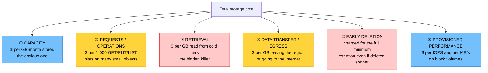
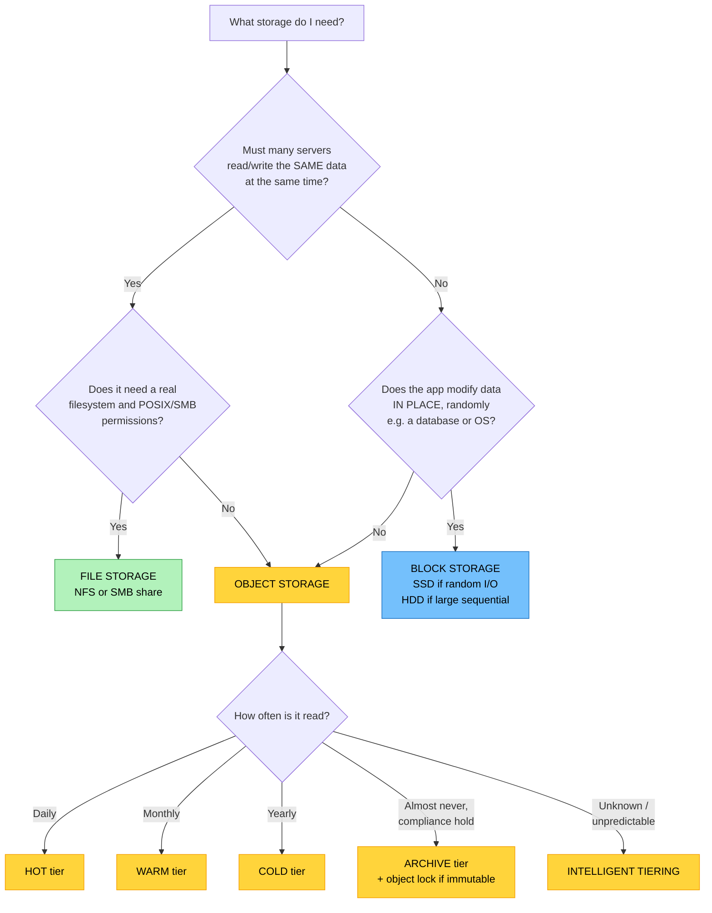

# Objective 1.4 — Compare and contrast storage resources and technologies

> **Domain 1.0 — Cloud Architecture (23% of exam)** · Exam CV0-004 V4 · Objectives doc v5.0
> **Status:** Exam-ready · **Version:** 2.0 (enhanced) · Supersedes `full notes/Objective-1.4-Storage-Resources.md`

---

## 0. How to use this note

| Pass | What to read | Time |
|---|---|---|
| **1st (learn)** | Sections 1 → 9 in order | ~75 min |
| **2nd (drill)** | Section 2.1 (three types) + 6.1 (IOPS vs throughput) + 7.2 (hidden costs) | ~25 min |
| **3rd (test)** | Section 12 (practice) + Section 13 (PBQ drills) | ~35 min |
| **Exam eve** | Section 14 (60-second recall sheet) only | ~5 min |

> 📌 **The highest-yield item here is the object / block / file distinction** — it appears in this objective, in 1.7 (SAN/NAS), in 1.6 (persistent volumes), and in Domain 6 troubleshooting. Get it exact once.

---

## 1. Official objective coverage

> **1.4 Compare and contrast storage resources and technologies.**
> - **Tiered storage**
>   - Hot
>   - Warm
>   - Cold
>   - Archive
> - **Disk types**
>   - Solid-state drive (SSD)
>   - Hard disk drive (HDD)
> - **Storage types**
>   - Object storage
>   - Block storage
>   - File storage
> - **Performance implications**
> - **Cost implications**

### 1.1 What the verb tells you

This is the **third** question style in Domain 1 — and each demands different preparation:

| Verb | Objectives | What's tested | How to prepare |
|---|---|---|---|
| "**Given a scenario**" | 1.1 | Judgement — match situation to choice | Practise the mapping |
| "**Explain**" | 1.2, 1.3 | Precision of definitions and numbers | Memorise boundaries |
| "**Compare and contrast**" | **1.4**, 1.6, 1.7 | **The differences between paired items** | **Learn the axes on which they differ** |

**Practical consequence:** for compare-and-contrast objectives, questions are built from the *contrast table*, not the definition. You will be asked "which is BETTER for X" or "what is the PRIMARY difference between A and B." Study the comparison tables (Section 9) as the core material, not as revision.

> ⚠️ The two "implications" bullets — **performance** and **cost** — are where the scenario questions live. Everything else is vocabulary that feeds them.

### 1.2 Coverage checklist

- [ ] I can state the data model, access method, and best use for object, block, and file storage
- [ ] I know which storage type can be mounted by **many** servers at once, and which cannot
- [ ] I can rank hot / warm / cold / archive by capacity cost **and** by retrieval cost — they move in opposite directions
- [ ] I know SSD vs HDD on IOPS, latency, throughput, and cost per GB
- [ ] I can define **IOPS**, **throughput**, and **latency** and state how they relate
- [ ] I know when **IOPS** matters and when **throughput** matters (random vs sequential)
- [ ] I can distinguish **durability** from **availability**
- [ ] I know the hidden storage costs: retrieval, request, early-deletion, egress
- [ ] I know what a **lifecycle policy** does
- [ ] I can distinguish **ephemeral/instance** storage from **persistent** storage
- [ ] I recognise the adjacent terms: **DAS / SAN / NAS**, **LUN**, **iSCSI / NFS / SMB**, **RAID**, **WORM/object lock**

---

## 2. The core mental model

### 2.1 ★ The three storage types — the master picture

```text
   ┌─────────────────────────────────────────────────────────────────────┐
   │ BLOCK STORAGE                          "a raw disk"                 │
   │                                                                     │
   │   ┌──┬──┬──┬──┬──┬──┬──┬──┐    Data split into fixed-size blocks,   │
   │   │  │  │  │  │  │  │  │  │    each with an address. NO metadata,   │
   │   └──┴──┴──┴──┴──┴──┴──┴──┘    no file names — the OS on top puts   │
   │        ▲                        a filesystem on it.                 │
   │   [ ONE server mounts it ]      Access: iSCSI / NVMe / local bus    │
   │                                 Change 1 byte → rewrite 1 block ✓   │
   │   BEST FOR: OS boot disks, databases, any random read/write         │
   ├─────────────────────────────────────────────────────────────────────┤
   │ FILE STORAGE                           "a shared network drive"     │
   │                                                                     │
   │   /projects/                    Hierarchical folders and files,     │
   │     ├── 2026/                   with POSIX/NTFS permissions.        │
   │     │    └── report.docx        The FILESYSTEM is provided for you. │
   │     └── archive/                Access: NFS (Linux) / SMB (Windows) │
   │        ▲   ▲   ▲                                                    │
   │   [ MANY servers mount it concurrently ]  ← the defining feature    │
   │                                                                     │
   │   BEST FOR: shared home dirs, content repos, lift-and-shift apps    │
   │             that expect a filesystem, render farms                  │
   ├─────────────────────────────────────────────────────────────────────┤
   │ OBJECT STORAGE                         "a warehouse of numbered     │
   │                                         boxes"                      │
   │   ┌───────────────────────────┐ Object = DATA + METADATA + unique   │
   │   │ key: photos/2026/cat.jpg  │ KEY, in a FLAT namespace (the "/"   │
   │   │ data: <binary>            │ in a key is just part of the name). │
   │   │ metadata: type, tags,     │ Access: HTTP/REST API (GET/PUT)     │
   │   │           created, owner  │ Change 1 byte → REWRITE the WHOLE   │
   │   └───────────────────────────┘ object ✗  (no partial update)       │
   │        ▲                                                            │
   │   [ ANY number of clients, over the internet ]                      │
   │                                                                     │
   │   BEST FOR: images, video, backups, logs, static websites,          │
   │             data lakes — anything write-once/read-many              │
   └─────────────────────────────────────────────────────────────────────┘
```

**The three questions that identify the type in any scenario:**

```text
   ① Does more than ONE server need to access it at the SAME TIME?
        YES → FILE  (or object)          NO → BLOCK

   ② Does the application need to modify data IN PLACE, randomly?
        YES → BLOCK or FILE              NO, write-once → OBJECT

   ③ Is it accessed over an HTTP API with a key, not a mount point?
        YES → OBJECT
```

### 2.2 The temperature ladder

```text
   ACCESS FREQUENCY                                       RETRIEVAL TIME
   ──────────────────────────────────────────────────────────────────────
   HOT      ████████████████  daily / constant            milliseconds
   WARM     ██████            monthly                     ms – seconds
   COLD     ██                a few times a year          minutes
   ARCHIVE  ▌                 almost never (legal hold)   hours – days

   ┌──────────────────────────────────────────────────────────────────┐
   │  ★ THE TWO COSTS MOVE IN OPPOSITE DIRECTIONS                     │
   │                                                                  │
   │  CAPACITY cost ($/GB stored)   HOT ████████  →  ARCHIVE ▌        │
   │                                     expensive     cheap          │
   │                                                                  │
   │  RETRIEVAL cost ($/GB read)    HOT ▌         →  ARCHIVE ████████ │
   │                                     free/cheap    expensive      │
   │                                                                  │
   │  Colder is only cheaper IF YOU DON'T READ IT.                    │
   └──────────────────────────────────────────────────────────────────┘
```

### 2.3 The performance triangle

```text
                        ┌──────────────┐
                        │    IOPS      │  operations per second
                        │  "how MANY"  │  → matters for RANDOM, small I/O
                        └──────┬───────┘     (databases, VMs, OLTP)
                               │
              THROUGHPUT = IOPS × BLOCK SIZE
                               │
          ┌────────────────────┴────────────────────┐
          │                                          │
   ┌──────▼───────┐                          ┌──────▼───────┐
   │  THROUGHPUT  │  MB/s                    │   LATENCY    │  ms per op
   │ "how MUCH"   │  → matters for           │ "how FAST    │  → matters for
   │              │    SEQUENTIAL, large I/O │  each one"   │    user-facing
   └──────────────┘    (backup, analytics,   └──────────────┘    responsiveness
                        video, log streaming)                    (every workload)
```

**The formula you should be able to apply:**

```text
   Throughput (MB/s) = IOPS × block size (KB) ÷ 1024

   Example: 5,000 IOPS at a 16 KB block size
          = 5,000 × 16 ÷ 1024
          ≈ 78 MB/s

   Reverse it:  a job needing 500 MB/s with a 64 KB block size
          needs 500 × 1024 ÷ 64 = 8,000 IOPS
```

> 💡 **Why this matters:** a volume advertised at "16,000 IOPS" and one at "1,000 MB/s" may be the same device measured two ways. Small random I/O exhausts the **IOPS** limit first; large sequential I/O exhausts the **throughput** limit first. Knowing which one your workload hits is the entire skill.

---

## 3. Storage types

### 3.1 Block storage

| | |
|---|---|
| **Definition** | Raw storage presented to an operating system as an unformatted **volume of fixed-size blocks**, each addressed by number. The OS creates the filesystem on top. |
| **Access** | Attached over a bus (local NVMe/SATA), or a storage network via **iSCSI**, **Fibre Channel**, or **NVMe-oF**. Appears in the OS as a disk (`/dev/sdb`, `Disk 1`). |
| **Attachment** | Normally **one server at a time**. Multi-attach exists but requires a cluster-aware filesystem to avoid corruption. |
| **Strengths** | **Lowest latency**; efficient random read/write; **modify in place** (change one byte, rewrite one block); full OS control over formatting, partitioning, encryption |
| **Weaknesses** | Bounded capacity per volume; usually tied to one AZ; you manage the filesystem, resizing, and backups; no built-in metadata; costs more per GB than object |
| **Use for** | **OS/boot disks**, **databases**, transactional systems, any app needing a real disk, low-latency logs |
| **Exam triggers** | "attach a volume", "boot disk", "database requires low latency", "raw disk", "format with a filesystem", "provisioned IOPS" |

**Persistent vs ephemeral block storage — commonly tested:**

| | **Persistent (network-attached)** | **Ephemeral (instance/local store)** |
|---|---|---|
| Survives instance stop/terminate | ✅ Yes | ❌ **No — data is lost** |
| Physically | Network-attached over the fabric | Physically on the host |
| Performance | High, consistent | **Highest** (no network hop) |
| Snapshots/backups | ✅ Supported | ❌ Not directly |
| Use for | Databases, anything that matters | Scratch, cache, temp, buffers, swap |

### 3.2 File storage

| | |
|---|---|
| **Definition** | A managed, shared **hierarchical filesystem** (folders and files) exposed over the network, with file-level permissions. |
| **Access** | **NFS** (Linux/Unix) or **SMB/CIFS** (Windows), mounted as a network share. |
| **Attachment** | **Many clients concurrently** — this is the defining characteristic and the reason to choose it. |
| **Strengths** | Shared concurrent access with file locking; familiar directory structure and permissions; **no application changes** needed for legacy apps that expect a filesystem; often elastic in capacity |
| **Weaknesses** | Higher latency than block (network filesystem protocol overhead); **contention under heavy concurrency**; costs more per GB than block or object; metadata operations (listing huge directories) can be slow |
| **Use for** | Shared home directories, content management, media/render farms, shared config, **lift-and-shift** of on-prem apps, container persistent volumes needing `ReadWriteMany` |
| **Exam triggers** | "multiple servers need the same files", "shared file system", "NFS", "SMB", "concurrent access", "the application expects a directory structure" |

### 3.3 Object storage

| | |
|---|---|
| **Definition** | Data stored as **objects** — the payload plus **rich metadata** plus a globally unique **key** — in a **flat namespace** (a bucket/container), retrieved over an **HTTP/REST API**. |
| **Access** | `GET` / `PUT` / `DELETE` over HTTPS. **Not mountable as a disk** in the normal sense. |
| **Strengths** | **Effectively unlimited scale**; **cheapest per GB**; extremely high durability through automatic multi-device/multi-AZ replication; rich metadata and tagging; built-in **versioning**, **lifecycle policies**, and **immutability (object lock/WORM)**; directly servable to the web and CDN-friendly |
| **Weaknesses** | **No partial updates** — changing one byte rewrites the whole object; higher per-operation latency than block; **eventual consistency** in some legacy implementations; per-request charges; not suitable for a database or OS disk |
| **Use for** | Images, video, audio, backups, logs, data lakes, static website hosting, software artefacts, big-data source data |
| **Exam triggers** | "unstructured data", "accessed via API/HTTP", "unlimited scale", "store millions of images", "static website", "backups and archives", "data lake", "write once, read many" |

**Flat namespace — a favourite exam nuance:** the key `photos/2026/cat.jpg` *looks* like a folder path but is a single flat string. There are no real directories; consoles simulate them by splitting on `/`. This is why listing "a folder" with millions of objects is a prefix scan, not a directory read.

### 3.4 Adjacent architecture: DAS, SAN, and NAS

These appear in the acronym list and explicitly in **Objective 1.7**, and they map directly onto block/file:

```text
   DAS — Direct Attached Storage          BLOCK · one host
   ┌────────┐   SATA/SAS/NVMe   ┌──────┐
   │ Server │═══════════════════│ Disk │   Simple, fastest, cheapest.
   └────────┘                   └──────┘   No sharing. No central mgmt.

   SAN — Storage Area Network             BLOCK · shared fabric
   ┌────────┐                             Dedicated high-speed network
   │Server A│──┐   ┌─────────────┐        (Fibre Channel / iSCSI).
   ├────────┤  ├───│ SAN fabric  │───[Storage array → LUNs]
   │Server B│──┘   └─────────────┘        Each server sees a LUN as its
   └────────┘                             OWN LOCAL DISK. High perf, costly.

   NAS — Network Attached Storage         FILE · shared over LAN
   ┌────────┐                             Standard Ethernet.
   │Server A│──┐   ┌──────────┐           Serves FILES via NFS/SMB.
   ├────────┤  ├───│ Ethernet │───[NAS appliance → shares]
   │Server B│──┘   └──────────┘           Easy, shared, cheaper than SAN,
   └────────┘                             higher latency.
```

| | **DAS** | **SAN** | **NAS** |
|---|---|---|---|
| Level | **Block** | **Block** | **File** |
| Network | None (direct bus) | Dedicated fabric (FC/iSCSI) | Standard Ethernet LAN |
| Shared access | ❌ One host | ✅ Multiple hosts (own LUNs) | ✅ **Multiple hosts, same files** |
| Appears to OS as | Local disk | **Local disk** | Network share/drive |
| Performance | Highest, lowest latency | High, low latency | Moderate |
| Cost/complexity | Lowest | **Highest** | Medium |
| Cloud analogue | Instance/ephemeral store | Block storage service | File storage service |

**LUN (Logical Unit Number)** — the identifier for a block volume carved out of a SAN array and presented to a host. If a question mentions LUNs, it is talking about **block** storage.

### 3.5 Storage protocols

| Protocol | Level | Typical use |
|---|---|---|
| **iSCSI** | Block | Block storage over standard TCP/IP — cheap SAN |
| **Fibre Channel (FC) / FCoE** | Block | High-performance, low-latency dedicated SAN fabric |
| **NVMe / NVMe-oF** | Block | Fastest flash access, low protocol overhead |
| **NFS** | File | Linux/Unix network file shares |
| **SMB / CIFS** | File | Windows network file shares |
| **S3-compatible REST API** | Object | Object storage over HTTPS |

---

## 4. Disk types

### 4.1 SSD vs HDD

| Attribute | **SSD (solid-state drive)** | **HDD (hard disk drive)** |
|---|---|---|
| Mechanism | **Flash memory, no moving parts** | **Spinning platters + moving read/write head** |
| **Latency** | **0.1–1 ms** (NVMe < 0.1 ms) | **5–15 ms** (seek + rotational delay) |
| **Random IOPS** | **Thousands to hundreds of thousands** | **~75–200** (limited by head movement) |
| Sequential throughput | High | **Good** — respectable once the head is in place |
| Cost per GB | **Higher** | **Lower** (often 3–5×cheaper) |
| Capacity per device | Growing, historically smaller | Very large |
| Durability/wear | Finite write cycles (wear levelling) | Mechanical wear, sensitive to shock/vibration |
| Power/heat/noise | Low | Higher |
| **Best for** | **Databases, OS disks, VDI, OLTP, anything random or latency-sensitive** | **Backups, archives, logs, big sequential reads, cost-sensitive bulk capacity** |

> ★ **The reason HDDs are bad at random I/O but fine at sequential:** the mechanical head must physically move for each new location. Random small reads mean constant seeking (~5–10 ms each). Once positioned, streaming a large contiguous file is fast. **SSDs have no seek time at all**, which is why the gap is ~1000× on random I/O but only a few× on sequential.

### 4.2 Common cloud disk tiers

Providers usually offer four block-storage families. Recognise the *shape*, not the product names:

| Family | Media | Optimised for | Typical use |
|---|---|---|---|
| **General-purpose SSD** | SSD | Balanced IOPS/cost | Boot volumes, most workloads, small-to-mid databases |
| **Provisioned-IOPS SSD** | SSD | **Guaranteed high IOPS + lowest latency** | Mission-critical / high-transaction databases |
| **Throughput-optimised HDD** | HDD | **MB/s**, sequential | Big data, log processing, data warehouse scans |
| **Cold HDD** | HDD | **Lowest cost per GB** | Infrequently accessed bulk data |

> 💡 **Modern general-purpose SSD volumes let you scale IOPS and throughput *independently of capacity*.** On older volume types you had to over-provision size just to get performance — a legacy cost trap still worth recognising.

---

## 5. Tiered storage

### 5.1 The four tiers

| Tier | Access frequency | Retrieval time | Capacity cost | Retrieval fee | Minimum retention | Typical use |
|---|---|---|---|---|---|---|
| **Hot** | Frequent — daily or constant | **Milliseconds** | **Highest** | **None** | None | Active data, live web assets, working sets |
| **Warm** | Infrequent — ~monthly | Milliseconds–seconds | Medium | **Yes, per GB** | ~30 days | Older records, secondary backups, aging content |
| **Cold** | Rare — a few times a year | **Minutes** | Low | Higher | ~90 days | Long-term backups, historical data |
| **Archive** | Almost never — legal/compliance hold | **Hours to days** | **Lowest** | **Highest** | ~180 days | Compliance retention, deep archive, records disposal schedules |

> 💡 **Real-world nuance (won't hurt you on the exam, but avoids confusion in vendor docs):** in current cloud products the *warm* and even some *cold* tiers return data in milliseconds, identical to hot. What actually separates them is the **retrieval fee** and **minimum retention period**, not raw latency. The exam teaches the generic ladder above — learn that — but if you see "cold tier, millisecond retrieval" in a provider's documentation, it is not a contradiction.

### 5.2 Lifecycle policies

A **lifecycle policy** automatically transitions objects between tiers, or deletes them, based on age or access pattern. This is how tiering is actually implemented — you do not move data by hand.

```text
   OBJECT CREATED
        │
        ▼  Day 0–30
   ┌─────────┐    frequent access, fast, expensive to store
   │   HOT   │
   └────┬────┘
        │  Day 30 — lifecycle rule: transition
        ▼
   ┌─────────┐    rarely read; cheaper per GB, retrieval fee applies
   │  WARM   │
   └────┬────┘
        │  Day 90 — transition
        ▼
   ┌─────────┐    a few reads per year
   │  COLD   │
   └────┬────┘
        │  Day 365 — transition
        ▼
   ┌─────────┐    compliance hold only
   │ ARCHIVE │
   └────┬────┘
        │  Day 2555 (7 years) — expire
        ▼
     DELETED

   Also available: INTELLIGENT TIERING — the provider monitors access
   patterns and moves objects automatically, for a small monitoring fee.
   Best when access patterns are UNKNOWN or UNPREDICTABLE.
```

**Exam framing:** if the scenario says *"data is accessed frequently for 30 days, then rarely, and must be kept 7 years,"* the answer is **a lifecycle policy transitioning through tiers**, not a single tier choice.

---

## 6. Performance implications

### 6.1 The three metrics — precise definitions

| Metric | Unit | Definition | Matters most for |
|---|---|---|---|
| **IOPS** | operations/sec | How many **separate** read/write operations complete per second | **Random, small** I/O — databases, VMs, OLTP, boot storms |
| **Throughput** (bandwidth) | MB/s or GB/s | How much **data volume** moves per second | **Sequential, large** I/O — backup, restore, analytics, video, log streaming |
| **Latency** | ms (or µs) | How long **one single** operation takes end to end | **User-facing responsiveness** — every interactive workload |

> ★ **The distinction that decides questions:** a workload doing 4 KB random reads is **IOPS-bound**. A workload streaming 1 MB sequential blocks is **throughput-bound**. Same disk, completely different limiting factor — and completely different correct answer.

### 6.2 Random vs sequential access

| | **Random access** | **Sequential access** |
|---|---|---|
| Pattern | Scattered, unpredictable locations | Contiguous, one block after another |
| Bound by | **IOPS** | **Throughput** |
| HDD performance | **Terrible** (seek on every op) | Good |
| SSD performance | **Excellent** | Excellent |
| Typical workloads | Databases, VDI, OS, transactional apps | Backups, media streaming, log ingestion, big-data scans |
| Right disk | **SSD** | HDD is often adequate **and cheaper** |

### 6.3 The other factors that change measured performance

| Factor | Effect |
|---|---|
| **Block size** | Larger blocks move more data per operation → higher throughput but fewer IOPS. Mismatched block size wastes both. |
| **Queue depth** | How many I/O requests are outstanding at once. Low queue depth cannot saturate a fast device; excessive queue depth increases latency. |
| **Read vs write mix** | Writes are usually more expensive, especially with parity/replication. |
| **Caching** | Read caches and write buffers hide latency — until the cache is exhausted, when performance falls off a cliff. |
| **Burst credits** | Some volume tiers offer burst performance that depletes; sustained load then drops to the (much lower) baseline. **A classic "it was fast yesterday" troubleshooting scenario.** |
| **Network path** | Network-attached storage adds latency and is capped by instance network bandwidth, not just the volume's limits. |
| **Multi-tenancy** | **Noisy neighbours** on shared storage cause variable latency (see 1.2). |

### 6.4 Durability vs availability — do not conflate these

| | **Durability** | **Availability** |
|---|---|---|
| Question it answers | "Will my data still **exist**?" | "Can I **reach** it right now?" |
| Typical figure | **99.999999999% (11 nines)** | **99.9% – 99.99%** |
| Threatened by | Disk failure, bit rot, media loss | Outage, network failure, throttling, region issue |
| Achieved by | Redundant copies across devices/AZs, checksums | Redundant serving paths, multi-AZ endpoints |

> ⚠️ **11 nines of durability does not mean the service is always reachable.** Object storage is famously durable and merely *very* available. And **neither protects against you deleting the object** — that requires **versioning**, **object lock**, or **backups** (the same point as "replication is not backup" in 1.2).

### 6.5 RAID — adjacent but examinable

**RAID** is on CompTIA's acronym list and underpins how storage arrays deliver performance and redundancy.

```text
   RAID 0 — STRIPING              RAID 1 — MIRRORING
   ┌────┐ ┌────┐                  ┌────┐ ┌────┐
   │ A1 │ │ A2 │                  │ A1 │ │ A1 │
   │ A3 │ │ A4 │                  │ A2 │ │ A2 │
   └────┘ └────┘                  └────┘ └────┘
   Capacity: 100%                 Capacity: 50%
   Fault tolerance: NONE ✗        Survives 1 disk ✓
   Best performance               Fast reads, simple

   RAID 5 — STRIPING + PARITY     RAID 6 — DUAL PARITY
   ┌────┐ ┌────┐ ┌────┐           ┌────┐ ┌────┐ ┌────┐ ┌────┐
   │ A1 │ │ A2 │ │ Ap │           │ A1 │ │ A2 │ │ Ap │ │ Aq │
   │ B1 │ │ Bp │ │ B2 │           │ B1 │ │ Bp │ │ Bq │ │ B2 │
   └────┘ └────┘ └────┘           └────┘ └────┘ └────┘ └────┘
   Capacity: n−1                  Capacity: n−2
   Survives 1 disk ✓              Survives 2 disks ✓✓
   Min 3 disks                    Min 4 disks

   RAID 10 (1+0) — MIRRORED STRIPES
   ┌────┐ ┌────┐   ┌────┐ ┌────┐
   │ A1 │ │ A1 │   │ A2 │ │ A2 │    Capacity: 50%
   └────┘ └────┘   └────┘ └────┘    Survives 1 disk per mirror ✓
    mirror pair      mirror pair     BEST performance + redundancy
   Min 4 disks                       Preferred for databases
```

| Level | Min disks | Usable capacity | Survives | Write penalty | Best for |
|---|---:|---|---|---:|---|
| **0** | 2 | **100%** | **Nothing** | 1 | Scratch, temp, performance only |
| **1** | 2 | 50% | 1 disk | 2 | Boot volumes, small critical sets |
| **5** | 3 | (n−1)/n | 1 disk | **4** | General file/app servers, read-heavy |
| **6** | 4 | (n−2)/n | **2 disks** | **6** | Large arrays, long rebuild times |
| **10** | 4 | 50% | 1 per mirror | 2 | **Databases, write-heavy, high performance** |

**Write penalty** = physical I/O operations required per logical write. RAID 5's penalty of 4 (read data, read parity, write data, write parity) is why **RAID 10 is preferred for write-heavy databases** despite costing more capacity.

> ⚠️ **RAID is not backup.** RAID protects against *disk* failure. It does not protect against deletion, corruption, ransomware, or site loss.

---

## 7. Cost implications

### 7.1 The anatomy of a storage bill



### 7.2 ★ The hidden costs that decide exam questions

| Cost | How it surprises people |
|---|---|
| **Retrieval fees** | Archive tiers are cheap to *store* and expensive to *read*. A monthly restore test can cost more than the storage saved. |
| **Minimum retention / early deletion** | Delete an archived object after 10 days when the minimum is 180, and you are billed for all 180 days anyway. Short-lived data must never go to archive. |
| **Request charges** | Millions of tiny objects generate enormous request counts. Aggregating small files into larger ones can cost less than storing them separately. |
| **Egress / data transfer** | Getting data *in* is usually free; getting it *out* to the internet or another region is charged. This is what makes exit and multicloud expensive (see 1.2). |
| **Provisioned but unused** | A 1 TB volume that is 5% full bills for 1 TB. Provisioned IOPS bills whether or not you use them. |
| **Orphaned resources** | Unattached volumes and forgotten snapshots keep billing indefinitely — the most common cloud storage waste. |
| **Snapshot chains** | Snapshots are incremental, but retention policies that keep hundreds accumulate real cost. |

> ⚠️ **The single most-tested cost trap:** *"We moved backups to the archive tier to save money, but our costs went up."* Cause: frequent retrievals and/or early deletion penalties. **The cheapest tier is only cheapest if the access pattern actually matches it.**

### 7.3 Cost optimisation levers

| Lever | What it does |
|---|---|
| **Lifecycle policies** | Automate tier transitions and expiry so cold data stops costing hot prices |
| **Intelligent tiering** | Provider moves objects based on observed access — best when patterns are unknown |
| **Right-sizing volumes** | Match provisioned capacity and IOPS to actual use (see 1.8) |
| **Deduplication & compression** | Store less raw data |
| **Delete orphans** | Reclaim unattached volumes, stale snapshots, incomplete multipart uploads |
| **Choose the right disk** | HDD for sequential bulk instead of over-buying SSD |
| **Keep traffic in-region** | Avoid cross-region and internet egress where possible; use a CDN to cut origin egress |
| **Set retention policies** | Do not keep data longer than the compliance requirement |

---

## 8. Adjacent capabilities you should recognise

| Feature | What it does | Why it's examinable |
|---|---|---|
| **Versioning** | Keeps previous versions of an object on overwrite/delete | Recovers from accidental deletion and ransomware |
| **Object lock / WORM** | Write Once, Read Many — objects cannot be modified or deleted for a retention period | **Compliance** (financial records, legal hold) and **ransomware immutability** |
| **Snapshots** | Point-in-time copy of a volume, usually **incremental** after the first | The RPO mechanism for block storage (1.2, 3.3) |
| **Replication** | Automatic copies to another AZ or region | Durability and DR — but **not** a substitute for backup |
| **Redundancy options** | Locally redundant / zone redundant / geo-redundant | Trades cost against the failure domain survived |
| **Thin vs thick provisioning** | Thin allocates on write (oversubscribable); thick reserves up front | Thin saves cost but risks **over-commitment** if actual use grows |
| **Deduplication / compression** | Removes duplicate blocks / shrinks data | Cuts capacity cost; costs CPU |
| **Encryption at rest** | Provider-managed or customer-managed keys (see 4.x) | Usually a default expectation; key management is the customer's |
| **Storage gateway** | On-prem appliance presenting cloud storage as iSCSI/NFS/SMB | Hybrid migrations and backup targets |

---

## 9. Comparison tables

### 9.1 ★ Object vs block vs file — the master contrast

| Attribute | **Object** | **Block** | **File** |
|---|---|---|---|
| Data model | Object = data + metadata + key | Fixed-size numbered blocks | Files in a folder hierarchy |
| Namespace | **Flat** | None (raw) | **Hierarchical** |
| Access method | **HTTP/REST API** | iSCSI / FC / NVMe / local bus | **NFS / SMB** |
| Mount as a disk | ❌ No | ✅ Yes | ✅ Yes (as a share) |
| Concurrent multi-server access | ✅ Unlimited clients | ❌ **Normally one** | ✅ **Many — its purpose** |
| Modify in place | ❌ **Rewrite whole object** | ✅ Yes, random | ✅ Yes, random |
| **Latency** | Highest (API) | **Lowest** | Low–moderate |
| Scalability | **Effectively unlimited** | Bounded per volume | Large but bounded |
| Metadata | **Rich, custom** | None | Basic filesystem attributes |
| **Cost per GB** | **Lowest** | Medium–high | **Highest** |
| Built-in versioning/lifecycle | ✅ Yes | ❌ No (snapshots instead) | ❌ Usually not |
| Best for | Images, video, backups, logs, data lakes, static sites | **OS disks, databases** | **Shared files across servers** |
| Never use for | A database or OS disk | Sharing across many servers | Massive-scale unstructured data (too costly) |

### 9.2 Storage type → workload

| Workload | Type | Disk / tier | Why |
|---|---|---|---|
| Production relational database | **Block** | SSD (provisioned IOPS) | Random I/O, lowest latency, in-place writes |
| VM boot volume | **Block** | General-purpose SSD | OS needs a real disk |
| Temp/scratch space for a batch job | **Block (ephemeral)** | Local NVMe | Fastest, data loss acceptable |
| Product images for a website | **Object** | Hot | API access, CDN-friendly, unlimited scale |
| Video render farm shared project files | **File** | SSD-backed | Many nodes need the same files simultaneously |
| Legacy app expecting `/mnt/data` | **File** | Any | No code change needed |
| Nightly database backups, kept 30 days | **Object** | Warm (lifecycle to cold) | Written once, rarely read |
| 7-year regulatory records | **Object** | Archive **+ object lock** | Cheapest capacity, immutability for compliance |
| Big-data log analytics, sequential scans | **Object** or **block** | Throughput-optimised HDD | Sequential — throughput-bound, not IOPS-bound |
| Container volume needing `ReadWriteMany` | **File** | Any | Multiple pods mount the same volume |

### 9.3 SSD vs HDD decision

| Requirement | Choose |
|---|---|
| Random I/O, database, OLTP | **SSD** |
| Sub-millisecond latency | **SSD (NVMe)** |
| Large sequential reads/writes, backups, log processing | **HDD** (cheaper, adequate) |
| Lowest cost per GB at scale | **HDD** |
| High IOPS with predictable performance | **SSD, provisioned IOPS** |
| Boot volume | **SSD** |

### 9.4 Multi-cloud terminology map

| Concept | AWS | Azure | Google Cloud |
|---|---|---|---|
| **Object** | **S3** | **Blob Storage** | **Cloud Storage** |
| **Block** | **EBS** | **Managed Disks** | **Persistent Disk** |
| **File** | **EFS** (NFS), **FSx** (SMB/Lustre) | **Azure Files** | **Filestore** |
| Ephemeral/local | Instance Store | Temporary Disk | Local SSD |
| Hot tier | S3 Standard | Blob Hot | Standard |
| Warm tier | S3 Standard-IA | Blob Cool | Nearline |
| Cold tier | S3 Glacier Instant Retrieval | Blob Cold | Coldline |
| Archive tier | S3 Glacier Deep Archive | Blob Archive | Archive |
| Auto-tiering | S3 Intelligent-Tiering | Blob lifecycle mgmt | Autoclass |
| Immutability | S3 Object Lock | Blob immutable storage | Bucket Lock |
| Hybrid gateway | Storage Gateway | Azure File Sync / StorSimple | Storage Transfer / Filestore |

**Typical minimum retention periods:** warm ≈ 30 days · cold ≈ 90 days · archive ≈ 180 days.

### 9.5 Selecting storage — decision flow



---

## 10. Exam traps & distractor patterns

| # | Trap | The truth |
|---|---|---|
| 1 | "The archive tier is always cheapest" | Only if you rarely read it. **Retrieval fees and minimum-retention penalties** can exceed the savings |
| 2 | "Object storage can host a database" | No partial updates and higher latency make it unsuitable. Databases need **block** |
| 3 | "Block storage can be shared by many servers" | Normally **one attachment**. Sharing needs **file** storage (or a cluster-aware filesystem) |
| 4 | "File storage is the cheapest option" | It is usually the **most expensive per GB**. Object is cheapest |
| 5 | "11 nines durability means it is always available" | **Durability ≠ availability.** Durability is ~11 nines; availability is ~99.9–99.99% |
| 6 | "Durable storage protects against accidental deletion" | It does not. That needs **versioning, object lock, or backups** |
| 7 | "HDDs are always slower than SSDs" | On **random** I/O, yes by ~1000×. On **large sequential** transfer the gap is small — and HDD is far cheaper |
| 8 | "More IOPS always means faster" | Only for **random small** I/O. Sequential workloads are **throughput**-bound |
| 9 | "Object keys with slashes are folders" | The namespace is **flat**; `/` is part of the key string |
| 10 | "Instance/ephemeral storage is just cheap block storage" | **Data is lost when the instance stops or terminates** |
| 11 | "RAID is a backup strategy" | RAID survives **disk** failure only — not deletion, corruption, ransomware, or site loss |
| 12 | "RAID 5 is best for write-heavy databases" | RAID 5 has a **write penalty of 4**. Use **RAID 10** for write-heavy |
| 13 | "RAID 0 provides redundancy" | The 0 is literal — **no** fault tolerance; one disk lost means all data lost |
| 14 | "Snapshots are full copies each time" | They are **incremental** after the first |
| 15 | "Getting data into the cloud is what costs money" | **Ingress is usually free; egress is charged** |
| 16 | "Thin provisioning has no risk" | It permits **over-commitment** — real usage can exceed physical capacity |
| 17 | "Compliance retention just means keeping a copy" | Often requires **immutability (WORM/object lock)** so it cannot be altered or deleted |
| 18 | "A single tier is the answer" | If access frequency changes over time, the answer is a **lifecycle policy** across tiers |
| 19 | "The volume was fast last week, so the tier is fine" | **Burst credits** deplete; sustained load falls back to a much lower baseline |

**Disambiguation drill — the hardest pairs:**

| Pair | The deciding question |
|---|---|
| **Object vs block** | Does it modify data **in place**? Yes → block. Write-once → object |
| **Block vs file** | Do **multiple servers** need it simultaneously? Yes → file |
| **File vs object** | Does it need a **mounted filesystem** and POSIX/SMB permissions? Yes → file |
| **SSD vs HDD** | Is the access **random** (→ SSD) or **large sequential** (→ HDD is fine and cheaper)? |
| **IOPS vs throughput** | Many **small** operations → IOPS. Few **large** transfers → throughput |
| **Cold vs archive** | Retrieval in **minutes** → cold. **Hours to days** → archive |
| **Durability vs availability** | Does the data still **exist** (durability) or can I **reach** it (availability)? |
| **RAID vs backup** | Disk failure → RAID. Deletion/corruption/ransomware → **backup** |
| **SAN vs NAS** | **Block** over a dedicated fabric → SAN. **Files** over Ethernet → NAS |

---

## 11. Keyword → answer trigger table

| If you see… | Think |
|---|---|
| unstructured · millions of images/videos · API/HTTP access · unlimited scale · data lake · static website | **Object storage** |
| boot disk · attach a volume · database requires low latency · format a filesystem · provisioned IOPS · LUN | **Block storage** |
| multiple servers share the same files · NFS · SMB · concurrent access · shared home directories · ReadWriteMany | **File storage** |
| random I/O · transactional database · low latency · high IOPS · VDI | **SSD** |
| large sequential reads · backups · log archives · lowest cost per GB · big data scans | **HDD** |
| accessed daily · live production data | **Hot tier** |
| accessed monthly · aging records | **Warm tier** |
| a few times a year · retrieval in minutes | **Cold tier** |
| almost never · legal hold · 7 years · retrieval in hours | **Archive tier** |
| access pattern changes over time · frequent then rare | **Lifecycle policy** |
| unpredictable / unknown access pattern | **Intelligent tiering** |
| must not be altered or deleted for N years | **Object lock / WORM** |
| recover an overwritten or deleted object | **Versioning** |
| costs rose after moving to archive | **Retrieval fees / early-deletion penalty** |
| data lost when the instance stopped | **Ephemeral / instance store** |
| protect against a single disk failure while keeping write performance | **RAID 10** |
| maximum usable capacity, redundancy not required | **RAID 0** |
| tolerate two simultaneous disk failures | **RAID 6** |
| data still exists but cannot be reached | **Availability** problem, not durability |
| the volume slowed down after a few hours of load | **Burst credits exhausted** |

---

## 12. Practice questions

<details>
<summary><b>Q1.</b> An application stores millions of user-uploaded photos accessed over HTTPS, with unpredictable growth. Which storage type is MOST appropriate?</summary>

**A. Object storage** · B. Block storage · C. File storage · D. Ephemeral storage

**Correct: A — object storage.** Unstructured, write-once/read-many data accessed by API, needing effectively unlimited scale and the lowest cost per GB.
- **B wrong:** Block volumes are bounded in size and attach to a single instance.
- **C wrong:** File storage costs more per GB and its shared-filesystem semantics add nothing here.
- **D wrong:** Ephemeral storage is lost when the instance stops.
</details>

<details>
<summary><b>Q2.</b> What is the PRIMARY difference between block and file storage?</summary>

A. Block is cheaper per GB · **B. Block presents a raw volume normally attached to a single host, while file presents a shared hierarchical filesystem to many hosts concurrently** · C. Block uses HTTP APIs; file uses iSCSI · D. File storage cannot be used by Linux

**Correct: B.** Concurrency of access and the presence of a provided filesystem are the defining contrasts.
- **A wrong:** File storage is generally the more expensive of the two.
- **C wrong:** The protocols are reversed — block uses iSCSI/NVMe, object uses HTTP.
- **D wrong:** NFS is the standard Linux file-sharing protocol.
</details>

<details>
<summary><b>Q3.</b> A production PostgreSQL database performs many small random reads and writes with a strict latency requirement. What should back it?</summary>

**A. SSD-backed block storage with provisioned IOPS** · B. HDD-backed block storage · C. Object storage · D. Archive tier storage

**Correct: A.** Random small I/O is IOPS-bound and latency-sensitive — exactly the SSD case, with provisioned IOPS for predictability.
- **B wrong:** HDD random performance is roughly 1000× worse due to seek time.
- **C wrong:** Object storage cannot modify data in place and adds API latency.
- **D wrong:** Archive retrieval takes hours.
</details>

<details>
<summary><b>Q4.</b> A company moved its nightly backups to the archive tier to reduce cost, but its monthly bill increased. What is the MOST likely reason?</summary>

A. Archive capacity costs more than hot · **B. Frequent restore tests incurred retrieval fees, and objects deleted before the minimum retention period were still billed for it** · C. Archive storage has no durability guarantee · D. Backups cannot be stored in archive

**Correct: B.** Archive is cheap to store and expensive to read, with a minimum retention period (commonly ~180 days) billed regardless of early deletion.
- **A wrong:** Archive has the lowest capacity cost — that is why it was chosen.
- **C wrong:** Archive tiers offer the same high durability.
- **D wrong:** Backups are a normal archive use case, provided the access pattern fits.
</details>

<details>
<summary><b>Q5.</b> Five application servers must all read and write the same set of configuration and content files simultaneously. Which storage type fits?</summary>

A. Block storage attached to each server · **B. File storage mounted via NFS or SMB** · C. Ephemeral instance storage · D. Archive tier object storage

**Correct: B.** Shared concurrent access with file locking is the defining purpose of file storage.
- **A wrong:** A block volume normally attaches to one instance; each server would get a separate, divergent copy.
- **C wrong:** Ephemeral storage is local to each instance and non-persistent.
- **D wrong:** Archive retrieval takes hours and offers no shared filesystem.
</details>

<details>
<summary><b>Q6.</b> A backup job writes 1 MB sequential blocks at high volume. Which metric is the PRIMARY constraint?</summary>

A. IOPS · **B. Throughput** · C. Latency · D. Queue depth

**Correct: B — throughput.** Large sequential transfers are limited by MB/s, not by the number of operations.
- **A wrong:** IOPS constrains **small random** workloads.
- **C wrong:** Per-operation latency matters little for bulk background transfer.
- **D wrong:** Queue depth influences utilisation but is not the constraint being described.
</details>

<details>
<summary><b>Q7.</b> A volume delivers 4,000 IOPS with a 32 KB block size. What is the approximate throughput?</summary>

A. 32 MB/s · B. 64 MB/s · **C. 125 MB/s** · D. 512 MB/s

**Correct: C.** 4,000 × 32 ÷ 1024 = **125 MB/s**.
- **A/B/D wrong:** They misapply the relationship `throughput = IOPS × block size`.
</details>

<details>
<summary><b>Q8.</b> Storage advertises 99.999999999% durability and 99.99% availability. What does this mean?</summary>

A. The service is unavailable 11 times a year · **B. Data loss is extraordinarily unlikely, but the service may occasionally be unreachable** · C. Both figures describe uptime · D. Deleted objects can always be recovered

**Correct: B.** Durability is about the data continuing to exist; availability is about being able to reach it now.
- **A wrong:** It misreads the durability figure as an outage count.
- **C wrong:** They measure different properties.
- **D wrong:** Neither protects against deletion — that requires versioning or object lock.
</details>

<details>
<summary><b>Q9.</b> Data is accessed heavily for 30 days, occasionally for a year, then must be retained for seven years for compliance. What is the BEST approach?</summary>

A. Keep everything in the hot tier · B. Put everything in archive immediately · **C. Apply a lifecycle policy transitioning hot → warm → cold → archive, with expiry at seven years** · D. Store it on SSD block volumes

**Correct: C.** Changing access patterns over time are exactly what lifecycle policies exist for.
- **A wrong:** Paying hot prices for seven years of dormant data is wasteful.
- **B wrong:** Archive retrieval is too slow for the first 30 days of heavy access, and early transitions incur retrieval costs.
- **D wrong:** Block storage is far more expensive and does not support tiering.
</details>

<details>
<summary><b>Q10.</b> Which RAID level provides the BEST combination of write performance and redundancy for a transactional database?</summary>

A. RAID 0 · B. RAID 5 · C. RAID 6 · **D. RAID 10**

**Correct: D — RAID 10.** Mirrored stripes give a write penalty of only 2 with full redundancy, unlike parity-based levels.
- **A wrong:** RAID 0 offers no redundancy at all.
- **B wrong:** RAID 5 has a write penalty of 4, hurting write-heavy workloads.
- **C wrong:** RAID 6's write penalty of 6 is worse still.
</details>

<details>
<summary><b>Q11.</b> Financial records must be retained for five years in a form that cannot be modified or deleted, even by an administrator. What is required?</summary>

A. Versioning alone · B. Cross-region replication · **C. Object lock / WORM with a retention period** · D. RAID 6

**Correct: C.** Object lock enforces write-once-read-many semantics for a defined retention period, satisfying both compliance and ransomware-immutability needs.
- **A wrong:** Versioning preserves prior copies but does not prevent deletion by a privileged user.
- **B wrong:** Replication copies data — including any deletion.
- **D wrong:** RAID protects against disk failure only.
</details>

<details>
<summary><b>Q12.</b> A batch job writes temporary intermediate data that can be regenerated if lost, and requires the highest possible I/O performance. What is the MOST cost-effective choice?</summary>

**A. Ephemeral / local instance storage** · B. Provisioned-IOPS SSD block storage · C. Object storage in the hot tier · D. File storage

**Correct: A.** Local NVMe gives the highest performance with no network hop, and the data's disposability makes non-persistence acceptable.
- **B wrong:** It works but costs significantly more for data that need not survive.
- **C/D wrong:** Both add latency and are unsuited to high-performance scratch space.
</details>

<details>
<summary><b>Q13.</b> Which statement about object storage is TRUE?</summary>

A. Objects are organised in real nested directories · B. A single byte can be updated in place · **C. Objects consist of data, metadata, and a unique key in a flat namespace** · D. It is mounted as a block device by default

**Correct: C.** That is the defining structure of object storage.
- **A wrong:** The namespace is flat; slashes in keys are only a display convention.
- **B wrong:** Modifying an object requires rewriting it entirely.
- **D wrong:** Object storage is accessed by HTTP API, not mounted as a block device.
</details>

<details>
<summary><b>Q14.</b> An analytics cluster performs large sequential scans over petabytes of historical logs, and cost is the primary concern. Which disk type is MOST appropriate?</summary>

A. Provisioned-IOPS SSD · B. General-purpose SSD · **C. Throughput-optimised HDD** · D. Local NVMe SSD

**Correct: C.** Sequential access is throughput-bound, where HDD performs adequately at a fraction of the cost per GB.
- **A/B wrong:** SSD's advantage is random I/O, which this workload does not need — paying for it wastes money.
- **D wrong:** Local NVMe is expensive, capacity-limited, and non-persistent.
</details>

<details>
<summary><b>Q15.</b> A block volume performed well for two hours, then throughput dropped sharply under continued load. What is the MOST likely cause?</summary>

A. The disk failed · **B. Burst credits were exhausted and the volume fell back to its baseline performance** · C. The filesystem became corrupted · D. Object versioning was enabled

**Correct: B.** Burstable volume tiers accumulate credits when idle and deplete them under sustained load, after which performance drops to a much lower baseline.
- **A wrong:** A failure would cause errors, not a clean drop to a lower steady rate.
- **C wrong:** Corruption produces I/O errors rather than a sustained lower throughput.
- **D wrong:** Versioning is an object-storage feature and unrelated to block throughput.
</details>

<details>
<summary><b>Q16.</b> What is the PRIMARY difference between a SAN and a NAS?</summary>

A. SAN uses Ethernet; NAS uses Fibre Channel · **B. SAN provides block-level storage that appears as a local disk; NAS provides file-level storage shared over the LAN** · C. NAS is always faster than SAN · D. SAN cannot be shared between hosts

**Correct: B.** The block-vs-file distinction is the defining difference.
- **A wrong:** It is reversed — SANs commonly use Fibre Channel or iSCSI; NAS uses standard Ethernet.
- **C wrong:** SANs are typically the higher-performance option.
- **D wrong:** SANs serve multiple hosts, each presented with its own LUNs.
</details>

<details>
<summary><b>Q17.</b> Which cost applies when data leaves a cloud region for the internet?</summary>

A. Ingress fee · **B. Egress / data-transfer-out fee** · C. Early deletion fee · D. Request fee

**Correct: B.** Inbound transfer is usually free; outbound to the internet or another region is charged, which is what makes data exit and multicloud expensive.
- **A wrong:** Ingress is generally free.
- **C wrong:** Early deletion applies to removing data before the minimum retention period.
- **D wrong:** Request fees apply per API operation, regardless of direction.
</details>

<details>
<summary><b>Q18.</b> A team enables RAID 5 across three disks and considers backups unnecessary. What is the flaw?</summary>

A. RAID 5 requires at least five disks · **B. RAID protects against disk failure only — not deletion, corruption, ransomware, or site loss** · C. RAID 5 has no redundancy · D. RAID 5 cannot be used with SSDs

**Correct: B.** RAID is an availability mechanism for hardware failure, not a recovery mechanism for logical data loss.
- **A wrong:** RAID 5 requires a minimum of three disks, which they have.
- **C wrong:** RAID 5 survives one disk failure via distributed parity.
- **D wrong:** RAID works with SSDs.
</details>

<details>
<summary><b>Q19.</b> Objects must be retrievable within minutes, are read only two or three times a year, and storage cost should be minimised. Which tier?</summary>

A. Hot · B. Warm · **C. Cold** · D. Archive

**Correct: C — cold.** Minutes-level retrieval with low capacity cost matches the cold tier.
- **A/B wrong:** Both cost more per GB than necessary for data read twice a year.
- **D wrong:** Archive retrieval takes hours to days, missing the "within minutes" requirement.
</details>

<details>
<summary><b>Q20.</b> Which characteristic makes file storage the correct choice over object storage for a legacy application?</summary>

A. Lower cost per GB · **B. The application expects a mounted filesystem with directories and POSIX permissions, requiring no code changes** · C. Higher durability · D. Unlimited scalability

**Correct: B.** Legacy applications typically read and write via filesystem calls, which object storage does not provide.
- **A wrong:** File storage is generally the most expensive per GB.
- **C wrong:** Object storage typically offers the highest durability.
- **D wrong:** Unlimited scale is an object-storage advantage.
</details>

<details>
<summary><b>Q21.</b> An organisation stores 50 million objects averaging 4 KB each and is surprised by the bill despite low total capacity. What is the MOST likely driver?</summary>

A. Egress fees · **B. Per-request charges from the very large number of small objects** · C. Early deletion penalties · D. Provisioned IOPS

**Correct: B.** Object storage bills per operation; tens of millions of tiny objects generate enormous request counts relative to their trivial capacity.
- **A wrong:** Egress applies to data leaving, which is not indicated.
- **C wrong:** Early deletion applies to cold/archive tiers with minimum retention.
- **D wrong:** Provisioned IOPS is a block-storage concept.
</details>

<details>
<summary><b>Q22.</b> Which best describes thin provisioning?</summary>

A. Physical capacity is reserved in full at creation · **B. Capacity is allocated on write, allowing the logical total to exceed physical capacity** · C. Data is compressed before writing · D. Duplicate blocks are removed

**Correct: B.** Thin provisioning oversubscribes, improving utilisation but creating a risk of exhausting physical capacity.
- **A wrong:** That is thick provisioning.
- **C/D wrong:** Those describe compression and deduplication.
</details>

<details>
<summary><b>Q23.</b> A team needs a container volume that multiple pods can mount read-write simultaneously. Which storage type supports this?</summary>

A. Block storage · **B. File storage** · C. Ephemeral storage · D. Archive object storage

**Correct: B.** `ReadWriteMany` semantics require a shared filesystem, which is what file storage provides.
- **A wrong:** Block volumes normally support a single writer.
- **C wrong:** Ephemeral storage is local to one node and non-persistent.
- **D wrong:** Archive object storage is neither mountable nor fast enough.
</details>

<details>
<summary><b>Q24.</b> Which pairing of metric to workload is CORRECT?</summary>

A. IOPS matters most for large sequential backups · **B. IOPS matters most for small random database operations** · C. Throughput matters most for OLTP transactions · D. Latency is irrelevant to interactive applications

**Correct: B.** Random small operations are limited by how many discrete I/Os the device can complete per second.
- **A wrong:** Sequential backups are throughput-bound.
- **C wrong:** OLTP is dominated by random IOPS and latency.
- **D wrong:** Latency is the metric users actually perceive.
</details>

<details>
<summary><b>Q25.</b> An engineer proposes storing an active transactional database in the warm tier of object storage to reduce cost. What is the BEST response?</summary>

A. Approve it — warm is cheaper than hot · **B. Reject it — object storage cannot modify data in place, and a transactional database requires low-latency random block I/O** · C. Approve it if versioning is enabled · D. Reject it because object storage lacks durability

**Correct: B.** The problem is architectural, not economic: object storage has no partial updates and far higher per-operation latency.
- **A/C wrong:** No tier or feature makes object storage a viable database backend.
- **D wrong:** Object storage durability is excellent; that is not the objection.
</details>

---

## 13. PBQ-style drills

### Drill A — Match workload to storage

| # | Workload | Type + tier/disk? |
|---|---|---|
| 1 | VM boot volume | |
| 2 | 7-year immutable compliance archive | |
| 3 | Shared project files for a 40-node render farm | |
| 4 | Product images served through a CDN | |
| 5 | High-transaction order database | |
| 6 | Temp scratch for a nightly ETL job | |
| 7 | Petabyte-scale sequential log analytics | |
| 8 | Nightly backups restored roughly twice a year | |

<details><summary>Answers</summary>

1 → **Block, general-purpose SSD**
2 → **Object, archive tier + object lock/WORM**
3 → **File storage (NFS/SMB), SSD-backed**
4 → **Object, hot tier**
5 → **Block, provisioned-IOPS SSD**
6 → **Ephemeral/local instance storage** (fastest, disposable)
7 → **Object, or block on throughput-optimised HDD** — sequential means throughput-bound
8 → **Object, cold tier** (minutes-level retrieval, low capacity cost)
</details>

### Drill B — Performance maths

1. A volume sustains 8,000 IOPS at a 16 KB block size. Throughput?
2. A job needs 400 MB/s at a 128 KB block size. Required IOPS?
3. A workload does 4 KB random reads. Is it IOPS-bound or throughput-bound?
4. A workload streams 4 MB sequential blocks. Which limit does it hit first?

<details><summary>Answers</summary>

1. 8,000 × 16 ÷ 1024 = **125 MB/s**
2. 400 × 1024 ÷ 128 = **3,200 IOPS**
3. **IOPS-bound** — many tiny operations; use SSD
4. **Throughput-bound** — few huge transfers; HDD is often adequate and much cheaper
</details>

### Drill C — Cost diagnosis

For each symptom, name the cost driver.

| # | Symptom |
|---|---|
| 1 | Bill rose after moving backups to archive; restores run monthly |
| 2 | Bill is high despite only 200 GB stored; 50 million tiny objects |
| 3 | Deleted archived data after 20 days but was billed for months |
| 4 | Storage cost is flat but transfer cost tripled after adding a second region |
| 5 | A 2 TB volume that is 4% full costs the same as a full one |
| 6 | Costs keep rising even though no new data is added |

<details><summary>Answers</summary>

1 → **Retrieval fees** — archive is cheap to store, expensive to read
2 → **Per-request charges** on a huge object count
3 → **Minimum retention / early-deletion penalty** (archive ≈ 180 days)
4 → **Cross-region egress / data-transfer** charges
5 → **Provisioned but unused capacity** — right-size it (see 1.8)
6 → **Orphaned resources** — unattached volumes, stale snapshots, incomplete uploads
</details>

### Drill D — RAID recall

| RAID | Min disks | Usable capacity | Disk failures survived | Write penalty |
|---|---|---|---|---|
| 0 | ? | ? | ? | ? |
| 1 | ? | ? | ? | ? |
| 5 | ? | ? | ? | ? |
| 6 | ? | ? | ? | ? |
| 10 | ? | ? | ? | ? |

<details><summary>Answers</summary>

| RAID | Min disks | Usable capacity | Failures survived | Write penalty |
|---|---:|---|---|---:|
| 0 | 2 | 100% | **0** | 1 |
| 1 | 2 | 50% | 1 | 2 |
| 5 | 3 | (n−1)/n | 1 | **4** |
| 6 | 4 | (n−2)/n | **2** | **6** |
| 10 | 4 | 50% | 1 per mirror | 2 |

</details>

### Drill E — Type identification

Name the storage type from the clue alone.

| # | Clue |
|---|---|
| 1 | Presented to the OS as `/dev/xvdf`, needs formatting |
| 2 | Retrieved with `GET /bucket/key` over HTTPS |
| 3 | Mounted at `/shared` by twelve servers at once |
| 4 | A LUN presented from an array over Fibre Channel |
| 5 | Rich custom metadata and tags attached to each item |
| 6 | Lost when the instance is terminated |

<details><summary>Answers</summary>

1 → **Block** · 2 → **Object** · 3 → **File** · 4 → **Block (SAN)** · 5 → **Object** · 6 → **Ephemeral/instance store**
</details>

---

## 14. 60-second recall sheet

```text
╔══════════════════════════════════════════════════════════════════════╗
║  1.4 — STORAGE RESOURCES AND TECHNOLOGIES                            ║
╠══════════════════════════════════════════════════════════════════════╣
║  ★ THREE TYPES — identify by the access pattern                      ║
║   BLOCK  raw numbered blocks · ONE host · iSCSI/NVMe · LOWEST LATENCY║
║          → OS disks, DATABASES, in-place random writes               ║
║   FILE   folders+files · MANY hosts at once · NFS/SMB · costliest/GB ║
║          → shared content, render farms, legacy apps, ReadWriteMany  ║
║   OBJECT data+metadata+key · FLAT namespace · HTTP API · CHEAPEST/GB ║
║          → images, video, backups, logs, data lakes, static sites    ║
║          NO partial update — rewrite the whole object                ║
╠══════════════════════════════════════════════════════════════════════╣
║  DISKS:  SSD = flash, no seek → RANDOM I/O, high IOPS, low latency   ║
║          HDD = platters+head → SEQUENTIAL ok, cheap/GB, ~150 IOPS    ║
║          Random gap ≈ 1000× · Sequential gap is small → HDD is fine  ║
║  Ephemeral/instance store = FASTEST but LOST on stop/terminate       ║
╠══════════════════════════════════════════════════════════════════════╣
║  TIERS   HOT ms │ WARM ms-sec │ COLD minutes │ ARCHIVE hours-days    ║
║  ★ CAPACITY cost falls  ◄────────►  RETRIEVAL cost RISES             ║
║    Colder is cheaper ONLY IF YOU DON'T READ IT                       ║
║    Min retention ≈ warm 30d · cold 90d · archive 180d                ║
║    Access pattern changes over time → LIFECYCLE POLICY               ║
║    Access pattern unknown → INTELLIGENT TIERING                      ║
╠══════════════════════════════════════════════════════════════════════╣
║  PERFORMANCE   Throughput (MB/s) = IOPS × block size (KB) ÷ 1024     ║
║    IOPS       → many SMALL RANDOM ops (databases, VDI, OLTP)         ║
║    THROUGHPUT → few LARGE SEQUENTIAL transfers (backup, analytics)   ║
║    LATENCY    → per-operation time; what users actually feel         ║
║    Sudden slowdown after hours of load → BURST CREDITS EXHAUSTED     ║
╠══════════════════════════════════════════════════════════════════════╣
║  DURABILITY (11 nines, does data EXIST) ≠ AVAILABILITY (99.9-99.99%, ║
║  can I REACH it). NEITHER protects against DELETION →                ║
║  versioning · object lock/WORM · backups                             ║
╠══════════════════════════════════════════════════════════════════════╣
║  COST: capacity + REQUESTS + RETRIEVAL + EGRESS + EARLY-DELETE       ║
║        Ingress usually FREE · egress CHARGED                         ║
║        "Archive saved money but the bill rose" → retrieval + minimum ║
║         retention penalties                                          ║
╠══════════════════════════════════════════════════════════════════════╣
║  RAID  0 stripe 100% NO redundancy · 1 mirror 50% · 5 parity n-1 wp4 ║
║        6 dual parity n-2 wp6 · 10 mirrored stripes 50% wp2 → BEST    ║
║        for write-heavy DBs.  RAID IS NOT BACKUP.                     ║
║  DAS block/1 host · SAN block/fabric/LUN · NAS file/Ethernet/NFS-SMB ║
╚══════════════════════════════════════════════════════════════════════╝
```

---

## 15. Cross-references

| Related objective | Connection |
|---|---|
| **1.1 Service models** | In IaaS you choose and manage volumes; in PaaS/SaaS the provider selects storage for you |
| **1.2 Service availability** | Snapshots and replication implement the **RPO**; storage redundancy options map to failure domains |
| **1.3 Cloud networking** | Storage protocols (iSCSI, NFS, SMB) traverse the network; private endpoints avoid internet egress charges |
| **1.6 Containerization** | **Persistent volumes vs ephemeral storage** is the same distinction; `ReadWriteMany` requires file storage |
| **1.7 Virtualization** | **Local, SAN, and NAS** are an explicit sub-objective there — the DAS/SAN/NAS table above serves both |
| **1.8 Cost considerations** | **Right-sizing** volumes and eliminating orphans are the storage half of cost optimisation |
| **1.9 Database concepts** | Database performance is largely a storage decision — IOPS, latency, and disk type |
| **3.3 Backup and recovery** | Backup targets, retention, immutability, and restore testing build directly on tiers and object lock |
| **4.x Security** | Encryption at rest, key management, and access policies on buckets and volumes |
| **6.x Troubleshooting** | Storage faults: exhausted burst credits, full volumes, IOPS throttling, wrong disk type, orphaned resources |

> 🔑 **Carry this into every later domain:** storage questions are almost always answered by naming the **access pattern** first — random vs sequential, one writer vs many, read-often vs write-once. Choose the pattern, and the type, disk, and tier follow.

---

*Source of truth: CompTIA Cloud+ CV0-004 V4 Exam Objectives, document version 5.0. Performance figures are representative orders of magnitude, not vendor guarantees. Product names are illustrative; the exam is vendor-neutral.*
