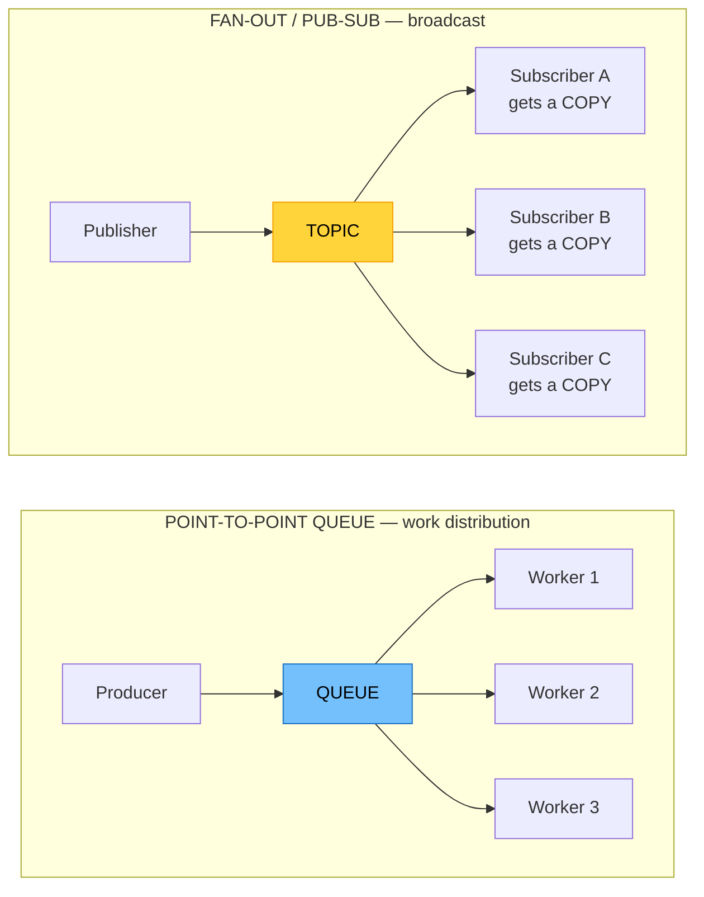
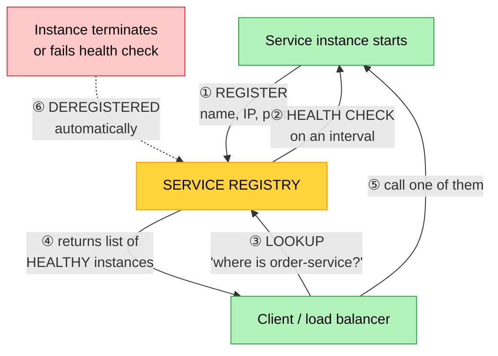

# Objective 1.5 — Explain the purpose of cloud-native design concepts

> **Domain 1.0 — Cloud Architecture (23% of exam)** · Exam CV0-004 V4 · Objectives doc v5.0
> **Status:** Exam-ready · **Version:** 2.0 (enhanced) · Supersedes `full notes/Objective-1.5-Cloud-Native-Design.md`

---

## 0. How to use this note

| Pass | What to read | Time |
|---|---|---|
| **1st (learn)** | Sections 1 → 9 in order | ~60 min |
| **2nd (drill)** | Section 2.2 (the five concepts in one picture) + Section 5.3 (resilience patterns) | ~20 min |
| **3rd (test)** | Section 12 (practice) + Section 13 (PBQ drills) | ~30 min |
| **Exam eve** | Section 14 (60-second recall sheet) only | ~5 min |

> 📌 **This objective has only five bullets but they interlock.** Do not learn them as five separate definitions — learn how one architecture uses all five at once (Section 2.2). Questions frequently describe a system and ask which *concept* is being demonstrated.

---

## 1. Official objective coverage

> **1.5 Explain the purpose of cloud-native design concepts.**
> - Cloud-provided managed services
> - Microservices
> - Loosely coupled architecture
> - Fan-out
> - Service discovery

### 1.1 What the verb tells you

**"Explain the purpose of"** — note the wording: not "explain the concepts," but **the purpose**. Questions will less often ask *what* a microservice is and more often ask ***why* you would use one**, or **what problem a pattern solves**.

**Practical consequence:** for every concept below, be ready to state:
1. **What problem existed before it**
2. **What it solves**
3. **What it costs you** (every cloud-native pattern trades simplicity for something)

That third one is where the harder questions live — CompTIA likes "which is a **drawback** of…" and "what **additional** requirement does this introduce."

### 1.2 What "cloud-native" actually means

```text
   ┌────────────────────────────────────────────────────────────────────┐
   │  CLOUD-HOSTED ("lift and shift")   vs   CLOUD-NATIVE               │
   ├────────────────────────────────────────────────────────────────────┤
   │  Same app, now on a VM               Designed FOR the cloud        │
   │  Scales vertically (bigger VM)       Scales HORIZONTALLY           │
   │  Stateful, long-lived servers        STATELESS, disposable         │
   │  Failure = outage                    Failure = expected, absorbed  │
   │  Manual/scripted deployment          Automated, continuous         │
   │  You run the database                MANAGED services             │
   │  One big deployable                  Small independent services    │
   │  Servers are "pets"                  Servers are "cattle"          │
   └────────────────────────────────────────────────────────────────────┘
```

**Cloud-native** means designing an application to *exploit* the cloud's defining properties — elasticity, on-demand managed services, automation, and the assumption that any individual component can disappear at any moment — rather than merely running legacy software on rented hardware.

> ⚠️ **The single most important mindset shift:** in cloud-native design, **failure is normal, not exceptional.** Instances are terminated, scaled in, and replaced constantly. Every one of the five concepts in this objective exists to make an application survive that.

### 1.3 Coverage checklist

- [ ] I can define cloud-native and contrast it with lift-and-shift
- [ ] For each of the five concepts I can state the **problem**, the **benefit**, and the **cost**
- [ ] I know why **statelessness** is a prerequisite for horizontal scaling
- [ ] I can list at least four categories of managed service and their trade-offs
- [ ] I can compare monolith vs microservices on deployment, scaling, failure, and complexity
- [ ] I know when microservices are the **wrong** answer
- [ ] I can distinguish **synchronous** from **asynchronous** communication and their failure behaviour
- [ ] I know the resilience patterns: **retry with backoff**, **circuit breaker**, **timeout**, **bulkhead**, **DLQ**
- [ ] I can explain why **idempotency** is required with at-least-once delivery
- [ ] I can distinguish **fan-out (pub/sub)** from a **point-to-point queue**, and know what fan-in is
- [ ] I know **client-side** vs **server-side** service discovery
- [ ] I recognise the anti-patterns: distributed monolith, shared database, chatty services

---

## 2. The core mental model

### 2.1 Monolith vs microservices

```text
   MONOLITH                              MICROSERVICES
   ┌──────────────────────────┐          ┌────────┐ ┌────────┐ ┌────────┐
   │  ┌────────────────────┐  │          │ ORDER  │ │PAYMENT │ │INVENT- │
   │  │ Orders             │  │          │ service│ │ service│ │ ORY svc│
   │  ├────────────────────┤  │          └───┬────┘ └───┬────┘ └───┬────┘
   │  │ Payments           │  │              │          │          │
   │  ├────────────────────┤  │           ┌──▼──┐    ┌──▼──┐    ┌──▼──┐
   │  │ Inventory          │  │           │ DB  │    │ DB  │    │ DB  │
   │  ├────────────────────┤  │           └─────┘    └─────┘    └─────┘
   │  │ Notifications      │  │          each: own code, own data,
   │  └────────────────────┘  │                own deploy, own scale
   │         ▼                │
   │    ┌─────────┐           │          ✓ scale only what's hot
   │    │ ONE DB  │           │          ✓ failure stays local
   │    └─────────┘           │          ✓ teams deploy independently
   └──────────────────────────┘          ✗ network calls everywhere
   ✓ simple to build & deploy            ✗ distributed data consistency
   ✓ one place to debug                  ✗ needs discovery, tracing, mesh
   ✗ scale ALL of it or none             ✗ much harder to operate
   ✗ one bug can take everything down
   ✗ one language/stack, slow releases
```

### 2.2 ★ All five concepts in one architecture

This single picture is the objective. Every question maps onto some part of it.

```text
                              👤 USERS
                                 │
                        ┌────────▼────────┐
                        │   API GATEWAY   │  single front door
                        └────────┬────────┘
                                 │ ⑤ asks: "where is Order service?"
                        ┌────────▼─────────┐
                        │ SERVICE DISCOVERY│  registry of healthy instances
                        │    (registry)    │  ← instances register/deregister
                        └────────┬─────────┘    and are health-checked
                                 │ returns live IPs
        ┌────────────────────────┼────────────────────────┐
        │                        │                        │
   ┌────▼────┐             ┌─────▼────┐            ┌──────▼───┐
   │ ORDER   │             │ PAYMENT  │            │INVENTORY │   ② MICROSERVICES
   │ service │             │ service  │            │ service  │   small, independent,
   └────┬────┘             └──────────┘            └──────────┘   own data, own scale
        │
        │ publishes "OrderPlaced" event — does NOT call anyone directly
        ▼                                              ③ LOOSELY COUPLED
   ╔═════════════════════════════════════════╗         publisher doesn't know
   ║        EVENT BUS / PUB-SUB TOPIC        ║         or care who listens
   ╚══╦═══════════╦═══════════╦═══════════╦══╝
      ║           ║           ║           ║            ④ FAN-OUT
      ▼           ▼           ▼           ▼            one event → many
   ┌──────┐  ┌────────┐  ┌────────┐  ┌─────────┐       independent reactions,
   │Email │  │Analytics│ │ Fraud  │  │Warehouse│       all in parallel
   │notify│  │ ingest  │ │ check  │  │ dispatch│
   └──────┘  └────────┘  └────────┘  └─────────┘

   ┌────────────────────────────────────────────────────────────────┐
   │ ① CLOUD-PROVIDED MANAGED SERVICES underpin ALL of the above:   │
   │   managed database · managed queue/topic · managed cache ·     │
   │   managed registry · managed API gateway · serverless compute  │
   │   → the provider patches, scales, and keeps them available     │
   └────────────────────────────────────────────────────────────────┘
```

### 2.3 Statelessness — the property that makes it all work

```text
   STATEFUL SERVER (the problem)          STATELESS SERVER (cloud-native)
   ┌────────────────────┐                 ┌────────────────────┐
   │  App instance      │                 │  App instance      │
   │  ┌──────────────┐  │                 │   (holds NOTHING)  │
   │  │ user session │  │ ← lives HERE    └─────────┬──────────┘
   │  │ uploaded file│  │                           │ reads/writes
   │  │ in-memory    │  │                           ▼
   │  │ cache        │  │                 ┌────────────────────┐
   │  └──────────────┘  │                 │ EXTERNAL STATE     │
   └────────────────────┘                 │ cache / database / │
                                          │ object storage     │
   ✗ Can't scale out — user is tied       └────────────────────┘
     to one instance (needs sticky
     sessions)                            ✓ ANY instance serves ANY request
   ✗ Instance dies → session lost         ✓ Scale out/in freely
   ✗ Can't deploy without disruption      ✓ Instance dies → no data lost
                                          ✓ Rolling deploys are trivial
```

> ★ **Why this matters for the exam:** every cloud-native benefit — horizontal scaling, self-healing, rolling deployment, scale-to-zero — **depends on the instance holding no unique state**. If a question describes an app that "cannot scale horizontally" or "loses user sessions when an instance is replaced," the root cause is **statefulness**, and the fix is to externalise state.

---

## 3. Cloud-provided managed services

| | |
|---|---|
| **Definition** | A service where the **provider operates the software** — installation, patching, high availability, backups, scaling, and failover — while you only configure and consume it through an endpoint or API. |
| **Problem it solves** | Engineering time spent on **undifferentiated heavy lifting**: patching database servers, configuring replication, tuning a message broker, building failover. None of that work differentiates your product. |
| **Benefits** | Faster delivery; built-in HA and backups; provider-scale reliability and security; smaller ops team; usage-based pricing; automatic patching |
| **★ Costs / trade-offs** | **Vendor lock-in** (proprietary APIs and behaviours); **less control** (no OS access, limited tuning, provider's version choices); **service quotas and limits** you cannot exceed; a **management premium** in the price; you inherit the provider's maintenance windows and outages |
| **Exam triggers** | "we don't want to manage servers", "the provider handles patching and backups", "reduce operational overhead", "small team, no DBA", "managed database/queue/cache" |

**Categories to recognise:**

| Category | What it replaces | Examples |
|---|---|---|
| **Managed database (DBaaS)** | Self-run DB on a VM | Relational, NoSQL, data warehouse |
| **Managed messaging** | Self-run broker | Queues, pub/sub topics, event buses, streams |
| **Managed cache** | Self-run Redis/Memcached | In-memory caching layers |
| **Serverless compute (FaaS)** | Always-on app servers | Event-driven functions (see 1.1) |
| **Managed containers (CaaS)** | Self-run Kubernetes | Managed control plane, serverless containers |
| **Managed identity, secrets, keys** | Self-run directory / vault | IAM, secret stores, KMS |
| **Managed monitoring** | Self-run ELK/Prometheus | Metrics, logs, traces, dashboards |

> ⚠️ **The exam's favourite managed-services trade-off question:** managed services reduce operational burden **but increase vendor lock-in and reduce control**. If an answer option says "no drawbacks," it is wrong.

---

## 4. Microservices

| | |
|---|---|
| **Definition** | An architectural style in which an application is built as a suite of **small, independently deployable services**, each owning **one business capability** and its **own data**, communicating over the network via APIs or messaging. |
| **Problem it solves** | In a monolith, everything scales together, deploys together, and fails together; a single team bottleneck and one shared codebase slow releases as the system grows. |
| **Benefits** | **Independent deployment** (ship one service without redeploying the app); **granular scaling** (scale only the hot service); **fault isolation** (a failure is contained); **technology freedom** per service; **team autonomy** and ownership |
| **★ Costs / trade-offs** | **Distributed-systems complexity** — every in-process call becomes a network call that can be slow, fail, or duplicate. You now need **service discovery**, **distributed tracing**, **centralised logging**, retry/timeout logic, and **eventual consistency** instead of database transactions. Operational overhead and infrastructure cost rise. Debugging spans many services. |
| **Exam triggers** | "independently deployable", "scale one component", "small autonomous teams", "one business capability per service", "a failure in one feature must not affect others" |

### 4.1 Data in microservices — the hard part

**Database per service** is the rule: each service owns its data and no other service reads it directly. Sharing a database re-couples the services and destroys independent deployability.

The consequence: **you lose cross-service ACID transactions.** A checkout that spans Order, Payment, and Inventory cannot be one transaction. Instead:

| Approach | How it works |
|---|---|
| **Eventual consistency** | Services converge to a consistent state over time via events, rather than instantly |
| **Saga pattern** | A sequence of local transactions, each publishing an event that triggers the next; failures trigger **compensating transactions** that undo prior steps |
| **Choreography** | Services react to each other's events with no central coordinator — simple, but hard to follow |
| **Orchestration** | A coordinator service explicitly drives the steps — clearer, but a central dependency |

### 4.2 When microservices are the WRONG answer

CompTIA does test the balanced view. Microservices are a poor fit when:

- The team is **small** (fewer people than services means nobody owns anything)
- The domain is **simple** or not yet understood — you cannot draw correct boundaries yet
- There is **no automation maturity** (no CI/CD, no monitoring, no IaC)
- The workload is **low traffic** — the operational cost outweighs the scaling benefit
- **Strong transactional consistency** across the whole domain is a hard requirement

> 💡 A well-built **modular monolith** is a legitimate and often superior answer for a small team. "Start with a monolith, extract services when boundaries are proven" is mainstream engineering advice, not a compromise.

---

## 5. Loosely coupled architecture

| | |
|---|---|
| **Definition** | A design in which components interact through **stable, abstract interfaces** — APIs, queues, events — rather than direct dependencies on each other's internals, location, or availability. |
| **Problem it solves** | **Cascading failure** and **change ripple**. In a tightly coupled system, if B is slow or down, A blocks and then fails, and so does everything calling A. Changing B forces changes in A. |
| **Benefits** | Independent failure, scaling, and deployment; components can be replaced or rewritten without touching callers; load is buffered during spikes; new consumers can be added without modifying producers |
| **★ Costs / trade-offs** | **Eventual consistency** (the answer isn't immediate); harder to trace a request end to end; message duplication and ordering must be handled; more moving parts to operate; debugging is harder |
| **Exam triggers** | "components must not depend on each other", "the system must keep accepting orders even if the processor is down", "buffer traffic spikes", "add new consumers without changing the producer", "avoid cascading failure" |

### 5.1 Tight vs loose coupling, visually

```text
   TIGHTLY COUPLED — synchronous chain
   ┌───────┐  waits  ┌───────┐  waits  ┌───────┐
   │ Web   │────────►│ Order │────────►│Payment│
   └───────┘         └───────┘         └───┬───┘
                                            │ ✗ DOWN
   Result: Payment down → Order blocks → Web blocks → USER SEES AN ERROR
           One failure propagates all the way up. Cascading failure.

   LOOSELY COUPLED — asynchronous via a queue
   ┌───────┐        ╔═══════════╗        ┌───────┐
   │ Web   │───────►║   QUEUE   ║───────►│Payment│
   └───────┘ writes ╚═══════════╝ reads  └───┬───┘
             and returns   ▲                  │ ✗ DOWN
             immediately   │                  │
                    messages accumulate SAFELY
   Result: Payment down → messages wait in the queue → Web still returns 200
           User is unaffected. Work is processed when Payment recovers.
```

### 5.2 Synchronous vs asynchronous

| | **Synchronous (request/response)** | **Asynchronous (queue/event)** |
|---|---|---|
| Caller | **Waits** for the reply | **Fires and forgets** |
| Both must be up | ✅ Yes | ❌ No — the broker buffers |
| Coupling | Tighter (temporal coupling) | **Looser** |
| Traffic spikes | Overwhelm the downstream | **Buffered** by the queue |
| Consistency | Immediate | **Eventual** |
| Failure behaviour | **Cascades** | Isolated |
| Complexity | Simple | Higher (duplicates, ordering, DLQs) |
| Typical use | Reads, user-facing queries needing an answer now | Writes, background work, notifications, integration |
| Technology | REST, gRPC, direct API call | Message queue, pub/sub topic, event bus, stream |

### 5.3 ★ Resilience patterns — how loose coupling is actually implemented

These come up as "which pattern prevents X" questions.

| Pattern | What it does | Prevents |
|---|---|---|
| **Timeout** | Cap how long a caller waits | Threads blocked forever on a hung dependency |
| **Retry with exponential backoff + jitter** | Retry failed calls, waiting progressively longer, with randomness | Transient failures — and the **thundering herd** when everyone retries in sync |
| **Circuit breaker** | After N consecutive failures, stop calling the dependency and fail fast; test periodically | **Cascading failure**; gives the failing service room to recover |
| **Bulkhead** | Isolate resources (thread/connection pools) per dependency | One slow dependency exhausting all resources and sinking the whole service |
| **Dead-letter queue (DLQ)** | Messages that repeatedly fail move to a separate queue | A **poison message** blocking the queue forever |
| **Back-pressure** | Signal upstream to slow down when overloaded | Unbounded queue growth and memory exhaustion |
| **Graceful degradation** | Serve reduced functionality when a dependency is down | Total outage when one optional feature fails |

**Circuit breaker states:**

```text
        failures exceed threshold
   ┌────────┐ ──────────────────► ┌────────┐
   │ CLOSED │                     │  OPEN  │  fail fast, don't even try
   │ normal │ ◄────────────────── │        │  (protects the sick service)
   └────────┘    test succeeds    └───┬────┘
        ▲                             │ after a cooldown
        │                             ▼
        │                        ┌──────────┐
        └────────────────────────│HALF-OPEN │ allow a few trial requests
              test fails → OPEN  └──────────┘
```

### 5.4 Message delivery semantics — and why idempotency matters

| Guarantee | Meaning | Consequence |
|---|---|---|
| **At-most-once** | Delivered zero or one time | Messages can be **lost** |
| **At-least-once** | Delivered one or more times — **the common default** | **Duplicates are possible** |
| **Exactly-once** | Delivered precisely once | Expensive, lower throughput, often only within a limited scope |

> ★ **Because at-least-once is the norm, consumers must be idempotent** — processing the same message twice must produce the same result as processing it once. Otherwise a retry charges the customer twice. This is the single most important practical consequence of loose coupling, and a favourite exam point.

**Standard vs FIFO queues:**

| | **Standard queue** | **FIFO queue** |
|---|---|---|
| Ordering | Best-effort | **Strict** first-in-first-out |
| Delivery | At-least-once (duplicates possible) | Exactly-once processing |
| Throughput | **Very high** | Lower |
| Use when | Order doesn't matter, scale does | Sequence matters (e.g. financial ledger entries) |

---

## 6. Fan-out

| | |
|---|---|
| **Definition** | A messaging pattern in which **one published message is delivered to multiple independent subscribers simultaneously**, each receiving its own copy and processing it in parallel. Also called **publish/subscribe (pub/sub)** or **one-to-many** distribution. |
| **Problem it solves** | Without it, a producer must call each consumer directly — it must know every consumer, wait for each, and be modified whenever a new consumer is added. One slow consumer delays everything. |
| **Benefits** | The **publisher does not know or care who is listening**; new subscribers are added with **zero changes to the publisher**; all reactions happen in **parallel**, so total latency is the slowest one, not the sum; failure of one subscriber does not affect the others |
| **★ Costs / trade-offs** | Harder to trace and debug (one event, many effects, no single call stack); duplicate processing must be handled; ordering across subscribers is not guaranteed; a burst fans out into N× the downstream load |
| **Exam triggers** | "one event triggers several independent actions", "notify multiple systems", "add new consumers without changing the publisher", "broadcast", "publish/subscribe", "in parallel" |

### 6.1 Fan-out vs point-to-point queue



> ★ **The distinction that decides the question:**
> **Point-to-point queue** — each message goes to **exactly ONE** worker. Workers **compete**. Purpose: **distribute work / scale processing**.
> **Fan-out (pub/sub)** — each message goes to **EVERY** subscriber. Subscribers **each get a copy**. Purpose: **broadcast one event to many different reactions**.

### 6.2 Related patterns

| Pattern | Meaning |
|---|---|
| **Fan-out** | One → many. Broadcast an event to multiple consumers |
| **Fan-in** | Many → one. Multiple producers feed a single consumer/aggregator |
| **Scatter-gather** | Fan-out **then** fan-in — dispatch a request to many services, then combine the responses (e.g. a price-comparison query) |
| **Event bus** | A routing layer that filters and delivers events to subscribers by rule |
| **Stream** | An ordered, replayable, retained log of events that multiple consumers read at their own position — unlike a queue, reading does not consume |

**Queue vs topic vs stream — a compact distinction:**

| | **Queue** | **Topic (pub/sub)** | **Stream** |
|---|---|---|---|
| Delivery | One consumer per message | Every subscriber gets a copy | Every consumer reads at its own offset |
| Message retained after read | ❌ Deleted | ❌ Deleted per subscriber | ✅ **Retained for a period — replayable** |
| Ordering | Best-effort or FIFO | Not guaranteed across subscribers | **Ordered within a partition** |
| Use for | Work distribution | Broadcast/notification | Event sourcing, analytics, replay |

---

## 7. Service discovery

| | |
|---|---|
| **Definition** | The mechanism by which a service finds the **current network location (IP and port) of another service at runtime**, using a dynamic registry rather than hard-coded addresses. |
| **Problem it solves** | In an elastic, containerised environment, instances are created and destroyed constantly and **their IP addresses change**. Hard-coded endpoints and static config files break within minutes. |
| **How it works** | ① Instances **register** themselves on startup (or an agent registers them). ② The registry **health-checks** them continuously. ③ Clients **query** the registry by service *name*. ④ Unhealthy or terminated instances are **deregistered** automatically. |
| **Benefits** | Automatic adaptation to scaling and replacement; traffic only ever goes to **healthy** instances; enables load balancing, blue-green and canary routing; no config changes on deploy |
| **★ Costs / trade-offs** | The registry becomes **critical infrastructure** and must itself be highly available; stale entries or **DNS TTL caching** can send traffic to dead instances; added latency on lookup (mitigated by caching); one more component to operate |
| **Exam triggers** | "instances change IP when they scale", "cannot hard-code addresses", "find healthy instances automatically", "service registry", "resolve by service name" |

### 7.1 How it works



### 7.2 Client-side vs server-side discovery

```text
   CLIENT-SIDE DISCOVERY                 SERVER-SIDE DISCOVERY
   ┌────────┐                            ┌────────┐
   │ Client │──① ask registry───┐        │ Client │──① call the LB/router──┐
   │        │◄─② get instance   │        │        │   (one stable address)  │
   │        │    list           │        └────────┘                         │
   │        │──③ CHOOSE one ────┼──┐                    ┌──────────────┐    │
   └────────┘   and call        │  │                    │ LOAD BALANCER│◄───┘
                                │  │                    │  or ROUTER   │
                          ┌─────▼──▼──┐                 └──────┬───────┘
                          │ REGISTRY  │                        │② asks registry
                          └───────────┘                        ▼③ forwards
                                                        ┌───────────┐
   Client does the load balancing.                      │ REGISTRY  │
   ✓ No extra hop  ✗ Logic in every                     └───────────┘
     client, every language                    Client knows nothing.
                                               ✓ Simple clients, language-agnostic
                                               ✗ Extra hop; LB must be HA
```

**Common implementations:**

| Mechanism | Type | Notes |
|---|---|---|
| **DNS-based** | Server-side | Simplest; resolve a service name to current IPs. **Watch TTL caching** |
| **Kubernetes Service + CoreDNS** | Server-side | Stable virtual IP and DNS name in front of changing pod IPs |
| **Load balancer + target groups** | Server-side | The LB is the discovery point; health checks drive membership |
| **Dedicated registry** (Consul, etcd, Eureka, Zookeeper) | Either | Rich health checking, key-value config, multi-datacentre |
| **Service mesh** (sidecar proxy) | Server-side, transparent | Discovery, mTLS, retries, and telemetry without app code (see 1.6) |

> ⚠️ **The DNS TTL trap:** DNS-based discovery is easy but clients cache resolved addresses for the TTL duration. If an instance dies, traffic keeps going to the dead IP until the cache expires. Short TTLs mitigate it; health-checked registries or load balancers avoid it.

---

## 8. Adjacent cloud-native concepts

### 8.1 The twelve-factor app

A widely used checklist for cloud-native applications. Not in the official bullets, but its ideas appear throughout the exam:

| # | Factor | Cloud-native meaning |
|---|---|---|
| 1 | **Codebase** | One codebase in version control, many deploys |
| 2 | **Dependencies** | Declared explicitly, never assumed present on the host |
| 3 | **Config** | **In the environment, not in code** — same artefact promoted across environments |
| 4 | **Backing services** | Databases, queues, caches are attached resources, swappable by config |
| 5 | **Build, release, run** | Strictly separated stages |
| 6 | **Processes** | **Stateless and share-nothing** ← the critical one |
| 7 | **Port binding** | The app is self-contained and exports a service on a port |
| 8 | **Concurrency** | **Scale out by adding processes**, not by growing one |
| 9 | **Disposability** | Fast startup, **graceful shutdown** — instances are disposable |
| 10 | **Dev/prod parity** | Keep environments as similar as possible |
| 11 | **Logs** | Treat as **event streams to stdout**, not files the app manages |
| 12 | **Admin processes** | Run one-off tasks as identical short-lived processes |

> 💡 Factors **3 (config in environment)**, **6 (stateless)**, **9 (disposability)**, and **11 (logs as streams)** are the ones that most often surface as exam answers.

### 8.2 Other concepts worth recognising

| Concept | Meaning | Why it matters |
|---|---|---|
| **API-first design** | The API contract is designed before implementation and treated as the product | Enables independent teams and stable integration; versioning prevents breaking consumers |
| **API gateway** | A single entry point that routes to services and handles auth, rate limiting, throttling, and TLS | Stops every client needing to know the internal topology |
| **Idempotency** | The same operation applied twice has the same effect as once | **Required** for safe retries under at-least-once delivery |
| **Elasticity** | Automatically add and remove capacity with demand | The economic point of cloud-native (see 3.2) |
| **Horizontal vs vertical scaling** | Add more instances vs make one bigger | Cloud-native scales **out**; vertical scaling has a hard ceiling and needs downtime |
| **Immutable infrastructure** | Never patch in place — replace with a new version | Eliminates configuration drift and snowflake servers |
| **Declarative configuration** | Describe the desired state; the system converges to it | The basis of IaC and Kubernetes (see 2.5, 1.6) |
| **Service mesh** | Sidecar proxies handling east-west traffic, mTLS, retries, and telemetry | Moves resilience out of application code (see 1.6) |
| **Observability** | Metrics, logs, and **distributed tracing** | **Mandatory** with microservices — you cannot debug a distributed system with logs alone (see 3.1) |
| **Circuit breaker / retry / bulkhead** | See Section 5.3 | The resilience toolkit |

### 8.3 Anti-patterns — expect at least one question

| Anti-pattern | What it looks like | Why it's bad |
|---|---|---|
| **Distributed monolith** | Services that must be deployed together and call each other synchronously in a chain | All the complexity of microservices with none of the independence — **the most common failure mode** |
| **Shared database** | Multiple services reading and writing the same tables | Re-couples services; a schema change breaks everyone |
| **Chatty services** | Dozens of fine-grained network calls to serve one request | Latency and failure probability multiply |
| **Nano-services** | Services so small the overhead exceeds their value | Operational cost with no benefit |
| **No observability** | Microservices without tracing or centralised logs | Faults become effectively undiagnosable |
| **Synchronous chains** | A → B → C → D, each waiting | One slow link makes everything slow; cascading failure |

---

## 9. Comparison tables

### 9.1 Monolith vs microservices

| Aspect | **Monolith** | **Microservices** |
|---|---|---|
| Deployment unit | One artefact | **Many, independent** |
| Scaling | Whole app together | **Per service** |
| Failure blast radius | **Entire application** | Contained to one service |
| Data | One shared database, **ACID transactions** | **Database per service**, eventual consistency |
| Technology | Single stack | **Per-service choice** |
| Communication | In-process calls (fast, reliable) | **Network calls** (slow, can fail) |
| Team structure | Shared codebase | Small autonomous teams |
| Release cadence | Coordinated, slower | Independent, faster |
| Operational complexity | **Low** | **High** — discovery, tracing, mesh, CI/CD required |
| Debugging | One process, one log | Distributed tracing required |
| Best when | Small team, simple/unclear domain, low traffic | Large org, proven boundaries, high scale, mature automation |

### 9.2 Self-managed vs cloud-managed

| Aspect | **Self-managed (on IaaS)** | **Cloud-managed (PaaS)** |
|---|---|---|
| Patching, upgrades | **You** | **Provider** |
| High availability | You design and build it | Usually built in |
| Backups | You configure | Automated |
| Ops effort | High | **Low** |
| Control and tuning | **Maximum** | Limited to exposed settings |
| Version choice | Yours | Provider's supported versions |
| Lock-in | Low | **Higher** |
| Cost | Resource cost only | Resource + **management premium** |
| Time to deploy | Days | Minutes |

### 9.3 Communication patterns

| | **Synchronous API** | **Queue (point-to-point)** | **Topic (fan-out/pub-sub)** | **Stream** |
|---|---|---|---|---|
| Consumers per message | One (the caller) | **Exactly one worker** | **Every subscriber** | Every consumer, own offset |
| Caller waits | ✅ Yes | ❌ No | ❌ No | ❌ No |
| Buffers spikes | ❌ No | ✅ Yes | ✅ Yes | ✅ Yes |
| Survives consumer outage | ❌ No | ✅ Yes | ✅ Yes | ✅ Yes |
| Replayable | ❌ | ❌ | ❌ | ✅ **Yes** |
| Purpose | Get an answer now | **Distribute work** | **Broadcast an event** | Event log / analytics |

### 9.4 The five concepts — purpose, benefit, cost

| Concept | **Purpose (problem solved)** | **Key benefit** | **Main cost** |
|---|---|---|---|
| **Managed services** | Undifferentiated ops work | Speed, built-in HA, less staff | **Lock-in, less control, quotas** |
| **Microservices** | Everything scales/deploys/fails together | Independent deploy, scale, isolation | **Distributed complexity, eventual consistency** |
| **Loose coupling** | Cascading failure, change ripple | Independent failure and scaling | **Eventual consistency, harder tracing** |
| **Fan-out** | Producer must call every consumer | Add consumers with no publisher change; parallel | **Harder to trace, duplicates, N× load** |
| **Service discovery** | IPs change constantly when scaling | Always routes to healthy instances | **Registry is critical infra; stale/TTL issues** |

### 9.5 Multi-cloud service mapping

| Concept | AWS | Azure | Google Cloud |
|---|---|---|---|
| Managed relational DB | RDS / Aurora | Azure SQL Database | Cloud SQL |
| Managed NoSQL | DynamoDB | Cosmos DB | Firestore / Bigtable |
| Managed cache | ElastiCache | Azure Cache for Redis | Memorystore |
| **Queue** | **SQS** | Service Bus Queue / Storage Queue | Pub/Sub (with subscription) |
| **Fan-out / pub-sub** | **SNS**, EventBridge | Event Grid, Service Bus Topic | **Pub/Sub** |
| Stream | Kinesis, MSK | Event Hubs | Pub/Sub, Dataflow |
| Serverless compute | Lambda | Azure Functions | Cloud Functions / Cloud Run |
| **Service discovery** | Cloud Map, ALB target groups, ECS/EKS service discovery | Azure Service Fabric naming, AKS + CoreDNS | GKE Services + Cloud DNS, Traffic Director |
| API gateway | API Gateway | API Management | API Gateway / Apigee |
| Service mesh | App Mesh | Open Service Mesh / Istio on AKS | Anthos Service Mesh / Istio |

---

## 10. Exam traps & distractor patterns

| # | Trap | The truth |
|---|---|---|
| 1 | "Microservices are always better than a monolith" | For a **small team, simple domain, or low traffic** a monolith is the correct answer. Microservices trade simplicity for scale |
| 2 | "Microservices have no drawbacks" | They introduce **distributed complexity**: network failures, discovery, tracing, eventual consistency, higher ops cost |
| 3 | "Managed services have no downside" | **Vendor lock-in**, reduced control, service quotas, and a price premium |
| 4 | "Loose coupling gives immediate consistency" | It gives **eventual** consistency — that is the trade |
| 5 | "Fan-out and a work queue are the same" | Queue = **one** consumer per message (competing). Fan-out = **every** subscriber gets a copy |
| 6 | "A queue is fan-out because multiple workers read it" | Workers **compete** for messages; each message is processed once. That is work distribution, not broadcast |
| 7 | "Service discovery is just DNS" | DNS is one implementation. Discovery adds **registration, health checking, and automatic deregistration** — and DNS alone suffers **TTL caching** |
| 8 | "Retries make the system reliable" | Naive retries cause a **thundering herd** and amplify an outage. Use **exponential backoff with jitter** plus a **circuit breaker** |
| 9 | "Duplicate messages mean the queue is broken" | **At-least-once delivery is normal.** Consumers must be **idempotent** |
| 10 | "Sticky sessions are the fix for lost user state" | The fix is **externalising state**. Sticky sessions preserve statefulness and block graceful scaling |
| 11 | "Splitting into services is enough" | If they deploy together and call each other synchronously, you built a **distributed monolith** — the worst of both |
| 12 | "Each service can share the main database" | A **shared database re-couples** the services and defeats independent deployment |
| 13 | "Cloud-native means running in the cloud" | Running a legacy VM in the cloud is **lift-and-shift**, not cloud-native |
| 14 | "Scale vertically for elasticity" | Cloud-native scales **horizontally**; vertical scaling has a ceiling and usually needs downtime |
| 15 | "A circuit breaker retries failed calls" | It does the opposite — it **stops calling** and fails fast so the dependency can recover |
| 16 | "Microservices reduce operational overhead" | They **increase** it. What they reduce is coupling and release friction |

**Disambiguation drill:**

| Pair | The deciding question |
|---|---|
| **Queue vs topic (fan-out)** | Should **one** consumer handle it, or **all** of them? |
| **Sync vs async** | Does the caller need the answer **now**? |
| **Monolith vs microservices** | Is the team large and the domain well understood, with automation in place? |
| **Circuit breaker vs retry** | Transient blip → **retry with backoff**. Sustained failure → **circuit breaker** |
| **Stateless vs stateful** | If the instance is replaced mid-session, is anything lost? |
| **Managed vs self-managed** | Is control worth the operational cost? |
| **Client-side vs server-side discovery** | Does the **client** choose the instance, or a **load balancer/router**? |

---

## 11. Keyword → answer trigger table

| If you see… | Think |
|---|---|
| provider patches and backs it up · no servers to manage · reduce ops overhead · no DBA | **Managed services** |
| independently deployable · scale one component · one business capability · small autonomous teams | **Microservices** |
| must not depend on each other · keep working if downstream is down · buffer spikes · avoid cascading failure | **Loose coupling (async/queue)** |
| one event triggers several actions · notify multiple systems · add consumers without changing the publisher · broadcast · in parallel | **Fan-out / pub-sub** |
| each message handled by exactly one worker · distribute work · competing consumers | **Point-to-point queue** |
| IPs change when scaling · cannot hard-code addresses · find healthy instances · resolve by name | **Service discovery** |
| loses sessions when an instance is replaced · cannot scale horizontally | **Statefulness → externalise state** |
| processing the same message twice charges twice | **Idempotency required** (at-least-once delivery) |
| one failing dependency takes down the whole service | **Circuit breaker** (+ timeout, bulkhead) |
| everyone retries at once and makes it worse | **Exponential backoff with jitter** |
| a bad message blocks the queue forever | **Dead-letter queue** |
| services must be deployed together, call each other in a chain | **Distributed monolith (anti-pattern)** |
| replay past events · consumers read at their own position | **Stream** (not a queue) |
| single entry point, auth and rate limiting for all services | **API gateway** |
| never patch in place, replace the instance | **Immutable infrastructure** |
| config differs per environment but the artefact is identical | **Twelve-factor: config in the environment** |

---

## 12. Practice questions

<details>
<summary><b>Q1.</b> An application publishes an "order placed" event that must trigger email notification, fraud checking, analytics ingestion, and warehouse dispatch — all independently and in parallel. Which pattern is this?</summary>

A. Point-to-point queue · **B. Fan-out (publish/subscribe)** · C. Synchronous API chain · D. Service discovery

**Correct: B — fan-out.** One event delivered to multiple independent subscribers, each receiving its own copy and acting in parallel.
- **A wrong:** In a point-to-point queue each message is consumed by exactly one worker, so only one of the four actions would occur.
- **C wrong:** A synchronous chain would couple the publisher to every consumer and make total latency the sum of all four.
- **D wrong:** Service discovery locates instances; it does not distribute events.
</details>

<details>
<summary><b>Q2.</b> What is the PRIMARY purpose of service discovery?</summary>

A. To encrypt traffic between services · **B. To locate the current network addresses of healthy service instances at runtime, since instances change as they scale** · C. To distribute messages to multiple subscribers · D. To store application configuration

**Correct: B.** Elastic and containerised instances are created and destroyed constantly with changing IPs, so addresses cannot be hard-coded.
- **A wrong:** That is TLS/mTLS, often provided by a service mesh.
- **C wrong:** That is fan-out.
- **D wrong:** That is a configuration store.
</details>

<details>
<summary><b>Q3.</b> Which is a DRAWBACK of adopting cloud-provided managed services?</summary>

A. The customer must patch the underlying OS · **B. Increased vendor lock-in and reduced control over configuration** · C. Loss of high availability · D. Higher operational staffing requirements

**Correct: B.** Managed services trade control and portability for reduced operational burden.
- **A wrong:** The provider patches the OS — that is a benefit, not a drawback.
- **C wrong:** Managed services typically include built-in HA.
- **D wrong:** They reduce staffing needs.
</details>

<details>
<summary><b>Q4.</b> A web tier writes to a message queue and immediately returns success. The downstream processor is offline for two hours, yet users experience no errors. Which design principle is demonstrated?</summary>

A. Vertical scaling · **B. Loosely coupled architecture** · C. Service discovery · D. Immutable infrastructure

**Correct: B.** The queue removes the temporal dependency, so the producer does not require the consumer to be available.
- **A wrong:** No resizing is involved.
- **C wrong:** Discovery locates instances but does not buffer work.
- **D wrong:** Immutability concerns how servers are updated.
</details>

<details>
<summary><b>Q5.</b> An application cannot scale horizontally because user sessions are held in each instance's memory. What is the correct remedy?</summary>

A. Enable sticky sessions on the load balancer · **B. Externalise session state to a shared cache or database, making instances stateless** · C. Increase the instance size · D. Add a service registry

**Correct: B.** Statelessness is the prerequisite for horizontal scaling, rolling deployment, and self-healing.
- **A wrong:** Sticky sessions preserve the statefulness and still lose sessions when an instance is replaced.
- **C wrong:** Vertical scaling has a ceiling and does not solve the design flaw.
- **D wrong:** Discovery addresses locating instances, not session storage.
</details>

<details>
<summary><b>Q6.</b> A service repeatedly calls a failing dependency, exhausting its thread pool and becoming unresponsive itself. Which pattern MOST directly prevents this?</summary>

A. Exponential backoff · **B. Circuit breaker** · C. Fan-out · D. Sticky sessions

**Correct: B — circuit breaker.** After a failure threshold it stops calling the dependency and fails fast, protecting the caller and giving the dependency room to recover.
- **A wrong:** Backoff spaces retries out but the calls continue; it does not stop them.
- **C wrong:** Fan-out is a messaging distribution pattern.
- **D wrong:** Unrelated to dependency failure.
</details>

<details>
<summary><b>Q7.</b> A message queue delivers with at-least-once semantics. What MUST consumers implement?</summary>

A. Synchronous processing · B. Vertical scaling · **C. Idempotent processing, so handling a duplicate produces the same result** · D. Sticky sessions

**Correct: C.** At-least-once delivery means duplicates are expected, so processing the same message twice must not double-charge or double-apply.
- **A wrong:** Synchronicity does not prevent duplicates.
- **B/D wrong:** Neither relates to delivery semantics.
</details>

<details>
<summary><b>Q8.</b> Which scenario indicates that microservices are the WRONG choice?</summary>

A. A large organisation with dozens of teams and mature CI/CD · B. A high-traffic system where one component needs independent scaling · **C. A four-person team building a simple application with an unclear domain and no automation** · D. A system where a failure in one feature must not affect others

**Correct: C.** Without automation maturity, clear service boundaries, or enough people to own services, microservices add cost with no benefit — a modular monolith is better.
- **A/B/D wrong:** All three are classic justifications *for* microservices.
</details>

<details>
<summary><b>Q9.</b> What distinguishes a point-to-point queue from a publish/subscribe topic?</summary>

A. Queues are synchronous; topics are asynchronous · **B. A queue message is processed by exactly one consumer, while a topic delivers a copy to every subscriber** · C. Queues cannot buffer messages · D. Topics guarantee ordering; queues never do

**Correct: B.** Competing consumers versus broadcast is the defining difference.
- **A wrong:** Both are asynchronous.
- **C wrong:** Buffering is a queue's main purpose.
- **D wrong:** FIFO queues guarantee ordering; topics generally do not across subscribers.
</details>

<details>
<summary><b>Q10.</b> A team splits its monolith into six services, but all must be deployed together and each calls the next synchronously in a chain. What have they built?</summary>

A. A well-designed microservice architecture · **B. A distributed monolith** · C. A service mesh · D. An event-driven architecture

**Correct: B — a distributed monolith.** They incurred all the operational complexity of distribution while keeping the coupling of a monolith.
- **A wrong:** Independent deployability is the defining property of microservices, and it is absent.
- **C wrong:** A service mesh is infrastructure for east-west traffic.
- **D wrong:** Event-driven architecture would decouple them asynchronously.
</details>

<details>
<summary><b>Q11.</b> Why is distributed tracing considered mandatory in a microservices architecture?</summary>

A. It encrypts inter-service traffic · **B. A single user request spans many services, so per-service logs alone cannot show where latency or failure occurred** · C. It replaces the need for service discovery · D. It guarantees exactly-once delivery

**Correct: B.** Tracing correlates the segments of one request across service boundaries, which is the only practical way to diagnose distributed latency.
- **A wrong:** That is mTLS.
- **C wrong:** Tracing and discovery solve different problems.
- **D wrong:** Delivery semantics are a messaging concern.
</details>

<details>
<summary><b>Q12.</b> Messages that repeatedly fail processing are blocking a queue. What should be configured?</summary>

A. A circuit breaker · **B. A dead-letter queue** · C. Fan-out · D. Sticky sessions

**Correct: B — dead-letter queue.** After a set number of failed attempts the poison message is moved aside so the queue continues processing.
- **A wrong:** Circuit breakers protect callers from failing dependencies, not queues from bad messages.
- **C/D wrong:** Neither addresses message processing failures.
</details>

<details>
<summary><b>Q13.</b> A team stores database credentials and environment-specific URLs in the application code, requiring a rebuild for each environment. Which twelve-factor principle is violated?</summary>

A. Disposability · **B. Config stored in the environment, not in code** · C. Port binding · D. Dev/prod parity

**Correct: B.** Configuration must be externalised so the identical build artefact is promoted through environments.
- **A wrong:** Disposability concerns fast startup and graceful shutdown.
- **C wrong:** Port binding concerns exporting a service on a port.
- **D wrong:** Related, but the specific violation is config in code.
</details>

<details>
<summary><b>Q14.</b> After a brief outage, thousands of clients retry simultaneously and overwhelm the recovering service. What should be implemented?</summary>

A. Immediate retries · **B. Exponential backoff with jitter** · C. Sticky sessions · D. Vertical scaling

**Correct: B.** Progressively longer waits plus randomisation spread the retries out and prevent the thundering-herd effect.
- **A wrong:** That is precisely what caused the problem.
- **C/D wrong:** Neither addresses synchronised retry storms.
</details>

<details>
<summary><b>Q15.</b> Which BEST describes the purpose of loose coupling?</summary>

A. To guarantee immediate consistency across services · **B. To let components fail, scale, and change independently without cascading effects** · C. To reduce the number of services · D. To eliminate the need for monitoring

**Correct: B.** Independence of failure, scaling, and change is the whole purpose.
- **A wrong:** Loose coupling produces **eventual** consistency — it trades immediacy away.
- **C wrong:** It says nothing about service count.
- **D wrong:** Loose coupling makes monitoring *more* important.
</details>

<details>
<summary><b>Q16.</b> Three worker instances read from the same queue. Each message is processed once by whichever worker takes it. What is this called?</summary>

A. Fan-out · **B. Competing consumers / work distribution** · C. Publish-subscribe · D. Scatter-gather

**Correct: B.** Multiple consumers compete for messages from one queue to increase processing throughput.
- **A/C wrong:** Fan-out and pub/sub deliver a copy to every subscriber.
- **D wrong:** Scatter-gather dispatches to many services then aggregates the responses.
</details>

<details>
<summary><b>Q17.</b> Which is a valid reason to use DNS-based service discovery cautiously?</summary>

A. DNS cannot resolve internal names · **B. Clients cache resolved addresses for the TTL, so traffic may continue to a terminated instance** · C. DNS does not support load balancing · D. DNS requires a service mesh

**Correct: B.** TTL caching is the well-known weakness of DNS-based discovery; health-checked registries or load balancers avoid it.
- **A wrong:** Internal DNS zones are standard.
- **C wrong:** Multiple A records provide basic round-robin distribution.
- **D wrong:** A mesh is one option, not a requirement.
</details>

<details>
<summary><b>Q18.</b> An architecture requires that adding a new analytics consumer must not involve changing the publishing service. Which design achieves this?</summary>

A. Synchronous REST calls from the publisher to each consumer · **B. Publishing to a topic that consumers subscribe to** · C. A shared database read by the analytics service · D. Client-side service discovery

**Correct: B.** In pub/sub the publisher is unaware of subscribers, so new ones are added purely on the subscription side.
- **A wrong:** The publisher would need a code change for each new consumer.
- **C wrong:** A shared database is an anti-pattern that recouples the services.
- **D wrong:** Discovery locates services; it does not decouple event delivery.
</details>

<details>
<summary><b>Q19.</b> Which statement about microservice data management is CORRECT?</summary>

A. All services should share one database for consistency · **B. Each service should own its data, which means giving up cross-service ACID transactions in favour of eventual consistency or sagas** · C. Microservices cannot use databases · D. Transactions across services are as simple as in a monolith

**Correct: B.** Database-per-service preserves independence, at the cost of distributed transactions.
- **A wrong:** A shared database is a well-known anti-pattern.
- **C wrong:** Each service typically has its own.
- **D wrong:** Losing cross-service ACID guarantees is one of the main costs of the architecture.
</details>

<details>
<summary><b>Q20.</b> A company runs its legacy application unchanged on cloud virtual machines. Is this cloud-native?</summary>

A. Yes, because it runs in the cloud · **B. No — this is lift-and-shift; cloud-native means designing for elasticity, statelessness, managed services, and expected failure** · C. Yes, if the VMs are in multiple AZs · D. Yes, if a managed database is used

**Correct: B.** Location does not make an application cloud-native; design does.
- **A wrong:** Running in the cloud is cloud-*hosted*.
- **C wrong:** Multi-AZ improves availability but does not change the application's design.
- **D wrong:** One managed component does not make a monolithic, stateful app cloud-native.
</details>

<details>
<summary><b>Q21.</b> Which pattern isolates resource pools so that one slow dependency cannot consume all of a service's threads?</summary>

A. Circuit breaker · B. Retry with backoff · **C. Bulkhead** · D. Fan-out

**Correct: C — bulkhead.** Named after ship compartments, it partitions resources per dependency so a flood stays contained.
- **A wrong:** A circuit breaker stops calls after failures but does not partition resources.
- **B wrong:** Backoff spaces retries.
- **D wrong:** Fan-out is a messaging pattern.
</details>

<details>
<summary><b>Q22.</b> Which requirement points to a stream rather than a queue?</summary>

A. Each message must be processed exactly once by one worker · **B. Multiple consumers must read the same ordered events independently, and be able to replay them later** · C. Messages must be deleted after processing · D. Work must be distributed across competing workers

**Correct: B.** Retention, independent consumer offsets, and replay are stream characteristics.
- **A/C/D wrong:** All three describe a point-to-point queue.
</details>

<details>
<summary><b>Q23.</b> What is the PRIMARY benefit of an API gateway in a microservices architecture?</summary>

A. It stores service state · **B. It provides a single entry point handling routing, authentication, rate limiting, and TLS, so clients need not know the internal topology** · C. It replaces service discovery entirely · D. It guarantees eventual consistency

**Correct: B.** The gateway is the front door that centralises cross-cutting concerns.
- **A wrong:** Gateways are stateless routing components.
- **C wrong:** It typically *uses* discovery to route.
- **D wrong:** Consistency is a data concern.
</details>

<details>
<summary><b>Q24.</b> Which pairing of concept to purpose is INCORRECT?</summary>

A. Managed services → reduce operational burden · B. Microservices → independent deployment and scaling · **C. Fan-out → ensure each message is processed by exactly one consumer** · D. Service discovery → locate healthy instances dynamically

**Correct: C.** Fan-out delivers a copy to **every** subscriber; exactly-one-consumer describes a point-to-point queue.
- **A/B/D wrong:** All three pairings are correct.
</details>

<details>
<summary><b>Q25.</b> A service must return reduced functionality rather than an error when an optional recommendation engine is unavailable. Which principle is this?</summary>

A. Vertical scaling · B. Idempotency · **C. Graceful degradation** · D. Immutable infrastructure

**Correct: C — graceful degradation.** The core capability continues while a non-essential dependency is bypassed.
- **A wrong:** Unrelated to failure handling.
- **B wrong:** Idempotency concerns safe retries.
- **D wrong:** Immutability concerns how instances are updated.
</details>

---

## 13. PBQ-style drills

### Drill A — Identify the concept

| # | Description | Concept? |
|---|---|---|
| 1 | Provider patches and backs up the database; team only connects | |
| 2 | An "order shipped" event triggers email, analytics, and audit logging simultaneously | |
| 3 | Front end resolves `inventory-service` and receives three healthy IPs | |
| 4 | Checkout writes to a queue and returns immediately | |
| 5 | Payment and Order deploy on separate schedules and scale independently | |
| 6 | Three workers pull from one queue; each job runs once | |

<details><summary>Answers</summary>

1 → **Cloud-provided managed services**
2 → **Fan-out (pub/sub)**
3 → **Service discovery**
4 → **Loosely coupled architecture** (asynchronous)
5 → **Microservices**
6 → **Point-to-point queue / competing consumers** — deliberately *not* fan-out
</details>

### Drill B — Diagnose and prescribe

| # | Symptom | Root cause + fix? |
|---|---|---|
| 1 | Users lose their shopping cart whenever an instance is replaced | |
| 2 | One slow downstream service makes the entire API unresponsive | |
| 3 | Customers charged twice when the queue redelivers a message | |
| 4 | After an outage, mass simultaneous retries prevent recovery | |
| 5 | One malformed message stops all queue processing | |
| 6 | Traffic keeps hitting a terminated instance for several minutes | |
| 7 | Six "microservices" must always be released together | |

<details><summary>Answers</summary>

1 → **Stateful instances** → externalise session state to a shared cache/DB
2 → **No timeout/circuit breaker** (and thread pool exhaustion) → add **timeout + circuit breaker + bulkhead**
3 → **At-least-once delivery** → make the consumer **idempotent**
4 → **Thundering herd** → **exponential backoff with jitter**
5 → **Poison message** → configure a **dead-letter queue**
6 → **DNS TTL caching** in discovery → shorten TTL or use a health-checked registry/load balancer
7 → **Distributed monolith** → decouple with async messaging and remove shared dependencies
</details>

### Drill C — Purpose, benefit, cost

From memory, complete the row for each concept.

| Concept | Problem solved | Benefit | Cost |
|---|---|---|---|
| Managed services | ? | ? | ? |
| Microservices | ? | ? | ? |
| Loose coupling | ? | ? | ? |
| Fan-out | ? | ? | ? |
| Service discovery | ? | ? | ? |

<details><summary>Answers</summary>

See Section 9.4. Condensed:
- **Managed services** — ops toil → speed and built-in HA → **lock-in, less control**
- **Microservices** — everything moves together → independent deploy/scale/failure → **distributed complexity, eventual consistency**
- **Loose coupling** — cascading failure → independent failure and buffering → **eventual consistency, harder tracing**
- **Fan-out** — publisher must know every consumer → add consumers freely, parallel processing → **harder tracing, duplicates, N× load**
- **Service discovery** — IPs change on scale → always reach healthy instances → **registry is critical infra, stale/TTL risk**
</details>

### Drill D — Choose the communication pattern

| # | Requirement | Sync API / Queue / Topic / Stream? |
|---|---|---|
| 1 | User submits a login and needs an immediate answer | |
| 2 | Video upload triggers transcode, thumbnail, and virus scan | |
| 3 | 50,000 image-resize jobs must be spread over a worker pool | |
| 4 | Clickstream events retained 7 days, read by analytics and ML separately, replayable | |
| 5 | Order must be accepted even if the fulfilment system is offline | |

<details><summary>Answers</summary>

1 → **Synchronous API** (the caller needs the answer now)
2 → **Topic / fan-out** (one event, several independent reactions)
3 → **Queue** (work distribution across competing consumers)
4 → **Stream** (retention, independent offsets, replay)
5 → **Queue** (buffers work, decouples availability)
</details>

---

## 14. 60-second recall sheet

```text
╔══════════════════════════════════════════════════════════════════════╗
║  1.5 — CLOUD-NATIVE DESIGN CONCEPTS                                  ║
║  Verb is "explain the PURPOSE" → know problem / benefit / COST       ║
╠══════════════════════════════════════════════════════════════════════╣
║  CLOUD-NATIVE ≠ running in the cloud. Designed FOR it:               ║
║   stateless · horizontal · automated · managed · failure is NORMAL   ║
║  ★ STATELESSNESS underpins everything — externalise session/state    ║
╠══════════════════════════════════════════════════════════════════════╣
║  ① MANAGED SERVICES  provider patches/HA/backs up                    ║
║      + speed, less ops     − LOCK-IN, less control, quotas           ║
║  ② MICROSERVICES  small, independent, own data, own deploy           ║
║      + scale/deploy/fail independently                               ║
║      − distributed complexity, eventual consistency, MORE ops        ║
║      Wrong choice for: small team · simple domain · no automation    ║
║  ③ LOOSE COUPLING  talk via APIs/queues/events, not direct calls     ║
║      + no cascading failure, buffers spikes  − eventual consistency  ║
║  ④ FAN-OUT  one event → EVERY subscriber gets a COPY (pub/sub)       ║
║      vs QUEUE → exactly ONE worker per message (competing consumers) ║
║  ⑤ SERVICE DISCOVERY  register → health-check → lookup → deregister  ║
║      + always routes to healthy   − registry is critical; DNS TTL    ║
╠══════════════════════════════════════════════════════════════════════╣
║  RESILIENCE TOOLKIT                                                  ║
║   TIMEOUT        stop waiting forever                                ║
║   RETRY + EXPONENTIAL BACKOFF + JITTER → transient faults, no herd   ║
║   CIRCUIT BREAKER  closed → OPEN (fail fast) → half-open → closed    ║
║   BULKHEAD       isolate pools so one dependency can't sink you      ║
║   DLQ            park poison messages                                ║
║   GRACEFUL DEGRADATION  reduced function beats total outage          ║
╠══════════════════════════════════════════════════════════════════════╣
║  AT-LEAST-ONCE delivery is the DEFAULT → duplicates happen →         ║
║  CONSUMERS MUST BE IDEMPOTENT                                        ║
║  Queue=one consumer · Topic=all subscribers · Stream=replayable      ║
╠══════════════════════════════════════════════════════════════════════╣
║  ANTI-PATTERNS: distributed monolith (deploy together / sync chain), ║
║  shared database, chatty services, no observability                  ║
║  12-factor greatest hits: config in ENV · stateless · disposable ·   ║
║  logs as streams · scale out by process                              ║
╚══════════════════════════════════════════════════════════════════════╝
```

---

## 15. Cross-references

| Related objective | Connection |
|---|---|
| **1.1 Service models** | Managed services **are** PaaS/FaaS; fan-out and event triggers are the classic FaaS pattern |
| **1.2 Service availability** | Loose coupling and health-checked discovery are how availability is achieved in practice; graceful degradation protects the SLO |
| **1.3 Cloud networking** | Load balancers and API gateways implement server-side discovery; east-west traffic is what a service mesh governs |
| **1.4 Storage** | Externalised state lives in object storage, a cache, or a database — the enabler of statelessness |
| **1.6 Containerization** | Containers are the usual microservice runtime; Kubernetes Services + CoreDNS **are** service discovery; sidecars implement the mesh |
| **1.9 Database concepts** | Database-per-service, eventual consistency, and ACID vs BASE follow directly from microservices |
| **1.10 Optimizing workloads** | Choosing VM vs container vs serverless, and leveraging managed services, is the same trade-off |
| **3.1 Observability** | Distributed tracing and centralised logging are **mandatory**, not optional, once you adopt microservices |
| **3.2 Scaling** | Horizontal scaling and elasticity depend on statelessness |
| **5.2 CI/CD** | Independent deployability is only real if each service has its own pipeline |

> 🔑 **Carry this into the rest of the exam:** every cloud-native pattern buys independence and pays for it with **complexity and eventual consistency**. If an answer option claims a pattern has no downside, it is the wrong answer.

---

*Source of truth: CompTIA Cloud+ CV0-004 V4 Exam Objectives, document version 5.0. The twelve-factor methodology and resilience patterns are industry conventions included as supporting context, not official objective bullets. Product names are illustrative; the exam is vendor-neutral.*
