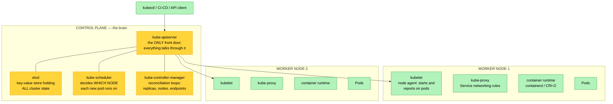
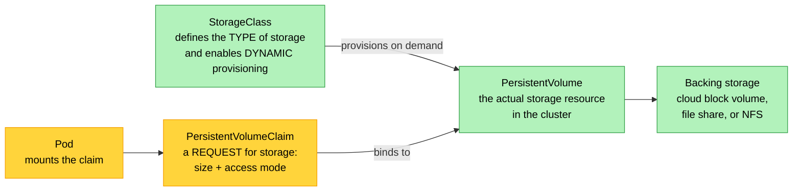
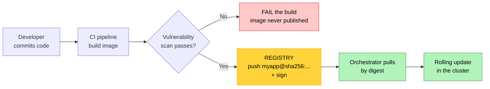

# Objective 1.6 — Compare and contrast containerization concepts

> **Domain 1.0 — Cloud Architecture (23% of exam)** · Exam CV0-004 V4 · Objectives doc v5.0
> **Status:** Exam-ready · **Version:** 2.0 (enhanced) · Supersedes `full notes/Objective-1.6-Containerization.md`

---

## 0. How to use this note

| Pass | What to read | Time |
|---|---|---|
| **1st (learn)** | Sections 1 → 9 in order | ~80 min |
| **2nd (drill)** | Section 2.1 (containers vs VMs) + 5.4 (Service types) + 6.1 (storage lifecycle) | ~25 min |
| **3rd (test)** | Section 12 (practice) + Section 13 (PBQ drills) | ~35 min |
| **Exam eve** | Section 14 (60-second recall sheet) only | ~6 min |

> 📌 **The one comparison you cannot skip is containers vs virtual machines (Section 2.1).** CompTIA tests it constantly here *and* in 1.7, and it is the source of the most common wrong answer on this objective (isolation strength).

---

## 1. Official objective coverage

> **1.6 Compare and contrast containerization concepts.**
> - Stand-alone
> - Workload orchestration
> - **Networking**
>   - Port mapping
> - **Storage types**
>   - Persistent volumes
>   - Ephemeral storage
> - Image registries

### 1.1 What the verb tells you

**"Compare and contrast"** — the same verb as 1.4 and 1.7. Questions are built from the **contrast tables**, not the definitions:

- stand-alone **vs** orchestrated
- container **vs** virtual machine
- persistent **vs** ephemeral storage
- public **vs** private registry
- image **vs** container

Study Section 9 as primary material.

### 1.2 Coverage checklist

- [ ] I can state the **structural** difference between a container and a VM (shared kernel vs own guest OS)
- [ ] I know which offers **stronger isolation** and why — and it is not the container
- [ ] I can distinguish an **image** (immutable template) from a **container** (running instance + writable layer)
- [ ] I know what a stand-alone container **cannot** do
- [ ] I can name what orchestration adds: scheduling, self-healing, scaling, rolling updates, discovery
- [ ] I can label the Kubernetes control plane and node components
- [ ] I can read `-p 8080:80` and say which side is the host
- [ ] I know the four Service types and when each is used
- [ ] I know **ephemeral** storage dies with the pod and **persistent** volumes do not
- [ ] I know the access modes **RWO / ROX / RWX / RWOP** and which storage backs each
- [ ] I know why a **tag** is not a reliable identifier and a **digest** is
- [ ] I know why **secrets must never be baked into an image**
- [ ] I can distinguish **liveness** from **readiness** probes
- [ ] I know what **requests** vs **limits** do, and what **OOMKilled** means

---

## 2. The core mental model

### 2.1 ★ Containers vs virtual machines — the master comparison

```text
   VIRTUAL MACHINES                          CONTAINERS
   ┌──────┐┌──────┐┌──────┐                 ┌──────┐┌──────┐┌──────┐
   │ App A││ App B││ App C│                 │ App A││ App B││ App C│
   ├──────┤├──────┤├──────┤                 ├──────┤├──────┤├──────┤
   │ Bins/││ Bins/││ Bins/│                 │ Bins/││ Bins/││ Bins/│
   │ Libs ││ Libs ││ Libs │                 │ Libs ││ Libs ││ Libs │
   ├══════┤├══════┤├══════┤ ← ★ THE         └──────┘└──────┘└──────┘
   │GUEST ││GUEST ││GUEST │   DIFFERENCE    ┌────────────────────────┐
   │  OS  ││  OS  ││  OS  │   each VM       │  CONTAINER RUNTIME     │
   │+KERNEL│+KERNEL│+KERNEL│  has its own   │  (containerd / CRI-O)  │
   └──────┘└──────┘└──────┘   FULL OS       └────────────────────────┘
   ┌────────────────────────┐               ┌────────────────────────┐
   │      HYPERVISOR        │               │  HOST OS + ONE SHARED  │
   └────────────────────────┘               │       KERNEL           │
   ┌────────────────────────┐               └────────────────────────┘
   │   PHYSICAL HARDWARE    │               ┌────────────────────────┐
   └────────────────────────┘               │   PHYSICAL HARDWARE    │
                                            └────────────────────────┘
   Size:      GBs                           Size:      MBs
   Boot:      30s – minutes                 Boot:      MILLISECONDS
   Density:   tens per host                 Density:   hundreds per host
   Isolation: STRONGER (hardware-level)     Isolation: WEAKER (process-level)
   Guest OS:  ANY (Windows on Linux host)   Guest OS:  must match HOST KERNEL
```

| Attribute | **Virtual machine** | **Container** |
|---|---|---|
| Virtualises | **Hardware** | **The operating system** |
| Contains | Full guest OS **including its own kernel** | App + dependencies only — **shares the host kernel** |
| Size | Gigabytes | **Megabytes** |
| Start time | Seconds to minutes | **Milliseconds to seconds** |
| Density per host | Tens | **Hundreds** |
| **Isolation** | **Stronger** — hypervisor-enforced hardware boundary | **Weaker** — process isolation via kernel features |
| Attack surface | Escape requires a hypervisor exploit | **A kernel vulnerability can allow container escape** |
| OS flexibility | Run any guest OS on any host | **Must be compatible with the host kernel** |
| Portability | Large images, hypervisor-specific formats | **Highly portable** — same image runs anywhere |
| Overhead | High (full OS per instance) | **Minimal** |
| Best for | Legacy apps, full OS control, **hard multi-tenant isolation**, mixed OS | Microservices, CI/CD, elastic scaling, dense packing |

> ⚠️ **The most common wrong answer on this objective:** "containers provide better isolation than VMs." They do **not**. Containers are isolated *processes* sharing one kernel; VMs are isolated *machines*. When a scenario demands **hard isolation between untrusted tenants**, the answer is a **VM** (or a VM-isolated container runtime), not a plain container.

**What actually makes a container:** three Linux kernel features, not magic —

| Feature | Provides |
|---|---|
| **Namespaces** (pid, net, mnt, uts, ipc, user) | **What the process can SEE** — its own process tree, network stack, filesystem view, hostname |
| **cgroups** (control groups) | **What the process can USE** — CPU, memory, I/O limits |
| **Union/overlay filesystem** | **Layered images** with a thin copy-on-write writable layer per container |

### 2.2 Image vs container — and layers

```text
   IMAGE (immutable, read-only, shareable)      CONTAINER (running instance)

   ┌─────────────────────────────┐              ┌─────────────────────────────┐
   │ Layer 4:  COPY ./app        │              │ ★ WRITABLE LAYER (thin)     │
   ├─────────────────────────────┤              │   copy-on-write · EPHEMERAL │
   │ Layer 3:  RUN pip install   │              │   DELETED when the          │
   ├─────────────────────────────┤   docker run │   container is removed      │
   │ Layer 2:  RUN apt-get ...   │  ──────────► ├═════════════════════════════┤
   ├─────────────────────────────┤              │ Layers 1-4 (read-only,      │
   │ Layer 1:  FROM python:3.12  │              │ shared with every other     │
   └─────────────────────────────┘              │ container from this image)  │
        BASE IMAGE                              └─────────────────────────────┘

   ✓ Layers are CACHED and DEDUPLICATED — 50 containers from one image
     store the read-only layers ONCE.
   ✓ Changing a late layer only rebuilds from that layer down → put
     rarely-changing instructions (dependencies) EARLY in the Dockerfile
     and frequently-changing ones (your code) LAST.
   ✗ A layer is permanent history: deleting a secret in a LATER layer does
     NOT remove it from the earlier layer. Anyone who pulls the image can
     extract it. NEVER bake secrets into images.
```

| | **Image** | **Container** |
|---|---|---|
| State | **Immutable**, read-only | Running instance with a writable layer |
| Analogy | A class / a program on disk | An object / a running process |
| Built from | A Dockerfile / build spec | An image, by the runtime |
| Stored in | A **registry** | On the host running it |
| Count | One image → **many** containers | Each has its own writable layer |

### 2.3 The runtime stack and standards

| Component | Role |
|---|---|
| **OCI (Open Container Initiative)** | The standards for **image format** and **runtime** that make images portable across tools |
| **runc** | Low-level runtime that actually creates the namespaces/cgroups |
| **containerd** | High-level runtime — pulls images, manages container lifecycle |
| **CRI-O** | A lightweight runtime built specifically for Kubernetes' CRI |
| **Docker Engine** | containerd + a CLI + image building + networking, bundled |
| **Podman** | Daemonless, rootless-friendly alternative to Docker |

> 💡 "Docker" is a *product*; "container" is the *technology*. Kubernetes runs any CRI-compatible runtime — it does not require Docker.

---

## 3. Stand-alone containers

| | |
|---|---|
| **Definition** | A single container run directly on one host by a container runtime, started and stopped **manually**, with no cluster, no scheduler, and no controller watching it. |
| **How** | `docker run -d -p 8080:80 --name web nginx:1.27` |
| **Strengths** | Simplest possible model; instant start; perfect environment parity between a laptop and a server; no cluster to install or operate; ideal for learning, development, CI build steps, and single-purpose utilities |
| **★ Limitations** | **No self-healing** — if it crashes it stays down. **No automatic scaling.** **No rolling updates or rollback** — you stop and start by hand, causing downtime. **No built-in service discovery or load balancing.** **Bound to one host** — if the host dies, so does the workload. No declarative desired state. |
| **Use when** | Development and testing, a single non-critical tool, a CI job, a one-off batch task, learning |
| **Do NOT use when** | Production availability, scaling, or zero-downtime deployment is required |
| **Exam triggers** | "developer runs it locally", "single host", "`docker run`", "manually started", "no orchestration", "dev/test only" |

**Container lifecycle:** `created → running → paused → stopped → removed`. Removing the container **destroys its writable layer** — any data written inside it that was not on a volume is gone.

> ⚠️ **The exam's stand-alone trap:** a scenario describing production high availability, auto-scaling, or zero-downtime updates can never be answered with a stand-alone container. Its defining limitation is that **nothing is watching it**.

---

## 4. Workload orchestration

| | |
|---|---|
| **Definition** | Automated management of containerised workloads **across a cluster of hosts**, driven by a **declarative desired state** that a control plane continuously reconciles against actual state. |
| **Problem it solves** | Every limitation of stand-alone containers: no healing, no scaling, no scheduling, no rolling updates, no discovery, single-host binding. |
| **What it provides** | **Scheduling** (place pods on suitable nodes) · **Self-healing** (restart failed containers, reschedule off dead nodes) · **Horizontal scaling** (manual and automatic) · **Rolling updates and rollback** · **Service discovery and load balancing** · **Config and secret management** · **Storage orchestration** · **Resource management** |
| **★ Costs** | Significant **operational complexity** — a control plane to run and upgrade, networking (CNI) and storage (CSI) plugins, RBAC, monitoring. A steep learning curve. Managed offerings (EKS/AKS/GKE) reduce but do not remove this. |
| **Exam triggers** | "desired state", "3 replicas", "automatically restart failed containers", "reschedule to a healthy node", "rolling update", "across many hosts", "production microservices" |

### 4.1 The declarative reconciliation loop — the core idea

```text
   YOU DECLARE:  "I want 3 replicas of web:v2"
                              │
                              ▼
              ┌───────────────────────────────┐
              │  CONTROL PLANE compares       │
              │  DESIRED state ◄──► ACTUAL    │◄────────┐
              └──────────────┬────────────────┘         │
                             │ they differ?             │ continuously,
                             ▼                          │ forever
              ┌───────────────────────────────┐         │
              │  TAKE ACTION to converge:     │         │
              │  start / stop / reschedule    │─────────┘
              └───────────────────────────────┘

   Node dies with 1 replica → actual=2, desired=3 → schedule a replacement.
   You never tell it HOW. You declare WHAT. This is why it self-heals.
```

### 4.2 Kubernetes architecture



| Component | Plane | Responsibility |
|---|---|---|
| **kube-apiserver** | Control | The **only** entry point; validates and persists every change |
| **etcd** | Control | Distributed key-value store holding **all** cluster state — **back this up** |
| **kube-scheduler** | Control | Chooses which node a new pod runs on (resources, affinity, taints) |
| **kube-controller-manager** | Control | Runs the reconciliation loops that make desired state real |
| **cloud-controller-manager** | Control | Integrates with the cloud provider (load balancers, volumes, nodes) |
| **kubelet** | Node | Agent on each node; starts pods and reports health to the API server |
| **kube-proxy** | Node | Programs the network rules that make Services work |
| **Container runtime** | Node | Actually runs the containers |

> ⚠️ **etcd is the single most critical component to protect.** It holds all cluster state; losing it loses the cluster. Expect a question about backing it up or about it being the control plane's data store.

### 4.3 Kubernetes objects you must recognise

| Object | Purpose |
|---|---|
| **Pod** | **The smallest deployable unit.** One or more containers that share a network namespace (**same IP, reach each other on `localhost`**) and storage volumes |
| **ReplicaSet** | Maintains a specified number of identical pod replicas |
| **Deployment** | Manages ReplicaSets to provide **rolling updates and rollback** — the standard way to run stateless apps |
| **StatefulSet** | For **stateful** apps: stable network identity, ordered start/stop, **its own persistent volume per pod** (databases) |
| **DaemonSet** | Runs **one pod on every node** — log collectors, monitoring agents, CNI plugins |
| **Job / CronJob** | Run-to-completion tasks / scheduled tasks |
| **Service** | Stable virtual IP and DNS name in front of a changing set of pods — **this is service discovery** (see 1.5) |
| **Ingress** | L7 HTTP/HTTPS routing into the cluster (needs an ingress controller) |
| **ConfigMap** | Non-sensitive configuration injected as env vars or files |
| **Secret** | Sensitive values — **base64-encoded, not encrypted by default**; secure with encryption at rest and RBAC |
| **Namespace** | Logical partition of a cluster for multi-tenancy, quotas, and RBAC scoping |
| **PV / PVC / StorageClass** | Persistent storage (see Section 6) |

> 💡 **Sidecar pattern:** because containers in a pod share the network namespace and volumes, a second container can add capability without changing the app — a log shipper, or a **service mesh proxy** handling mTLS and retries (see 1.5).

### 4.4 Health probes — how orchestration knows what's healthy

| Probe | Question it answers | On failure |
|---|---|---|
| **Liveness** | "Is this container **alive**, or wedged?" | **Restart the container** |
| **Readiness** | "Can it **accept traffic** right now?" | **Remove it from the Service endpoints** (do **not** restart) |
| **Startup** | "Has a slow-starting app finished booting?" | Delays the other probes so a slow start isn't mistaken for failure |

> ★ **The distinction that gets tested:** a container that is running but temporarily busy (warming a cache, reconnecting to a database) should fail its **readiness** probe so traffic is diverted — restarting it would make things worse. Only a genuinely stuck container should fail **liveness**.

### 4.5 Resource requests and limits

| | **Request** | **Limit** |
|---|---|---|
| Meaning | The amount **guaranteed**; used by the **scheduler** to place the pod | The **hard ceiling** the container may consume |
| Exceeding CPU | Can burst above the request if the node has spare | **Throttled** — slowed, not killed |
| Exceeding memory | Can use more if available | **OOMKilled** — the container is terminated |

**Common failure signatures:** a pod stuck in `Pending` usually means **no node has enough free resources to satisfy its requests**. A pod repeatedly restarting with `OOMKilled` means its **memory limit is too low** (or it leaks). `CrashLoopBackOff` means it keeps failing on start.

### 4.6 Orchestration platforms

| Platform | Notes |
|---|---|
| **Kubernetes** | The de facto standard; portable across clouds and on-prem |
| **Managed Kubernetes** | EKS (AWS), AKS (Azure), GKE (Google) — provider runs the control plane |
| **Serverless containers** | **Fargate**, **Cloud Run**, **Container Apps** — no nodes to manage at all (CaaS, see 1.1) |
| **Amazon ECS** | AWS-native, simpler than Kubernetes, AWS-only |
| **Docker Swarm** | Simple, built into Docker; largely superseded |
| **Helm** | The **package manager** for Kubernetes — templated, versioned, repeatable app installs ("charts") |

---

## 5. Networking and port mapping

### 5.1 The container networking problem

Each container gets its **own network namespace** — its own interfaces, IP, and port space. That isolation means container port 80 is *not* the host's port 80, and two containers can both listen on 80 without conflict. **Port mapping** is the bridge between the two.

### 5.2 ★ Port mapping

```text
   docker run -p 8080:80 nginx
                 │    │
                 │    └──── CONTAINER port (inside — where the app listens)
                 └───────── HOST port (outside — what clients connect to)

              ┌──────────────── HOST (10.0.1.5) ────────────────┐
   Client ───►│  port 8080  ──────────────┐                     │
   hits       │                            │ forwarded (NAT)    │
   10.0.1.5   │              ┌─────────────▼──────────────┐     │
   :8080      │              │ CONTAINER  172.17.0.2      │     │
              │              │   nginx listening on :80   │     │
              │              └────────────────────────────┘     │
              └─────────────────────────────────────────────────┘

   TWO containers, same internal port, different host ports:
      -p 8081:80  → container A
      -p 8082:80  → container B      ✓ no conflict
   Two containers on the SAME host port → ✗ "port is already allocated"
```

**Read it as `HOST:CONTAINER` — outside first, inside second.** Reversing them is a standard exam distractor.

### 5.3 Container network modes (single host)

| Mode | Behaviour | Port mapping needed? |
|---|---|---|
| **Bridge** (default) | Private virtual network on the host; containers get internal IPs and reach outside via NAT | **Yes** — to be reachable externally |
| **Host** | Container shares the **host's** network namespace directly | **No** — it binds the host port directly, but **loses network isolation** and can conflict with host ports |
| **None** | No networking at all | N/A — fully isolated |
| **Overlay** | Virtual network **spanning multiple hosts** (VXLAN encapsulation) — enables multi-host clusters | Handled by the orchestrator |
| **Macvlan** | Container gets its own MAC/IP directly on the physical LAN | No |

> 💡 **Overlay networks connect back to 1.3 and 1.7.** Multi-host container networking uses **VXLAN** encapsulation — the same 24-bit overlay technology that replaced VLANs at cloud scale.

### 5.4 Kubernetes networking

**The Kubernetes network model:** every pod gets its own IP, and **every pod can reach every other pod directly without NAT** — a flat network implemented by a **CNI** plugin (Calico, Cilium, Flannel, the cloud provider's VPC CNI). Because pod IPs change constantly, you never address a pod directly — you address a **Service**.

```text
   EXPOSURE LADDER — least to most exposed

   ┌──────────────────────────────────────────────────────────────────┐
   │ ClusterIP (DEFAULT)      internal virtual IP + DNS name          │
   │                          reachable ONLY inside the cluster       │
   │                          → service-to-service calls              │
   ├──────────────────────────────────────────────────────────────────┤
   │ NodePort                 opens the SAME high port (30000-32767)  │
   │                          on EVERY node's IP                      │
   │                          → dev/test, or behind an external LB    │
   ├──────────────────────────────────────────────────────────────────┤
   │ LoadBalancer             provisions a CLOUD load balancer with   │
   │                          an external IP → production L4 exposure │
   │                          one LB per Service — costly at scale    │
   ├──────────────────────────────────────────────────────────────────┤
   │ Ingress (+ controller)   ONE entry point, L7 HTTP routing by     │
   │                          host and path, TLS termination          │
   │                          → many services behind ONE load balancer│
   └──────────────────────────────────────────────────────────────────┘
   (ExternalName — maps a Service name to an external DNS CNAME)
```

| Type | Scope | Layer | Use when |
|---|---|---|---|
| **ClusterIP** | Internal only | L4 | Service-to-service communication (the default) |
| **NodePort** | Every node's IP | L4 | Dev/test, or as a target for an external load balancer |
| **LoadBalancer** | Internet | L4 | Production exposure of a single service |
| **Ingress** | Internet | **L7** | **Many** services behind one LB, with path/host routing and TLS |

> ★ **The cost argument that makes Ingress the usual answer:** each `LoadBalancer` Service provisions its own cloud load balancer. Twenty services means twenty load balancers and twenty bills. **One Ingress** fronts them all with path-based routing (`/api` → service A, `/shop` → service B) — the same L7 logic as an ALB in 1.3.

**DNS:** CoreDNS gives every Service a stable name — `service.namespace.svc.cluster.local` — which is Kubernetes' built-in **service discovery** (1.5).

---

## 6. Storage types

### 6.1 ★ Ephemeral vs persistent — the lifecycle difference

```text
   EPHEMERAL STORAGE                      PERSISTENT VOLUME
   ┌───────────────────┐                  ┌───────────────────┐
   │  Pod  (v1)        │                  │  Pod  (v1)        │
   │  ┌─────────────┐  │                  │        │ mounts   │
   │  │ writable    │  │                  └────────┼──────────┘
   │  │ layer /     │  │                           ▼
   │  │ emptyDir    │  │                  ╔═══════════════════╗
   │  └─────────────┘  │                  ║  PERSISTENT       ║
   └───────────────────┘                  ║  VOLUME           ║
            │ pod deleted                 ║  (independent     ║
            ▼                             ║   lifecycle)      ║
      ✗ DATA GONE                         ╚═══════════════════╝
                                                   ▲
   ┌───────────────────┐                  ┌────────┼──────────┐
   │  Pod  (v2, new)   │                  │  Pod  (v2, new)   │
   │  ┌─────────────┐  │                  │        │ re-mounts│
   │  │ EMPTY again │  │                  └───────────────────┘
   │  └─────────────┘  │                     ✓ DATA STILL THERE
   └───────────────────┘
```

| | **Ephemeral storage** | **Persistent volume** |
|---|---|---|
| Lifecycle | **Tied to the container/pod** | **Independent** of any pod |
| Survives pod restart/reschedule | ❌ **No** | ✅ **Yes** |
| Examples | Container writable layer, `emptyDir`, tmpfs, local scratch | Network block volume, network file share, cloud disk |
| Shareable between pods | Only within the same pod | ✅ Yes (with the right access mode) |
| Performance | Fastest (local) | Network-attached, slightly slower |
| Cost | Effectively free | Charged per GB |
| Use for | Caches, scratch, temp files, build artefacts, logs being shipped out | **Databases, user uploads, message queues, anything that matters** |

> ⚠️ **The classic data-loss scenario:** running a database in a Deployment with no persistent volume. It works — until the pod is rescheduled, and every record is gone. Databases need a **StatefulSet with a PersistentVolumeClaim**.

### 6.2 How persistent storage is wired up



| Object | Role |
|---|---|
| **PersistentVolume (PV)** | The actual storage resource available in the cluster |
| **PersistentVolumeClaim (PVC)** | A pod's **request** for storage — "I need 20 GB, ReadWriteOnce" |
| **StorageClass** | Defines a *class* of storage (SSD, HDD, replication) and enables **dynamic provisioning** so a PV is created automatically when a PVC is made |
| **Reclaim policy** | What happens to the PV when the PVC is deleted — **Retain** (keep the data, manual cleanup) or **Delete** (destroy it). **Retain for anything you care about.** |

### 6.3 Access modes

| Mode | Meaning | Typical backing |
|---|---|---|
| **RWO** — ReadWriteOnce | Read-write by **one node** (multiple pods on that node can share it) | **Block storage** (cloud disk) |
| **ROX** — ReadOnlyMany | Read-only by **many nodes** | Shared file storage, static assets |
| **RWX** — ReadWriteMany | **Read-write by many nodes** | **File storage** (NFS/SMB) |
| **RWOP** — ReadWriteOncePod | Read-write by **exactly one pod** | Block storage, strict single-writer |

> ★ **Ties straight back to 1.4:** **block storage cannot do RWX.** If multiple pods across different nodes must write the same data simultaneously, you need **file storage**. This pairing is tested in both objectives.

---

## 7. Image registries

| | |
|---|---|
| **Definition** | A service that **stores, versions, and distributes** container images. Builders **push**; runtimes and orchestrators **pull**. |
| **Structure** | **Registry** → **repository** (e.g. `myapp`) → **tags** (`v1.2`, `latest`) and **digests** (`sha256:…`). Images are stored as **deduplicated layers**, so pulling an image you partly have only fetches the missing layers. |
| **Why it matters** | The registry is the **single source of truth** for what runs in production, the integration point for CI/CD, and the natural place to enforce **vulnerability scanning**, **signing**, and access control |
| **Exam triggers** | "push and pull images", "central store", "version images", "scan images before deployment", "private registry", "pull from CI/CD" |

### 7.1 ★ Tags vs digests

```text
   TAG:     myapp:v1.2         MUTABLE — a pointer that can be moved
                               to a different image at any time
   DIGEST:  myapp@sha256:a3f9… IMMUTABLE — cryptographically identifies
                               exactly one image, forever

   ⚠  ":latest" is NOT "the newest version". It is just the DEFAULT tag
      name. Deploying :latest means two nodes pulling at different times
      can run DIFFERENT code, and rollback becomes guesswork.

   → Production practice: deploy by DIGEST, or by an immutable version
     tag that is never reused.
```

### 7.2 Public vs private registries

| | **Public registry** | **Private registry** |
|---|---|---|
| Access | Anyone | Authenticated, IAM-controlled |
| Contents | Official and community base images | Your proprietary application images |
| Risks | **Unvetted/malicious images**, typosquatted names, **pull rate limits**, upstream changes | You operate/pay for it |
| Cost | Free tier, limited | Storage + transfer |
| Examples | Docker Hub, public mirrors | ECR, ACR, Artifact Registry, Harbor, Nexus, GitLab Registry |

> ⚠️ **A production build that pulls a public base image on every CI run will eventually hit a rate limit or a changed upstream image.** The standard remedy is a **private registry or pull-through cache** holding vetted, scanned base images.

### 7.3 Registry capabilities worth knowing

| Feature | What it does |
|---|---|
| **Vulnerability scanning** | Scans layers for known CVEs on push and continuously (see 4.1) |
| **Image signing** | Cryptographic provenance so only trusted images are deployed |
| **Admission control** | Cluster policy rejecting unsigned, unscanned, or non-compliant images |
| **Lifecycle policies** | Auto-expire old/untagged images so storage doesn't grow forever |
| **Immutable tags** | Prevent a tag from being overwritten — makes deployments reproducible |
| **Replication** | Copy images to other regions to reduce pull latency and survive outages |

### 7.4 The CI/CD flow



---

## 8. Container security and adjacent concepts

| Practice | Why |
|---|---|
| **Don't run as root** | A root process that escapes the container is root on the host. Run as a non-root user |
| **Avoid `--privileged`** | Privileged containers disable most isolation — effectively host access |
| **Read-only root filesystem** | Prevents an attacker from writing tools into the container |
| **Drop capabilities** | Grant only the Linux capabilities actually needed |
| **Minimal base images** | Alpine/distroless have fewer packages → **far fewer CVEs** and a smaller attack surface |
| **★ Never bake secrets into images** | Layers are permanent history — a secret deleted in a later layer is still extractable from the earlier one. Use secret stores or injected env vars |
| **Scan images continuously** | A base image that was clean at build time acquires CVEs over time |
| **Pin by digest** | Guarantees the exact image you tested is the one that runs |
| **Resource limits** | Prevents one container starving the node (the container-level noisy-neighbour fix) |
| **Namespace + RBAC segmentation** | Limits blast radius in a multi-tenant cluster |

**Adjacent terms:**

| Term | Meaning |
|---|---|
| **CaaS** | Containers as a Service — provider runs the orchestration (see 1.1) |
| **Serverless containers** | Fargate / Cloud Run / Container Apps — no nodes to manage |
| **Service mesh** | Sidecar proxies providing mTLS, retries, and telemetry between services (see 1.5) |
| **Helm** | Kubernetes package manager — versioned, templated application charts |
| **Operator** | Custom controller that automates managing a complex stateful app |
| **Init container** | Runs to completion before app containers start (migrations, setup) |
| **Taints / tolerations / affinity** | Rules controlling which pods may be scheduled on which nodes |
| **HPA / Cluster Autoscaler** | Scales **pods** by metrics / scales **nodes** when pods can't be placed |

---

## 9. Comparison tables

### 9.1 Stand-alone vs orchestrated

| Aspect | **Stand-alone** | **Orchestrated** |
|---|---|---|
| Management | Manual commands | **Declarative desired state** |
| Hosts | One | **A cluster** |
| Self-healing | ❌ **None** | ✅ Restart and reschedule |
| Scaling | Manual only | ✅ Automatic, horizontal |
| Updates | Stop/start → **downtime** | ✅ **Rolling update + rollback** |
| Service discovery | Manual IPs/ports | ✅ Built-in DNS |
| Load balancing | External/manual | ✅ Built-in |
| Config/secrets | Env vars, files | ✅ ConfigMaps and Secrets |
| Complexity | **Very low** | **High** |
| Best for | Dev/test, single tools, CI steps | **Production microservices** |

### 9.2 Container vs VM

See Section 2.1 — the single most-tested table in this objective.

### 9.3 Ephemeral vs persistent storage

| Aspect | **Ephemeral** | **Persistent** |
|---|---|---|
| Survives pod deletion | ❌ | ✅ |
| Independent lifecycle | ❌ | ✅ |
| Shareable across pods | ❌ (pod-local) | ✅ with RWX |
| Backed by | Node local disk / memory | Cloud block or file storage |
| Cost | Negligible | Per GB |
| Kubernetes object | `emptyDir`, writable layer | **PV / PVC** |
| Workload | Cache, scratch, temp | **Database, uploads, state** |
| Controller | Deployment is fine | **StatefulSet** for per-pod identity |

### 9.4 Kubernetes Service types

| | **ClusterIP** | **NodePort** | **LoadBalancer** | **Ingress** |
|---|---|---|---|---|
| Reachable from | Inside cluster only | Any node IP + high port | Internet | Internet |
| Layer | L4 | L4 | L4 | **L7** |
| Cloud LB provisioned | ❌ | ❌ | ✅ **one per Service** | ✅ one for **many** services |
| Path/host routing | ❌ | ❌ | ❌ | ✅ |
| TLS termination | ❌ | ❌ | Limited | ✅ |
| Typical use | Service-to-service | Dev/test | Single production service | **Many HTTP services (cost-efficient)** |

### 9.5 Deployment controllers

| Controller | Use for | Key property |
|---|---|---|
| **Deployment** | Stateless apps | Rolling updates, rollback, interchangeable pods |
| **StatefulSet** | Databases, clustered stateful apps | **Stable identity, ordered ops, own PVC per pod** |
| **DaemonSet** | Node-level agents | **One pod per node** |
| **Job / CronJob** | Batch / scheduled work | Runs to completion |

### 9.6 Multi-cloud mapping

| Concept | AWS | Azure | Google Cloud |
|---|---|---|---|
| Managed Kubernetes | **EKS** | **AKS** | **GKE** |
| Proprietary orchestrator | ECS | — | — |
| Serverless containers | **Fargate**, App Runner | **Container Apps**, Container Instances | **Cloud Run** |
| Private registry | **ECR** | **ACR** | **Artifact Registry** |
| Persistent block volume | EBS (RWO) | Azure Disk (RWO) | Persistent Disk (RWO) |
| Shared file volume | **EFS (RWX)** | **Azure Files (RWX)** | **Filestore (RWX)** |
| Image scanning | ECR scanning / Inspector | Defender for Containers | Artifact Analysis |
| Ingress/L7 | ALB Ingress Controller | Application Gateway Ingress | GKE Ingress / Cloud LB |

---

## 10. Exam traps & distractor patterns

| # | Trap | The truth |
|---|---|---|
| 1 | "Containers isolate better than VMs" | **VMs isolate better.** Containers share the host kernel; a kernel exploit can allow escape. Hard multi-tenant isolation → **VM** |
| 2 | "Containers contain a full operating system" | They contain the app and its dependencies and **share the host kernel** — that is why they are MBs, not GBs |
| 3 | "You can run a Windows container on a Linux host natively" | The container must be compatible with the **host kernel**. Cross-OS requires a VM underneath |
| 4 | "Data written inside a container is safe" | It lives in the **ephemeral writable layer** and dies with the container. Use a volume |
| 5 | "A Deployment is fine for a database" | Databases need a **StatefulSet + PVC** for stable identity and persistent per-pod storage |
| 6 | "`-p 80:8080` exposes container port 80" | It is **`HOST:CONTAINER`** — that maps host **80** to container **8080** |
| 7 | "Stand-alone containers restart automatically" | Nothing is watching them. **No self-healing without orchestration** |
| 8 | "`:latest` is the newest version" | It is just the default **tag name**, and it is mutable. Pin a **digest** or an immutable tag |
| 9 | "A failing readiness probe restarts the pod" | **Readiness** removes it from Service endpoints. **Liveness** restarts it |
| 10 | "Block storage supports ReadWriteMany" | Block is **RWO**. RWX needs **file storage** — the same rule as 1.4 |
| 11 | "Kubernetes Secrets are encrypted" | They are **base64-encoded** by default. Enable encryption at rest and restrict with RBAC |
| 12 | "Deleting a secret in a later image layer removes it" | Layers are permanent history — it is still extractable. **Never bake secrets into images** |
| 13 | "Use a LoadBalancer Service for each of our 20 services" | That provisions **20 cloud load balancers**. Use **one Ingress** with path/host routing |
| 14 | "Exceeding the CPU limit kills the container" | CPU over-limit is **throttled**; **memory** over-limit is **OOMKilled** |
| 15 | "A pod stuck in Pending means the image is broken" | Usually **no node has enough resources** to satisfy its requests (image problems show as `ImagePullBackOff`) |
| 16 | "Kubernetes requires Docker" | It requires any **CRI-compatible runtime** — containerd, CRI-O, etc. |
| 17 | "Orchestration removes operational complexity" | It **adds** control-plane, networking, storage, and RBAC complexity — in exchange for automation |
| 18 | "Containers in a pod need Services to talk to each other" | They **share a network namespace** — they reach each other on `localhost` |
| 19 | "Public base images are safe because they're popular" | They can be **outdated, typosquatted, or malicious**. Scan, and prefer vetted private copies |

**Disambiguation drill:**

| Pair | The deciding question |
|---|---|
| **Container vs VM** | Does it need its **own kernel/OS**, or hard isolation? → VM |
| **Stand-alone vs orchestrated** | Does anything need to **heal, scale, or update without downtime**? → orchestration |
| **Ephemeral vs persistent** | If the pod is deleted, **must the data survive**? |
| **Deployment vs StatefulSet** | Does each replica need a **stable identity and its own volume**? → StatefulSet |
| **Liveness vs readiness** | **Restart it** (liveness) or **stop sending traffic** (readiness)? |
| **LoadBalancer vs Ingress** | One service (LB) or **many HTTP services behind one entry point** (Ingress)? |
| **Tag vs digest** | Do you need **reproducibility**? → digest |
| **Request vs limit** | Scheduling guarantee (request) vs hard cap (limit) |

---

## 11. Keyword → answer trigger table

| If you see… | Think |
|---|---|
| `docker run` · single host · developer laptop · manually started · no orchestration | **Stand-alone container** |
| desired state · 3 replicas · restart failed containers · reschedule to healthy node · rolling update | **Workload orchestration** |
| smallest deployable unit · containers sharing an IP and localhost | **Pod** |
| one pod on every node · log collector · monitoring agent | **DaemonSet** |
| stable identity · ordered startup · own volume per replica · database | **StatefulSet** |
| `-p 8080:80` · expose the container to the host | **Port mapping (HOST:CONTAINER)** |
| internal-only service-to-service | **ClusterIP** |
| same high port on every node · dev/test exposure | **NodePort** |
| one cloud load balancer for one service | **LoadBalancer** |
| many HTTP services, path/host routing, one entry point, TLS | **Ingress** |
| multi-host container network · VXLAN encapsulation | **Overlay network** |
| cache · scratch · temp files · lost when pod dies | **Ephemeral storage** |
| database · uploads · must survive pod restart | **Persistent volume (PVC)** |
| many pods on different nodes writing the same files | **RWX → file storage** |
| storage created automatically when a claim is made | **StorageClass / dynamic provisioning** |
| keep the data after the claim is deleted | **Reclaim policy: Retain** |
| push and pull images · version · scan before deploy | **Image registry** |
| reproducible deployment, exact same image every time | **Pin by digest, not `:latest`** |
| restart the stuck container | **Liveness probe** |
| stop sending traffic while it warms up | **Readiness probe** |
| pod killed for using too much memory | **OOMKilled → memory limit** |
| pod stuck in Pending | **Insufficient node resources for its requests** |
| untrusted multi-tenant workloads needing hard isolation | **VM, not a plain container** |
| templated, versioned Kubernetes app install | **Helm chart** |

---

## 12. Practice questions

<details>
<summary><b>Q1.</b> What is the PRIMARY structural difference between a container and a virtual machine?</summary>

A. Containers include a full guest operating system · **B. Containers share the host's kernel, while each VM runs its own guest OS and kernel on a hypervisor** · C. VMs are always smaller than containers · D. Containers cannot be isolated

**Correct: B.** Sharing the host kernel is what makes containers megabytes rather than gigabytes and lets them start in milliseconds.
- **A wrong:** That describes a VM.
- **C wrong:** VMs are substantially larger.
- **D wrong:** Containers are isolated by namespaces and cgroups — just less strongly than VMs.
</details>

<details>
<summary><b>Q2.</b> A hosting provider must run untrusted customer workloads with the strongest possible isolation between tenants. What should it use?</summary>

A. Standard containers on a shared host · **B. Virtual machines (or VM-isolated container runtimes)** · C. Containers with port mapping · D. A single container per customer with a read-only filesystem

**Correct: B.** VMs enforce a hardware-level boundary via the hypervisor; containers share one kernel, so a kernel vulnerability can permit escape between tenants.
- **A/C/D wrong:** All still share the host kernel. Hardening reduces risk but does not provide VM-grade isolation.
</details>

<details>
<summary><b>Q3.</b> A container is started with <code>docker run -p 8080:80 nginx</code>. How is it reached?</summary>

A. Connect to the container IP on port 8080 · **B. Connect to the host's IP on port 8080, which forwards to container port 80** · C. Connect to the host on port 80 · D. It is not externally reachable

**Correct: B.** The syntax is `HOST:CONTAINER` — clients hit the host on 8080 and traffic is forwarded to port 80 inside.
- **A wrong:** The container listens on 80, not 8080.
- **C wrong:** Host port 80 was not mapped.
- **D wrong:** Port mapping is exactly what makes it reachable.
</details>

<details>
<summary><b>Q4.</b> A team runs PostgreSQL as a Kubernetes Deployment with no volume configured. What will happen?</summary>

A. Data is automatically replicated across pods · **B. All data is lost whenever the pod is deleted or rescheduled, because the writable layer is ephemeral** · C. Kubernetes creates a persistent volume automatically · D. The pod will fail to start

**Correct: B.** Without a persistent volume, data lives in the pod's ephemeral writable layer and dies with it. A database needs a **StatefulSet with a PersistentVolumeClaim**.
- **A wrong:** Kubernetes does not replicate application data.
- **C wrong:** Persistent storage must be requested explicitly.
- **D wrong:** It starts fine — which is what makes this failure so common.
</details>

<details>
<summary><b>Q5.</b> Which capability does workload orchestration provide that a stand-alone container does NOT?</summary>

A. Process isolation · B. A layered filesystem · **C. Automatic restart and rescheduling of failed workloads** · D. Port mapping

**Correct: C.** Self-healing through continuous reconciliation of desired versus actual state is the defining addition.
- **A/B wrong:** Both are properties of the container runtime itself.
- **D wrong:** Port mapping works with stand-alone containers.
</details>

<details>
<summary><b>Q6.</b> Twelve pods across several nodes must simultaneously read and write the same directory of shared files. Which access mode and storage type are required?</summary>

A. ReadWriteOnce with block storage · **B. ReadWriteMany with file storage** · C. ReadOnlyMany with block storage · D. Ephemeral storage

**Correct: B.** RWX allows multiple nodes to write concurrently, and only file storage (NFS/SMB) supports it.
- **A wrong:** RWO limits read-write access to a single node.
- **C wrong:** ROX is read-only and cannot satisfy writes.
- **D wrong:** Ephemeral storage is pod-local and non-persistent.
</details>

<details>
<summary><b>Q7.</b> What is the difference between a liveness probe and a readiness probe?</summary>

A. They are identical · **B. A failed liveness probe restarts the container; a failed readiness probe removes it from Service endpoints without restarting it** · C. Liveness applies to nodes and readiness to pods · D. Readiness probes restart the pod

**Correct: B.** Liveness answers "is it wedged?", readiness answers "can it take traffic right now?"
- **A/C wrong:** They have distinct purposes and both apply to containers.
- **D wrong:** That is the liveness behaviour.
</details>

<details>
<summary><b>Q8.</b> Which component stores all Kubernetes cluster state and must be backed up?</summary>

A. kubelet · B. kube-proxy · **C. etcd** · D. kube-scheduler

**Correct: C — etcd.** The distributed key-value store holding every object's state; losing it loses the cluster.
- **A wrong:** kubelet is the per-node agent.
- **B wrong:** kube-proxy programs Service networking rules.
- **D wrong:** The scheduler makes placement decisions but stores nothing.
</details>

<details>
<summary><b>Q9.</b> An organisation must expose twenty HTTP microservices externally while minimising cost. What should it use?</summary>

A. Twenty LoadBalancer Services · B. Twenty NodePort Services · **C. One Ingress with an ingress controller, routing by host and path** · D. ClusterIP Services

**Correct: C.** One Ingress fronts many services behind a single load balancer with L7 routing and TLS termination.
- **A wrong:** Each LoadBalancer Service provisions its own cloud load balancer — twenty bills.
- **B wrong:** NodePort is unsuited to production external exposure.
- **D wrong:** ClusterIP is internal only.
</details>

<details>
<summary><b>Q10.</b> Why is deploying images tagged <code>:latest</code> discouraged in production?</summary>

A. The tag is not supported by registries · **B. Tags are mutable, so different nodes pulling at different times can run different code, and rollback becomes unreliable** · C. `:latest` images are always larger · D. It prevents vulnerability scanning

**Correct: B.** `:latest` is merely a default, mutable tag name. Reproducible deployments pin an immutable digest or a version tag that is never reused.
- **A wrong:** It is fully supported.
- **C wrong:** Tag names do not affect size.
- **D wrong:** Scanning is unrelated to the tag.
</details>

<details>
<summary><b>Q11.</b> A pod is repeatedly terminated with the reason <code>OOMKilled</code>. What does this indicate?</summary>

A. The CPU limit was exceeded · **B. The container exceeded its memory limit** · C. The image could not be pulled · D. The readiness probe failed

**Correct: B.** Exceeding a memory limit terminates the container; exceeding a CPU limit only throttles it.
- **A wrong:** CPU over-use causes throttling, not termination.
- **C wrong:** That produces `ImagePullBackOff`.
- **D wrong:** Readiness failure removes it from Service endpoints.
</details>

<details>
<summary><b>Q12.</b> Two containers in the same pod need to communicate. How do they reach each other?</summary>

A. Through a ClusterIP Service · **B. Over `localhost`, because containers in a pod share a network namespace** · C. Via an Ingress · D. They cannot communicate

**Correct: B.** A pod's containers share one IP and network namespace, so they address each other on localhost.
- **A/C wrong:** Services and Ingress route between pods and from outside, not within a pod.
- **D wrong:** Intra-pod communication is a core reason to co-locate containers.
</details>

<details>
<summary><b>Q13.</b> A developer removes a hard-coded API key in a later Dockerfile instruction after it was copied in an earlier one. Is the image safe to publish?</summary>

A. Yes, the key was deleted · **B. No — the key remains in the earlier layer and can be extracted from the image history** · C. Yes, if the image is in a private registry · D. Yes, if the tag is immutable

**Correct: B.** Image layers are permanent history. Deleting a file in a later layer does not remove it from the earlier one.
- **A wrong:** This is precisely the misconception being tested.
- **C wrong:** A private registry limits who can pull, but anyone who can still extracts the key.
- **D wrong:** Tag immutability is unrelated to layer contents.
</details>

<details>
<summary><b>Q14.</b> Which controller should run a log-collection agent on every node in the cluster?</summary>

A. Deployment · B. StatefulSet · **C. DaemonSet** · D. Job

**Correct: C — DaemonSet.** It guarantees exactly one pod per node, including nodes added later.
- **A wrong:** A Deployment maintains a replica count, not per-node placement.
- **B wrong:** StatefulSets provide stable identity for stateful apps.
- **D wrong:** Jobs run to completion.
</details>

<details>
<summary><b>Q15.</b> What does a StorageClass enable?</summary>

A. Static assignment of pods to nodes · **B. Dynamic provisioning of persistent volumes when a claim is created, according to a defined storage type** · C. Encryption of Kubernetes Secrets · D. L7 HTTP routing

**Correct: B.** A StorageClass defines a class of storage and provisions a PV automatically to satisfy a PVC.
- **A wrong:** That is node affinity/taints.
- **C wrong:** Secret encryption is a separate control-plane setting.
- **D wrong:** That is Ingress.
</details>

<details>
<summary><b>Q16.</b> A pod remains in <code>Pending</code> status indefinitely. What is the MOST likely cause?</summary>

A. The liveness probe is failing · **B. No node has sufficient allocatable resources to satisfy the pod's resource requests** · C. The container exited with an error · D. The Service has no endpoints

**Correct: B.** `Pending` means the scheduler cannot place the pod, most often for lack of CPU/memory matching its requests.
- **A wrong:** Probes run only after the container starts.
- **C wrong:** That would show `CrashLoopBackOff` or `Error`.
- **D wrong:** That is a consequence of no running pods, not a cause of Pending.
</details>

<details>
<summary><b>Q17.</b> Which statement about Kubernetes Secrets is TRUE?</summary>

A. They are encrypted with a customer key by default · **B. They are base64-encoded by default, so encryption at rest and RBAC must be configured explicitly** · C. They cannot be mounted as files · D. They are stored on the node, not in etcd

**Correct: B.** Base64 is encoding, not encryption — a frequently tested distinction.
- **A wrong:** Encryption at rest must be enabled deliberately.
- **C wrong:** They can be mounted as files or injected as environment variables.
- **D wrong:** They are stored in etcd like other objects.
</details>

<details>
<summary><b>Q18.</b> What is the relationship between an image and a container?</summary>

A. They are the same thing · **B. An image is an immutable read-only template; a container is a running instance of it with a thin writable layer** · C. A container is built from many images at runtime · D. An image is created from a running container only

**Correct: B.** One image can spawn many containers, each with its own ephemeral writable layer over the shared read-only layers.
- **A wrong:** One is static, the other is running.
- **C wrong:** A container runs from a single image.
- **D wrong:** Images are normally built from a Dockerfile.
</details>

<details>
<summary><b>Q19.</b> A build pipeline intermittently fails when pulling a public base image, citing rate limits. What is the BEST remedy?</summary>

A. Retry the build more often · **B. Host vetted base images in a private registry or pull-through cache** · C. Switch to `:latest` tags · D. Increase the container's memory limit

**Correct: B.** A private registry or cache removes the dependency on public rate limits and lets you scan and control the base images.
- **A wrong:** More retries worsen rate limiting.
- **C wrong:** Tag choice does not affect rate limits and harms reproducibility.
- **D wrong:** Unrelated to image pulls.
</details>

<details>
<summary><b>Q20.</b> Which network mode gives a container direct use of the host's network stack with no port mapping, at the cost of network isolation?</summary>

A. Bridge · **B. Host** · C. None · D. Overlay

**Correct: B — host mode.** The container shares the host's network namespace, binding host ports directly and losing isolation.
- **A wrong:** Bridge is the isolated default requiring port mapping.
- **C wrong:** None provides no networking at all.
- **D wrong:** Overlay spans multiple hosts for cluster networking.
</details>

<details>
<summary><b>Q21.</b> Which pairing correctly reflects resource management in Kubernetes?</summary>

A. Requests are hard ceilings; limits guide scheduling · **B. Requests guide scheduling and guarantee resources; limits are hard ceilings** · C. Both are advisory only · D. Limits apply to nodes, requests to pods

**Correct: B.** The scheduler places pods based on requests; limits cap actual consumption.
- **A wrong:** The two roles are reversed.
- **C wrong:** Memory limits are enforced by termination.
- **D wrong:** Both apply to containers.
</details>

<details>
<summary><b>Q22.</b> A stateful clustered database requires each replica to keep a stable hostname and its own persistent volume across restarts. Which controller is appropriate?</summary>

A. Deployment · **B. StatefulSet** · C. DaemonSet · D. CronJob

**Correct: B — StatefulSet.** It provides stable network identity, ordered operations, and a dedicated PVC per replica.
- **A wrong:** Deployment pods are interchangeable with no stable identity.
- **C wrong:** DaemonSets target one pod per node.
- **D wrong:** CronJobs run scheduled tasks to completion.
</details>

<details>
<summary><b>Q23.</b> What is the PRIMARY purpose of an image registry?</summary>

A. To schedule containers onto nodes · **B. To store, version, and distribute container images for builders to push and runtimes to pull** · C. To provide persistent storage to pods · D. To route external HTTP traffic

**Correct: B.** The registry is the distribution hub and single source of truth for deployable images.
- **A wrong:** That is the scheduler.
- **C wrong:** That is a persistent volume.
- **D wrong:** That is an Ingress.
</details>

<details>
<summary><b>Q24.</b> Which is a genuine DRAWBACK of adopting container orchestration?</summary>

A. It prevents horizontal scaling · **B. It introduces substantial operational complexity — a control plane, networking and storage plugins, and RBAC to manage** · C. It eliminates rolling updates · D. It requires all containers to run on one host

**Correct: B.** Orchestration buys automation and pays for it with platform complexity, which managed offerings reduce but do not eliminate.
- **A/C/D wrong:** All three are capabilities orchestration **provides**, not drawbacks.
</details>

<details>
<summary><b>Q25.</b> Why should container images be built from minimal base images such as Alpine or distroless?</summary>

A. They start containers on different kernels · **B. Fewer installed packages mean a smaller attack surface and far fewer known vulnerabilities, plus faster pulls** · C. They allow running as root safely · D. They enable ReadWriteMany volumes

**Correct: B.** Every package in a base image is potential CVE exposure; minimal images cut both risk and image size.
- **A wrong:** Containers always use the host kernel.
- **C wrong:** Running as non-root remains best practice regardless of base image.
- **D wrong:** Access modes are a storage property.
</details>

---

## 13. PBQ-style drills

### Drill A — Container or VM?

| # | Requirement | Container / VM? |
|---|---|---|
| 1 | Run untrusted third-party code with hard tenant isolation | |
| 2 | Start 200 short-lived workers in under a second each | |
| 3 | Run a Windows application on Linux hosts | |
| 4 | Package a microservice so it runs identically on a laptop and in production | |
| 5 | Legacy app requiring a specific kernel module and full OS control | |
| 6 | Maximise workload density on existing hardware | |

<details><summary>Answers</summary>

1 → **VM** (hypervisor-enforced isolation; containers share the kernel)
2 → **Container** (millisecond start, tiny footprint)
3 → **VM** (containers must match the host kernel)
4 → **Container** (portable image, environment parity)
5 → **VM** (kernel-level control — see 1.1: this is also the IaaS answer)
6 → **Container** (hundreds per host vs tens)
</details>

### Drill B — Label the Kubernetes component

| # | Description | Component? |
|---|---|---|
| 1 | The only front door; validates and persists every change | |
| 2 | Holds all cluster state; must be backed up | |
| 3 | Decides which node a new pod runs on | |
| 4 | Per-node agent that starts pods and reports health | |
| 5 | Programs the network rules that make Services work | |
| 6 | Runs reconciliation loops to converge desired and actual state | |

<details><summary>Answers</summary>

1 → **kube-apiserver** · 2 → **etcd** · 3 → **kube-scheduler** · 4 → **kubelet** · 5 → **kube-proxy** · 6 → **kube-controller-manager**
</details>

### Drill C — Choose the Service type

| # | Requirement | Type? |
|---|---|---|
| 1 | Checkout service calls inventory service internally | |
| 2 | Expose one TCP game server to the internet in production | |
| 3 | Route `/api` and `/shop` to different services behind one entry point with TLS | |
| 4 | Quick external access for a developer test cluster with no cloud LB | |

<details><summary>Answers</summary>

1 → **ClusterIP** · 2 → **LoadBalancer** (L4, non-HTTP) · 3 → **Ingress** (L7) · 4 → **NodePort**
</details>

### Drill D — Storage decisions

| # | Scenario | Storage choice? |
|---|---|---|
| 1 | Temp files for an image-processing job, discarded after | |
| 2 | PostgreSQL data directory | |
| 3 | Shared media library written by pods on five different nodes | |
| 4 | Data must survive even after the PVC is deleted | |
| 5 | Read-only static assets consumed by many pods | |

<details><summary>Answers</summary>

1 → **Ephemeral (`emptyDir`)**
2 → **Persistent volume, RWO block storage, via a StatefulSet**
3 → **Persistent volume, RWX file storage**
4 → **Reclaim policy = Retain**
5 → **ROX** (read-only many)
</details>

### Drill E — Diagnose the symptom

| # | Symptom | Cause + fix? |
|---|---|---|
| 1 | Pod stuck in `Pending` | |
| 2 | Pod cycling with `OOMKilled` | |
| 3 | `ImagePullBackOff` | |
| 4 | Traffic sent to a pod that is still warming up | |
| 5 | Container running but wedged and never recovering | |
| 6 | Database lost all data after a node drain |  |

<details><summary>Answers</summary>

1 → **Scheduler cannot fit the pod** — reduce resource requests or add node capacity
2 → **Memory limit exceeded** — raise the limit or fix the leak
3 → **Image cannot be pulled** — wrong tag/digest, missing registry credentials, or rate limit
4 → **Missing/incorrect readiness probe** — add one so it is excluded until ready
5 → **Missing liveness probe** — add one so it is restarted
6 → **No persistent volume** — use a StatefulSet with a PVC (and reclaim policy Retain)
</details>

---

## 14. 60-second recall sheet

```text
╔══════════════════════════════════════════════════════════════════════╗
║  1.6 — CONTAINERIZATION                                              ║
╠══════════════════════════════════════════════════════════════════════╣
║  ★ CONTAINER vs VM                                                   ║
║   VM:        own GUEST OS + KERNEL on a hypervisor · GBs · seconds   ║
║              STRONGER ISOLATION · any guest OS · tens per host       ║
║   CONTAINER: SHARES THE HOST KERNEL · MBs · milliseconds ·           ║
║              WEAKER isolation (kernel escape) · must match host      ║
║              kernel · hundreds per host                              ║
║   ⚠ Untrusted multi-tenant / hard isolation → VM, NOT a container    ║
║   Built from: NAMESPACES (what it sees) + CGROUPS (what it uses)     ║
║               + union filesystem (layers)                            ║
╠══════════════════════════════════════════════════════════════════════╣
║  IMAGE = immutable layered template │ CONTAINER = instance + thin    ║
║  WRITABLE layer (ephemeral, dies with it)                            ║
║  ⚠ Secrets in ANY layer stay in history forever — never bake them in ║
╠══════════════════════════════════════════════════════════════════════╣
║  STAND-ALONE   one host, manual, NO healing/scaling/rolling update   ║
║  ORCHESTRATION declarative DESIRED STATE, reconciled forever →       ║
║                self-heal · scale · rolling update+rollback ·         ║
║                discovery · LB     COST: big operational complexity   ║
║  K8s CONTROL: apiserver (front door) · ETCD (all state, BACK IT UP) ·║
║               scheduler (which node) · controller-manager (loops)    ║
║  K8s NODE:    kubelet (agent) · kube-proxy (Service rules) · runtime ║
║  POD = smallest unit; containers share IP → talk on LOCALHOST        ║
║  Deployment=stateless · StatefulSet=DB (identity+own PVC) ·          ║
║  DaemonSet=one per node · Job/CronJob=run to completion              ║
║  PROBES: LIVENESS fails → RESTART · READINESS fails → REMOVE FROM LB ║
║  REQUEST=scheduling guarantee · LIMIT=hard cap                       ║
║  CPU over limit → THROTTLED · Memory over limit → OOMKILLED          ║
║  Pending = no room for requests · ImagePullBackOff = image problem   ║
╠══════════════════════════════════════════════════════════════════════╣
║  ★ PORT MAPPING  -p HOST:CONTAINER   (outside : inside)              ║
║  bridge=default+NAT · host=no isolation, no mapping · overlay=multi- ║
║  host VXLAN · none                                                   ║
║  SERVICES: ClusterIP (internal) → NodePort (30000-32767 every node)  ║
║            → LoadBalancer (1 cloud LB EACH) → INGRESS (L7, MANY      ║
║            services behind ONE LB — the cost-efficient answer)       ║
╠══════════════════════════════════════════════════════════════════════╣
║  STORAGE  EPHEMERAL (emptyDir/writable layer) dies with the pod      ║
║           PERSISTENT (PVC→PV, StorageClass provisions) survives      ║
║   RWO=one NODE (block) · ROX=read-only many · RWX=MANY NODES (FILE)  ║
║   RWOP=one pod · Reclaim: RETAIN keeps data, DELETE destroys it      ║
║   ⚠ Block CANNOT do RWX — same rule as 1.4                          ║
╠══════════════════════════════════════════════════════════════════════╣
║  REGISTRY  push/pull · repo:TAG (MUTABLE) vs @sha256 DIGEST (IMMUT.) ║
║   ⚠ ":latest" is just a default tag name, not the newest version    ║
║   Private registry → vetted base images, no rate limits, scanning    ║
║   Security: non-root · no --privileged · minimal base · scan · pin   ║
╚══════════════════════════════════════════════════════════════════════╝
```

---

## 15. Cross-references

| Related objective | Connection |
|---|---|
| **1.1 Service models** | **CaaS** sits between IaaS and PaaS; serverless containers (Fargate/Cloud Run) blur into FaaS |
| **1.2 Service availability** | Health probes and rescheduling implement self-healing; spread replicas across AZs for real HA |
| **1.3 Cloud networking** | Ingress **is** an L7 load balancer; overlay networks use **VXLAN**; Services implement discovery |
| **1.4 Storage** | **Block = RWO, file = RWX** — the same constraint, expressed as access modes |
| **1.5 Cloud-native design** | Containers are the usual microservice runtime; Services + CoreDNS **are** service discovery; sidecars implement the service mesh |
| **1.7 Virtualization** | The **container vs VM** comparison is examined from the virtualization side there too |
| **1.10 Optimizing workloads** | "VM vs container vs serverless" is an explicit sub-objective |
| **2.2 Deployment strategies** | Rolling updates here; blue/green and canary build on them |
| **2.5 Provisioning** | Manifests and Helm charts are **infrastructure as code** |
| **4.1 Vulnerability management** | Image scanning, CVEs in base images, signing, and admission control |
| **4.3 IAM** | Kubernetes **RBAC**, service accounts, and namespace scoping |
| **6.x Troubleshooting** | `Pending`, `CrashLoopBackOff`, `OOMKilled`, `ImagePullBackOff` are standard fault scenarios |

> 🔑 **Carry this forward:** containers give you **portability and density**; VMs give you **isolation and OS freedom**. Almost every container question is really asking which of those two the scenario needs.

---

*Source of truth: CompTIA Cloud+ CV0-004 V4 Exam Objectives, document version 5.0. Kubernetes component names and object types are industry-standard terminology included as supporting context. Product names are illustrative; the exam is vendor-neutral.*
