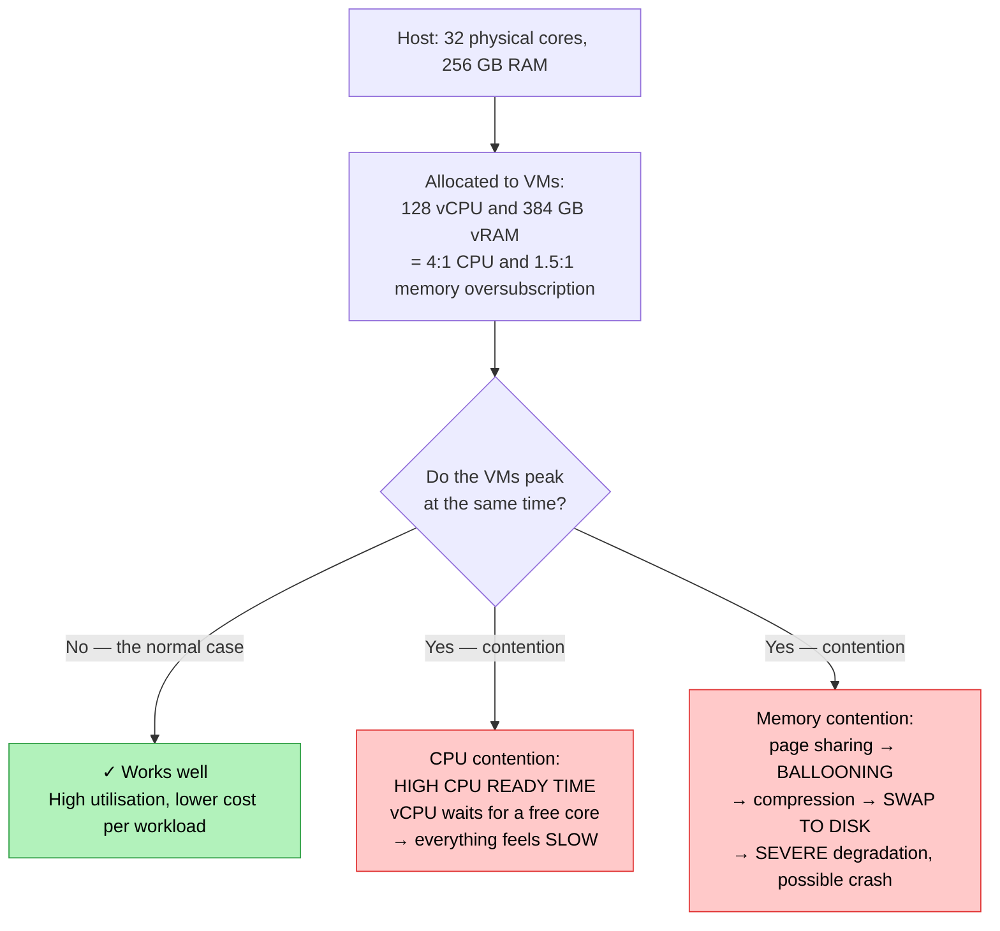

# Objective 1.7 — Compare and contrast virtualization concepts

> **Domain 1.0 — Cloud Architecture (23% of exam)** · Exam CV0-004 V4 · Objectives doc v5.0
> **Status:** Exam-ready · **Version:** 2.0 (enhanced) · Supersedes `full notes/Objective-1.7-Virtualization.md`

---

## 0. How to use this note

| Pass | What to read | Time |
|---|---|---|
| **1st (learn)** | Sections 1 → 10 in order | ~85 min |
| **2nd (drill)** | Section 2.1 (hypervisor types) + 3.3 (live migration requirements) + 9.2 (oversubscription) | ~25 min |
| **3rd (test)** | Section 13 (practice) + Section 14 (PBQ drills) | ~35 min |
| **Exam eve** | Section 15 (60-second recall sheet) only | ~6 min |

> 📌 **1.7 is the VM counterpart to 1.6.** The two objectives share the container-vs-VM comparison and the SAN/NAS material. If you have just done 1.6, this will move fast — but the resource-management content (oversubscription, NUMA, CPU ready time) is new and heavily tested in Domain 6 troubleshooting.

---

## 1. Official objective coverage

> **1.7 Compare and contrast virtualization concepts.**
> - Stand-alone
> - Clustering
> - Cloning
> - Host affinity
> - Hardware pass-through
> - **Network types**
>   - Overlay networks
>   - Virtual machine (VM) networks
> - **Storage**
>   - Local
>   - Storage area network (SAN)
>   - Network-attached storage (NAS)

### 1.1 What the verb tells you

**"Compare and contrast"** again — the third objective using it (1.4, 1.6, 1.7). The contrast pairs to master:

- stand-alone **vs** clustered
- clone **vs** template **vs** snapshot
- affinity **vs** anti-affinity
- pass-through **vs** paravirtualized **vs** SR-IOV
- VM network (vSwitch) **vs** overlay network
- local **vs** SAN **vs** NAS
- Type 1 **vs** Type 2 hypervisor *(not an official bullet, but tested constantly)*

### 1.2 Coverage checklist

- [ ] I can define **Type 1** and **Type 2** hypervisors and give examples of each
- [ ] I know what a stand-alone VM **cannot** do
- [ ] I can distinguish **HA**, **DRS**, **live migration**, and **Fault Tolerance**
- [ ] I know the **prerequisites for live migration** — and what breaks it
- [ ] I can contrast **full clone**, **linked clone**, **template**, and **snapshot**
- [ ] I know why a **snapshot is not a backup** and why long chains hurt
- [ ] I can state when to use **affinity** and when to use **anti-affinity**
- [ ] I know **pass-through** gives near-native speed but **breaks live migration**
- [ ] I know **SR-IOV** lets multiple VMs share one device, unlike full pass-through
- [ ] I can explain what a **vSwitch**, **port group**, and **uplink** do
- [ ] I know **overlay** vs **underlay**, and that VXLAN encapsulation demands a **larger MTU**
- [ ] I know **local storage breaks clustering**, and **SAN = block / NAS = file**
- [ ] I understand **oversubscription**, **CPU ready time**, and **memory ballooning/swapping**
- [ ] I know what **NUMA** is and why VM sizing should respect it

---

## 2. The core mental model

### 2.1 ★ Type 1 vs Type 2 hypervisors

```text
   TYPE 1 — "BARE METAL" / NATIVE          TYPE 2 — "HOSTED"
   ┌──────┐┌──────┐┌──────┐                ┌──────┐┌──────┐
   │ VM 1 ││ VM 2 ││ VM 3 │                │ VM 1 ││ VM 2 │
   │guest ││guest ││guest │                │guest ││guest │
   │  OS  ││  OS  ││  OS  │                │  OS  ││  OS  │
   └──────┘└──────┘└──────┘                └──────┘└──────┘
   ┌────────────────────────┐              ┌────────────────────────┐
   │      HYPERVISOR        │              │  HYPERVISOR (an APP)   │
   │  runs DIRECTLY on HW   │              │  VirtualBox, Workstation│
   └────────────────────────┘              └────────────────────────┘
   ┌────────────────────────┐              ┌────────────────────────┐
   │   PHYSICAL HARDWARE    │              │  HOST OS (Windows/Mac) │ ← extra layer
   └────────────────────────┘              └────────────────────────┘
                                           ┌────────────────────────┐
                                           │   PHYSICAL HARDWARE    │
                                           └────────────────────────┘

   ESXi · Hyper-V · KVM · Xen · Proxmox    VirtualBox · VMware Workstation
                                            /Fusion · Parallels · QEMU (hosted)
```

| | **Type 1 (bare metal)** | **Type 2 (hosted)** |
|---|---|---|
| Runs on | **Directly on hardware** | **On top of a host OS** |
| Performance | **High** — direct hardware access | Lower — an extra OS layer in the path |
| Security | **Stronger** — small attack surface | Weaker — inherits the host OS's vulnerabilities |
| Density / scale | High — datacentre grade | Low — a handful of VMs |
| Boot | The hypervisor *is* the OS | Requires the host OS to boot first |
| Managed by | Central management (vCenter, SCVMM) | The desktop application |
| Examples | **ESXi, Hyper-V, KVM, Xen, Proxmox** | **VirtualBox, VMware Workstation/Fusion, Parallels** |
| Used for | **Production, data centres, ALL public clouds** | Development, testing, labs, running another OS on a laptop |

> ★ **Every public cloud runs Type 1.** If a scenario mentions production, a data centre, a cluster, or a cloud provider, the hypervisor is Type 1. Type 2 is a developer's laptop.

### 2.2 What a virtual machine actually is

```text
   A VM is a set of FILES plus allocated VIRTUAL HARDWARE.

   VIRTUAL HARDWARE                    FILES ON A DATASTORE
   ┌──────────────────────┐            ┌──────────────────────────┐
   │ vCPU  (time slices   │            │  vm-name.vmdk / .vhdx    │ ← virtual disk
   │        of physical   │            │  vm-name.vmx / config    │ ← hardware config
   │        cores)        │            │  vm-name.nvram           │ ← BIOS/UEFI state
   │ vRAM  (mapped host   │            │  snapshot delta files    │ ← if snapshots exist
   │        memory pages) │            │  swap / paging file      │
   │ vNIC  (attached to a │            └──────────────────────────┘
   │        vSwitch)      │
   │ vDisk (a file on a   │            Because a VM is just files:
   │        datastore)    │              → cloning = copying files
   └──────────────────────┘              → migrating = moving/pointing at files
                                         → snapshotting = adding a delta file
                                         → backup = copying the file set
```

> 💡 **This is the insight that unlocks the objective.** Cloning, templates, snapshots, live migration, and HA all follow from "a VM is a file set plus a config." Shared storage matters because it lets *any host* reach those files.

### 2.3 Virtualization vs containerization — the recap

The same table as 1.6, from the virtualization side:

| | **Virtual machine** | **Container** |
|---|---|---|
| Virtualises | **Hardware** | **The OS** |
| Own kernel | ✅ **Yes** | ❌ Shares the host's |
| Size / boot | GBs / seconds–minutes | MBs / milliseconds |
| **Isolation** | **Stronger** (hypervisor boundary) | Weaker (process boundary) |
| Guest OS choice | **Any** | Must match host kernel |
| Density | Tens per host | Hundreds per host |
| Best for | **Legacy apps, mixed OS, hard multi-tenant isolation, full OS control** | Microservices, elastic scale, density |

> ⚠️ Containers and VMs are **not** competitors in practice — most production Kubernetes runs **containers inside VMs**, getting container agility with VM isolation.

---

## 3. Stand-alone vs clustering

### 3.1 Stand-alone

| | |
|---|---|
| **Definition** | A single VM (or single host) operating independently, with **no cluster membership, no shared resource pool, and no automated failover**. |
| **Strengths** | Simplest and cheapest; no shared storage or cluster licensing needed; no cluster to design or operate; fine for labs, dev/test, and non-critical workloads |
| **★ Limitations** | **Host failure = VM down, with no automatic recovery.** No live migration (so **patching the host means downtime**). No load balancing across hosts. No resource pooling. Capacity is capped by the single host |
| **Exam triggers** | "single host", "no HA", "lab environment", "if the host fails the VM stays down", "manual recovery" |

### 3.2 Clustering

| | |
|---|---|
| **Definition** | Multiple physical hosts managed as a **single pooled resource** with shared storage, providing automated failover, load balancing, and live migration. |
| **What it provides** | **High availability** · **live migration** · **load balancing** · **resource pooling** · **maintenance without downtime** |
| **Requirements** | **Shared storage** (SAN/NAS/HCI) reachable by every host · compatible **CPU families** · shared **L2 network** for VM port groups · a management/heartbeat network · adequate **spare capacity** to absorb a host failure (N+1) |
| **★ Costs** | Shared storage infrastructure, cluster licensing, network complexity, and **reserved spare capacity that sits idle** |
| **Exam triggers** | "restart VMs on another host", "no downtime during patching", "pool of hosts", "balance load automatically", "survive host failure" |

### 3.3 The four cluster capabilities — distinguish them precisely

```text
   ┌─────────────────────────────────────────────────────────────────────┐
   │ LIVE MIGRATION (vMotion / Live Migration)                           │
   │   Moves a RUNNING VM between hosts with NO downtime.                │
   │   PLANNED: host maintenance, load balancing.                        │
   │   Mechanism: iterative memory pre-copy while the VM runs, then a    │
   │   brief stun to copy the last dirty pages + CPU state, then resume. │
   ├─────────────────────────────────────────────────────────────────────┤
   │ HIGH AVAILABILITY (HA)                                              │
   │   Host DIES unexpectedly → VMs are RESTARTED on surviving hosts.    │
   │   ⚠ There IS downtime — the guest OS reboots (minutes).             │
   │   UNPLANNED failure recovery.                                       │
   ├─────────────────────────────────────────────────────────────────────┤
   │ DRS (Distributed Resource Scheduler)                                │
   │   Continuously balances VMs across hosts USING live migration,      │
   │   based on CPU/memory load. Also does initial placement.            │
   ├─────────────────────────────────────────────────────────────────────┤
   │ FAULT TOLERANCE (FT)                                                │
   │   A shadow VM runs in LOCKSTEP on another host.                     │
   │   Host dies → ZERO downtime, ZERO data loss, no reboot.             │
   │   ⚠ Very expensive: 2× resources, limited vCPU count, high network  │
   │     overhead. Reserved for the few workloads that truly need it.    │
   └─────────────────────────────────────────────────────────────────────┘
```

| | **Live migration** | **HA** | **DRS** | **Fault Tolerance** |
|---|---|---|---|---|
| Trigger | **Planned** (admin/DRS) | **Unplanned** host failure | Continuous load imbalance | Unplanned host failure |
| Downtime | **None** | **Minutes** (VM reboots) | None | **Zero** |
| Guest OS restarts | ❌ No | ✅ **Yes** | ❌ No | ❌ No |
| Resource cost | Low | Spare capacity (N+1) | Low | **2× — a full shadow VM** |
| Purpose | Maintenance, rebalancing | Recover from host loss | Optimise utilisation | Mission-critical continuity |

> ★ **The most-tested distinction: HA is not zero-downtime.** HA *restarts* VMs elsewhere — the guest OS boots again, so the application is down for minutes. Only **Fault Tolerance** gives zero downtime, and only **live migration** moves a running VM without interruption. If a question says "no downtime during host maintenance," the answer is **live migration**; "recover automatically after a host crash" is **HA**.

### 3.4 What breaks live migration

| Blocker | Why |
|---|---|
| **Local storage** | The destination host cannot reach the VM's disk files. Shared storage (or storage migration) is required |
| **Hardware pass-through** | The VM is bound to a specific physical device that does not exist on the target |
| **Incompatible CPUs** | Different instruction sets between hosts; CPU compatibility masking (EVC) normalises this |
| **No shared L2 / different port group** | The VM would lose its network identity on arrival |
| **Insufficient target capacity** | Nowhere to place it |

---

## 4. Cloning, templates, and snapshots

| | |
|---|---|
| **Definition (cloning)** | Creating a **copy of an existing VM** — its virtual disk and configuration — to deploy identical machines quickly and consistently. |
| **Why** | Speed and consistency. Building 20 web servers by hand invites drift and takes hours; cloning from a hardened golden image takes minutes and is identical every time |
| **★ Caution** | Clones inherit the source's **identity** — hostname, SID/machine ID, SSH host keys, MAC, licence state. Production clones must be **generalised/sysprepped** or they collide on the network |
| **Exam triggers** | "deploy many identical VMs quickly", "golden image", "from a template", "copy of an existing VM" |

### 4.1 The four related concepts

```text
   TEMPLATE                     FULL CLONE                LINKED CLONE
   ┌──────────────┐             ┌──────────────┐          ┌──────────────┐
   │ Golden image │             │ Complete,    │          │ Small delta  │
   │ NOT runnable │──deploy──►  │ INDEPENDENT  │          │ disk only    │
   │ Master copy  │             │ copy         │          └──────┬───────┘
   └──────────────┘             └──────────────┘                 │ reads from
                                 ✓ no dependency          ┌──────▼───────┐
                                 ✗ full disk space        │ PARENT disk  │
                                                          │ (read-only,  │
   SNAPSHOT                                               │  SHARED)     │
   ┌──────────────┐                                       └──────────────┘
   │ Base disk    │  ← frozen, read-only                   ✓ fast, tiny
   ├──────────────┤                                        ✗ DEPENDS on parent
   │ delta 1      │  ← all new writes land here            ✗ slower reads
   ├──────────────┤                                        Used for: VDI pools
   │ delta 2      │
   └──────────────┘   ⚠ Every read may traverse the chain.
                        LONG CHAINS = SLOW + huge disk growth.
                        A snapshot is NOT a backup.
```

| | **Template** | **Full clone** | **Linked clone** | **Snapshot** |
|---|---|---|---|---|
| Purpose | **Master image for deployment** | Independent duplicate | Space-efficient duplicate | **Point-in-time rollback** |
| Runnable | ❌ No (converted to VM first) | ✅ Yes | ✅ Yes | ❌ It is a state, not a VM |
| Depends on a parent | — | ❌ **No** | ✅ **Yes** | ✅ Yes (delta chain) |
| Disk usage | Full | **Full** | **Minimal** | Grows as changes accumulate |
| Creation speed | — | Slow | **Fast** | Instant |
| Performance | — | Native | Slower (chained reads) | **Degrades with chain length** |
| Typical use | Standardised provisioning | Production servers | VDI, dev/test pools | **Short-lived pre-change rollback point** |

> ⚠️ **Two traps in one:**
> **① A snapshot is not a backup.** It lives on the same storage as the VM, depends on the base disk, and is lost with it. Backups are independent copies elsewhere.
> **② Snapshots are meant to be short-lived.** Every write goes to a growing delta file, reads may traverse the whole chain, and a forgotten snapshot can fill a datastore and take the VM down. Take one before a patch, then **delete it once the change is verified**.

---

## 5. Host affinity and anti-affinity

| | |
|---|---|
| **Definition** | Placement rules that constrain **which host(s)** a VM may run on, or which VMs may run **together**. |
| **Why** | Availability, performance, licensing, and compliance all depend on *where* a VM physically runs |
| **Exam triggers** | "keep these VMs apart", "must run on the same host", "licensing is per physical socket", "must stay in a specific data centre", "both replicas ended up on one host" |

### 5.1 The rule types

```text
   VM-to-VM AFFINITY                    VM-to-VM ANTI-AFFINITY
   "keep these TOGETHER"                "keep these APART"
   ┌──────── HOST A ────────┐           ┌─ HOST A ─┐   ┌─ HOST B ─┐
   │   [App VM] [Cache VM]  │           │ [DB-1]   │   │ [DB-2]   │
   └────────────────────────┘           └──────────┘   └──────────┘
   WHY: chatty pair — traffic           WHY: HIGH AVAILABILITY —
   never leaves the host, so            one host failure must not
   latency is minimal                   take out BOTH replicas

   VM-to-HOST AFFINITY
   "this VM may only run on these hosts"
   ┌─ HOST A (licensed / GPU / EU region) ─┐   ┌─ HOST B ─┐
   │            [Oracle VM]                │   │  ✗ not   │
   └───────────────────────────────────────┘   │ permitted│
   WHY: per-socket LICENSING (pin the workload  └──────────┘
   to licensed hosts only) · specialised hardware ·
   data sovereignty / compliance zones
```

| Rule | Meaning | Primary driver |
|---|---|---|
| **VM-VM affinity** | These VMs must run on the **same** host | **Performance** — low-latency inter-VM traffic |
| **VM-VM anti-affinity** | These VMs must run on **different** hosts | **Availability** — survive a single host failure |
| **VM-Host affinity** | This VM may run **only on** these hosts | **Licensing**, specialised hardware, compliance/sovereignty |
| **VM-Host anti-affinity** | This VM must **never** run on these hosts | Isolation, compliance separation |

**Should vs must:** *should* (preferential/soft) rules can be violated when necessary — for example HA will still restart a VM on a "wrong" host rather than leave it down. *Must* (mandatory/hard) rules are never violated, which means **a must-rule can prevent HA from recovering a VM at all**. That trade-off is examinable.

> ★ **The classic anti-affinity scenario:** two clustered database replicas were placed on the same host; that host failed and the whole service went down despite "redundancy." The fix is an **anti-affinity rule**. This is exactly the failure-domain reasoning from 1.2 — redundant copies must not share a failure domain.

---

## 6. Hardware pass-through

| | |
|---|---|
| **Definition** | Giving a VM **direct access to a physical device** — GPU, NIC, NVMe, HBA, crypto accelerator — bypassing the hypervisor's device-emulation layer. Also called **PCI pass-through** or **DirectPath I/O**. |
| **Why** | **Near-native performance** for workloads where virtualization overhead is unacceptable: GPU compute and ML training, VDI with 3D acceleration, ultra-low-latency trading/networking, high-throughput storage, hardware licence dongles |
| **★ Costs** | The device is **dedicated to one VM** and cannot be shared. **Live migration is normally impossible** (the target host has no identical bound device), which in turn **breaks DRS and complicates HA**. Snapshots are often unsupported. Host maintenance requires shutting the VM down |
| **Exam triggers** | "GPU for machine learning", "near-native performance", "bypass the hypervisor", "direct hardware access", "cannot live-migrate this VM" |

### 6.1 The three device-access models

```text
   ① EMULATED DEVICE               ② PARAVIRTUALIZED         ③ PASS-THROUGH
   ┌───────┐                       ┌───────┐                 ┌───────┐
   │  VM   │ generic driver        │  VM   │ VM-aware driver │  VM   │ native driver
   └───┬───┘                       └───┬───┘ (virtio,        └───┬───┘
       │ hypervisor pretends           │      VMXNET3,           │ DIRECT
       │ to be real hardware           │      PVSCSI)            │
   ┌───▼─────────────────┐         ┌───▼──────────────┐          │
   │    HYPERVISOR       │         │   HYPERVISOR     │          │
   │  (full emulation)   │         │ (thin, optimised)│          │
   └───┬─────────────────┘         └───┬──────────────┘      ┌───▼───┐
   ┌───▼───┐                       ┌───▼───┐                 │PHYSICAL│
   │DEVICE │                       │DEVICE │                 │ DEVICE │
   └───────┘                       └───────┘                 └────────┘
   SLOWEST                         FAST — the default         FASTEST
   Max compatibility               sweet spot                 ✗ no sharing
   Migration ✓                     Migration ✓                ✗ no live migration
```

**SR-IOV — the middle ground worth knowing:**

**Single Root I/O Virtualization** lets **one physical device present multiple Virtual Functions (VFs)**, so **several VMs share one device** while each still gets near-native performance. It solves pass-through's "one VM only" limitation but generally **still blocks live migration**.

| | **Full pass-through** | **SR-IOV** | **Paravirtualized** |
|---|---|---|---|
| Performance | **Near-native** | Near-native | Very good |
| Device sharing | ❌ **One VM only** | ✅ **Several VMs (VFs)** | ✅ Many VMs |
| Live migration | ❌ **Blocked** | ❌ Usually blocked | ✅ **Works** |
| Typical use | GPU training, licence dongles | High-throughput networking | **Everything else — the default** |

---

## 7. Network types

### 7.1 VM networks (virtual switches)

| | |
|---|---|
| **Definition** | The **virtual switching layer inside the hypervisor** that connects VMs to each other and — through physical NICs (**uplinks**) — to the physical network. |
| **Components** | **vSwitch** (the virtual switch) · **port group** (a named policy set: VLAN ID, security, teaming) · **vNIC** (the VM's virtual adapter) · **uplink** (physical NIC connecting the vSwitch outward) |
| **Key behaviour** | Two VMs on the same host **and same port group** talk to each other **entirely inside the host** — the traffic never touches a physical cable |
| **Exam triggers** | "virtual switch", "port group", "VLAN tagging inside the hypervisor", "VMs on the same host communicating", "uplink NIC" |

```text
   ┌─────────────────── PHYSICAL HOST ────────────────────┐
   │                                                       │
   │  [Web VM]      [Web VM]        [DB VM]                │
   │    vNIC          vNIC            vNIC                 │
   │      │             │               │                  │
   │  ┌───▼─────────────▼───┐     ┌─────▼──────┐           │
   │  │ PORT GROUP "WEB"    │     │ PORT GROUP │           │
   │  │ VLAN 100            │     │ "DB"       │           │
   │  └──────────┬──────────┘     │ VLAN 200   │           │
   │             │                └─────┬──────┘           │
   │        ┌────▼──────────────────────▼────┐             │
   │        │        vSWITCH                 │             │
   │        └────────┬───────────┬───────────┘             │
   │           UPLINK│      UPLINK│  (NIC teaming for      │
   │            pNIC1│       pNIC2│   redundancy)          │
   └─────────────────┼────────────┼────────────────────────┘
                     ▼            ▼
              PHYSICAL SWITCH (802.1Q trunk carrying VLANs 100, 200)

   ★ Web VM → Web VM on the SAME host, SAME port group:
     traffic stays INSIDE the vSwitch. It never reaches pNIC1.
```

| Type | Scope | Notes |
|---|---|---|
| **Standard vSwitch** | Configured **per host** | Simple; configuration must be kept identical on every host manually — drift causes migration failures |
| **Distributed vSwitch** | Managed **centrally across the cluster** | Consistent config everywhere; required for advanced features; **the practical choice for clusters** |

**VLAN tagging modes:** **VST** (virtual switch tagging — the port group carries the VLAN ID; the most common) · **EST** (external switch tagging — the physical switch handles it) · **VGT** (virtual guest tagging — the guest OS tags).

> ⚠️ **Promiscuous mode** on a port group lets a VM see all traffic on that segment. It is disabled by default and should stay that way — enabling it is a **security exposure**, only justified for IDS sensors or nested virtualization.

### 7.2 Overlay networks

| | |
|---|---|
| **Definition** | A **logical network built on top of the physical network** (the *underlay*) using **encapsulation** — most commonly **VXLAN** — so VMs on different hosts, racks, or sites appear to share one Layer 2 segment. |
| **Why** | **Decouples the virtual network from physical topology.** A VM keeps its IP and subnet when it migrates across racks or data centres. Provides **massive multi-tenant isolation**: VXLAN's 24-bit VNI gives ~16 million segments versus VLAN's 4,094 |
| **How** | The source host's **VTEP** (VXLAN Tunnel Endpoint) wraps the VM's Ethernet frame inside a **UDP/IP packet**, routes it over the physical L3 underlay, and the destination VTEP unwraps it |
| **★ Cost** | **Encapsulation overhead (~50 bytes)** means the underlay must carry a **larger MTU** — typically 1600 minimum, jumbo 9000 in practice. Get this wrong and you see fragmentation, poor throughput, and mysterious large-packet failures. Also adds CPU cost and makes troubleshooting harder (two layers to inspect) |
| **Exam triggers** | "VXLAN", "encapsulation", "L2 across L3", "VM keeps its IP after migrating to another rack", "multi-tenant isolation at scale", "logical network over physical" |

```text
   OVERLAY (logical — what the VMs see)
   ┌────────────────────────────────────────────────────────┐
   │  [VM-A 10.1.1.5] ◄────── same L2 segment ─────► [VM-B  │
   │                          VNI 5001                10.1.1.6]│
   └────────────────────────────────────────────────────────┘
              ▲                                    ▲
              │ VTEP encapsulates                  │ VTEP decapsulates
              │                                    │
   ┌──────────┴────────────────────────────────────┴─────────┐
   │  UNDERLAY (physical — routed L3 fabric, different racks) │
   │  Host 1 (192.168.10.2) ──► leaf/spine ──► Host 2         │
   │                                            (192.168.20.7)│
   └──────────────────────────────────────────────────────────┘

   PACKET ON THE WIRE:
   [ outer IP/UDP | VXLAN hdr (VNI) | ORIGINAL Ethernet frame ]
     └──────────── ~50 bytes added ────────────┘
   ⚠ Underlay MTU must be ≥ 1600 (or jumbo 9000) or frames fragment.
```

| | **VM network (vSwitch)** | **Overlay network** |
|---|---|---|
| Scope | **Within one host**, extended by physical VLANs | **Spans hosts, racks, sites** over L3 |
| Segmentation ID | **VLAN — 12-bit, 4,094 max** | **VNI — 24-bit, ~16 million** |
| Crosses L3 boundaries | ❌ No | ✅ **Yes** (encapsulated) |
| Depends on physical config | ✅ Yes — trunks and VLANs on switches | ❌ Underlay just needs IP reachability |
| MTU impact | None | **Needs larger MTU** |
| Migration across racks | Requires stretched L2 | ✅ **Transparent** |
| Used by | Traditional virtualization | **Cloud providers, SDN, Kubernetes CNI** |

> 💡 **This is the same VXLAN material as 1.3 (VLAN limits) and 1.6 (multi-host container networking).** One concept, three objectives.

---

## 8. Storage for virtualization

### 8.1 The three options

```text
   LOCAL                       SAN (block)                 NAS (file)
   ┌────────┐                  ┌────────┐ ┌────────┐       ┌────────┐ ┌────────┐
   │ HOST A │                  │ HOST A │ │ HOST B │       │ HOST A │ │ HOST B │
   │ ┌────┐ │                  └───┬────┘ └───┬────┘       └───┬────┘ └───┬────┘
   │ │DISK│ │                      │ FC/iSCSI │                │ Ethernet │
   │ └────┘ │                   ┌──▼──────────▼──┐          ┌──▼──────────▼──┐
   └────────┘                   │  SAN FABRIC    │          │   LAN          │
                                └───────┬────────┘          └───────┬────────┘
   ✗ Only this host sees it        ┌────▼─────┐               ┌─────▼──────┐
   ✗ NO live migration             │ ARRAY    │               │    NAS     │
   ✗ NO HA                         │ → LUNs   │               │ → NFS/SMB  │
   ✓ Fastest, cheapest             └──────────┘               │   shares   │
   ✓ Fine for scratch/cache        ✓ BLOCK — LUN looks        └────────────┘
     and hyperconverged pools        like a local disk        ✓ FILE-level
                                    ✓ Highest performance     ✓ Simple, cheaper
                                    ✓ ENABLES CLUSTERING      ✓ Enables clustering
                                    ✗ Costly, complex         ✗ Higher latency
```

| | **Local** | **SAN** | **NAS** |
|---|---|---|---|
| Level | Block | **Block** | **File** |
| Network | None — direct attach | **Dedicated fabric** (FC / iSCSI) | Standard Ethernet LAN |
| Protocol | SATA/SAS/NVMe | FC, FCoE, iSCSI, NVMe-oF | **NFS, SMB/CIFS** |
| Shared between hosts | ❌ **No** | ✅ Yes (LUNs per host) | ✅ Yes (same share) |
| **Supports live migration / HA** | ❌ **No** | ✅ **Yes** | ✅ **Yes** |
| Performance | **Highest** (no network hop) | High, low latency | Moderate |
| Cost & complexity | **Lowest** | **Highest** — HBAs, fabric switches, zoning | Medium |
| Best for | Scratch, cache, swap, HCI nodes | High-IOPS VMs, databases, large clusters | ISO libraries, backups, general VM storage, file shares |

> ★ **The single most-tested storage fact in this objective: local storage prevents clustering.** Live migration and HA require every host to reach the VM's disk files. If a scenario wants HA or migration, the answer involves **shared storage** — SAN, NAS, or a hyperconverged pool.

### 8.2 Datastores and provisioning

| Concept | Meaning |
|---|---|
| **Datastore** | The logical container where VM files live — a formatted block volume (e.g. VMFS on a SAN LUN) or a mounted NFS share |
| **Thin provisioning** | Disk consumes only what is written; allows **oversubscription** of the datastore. Risk: the datastore fills and **every VM on it halts** |
| **Thick — lazy zeroed** | Space reserved up front; blocks zeroed on first write (slight first-write penalty) |
| **Thick — eager zeroed** | Space reserved **and** fully zeroed at creation; slowest to create, **best and most consistent performance**; required by some clustering features |
| **Storage migration** | Moving a VM's disks between datastores **while it runs** |
| **Multipathing** | Redundant physical paths from host to LUN — removes the fabric as a single point of failure |
| **Zoning / LUN masking** | Fabric-level and array-level controls over which hosts may see which LUNs |
| **HBA** | Host Bus Adapter — the card connecting a host to the SAN fabric |
| **HCI (hyperconverged infrastructure)** | Pools the **local** disks of every cluster node into a **distributed shared datastore** (vSAN, Nutanix). Gives shared-storage capability — clustering, HA, migration — **without a separate SAN array** |

> 💡 **HCI is the modern answer to "local storage can't cluster."** It uses local disks but presents them as shared, replicating data across nodes. Worth recognising because it breaks the simple local-vs-shared dichotomy.

---

## 9. Resource management and adjacent concepts

### 9.1 vCPU and vRAM

| Term | Meaning |
|---|---|
| **vCPU** | A virtual CPU presented to a guest; the hypervisor schedules it onto **physical cores in time slices** |
| **vRAM** | Virtual memory presented to a guest; the hypervisor maps it to host physical pages |
| **Resource pool** | A logical grouping of cluster CPU/memory that can be sub-allocated to teams or tiers |
| **Shares** | **Relative priority** when resources are contended (a VM with 2× the shares gets 2× the contested resource) |
| **Reservation** | A **guaranteed minimum** the VM always gets — reduces the capacity available to everything else |
| **Limit** | A **hard ceiling** the VM may never exceed, even if the host is idle |

### 9.2 ★ Oversubscription (overcommitment)

**Allocating more virtual resources than physically exist.** It works because VMs rarely peak simultaneously — but it fails badly when they do.



| | **CPU oversubscription** | **Memory oversubscription** |
|---|---|---|
| Typical safe ratio | 2:1 to 8:1 depending on workload | Conservative — near 1:1 for production |
| Symptom of contention | **High CPU ready time** (% of time a vCPU is runnable but waiting) | **Ballooning**, then compression, then **swapping to disk** |
| Severity | Degrades — things get slower | **Severe** — swapping can be 1000× slower; can crash guests |
| Risk level | Lower — CPU is time-sliced and reclaimable | **Higher — memory cannot be time-sliced** |

**The memory-reclamation ladder** (in order of increasing pain): transparent page sharing → **ballooning** (a guest driver returns unused pages to the host) → memory compression → **host swapping to disk** (the emergency measure, catastrophic for performance).

> ★ **Two Domain 6 troubleshooting signatures worth memorising:**
> **"VMs are slow but host CPU utilisation looks fine"** → **high CPU ready time** from CPU oversubscription. The cores are busy scheduling, not idle.
> **"Performance collapsed and the host is swapping"** → **memory over-commitment**. Reduce allocations, add RAM, or migrate VMs off.

**Right-sizing:** over-allocating vCPUs to a VM can make it *slower*, because the scheduler may need to find that many free cores simultaneously before it can run. More vCPUs is not automatically faster.

### 9.3 NUMA

**Non-Uniform Memory Access** — on a multi-socket server, each CPU socket has its own **local memory**. Accessing memory attached to *another* socket is measurably slower.

```text
   ┌─────── NUMA NODE 0 ───────┐   ┌─────── NUMA NODE 1 ───────┐
   │  CPU socket 0             │   │  CPU socket 1             │
   │       │ FAST (local)      │   │       │ FAST (local)      │
   │  ┌────▼─────┐             │   │  ┌────▼─────┐             │
   │  │ 128 GB   │             │   │  │ 128 GB   │             │
   │  └──────────┘             │   │  └──────────┘             │
   └───────────┬───────────────┘   └───────────┬───────────────┘
               └────── SLOW (remote access) ───┘

   ✓ Size a VM to fit WITHIN one NUMA node where possible.
   ✗ A VM larger than one node ("wide VM") spans both and suffers
     remote-memory latency — unless vNUMA exposes the topology so
     the guest OS can optimise around it.
```

### 9.4 Other concepts

| Term | Meaning |
|---|---|
| **VM sprawl** | Uncontrolled proliferation of VMs — forgotten, unused, unpatched machines consuming licences, storage, and creating security exposure. Controlled by tagging, lifecycle policies, quotas, and showback/chargeback (see 1.8, 3.4) |
| **P2V / V2V / V2P** | Physical→virtual (classic migration), virtual→virtual (between hypervisor formats, using a **format converter**), virtual→physical (rare) |
| **Guest tools / paravirtual drivers** | Software installed in the guest (VMware Tools, integration services, virtio drivers) providing optimised drivers, graceful shutdown, heartbeat, and time sync. **Missing tools is a common cause of poor VM performance** |
| **Nested virtualization** | Running a hypervisor inside a VM — used for labs, CI, and some container-isolation runtimes |
| **VM escape** | A guest breaking out to the hypervisor or other VMs. Rare but catastrophic — the reason hypervisor patching is critical |
| **Golden image / hardening** | A patched, hardened, standardised base image used as the template for all clones |

---

## 10. Comparison tables

### 10.1 The objective's contrast pairs at a glance

| Pair | Key difference |
|---|---|
| **Type 1 vs Type 2** | Runs on **hardware** vs runs on a **host OS** |
| **Stand-alone vs cluster** | No failover vs **pooled hosts with HA, DRS, live migration** |
| **Live migration vs HA** | **Planned, zero downtime** vs **unplanned, VM reboots** |
| **HA vs Fault Tolerance** | Restart (minutes down) vs **lockstep shadow (zero downtime, 2× cost)** |
| **Full vs linked clone** | Independent, full size vs **parent-dependent, tiny** |
| **Clone vs snapshot** | A **new deployable VM** vs a **rollback point on the same VM** |
| **Affinity vs anti-affinity** | Keep together (**performance/licensing**) vs keep apart (**availability**) |
| **Pass-through vs SR-IOV** | One VM, whole device vs **several VMs sharing via virtual functions** |
| **Pass-through vs paravirtual** | Fastest but **no live migration** vs fast and **migratable** |
| **VM network vs overlay** | VLAN-scoped, 4,094 segments vs **VXLAN, ~16 M, spans L3** |
| **Local vs SAN vs NAS** | No sharing (**no HA**) vs **block, shared** vs **file, shared** |
| **Thin vs thick provisioning** | Allocate on write (oversubscribable) vs reserved up front |

### 10.2 Choosing storage for a virtualization cluster

| Requirement | Choose |
|---|---|
| Live migration and HA required | **SAN, NAS, or HCI** — anything shared |
| Highest IOPS for a database VM | **SAN** (block, FC/iSCSI) |
| ISO library, templates, backups shared across hosts | **NAS** (file, NFS/SMB) |
| Scratch, swap, or cache with no HA need | **Local** |
| Shared storage without buying a SAN array | **HCI** (pools local disks) |
| Consistent, best-case VM disk performance | **Thick eager-zeroed** on SAN |
| Maximum capacity efficiency, accepting risk | **Thin provisioned** (monitor datastore free space) |

### 10.3 Multi-cloud / vendor terminology

| Concept | VMware | Microsoft | Open source / KVM |
|---|---|---|---|
| Type 1 hypervisor | **ESXi** | **Hyper-V** | **KVM**, Xen |
| Management plane | vCenter Server | SCVMM / Windows Admin Center | oVirt, Proxmox, OpenStack |
| Live migration | **vMotion** | **Live Migration** | Live migration |
| Storage migration | Storage vMotion | Storage Live Migration | Block migration |
| Load balancing | **DRS** | Dynamic Optimization | Scheduler policies |
| Zero-downtime redundancy | **Fault Tolerance** | (no direct equivalent) | Kemari / COLO |
| Distributed switch | vSphere Distributed Switch | Logical Switch (SDN) | Open vSwitch |
| Hyperconverged storage | **vSAN** | Storage Spaces Direct | Ceph, GlusterFS |
| Pass-through | DirectPath I/O | Discrete Device Assignment | VFIO / PCI pass-through |

---

## 11. Exam traps & distractor patterns

| # | Trap | The truth |
|---|---|---|
| 1 | "HA means no downtime" | HA **restarts** VMs on another host — the guest **reboots**, so there is downtime. Zero downtime = **Fault Tolerance**; zero-downtime *moves* = **live migration** |
| 2 | "Live migration and HA are the same" | Live migration is **planned** and seamless; HA is **unplanned** recovery with a reboot |
| 3 | "Local storage is fine for a cluster" | **Local storage prevents live migration and HA.** Shared storage (or HCI) is required |
| 4 | "A snapshot is a backup" | It sits on the same storage, depends on the base disk, and dies with it. Backups are independent copies elsewhere |
| 5 | "Keeping snapshots for weeks is harmless" | Delta files grow, reads traverse the chain, and a full datastore can **halt every VM on it** |
| 6 | "Type 2 hypervisors run production clouds" | All public clouds and data centres run **Type 1**. Type 2 is desktop/lab |
| 7 | "Pass-through improves flexibility" | It **removes** flexibility — no device sharing and **no live migration** |
| 8 | "SR-IOV is the same as pass-through" | SR-IOV lets **multiple VMs share one device** via virtual functions; full pass-through dedicates it to one |
| 9 | "Affinity rules improve availability" | **Anti-affinity** improves availability. **Affinity** is for performance and licensing — and can *reduce* availability by concentrating VMs |
| 10 | "More vCPUs always means better performance" | Over-allocating vCPUs can make a VM **slower** — the scheduler must find that many free cores at once |
| 11 | "The host CPU shows low utilisation, so CPU is not the problem" | Check **CPU ready time** — vCPUs waiting for cores is the oversubscription signature |
| 12 | "Memory can be oversubscribed as aggressively as CPU" | Memory cannot be time-sliced. Contention leads to ballooning and then **swapping**, which is catastrophic |
| 13 | "Overlay networks need no physical change" | They need a **larger underlay MTU** (~1600+) to absorb ~50 bytes of encapsulation, or you get fragmentation and large-packet failures |
| 14 | "VLANs are enough for cloud multi-tenancy" | 12-bit VLAN IDs cap at **4,094**. Cloud scale needs **VXLAN's 24-bit VNI (~16 M)** |
| 15 | "Two VMs on the same host and port group need the physical switch" | Their traffic stays **inside the vSwitch** and never reaches an uplink |
| 16 | "Cloning a production VM is safe as-is" | Clones duplicate hostname, machine ID, keys, and MAC — **generalise/sysprep** first or they collide |
| 17 | "A must-run affinity rule is always safer" | A **mandatory** rule can **prevent HA from restarting a VM** if no permitted host is available |
| 18 | "NAS and SAN are interchangeable" | **SAN = block** (LUNs, appears as a local disk). **NAS = file** (NFS/SMB shares) |
| 19 | "Thin provisioning has no downside" | The datastore can be **oversubscribed and fill up**, stopping every VM on it |

**Disambiguation drill:**

| Pair | The deciding question |
|---|---|
| **HA vs live migration vs FT** | Unplanned + reboot (HA) · planned + seamless (live migration) · unplanned + zero downtime (FT) |
| **Clone vs template vs snapshot** | New VM (clone) · master to deploy from (template) · rollback point (snapshot) |
| **Affinity vs anti-affinity** | Together for **performance/licensing** vs apart for **availability** |
| **Pass-through vs paravirtual** | Is **live migration** required? If yes, pass-through is out |
| **VM network vs overlay** | Does it need to cross **L3 boundaries** or exceed 4,094 segments? |
| **Local vs shared storage** | Is **HA or migration** needed? Then it cannot be local |
| **SAN vs NAS** | **Block/LUN** (SAN) vs **file share** (NAS) |
| **Type 1 vs Type 2** | Production/data centre (1) vs laptop/lab (2) |

---

## 12. Keyword → answer trigger table

| If you see… | Think |
|---|---|
| runs directly on hardware · ESXi/Hyper-V/KVM · production data centre | **Type 1 hypervisor** |
| runs as an application on Windows/macOS · VirtualBox · developer laptop | **Type 2 hypervisor** |
| single host · no failover · lab · manual recovery | **Stand-alone** |
| pool of hosts · survive host failure · balance load · patch without downtime | **Clustering** |
| move a running VM with no downtime · host maintenance | **Live migration** |
| host crashed, VMs restarted elsewhere (with a reboot) | **HA** |
| zero downtime, zero data loss, shadow VM, 2× resources | **Fault Tolerance** |
| automatically rebalance VMs across hosts | **DRS** |
| deploy 20 identical VMs fast · golden image | **Cloning from a template** |
| space-efficient copies sharing a parent disk · VDI pool | **Linked clone** |
| rollback point before patching · delta disk | **Snapshot** (short-lived, not a backup) |
| both replicas died with one host | **Anti-affinity rule needed** |
| chatty VM pair needing minimal latency | **Affinity rule** |
| licensed per physical socket · must stay on specific hosts | **VM-Host affinity** |
| GPU for ML · near-native performance · bypass the hypervisor | **Hardware pass-through** |
| this VM can no longer be live-migrated | **Pass-through is attached** |
| several VMs sharing one NIC at near-native speed | **SR-IOV** |
| virtual switch · port group · VLAN 100 · uplink NIC | **VM network** |
| VXLAN · encapsulation · L2 over L3 · VM keeps its IP across racks · 16 million segments | **Overlay network** |
| large packets fail after enabling the overlay | **Underlay MTU too small (~50-byte overhead)** |
| disk attached to one host only · no migration possible | **Local storage** |
| LUN · Fibre Channel · iSCSI · block · appears as a local disk | **SAN** |
| NFS · SMB · shared folder · ISO library · file-level | **NAS** |
| shared storage using the cluster's own local disks | **HCI (e.g. vSAN)** |
| VMs slow but host CPU looks idle | **High CPU ready time → CPU oversubscription** |
| host swapping · ballooning · severe slowdown | **Memory over-commitment** |
| VM spans two CPU sockets and memory is slow | **NUMA misalignment** |
| hundreds of forgotten, unpatched VMs consuming licences | **VM sprawl** |
| converting a physical server into a VM | **P2V** |

---

## 13. Practice questions

<details>
<summary><b>Q1.</b> Which hypervisor type runs directly on the physical hardware with no underlying operating system?</summary>

**A. Type 1 (bare metal)** · B. Type 2 (hosted) · C. Both equally · D. Neither

**Correct: A.** Type 1 hypervisors such as ESXi, Hyper-V, KVM, and Xen install directly on hardware, giving better performance and a smaller attack surface — which is why every public cloud uses them.
- **B wrong:** Type 2 runs as an application on a host OS.
- **C/D wrong:** The distinction is precisely this.
</details>

<details>
<summary><b>Q2.</b> An administrator must patch a physical host without any interruption to the VMs running on it. Which capability is required?</summary>

A. High availability · **B. Live migration** · C. Cloning · D. Snapshot

**Correct: B — live migration.** Running VMs are moved to another host with no downtime, the host is patched, and they can be moved back.
- **A wrong:** HA responds to **unplanned** failures and restarts VMs, causing a reboot.
- **C wrong:** Cloning creates copies; it does not relocate running workloads.
- **D wrong:** A snapshot is a rollback point, not a migration mechanism.
</details>

<details>
<summary><b>Q3.</b> A host fails unexpectedly and cluster HA restarts its VMs on surviving hosts. What is the impact on those VMs?</summary>

A. No impact at all · **B. They are powered off and rebooted, so the applications are unavailable for several minutes** · C. They continue running uninterrupted · D. They are permanently lost

**Correct: B.** HA is unplanned recovery: the VMs restart, which means the guest OS boots again.
- **A/C wrong:** Only **Fault Tolerance** provides zero downtime for an unplanned host failure.
- **D wrong:** HA specifically prevents permanent loss.
</details>

<details>
<summary><b>Q4.</b> Two clustered database VMs were both running on the same host, and that host failed, taking the whole service down. What should be configured?</summary>

A. VM-VM affinity · **B. VM-VM anti-affinity** · C. VM-Host affinity · D. Hardware pass-through

**Correct: B — anti-affinity.** It forces the two replicas onto different hosts so a single host failure cannot destroy both.
- **A wrong:** Affinity keeps them together — exactly the condition that caused the outage.
- **C wrong:** VM-Host affinity pins VMs to specific hosts for licensing or hardware reasons.
- **D wrong:** Pass-through concerns device access.
</details>

<details>
<summary><b>Q5.</b> Which storage option makes live migration and HA impossible?</summary>

**A. Local direct-attached storage** · B. Fibre Channel SAN · C. NFS-based NAS · D. Hyperconverged shared datastore

**Correct: A.** Only the owning host can reach local disks, so no other host can take over the VM's files.
- **B/C/D wrong:** All three present storage that every host in the cluster can access, which is the prerequisite for migration and HA.
</details>

<details>
<summary><b>Q6.</b> A machine-learning VM is assigned a GPU using PCI pass-through. What is the MAIN operational consequence?</summary>

A. The GPU can be shared by all VMs on the host · **B. The VM can no longer be live-migrated, because it is bound to a specific physical device** · C. The VM's performance is reduced · D. The VM cannot use local storage

**Correct: B.** Pass-through binds the VM to hardware present only on that host, which blocks live migration and complicates DRS and HA.
- **A wrong:** Full pass-through dedicates the device to one VM; SR-IOV is what enables sharing.
- **C wrong:** Pass-through **improves** performance to near-native — that is its purpose.
- **D wrong:** Storage choice is unaffected.
</details>

<details>
<summary><b>Q7.</b> Users report that VMs are sluggish, yet the host shows moderate CPU utilisation. Which metric should be checked FIRST?</summary>

A. Disk queue depth · **B. CPU ready time** · C. Network throughput · D. Snapshot count

**Correct: B — CPU ready time.** It measures how long a vCPU was runnable but waiting for a physical core, and it is the definitive signature of CPU oversubscription.
- **A/C wrong:** Worth checking, but they do not explain the "busy VMs, calm host" pattern.
- **D wrong:** Snapshots degrade storage performance, not CPU scheduling.
</details>

<details>
<summary><b>Q8.</b> What is the PRIMARY difference between a full clone and a linked clone?</summary>

A. A full clone is faster to create · **B. A full clone is completely independent, while a linked clone shares a read-only parent disk and stores only its changes** · C. Linked clones use more disk space · D. Full clones cannot be powered on

**Correct: B.** Linked clones are fast and space-efficient but remain dependent on the parent; full clones cost more space and gain independence.
- **A wrong:** Linked clones are much faster to create.
- **C wrong:** Linked clones use far less space.
- **D wrong:** Full clones are ordinary, runnable VMs.
</details>

<details>
<summary><b>Q9.</b> An administrator keeps VM snapshots for several months as a backup strategy. What is the problem?</summary>

A. Snapshots cannot be deleted · **B. Snapshots are not backups — they depend on the base disk, sit on the same storage, and long delta chains degrade performance and can fill the datastore** · C. Snapshots prevent live migration · D. Snapshots consume no space

**Correct: B.** Snapshots are short-term rollback points, not independent copies stored elsewhere.
- **A wrong:** They can be deleted (consolidated).
- **C wrong:** Migration is generally still possible.
- **D wrong:** Delta files grow continuously — that is the core risk.
</details>

<details>
<summary><b>Q10.</b> Which technology allows several VMs to share one physical network adapter while each retains near-native performance?</summary>

A. Full PCI pass-through · **B. SR-IOV** · C. Emulated network adapter · D. Promiscuous mode

**Correct: B — SR-IOV.** One physical device exposes multiple virtual functions, each assignable to a different VM.
- **A wrong:** Full pass-through dedicates the whole device to a single VM.
- **C wrong:** Emulation is the slowest option.
- **D wrong:** Promiscuous mode controls traffic visibility, not device sharing.
</details>

<details>
<summary><b>Q11.</b> After deploying a VXLAN overlay, large packets between VMs on different hosts fail while small packets succeed. What is the MOST likely cause?</summary>

A. Incorrect VLAN tagging · **B. The underlay MTU is too small to accommodate roughly 50 bytes of VXLAN encapsulation overhead** · C. Anti-affinity rules are blocking traffic · D. The VMs are on different subnets

**Correct: B.** Encapsulation adds overhead; the physical underlay must carry a larger MTU (typically 1600+ or jumbo frames) or oversized frames are dropped or fragmented.
- **A wrong:** VLAN tagging problems would break all traffic, not only large packets.
- **C wrong:** Affinity rules affect placement, not packet size.
- **D wrong:** The overlay's purpose is to make them appear on the same L2 segment.
</details>

<details>
<summary><b>Q12.</b> What is the primary reason a cloud provider uses VXLAN overlays instead of VLANs?</summary>

A. VXLAN is simpler to configure · **B. VLAN IDs are limited to 4,094 segments, whereas VXLAN's 24-bit VNI supports about 16 million, and it works across Layer 3 boundaries** · C. VXLAN requires no MTU consideration · D. VLANs cannot carry IP traffic

**Correct: B.** Scale and L3 traversal are the two decisive advantages for multi-tenant clouds.
- **A wrong:** VXLAN is more complex.
- **C wrong:** MTU is precisely what it does require attention to.
- **D wrong:** VLANs carry IP normally.
</details>

<details>
<summary><b>Q13.</b> Two VMs run on the same host and are attached to the same port group. How does their traffic flow?</summary>

A. Out through the uplink to the physical switch and back · **B. Entirely within the host's virtual switch, never reaching a physical NIC** · C. Through the SAN fabric · D. Through the overlay VTEP

**Correct: B.** The vSwitch forwards locally between ports in the same port group.
- **A wrong:** No hairpin through the physical network is required.
- **C wrong:** The SAN carries storage, not VM network traffic.
- **D wrong:** VTEP encapsulation is only needed to reach another host.
</details>

<details>
<summary><b>Q14.</b> A host's memory is over-committed and it begins swapping to disk. What is the impact?</summary>

A. Slight increase in latency · **B. Severe performance degradation, since disk access is orders of magnitude slower than RAM, potentially destabilising guests** · C. No impact — swapping is transparent · D. CPU ready time drops

**Correct: B.** Host swapping is the last-resort reclamation step and is catastrophic for performance.
- **A wrong:** The impact is dramatic, not slight.
- **C wrong:** It is transparent to the guest but not to performance.
- **D wrong:** Unrelated, and contention typically worsens overall.
</details>

<details>
<summary><b>Q15.</b> Which resource setting guarantees a VM a minimum amount of CPU or memory even during contention?</summary>

A. Limit · B. Share · **C. Reservation** · D. Affinity rule

**Correct: C — reservation.** It reserves a guaranteed minimum, which is subtracted from the capacity available to other workloads.
- **A wrong:** A limit is a hard ceiling, not a guarantee.
- **B wrong:** Shares set relative priority only under contention.
- **D wrong:** Affinity controls placement.
</details>

<details>
<summary><b>Q16.</b> An enterprise licences a database per physical CPU socket and must ensure the VM only ever runs on the two licensed hosts. What should be configured?</summary>

A. VM-VM anti-affinity · **B. A VM-Host affinity rule restricting the VM to the licensed hosts** · C. Fault Tolerance · D. Hardware pass-through

**Correct: B.** VM-Host affinity constrains placement to a defined group of hosts — the standard control for socket-based licensing and compliance boundaries.
- **A wrong:** That separates VMs from each other.
- **C wrong:** FT provides redundancy, not placement restriction.
- **D wrong:** Pass-through concerns device access.
</details>

<details>
<summary><b>Q17.</b> Which describes NAS in a virtualization context?</summary>

A. Block-level storage presented as LUNs over Fibre Channel · **B. File-level storage accessed over standard Ethernet using NFS or SMB, mountable by multiple hosts** · C. Disks physically installed in one host · D. A distributed datastore built from local disks

**Correct: B.** File-level access over the LAN is what defines NAS.
- **A wrong:** That describes a SAN.
- **C wrong:** That is local storage.
- **D wrong:** That is HCI.
</details>

<details>
<summary><b>Q18.</b> A company wants clustering with HA and live migration but does not want to purchase a dedicated SAN array. What is the MOST appropriate option?</summary>

A. Local storage on each host · **B. Hyperconverged infrastructure pooling the nodes' local disks into a distributed shared datastore** · C. Type 2 hypervisors · D. Thick eager-zeroed provisioning

**Correct: B — HCI.** It delivers shared-storage capability using the cluster's own local disks, enabling HA and migration without a separate array.
- **A wrong:** Plain local storage is precisely what prevents HA and migration.
- **C wrong:** Hypervisor type does not provide shared storage.
- **D wrong:** That is a disk-format choice, not a storage architecture.
</details>

<details>
<summary><b>Q19.</b> Why should a VM's vCPU and memory allocation ideally fit within a single NUMA node?</summary>

A. To reduce licensing costs · **B. Because accessing memory attached to another CPU socket is significantly slower than local memory** · C. Because NUMA nodes cannot be shared · D. To enable live migration

**Correct: B.** Remote-memory access across sockets adds latency; keeping a VM within one node avoids it.
- **A wrong:** Licensing is unrelated to NUMA placement.
- **C wrong:** Nodes are shared by many VMs.
- **D wrong:** Migration does not depend on NUMA alignment.
</details>

<details>
<summary><b>Q20.</b> A VM cloned from a production server is powered on and immediately causes network conflicts. What was omitted?</summary>

A. Assigning a reservation · **B. Generalising the clone (sysprep) to reset hostname, machine identity, and keys** · C. Enabling promiscuous mode · D. Configuring anti-affinity

**Correct: B.** Clones inherit identity — hostname, SID/machine ID, SSH host keys, and sometimes MAC — and must be generalised before joining a production network.
- **A/C/D wrong:** None address duplicate identity.
</details>

<details>
<summary><b>Q21.</b> Which cluster feature provides continuous availability with zero downtime and zero data loss if a host fails?</summary>

A. HA · B. DRS · **C. Fault Tolerance** · D. Live migration

**Correct: C — Fault Tolerance.** A shadow VM runs in lockstep on another host and takes over instantly, at the cost of double the resources and restrictive limits.
- **A wrong:** HA restarts VMs, incurring a reboot.
- **B wrong:** DRS balances load.
- **D wrong:** Live migration handles planned moves, not unexpected host loss.
</details>

<details>
<summary><b>Q22.</b> Which is a genuine risk of thin provisioning virtual disks?</summary>

A. Slower creation time · **B. The datastore can be oversubscribed and fill up, halting every VM stored on it** · C. Disks cannot be expanded later · D. It prevents snapshots

**Correct: B.** Thin provisioning permits allocating more logical capacity than physically exists, so free space must be monitored.
- **A wrong:** Thin disks are the **fastest** to create.
- **C wrong:** They expand as data is written.
- **D wrong:** Snapshots work normally.
</details>

<details>
<summary><b>Q23.</b> What is the primary purpose of a distributed virtual switch over a standard virtual switch?</summary>

A. It provides higher throughput · **B. It is managed centrally across the cluster, keeping network configuration consistent on every host** · C. It removes the need for uplinks · D. It replaces the need for VLANs

**Correct: B.** Central management eliminates per-host configuration drift, which is a common cause of failed migrations.
- **A wrong:** Throughput is comparable.
- **C wrong:** Uplinks are still required.
- **D wrong:** VLANs are still used within port groups.
</details>

<details>
<summary><b>Q24.</b> An organisation discovers hundreds of unused, unpatched VMs consuming licences and storage. What is this called, and what addresses it?</summary>

A. Oversubscription; add more hosts · **B. VM sprawl; addressed with tagging, lifecycle policies, quotas, and showback/chargeback** · C. NUMA imbalance; resize the VMs · D. Snapshot chaining; consolidate disks

**Correct: B — VM sprawl.** Uncontrolled proliferation is both a cost and a security problem, and the remedy is lifecycle governance.
- **A wrong:** Oversubscription concerns allocating more virtual than physical resources.
- **C/D wrong:** Both are performance issues, not proliferation.
</details>

<details>
<summary><b>Q25.</b> Which statement comparing virtual machines and containers is CORRECT?</summary>

A. Containers provide stronger isolation than VMs · **B. VMs each run their own guest OS and kernel and provide stronger isolation, while containers share the host kernel and offer far greater density** · C. VMs start faster than containers · D. Containers can run any guest operating system

**Correct: B.** The kernel boundary is the structural difference that drives isolation, size, and start time.
- **A wrong:** VMs isolate more strongly — a frequently tested misconception.
- **C wrong:** Containers start in milliseconds; VMs take seconds to minutes.
- **D wrong:** Containers must be compatible with the host kernel.
</details>

---

## 14. PBQ-style drills

### Drill A — Which cluster feature?

| # | Requirement | Feature? |
|---|---|---|
| 1 | Patch a host with no VM downtime | |
| 2 | Automatically recover VMs after an unexpected host crash | |
| 3 | Continuously rebalance load across hosts | |
| 4 | A trading application that cannot tolerate even a reboot | |
| 5 | Move a VM's disks to a different datastore while it runs | |

<details><summary>Answers</summary>

1 → **Live migration** · 2 → **HA** · 3 → **DRS** · 4 → **Fault Tolerance** · 5 → **Storage migration**
</details>

### Drill B — Clone, template, or snapshot?

| # | Scenario | Which? |
|---|---|---|
| 1 | Rollback point taken 10 minutes before applying a patch | |
| 2 | Hardened master image used to provision every new web server | |
| 3 | 200 VDI desktops sharing one read-only base disk | |
| 4 | An independent copy of a production VM for a test environment | |

<details><summary>Answers</summary>

1 → **Snapshot** (delete it once the patch is verified)
2 → **Template**
3 → **Linked clones**
4 → **Full clone** (generalise it before connecting to the network)
</details>

### Drill C — Diagnose the virtualization symptom

| # | Symptom | Cause + fix? |
|---|---|---|
| 1 | VMs feel slow; host CPU utilisation is moderate | |
| 2 | Host is swapping; performance has collapsed | |
| 3 | A specific VM cannot be live-migrated | |
| 4 | Both HA replicas died when one host failed | |
| 5 | A datastore filled up and multiple VMs halted | |
| 6 | Large packets fail after enabling an overlay | |
| 7 | A VM's memory access is unexpectedly slow on a dual-socket host | |

<details><summary>Answers</summary>

1 → **High CPU ready time** from CPU oversubscription → reduce vCPU allocation or add hosts
2 → **Memory over-commitment** → reduce vRAM allocations, add RAM, or migrate VMs off
3 → **Hardware pass-through attached** (or local storage, or incompatible CPU) → remove pass-through or use SR-IOV/paravirtual drivers
4 → **No anti-affinity rule** → configure VM-VM anti-affinity
5 → **Thin provisioning oversubscription** and/or **forgotten snapshots** → monitor free space, consolidate snapshots
6 → **Underlay MTU too small** for ~50 bytes of VXLAN overhead → raise MTU to 1600+/jumbo
7 → **NUMA misalignment** — the VM spans two nodes → resize to fit one node or enable vNUMA
</details>

### Drill D — Storage selection

| # | Requirement | Local / SAN / NAS / HCI? |
|---|---|---|
| 1 | Highest IOPS for a transactional database VM in a cluster | |
| 2 | Shared ISO and template library for six hosts | |
| 3 | Scratch space for a transcoding VM with no HA requirement | |
| 4 | Clustering with HA but no budget for a SAN array | |
| 5 | VM disk files that must be reachable by every host for live migration | |

<details><summary>Answers</summary>

1 → **SAN** (block, FC/iSCSI) · 2 → **NAS** (NFS/SMB file share) · 3 → **Local** · 4 → **HCI** · 5 → **Any shared option — SAN, NAS, or HCI (not local)**
</details>

### Drill E — Affinity rule design

For each, state the rule type.

| # | Requirement |
|---|---|
| 1 | Two web servers behind a load balancer must survive one host failure |
| 2 | An app server and its cache exchange heavy traffic and need minimal latency |
| 3 | A database licensed per socket may only run on two specific hosts |
| 4 | EU-resident data must never run on hosts located outside the EU |

<details><summary>Answers</summary>

1 → **VM-VM anti-affinity** · 2 → **VM-VM affinity** · 3 → **VM-Host affinity (must-run)** · 4 → **VM-Host affinity/anti-affinity for compliance** — note a *must* rule may block HA if no compliant host is free, which is the intended trade-off here
</details>

---

## 15. 60-second recall sheet

```text
╔══════════════════════════════════════════════════════════════════════╗
║  1.7 — VIRTUALIZATION                                                ║
╠══════════════════════════════════════════════════════════════════════╣
║  TYPE 1 bare metal: ESXi/Hyper-V/KVM/Xen → ALL production + clouds   ║
║  TYPE 2 hosted app: VirtualBox/Workstation → laptop, lab             ║
║  A VM = FILES (vmdk/vhdx + config) + virtual HW (vCPU/vRAM/vNIC)     ║
║  vs CONTAINER: VM has OWN KERNEL → STRONGER isolation, any guest OS  ║
╠══════════════════════════════════════════════════════════════════════╣
║  ★ CLUSTER FEATURES — do not mix these up                            ║
║   LIVE MIGRATION  planned move, ZERO downtime (host maintenance)     ║
║   HA              unplanned host loss → VMs RESTART (reboot = DOWN)  ║
║   DRS             continuous load balancing via live migration       ║
║   FAULT TOLERANCE lockstep shadow VM → ZERO downtime, 2× cost        ║
║  Live migration NEEDS: shared storage · compatible CPUs · shared L2  ║
║  BROKEN BY: local storage · PASS-THROUGH · CPU mismatch              ║
╠══════════════════════════════════════════════════════════════════════╣
║  TEMPLATE = master to deploy from   FULL CLONE = independent copy    ║
║  LINKED CLONE = shares parent disk (fast/small, dependent) → VDI     ║
║  SNAPSHOT = rollback point, delta chain                              ║
║   ⚠ NOT a backup · long chains = slow + fill datastore · keep SHORT  ║
║   ⚠ Generalise/sysprep clones or hostname/SID/keys collide          ║
╠══════════════════════════════════════════════════════════════════════╣
║  AFFINITY  = together → PERFORMANCE (chatty pair) / LICENSING (host) ║
║  ANTI-AFFINITY = apart → AVAILABILITY (replicas on different hosts)  ║
║   "must" rules can BLOCK HA from restarting a VM                     ║
╠══════════════════════════════════════════════════════════════════════╣
║  PASS-THROUGH near-native, ONE VM, ✗ NO LIVE MIGRATION               ║
║  SR-IOV       near-native, MANY VMs share via virtual functions      ║
║  PARAVIRTUAL  (virtio/VMXNET3) fast AND migratable → the default     ║
╠══════════════════════════════════════════════════════════════════════╣
║  VM NETWORK  vSwitch + PORT GROUP (VLAN) + UPLINK pNIC               ║
║              same host + same port group = traffic never leaves host ║
║              standard vSwitch (per host) vs DISTRIBUTED (cluster)    ║
║  OVERLAY     VXLAN: VTEP encapsulates L2 in UDP over L3 underlay     ║
║              VNI 24-bit ≈ 16M segments (VLAN = 4,094)                ║
║              ⚠ ~50-byte overhead → underlay MTU 1600+/jumbo 9000     ║
╠══════════════════════════════════════════════════════════════════════╣
║  STORAGE  LOCAL = fastest/cheapest but ✗ NO HA, ✗ NO MIGRATION       ║
║           SAN   = BLOCK, LUNs, FC/iSCSI, highest perf, enables HA    ║
║           NAS   = FILE, NFS/SMB over LAN, simpler, enables HA        ║
║           HCI   = pools LOCAL disks into a SHARED datastore (vSAN)   ║
║  Thin = allocate on write (datastore can FILL) · Thick eager = best  ║
╠══════════════════════════════════════════════════════════════════════╣
║  OVERSUBSCRIPTION  more virtual than physical                        ║
║   CPU contention → HIGH CPU READY TIME ("slow VMs, calm host")       ║
║   MEM contention → page share → BALLOON → compress → SWAP (disaster) ║
║   Memory is RISKIER than CPU — it cannot be time-sliced              ║
║   More vCPUs ≠ faster (scheduler must find that many free cores)     ║
║  NUMA: keep a VM inside ONE socket's local memory                    ║
║  VM SPRAWL: forgotten unpatched VMs → tagging, lifecycle, chargeback ║
╚══════════════════════════════════════════════════════════════════════╝
```

---

## 16. Cross-references

| Related objective | Connection |
|---|---|
| **1.1 Service models** | The hypervisor **is** the IaaS responsibility boundary — provider below, customer above |
| **1.2 Service availability** | Anti-affinity is failure-domain reasoning; HA/FT/live migration are the on-prem equivalents of multi-AZ design |
| **1.3 Cloud networking** | VLANs, VXLAN overlays, and the **MTU/encapsulation trap** are the same content from the network side |
| **1.4 Storage** | **DAS/SAN/NAS**, block vs file, thin vs thick provisioning, and IOPS all recur here |
| **1.6 Containerization** | The **container vs VM** comparison; production Kubernetes usually runs containers **inside** VMs |
| **1.8 Cost considerations** | Oversubscription is a density/cost lever; **VM sprawl** and right-sizing are cost problems |
| **1.10 Optimizing workloads** | "VM vs container vs serverless" compute selection |
| **3.2 Scaling** | Vertical scaling of a VM vs horizontal scaling of instances |
| **3.4 Resource lifecycle** | VM sprawl, decommissioning, and template lifecycle management |
| **6.x Troubleshooting** | **CPU ready time, ballooning/swapping, NUMA misalignment, full datastores from snapshots, MTU on overlays** are recurring fault scenarios |

> 🔑 **Carry this forward:** virtualization questions almost always reduce to *"can any other host take over this workload?"* Shared storage, compatible CPUs, no pass-through, and an overlay network are what make the answer yes.

---

*Source of truth: CompTIA Cloud+ CV0-004 V4 Exam Objectives, document version 5.0. Vendor feature names (vMotion, DRS, vSAN, DirectPath I/O) are included for recognition; the exam is vendor-neutral.*
