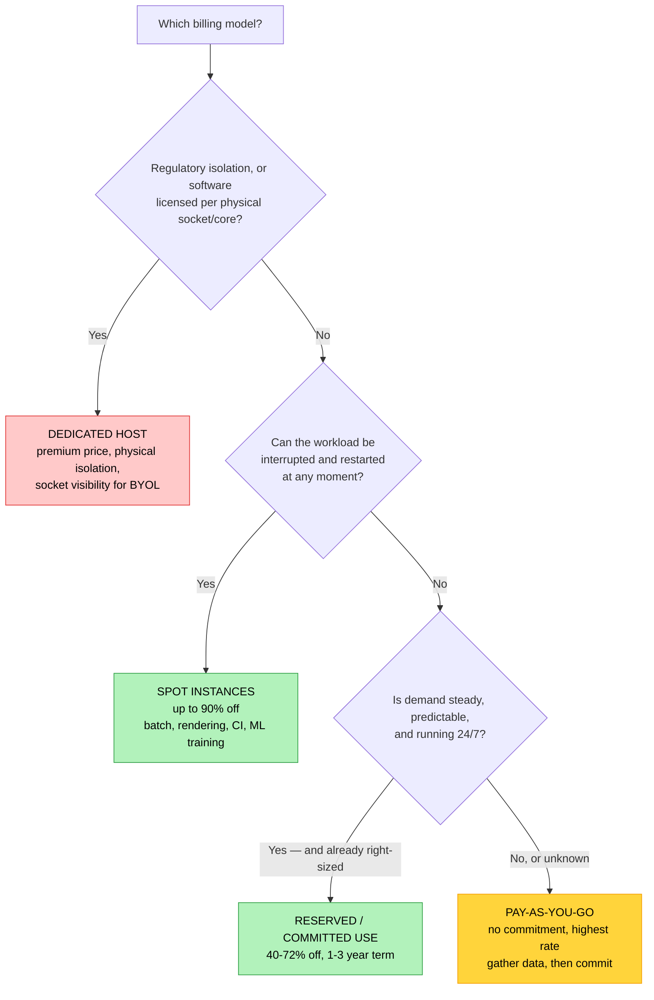

# Objective 1.8 — Summarize cost considerations related to cloud usage

> **Domain 1.0 — Cloud Architecture (23% of exam)** · Exam CV0-004 V4 · Objectives doc v5.0
> **Status:** Exam-ready · **Version:** 2.0 (enhanced) · Supersedes `full notes/Objective-1.8-Cost-Considerations.md`

---

## 0. How to use this note

| Pass | What to read | Time |
|---|---|---|
| **1st (learn)** | Sections 1 → 9 in order | ~55 min |
| **2nd (drill)** | Section 3.6 (billing model decision) + Section 7 (hidden costs) | ~20 min |
| **3rd (test)** | Section 12 (practice) + Section 13 (PBQ drills) | ~30 min |
| **Exam eve** | Section 14 (60-second recall sheet) only | ~5 min |

> 📌 **This is the shortest objective in Domain 1 and the easiest to score on.** The four billing models are almost free marks if you learn the commitment/discount/interruption trade-off precisely. Do not over-study it — but do not skip it either.

---

## 1. Official objective coverage

> **1.8 Summarize cost considerations related to cloud usage.**
> - **Billing models**
>   - Dedicated host
>   - Reserved resources
>   - Pay-as-you-go
>   - Spot instance
> - Resource metering
> - Tagging
> - Rightsizing

### 1.1 What the verb tells you

**"Summarize"** — the fourth verb style in Domain 1, and the lightest:

| Verb | Objectives | Depth demanded |
|---|---|---|
| "Given a scenario" | 1.1 | Judgement — apply to a situation |
| "Explain" | 1.2, 1.3, 1.5 | Precise definitions and mechanisms |
| "Compare and contrast" | 1.4, 1.6, 1.7 | Differences along specific axes |
| **"Summarize"** | **1.8** | **Recognise and describe at a high level** |

**Practical consequence:** you are not expected to calculate an amortised reserved-instance break-even. You *are* expected to pick the right billing model from a scenario, know what tagging and metering are for, and recognise rightsizing as the fix for over-provisioning. Aim for confident breadth, not depth.

### 1.2 Coverage checklist

- [ ] I can rank the four billing models by **discount** and by **flexibility**
- [ ] I know which model can be **reclaimed by the provider** and which workloads tolerate that
- [ ] I know why a **dedicated host** is chosen — and that it is a *premium*, not a discount
- [ ] I can distinguish a **dedicated host** from a **dedicated instance**
- [ ] I know what **resource metering** measures and the common billing units
- [ ] I can name at least four uses of **tagging** beyond cost
- [ ] I can describe the **rightsizing** workflow and what metric to look at
- [ ] I know the main **hidden costs**: egress, orphaned resources, idle non-prod, over-provisioning
- [ ] I know the difference between **showback** and **chargeback**
- [ ] I know **CapEx vs OpEx** and why cloud shifts the model

---

## 2. The core mental model

### 2.1 CapEx → OpEx: the fundamental shift

```text
   TRADITIONAL ON-PREM (CapEx)              CLOUD (OpEx)
   $ ▲                                      $ ▲
     │  ┌──┐                                  │        ╱╲    ╱╲
     │  │  │ big up-front purchase            │    ╱╲ ╱  ╲  ╱  ╲
     │  │  │ every 3-5 years                  │╱╲ ╱  ╲    ╲╱    ╲
     │  │  │                                  │  ╲╱          spend tracks
     │──┘  └──────────────                    │              actual usage
     └──────────────────► time                └──────────────────► time

   CAPITAL EXPENDITURE                      OPERATIONAL EXPENDITURE
   • Buy hardware up front                  • Pay as you consume
   • Depreciate over years                  • Expensed monthly
   • Must size for PEAK (and it sits        • Scale up and down with demand
     idle most of the time)                 • No idle capacity to fund
   • Procurement takes weeks/months         • Provision in minutes
   • Under-provision = you're stuck         • Under-provision = add capacity
   • Over-provision = sunk cost             • Over-provision = ongoing WASTE
```

> ⚠️ **The catch that funds this whole objective:** on-prem over-provisioning is a *one-time* sunk cost. Cloud over-provisioning is a **recurring monthly bill forever**. That is why rightsizing, tagging, and metering exist — waste compounds.

**TCO (Total Cost of Ownership)** is the honest comparison: on-prem TCO must include hardware, data-centre space, power, cooling, networking, licences, staff, refresh cycles, and spare capacity — not just the server price.

### 2.2 Where cloud money actually goes

```text
   ┌──────────────────────────────────────────────────────────────┐
   │  ① COMPUTE          instance-hours/seconds · the biggest     │
   │                     line item for most organisations         │
   ├──────────────────────────────────────────────────────────────┤
   │  ② STORAGE          GB-month + requests + retrieval          │
   ├──────────────────────────────────────────────────────────────┤
   │  ③ DATA TRANSFER    ★ egress to internet / cross-region /    │
   │                     cross-AZ · INGRESS is usually FREE       │
   ├──────────────────────────────────────────────────────────────┤
   │  ④ MANAGED SERVICES databases, queues, functions, API calls  │
   ├──────────────────────────────────────────────────────────────┤
   │  ⑤ NETWORK SERVICES load balancer hours + GB processed,      │
   │                     NAT gateway hours + GB, public IPs       │
   ├──────────────────────────────────────────────────────────────┤
   │  ⑥ LICENSING        OS and software licences (BYOL or        │
   │                     included in the hourly rate)             │
   ├──────────────────────────────────────────────────────────────┤
   │  ⑦ SUPPORT & OPS    support plan %, logging/monitoring       │
   │                     ingestion and retention                  │
   └──────────────────────────────────────────────────────────────┘
```

### 2.3 The cost-optimisation ladder — always work top-down

```text
   ① ELIMINATE      Turn off what nobody uses.
      ↓             Orphaned volumes, idle load balancers, forgotten
                    snapshots, dead non-prod environments.
                    → BIGGEST, FASTEST, ZERO-RISK win

   ② SCHEDULE       Stop non-production outside business hours.
      ↓             168 h/week → ~50 h/week = ~70% saved

   ③ RIGHTSIZE      Match capacity to measured demand.
      ↓             Typically 20-40% of compute spend

   ④ COMMIT         Reserve or commit the steady baseline
      ↓             once it is right-sized. 40-72% off.
                    ⚠ NEVER commit to an over-provisioned baseline —
                      you'd lock in the waste for 1-3 years

   ⑤ RE-ARCHITECT   Managed services, serverless, storage tiering,
                    caching, CDN to cut egress
```

> ★ **The order matters and is examinable.** Buying a three-year reservation for a VM that is 8% utilised locks in the waste. **Rightsize first, then commit.**

---

## 3. Billing models

### 3.1 The spectrum

```text
   MOST EXPENSIVE                                        CHEAPEST
   MOST FLEXIBLE                                     LEAST FLEXIBLE
   ◄──────────────────────────────────────────────────────────────►

   DEDICATED HOST   PAY-AS-YOU-GO      RESERVED         SPOT
   (premium price)   (baseline 0%)     (40-72% off)    (up to 90% off)
        │                 │                 │                │
   physical server   no commitment    1-3 yr commit    can be RECLAIMED
   to yourself       start/stop       pay even if      with ~2 min notice
   licensing &       any time         unused
   compliance
        │                 │                 │                │
   COMPLIANCE        UNKNOWN or        STEADY 24/7      INTERRUPTIBLE
   & LICENSING       SHORT-TERM        BASELINE         BATCH WORK
```

### 3.2 Pay-as-you-go (on-demand)

| | |
|---|---|
| **Definition** | Pay only for what you consume, billed by the second or hour, with **no commitment and no upfront payment**. |
| **Discount** | **0% — this is the baseline** every other model is measured against |
| **Strengths** | Maximum flexibility; start and stop freely; no forecasting required; no long-term risk |
| **Weaknesses** | **The highest per-hour rate.** Running 24/7 on-demand is the most expensive way to operate |
| **Best for** | New/unknown workloads, short-term projects, spiky and unpredictable demand, development and testing, the first weeks of any workload while you gather usage data before committing |
| **Exam triggers** | "no commitment", "unpredictable", "short-term", "we don't know the usage pattern yet", "temporary", "proof of concept" |

### 3.3 Reserved resources

| | |
|---|---|
| **Definition** | Commit to a defined amount of capacity for a **fixed term (typically 1 or 3 years)** in exchange for a substantial discount. |
| **Discount** | **~40–72%** — deeper for 3-year terms and larger upfront payments |
| **★ Trade-off** | **You pay for the term whether you use it or not.** An unused reservation is pure waste |
| **Variants** | **Term:** 1 year vs 3 years (longer = cheaper). **Payment:** all upfront (biggest discount) / partial upfront / no upfront. **Flexibility:** *standard* reservations are locked to an instance family (deepest discount); *convertible* ones can be exchanged for a different family at a smaller discount. **Scope:** regional (flexible across AZs) vs zonal (capacity reservation in one AZ) |
| **Best for** | **Steady, predictable, always-on baseline** — production databases, domain controllers, core application servers you know will run all year |
| **Exam triggers** | "runs 24/7", "predictable steady-state", "known baseline", "1-year or 3-year commitment", "reduce the cost of always-on workloads" |

> 💡 **Adjacent model worth recognising: savings plans / committed-use discounts.** Instead of committing to a specific instance type, you commit to a **level of spend per hour** (e.g. $10/hour for 3 years) and the discount applies automatically across instance families, sizes, regions, and sometimes serverless too. More flexible than a classic reservation at a similar discount. Not an official bullet, but a common distractor.

### 3.4 Spot instances

| | |
|---|---|
| **Definition** | Purchase the provider's **spare, unused capacity** at a steep discount, accepting that it can be **reclaimed at any time** when the provider needs it back. |
| **Discount** | **Up to ~90%** — the cheapest compute available |
| **★ Trade-off** | **The provider can terminate your instance**, typically with only a short warning (around two minutes). Capacity availability fluctuates |
| **Requirements** | The workload must be **fault-tolerant, stateless, interruptible, and restartable**. Use checkpointing so reclaimed work resumes rather than restarts. Diversify across instance types and AZs to reduce simultaneous reclamation |
| **Best for** | Batch processing, rendering, CI/CD build agents, big-data and analytics jobs, ML training with checkpoints, stateless web tiers behind a load balancer with on-demand fallback, queue workers |
| **★ Never use for** | Databases, stateful services, anything that cannot be interrupted, workloads with hard deadlines and no fallback |
| **Exam triggers** | "fault-tolerant", "batch job", "can be interrupted and restarted", "cheapest possible", "rendering", "flexible start and end time", "up to 90% discount" |

### 3.5 Dedicated host

| | |
|---|---|
| **Definition** | An **entire physical server allocated exclusively to your organisation** — no other tenant's workloads run on that hardware, and you get visibility into its sockets and cores. |
| **★ Cost direction** | **This is a PREMIUM, not a discount.** You pay for the whole machine whether or not you fill it |
| **Why choose it** | ① **Licensing** — software licensed **per physical socket or core** (BYOL) requires proof of the underlying hardware. ② **Compliance/regulatory** requirements for **physical isolation** from other tenants. ③ **Eliminating the noisy-neighbour risk** entirely. ④ Control over instance placement on known hardware |
| **Weaknesses** | Most expensive option; you must size and fill it yourself; wasted capacity if under-used |
| **Exam triggers** | "no other customer may share the hardware", "licensed per physical core/socket", "bring your own licence", "regulatory requirement for physical isolation", "single-tenant hardware" |

**Dedicated host vs dedicated instance — a real distinction the exam can use:**

| | **Dedicated instance** | **Dedicated host** |
|---|---|---|
| Hardware shared with other customers | ❌ No | ❌ No |
| **Visibility of sockets/cores/host ID** | ❌ **No** | ✅ **Yes** |
| Supports socket/core-based BYOL | ❌ Generally not | ✅ **Yes** |
| Control over instance placement | ❌ Instances may move between hosts | ✅ You control placement and affinity |
| Cost | Premium | **Highest premium** |

Both give physical isolation; **only the dedicated host gives the hardware visibility that per-socket licensing requires.**

### 3.6 Choosing a billing model



> 💡 **Real architectures blend them:** reserved instances for the always-on baseline, on-demand for predictable daytime peaks, and spot for the interruptible batch tier. A question describing "a steady baseline with unpredictable spikes and a nightly batch job" wants all three.

---

## 4. Resource metering

| | |
|---|---|
| **Definition** | The provider's continuous **measurement of consumption** for every billable dimension — the raw data from which invoices, budgets, and alerts are produced. |
| **Why it matters** | Metering is what makes cloud **pay-per-use** possible at all. It also enables **cost visibility**, **budgets and alerts**, **anomaly detection**, **chargeback**, and **capacity planning**. Without metering there is no accountability |
| **Related NIST characteristic** | "**Measured service**" is one of cloud computing's five essential characteristics — resource use is monitored, controlled, and reported transparently to both provider and consumer |
| **Exam triggers** | "measured service", "pay only for what you use", "usage data for billing", "track consumption", "granular billing" |

**Common metering dimensions:**

| Resource | Metered by | Typical unit |
|---|---|---|
| **Compute** | Running time × instance size | vCPU-hours, instance-seconds |
| **Block storage** | **Provisioned** capacity (not used!) | GB-month |
| **Object storage** | Stored volume + operations + retrieval | GB-month, per 1,000 requests, GB retrieved |
| **Provisioned IOPS/throughput** | What you reserved | IOPS-month, MB/s-month |
| **Data transfer** | **Egress** volume | GB out (**ingress is usually free**) |
| **Load balancer** | Hours running + data processed | Hours + GB (or capacity units) |
| **NAT gateway** | Hours running + data processed | Hours + GB |
| **Serverless functions** | Invocations + memory × duration | Requests + GB-seconds |
| **Managed database** | Instance-hours + storage + I/O + backups | Mixed |
| **API/managed services** | Number of calls | Per 1,000 requests |

> ⚠️ **Two metering traps.** ① **Block storage bills on provisioned size, not used size** — a 1 TB volume that is 4% full costs the same as a full one. ② Many services bill an **hourly charge just for existing**, independent of traffic — an idle load balancer or NAT gateway still costs money every hour.

---

## 5. Tagging

| | |
|---|---|
| **Definition** | Attaching **key-value metadata labels** to cloud resources (`Environment=Production`, `CostCenter=CC-1042`, `Owner=jdoe`) so they can be identified, grouped, reported on, and automated. |
| **Why it matters for cost** | Without tags a cloud bill is **one unexplained lump sum**. Tags are what turn it into "Marketing spent $4,200, Engineering spent $11,000" — which is the prerequisite for **cost allocation, showback, and chargeback** |
| **★ Uses beyond cost** | **Automation** (stop everything tagged `Environment=Dev` at 19:00) · **Access control** (attribute-based policies) · **Accountability** (who owns this?) · **Compliance** (data classification, sovereignty) · **Operations** (backup schedules, patch groups) · **Lifecycle** (expiry dates on temporary resources) |
| **Exam triggers** | "allocate costs to departments", "identify resource owners", "group resources for reporting", "chargeback", "which team is spending what", "find untagged resources" |

**A practical tagging schema:**

| Tag key | Example value | Purpose |
|---|---|---|
| `Environment` | `Prod` / `Dev` / `Test` | Separate production from waste-prone non-prod |
| `CostCenter` | `CC-1042` | Chargeback to a business unit |
| `Owner` | `jdoe@corp.com` | Accountability — someone to ask before deleting |
| `Project` | `Atlas` | Track initiative spend |
| `Application` | `checkout-api` | Per-service unit economics |
| `DataClassification` | `Confidential` | Compliance and control selection |
| `ExpiryDate` | `2026-12-31` | Automatic cleanup of temporary resources |

**Tagging governance — the part that actually decides success:**

| Practice | Why |
|---|---|
| **Mandatory tags enforced at creation** | Policy blocks or auto-tags untagged resources — retro-tagging thousands of resources never happens |
| **Consistent naming and case** | `env`, `Env`, and `Environment` become three separate report lines |
| **Controlled allowed values** | Free-text values fragment reports (`prod`, `production`, `PROD`) |
| **Automated tagging** | Applied by IaC templates, not by hand (see 2.5) |
| **Regular untagged audits** | Untagged resources are the ones nobody owns — and the ones quietly wasting money |

> ⚠️ **The single most common tagging failure:** tags are optional, so ~40% of resources are untagged, and the untagged bucket is exactly where orphaned waste hides. **Enforce tags at provisioning time via policy and IaC.**

---

## 6. Rightsizing

| | |
|---|---|
| **Definition** | Continuously adjusting provisioned resources — instance type, vCPU, memory, disk size and IOPS, database tier — so capacity **matches measured demand**. |
| **Why it matters** | **Over-provisioning is the single largest source of cloud waste.** Teams size for imagined peaks, or lift-and-shift on-prem specs that were themselves sized for a 5-year horizon. Typical savings: **20–40% of compute spend with no performance impact** |
| **Both directions** | Rightsizing means **down**sizing waste *and* **up**sizing anything that is throttled — the goal is *correct*, not merely smaller |
| **Exam triggers** | "CPU utilisation is consistently 8%", "instances are over-provisioned", "reduce cost without affecting performance", "match capacity to actual demand", "the VM is far larger than it needs to be" |

### 6.1 The rightsizing workflow

```text
   ① OBSERVE      Collect at least 2-4 WEEKS of metrics.
      ↓           CPU, MEMORY, disk IOPS/throughput, network.
                  ⚠ Memory is often the real constraint and is
                    frequently not collected by default.

   ② ANALYSE      Look at PERCENTILES, not averages.
      ↓           Average 10% CPU with a p99 of 95% means the
                  workload is spiky — sizing to the average
                  will break it.
                  Watch full business cycles: month-end, payroll,
                  seasonal peaks.

   ③ RESIZE       Move down a size (or family) leaving headroom.
      ↓           Consider a better-matched family: compute-
                  optimised, memory-optimised, burstable.

   ④ VERIFY       Confirm performance is unaffected after the change.
      ↓           Roll back if it is not.

   ⑤ REPEAT       Rightsizing is CONTINUOUS, not a one-off project.
                  Workloads drift.
```

### 6.2 Rightsizing vs the adjacent levers

| Lever | What it changes |
|---|---|
| **Rightsizing** | The **size** of each instance (vertical) |
| **Auto-scaling** | The **number** of instances, dynamically (horizontal — see 3.2) |
| **Scheduling** | **When** instances run at all |
| **Storage tiering** | The **class** of storage the data sits on (see 1.4) |
| **Re-architecting** | Replacing the resource with a managed or serverless equivalent |

> 💡 **Rightsize before you commit.** Buying a three-year reservation for an over-provisioned instance locks in the waste for three years — the most expensive mistake in this objective.

---

## 7. Hidden costs and where waste lives

### 7.1 The costs that surprise people

| Cost | Why it surprises |
|---|---|
| **Egress / data transfer** | Ingress is free, so teams forget outbound is charged. Cross-AZ, cross-region, and internet egress all bill — and it is what makes multicloud and cloud exit expensive |
| **Idle resources with hourly charges** | Load balancers, NAT gateways, and unattached public IPs bill **per hour just for existing**, with zero traffic |
| **Orphaned resources** | Unattached volumes, old snapshots, unused images, and incomplete multipart uploads bill indefinitely because nothing points at them |
| **Non-production running 24/7** | Dev and test environments used ~50 hours a week but billed for 168 |
| **Over-provisioned everything** | Instances, volumes, provisioned IOPS, database tiers |
| **Retrieval and early-deletion fees** | Cold and archive storage tiers (see 1.4) |
| **Logging and monitoring** | Ingestion and long retention of verbose logs can rival compute cost |
| **Licensing** | Windows/commercial software included in the hourly rate can double it — BYOL may be cheaper |
| **Support plans** | Often a percentage of total spend, so they scale with everything else |
| **Snapshot accumulation** | Incremental, but hundreds of retained snapshots add up |

### 7.2 Scheduling — the easiest large win

```text
   A WEEK = 168 HOURS

   ALWAYS ON      ████████████████████████████████████  168 h = 100%
   BUSINESS HRS   ██████████                              50 h ≈ 30%
   (10 h × 5 days)
                                                    ► ~70% SAVED

   Applies to: dev, test, staging, QA, training, demo, build agents,
               analytics clusters, virtual desktops.
   Implemented with: tag-driven schedules (Environment=Dev → stop 19:00,
               start 07:00 Mon-Fri).
   ⚠ Does NOT apply to production.
```

### 7.3 Governance and FinOps

| Control | What it does |
|---|---|
| **Budgets and alerts** | Notify (or act) when spend crosses a threshold or is forecast to |
| **Anomaly detection** | Flags unusual spend patterns automatically — catches a runaway process or a compromised account |
| **Quotas / service limits** | Cap how much can be provisioned in the first place |
| **Policy enforcement** | Block expensive instance types or untagged resources at creation |
| **Cost dashboards and reports** | Per-team, per-project, per-service visibility |
| **Unit economics** | Cost per customer, per transaction, per GB processed — the metric that shows whether spend is *healthy* rather than merely low |

**Showback vs chargeback — know the difference:**

| | **Showback** | **Chargeback** |
|---|---|---|
| What happens | Teams are **shown** what they cost | Costs are **actually billed** to the team's budget |
| Accountability | Awareness and social pressure | **Financial** — it hits their P&L |
| Effort | Lower — reporting only | Higher — needs accurate allocation and finance buy-in |
| Effect | Moderate behaviour change | **Strong** behaviour change |
| Prerequisite | **Tagging** | **Accurate, enforced tagging** |

**FinOps** is the operating model that ties this together — a collaboration between finance, engineering, and business, run as a continuous cycle:

```text
   INFORM  →  OPTIMIZE  →  OPERATE  →  (repeat)
   visibility,  rightsize,   govern,
   allocation,  commit,      automate,
   budgets      eliminate    continuously improve
```

---

## 8. Comparison tables

### 8.1 ★ The four billing models

| | **Pay-as-you-go** | **Reserved** | **Spot** | **Dedicated host** |
|---|---|---|---|---|
| **Discount vs on-demand** | **0% (baseline)** | **40–72%** | **up to 90%** | **Premium (costs more)** |
| Commitment | **None** | **1 or 3 years** | None | Term or on-demand |
| Upfront payment | None | None / partial / all | None | Varies |
| **Can be reclaimed by provider** | ❌ No | ❌ No | ✅ **Yes, ~2 min notice** | ❌ No |
| Flexibility | **Highest** | Low | Medium | Low |
| Tenancy | Shared | Shared | Shared | **Single-tenant physical** |
| Socket/core visibility | ❌ | ❌ | ❌ | ✅ **Yes (BYOL)** |
| **Best for** | Unknown, spiky, short-term | **Steady 24/7 baseline** | **Interruptible batch** | **Licensing & compliance** |
| Main risk | Highest running cost | **Paying for unused commitment** | **Interruption** | Paying for an under-filled server |

### 8.2 Which lever for which symptom

| Symptom | Lever |
|---|---|
| Instances at 8% CPU all month | **Rightsizing** |
| Dev environment billed 24/7 but used 9–6 | **Scheduling / auto-shutdown** |
| Bill is a lump sum with no team attribution | **Tagging → showback/chargeback** |
| Steady production workload on on-demand pricing | **Reserved / committed use** |
| Nightly render job costing too much | **Spot instances** |
| Software licensed per physical socket | **Dedicated host** |
| Unattached volumes and old snapshots | **Eliminate orphaned resources** |
| Cold data sitting in the hot tier | **Storage tiering / lifecycle** (1.4) |
| Egress charges dominating the bill | **CDN, caching, keep traffic in-region** (1.3) |
| Sudden unexplained spend spike | **Budget alerts + anomaly detection** |
| Capacity varies hour to hour | **Auto-scaling** (3.2) |

### 8.3 Multi-cloud terminology

| Concept | AWS | Azure | Google Cloud |
|---|---|---|---|
| Pay-as-you-go | On-Demand | Pay-as-you-go | On-demand |
| Reserved | Reserved Instances | Reserved VM Instances | Committed Use Discounts |
| Flexible commitment | Savings Plans | Savings Plans | Flexible CUDs |
| Spare capacity | **Spot Instances** | **Spot VMs** | **Spot VMs / Preemptible** |
| Single-tenant hardware | **Dedicated Hosts** / Dedicated Instances | **Dedicated Host** | **Sole-tenant nodes** |
| Cost reporting | Cost Explorer, CUR | Cost Management + Billing | Cloud Billing reports |
| Budgets & alerts | AWS Budgets | Azure Budgets | Budgets & alerts |
| Rightsizing advice | Compute Optimizer, Trusted Advisor | Azure Advisor | Recommender |
| Tag enforcement | Tag Policies, SCPs | Azure Policy | Organization Policy, labels |

---

## 9. Exam traps & distractor patterns

| # | Trap | The truth |
|---|---|---|
| 1 | "A dedicated host is a way to save money" | It is a **premium**. It is chosen for **licensing and compliance**, not cost reduction |
| 2 | "Spot instances are just cheaper on-demand" | The provider can **reclaim them with ~2 minutes' notice**. Only fault-tolerant, restartable workloads qualify |
| 3 | "Use spot for the production database" | Never. Stateful, uninterruptible workloads cannot tolerate reclamation |
| 4 | "Reserved instances always save money" | Only if the capacity is **actually used** for the whole term. An idle reservation is 100% waste |
| 5 | "Buy reservations first, then optimise" | **Rightsize first.** Committing to an over-provisioned baseline locks in the waste for 1–3 years |
| 6 | "Data transfer is free" | **Ingress** is usually free; **egress** to the internet, another region, or another AZ is charged |
| 7 | "Block storage bills for what you use" | It bills for what you **provision**. A 4%-full 1 TB volume costs the same as a full one |
| 8 | "An idle load balancer costs nothing" | Load balancers, NAT gateways, and unattached public IPs bill **hourly just for existing** |
| 9 | "Tagging is only for cost allocation" | Also automation, access control, compliance, backup policy, ownership, and lifecycle |
| 10 | "Tags can be added later" | In practice they never are. **Enforce at creation** via policy and IaC |
| 11 | "Rightsizing means making everything smaller" | It means making everything **correct** — including scaling *up* what is throttled |
| 12 | "Average CPU is the metric for rightsizing" | Use **p95/p99 percentiles** over weeks. A 10% average with a 95% p99 is spiky, not idle |
| 13 | "Showback and chargeback are the same" | Showback **reports** cost; chargeback **bills** it to the team's budget |
| 14 | "Cloud is always cheaper than on-prem" | Only with governance. **Un-managed cloud is frequently more expensive** — over-provisioning becomes a permanent monthly cost rather than a one-time one |
| 15 | "Auto-scaling and rightsizing are the same" | Rightsizing changes instance **size**; auto-scaling changes instance **count** |
| 16 | "Metering is just for the invoice" | It also drives budgets, alerts, anomaly detection, capacity planning, and chargeback |
| 17 | "Reserved instances can be reclaimed by the provider" | **No — only spot instances can.** Reservations guarantee your capacity |
| 18 | "A dedicated instance supports per-socket BYOL" | Only a **dedicated host** exposes socket/core/host visibility required for that licensing |

**Disambiguation drill:**

| Pair | The deciding question |
|---|---|
| **Reserved vs spot** | Can the workload be **interrupted**? Yes → spot. No, and it's always on → reserved |
| **Reserved vs on-demand** | Is demand **steady and predictable** for a year or more? |
| **Dedicated host vs reserved** | Is the driver **licensing/compliance** (host) or **cost on steady load** (reserved)? |
| **Dedicated host vs dedicated instance** | Do you need **socket/core visibility for BYOL**? → host |
| **Rightsizing vs auto-scaling** | Change the **size** of one instance vs the **number** of instances |
| **Showback vs chargeback** | Report only, or actually **bill** the team? |
| **Tagging vs metering** | Tags say **whose** it is; metering says **how much** was used |

---

## 10. Keyword → answer trigger table

| If you see… | Think |
|---|---|
| no commitment · unpredictable · short-term · proof of concept · we don't know usage yet | **Pay-as-you-go** |
| runs 24/7 · steady predictable baseline · 1-year or 3-year term · reduce always-on cost | **Reserved resources** |
| fault-tolerant · batch · rendering · can restart · cheapest possible · up to 90% off · interruptible | **Spot instances** |
| licensed per physical socket/core · BYOL · no other tenant on the hardware · regulatory physical isolation | **Dedicated host** |
| physical isolation but no socket visibility needed | **Dedicated instance** |
| commit to a dollar amount per hour, flexible across families | **Savings plan / committed use discount** |
| measured service · pay only for what you use · usage data behind the invoice | **Resource metering** |
| allocate costs to departments · who owns this · group for reporting · chargeback | **Tagging** |
| CPU at 8% for a month · over-provisioned · reduce cost with no performance impact | **Rightsizing** |
| dev environment billed all week but used 9–6 | **Scheduling / auto-shutdown (~70% saving)** |
| unattached volumes · old snapshots · unused IPs · nothing points at them | **Orphaned resources — eliminate** |
| egress charges dominate the bill | **Data transfer — use a CDN, keep traffic in-region** |
| bill is one lump sum with no attribution | **Missing tagging** |
| teams see their costs but are not billed | **Showback** |
| costs are billed to the team's own budget | **Chargeback** |
| sudden unexplained spike in spend | **Budget alerts + anomaly detection** |
| collaboration of finance and engineering, continuous cycle | **FinOps (inform → optimize → operate)** |
| big up-front purchase vs monthly consumption | **CapEx vs OpEx** |

---

## 11. Practice questions

<details>
<summary><b>Q1.</b> A nightly video-rendering job takes six hours, can restart any failed frame, and has no fixed deadline. Which billing model is MOST cost-effective?</summary>

A. Pay-as-you-go · B. Reserved instances · **C. Spot instances** · D. Dedicated host

**Correct: C — spot.** Fault-tolerant, restartable, schedule-flexible work is the textbook spot use case, at up to 90% off.
- **A wrong:** On-demand is the most expensive per-hour rate.
- **B wrong:** Reservations suit continuous workloads; a six-hour nightly job would leave the commitment idle most of the day.
- **D wrong:** A dedicated host is a premium option for licensing and compliance.
</details>

<details>
<summary><b>Q2.</b> An organisation runs a legacy database licensed per physical CPU socket and must prove no other tenant shares the hardware. Which option satisfies this?</summary>

A. Reserved instances · B. Spot instances · **C. Dedicated host** · D. Pay-as-you-go

**Correct: C.** Only a dedicated host provides an exclusive physical server **with socket and core visibility**, which is what per-socket BYOL and physical-isolation audits require.
- **A wrong:** Reservations are a pricing construct on shared hardware.
- **B wrong:** Spot runs on shared, reclaimable capacity.
- **D wrong:** On-demand instances run on multi-tenant hardware.
</details>

<details>
<summary><b>Q3.</b> Which billing model can be terminated by the cloud provider with only a few minutes' notice?</summary>

A. Reserved · B. Pay-as-you-go · **C. Spot** · D. Dedicated host

**Correct: C.** Spot uses the provider's spare capacity, which is reclaimed when needed — typically with about two minutes' warning.
- **A wrong:** Reservations guarantee capacity for the term.
- **B wrong:** On-demand instances run until you stop them.
- **D wrong:** A dedicated host is exclusively yours.
</details>

<details>
<summary><b>Q4.</b> A production web tier runs continuously at consistent load and is already correctly sized. What is the BEST way to reduce its cost?</summary>

A. Move it to spot instances · **B. Purchase reserved capacity or a committed-use discount for a 1- or 3-year term** · C. Move it to a dedicated host · D. Leave it on-demand

**Correct: B.** Steady, predictable, always-on load is exactly what reservations discount, typically by 40–72%.
- **A wrong:** A production web tier cannot tolerate arbitrary reclamation without a fallback design.
- **C wrong:** Dedicated hosts cost more, not less.
- **D wrong:** On-demand is the most expensive option for continuous workloads.
</details>

<details>
<summary><b>Q5.</b> Monitoring shows a fleet of instances averaging 8% CPU with a p99 of 22% over four weeks. What action reduces cost with minimal risk?</summary>

**A. Rightsize the instances to a smaller type** · B. Purchase 3-year reservations at the current size · C. Move them to spot · D. Move them to a dedicated host

**Correct: A — rightsizing.** Both the average and the p99 show substantial headroom, so a smaller instance type will cut cost without affecting performance.
- **B wrong:** Committing at the current size locks in the over-provisioning for three years — the classic mistake.
- **C wrong:** Spot introduces interruption risk unrelated to the sizing problem.
- **D wrong:** That increases cost.
</details>

<details>
<summary><b>Q6.</b> A finance team receives a single cloud invoice with no breakdown by department. What is the PREREQUISITE for allocating these costs?</summary>

A. Reserved instances · **B. A tagging strategy applied consistently across resources** · C. Rightsizing · D. Spot instances

**Correct: B.** Tags are the metadata that lets billing data be grouped by cost centre, project, or owner — the foundation of showback and chargeback.
- **A/C/D wrong:** All are cost-reduction techniques, none provide attribution.
</details>

<details>
<summary><b>Q7.</b> Which statement about data transfer costs is CORRECT?</summary>

A. Both ingress and egress are always free · B. Ingress is charged, egress is free · **C. Ingress is generally free while egress to the internet or another region is charged** · D. Transfer costs apply only to object storage

**Correct: C.** The asymmetry is deliberate — getting data in is easy and free, getting it out costs, which is what makes exit and multicloud expensive.
- **A/B wrong:** They invert or ignore the asymmetry.
- **D wrong:** Transfer charges apply across services.
</details>

<details>
<summary><b>Q8.</b> Development and test environments run 24/7 but are only used during business hours. What is the simplest large saving?</summary>

A. Buy reserved instances for them · **B. Schedule automatic shutdown outside business hours, saving roughly 70%** · C. Move them to a dedicated host · D. Increase their instance size

**Correct: B.** 168 hours a week reduced to about 50 is roughly a 70% cut, with no architectural change.
- **A wrong:** Reserving capacity that sits idle 70% of the time is the wrong direction.
- **C wrong:** That increases cost.
- **D wrong:** That also increases cost.
</details>

<details>
<summary><b>Q9.</b> What does resource metering provide?</summary>

A. Automatic cost reduction · **B. Continuous measurement of consumption, providing the data behind invoices, budgets, alerts, and chargeback** · C. Physical isolation of hardware · D. Discounted pricing for commitments

**Correct: B.** Metering is measurement — the "measured service" characteristic that makes pay-per-use possible and enables all downstream cost governance.
- **A wrong:** It measures; it does not optimise.
- **C wrong:** That is a dedicated host.
- **D wrong:** That is reserved pricing.
</details>

<details>
<summary><b>Q10.</b> Which is a valid use of tagging BEYOND cost allocation?</summary>

A. Increasing instance performance · **B. Driving automation such as stopping all resources tagged `Environment=Dev` outside business hours** · C. Reducing data transfer charges · D. Guaranteeing capacity

**Correct: B.** Tags drive automation, access control, compliance classification, backup policy, and lifecycle management.
- **A/C/D wrong:** None are functions of metadata labels.
</details>

<details>
<summary><b>Q11.</b> A company purchases 3-year reservations for instances that later prove to be heavily over-provisioned. What is the consequence?</summary>

A. The reservation automatically resizes · **B. The over-provisioning is locked in for three years, and the reservation is paid for whether used or not** · C. The provider refunds the difference · D. The instances are converted to spot

**Correct: B.** This is why the correct order is **rightsize first, then commit**. Convertible reservations offer some exchange flexibility, but standard ones do not.
- **A/C/D wrong:** None occur automatically.
</details>

<details>
<summary><b>Q12.</b> What is the difference between showback and chargeback?</summary>

A. They are identical · **B. Showback reports each team's costs for visibility; chargeback actually bills those costs to the team's budget** · C. Showback bills teams; chargeback only reports · D. Both require no tagging

**Correct: B.** Chargeback creates real financial accountability and therefore drives stronger behaviour change — but demands accurate, enforced tagging.
- **A/C wrong:** The definitions are distinct and not reversed.
- **D wrong:** Both depend on tagging; chargeback especially so.
</details>

<details>
<summary><b>Q13.</b> A 1 TB block volume is only 5% full. How is it billed?</summary>

A. For 50 GB, the amount used · **B. For the full 1 TB provisioned** · C. Only for the I/O performed · D. It is free below 10% utilisation

**Correct: B.** Block storage bills on **provisioned** capacity, which is why right-sizing volumes matters as much as right-sizing instances.
- **A/C/D wrong:** None reflect how block storage is metered.
</details>

<details>
<summary><b>Q14.</b> Which resources commonly generate charges even when completely idle?</summary>

A. Only running compute instances · **B. Load balancers, NAT gateways, unattached public IPs, unattached volumes, and retained snapshots** · C. Nothing is charged when idle · D. Only object storage

**Correct: B.** Many services bill an hourly charge simply for existing, and orphaned storage bills indefinitely because nothing points at it.
- **A/C/D wrong:** They understate where idle cost accumulates.
</details>

<details>
<summary><b>Q15.</b> Which metric should drive a rightsizing decision?</summary>

A. Peak CPU from a single day · **B. Percentiles such as p95/p99 across at least two to four weeks, including memory** · C. The average CPU over one hour · D. The instance's list price

**Correct: B.** Percentiles over a full business cycle reveal both the sustained need and the spikes; averages hide bursts and single days hide cycles. Memory is frequently the binding constraint.
- **A/C wrong:** Both sample too short a window.
- **D wrong:** Price is the outcome, not the input.
</details>

<details>
<summary><b>Q16.</b> Which statement about the CapEx-to-OpEx shift is MOST accurate?</summary>

A. Cloud eliminates all cost risk · **B. Cloud converts large periodic capital purchases into ongoing operational spend that tracks usage — but over-provisioning becomes a recurring monthly cost instead of a one-time one** · C. OpEx always costs less than CapEx · D. CapEx applies only to storage

**Correct: B.** The shift is real, and so is the catch that makes governance essential.
- **A wrong:** It changes the risk profile rather than removing risk.
- **C wrong:** Un-governed cloud is frequently more expensive than on-prem.
- **D wrong:** CapEx covers all purchased infrastructure.
</details>

<details>
<summary><b>Q17.</b> An organisation wants a commitment discount but cannot predict which instance families it will need. What is MOST appropriate?</summary>

A. Standard reserved instances locked to one family · **B. A savings plan or flexible committed-use discount based on hourly spend** · C. Spot instances · D. Dedicated hosts

**Correct: B.** Committing to a level of spend rather than a specific instance type preserves flexibility across families, sizes, and regions at a comparable discount.
- **A wrong:** Standard reservations are locked to a family, which is precisely the constraint they cannot accept.
- **C wrong:** Spot offers no commitment discount and carries interruption risk.
- **D wrong:** Dedicated hosts cost more and address a different problem.
</details>

<details>
<summary><b>Q18.</b> Which of the following is the FIRST step in a cost-optimisation programme?</summary>

**A. Identify and eliminate unused and orphaned resources** · B. Purchase 3-year reservations · C. Migrate to a different cloud provider · D. Increase instance sizes to improve efficiency

**Correct: A.** Elimination is the largest, fastest, zero-risk saving — you cannot optimise something that should not exist. Commitment comes after rightsizing.
- **B wrong:** Committing before eliminating and rightsizing locks in waste.
- **C wrong:** Migration is costly and does not address the underlying waste.
- **D wrong:** That increases spend.
</details>

<details>
<summary><b>Q19.</b> A team's cloud bill spikes overnight with no planned change. Which control would have alerted them fastest?</summary>

A. Reserved instance purchase · **B. Budget alerts combined with cost anomaly detection** · C. Tagging alone · D. Rightsizing

**Correct: B.** Budgets flag threshold breaches and anomaly detection identifies unusual patterns automatically — the standard early warning for runaway processes or compromised credentials.
- **A/D wrong:** Both are optimisation actions, not detection controls.
- **C wrong:** Tagging enables attribution but does not itself alert.
</details>

<details>
<summary><b>Q20.</b> What distinguishes a dedicated host from a dedicated instance?</summary>

A. Only the dedicated instance provides single-tenant hardware · **B. Both provide single-tenant hardware, but only the dedicated host exposes socket, core, and host visibility needed for per-socket BYOL and placement control** · C. They are identical · D. Dedicated hosts are cheaper

**Correct: B.** Both isolate you from other tenants; only the host gives the hardware visibility that socket-based licensing requires.
- **A wrong:** Both are single-tenant.
- **C wrong:** The licensing distinction is real and examinable.
- **D wrong:** Dedicated hosts carry the highest premium.
</details>

<details>
<summary><b>Q21.</b> An architecture has a steady always-on baseline, predictable daytime peaks, and a nightly interruptible batch job. What is the MOST cost-effective combination?</summary>

A. All on-demand · B. All reserved · **C. Reserved for the baseline, on-demand for the daytime peaks, spot for the batch tier** · D. All spot

**Correct: C.** Blending models to match each workload's characteristics is the standard approach and the highest-scoring answer pattern for this objective.
- **A wrong:** The baseline would pay the highest rate unnecessarily.
- **B wrong:** Reserving peak and batch capacity leaves commitments idle.
- **D wrong:** The always-on baseline cannot tolerate reclamation.
</details>

<details>
<summary><b>Q22.</b> Roughly 40% of an organisation's resources are untagged, and those resources contain most of its waste. What is the BEST remedy?</summary>

A. Manually tag everything once a year · **B. Enforce mandatory tags at creation through policy and infrastructure as code, and audit for untagged resources regularly** · C. Delete all untagged resources immediately · D. Switch to spot instances

**Correct: B.** Tags must be applied at provisioning time — retro-tagging at scale reliably fails, and untagged resources are exactly the ones nobody owns.
- **A wrong:** An annual manual pass cannot keep pace with provisioning.
- **C wrong:** Deleting untagged resources without investigation risks destroying production.
- **D wrong:** Unrelated to attribution.
</details>

<details>
<summary><b>Q23.</b> Which describes the FinOps operating model?</summary>

A. A tool that automatically reduces cloud bills · **B. A continuous collaboration between finance, engineering, and business — inform, optimize, operate** · C. A billing model offered by providers · D. A compliance framework for data residency

**Correct: B.** FinOps is a cultural and operational practice, not a product or a pricing option.
- **A wrong:** No tool substitutes for the practice.
- **C wrong:** It is not a pricing model.
- **D wrong:** Data residency is a compliance concern.
</details>

<details>
<summary><b>Q24.</b> What is the difference between rightsizing and auto-scaling?</summary>

A. They are the same technique · **B. Rightsizing adjusts the size of an instance; auto-scaling adjusts the number of instances in response to demand** · C. Rightsizing is automatic; auto-scaling is manual · D. Auto-scaling only applies to storage

**Correct: B.** One is vertical and periodic; the other is horizontal and continuous. They are complementary.
- **A wrong:** They operate on different dimensions.
- **C wrong:** Auto-scaling is the automated one.
- **D wrong:** Auto-scaling applies to compute.
</details>

<details>
<summary><b>Q25.</b> Which is the MOST accurate statement about spot instance best practice?</summary>

A. Use them for all production workloads to maximise savings · **B. Diversify across instance types and availability zones, implement checkpointing, and keep an on-demand fallback for capacity gaps** · C. They never get reclaimed if you bid high enough · D. They are only useful for storage

**Correct: B.** Diversification reduces the chance of simultaneous reclamation, checkpointing preserves progress, and a fallback maintains throughput when spare capacity disappears.
- **A wrong:** Stateful and uninterruptible production workloads are unsuitable.
- **C wrong:** Reclamation is driven by the provider's capacity needs.
- **D wrong:** Spot is a compute purchasing option.
</details>

---

## 12. PBQ-style drills

### Drill A — Match the workload to the billing model

| # | Workload | Model? |
|---|---|---|
| 1 | Production domain controllers running 24/7 for years | |
| 2 | Two-week proof of concept with unknown usage | |
| 3 | Machine-learning training with checkpoints, flexible timing | |
| 4 | Database licensed per physical socket, audited for isolation | |
| 5 | CI/CD build agents that can be restarted freely | |
| 6 | Seasonal peak capacity for six weeks a year | |

<details><summary>Answers</summary>

1 → **Reserved** (steady, predictable, long-lived)
2 → **Pay-as-you-go** (no commitment while gathering data)
3 → **Spot** (interruptible with checkpointing)
4 → **Dedicated host** (socket visibility for BYOL + physical isolation)
5 → **Spot** (stateless, restartable)
6 → **Pay-as-you-go** (too short to justify a 1-year commitment)
</details>

### Drill B — Diagnose the cost problem

| # | Symptom | Cause + lever? |
|---|---|---|
| 1 | Bill is a lump sum; nobody knows which team spends what | |
| 2 | 200 instances averaging 9% CPU | |
| 3 | Staging environment billed for 168 h/week, used ~45 h | |
| 4 | $900/month for volumes not attached to anything | |
| 5 | Egress is 30% of the total bill | |
| 6 | Reservations purchased but utilisation is 40% | |
| 7 | Spend jumped 300% overnight with no release | |

<details><summary>Answers</summary>

1 → **No tagging** → enforce mandatory tags at creation, then showback/chargeback
2 → **Over-provisioning** → rightsize (check p95/p99 and memory first)
3 → **Non-prod running 24/7** → tag-driven scheduling, ~70% saving
4 → **Orphaned resources** → eliminate; this is step ① of the ladder
5 → **Data transfer** → CDN, caching, keep traffic in-region, private endpoints
6 → **Committed before rightsizing** → exchange convertible reservations if possible; rightsize first next time
7 → **Anomaly** → budget alerts + anomaly detection; investigate runaway process or compromised credentials
</details>

### Drill C — Order the optimisation levers

Put these in the correct order of application: *commit to reservations · rightsize instances · eliminate orphaned resources · schedule non-production shutdown · re-architect to managed services*

<details><summary>Answer</summary>

1. **Eliminate** orphaned/unused resources — biggest, fastest, zero risk
2. **Schedule** non-production shutdown — ~70% on those environments
3. **Rightsize** to measured demand — 20–40% of compute
4. **Commit** (reserve) the now-correct steady baseline — 40–72%
5. **Re-architect** to managed/serverless, storage tiering, CDN

**The critical ordering rule:** never commit (step 4) before rightsizing (step 3), or you lock in waste for the full term.
</details>

### Drill D — Metering units

State the billing unit for each.

| # | Resource |
|---|---|
| 1 | Virtual machine |
| 2 | Block storage volume |
| 3 | Object storage |
| 4 | Internet egress |
| 5 | Serverless function |
| 6 | NAT gateway |

<details><summary>Answers</summary>

1 → **Instance-hours/seconds** (by size)
2 → **GB-month provisioned** (not used) — plus provisioned IOPS/throughput if applicable
3 → **GB-month stored + per-1,000 requests + GB retrieved**
4 → **GB transferred out** (ingress typically free)
5 → **Invocations + GB-seconds** (memory × duration)
6 → **Hours running + GB processed** — bills even when idle
</details>

---

## 13. 60-second recall sheet

```text
╔══════════════════════════════════════════════════════════════════════╗
║  1.8 — COST CONSIDERATIONS   (verb = "SUMMARIZE" → breadth, not      ║
║                                depth. Easiest marks in Domain 1.)    ║
╠══════════════════════════════════════════════════════════════════════╣
║  ★ THE FOUR BILLING MODELS                                           ║
║   PAY-AS-YOU-GO  0% discount (BASELINE) · no commitment · MOST       ║
║                  EXPENSIVE per hour → unknown/short/spiky            ║
║   RESERVED       40-72% off · 1-3 YEAR COMMIT · pay even if unused   ║
║                  → STEADY 24/7 BASELINE                              ║
║   SPOT           up to 90% off · PROVIDER CAN RECLAIM (~2 min)       ║
║                  → FAULT-TOLERANT BATCH ONLY. Never a database.      ║
║   DEDICATED HOST ★ A PREMIUM, NOT A DISCOUNT · whole physical server ║
║                  → per-SOCKET LICENSING (BYOL) + compliance          ║
║                  vs DEDICATED INSTANCE: isolated too, but NO socket  ║
║                  visibility → cannot support socket-based BYOL       ║
║   (Savings plan = commit to $/hour, flexible across families)        ║
╠══════════════════════════════════════════════════════════════════════╣
║  ★ OPTIMISATION LADDER — WORK IN THIS ORDER                          ║
║   ① ELIMINATE orphans (biggest, fastest, zero risk)                  ║
║   ② SCHEDULE non-prod off-hours  168h → 50h = ~70% SAVED             ║
║   ③ RIGHTSIZE to measured demand (20-40% of compute)                 ║
║   ④ COMMIT the baseline  ⚠ NEVER commit before rightsizing —         ║
║                            you lock in the waste for 1-3 years       ║
║   ⑤ RE-ARCHITECT: managed services, tiering, CDN                     ║
╠══════════════════════════════════════════════════════════════════════╣
║  METERING = measured service; the data behind invoices/budgets       ║
║   compute=instance-hours · block=GB-month PROVISIONED (not used!) ·  ║
║   object=GB+requests+retrieval · egress=GB OUT (ingress FREE) ·      ║
║   serverless=invocations+GB-seconds · LB/NAT=hours EVEN WHEN IDLE    ║
╠══════════════════════════════════════════════════════════════════════╣
║  TAGGING key=value → cost allocation · AUTOMATION · access control · ║
║   compliance · ownership · lifecycle                                 ║
║   ⚠ ENFORCE AT CREATION via policy + IaC. Retro-tagging never happens║
║   SHOWBACK = report costs │ CHARGEBACK = actually BILL the team      ║
╠══════════════════════════════════════════════════════════════════════╣
║  RIGHTSIZING  observe 2-4 WEEKS → analyse p95/p99 (NOT averages,     ║
║   include MEMORY) → resize → verify → repeat. Up as well as down.    ║
║   ≠ AUTO-SCALING (that changes the NUMBER of instances)              ║
╠══════════════════════════════════════════════════════════════════════╣
║  HIDDEN COSTS: EGRESS · idle LB/NAT/IPs (hourly just to exist) ·     ║
║   orphaned volumes & snapshots · non-prod 24/7 · retrieval fees ·    ║
║   log ingestion/retention · licensing · support %                    ║
║  CapEx→OpEx: cloud over-provisioning is a RECURRING bill, not a      ║
║   one-time sunk cost. FinOps = inform → optimize → operate.          ║
╚══════════════════════════════════════════════════════════════════════╝
```

---

## 14. Cross-references

| Related objective | Connection |
|---|---|
| **1.1 Service models** | Each model bills differently: IaaS per instance-hour, PaaS per tier, SaaS per seat, FaaS per invocation |
| **1.2 Service availability** | Every step up the HA/DR ladder multiplies cost — hot sites and active-active are the most expensive designs |
| **1.3 Cloud networking** | **Egress**, NAT gateway hours, and per-Service load balancers are major line items; CDN and Ingress reduce them |
| **1.4 Storage** | Tiering, lifecycle policies, retrieval fees, and provisioned-vs-used billing are the storage half of cost control |
| **1.5 Cloud-native design** | Managed services trade a price premium for reduced operational cost |
| **1.7 Virtualization** | Oversubscription is a density lever; **VM sprawl** is the on-prem form of orphaned-resource waste |
| **1.10 Optimizing workloads** | Compute-model selection (VM/container/serverless) is largely a cost-efficiency decision |
| **2.5 Provisioning** | **IaC is where tags get applied automatically and consistently** |
| **3.2 Scaling** | Auto-scaling is the elasticity lever that makes pay-per-use pay off |
| **3.4 Resource lifecycle** | Decommissioning and orphan cleanup are lifecycle disciplines |
| **4.2 Compliance** | Dedicated hosts and data-residency requirements both carry cost implications |

> 🔑 **Carry this forward:** cloud cost questions almost always reduce to one of three things — **you're paying for something you don't use** (eliminate/schedule), **you're paying for more than you need** (rightsize), or **you're paying the wrong rate for what you do need** (commit or use spot).

---

*Source of truth: CompTIA Cloud+ CV0-004 V4 Exam Objectives, document version 5.0. Discount percentages are representative industry ranges, not vendor guarantees. Product names are illustrative; the exam is vendor-neutral.*
