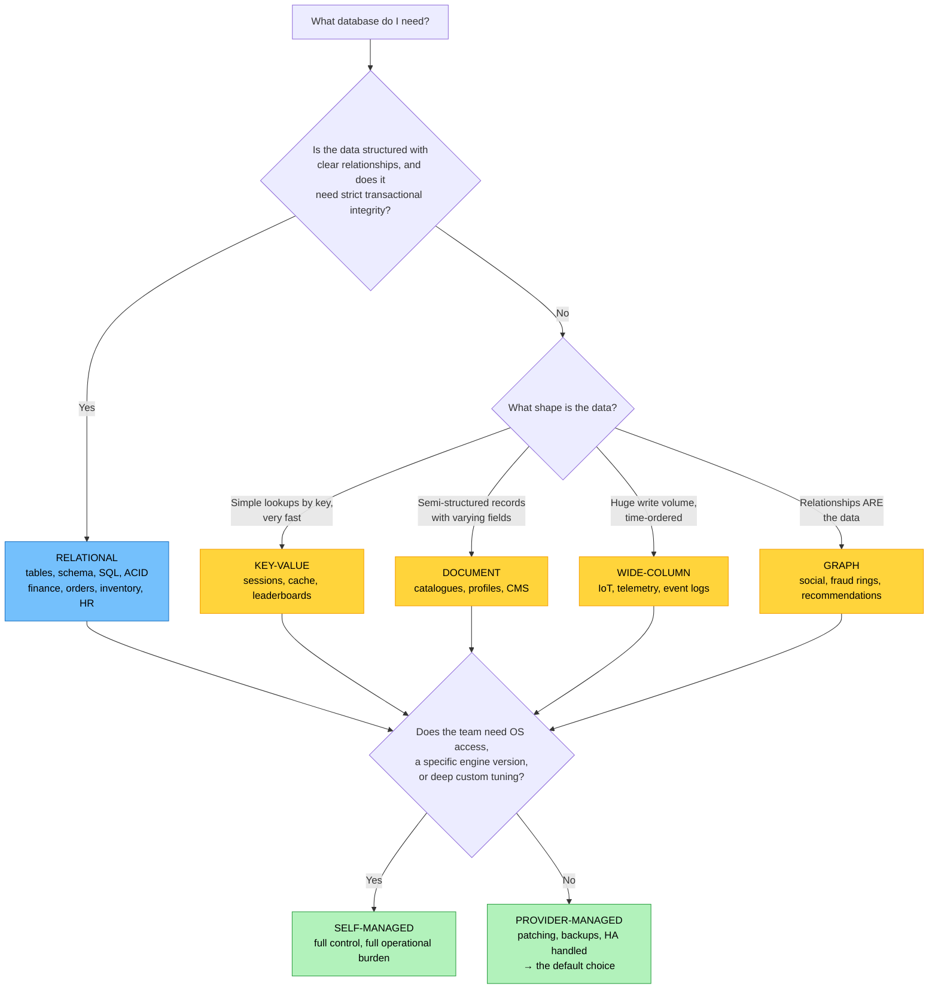

# Objective 1.9 — Explain the importance of database concepts

> **Domain 1.0 — Cloud Architecture (23% of exam)** · Exam CV0-004 V4 · Objectives doc v5.0
> **Status:** Exam-ready · **Version:** 2.0 (enhanced) · Supersedes `full notes/Objective-1.9-Database-Concepts.md`

---

## 0. How to use this note

| Pass | What to read | Time |
|---|---|---|
| **1st (learn)** | Sections 1 → 7 in order | ~60 min |
| **2nd (drill)** | Section 2.1 (the 2×2 grid) + 3.4 (ACID) + 4.3 (CAP) | ~20 min |
| **3rd (test)** | Section 10 (practice) + Section 11 (PBQ drills) | ~30 min |
| **Exam eve** | Section 12 (60-second recall sheet) only | ~5 min |

> 📌 **The official objective is only four sub-bullets, but the marks come from the surrounding concepts** — ACID vs BASE, CAP, OLTP vs OLAP, replication, sharding, and caching. Section 6 covers those; do not skip it.

---

## 1. Official objective coverage

> **1.9 Explain the importance of database concepts.**
> - **Types**
>   - Relational
>   - Non-relational
> - **Deployment options**
>   - Self-managed
>   - Provider-managed

### 1.1 What the verb tells you

**"Explain the importance of"** — like 1.5, the emphasis is on **why it matters**, not just what it is. Expect questions phrased as:

- "Which type is MOST appropriate for…" (fit to requirement)
- "What is the PRIMARY benefit of…" (why choose it)
- "Which responsibility remains with the customer…" (the trade-off)

You will **not** write SQL. You **will** match a workload to a database type and a deployment model, and state the trade-off.

### 1.2 Coverage checklist

- [ ] I know the two classification axes are **independent** (type × deployment = four combinations)
- [ ] I can list the defining traits of a **relational** database: tables, fixed schema, keys, joins, SQL, ACID
- [ ] I can name the **four NoSQL models** and one use case each
- [ ] I can expand **ACID** and say what each letter guarantees
- [ ] I can expand **BASE** and say when eventual consistency is acceptable
- [ ] I can state the **CAP theorem** trade-off during a network partition
- [ ] I know relational scales **up** and non-relational scales **out** — and why
- [ ] I can distinguish **OLTP** from **OLAP**
- [ ] I know what the provider does and does **not** do in a managed database
- [ ] I can explain **read replicas**, **replica lag**, and **sharding**
- [ ] I know why **caching** and **connection pooling** exist
- [ ] I know what **normalization** and **denormalization** trade against each other

---

## 2. The core mental model

### 2.1 ★ The 2×2 grid — two independent choices

```text
                        ┌─────────────────────┬─────────────────────┐
                        │   SELF-MANAGED      │  PROVIDER-MANAGED   │
                        │  (you install,      │  (CSP patches,      │
                        │   patch, back up)   │   backs up, fails   │
                        │                     │   over)             │
   ┌────────────────────┼─────────────────────┼─────────────────────┤
   │ RELATIONAL         │ PostgreSQL on a VM  │ Managed relational  │
   │ tables · schema    │                     │ service             │
   │ SQL · joins · ACID │ WHY: specific       │ WHY: ACID + low ops │
   │                    │ version, OS access, │ → THE MOST COMMON   │
   │                    │ deep tuning         │   PRODUCTION CHOICE │
   ├────────────────────┼─────────────────────┼─────────────────────┤
   │ NON-RELATIONAL     │ Cassandra/MongoDB   │ Managed NoSQL /     │
   │ flexible schema    │ on VMs              │ document / key-value│
   │ scale-out · BASE   │ WHY: data           │ WHY: elastic scale, │
   │                    │ sovereignty, custom │ zero ops            │
   │                    │ tuning, isolation   │                     │
   └────────────────────┴─────────────────────┴─────────────────────┘

   ★ TYPE answers "how is the data shaped?"
   ★ DEPLOYMENT answers "who operates it?"
   These are INDEPENDENT. All four combinations are valid and examinable.
```

### 2.2 Choosing a database



---

## 3. Relational databases

| | |
|---|---|
| **Definition** | Data organised into **tables** of **rows** (records) and **columns** (fields), with a **fixed schema defined before data is written**, relationships enforced by **keys**, queried with **SQL**, and transactions protected by **ACID** guarantees. |
| **Why it matters** | It is the default for **structured data where correctness is non-negotiable** — money, inventory, orders, payroll, bookings. The schema and constraints make invalid data *impossible to write*, not merely unlikely |
| **Trade-offs** | Rigid schema (changes require migrations); **joins get expensive at scale**; primarily **scales vertically**, so a single writer eventually becomes the ceiling |
| **Examples** | PostgreSQL, MySQL/MariaDB, Microsoft SQL Server, Oracle, IBM Db2 |
| **Exam triggers** | "structured data", "transactions must not partially complete", "financial/banking/inventory", "SQL", "joins", "referential integrity", "fixed schema", "ACID", "reporting on related tables" |

### 3.1 Structure and keys

```text
   CUSTOMERS table                      ORDERS table
   ┌────────────┬──────────┬────────┐   ┌──────────┬─────────────┬────────┐
   │ customer_id│ name     │ city   │   │ order_id │ customer_id │ total  │
   │ (PRIMARY   │          │        │   │ (PRIMARY │ (FOREIGN    │        │
   │  KEY)      │          │        │   │  KEY)    │  KEY) ──────┼──┐     │
   ├────────────┼──────────┼────────┤   ├──────────┼─────────────┤  │     │
   │ 1001       │ Aisha    │ KL     │◄──┼─ 5001    │ 1001        │ 250│    │
   │ 1002       │ Ben      │ Penang │   │  5002    │ 1001        │  80│    │
   └────────────┴──────────┴────────┘   └──────────┴─────────────┴────┘
        ▲                                                │
        └──────────── JOIN on customer_id ───────────────┘

   PRIMARY KEY   uniquely identifies each row
   FOREIGN KEY   references a primary key in another table
                 → enforces REFERENTIAL INTEGRITY: you cannot create an
                   order for a customer who does not exist, and you cannot
                   delete a customer who still has orders
   INDEX         a lookup structure that speeds reads
                 ⚠ but SLOWS writes (every insert updates the index too)
                   and consumes storage
```

### 3.2 Normalization vs denormalization

| | **Normalization** | **Denormalization** |
|---|---|---|
| Goal | **Eliminate redundancy** — store each fact once | **Speed reads** — duplicate data to avoid joins |
| Method | Split into related tables (1NF → 2NF → 3NF) | Merge/duplicate fields into one record |
| Storage | Less | More |
| Write behaviour | Clean — update one place | **Update anomalies** — the same fact lives in many places |
| Read behaviour | Requires **joins** | Fast — everything in one read |
| Typical home | **Relational / OLTP** | **NoSQL and OLAP / analytics** |

> 💡 **This is why NoSQL looks "wrong" to a relational mindset.** NoSQL deliberately denormalizes — a document embeds everything a query needs so it can be served in a single read with no join. The price is duplicated data and application-managed consistency.

### 3.3 SQL

The standard language for relational databases, covering:

| Category | Purpose | Examples |
|---|---|---|
| **DDL** — Data Definition | Define structure | `CREATE`, `ALTER`, `DROP` |
| **DML** — Data Manipulation | Work with data (**CRUD**) | `SELECT`, `INSERT`, `UPDATE`, `DELETE` |
| **DCL** — Data Control | Permissions | `GRANT`, `REVOKE` |
| **TCL** — Transaction Control | Transaction boundaries | `COMMIT`, `ROLLBACK` |

**CRUD** — Create, Read, Update, Delete — is on CompTIA's acronym list.

### 3.4 ★ ACID — know what each letter guarantees

```text
   A — ATOMICITY     All or nothing. A transaction fully completes or is
                     fully rolled back. Money leaves one account AND
                     arrives in the other — never one without the other.

   C — CONSISTENCY   The database moves from one VALID state to another.
                     Constraints, keys, and rules are never violated.

   I — ISOLATION     Concurrent transactions do not interfere. Two people
                     buying the last seat cannot both succeed.

   D — DURABILITY    Once committed, data survives a crash, power loss,
                     or restart — it is written to persistent storage.
```

> ★ **The exam's favourite ACID scenario is a funds transfer.** Debit and credit must both happen or neither — that is **atomicity**, and it is the single clearest argument for a relational database.

### 3.5 Scaling limits

| Approach | How | Limitation |
|---|---|---|
| **Vertical (scale up)** | Bigger instance — more CPU/RAM/IOPS | **A hard ceiling**, and usually downtime to resize. The classic relational path |
| **Read replicas** | Copies serving read traffic | Scales **reads only**; writes still go to one primary. Introduces **replica lag** |
| **Sharding** | Split data across independent databases | Scales writes, but **complex** — cross-shard joins and transactions are hard |

> ⚠️ **The structural constraint:** a traditional relational database has **one writer**. You can add read replicas and scale up, but write throughput ultimately caps out — which is precisely the wall that drove NoSQL adoption.

---

## 4. Non-relational (NoSQL) databases

| | |
|---|---|
| **Definition** | Databases that do **not** use the fixed table/row/column model — storing data as key-value pairs, documents, wide-column families, or graphs — usually with a **flexible or absent schema** and designed to **scale out horizontally** across many nodes. |
| **Why it matters** | Handles data that is **large, fast, or irregularly shaped**: user profiles, product catalogues with different attributes per category, IoT telemetry, social graphs, session state. Adding a field requires no migration |
| **Trade-offs** | Usually **eventual consistency** rather than strict ACID (though many modern engines offer ACID at some scope); **no joins** — you denormalize and manage relationships in application code; querying is less flexible and ad-hoc reporting is harder; each engine has its own API |
| **Exam triggers** | "flexible/schema-less", "JSON documents", "massive scale", "horizontal scaling", "unstructured or semi-structured", "high write throughput", "each record has different fields", "eventual consistency is acceptable" |

### 4.1 The four NoSQL models

```text
   ① KEY-VALUE                          ② DOCUMENT
   ┌──────────┬────────────────┐        ┌──────────────────────────────┐
   │ KEY      │ VALUE          │        │ { "_id": "u1",               │
   ├──────────┼────────────────┤        │   "name": "Aisha",           │
   │ sess:a1b │ {user:1001,...}│        │   "prefs": { "theme":"dark"},│
   │ cart:992 │ [item1,item2]  │        │   "orders": [5001, 5002] }   │
   └──────────┴────────────────┘        │ ← nested, self-contained     │
   Simplest, FASTEST lookup by key      └──────────────────────────────┘
   ✗ cannot query by value              Query by any field; flexible
   USE: sessions, cache, leaderboards,  per-record structure
        feature flags, rate limiting    USE: catalogues, user profiles,
   e.g. Redis, Memcached                     CMS, config, event payloads
                                        e.g. MongoDB, Couchbase, Firestore

   ③ WIDE-COLUMN                        ④ GRAPH
   ┌────────┬──────────────────────┐    ( Aisha )──FRIEND──►( Ben )
   │ row key│ col1 col2 col3 ...   │        │                   │
   ├────────┼──────────────────────┤     BOUGHT              WORKS_AT
   │sensor7 │ t1:22° t2:23° t3:21° │        ▼                   ▼
   │sensor8 │ t1:19° t4:20°        │    ( Laptop )         ( AcmeCorp )
   └────────┴──────────────────────┘
   Rows can have DIFFERENT columns      RELATIONSHIPS are first-class and
   Massive write throughput, time-      traversed instantly, at any depth
   ordered, spread over many nodes      USE: social networks, fraud rings,
   USE: IoT/telemetry, event logs,           recommendations, access graphs,
        time series, metrics                 network topology, supply chain
   e.g. Cassandra, HBase, Bigtable      e.g. Neo4j, Neptune, JanusGraph
```

| Model | Data shape | Query by | Killer use case |
|---|---|---|---|
| **Key-value** | Opaque value under a unique key | **Key only** | Sessions, caching, leaderboards |
| **Document** | Self-contained JSON-like records | **Any field** | Catalogues, profiles, content |
| **Wide-column** | Rows with sparse, variable column sets | Row key + column range | IoT/time-series, huge write volume |
| **Graph** | Nodes and edges | **Traversal of relationships** | Social, fraud detection, recommendations |

> 💡 **Also worth recognising** (they appear as options): **time-series** databases for metrics, **search** engines for full-text, and **vector** databases for AI embeddings and similarity search — the last of these connects to 1.11's generative-AI content.

### 4.2 BASE

```text
   BA — BASICALLY AVAILABLE   The system always responds, even if the
                              answer is not the newest data.

   S  — SOFT STATE            State may change over time without new input,
                              as replicas converge in the background.

   E  — EVENTUAL CONSISTENCY  Given no new writes, all replicas will
                              eventually agree — but a read immediately
                              after a write may return stale data.
```

**When eventual consistency is fine:** social feeds, product view counts, recommendations, analytics, non-critical counters, "likes."
**When it is not:** account balances, inventory decrements, seat/ticket booking, anything where a stale read causes a double-spend.

### 4.3 ★ CAP theorem

In a **distributed** database you can guarantee only **two of three** properties — and because network partitions *will* happen, the real choice is between **C** and **A**.

```text
                    CONSISTENCY (C)
                   every read returns
                   the most recent write
                          ▲
                         ╱ ╲
                        ╱   ╲
                 CP    ╱     ╲    CA
              during a╱       ╲  (only possible in a
              partition,      ╲  single-node/non-
              REFUSE to       ╲  distributed system —
              serve stale     ╲  not a real option at
              data → some     ╲  scale)
              requests fail   ╲
                      ╱─────────╲
                     ╱     AP    ╲
                    ╱  during a   ╲
   AVAILABILITY (A)╱   partition,  ╲PARTITION TOLERANCE (P)
   every request  ╱ SERVE POSSIBLY  ╲ the system keeps working
   gets a response  STALE DATA →     ╲ despite dropped/delayed
                    stay up           ╲ messages between nodes

   ★ P IS NOT OPTIONAL in any distributed system — networks fail.
     So the real decision is: during a partition, do you sacrifice
     CONSISTENCY (stay available) or AVAILABILITY (stay correct)?

   CP examples: MongoDB (default), HBase   → banking, inventory
   AP examples: Cassandra, DynamoDB (tunable) → feeds, catalogues, IoT
```

> ★ **How the exam phrases it:** "During a network partition, the system continues serving requests but may return outdated data." → **AP, eventual consistency.** "The system rejects requests rather than return stale data." → **CP, strong consistency."

### 4.4 Horizontal scaling

Non-relational engines are designed to **scale out**: add nodes, and data is automatically partitioned across them. This is why they handle write volumes a single relational primary cannot. The cost is the CAP trade-off and the loss of cross-node joins and transactions.

---

## 5. Deployment options

### 5.1 Self-managed

| | |
|---|---|
| **Definition** | The customer installs the database engine on infrastructure they control (typically an IaaS VM) and owns the **entire operational lifecycle**: installation, configuration, patching, upgrades, backups, restores, replication, failover, tuning, and monitoring. |
| **Benefits** | **Maximum control** — any engine, any version, any extension, OS-level tuning; no service premium; portability between clouds and on-prem; supports engines the provider does not offer |
| **★ Costs** | **All operational burden is yours.** You must have DBA skills. Missed patches become vulnerabilities; untested backups become data loss; manual failover means longer outages. It is the most common source of "we thought someone was backing that up" |
| **Choose when** | You need a specific version or extension, OS-level access, deep custom tuning, an unsupported engine, or strict data-locality/isolation |
| **Exam triggers** | "our team installs and patches it", "database on a VM", "we need OS access", "specific engine version not offered as a service", "full control" |

### 5.2 Provider-managed (DBaaS)

| | |
|---|---|
| **Definition** | The cloud provider operates the database as a service: provisioning, **automated backups**, **patching and minor upgrades**, monitoring, replication, and often **automatic failover** and scaling. You choose the engine and size and connect your application. |
| **Benefits** | Dramatically less operational work; **HA and backups configured correctly by default**; fewer human errors; faster time to market; small teams can run production databases safely; easy read replicas and point-in-time recovery |
| **★ Costs** | **No OS access**; limited to supported engines, versions, and parameters; **vendor lock-in**; a service premium on top of infrastructure cost; you inherit the provider's maintenance windows |
| **Choose when** | Speed, reliability, and low operational overhead matter more than deep control — **which is most of the time** |
| **Exam triggers** | "provider handles backups and patching", "reduce administrative overhead", "automatic failover", "no DBA on staff", "managed database service" |

### 5.3 ★ What the provider does NOT do

This is the highest-value insight in the deployment half of the objective — and a direct application of the **shared responsibility model** from 1.1.

```text
   ┌────────────────────────────────────────────────────────────────┐
   │  ALWAYS YOURS, even in a fully managed database:               │
   │    • Schema and data model design                              │
   │    • Index strategy and query performance / slow queries       │
   │    • Database users, roles, and permissions (least privilege)  │
   │    • What data goes in, and its classification                 │
   │    • Application-layer security — e.g. SQL INJECTION           │
   │    • Choosing backup retention and TESTING restores            │
   │    • Capacity/right-sizing decisions and cost                  │
   │    • Network exposure — is it reachable from the internet?     │
   ├────────────────────────────────────────────────────────────────┤
   │  PROVIDER'S in a managed database:                             │
   │    • Physical infrastructure, host OS, hypervisor              │
   │    • Database engine installation and PATCHING                 │
   │    • Backup infrastructure and automation                      │
   │    • Replication plumbing and automated failover               │
   │    • Service availability per the SLA                          │
   └────────────────────────────────────────────────────────────────┘
```

> ⚠️ **A managed database does not protect you from a bad schema, a missing index, an over-privileged account, a publicly exposed endpoint, or SQL injection.** Those are all customer-side — the exact "security **in** the cloud" split from 1.1.

### 5.4 Serverless databases

An increasingly common variant: a provider-managed database that **auto-scales capacity with demand and can scale to near zero**, billed by consumption rather than instance-hours. Good for intermittent, unpredictable, or dev/test workloads; potential cold-start latency, and cost can exceed a provisioned instance under sustained heavy load.

---

## 6. Cross-cutting concepts

### 6.1 OLTP vs OLAP

```text
   OLTP — Online Transaction Processing   OLAP — Online Analytical Processing
   "run the business"                     "understand the business"

   ┌───────────────────────────────┐      ┌───────────────────────────────┐
   │ Many SMALL, FAST transactions │      │ Few LARGE, COMPLEX queries    │
   │ INSERT/UPDATE/DELETE + point  │      │ Aggregations over millions of │
   │ reads                         │      │ rows: SUM, AVG, GROUP BY      │
   │ Milliseconds, high concurrency│      │ Seconds to minutes            │
   │ NORMALIZED schema             │      │ DENORMALIZED (star schema)    │
   │ ROW-oriented storage          │      │ COLUMNAR storage              │
   │ Current operational data      │      │ Historical data, large volume │
   │ e.g. place an order, log in   │      │ e.g. quarterly sales by region│
   └───────────────────────────────┘      └───────────────────────────────┘
        ▲                                        ▲
        └──── ETL / ELT pipeline ────────────────┘
              periodically copies and transforms operational
              data into the analytical store
```

**Why columnar storage wins for OLAP:** an analytical query typically reads two or three columns across millions of rows. Row storage must read every full row; **column storage reads only the columns needed**, and compresses them well because similar values sit together.

| Related term | Meaning |
|---|---|
| **Data warehouse** | Structured, cleaned, schema-on-**write** analytical store |
| **Data lake** | Raw data of any format, schema-on-**read**, cheap object storage |
| **Lakehouse** | Hybrid — warehouse-style querying and governance directly over lake storage |
| **ETL / ELT** | Extract-Transform-Load (transform before loading) vs Extract-Load-Transform (load raw, transform in place) |

> ⚠️ **Do not run analytics on your production OLTP database.** A single heavy report can lock tables and starve transactional traffic. Use a read replica or an analytical store.

### 6.2 Replication

```text
   ┌──────────┐   writes    ┌──────────┐   replication    ┌──────────┐
   │   APP    │────────────►│ PRIMARY  │─────────────────►│ REPLICA  │
   │          │             │ (writer) │                  │ (reader) │
   │          │◄── reads ───┤          │                  │          │
   │          │◄─────────── reads ───────────────────────►│          │
   └──────────┘             └──────────┘                  └──────────┘

   SYNCHRONOUS   commit waits for the replica → RPO = 0, higher write
                 latency → within a region/AZ (see 1.2)
   ASYNCHRONOUS  commit returns immediately → RPO > 0, REPLICA LAG,
                 lower latency → across regions
```

| Purpose | Mechanism |
|---|---|
| **Read scaling** | Point read-heavy traffic at replicas; the primary handles writes |
| **High availability** | A synchronous standby is promoted on primary failure |
| **Disaster recovery** | Asynchronous cross-region replica (see 1.2) |
| **Analytics offload** | Run reports against a replica, not the primary |

> ⚠️ **Replica lag** means a read from a replica may not reflect a write that just succeeded on the primary — the "I saved it but it's not there" bug. Read-after-write consistency requires reading from the primary.

### 6.3 Sharding (horizontal partitioning)

Splitting a dataset **across multiple independent databases** by a **shard key** (e.g. customer ID range or hash). Each shard holds a subset and handles its own writes, so **write throughput scales horizontally**.

| Benefit | Cost |
|---|---|
| Scales writes and storage beyond one machine | **Cross-shard joins and transactions are hard or impossible** |
| Smaller working set and indexes per shard | A **poor shard key creates hotspots** — one shard gets all the traffic |
| Failure blast radius is limited to one shard | Rebalancing/resharding is operationally painful |

**Vertical partitioning** is the sibling: splitting *columns* across tables (e.g. rarely used large text fields into their own table).

### 6.4 Caching

```text
   CACHE-ASIDE (lazy loading) — the most common pattern

   ① App asks the CACHE          ┌────────┐
      ┌──────┐  "user:1001?"     │ CACHE  │  in-memory, e.g. Redis
      │ APP  │──────────────────►│        │
      └───┬──┘                   └───┬────┘
          │                          │
          │  ② HIT → return          │  ② MISS
          │     immediately (µs)     ▼
          │                     ┌────────────┐
          └────③ read from ────►│  DATABASE  │
               the database     └────────────┘
               ④ WRITE IT INTO THE CACHE with a TTL
               ⑤ return to caller
```

| Concept | Meaning |
|---|---|
| **Cache hit / miss** | Whether the data was already cached; **hit ratio** is the key metric |
| **TTL** | How long an entry stays valid before it must be refetched |
| **Eviction policy** | What is discarded when the cache is full (commonly **LRU** — least recently used) |
| **Write-through** | Write to cache **and** database together — cache always fresh, writes slower |
| **Cache invalidation** | Removing stale entries after an update — famously the hard part |
| **Cache stampede** | Many clients miss simultaneously when a popular key expires and all hit the database at once |

**Why caching matters:** it removes the majority of read traffic from the database, cutting latency from milliseconds to microseconds and letting a smaller database serve far more users. It is usually the **cheapest performance fix available**.

### 6.5 Connection pooling

Every database connection consumes memory and a connection slot, and **databases have a hard connection limit**. Opening a new connection per request is slow and exhausts the limit under load.

A **connection pool** maintains a set of reusable open connections that requests borrow and return.

> ⚠️ **The serverless connection-exhaustion problem:** hundreds of concurrent function invocations each opening their own connection will exhaust a database's connection limit almost instantly. The fix is an **external connection pooler/proxy** between the functions and the database — a modern, very examinable scenario that links 1.1, 1.5, and 1.9.

### 6.6 Backup and recovery

| Concept | Meaning |
|---|---|
| **Automated backups** | Scheduled full/incremental backups, typically standard in managed services |
| **Point-in-time recovery (PITR)** | Backups **plus transaction logs**, allowing restore to any second within the retention window — this is how you achieve a low **RPO** |
| **Retention** | How far back you can restore; a customer-chosen setting even in managed services |
| **Snapshot** | A manual point-in-time copy, often kept before a risky change |
| **★ Restore testing** | An untested backup is an assumption. **Restoring is the only proof** (see 1.2, 3.3) |

### 6.7 Database security essentials

| Control | Note |
|---|---|
| **Encryption at rest / in transit** | Usually available by default in managed services; **key management remains yours** |
| **Least-privilege accounts** | The application should not connect as an admin/superuser |
| **Network isolation** | Put the database in a **private subnet** with no internet route (see 1.3) |
| **SQL injection defence** | Parameterised queries — an **application** responsibility no managed service fixes |
| **Auditing** | Log access and changes for compliance (see 4.2, 4.6) |

---

## 7. Comparison tables

### 7.1 ★ Relational vs non-relational

| Aspect | **Relational (SQL)** | **Non-relational (NoSQL)** |
|---|---|---|
| Data model | **Tables, rows, columns** | Key-value, document, wide-column, graph |
| Schema | **Fixed, defined up front** | **Flexible or schema-less** |
| Query language | **SQL** (standardised) | Engine-specific APIs/queries |
| Relationships | **Keys and joins**, enforced | Denormalized/embedded, app-managed |
| Consistency | **Strong — ACID** | Usually **eventual — BASE** (tunable in many engines) |
| Scaling | **Vertical** (+ read replicas, sharding is hard) | **Horizontal** by design |
| Write ceiling | One primary writer | Distributed across nodes |
| Data integrity | **Enforced by the database** | Enforced by the application |
| Ad-hoc reporting | **Strong** | Weaker |
| Best for | Transactions, finance, inventory, structured reporting | Scale, flexible/irregular data, high write volume, specialised shapes |
| Examples | PostgreSQL, MySQL, SQL Server, Oracle | MongoDB, Redis, Cassandra, Neo4j, DynamoDB |

### 7.2 Self-managed vs provider-managed

| Aspect | **Self-managed** | **Provider-managed** |
|---|---|---|
| Engine install | **Customer** | Provider |
| **OS access** | ✅ **Yes** | ❌ **No** |
| Patching & upgrades | **Customer** | **Provider** |
| Backups | Customer configures | **Automated** |
| Replication & failover | Customer builds | Often **automatic** |
| Engine/version choice | **Anything** | Provider's supported list |
| Deep tuning | ✅ Full | Limited to exposed parameters |
| Operational effort | **High** | **Low** |
| Required skills | DBA needed | Minimal |
| Cost | Infrastructure only | Infrastructure **+ service premium** |
| Lock-in | Low | **Higher** |
| Best for | Version/OS control, unsupported engines, sovereignty | **Most production workloads** |

### 7.3 ACID vs BASE

| | **ACID** | **BASE** |
|---|---|---|
| Stands for | Atomicity, Consistency, Isolation, Durability | Basically Available, Soft state, Eventual consistency |
| Guarantees | **Strong, immediate consistency** | **Eventual** consistency |
| Priority | **Correctness** | **Availability and scale** |
| Typical home | Relational | Distributed NoSQL |
| CAP leaning | **CP** | **AP** |
| Use for | Payments, inventory, bookings, ledgers | Feeds, catalogues, telemetry, counters, recommendations |

### 7.4 OLTP vs OLAP

| Aspect | **OLTP** | **OLAP** |
|---|---|---|
| Purpose | **Run** the business | **Analyse** the business |
| Query pattern | Many small reads/writes | Few large aggregations |
| Latency target | Milliseconds | Seconds to minutes |
| Concurrency | **Very high** | Lower |
| Schema | **Normalized** | **Denormalized (star/snowflake)** |
| Storage layout | **Row-oriented** | **Columnar** |
| Data scope | Current operational | Historical, large volume |
| Example system | Order-entry database | Data warehouse |

### 7.5 Scaling techniques

| Technique | Scales | Complexity | Notes |
|---|---|---|---|
| **Vertical (bigger instance)** | Reads + writes | Low | **Hard ceiling**, usually needs downtime |
| **Read replicas** | **Reads only** | Low | **Replica lag** → possible stale reads |
| **Caching** | Reads | Low | **Cheapest big win**; invalidation is the hard part |
| **Sharding** | **Writes + storage** | **High** | Cross-shard operations are hard; beware hotspot shard keys |
| **Connection pooling** | Concurrency | Low | Prevents connection exhaustion |

### 7.6 Multi-cloud mapping

| Category | AWS | Azure | Google Cloud |
|---|---|---|---|
| Managed relational | **RDS**, Aurora | **Azure SQL Database**, DB for PostgreSQL/MySQL | **Cloud SQL**, AlloyDB |
| Distributed relational | Aurora | Azure SQL Hyperscale | **Cloud Spanner** |
| Document | DocumentDB | **Cosmos DB** (multi-model) | Firestore |
| Key-value | **DynamoDB** | Cosmos DB (Table), Table Storage | Bigtable, Firestore |
| Wide-column | Keyspaces (Cassandra) | Cosmos DB (Cassandra API) | **Bigtable** |
| Graph | **Neptune** | Cosmos DB (Gremlin) | Spanner Graph |
| In-memory cache | **ElastiCache** (Redis/Memcached) | Azure Cache for Redis | Memorystore |
| Data warehouse (OLAP) | **Redshift** | **Synapse Analytics**, Fabric | **BigQuery** |
| Serverless database | Aurora Serverless, DynamoDB on-demand | Cosmos DB serverless, SQL serverless | Firestore, BigQuery |

---

## 8. Exam traps & distractor patterns

| # | Trap | The truth |
|---|---|---|
| 1 | "NoSQL means no SQL support" | It means "**not only** SQL" — it is about the **data model**, not the query language. Many NoSQL engines offer SQL-like querying |
| 2 | "NoSQL is always faster than relational" | It is faster **for its designed access pattern**. For complex joins and ad-hoc reporting, relational usually wins |
| 3 | "NoSQL cannot do transactions" | Many modern engines support ACID at the document or limited multi-record scope. The classic contrast still holds, but "never" is wrong |
| 4 | "A managed database means the provider handles everything" | **Schema, indexes, query performance, users/permissions, network exposure, and SQL injection are all still yours** |
| 5 | "A managed database is automatically secure" | It is securely *operated*. A publicly exposed endpoint with a weak admin password is entirely the customer's failure |
| 6 | "Read replicas increase write capacity" | They scale **reads only**. Writes still funnel to a single primary — sharding is what scales writes |
| 7 | "Data read from a replica is always current" | **Replica lag** means asynchronous replicas can serve stale data |
| 8 | "Relational databases cannot scale" | They scale **vertically** very far, plus read replicas. The limit is **write** throughput on a single primary |
| 9 | "Choose type and deployment together" | They are **independent axes** — all four combinations are valid |
| 10 | "Eventual consistency is a defect" | It is a deliberate **trade-off** for availability and scale. Unacceptable for balances; perfectly fine for view counts |
| 11 | "CAP means you pick any two freely" | **Partition tolerance is mandatory** in a distributed system. The real choice is C **or** A *during a partition* |
| 12 | "Add indexes everywhere to make it fast" | Indexes speed reads but **slow every write** and consume storage |
| 13 | "Run the analytics report on the production database" | A heavy OLAP query can starve OLTP traffic. Use a **replica or a warehouse** |
| 14 | "Self-managed is always cheaper" | You avoid the service premium but pay in **DBA time, risk, and outages** |
| 15 | "Backups are handled, so we're safe" | An **untested restore** is an assumption. Also verify retention meets the required RPO |
| 16 | "Serverless functions can connect straight to the database at scale" | Hundreds of concurrent invocations **exhaust the connection limit**. Use a connection pooler/proxy |
| 17 | "Denormalization is bad practice" | It is **standard** in NoSQL and OLAP — trading storage and update complexity for read speed |
| 18 | "Graph databases are just relational with relationships" | Relationships are **first-class and traversed directly**; multi-hop traversals that require many joins in SQL are native operations in a graph |

**Disambiguation drill:**

| Pair | The deciding question |
|---|---|
| **Relational vs non-relational** | Does the data have a **fixed structure** and need **transactional integrity**? |
| **Key-value vs document** | Do you only ever look up **by key**, or query **by field**? |
| **Wide-column vs document** | **Enormous write volume, time-ordered** → wide-column |
| **Graph vs relational** | Are the **relationships themselves** what you query? |
| **Self vs provider-managed** | Do you need **OS access or an unsupported version**? |
| **ACID vs BASE** | Would a **stale read cause real harm**? |
| **Read replica vs shard** | Scaling **reads** (replica) or **writes** (shard)? |
| **OLTP vs OLAP** | Many small transactions, or few large aggregations? |
| **Cache vs replica** | Reduce **latency on hot items** (cache) vs distribute **read load** (replica) |

---

## 9. Keyword → answer trigger table

| If you see… | Think |
|---|---|
| tables · rows and columns · fixed schema · joins · foreign keys · SQL · referential integrity | **Relational** |
| financial transaction · funds transfer · must not partially complete · inventory decrement · booking | **Relational + ACID (atomicity)** |
| flexible schema · JSON documents · each record has different fields · massive horizontal scale | **Non-relational** |
| lookup by key only · session store · cache · leaderboard · very low latency | **Key-value** |
| product catalogue with varying attributes · user profiles · content management | **Document** |
| IoT sensors · telemetry · time-ordered · enormous write throughput | **Wide-column (or time-series)** |
| social network · fraud ring · recommendations · shortest path · relationships are the data | **Graph** |
| stale reads acceptable · stays available during a partition | **AP / eventual consistency / BASE** |
| rejects requests rather than return stale data | **CP / strong consistency** |
| our team installs and patches it · database on a VM · need a specific version · OS access | **Self-managed** |
| provider handles patching and backups · automatic failover · no DBA on staff | **Provider-managed (DBaaS)** |
| many small fast transactions · order entry · high concurrency | **OLTP** |
| aggregate millions of rows · quarterly reporting · columnar · star schema | **OLAP / data warehouse** |
| reporting query is slowing production | **Offload to a read replica or warehouse** |
| read traffic is overwhelming the database | **Read replicas and/or caching** |
| write throughput exceeds one server | **Sharding** |
| "I saved it but it's not showing" | **Replica lag** — read from the primary |
| repeated identical queries · reduce latency to microseconds | **Caching (cache-aside, TTL, LRU)** |
| too many connections · serverless functions exhausting the database | **Connection pooling / proxy** |
| restore to any point in time within the retention window | **PITR (backups + transaction logs)** |
| database reachable from the internet | **Customer misconfiguration — private subnet** |

---

## 10. Practice questions

<details>
<summary><b>Q1.</b> A banking application must guarantee that a funds transfer either fully completes or is entirely rolled back. Which database property provides this?</summary>

A. Eventual consistency · **B. Atomicity (ACID)** · C. Horizontal scalability · D. Schema flexibility

**Correct: B — atomicity.** A transaction is all-or-nothing: the debit and the credit both commit, or neither does.
- **A wrong:** Eventual consistency permits temporary disagreement, which is unacceptable for money movement.
- **C/D wrong:** Both are NoSQL strengths, and neither addresses transactional integrity.
</details>

<details>
<summary><b>Q2.</b> An e-commerce catalogue stores products whose attributes differ by category — clothing has size and colour, electronics have voltage and specifications. Which database type fits BEST?</summary>

A. Relational with a rigid schema · **B. Non-relational document database** · C. Graph database · D. Data warehouse

**Correct: B — document.** Each product record can carry its own fields with no schema migration, which is exactly what a variable-attribute catalogue needs.
- **A wrong:** A fixed schema would require either sparse columns or a new table per category.
- **C wrong:** Graph databases are for relationship traversal, not variable attributes.
- **D wrong:** A warehouse is for analytics, not an operational catalogue.
</details>

<details>
<summary><b>Q3.</b> An organisation uses a fully managed database service. Which responsibility remains with the customer?</summary>

A. Patching the database engine · B. Maintaining the physical hardware · **C. Designing the schema, managing indexes, and controlling user permissions** · D. Operating the backup infrastructure

**Correct: C.** The provider operates the platform; **data model, query performance, and access control are always the customer's** — the same "security in the cloud" split as 1.1.
- **A/B/D wrong:** All three are provider responsibilities in a managed service.
</details>

<details>
<summary><b>Q4.</b> Which statement about the CAP theorem is CORRECT?</summary>

A. You may freely choose any two of the three properties · **B. Partition tolerance is mandatory in a distributed system, so the real choice during a partition is between consistency and availability** · C. CAP applies only to relational databases · D. Consistency and availability can always both be guaranteed

**Correct: B.** Networks fail, so P is not optional; the design decision is what to sacrifice when a partition occurs.
- **A wrong:** Dropping P is not viable for a distributed system.
- **C wrong:** CAP is specifically about distributed systems, most often NoSQL.
- **D wrong:** Not during a partition — that is the entire theorem.
</details>

<details>
<summary><b>Q5.</b> A team needs a specific PostgreSQL extension that their cloud provider's managed service does not support. What should they choose?</summary>

**A. Self-managed PostgreSQL on a virtual machine** · B. A managed relational service with a different engine · C. A managed NoSQL service · D. A data warehouse

**Correct: A.** Self-management is chosen precisely when you need an engine version, extension, or OS-level configuration the managed service does not expose.
- **B wrong:** Changing engines to avoid an extension is a far larger change.
- **C/D wrong:** Neither is a substitute for a relational database with a required extension.
</details>

<details>
<summary><b>Q6.</b> Read traffic is overwhelming a relational database while write volume is modest. What is the MOST appropriate first step?</summary>

A. Shard the database · **B. Add read replicas and/or a caching layer** · C. Convert to a graph database · D. Denormalize every table

**Correct: B.** Read replicas distribute read load and caching removes repeated reads entirely — the standard, low-complexity fixes for a read-heavy workload.
- **A wrong:** Sharding addresses **write** and storage scaling and adds significant complexity.
- **C wrong:** Graph databases solve relationship traversal, not read volume.
- **D wrong:** Denormalization may help specific queries but is not the primary remedy.
</details>

<details>
<summary><b>Q7.</b> Users report that data they just saved sometimes does not appear immediately when the page reloads. The application reads from replicas. What is the MOST likely cause?</summary>

A. SQL injection · **B. Replica lag from asynchronous replication** · C. Missing primary key · D. Connection pool exhaustion

**Correct: B.** Asynchronous replicas trail the primary, so a read immediately after a write may return the older state. Read-after-write consistency requires reading from the primary.
- **A wrong:** Injection is an attack, not a consistency artefact.
- **C wrong:** A missing key would cause data-integrity issues, not delayed visibility.
- **D wrong:** Exhaustion produces connection errors, not stale data.
</details>

<details>
<summary><b>Q8.</b> Which pairing of workload to storage layout is CORRECT?</summary>

A. OLTP uses columnar storage; OLAP uses row storage · **B. OLTP uses row-oriented storage; OLAP uses columnar storage** · C. Both use columnar storage · D. Storage layout is unrelated to workload type

**Correct: B.** OLTP reads and writes whole rows; OLAP scans a few columns across millions of rows, which columnar storage serves far more efficiently and compresses better.
- **A wrong:** The two are reversed.
- **C/D wrong:** The layout choice is a defining difference between the two.
</details>

<details>
<summary><b>Q9.</b> Which NoSQL model is BEST for detecting fraud rings by traversing relationships between accounts, devices, and transactions?</summary>

A. Key-value · B. Document · C. Wide-column · **D. Graph**

**Correct: D — graph.** Relationships are first-class and multi-hop traversals are native operations, whereas the equivalent SQL would require many expensive joins.
- **A wrong:** Key-value supports lookup by key only.
- **B wrong:** Documents are self-contained and poor at cross-record traversal.
- **C wrong:** Wide-column targets massive time-ordered writes.
</details>

<details>
<summary><b>Q10.</b> A serverless application scales to hundreds of concurrent function invocations and the database begins rejecting connections. What is the BEST remedy?</summary>

A. Add read replicas · B. Increase the instance size · **C. Introduce a connection pooler or database proxy between the functions and the database** · D. Convert to a NoSQL database

**Correct: C.** Databases have a hard connection limit; a pooler multiplexes many short-lived function invocations onto a small set of reusable connections.
- **A wrong:** Replicas address read load, not connection count.
- **B wrong:** Scaling up raises the limit somewhat but does not fix the pattern.
- **D wrong:** A far larger change than the problem requires.
</details>

<details>
<summary><b>Q11.</b> What is the PRIMARY benefit of a provider-managed database?</summary>

A. Full operating system access · **B. Reduced operational overhead — patching, backups, replication, and failover are handled by the provider** · C. Lower total cost in every case · D. Complete freedom of engine version

**Correct: B.** Offloading routine operations is the central value proposition.
- **A/D wrong:** Both are self-managed advantages.
- **C wrong:** Managed services carry a service premium; they save staff effort and risk, not necessarily dollars.
</details>

<details>
<summary><b>Q12.</b> Which describes eventual consistency?</summary>

A. All replicas always return identical data instantly · **B. Replicas converge over time, so a read shortly after a write may return stale data** · C. Data is eventually deleted · D. Transactions eventually roll back

**Correct: B.** Given no new writes, replicas converge — but immediate reads may lag. It is the AP side of the CAP trade-off.
- **A wrong:** That is strong consistency.
- **C/D wrong:** Neither relates to the term.
</details>

<details>
<summary><b>Q13.</b> An analytics team's quarterly report query is causing timeouts in the production order-entry system. What is the BEST solution?</summary>

A. Add more indexes to the production database · **B. Run analytics against a read replica or a dedicated analytical store** · C. Convert the production database to NoSQL · D. Increase the application timeout

**Correct: B.** Separating OLAP work from OLTP work is the standard fix — a heavy aggregation should never compete with transactional traffic.
- **A wrong:** More indexes slow writes and would not stop a large scan starving transactions.
- **C wrong:** That would not help analytics and would break transactional guarantees.
- **D wrong:** That hides the symptom rather than fixing it.
</details>

<details>
<summary><b>Q14.</b> Which technique scales WRITE throughput beyond what a single database server can handle?</summary>

A. Read replicas · B. Caching · **C. Sharding (horizontal partitioning)** · D. Adding indexes

**Correct: C — sharding.** Splitting data across independent shards by a shard key lets each shard accept writes in parallel.
- **A/B wrong:** Both address read load only.
- **D wrong:** Indexes speed reads and **slow** writes.
</details>

<details>
<summary><b>Q15.</b> A database is configured with a public endpoint and a weak administrative password, and is breached. Under a managed database service, who is responsible?</summary>

**A. The customer** · B. The cloud provider · C. Shared equally · D. The database vendor

**Correct: A.** Network exposure and credential management are customer responsibilities in every deployment model — the provider secured the platform, not the customer's configuration.
- **B/C/D wrong:** None of the failures were provider-side.
</details>

<details>
<summary><b>Q16.</b> Which is a DRAWBACK of adding many indexes to a table?</summary>

A. Reads become slower · **B. Every write must also update the indexes, slowing inserts and updates and consuming extra storage** · C. It prevents replication · D. It breaks ACID guarantees

**Correct: B.** Indexes trade write performance and storage for read speed, which is why they are chosen deliberately rather than added everywhere.
- **A wrong:** Reads get faster — that is the purpose.
- **C/D wrong:** Neither is affected.
</details>

<details>
<summary><b>Q17.</b> A gaming company needs a real-time leaderboard with sub-millisecond lookups by player ID. Which is MOST appropriate?</summary>

**A. In-memory key-value store** · B. Relational database with joins · C. Data warehouse · D. Graph database

**Correct: A.** Lookup strictly by key with extreme latency requirements is the defining key-value use case.
- **B wrong:** Joins and disk access add unnecessary latency.
- **C wrong:** Warehouses are for large analytical queries.
- **D wrong:** No relationship traversal is required.
</details>

<details>
<summary><b>Q18.</b> Which statement about relational and non-relational classification is CORRECT?</summary>

A. Non-relational databases can only be provider-managed · B. Relational databases can only be self-managed · **C. Type and deployment are independent — any of the four combinations is valid** · D. Provider-managed implies non-relational

**Correct: C.** *How the data is shaped* and *who operates it* are separate decisions, and CompTIA tests all four combinations.
- **A/B/D wrong:** Each falsely couples the two axes.
</details>

<details>
<summary><b>Q19.</b> What does point-in-time recovery (PITR) provide?</summary>

A. Instant failover to a standby · **B. Restoration to any moment within the retention window, using backups plus transaction logs** · C. Real-time replication to another region · D. Automatic index tuning

**Correct: B.** PITR combines periodic backups with continuous transaction logs, which is how a low RPO is achieved for databases.
- **A wrong:** That is automatic failover/HA.
- **C wrong:** That is replication.
- **D wrong:** Unrelated.
</details>

<details>
<summary><b>Q20.</b> An IoT platform ingests millions of time-stamped sensor readings per minute, with different sensors reporting different metrics. Which model fits BEST?</summary>

A. Graph · B. Relational with a fixed schema · **C. Wide-column (or a time-series database)** · D. Key-value

**Correct: C.** Wide-column stores handle enormous, time-ordered write volumes with sparse and variable columns, distributed across many nodes.
- **A wrong:** No relationship traversal is involved.
- **B wrong:** A single relational primary could not sustain the write rate, and the schema varies.
- **D wrong:** Key-value cannot express time-ranged column queries well.
</details>

<details>
<summary><b>Q21.</b> Which is the PRIMARY reason NoSQL databases denormalize data?</summary>

A. To save storage space · **B. To avoid joins, so a single read returns everything a query needs** · C. To enforce referential integrity · D. To reduce write volume

**Correct: B.** Embedding related data makes reads single-hop and horizontally scalable, at the cost of duplication and application-managed consistency.
- **A wrong:** Denormalization **increases** storage.
- **C wrong:** Referential integrity is a relational feature that denormalization gives up.
- **D wrong:** Duplication typically increases write work.
</details>

<details>
<summary><b>Q22.</b> Which caching pattern has the application check the cache first and populate it from the database on a miss?</summary>

**A. Cache-aside (lazy loading)** · B. Write-through · C. Write-behind · D. Read replica

**Correct: A.** The application owns the logic: check cache → on miss read the database → write the result into the cache with a TTL.
- **B wrong:** Write-through updates cache and database together on write.
- **C wrong:** Write-behind defers the database write.
- **D wrong:** A replica is a database copy, not a cache.
</details>

<details>
<summary><b>Q23.</b> A company chooses self-managed databases to reduce cost. What risk are they accepting?</summary>

A. Loss of OS access · **B. Full responsibility for patching, backups, tuning, and failover — where errors cause vulnerabilities, data loss, and longer outages** · C. Inability to use SQL · D. Mandatory vendor lock-in

**Correct: B.** The saving is a service premium; the cost is operational burden and risk, which requires real DBA capability.
- **A wrong:** Self-managed **grants** OS access.
- **C wrong:** Engine choice is unaffected.
- **D wrong:** Self-managed reduces lock-in.
</details>

<details>
<summary><b>Q24.</b> Which scenario BEST justifies eventual consistency?</summary>

A. Deducting the last item from inventory · B. Transferring money between accounts · **C. Displaying a post's view count on a social feed** · D. Confirming an airline seat reservation

**Correct: C.** A view count that is briefly stale causes no harm, and availability and scale matter more.
- **A/B/D wrong:** All three can produce real loss — oversold stock, lost money, double-booked seats — and require strong consistency.
</details>

<details>
<summary><b>Q25.</b> What does "NoSQL" actually mean?</summary>

A. The database cannot use any query language · **B. "Not only SQL" — it describes a non-tabular data model rather than the absence of a query language** · C. It is a specific product · D. It cannot store structured data

**Correct: B.** The term refers to the **data model**; many NoSQL engines provide SQL-like query interfaces.
- **A/D wrong:** Both overstate the limitation.
- **C wrong:** It is a category, not a product.
</details>

---

## 11. PBQ-style drills

### Drill A — Match the workload to type and deployment

| # | Workload | Type + deployment? |
|---|---|---|
| 1 | Bank core ledger, regulated, small DBA team | |
| 2 | Product catalogue with per-category attributes, elastic sale peaks | |
| 3 | Factory telemetry that must remain on-premises for sovereignty | |
| 4 | Payroll requiring a specific engine version and OS tuning | |
| 5 | Real-time game leaderboard, zero ops capacity | |
| 6 | Social network friend-of-friend recommendations | |

<details><summary>Answers</summary>

1 → **Relational + provider-managed** (ACID for the ledger; managed for compliance-grade backups/HA)
2 → **Document (non-relational) + provider-managed** (flexible schema, elastic scale)
3 → **Wide-column (non-relational) + self-managed** (high write volume, data locality)
4 → **Relational + self-managed** (version and OS control)
5 → **Key-value (non-relational) + provider-managed** (sub-ms lookups, no ops)
6 → **Graph + either** (relationship traversal is the requirement)
</details>

### Drill B — Diagnose the database symptom

| # | Symptom | Cause + fix? |
|---|---|---|
| 1 | Reports time out and block order processing | |
| 2 | "I saved it but it's not there" after a page reload | |
| 3 | Writes have hit a ceiling; the primary is maxed out | |
| 4 | Serverless functions get "too many connections" errors | |
| 5 | Reads are slow and the same queries repeat constantly | |
| 6 | One shard receives 90% of the traffic | |
| 7 | Inserts have become slow after a performance-tuning exercise | |

<details><summary>Answers</summary>

1 → **OLAP query on an OLTP system** → move to a read replica or data warehouse
2 → **Replica lag** → read from the primary for read-after-write consistency
3 → **Single-writer ceiling** → shard (or move to a horizontally scalable engine)
4 → **Connection exhaustion** → connection pooler/proxy
5 → **No caching** → add a cache-aside layer with a TTL
6 → **Poor shard key → hotspot** → choose a higher-cardinality/hashed key
7 → **Too many indexes** → each write updates every index; remove unused ones
</details>

### Drill C — ACID and CAP recall

1. Expand ACID and give the guarantee of each letter.
2. Expand BASE.
3. During a network partition, what do CP and AP systems each sacrifice?
4. Why is partition tolerance not really optional?

<details><summary>Answers</summary>

1. **Atomicity** all-or-nothing · **Consistency** valid state → valid state, constraints enforced · **Isolation** concurrent transactions do not interfere · **Durability** committed data survives a crash
2. **Basically Available, Soft state, Eventual consistency**
3. **CP** sacrifices **availability** — it refuses requests rather than serve stale data. **AP** sacrifices **consistency** — it stays up and may return stale data
4. Because networks **will** partition in any distributed system, so tolerating it is a requirement, not a choice
</details>

### Drill D — Pick the scaling technique

| # | Requirement | Technique? |
|---|---|---|
| 1 | Reduce latency for the same 100 hot records requested constantly | |
| 2 | Distribute a heavy read workload across more servers | |
| 3 | Exceed the write capacity of a single server | |
| 4 | Support far more concurrent short-lived clients | |
| 5 | Quickly get more CPU and memory for one database | |

<details><summary>Answers</summary>

1 → **Caching** · 2 → **Read replicas** · 3 → **Sharding** · 4 → **Connection pooling** · 5 → **Vertical scaling** (fast, but a hard ceiling and usually downtime)
</details>

---

## 12. 60-second recall sheet

```text
╔══════════════════════════════════════════════════════════════════════╗
║  1.9 — DATABASE CONCEPTS                                             ║
║  TWO INDEPENDENT AXES: TYPE (how data is shaped) ×                   ║
║                        DEPLOYMENT (who operates it) = 4 combos       ║
╠══════════════════════════════════════════════════════════════════════╣
║  RELATIONAL   tables · FIXED SCHEMA · keys+JOINS · SQL · ACID        ║
║   scales UP (+ read replicas) · ONE WRITER = the ceiling             ║
║   → money, inventory, orders, payroll, bookings, structured reporting║
║  NON-RELATIONAL  flexible/no schema · scales OUT · usually BASE      ║
║   KEY-VALUE   lookup BY KEY only → sessions, cache, leaderboards     ║
║   DOCUMENT    JSON-ish, query any field → catalogues, profiles, CMS  ║
║   WIDE-COLUMN sparse cols, huge writes → IoT, telemetry, time series ║
║   GRAPH       relationships ARE the data → social, fraud, recommend  ║
║   ⚠ NoSQL = "NOT ONLY SQL" — about the DATA MODEL, not the language  ║
╠══════════════════════════════════════════════════════════════════════╣
║  ★ ACID  Atomicity all-or-nothing · Consistency valid→valid ·        ║
║          Isolation no interference · Durability survives a crash     ║
║    BASE  Basically Available · Soft state · Eventual consistency     ║
║  ★ CAP   P IS MANDATORY in distributed systems. During a PARTITION:  ║
║          CP = refuse requests, stay CORRECT  (banking, inventory)    ║
║          AP = stay UP, may serve STALE data  (feeds, catalogues)     ║
╠══════════════════════════════════════════════════════════════════════╣
║  SELF-MANAGED   you install/patch/back up · OS ACCESS · any version  ║
║                 → needed for unsupported engines, deep tuning        ║
║  PROVIDER-MANAGED  CSP patches/backs up/fails over · NO OS access    ║
║                 → the default for most production                    ║
║  ★ STILL YOURS even when managed: SCHEMA · INDEXES · QUERY PERF ·    ║
║    USERS/PERMISSIONS · NETWORK EXPOSURE · SQL INJECTION · what data  ║
║    goes in · testing restores                                        ║
╠══════════════════════════════════════════════════════════════════════╣
║  OLTP many small fast txns · NORMALIZED · ROW storage · run the biz  ║
║  OLAP few huge aggregations · DENORMALIZED star · COLUMNAR · analyse ║
║   ⚠ Never run the big report on the production OLTP database         ║
╠══════════════════════════════════════════════════════════════════════╣
║  SCALING   CACHE       hot reads → µs · cheapest big win             ║
║            READ REPLICAS  scale READS only · ⚠ REPLICA LAG = stale   ║
║            SHARDING    scales WRITES · bad shard key = HOTSPOT       ║
║            VERTICAL    fast but HARD CEILING                         ║
║            CONN POOLING  serverless exhausts connection limits       ║
║  PITR = backups + transaction logs → restore to any second           ║
║  Indexes: faster reads, SLOWER WRITES, more storage                  ║
╚══════════════════════════════════════════════════════════════════════╝
```

---

## 13. Cross-references

| Related objective | Connection |
|---|---|
| **1.1 Service models** | A managed database **is** PaaS/DBaaS; the shared responsibility split in Section 5.3 is 1.1 applied to data |
| **1.2 Service availability** | Synchronous replication gives **RPO = 0** within a region; asynchronous cross-region replication gives RPO > 0. PITR is the database RPO mechanism |
| **1.3 Cloud networking** | Databases belong in **private subnets** with no internet route; private endpoints keep traffic off the internet |
| **1.4 Storage** | Database performance is largely a storage decision — **IOPS, latency, SSD vs HDD** |
| **1.5 Cloud-native design** | **Database per service**, eventual consistency, and the saga pattern follow directly from microservices |
| **1.6 Containerization** | A containerised database needs a **StatefulSet with a persistent volume**, never a plain Deployment |
| **1.8 Cost considerations** | Right-sizing database instances, reserved capacity for steady databases, and storage tiering for backups |
| **1.11 Evolving technologies** | **Vector databases** underpin generative-AI retrieval and similarity search |
| **3.3 Backup and recovery** | Backup types, retention, PITR, and **restore testing** in depth |
| **4.3 IAM** | Database users, roles, and least privilege |
| **4.4 / 4.6 Security** | Encryption at rest and in transit, auditing, and **SQL injection** defence |
| **6.x Troubleshooting** | Slow queries, missing indexes, replica lag, connection exhaustion, and hotspot shards are recurring faults |

> 🔑 **Carry this forward:** database questions reduce to three decisions — **what shape is the data** (relational vs which NoSQL model), **how strong must consistency be** (ACID vs BASE, CP vs AP), and **who operates it** (self vs provider-managed). Answer those three and the rest follows.

---

*Source of truth: CompTIA Cloud+ CV0-004 V4 Exam Objectives, document version 5.0. ACID, BASE, CAP, and OLTP/OLAP are standard industry concepts included as supporting context. Product names are illustrative; the exam is vendor-neutral.*
