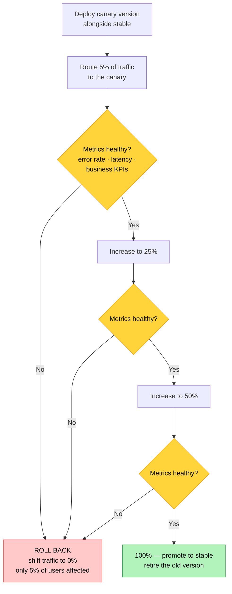
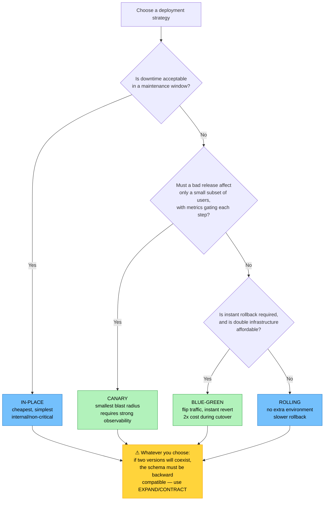

# Objective 2.2 — Given a scenario, implement appropriate deployment strategies

> **Domain 2.0 — Deployment (19% of exam)** · Exam CV0-004 V4 · Objectives doc v5.0
> **Status:** Exam-ready · **Version:** 2.0 (enhanced) · Supersedes `full notes/Objective-2.2-Deployment-Strategies.md`

---

## 0. How to use this note

| Pass | What to read | Time |
|---|---|---|
| **1st (learn)** | Sections 1 → 9 in order | ~60 min |
| **2nd (drill)** | Section 2.1 (all four visually) + Section 7.2 (database migrations) | ~20 min |
| **3rd (test)** | Section 12 (practice) + Section 13 (PBQ drills) | ~30 min |
| **Exam eve** | Section 14 (60-second recall sheet) only | ~4 min |

> 📌 **The verb is "implement," and there are only four strategies — this is one of the most PBQ-likely objectives on the exam.** Expect to be given requirements (downtime tolerance, budget, rollback speed) and asked to select and configure. Section 7 covers what all four strategies *depend on* — backward compatibility and database migrations — which is where real deployments actually fail.

---

## 1. Official objective coverage

> **2.2 Given a scenario, implement appropriate deployment strategies.**
> - Blue-green
> - Canary
> - Rolling
> - In-place

### 1.1 What the verb tells you

**"Given a scenario, implement"** — an **application** objective, and a step stronger than 1.1's "use." You must not only pick the right strategy but know **how it is carried out** and what it requires.

| You must be able to… | Example |
|---|---|
| **Select** from requirements | "Zero downtime + instant rollback" → blue-green |
| **Sequence** the steps | Deploy to green → smoke test → switch traffic → keep blue warm |
| **State the prerequisites** | Two versions coexisting requires a **backward-compatible schema** |
| **Identify the rollback path** | Repoint traffic vs redeploy the old build |
| **Recognise the cost** | Blue-green needs **double capacity** during cutover |

### 1.2 Coverage checklist

- [ ] I can describe all four strategies and their **rollback mechanism**
- [ ] I know which needs **double infrastructure** and which needs **none**
- [ ] I know which causes **downtime**
- [ ] I know which limits **blast radius** to a subset of users
- [ ] I can set **maxUnavailable / maxSurge** for a rolling update
- [ ] I know that blue-green, canary, **and** rolling all require **two versions to coexist**
- [ ] I understand **expand-contract** database migration and why it matters
- [ ] I know the **DNS TTL** problem with DNS-based blue-green cutover
- [ ] I can distinguish **canary** from **A/B testing**
- [ ] I know what **feature flags** decouple, and what **shadow/mirror** deployment does
- [ ] I know when **roll-forward** beats rollback

---

## 2. The core mental model

### 2.1 ★ The four strategies in one picture

```text
   IN-PLACE — update the same servers
   ┌─────┐ ┌─────┐ ┌─────┐        ┌─────┐ ┌─────┐ ┌─────┐
   │ v1  │ │ v1  │ │ v1  │  STOP  │ v2  │ │ v2  │ │ v2  │
   └─────┘ └─────┘ └─────┘  ────►  └─────┘ └─────┘ └─────┘
   ████████ SERVING ████████  ✗ DOWN  ████████ SERVING ███████
                          ▲ OUTAGE ▲
   Cost: none · Rollback: redeploy old build (slow) · Downtime: YES

   ROLLING — replace in batches
   ┌─────┐ ┌─────┐ ┌─────┐    ┌─────┐ ┌─────┐ ┌─────┐    ┌─────┐┌─────┐┌─────┐
   │ v1  │ │ v1  │ │ v1  │ →  │ v2  │ │ v1  │ │ v1  │ →  │ v2  ││ v2  ││ v2  │
   └─────┘ └─────┘ └─────┘    └─────┘ └─────┘ └─────┘    └─────┘└─────┘└─────┘
   ALWAYS partially serving · ⚠ BOTH VERSIONS LIVE AT ONCE
   Cost: none (or +1 with surge) · Rollback: roll back batch by batch (slow)

   BLUE-GREEN — two full environments, flip all at once
        ┌──────────────┐              ┌──────────────┐
        │ BLUE  (v1)   │◄── 100% ─────│              │
        │ LIVE         │              │ LOAD BALANCER│
        └──────────────┘              │   or DNS     │
        ┌──────────────┐              │              │
        │ GREEN (v2)   │              └──────────────┘
        │ idle, tested │
        └──────────────┘
                    ▼ FLIP (seconds)
        ┌──────────────┐              ┌──────────────┐
        │ BLUE  (v1)   │              │ LOAD BALANCER│
        │ kept WARM ◄──┼── rollback ──│              │
        └──────────────┘              │              │
        ┌──────────────┐◄── 100% ─────│              │
        │ GREEN (v2)   │              └──────────────┘
        │ LIVE         │
        └──────────────┘
   Cost: 2× during cutover · Rollback: INSTANT (flip back) · Downtime: ~zero

   CANARY — expose a small slice, then widen
        5%          →     25%      →     50%     →    100%
   ┌───┐┌────────┐   ┌────┐┌──────┐  ┌─────┐┌────┐   ┌──────────┐
   │v2 ││   v1   │   │ v2 ││  v1  │  │ v2  ││ v1 │   │    v2    │
   └───┘└────────┘   └────┘└──────┘  └─────┘└────┘   └──────────┘
     ▲ watch metrics at each gate — abort and roll back on failure
   Cost: small slice · Rollback: shift % back (fast) · Blast radius: SMALLEST
```

### 2.2 The four decision dimensions

```text
   ┌──────────────────┬───────────┬─────────┬──────────┬──────────┐
   │                  │ IN-PLACE  │ ROLLING │BLUE-GREEN│  CANARY  │
   ├──────────────────┼───────────┼─────────┼──────────┼──────────┤
   │ DOWNTIME         │ ✗ YES     │ ~none   │ ~none    │ ~none    │
   │ EXTRA COST       │ none      │ none/+1 │ ★ 2×     │ small    │
   │ ROLLBACK SPEED   │ slow      │ slow    │ ★ INSTANT│ fast     │
   │ BLAST RADIUS     │ everyone  │ growing │ everyone │ ★ SMALLEST│
   │                  │           │ subset  │ at once  │          │
   └──────────────────┴───────────┴─────────┴──────────┴──────────┘

   ★ You cannot optimise all four. The scenario tells you which
     dimension the business cares about most.
```

### 2.3 Deploy ≠ release

```text
   DEPLOY   = the new code is running on the infrastructure
   RELEASE  = users can actually see/use the new behaviour

   Traditionally these happen together. FEATURE FLAGS separate them:

   ┌────────────────────────────────────────────────────────────┐
   │  Deploy v2 with the new feature behind a flag = OFF         │
   │  → code is live, users see NO change (this is a DARK LAUNCH)│
   │  → turn the flag ON for 1% of users, then 10%, then all     │
   │  → problem? Turn the FLAG off — no redeploy, instant        │
   └────────────────────────────────────────────────────────────┘

   ★ A feature flag gives you canary-style control WITHOUT a
     second deployment, and rollback in milliseconds.
```

---

## 3. Blue-green deployment

| | |
|---|---|
| **How it works** | Maintain **two identical production environments**. **Blue** serves live traffic; **green** receives the new version. Once green is deployed and validated, **switch 100% of traffic** to green in one action. Blue is kept running as the rollback target. |
| **Switch mechanism** | **Load balancer target-group swap** (seconds, precise) or **DNS record change** (subject to TTL — see the warning below) |
| **Rollback** | ★ **Instant** — point traffic back at blue. This is its defining advantage |
| **Downtime** | Effectively **zero** |
| **★ Cost** | **Double the infrastructure** during the cutover period — the main drawback |
| **Best for** | Mission-critical applications, regulated cutovers needing a clean before/after audit trail, releases where instant rollback is worth the cost, major version changes |
| **Exam triggers** | "instant rollback", "zero downtime", "two identical environments", "switch all traffic at once", "cost is not the constraint", "must be able to revert immediately" |

**Implementation sequence:**

```text
   ① Provision GREEN as an identical copy of BLUE
   ② Deploy the new version to GREEN
   ③ Run smoke tests / health checks against GREEN (not user-facing yet)
   ④ SWITCH traffic: load balancer target group → GREEN
   ⑤ MONITOR closely — error rate, latency, business metrics
   ⑥ Keep BLUE running and warm for the agreed rollback window
   ⑦ Only then decommission BLUE (or keep it as the next GREEN)
```

> ⚠️ **The DNS TTL trap.** If you cut over by changing a DNS record, clients keep the old address cached until the **TTL** expires — so the switch is not instant, and neither is the rollback. Lower the TTL well in advance, or cut over at the **load balancer** instead. (Same caching problem as DNS-based service discovery in 1.5.)

> ⚠️ **In-flight sessions.** Flipping traffic drops connections held on blue unless sessions are externalised (see 1.5) and **connection draining / deregistration delay** is configured so in-flight requests finish.

---

## 4. Canary deployment

| | |
|---|---|
| **How it works** | Release the new version to a **small subset of traffic or users** (commonly 1–5%), monitor closely, then **progressively increase exposure** (5% → 25% → 50% → 100%), aborting at any stage if metrics degrade. |
| **Traffic splitting by** | Weighted percentage · request header · user cohort or ID hash · geography · device type |
| **Rollback** | **Fast** — shift the weight back to the stable version. Only the exposed slice was ever affected |
| **★ Defining advantage** | **The smallest blast radius of any strategy.** A bad release harms 5% of users, not 100% |
| **★ Prerequisite** | **Good observability.** A canary is worthless if you cannot tell whether the canary group is doing worse — you need per-version metrics on error rate, latency, and business outcomes (see 3.1) |
| **Cost** | Low — only a small slice of extra capacity |
| **Best for** | High-traffic consumer applications, risky or uncertain changes, teams with strong monitoring, gradual confidence-building |
| **Exam triggers** | "release to a small percentage first", "gradually increase exposure", "monitor metrics before proceeding", "limit the number of affected users", "detect problems before full rollout" |

**Implementation sequence:**



> 💡 **Automated canary analysis:** mature pipelines define success criteria (e.g. "error rate must stay within 1% of baseline") and **automatically abort and roll back** if a gate fails — no human in the loop.

---

## 5. Rolling deployment

| | |
|---|---|
| **How it works** | Replace instances with the new version **in batches**, a few at a time, until the whole fleet is updated. The service stays available throughout because the un-updated instances keep serving. |
| **Key parameters** | **maxUnavailable** — how many instances may be down below the desired count. **maxSurge** — how many *extra* instances may be created above the desired count |
| **Rollback** | **Slow** — you must roll the previous version back through the fleet batch by batch |
| **Downtime** | None, **if** capacity is preserved |
| **★ Cost** | **None** — no second environment. Its defining advantage |
| **★ Requirement** | **Both versions serve traffic simultaneously** during the rollout, so the versions must be mutually compatible (Section 7) |
| **Best for** | Stateless services, container/Kubernetes fleets, cost-sensitive environments, routine low-risk updates |
| **Exam triggers** | "replace instances in batches", "no second environment", "gradually update the fleet", "maintain availability without extra cost", "maxUnavailable / maxSurge" |

**Choosing the parameters:**

```text
   maxUnavailable = 0, maxSurge = 1
   ┌────┐┌────┐┌────┐  +  ┌────┐        NEVER drops below full capacity
   │ v1 ││ v1 ││ v1 │     │ v2 │ NEW    Requires room for 1 extra instance
   └────┘└────┘└────┘     └────┘        → safest; use for production

   maxUnavailable = 1, maxSurge = 0
   ┌────┐┌────┐┌ ─ ─┐                   Runs at REDUCED capacity during
   │ v1 ││ v1 │ down                    the rollout — no extra cost
   └────┘└────┘└ ─ ─┘                   → use when capacity headroom exists

   ★ maxSurge trades a little extra cost for zero capacity loss.
     maxUnavailable trades capacity for zero extra cost.
     Setting BOTH to 0 means the rollout can never start.
```

> ⚠️ **A rolling deployment cannot be paused meaningfully mid-flight the way a canary can.** It is a mechanism for *updating* a fleet, not for *evaluating* a release — the traffic split is incidental, not controlled.

---

## 6. In-place deployment

| | |
|---|---|
| **How it works** | Stop the running application, install the new version **on the same infrastructure**, restart. Also called *redeploy* or *replace*. |
| **Rollback** | **Slow and manual** — stop again, reinstall the previous build, restart. Rollback may fail if the old build or its dependencies are no longer available |
| **★ Downtime** | **Yes — a full outage** for the duration. Its defining drawback |
| **Cost** | **None** — no additional infrastructure |
| **Best for** | Internal tools, non-critical systems, scheduled maintenance windows, small single-server deployments, workloads whose statefulness makes running two versions impossible |
| **Exam triggers** | "lowest cost", "scheduled maintenance window", "downtime is acceptable", "single server", "internal application", "stop, update, restart" |

```text
   IN-PLACE TIMELINE

   ──── serving v1 ────┤ STOP │ INSTALL │ START ├──── serving v2 ────►
                       └──────── OUTAGE ───────┘
                        typically minutes to hours

   ⚠ Rollback repeats the whole outage — and only works if you kept
     the previous artefact and its configuration.
```

> 💡 **In-place is not automatically the wrong answer.** For an internal HR portal used 09:00–17:00, a Sunday-night window costs nothing and needs no extra infrastructure. The exam rewards matching the strategy to the *business* requirement, not always choosing the most sophisticated option.

---

## 7. What all these strategies depend on

This section is where real deployments fail, and it is under-covered in most study material.

### 7.1 ★ Version coexistence

**Blue-green, canary, and rolling all run two versions at the same time** — even blue-green, briefly, during cutover and for the rollback window.

That means the old and new versions must both work against **the same shared state**: the same database, the same message formats, the same caches, the same APIs.

| Requirement | Why |
|---|---|
| **Backward-compatible database schema** | v1 must keep working while v2 is live, and vice versa during rollback |
| **Backward-compatible APIs and message formats** | A v1 consumer may receive a v2 message |
| **Externalised session state** | Users must not lose sessions when moved between versions (see 1.5) |
| **Idempotent operations** | A retried request may hit a different version |

> ★ **Only in-place avoids version coexistence** — because nothing is serving during the change. That is its one architectural advantage.

### 7.2 ★ Database migrations — the expand-contract pattern

A destructive schema change (rename, drop, add `NOT NULL`) deployed alongside the code that needs it **makes rollback impossible** — the old code cannot run against the new schema.

The fix is to split the change into **backward-compatible phases**, each independently deployable and reversible:

```text
   ★ EXPAND / CONTRACT (also called "parallel change")

   PHASE 1 — EXPAND (additive only, safe)
   ┌──────────────────────────────────────────────────────────┐
   │  ADD the new column/table. KEEP the old one.             │
   │  Deploy code that WRITES BOTH, READS the OLD.            │
   │  → v1 and v2 both work. Rollback is safe.                │
   └──────────────────────────────────────────────────────────┘
                              ▼
   PHASE 2 — MIGRATE
   ┌──────────────────────────────────────────────────────────┐
   │  BACKFILL existing rows into the new column.             │
   │  Deploy code that WRITES BOTH, READS the NEW.            │
   │  → still reversible.                                     │
   └──────────────────────────────────────────────────────────┘
                              ▼
   PHASE 3 — CONTRACT (destructive, only when nothing needs the old)
   ┌──────────────────────────────────────────────────────────┐
   │  Deploy code that writes and reads the NEW only.         │
   │  THEN drop the old column.                               │
   └──────────────────────────────────────────────────────────┘

   RULE DURING COEXISTENCE: additive changes only.
   ✗ No renaming  ✗ No dropping  ✗ No new NOT NULL without a default
```

> ⚠️ **This is the most common real cause of a failed rollback.** The application rolls back fine; the database cannot. Expect a scenario where a team "rolled back the deployment but the site stayed broken."

### 7.3 Health gates and rollback triggers

| Control | Purpose |
|---|---|
| **Health checks / readiness probes** | Traffic reaches an instance only once it is genuinely ready (see 1.6) |
| **Smoke tests** | Validate the new version before exposing it to users |
| **Success criteria** | Explicit thresholds — error rate, p95 latency, business KPIs |
| **Automated rollback** | Abort and revert when a gate fails, without waiting for a human |
| **Connection draining** | Let in-flight requests complete before removing an instance |
| **Monitoring window** | Keep watching *after* 100% — many defects appear only at full load |

### 7.4 Rollback vs roll-forward

| | **Rollback** | **Roll-forward** |
|---|---|---|
| Action | Return to the previous version | Deploy a **fix** on top |
| Speed | Fast **if** the strategy supports it | Depends on how quickly a fix can be built |
| When correct | Serious regression, cause unknown, safe to revert | **Schema already migrated destructively**, or the old version is now incompatible |
| Risk | Low, when versions are compatible | Deploying under pressure |

> 💡 **Once you have contracted the schema, rollback may no longer be possible — roll-forward becomes the only option.** This is why the expand-contract sequence matters.

---

## 8. Adjacent techniques

| Technique | What it is | How it differs |
|---|---|---|
| **Feature flag / toggle** | Ship code disabled, enable it for chosen users at runtime | **Separates deploy from release**; rollback is a config change in milliseconds, no redeploy |
| **Dark launch** | Deploy and exercise a feature with the flag off for users | Validates in production with zero user exposure |
| **★ A/B testing** | Serve two variants to compare **business outcomes** | Same *mechanism* as canary, different *purpose*: canary asks "is it broken?", A/B asks "which performs better?" |
| **Shadow / mirror deployment** | Send a **copy** of real traffic to the new version and discard its responses | Zero user risk; validates performance and correctness under real load. Care needed with writes |
| **Immutable infrastructure** | Never patch in place — replace instances with new images | The philosophy underpinning blue-green and rolling |
| **Ring deployment** | Widen exposure through defined rings (internal → beta → general) | A canary with named cohorts rather than percentages |

**Canary vs A/B testing — a genuine exam distractor:**

| | **Canary** | **A/B test** |
|---|---|---|
| Purpose | **Risk reduction** — detect defects | **Product decision** — compare outcomes |
| Question asked | "Is the new version broken?" | "Which version converts better?" |
| Measures | Error rate, latency, resource use | Conversion, engagement, revenue |
| Duration | Minutes to days | Days to weeks (statistical significance) |
| Outcome | Promote or roll back | Keep the winning variant |
| Both variants intended to ship? | No — one is a candidate | **Yes — both are valid code** |

---

## 9. Comparison tables

### 9.1 ★ The four strategies

| Dimension | **In-place** | **Rolling** | **Blue-green** | **Canary** |
|---|---|---|---|---|
| **Downtime** | ✗ **Full outage** | None (with surge) | ~None | ~None |
| **Extra infrastructure** | **None** | None, or +maxSurge | ★ **2× during cutover** | Small slice |
| **Rollback mechanism** | Reinstall old build | Roll back batch by batch | ★ **Repoint traffic** | Shift weight to 0% |
| **Rollback speed** | Slow (minutes–hours) | Slow | ★ **Instant (seconds)** | Fast |
| **Blast radius if bad** | **Everyone** | Growing subset | **Everyone at once** | ★ **Small subset only** |
| **Both versions live** | ❌ No | ✅ Yes | ✅ Briefly | ✅ Yes |
| **Needs strong monitoring** | Helpful | Helpful | Helpful | ★ **Essential** |
| **Complexity** | **Lowest** | Low | Medium | **Highest** |
| **Best for** | Internal, maintenance windows | Stateless fleets, cost-sensitive | Critical apps, regulated cutovers | High-traffic consumer apps, risky changes |

### 9.2 Scenario clue → strategy

| Clue | Strategy |
|---|---|
| "Must be able to revert instantly" | **Blue-green** |
| "Zero downtime and budget is not a constraint" | **Blue-green** |
| "Clean before/after cutover for audit" | **Blue-green** |
| "Expose to 5% of users first" | **Canary** |
| "Monitor metrics before increasing exposure" | **Canary** |
| "Limit the number of users affected by a bad release" | **Canary** |
| "No budget for a second environment, but stay available" | **Rolling** |
| "Update the fleet in batches" | **Rolling** |
| "Downtime is acceptable during a maintenance window" | **In-place** |
| "Single server, internal tool, lowest cost" | **In-place** |
| "Stateful application that cannot run two versions" | **In-place** (or very careful rolling) |
| "Turn the feature on for some users without redeploying" | **Feature flag** |
| "Compare which version converts better" | **A/B test** (not canary) |
| "Test with real traffic without affecting users" | **Shadow/mirror** |

### 9.3 Rollback characteristics

| Strategy | Mechanism | Time | Can it fail? |
|---|---|---|---|
| **Blue-green** | Repoint LB/DNS to blue | **Seconds** (minutes if DNS TTL) | If blue was decommissioned, or the schema was contracted |
| **Canary** | Set canary weight to 0% | Seconds | Rarely — stable version never stopped |
| **Rolling** | Roll the old version back through the fleet | Minutes–hours | Partially updated states are messy |
| **In-place** | Stop, reinstall old build, start | Minutes–hours | If the old artefact or config is gone |

### 9.4 Strategy selection flow



---

## 10. Exam traps & distractor patterns

| # | Trap | The truth |
|---|---|---|
| 1 | "Blue-green limits the blast radius" | It does **not** — the switch exposes **100% of users at once**. **Canary** is the blast-radius strategy. Blue-green's advantage is **instant rollback** |
| 2 | "Canary and blue-green are the same" | Canary shifts traffic **gradually with gates**; blue-green switches **all at once** |
| 3 | "Rolling deployments have no risk" | Both versions serve simultaneously, so **incompatible versions break users mid-rollout**, and rollback is slow |
| 4 | "Blue-green is always best" | It costs **double infrastructure**, and it still exposes everyone at once |
| 5 | "In-place is always wrong" | For internal tools with an agreed window it is the correct, cheapest answer |
| 6 | "Rollback is always available" | Not if the **schema was destructively migrated**, blue was decommissioned, or the old artefact is gone |
| 7 | "DNS cutover is instant" | **DNS TTL caching** delays both the cutover and the rollback. Use a load balancer, or lower TTL well in advance |
| 8 | "Canary works without monitoring" | ⚠️ A canary with no per-version metrics is just a slow, partial rollout — **observability is the prerequisite** |
| 9 | "Canary and A/B testing are interchangeable" | Same mechanism, different purpose: canary detects **defects**; A/B compares **business outcomes** |
| 10 | "Deploying means releasing" | **Feature flags separate them** — deploy dark, release later, disable in milliseconds |
| 11 | "maxSurge and maxUnavailable can both be 0" | Then the rollout **cannot start** — nothing may be removed and nothing may be added |
| 12 | "Rolling needs a second environment" | It explicitly does **not** — that is its main advantage over blue-green |
| 13 | "Blue-green means no coexistence" | Both run during cutover and the rollback window, so **compatibility still applies** |
| 14 | "Sessions survive a blue-green flip automatically" | Only if state is **externalised** and connection draining is configured |
| 15 | "Rolling back always fixes the outage" | If the database was already contracted, only **roll-forward** works |

**Disambiguation drill:**

| Pair | The deciding question |
|---|---|
| **Blue-green vs canary** | **Instant rollback** (blue-green) or **small blast radius with gates** (canary)? |
| **Blue-green vs rolling** | Is **double infrastructure** affordable, and is instant rollback required? |
| **Rolling vs in-place** | Must the service **stay available** during the update? |
| **Canary vs A/B** | Detecting **defects** or comparing **business outcomes**? |
| **Canary vs feature flag** | Routing **traffic** to a second deployment, or toggling behaviour **within one**? |
| **Rollback vs roll-forward** | Is reverting still **possible** given the schema state? |

---

## 11. Keyword → answer trigger table

| If you see… | Think |
|---|---|
| instant rollback · revert immediately · two identical environments · flip all traffic · clean cutover for audit | **Blue-green** |
| 5% of users · gradually increase · monitor metrics between stages · limit affected users · abort on regression | **Canary** |
| batches · no second environment · maxUnavailable / maxSurge · update the fleet progressively | **Rolling** |
| maintenance window · downtime acceptable · single server · lowest cost · stop, update, restart | **In-place** |
| stateful app that cannot run two versions | **In-place** |
| enable for some users without redeploying · turn it off instantly | **Feature flag** |
| deploy the code but keep it hidden from users | **Dark launch** |
| which variant converts better · compare business outcomes | **A/B test** |
| send real traffic to the new version but discard responses | **Shadow / mirror** |
| rolled back the app but the site is still broken | **Destructive schema migration — needed expand/contract** |
| cutover took 30 minutes to take effect | **DNS TTL caching** |
| in-flight requests were dropped at cutover | **No connection draining / stateful sessions** |
| cannot revert; must fix forward | **Roll-forward** |

---

## 12. Practice questions

<details>
<summary><b>Q1.</b> A payment platform requires zero downtime and the ability to revert within seconds if the release misbehaves. Budget is not a constraint. Which strategy?</summary>

**A. Blue-green** · B. In-place · C. Rolling · D. Canary

**Correct: A — blue-green.** Two full environments allow the traffic switch to be reversed instantly by repointing the load balancer.
- **B wrong:** In-place causes a full outage and slow rollback.
- **C wrong:** Rolling rollback requires re-rolling the fleet, taking minutes to hours.
- **D wrong:** Canary reduces blast radius but does not offer a single instant full revert; it is also slower to reach 100%.
</details>

<details>
<summary><b>Q2.</b> A consumer app wants a bad release to affect as few users as possible, with metrics reviewed before wider exposure. Which strategy?</summary>

A. Blue-green · B. In-place · C. Rolling · **D. Canary**

**Correct: D — canary.** Exposing 5% first and gating each increase gives the **smallest blast radius** of any strategy.
- **A wrong:** Blue-green exposes 100% of users the moment traffic switches.
- **B wrong:** In-place affects everyone and causes downtime.
- **C wrong:** Rolling exposes a growing subset but without controlled evaluation gates.
</details>

<details>
<summary><b>Q3.</b> A team must update a 50-instance stateless fleet with no additional infrastructure budget while keeping the service available. Which strategy?</summary>

A. Blue-green · B. In-place · **C. Rolling** · D. Canary

**Correct: C — rolling.** Instances are replaced in batches, so the service stays available with **no second environment**.
- **A wrong:** Blue-green requires double infrastructure.
- **B wrong:** In-place causes an outage.
- **D wrong:** Canary is feasible but is aimed at risk evaluation; the stated constraint is cost with continued availability.
</details>

<details>
<summary><b>Q4.</b> An internal HR portal is used only during business hours. The company wants the simplest, cheapest update process. Which strategy?</summary>

A. Blue-green · B. Canary · C. Rolling · **D. In-place**

**Correct: D — in-place.** With an agreed out-of-hours window, downtime costs nothing and no extra infrastructure is required.
- **A/B/C wrong:** All add cost or complexity for a benefit this workload does not need. Matching the strategy to the business requirement is the skill being tested.
</details>

<details>
<summary><b>Q5.</b> A team performs a blue-green deployment, then rolls back to blue after discovering a bug — but the application remains broken. What is the MOST likely cause?</summary>

A. DNS propagation · **B. The release included a destructive database schema change, so the old version cannot run against the migrated database** · C. The load balancer failed · D. The canary weight was misconfigured

**Correct: B.** Rolling back the application does not roll back the database. Destructive migrations must be split using **expand-contract** so both versions can run against the schema.
- **A wrong:** DNS would delay the switch, not leave the app functionally broken.
- **C wrong:** A load balancer failure would cause an outage, not version-specific errors.
- **D wrong:** No canary is involved in a blue-green deployment.
</details>

<details>
<summary><b>Q6.</b> Which strategy exposes ALL users to the new version simultaneously?</summary>

A. Canary · **B. Blue-green** · C. Rolling · D. Feature-flagged release

**Correct: B — blue-green.** The switch moves 100% of traffic at once; its advantage is rollback speed, not limited exposure.
- **A wrong:** Canary is explicitly partial.
- **C wrong:** Rolling exposes a growing subset over time.
- **D wrong:** Flags let you choose exposure.
</details>

<details>
<summary><b>Q7.</b> In a Kubernetes rolling update, what does <code>maxSurge</code> control?</summary>

A. How many pods may be unavailable · **B. How many additional pods above the desired count may be created during the rollout** · C. The canary traffic percentage · D. The rollback timeout

**Correct: B.** `maxSurge` permits temporary extra capacity so the fleet never drops below its target during the update.
- **A wrong:** That is `maxUnavailable`.
- **C/D wrong:** Neither is a rolling-update parameter.
</details>

<details>
<summary><b>Q8.</b> A blue-green cutover performed by changing a DNS record takes 30 minutes to fully take effect. Why?</summary>

A. The load balancer was misconfigured · **B. Clients cache the old DNS record until its TTL expires** · C. The green environment was not warmed · D. Connection draining was disabled

**Correct: B.** DNS TTL caching delays both cutover and rollback — a key reason to switch at the load balancer or lower the TTL in advance.
- **A wrong:** No load balancer switch was used.
- **C wrong:** Warming affects first-request latency, not propagation.
- **D wrong:** Draining affects in-flight connections only.
</details>

<details>
<summary><b>Q9.</b> What is the PRIMARY difference between a canary deployment and an A/B test?</summary>

A. Canary uses two environments; A/B uses one · **B. Canary aims to detect defects before wide exposure; A/B compares business outcomes between variants that are both intended to work** · C. A/B testing cannot split traffic · D. They are identical

**Correct: B.** The mechanism is similar; the purpose and success metrics differ — errors and latency versus conversion and engagement.
- **A wrong:** Both split traffic between versions.
- **C wrong:** Traffic splitting is exactly how A/B tests run.
- **D wrong:** Conflating them is a standard distractor.
</details>

<details>
<summary><b>Q10.</b> Which capability is ESSENTIAL for a canary deployment to be meaningful?</summary>

A. A second full environment · **B. Per-version observability — error rates, latency, and business metrics segmented by version** · C. DNS-based routing · D. A stateful application

**Correct: B.** Without the ability to compare the canary group against the stable baseline, you cannot make the go/no-go decision that defines the strategy.
- **A wrong:** That describes blue-green.
- **C wrong:** Routing can be done at the load balancer, mesh, or gateway.
- **D wrong:** Statefulness makes canary harder, not required.
</details>

<details>
<summary><b>Q11.</b> A team wants to deploy new code to production without any user seeing the change, enabling it later for selected users. What should they use?</summary>

A. Blue-green · **B. Feature flags (dark launch)** · C. In-place · D. Rolling

**Correct: B.** Feature flags **separate deploy from release**: the code ships disabled, and exposure is a runtime configuration change reversible in milliseconds.
- **A/C/D wrong:** All three make the new behaviour live as soon as the deployment completes.
</details>

<details>
<summary><b>Q12.</b> During a rolling update, some users receive errors because the new version writes a message format the old version cannot parse. What was the underlying failure?</summary>

A. Insufficient maxSurge · **B. The versions were not backward compatible, which rolling deployments require because both run simultaneously** · C. DNS caching · D. Missing connection draining

**Correct: B.** Rolling, blue-green, and canary all involve version coexistence, so message formats, APIs, and schemas must be mutually compatible.
- **A wrong:** Surge affects capacity, not compatibility.
- **C/D wrong:** Neither explains parse failures between versions.
</details>

<details>
<summary><b>Q13.</b> Which deployment strategy does NOT require two versions to run simultaneously?</summary>

A. Rolling · B. Canary · C. Blue-green · **D. In-place**

**Correct: D — in-place.** Because the service is stopped during the update, no coexistence occurs. That is its one architectural advantage.
- **A/B wrong:** Both run versions side by side by design.
- **C wrong:** Blue-green runs both during cutover and the rollback window.
</details>

<details>
<summary><b>Q14.</b> A team plans to rename a database column and deploy application code that uses the new name, all in one release. What is the risk?</summary>

A. Increased latency · **B. Rollback becomes impossible, because the previous application version cannot run against the renamed column** · C. DNS caching issues · D. Higher infrastructure cost

**Correct: B.** Destructive schema changes must be split into **expand → migrate → contract** phases so both versions can operate during the transition.
- **A/C/D wrong:** None describe the compatibility failure created by the rename.
</details>

<details>
<summary><b>Q15.</b> Which strategy has the SLOWEST rollback while still avoiding downtime?</summary>

A. Blue-green · B. Canary · **C. Rolling** · D. Feature flag

**Correct: C — rolling.** Reverting means rolling the previous version back through the fleet batch by batch, which takes minutes to hours.
- **A wrong:** Blue-green rollback is a traffic repoint.
- **B wrong:** Canary rollback is a weight change.
- **D wrong:** Flag rollback is near-instant.
</details>

<details>
<summary><b>Q16.</b> After a blue-green cutover, users report that in-flight transactions failed. What was MOST likely missing?</summary>

**A. Connection draining and externalised session state** · B. A canary stage · C. Higher maxSurge · D. A larger TTL

**Correct: A.** Without draining, in-flight requests on blue are cut off; without externalised sessions, users lose their session at the switch (see 1.5).
- **B wrong:** Canary staging would reduce exposure but not preserve in-flight requests.
- **C wrong:** maxSurge is a rolling-update parameter.
- **D wrong:** A larger TTL would make the cutover slower, not safer.
</details>

<details>
<summary><b>Q17.</b> A team wants to validate a new service's performance under real production load without any risk to users. What should they use?</summary>

A. Canary · B. Blue-green · **C. Shadow (mirror) deployment** · D. In-place

**Correct: C — shadow deployment.** A copy of live traffic is sent to the new version and its responses are discarded, so users are never affected.
- **A wrong:** Canary exposes real users, if only a few.
- **B wrong:** Blue-green eventually serves everyone.
- **D wrong:** In-place replaces the running version outright.
</details>

<details>
<summary><b>Q18.</b> Which pairing of strategy to its DEFINING advantage is CORRECT?</summary>

A. Canary — instant full rollback · B. Rolling — zero blast radius · **C. Blue-green — instant rollback by repointing traffic** · D. In-place — no downtime

**Correct: C.** Instant revert is blue-green's distinguishing property.
- **A wrong:** Canary's advantage is the smallest blast radius.
- **B wrong:** Rolling exposes a growing subset of users.
- **D wrong:** In-place causes a full outage.
</details>

<details>
<summary><b>Q19.</b> In an expand-contract migration, what happens during the EXPAND phase?</summary>

**A. The new column is added while the old is kept, and code writes to both while reading the old** · B. The old column is dropped · C. Traffic is shifted to the new version · D. The database is taken offline

**Correct: A.** Expand is purely additive, keeping both versions functional and rollback safe.
- **B wrong:** That is the **contract** phase, performed last.
- **C wrong:** That is a deployment step, not a schema phase.
- **D wrong:** The pattern exists specifically to avoid downtime.
</details>

<details>
<summary><b>Q20.</b> A rolling update is configured with <code>maxUnavailable=0</code> and <code>maxSurge=0</code>. What happens?</summary>

A. The fastest possible rollout · B. Instances update two at a time · **C. The rollout cannot proceed — no instance may be removed and no additional instance may be created** · D. It falls back to blue-green

**Correct: C.** With neither reduction nor surge permitted, there is no way to make progress.
- **A/B wrong:** No update can start.
- **D wrong:** There is no automatic fallback between strategies.
</details>

<details>
<summary><b>Q21.</b> A serious regression is found after the schema has already been contracted. What is the appropriate response?</summary>

A. Roll back the application to the previous version · **B. Roll forward — deploy a fix, because reverting would leave the old code unable to run against the current schema** · C. Restore the database from backup and continue · D. Switch to canary deployment

**Correct: B — roll forward.** Once the old columns are gone, the previous application version no longer works; the only safe path is a corrective release.
- **A wrong:** That is precisely what the contracted schema prevents.
- **C wrong:** A restore would lose all transactions since the migration.
- **D wrong:** Changing strategy does not resolve the current incident.
</details>

<details>
<summary><b>Q22.</b> Which strategy requires approximately DOUBLE the infrastructure during deployment?</summary>

A. Rolling · B. Canary · **C. Blue-green** · D. In-place

**Correct: C.** Two complete production environments run concurrently through the cutover and rollback window.
- **A wrong:** Rolling needs at most a small surge.
- **B wrong:** Canary needs only a small extra slice.
- **D wrong:** In-place uses the same infrastructure.
</details>

<details>
<summary><b>Q23.</b> An organisation must produce an auditable record of a clean cutover between two application versions for a regulator. Which strategy BEST supports this?</summary>

**A. Blue-green** · B. Rolling · C. In-place · D. Canary

**Correct: A.** A discrete, timestamped switch between two fully known environments gives a clean before/after boundary and a defined revert point.
- **B wrong:** A gradual fleet replacement has no single cutover moment.
- **C wrong:** In-place mutates the existing environment, weakening the audit trail.
- **D wrong:** Progressive exposure blurs the boundary.
</details>

<details>
<summary><b>Q24.</b> Which statement about feature flags is CORRECT?</summary>

A. They replace the need for any deployment strategy · **B. They separate deployment from release, so a feature can be disabled instantly without redeploying** · C. They only work with blue-green · D. They increase rollback time

**Correct: B.** Deploy dark, release by configuration, disable in milliseconds — the fastest rollback available.
- **A wrong:** Code still needs to reach the servers by some strategy.
- **C wrong:** They are independent of the deployment strategy.
- **D wrong:** They dramatically **reduce** rollback time.
</details>

<details>
<summary><b>Q25.</b> A stateful legacy application cannot have two versions running against its data at the same time. Which strategy is MOST appropriate?</summary>

A. Canary · B. Blue-green · C. Rolling · **D. In-place**

**Correct: D — in-place.** It is the only strategy that avoids version coexistence, because the service is stopped during the update.
- **A/B/C wrong:** All three run both versions simultaneously, which this application cannot tolerate.
</details>

---

## 13. PBQ-style drills

### Drill A — Match requirement to strategy

| # | Requirement | Strategy? |
|---|---|---|
| 1 | Revert within seconds; cost is not a concern | |
| 2 | Limit a bad release to 5% of users | |
| 3 | Keep 200 stateless pods available with no extra environment | |
| 4 | Internal wiki, Sunday-night window, cheapest option | |
| 5 | Regulator requires a clean, auditable cutover point | |
| 6 | Stateful app that cannot run two versions concurrently | |
| 7 | Enable a feature for beta users without redeploying | |

<details><summary>Answers</summary>

1 → **Blue-green** · 2 → **Canary** · 3 → **Rolling** · 4 → **In-place** · 5 → **Blue-green** · 6 → **In-place** · 7 → **Feature flag**
</details>

### Drill B — Order the expand-contract migration

Put these in the correct order for renaming `cust_nm` to `customer_name` with zero downtime and safe rollback:

`drop cust_nm` · `deploy code writing both, reading customer_name` · `add customer_name column` · `deploy code writing/reading customer_name only` · `deploy code writing both, reading cust_nm` · `backfill customer_name from cust_nm`

<details><summary>Answer</summary>

1. **Add `customer_name` column** (additive, safe) — EXPAND
2. **Deploy code writing both, reading `cust_nm`** — both versions still work
3. **Backfill `customer_name` from `cust_nm`** — MIGRATE
4. **Deploy code writing both, reading `customer_name`** — still reversible
5. **Deploy code writing/reading `customer_name` only**
6. **Drop `cust_nm`** — CONTRACT, and only now is rollback no longer possible

**Rule:** every step is independently deployable and reversible until the final drop.
</details>

### Drill C — Configure the rolling update

A service runs 10 instances. For each requirement, give `maxUnavailable` and `maxSurge`.

| # | Requirement |
|---|---|
| 1 | Never drop below 10 serving instances; extra capacity is available |
| 2 | No extra capacity available; some reduced capacity is acceptable |
| 3 | Fastest rollout, capacity loss acceptable, 5 at a time |

<details><summary>Answers</summary>

1 → `maxUnavailable=0, maxSurge=1` (or higher surge for speed) — safest for production
2 → `maxUnavailable=1, maxSurge=0` — runs at 9/10 during the rollout
3 → `maxUnavailable=5, maxSurge=0` — fast but halves capacity

⚠️ `maxUnavailable=0, maxSurge=0` means the rollout **cannot start**.
</details>

### Drill D — Diagnose the deployment failure

| # | Symptom | Cause + fix? |
|---|---|---|
| 1 | Rolled back the app, but the site is still broken | |
| 2 | Blue-green cutover took 25 minutes to take effect | |
| 3 | Users lost their shopping carts at the moment of cutover | |
| 4 | Mid-rolling-update, some requests fail with parse errors | |
| 5 | Canary showed no problems, but 100% rollout caused an outage | |
| 6 | Rollback attempt failed — the previous artefact was gone | |

<details><summary>Answers</summary>

1 → **Destructive schema migration** → use expand-contract; here, roll forward
2 → **DNS TTL caching** → cut over at the load balancer, or pre-lower the TTL
3 → **Stateful sessions + no connection draining** → externalise session state, enable draining
4 → **Versions not backward compatible** → additive-only changes during coexistence
5 → **Load-dependent defect** (e.g. connection or memory limit reached only at scale) → keep monitoring after 100%, and consider load testing
6 → **No artefact retention** → keep previous builds and their configuration for the rollback window
</details>

---

## 14. 60-second recall sheet

```text
╔══════════════════════════════════════════════════════════════════════╗
║  2.2 — DEPLOYMENT STRATEGIES  (verb = "IMPLEMENT" → PBQ-likely)      ║
╠══════════════════════════════════════════════════════════════════════╣
║              DOWNTIME  EXTRA COST  ROLLBACK   BLAST RADIUS           ║
║  IN-PLACE    ✗ FULL    none        slow       everyone              ║
║  ROLLING     none      none/+surge SLOW       growing subset        ║
║  BLUE-GREEN  ~none     ★ 2×        ★ INSTANT  EVERYONE AT ONCE      ║
║  CANARY      ~none     small       fast       ★ SMALLEST            ║
║  ★ You cannot optimise all four — the scenario says which matters.  ║
╠══════════════════════════════════════════════════════════════════════╣
║  BLUE-GREEN  two identical envs · flip 100% at once · keep blue WARM ║
║    → instant rollback, clean AUDITABLE cutover · costs 2×            ║
║    ⚠ It does NOT limit blast radius — everyone switches together     ║
║    ⚠ DNS cutover is slowed by TTL CACHING → switch at the LB instead ║
║  CANARY      5% → 25% → 50% → 100%, METRICS GATE each step           ║
║    → smallest blast radius · ⚠ REQUIRES per-version OBSERVABILITY    ║
║  ROLLING     batches · maxUnavailable (how many DOWN) /              ║
║              maxSurge (how many EXTRA) · both 0 = CANNOT START       ║
║    → no second environment · rollback is slow (re-roll the fleet)    ║
║  IN-PLACE    stop → install → start · cheapest · FULL OUTAGE         ║
║    → correct answer for internal tools with a maintenance window     ║
║    → the ONLY strategy with NO version coexistence                   ║
╠══════════════════════════════════════════════════════════════════════╣
║  ★ BLUE-GREEN, CANARY AND ROLLING ALL RUN TWO VERSIONS AT ONCE       ║
║    → schema, APIs and message formats must be BACKWARD COMPATIBLE    ║
║  ★ EXPAND / CONTRACT database migration:                             ║
║      1 ADD new col (keep old) · write BOTH, read OLD                 ║
║      2 BACKFILL · write BOTH, read NEW                               ║
║      3 write/read NEW only · THEN DROP old  ← rollback ends here     ║
║    ⚠ "Rolled back but still broken" = destructive schema change      ║
║    ⚠ After CONTRACT, only ROLL FORWARD is possible                   ║
╠══════════════════════════════════════════════════════════════════════╣
║  FEATURE FLAG separates DEPLOY from RELEASE → disable in ms, no      ║
║   redeploy · DARK LAUNCH = deployed but hidden                       ║
║  CANARY (is it BROKEN? errors/latency) ≠ A/B TEST (which CONVERTS    ║
║   better? business metrics, both variants valid)                     ║
║  SHADOW/MIRROR = copy real traffic to v2, discard responses, 0 risk  ║
║  Always: health checks · smoke tests · CONNECTION DRAINING ·         ║
║   keep monitoring AFTER 100%                                         ║
╚══════════════════════════════════════════════════════════════════════╝
```

---

## 15. Cross-references

| Related objective | Connection |
|---|---|
| **1.2 Service availability** | Deployment downtime consumes the **error budget** and counts against the SLA; blue-green is effectively a planned failover |
| **1.3 Cloud networking** | **Load balancer target groups** and weighted routing are what implement blue-green and canary; **DNS TTL** limits DNS-based cutover |
| **1.5 Cloud-native design** | **Statelessness** is what makes any zero-downtime strategy possible; externalised sessions survive a cutover; idempotency matters when versions coexist |
| **1.6 Containerization** | **Rolling updates with maxUnavailable/maxSurge**, readiness probes, and Deployment rollback are the native Kubernetes implementation |
| **1.9 Database concepts** | Schema migration, backward compatibility, and expand-contract are database problems first |
| **2.1 Deployment models** | Blue-green's double capacity is far easier to justify in public cloud than on fixed private hardware |
| **2.4 Code, deploy & configure** | The pipeline that executes these strategies |
| **3.1 Observability** | **Canary is impossible without per-version metrics**; automated rollback gates depend on them |
| **5.2 CI/CD** | Deployment strategies are the delivery half of the pipeline |
| **6.1 Troubleshoot deployment** | Failed rollbacks, version-mismatch errors, and TTL-delayed cutovers are the fault scenarios |

> 🔑 **Carry this forward:** choose the strategy from whichever dimension the business names — **downtime, cost, rollback speed, or blast radius** — then check the prerequisite: if two versions will coexist, the schema and APIs must be backward compatible.

---

*Source of truth: CompTIA Cloud+ CV0-004 V4 Exam Objectives, document version 5.0. Expand-contract migration, feature flags, and shadow deployment are industry-standard practices included as supporting context, not official objective bullets. Product names are illustrative; the exam is vendor-neutral.*
