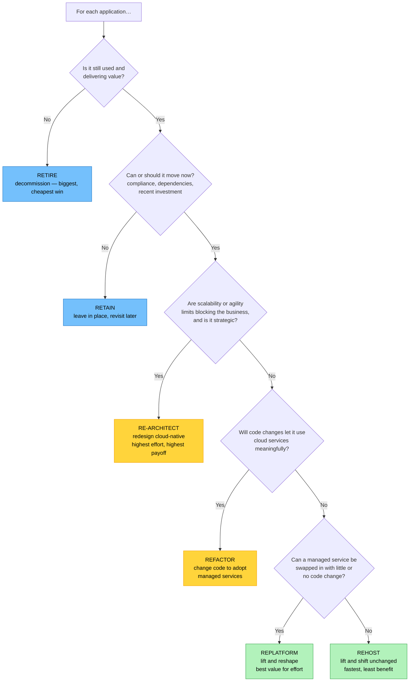

# Objective 2.3 — Summarize aspects of cloud migration

> **Domain 2.0 — Deployment (19% of exam)** · Exam CV0-004 V4 · Objectives doc v5.0
> **Status:** Exam-ready · **Version:** 2.0 (enhanced) · Supersedes `full notes/Objective-2.3-Cloud-Migration.md`

---

## 0. How to use this note

| Pass | What to read | Time |
|---|---|---|
| **1st (learn)** | Sections 1 → 8 in order | ~65 min |
| **2nd (drill)** | Section 6.1 (the six Rs ladder) + Section 5 (the eleven considerations) | ~20 min |
| **3rd (test)** | Section 11 (practice) + Section 12 (PBQ drills) | ~30 min |
| **Exam eve** | Section 13 (60-second recall sheet) only | ~5 min |

> 📌 **The six Rs are the highest-yield content here** — and CompTIA's list is **not** the industry-standard list you may have seen elsewhere. Read Section 1.2 before anything else.

---

## 1. Official objective coverage

> **2.3 Summarize aspects of cloud migration.**
> - **Migration types**
>   - On-premises-to-cloud
>   - Cloud-to-on-premises
>   - Cloud-to-cloud
> - **Resource allocation**
> - **Considerations**
>   - Storage · Platform compatibility · Compute · Cost · Networking · Management overhead · Service availability · Vendor lock-in · **Environmental** (power and cooling) · Regulatory · Compliance
> - **Application migration strategies**
>   - Rehost · Replatform · Re-architect · **Retain** · **Retire** · Refactor

### 1.1 What the verb tells you

**"Summarize"** — the same light verb as 1.8. Recognise and describe at a high level; you are not expected to plan an actual migration wave schedule. Aim for **confident breadth**: know all three directions, all eleven considerations, and all six strategies by name and purpose.

### 1.2 ★ CompTIA's six Rs are NOT the industry six Rs

If you have studied AWS or Gartner material, the list you memorised is different. Learn **CompTIA's**:

| | **CompTIA CV0-004** | **Common industry "6 Rs"** |
|---|---|---|
| 1 | Rehost | Rehost |
| 2 | Replatform | Replatform |
| 3 | **Re-architect** | ~~Repurchase~~ |
| 4 | **Refactor** | Refactor / Re-architect *(one combined item)* |
| 5 | Retain | Retain |
| 6 | Retire | Retire |

**Two differences that matter:**
- CompTIA has **no "Repurchase"** (replacing an app with a SaaS product). If it appears as an option, it is a distractor.
- CompTIA **splits Refactor and Re-architect into two separate strategies**, where industry usually treats them as one. You must therefore be able to **distinguish them** — see Section 6.3.

### 1.3 Coverage checklist

- [ ] I can name the **three migration directions** and a driver for each
- [ ] I know **cloud-to-on-premises** is called **repatriation** and why it happens
- [ ] I can list all **eleven considerations**
- [ ] I know why **on-premises specifications should not be copied** into the cloud
- [ ] I can define all **six CompTIA strategies** and rank them by effort
- [ ] I can distinguish **refactor** from **re-architect**
- [ ] I know **retire** and **retain** are legitimate strategies, not failures
- [ ] I can estimate **data transfer time** and say when a physical appliance is needed
- [ ] I know the migration **phases** and what happens in each
- [ ] I know **big bang vs wave** cutover
- [ ] I know **vendor lock-in** cuts both ways — it is an *exit* cost

---

## 2. The core mental model

### 2.1 The three directions

```text
   ① ON-PREMISES → CLOUD           the most common; "cloud adoption"
   ┌──────────────┐                Drivers: reduce CapEx, elasticity,
   │  YOUR DATA   │  ═══════►      ageing hardware refresh due, remote
   │   CENTRE     │   CLOUD        work, exit a data-centre lease
   └──────────────┘                Challenges: data volume, bandwidth,
                                   compatibility, cutover risk

   ② CLOUD → ON-PREMISES           "REPATRIATION" / cloud exit
   ┌──────────────┐                Drivers: cost overruns at steady high
   │    CLOUD     │  ═══════►      load, data sovereignty, latency,
   └──────────────┘   YOUR DC      control, reducing vendor risk
                                   Challenges: EGRESS FEES, buying
                                   hardware again, losing elasticity

   ③ CLOUD → CLOUD                 provider A → provider B, or between
   ┌──────────────┐                regions/accounts
   │  PROVIDER A  │  ═══════►      Drivers: pricing, features, merger
   └──────────────┘  PROVIDER B    consolidation, regional compliance
                                   Challenges: PROPRIETARY SERVICE
                                   DIFFERENCES, egress fees, re-work
```

> ⚠️ **CompTIA includes repatriation deliberately.** Migration is **bidirectional** — "move everything to the cloud" is not always the right answer, and cost overruns at sustained high utilisation are a legitimate reason to move back (see 1.8).

### 2.2 The migration lifecycle

```text
   ① ASSESS / DISCOVER
      ↓   Inventory every application, server, and dependency.
          Map DEPENDENCIES — apps rarely move alone.
          Measure ACTUAL utilisation (not the spec sheet).
          ★ This is where you discover apps nobody uses → RETIRE them.

   ② PLAN
      ↓   Choose a strategy (an "R") per application.
          Group into WAVES — simplest and least critical first.
          Define success criteria, rollback plan, and cutover windows.

   ③ MIGRATE
      ↓   Replicate data, build the target, move in waves.
          Run in parallel where possible.

   ④ VALIDATE / CUT OVER
      ↓   Test functionality and performance, then switch traffic.
          Keep the source available until confidence is established.

   ⑤ OPTIMISE
          RIGHT-SIZE against real cloud metrics, adopt managed
          services, apply reservations, decommission the source.
          ★ Migration is not finished at cutover.
```

> 💡 **The most valuable phase is the first one.** Discovery routinely finds that a large share of an estate is unused or duplicated — retiring those applications reduces the migration's scope, cost, and risk before a single workload moves.

---

## 3. Migration types

| Type | Also called | Primary drivers | Key challenges |
|---|---|---|---|
| **On-premises → cloud** | Cloud adoption, lift to cloud | CapEx → OpEx, elasticity, hardware refresh avoidance, global reach, remote work, data-centre exit | Data transfer volume and time, bandwidth, platform compatibility, dependency mapping, cutover risk, staff skills |
| **Cloud → on-premises** | **Repatriation**, cloud exit, reverse migration | Cost at sustained high utilisation, data sovereignty, latency to local users/equipment, control and auditability, reducing vendor dependence | **Egress charges**, re-acquiring hardware and space, losing elasticity, rebuilding operational capability |
| **Cloud → cloud** | Cross-cloud, provider migration | Better pricing, a needed service, merger/acquisition consolidation, avoiding lock-in, regional compliance | **Proprietary service differences**, egress fees, re-architecting to the target's primitives, identity and network re-design |

> 💡 **Cloud-to-cloud also covers moves *within* one provider** — between regions (for latency or residency) or between accounts (for governance or after an acquisition).

---

## 4. Resource allocation

| | |
|---|---|
| **Definition** | Planning and sizing the **compute, storage, and network capacity** the migrated workloads will need in the target environment. |
| **Why it matters** | **Under-allocate** and the migration fails on performance; **over-allocate** and you convert a one-off hardware purchase into a permanent monthly overspend |
| **What it covers** | Instance families and sizes · storage type and tier · provisioned IOPS/throughput · network bandwidth · licence entitlements · reserved vs on-demand purchasing (see 1.8) · scaling policy |

### 4.1 ★ Do not copy on-premises specifications

```text
   ON-PREMISES SIZING                    CLOUD SIZING
   ┌────────────────────────────┐        ┌────────────────────────────┐
   │ Bought once, must last      │        │ Rented monthly, resizable   │
   │ 3-5 YEARS                   │        │ in minutes                  │
   │ Sized for PEAK + growth     │        │ Size for ACTUAL demand,     │
   │ + safety margin             │        │ scale out when needed       │
   │ Over-provisioning = a        │       │ Over-provisioning = a       │
   │ ONE-TIME sunk cost           │       │ RECURRING monthly bill      │
   └────────────────────────────┘        └────────────────────────────┘

   ★ A 32 vCPU on-prem server running at 8% was sized for a future
     that never arrived. Lifting "32 vCPU" into the cloud pays for
     that phantom future EVERY MONTH, FOREVER.

   → Size from MEASURED utilisation (p95/p99 over weeks, including
     memory), not from the source machine's specification. See 1.10.
```

---

## 5. The eleven considerations

Grouped for recall — CompTIA lists them flat, but they cluster naturally:

```text
   ┌── TECHNICAL FIT ────────────────────────────────────────────┐
   │  STORAGE · PLATFORM COMPATIBILITY · COMPUTE · NETWORKING    │
   ├── OPERATIONAL ──────────────────────────────────────────────┤
   │  MANAGEMENT OVERHEAD · SERVICE AVAILABILITY                 │
   ├── COMMERCIAL / STRATEGIC ───────────────────────────────────┤
   │  COST · VENDOR LOCK-IN · ENVIRONMENTAL (power & cooling)    │
   ├── LEGAL ────────────────────────────────────────────────────┤
   │  REGULATORY · COMPLIANCE                                    │
   └─────────────────────────────────────────────────────────────┘
```

| Consideration | What to assess | Migration-specific risk |
|---|---|---|
| **Storage** | Type (block/file/object), capacity, IOPS and throughput needs, tiering, **total data volume to move** | Very large datasets may exceed what the network can transfer in an acceptable window — a **physical transfer appliance** may be required (Section 7.3) |
| **Platform compatibility** | Will the OS, middleware, runtimes, libraries, drivers, and licences run on the target? | Incompatibility **forces replatforming or re-architecting**, changing the strategy and the cost |
| **Compute** | CPU, memory, GPU, instance family match, scaling behaviour | Copying source specs **over-provisions permanently** (Section 4.1) |
| **Cost** | One-off migration cost, ongoing run rate, **egress**, licensing (BYOL vs included), TCO, training | Migrations routinely reveal hidden costs; the business case must survive them (see 1.8) |
| **Networking** | Bandwidth, latency, VPN/dedicated connection, **IP addressing and overlaps**, DNS, firewall rules | Network is frequently the **bottleneck and the cause of cutover downtime**; overlapping CIDRs block connectivity (see 1.3) |
| **Management overhead** | Who runs it afterwards? Managed services vs self-managed | Reduces or increases ongoing effort — the trade-off is **control vs toil** (see 1.5) |
| **Service availability** | Post-migration SLA, multi-AZ/region design, RTO/RPO | Availability must be **at least as good after** as before; a lift-and-shift into a single AZ can *reduce* resilience (see 1.2) |
| **Vendor lock-in** | Dependence on proprietary services, data formats, and APIs | ★ Lock-in is an **exit cost**, paid later. Deep managed-service adoption makes a future cloud-to-cloud or repatriation move far harder |
| **Environmental** (power and cooling) | Data-centre power draw, cooling load, physical footprint, carbon reporting | Migrating **out** reduces your own power/cooling burden and can support sustainability targets; **repatriation adds it back** |
| **Regulatory** | Laws on where data may **reside** and be processed; sector rules; sovereignty | Constrains the **target region and provider**, and may rule out some options entirely |
| **Compliance** | Frameworks such as PCI DSS, HIPAA, SOC 2, GDPR/ISO — controls, evidence, audit trails | Controls and evidence must **carry over**; a migration can silently break an existing certification (see 4.2) |

> ⚠️ **The two most-missed considerations are the last two together.** Regulatory sets *where data may live*; compliance sets *what controls must be in place and evidenced*. They are related but distinct, and CompTIA lists them separately.

---

## 6. Application migration strategies — the six Rs

### 6.1 ★ The ladder

```text
   EFFORT / COST / RISK ▲                    CLOUD BENEFIT ▲
                        │                                  │
   RE-ARCHITECT    ●────┼──────────────────────────────────┼──── HIGHEST
     redesign as        │  rebuild as microservices/       │
     cloud-native       │  serverless. Months. Max payoff. │
                        │                                  │
   REFACTOR        ●────┤  change CODE to use cloud        │
     code changes       │  services (managed cache, queue) │
     to fit cloud       │  Structure largely intact.       │
                        │                                  │
   REPLATFORM      ●────┤  "lift and RESHAPE" — minimal    │
     small targeted     │  code change: self-managed DB →  │
     optimisations      │  managed DB, VM → container      │
                        │                                  │
   REHOST          ●────┤  "LIFT AND SHIFT" — move as-is.  │
     move unchanged     │  Fastest, lowest risk, LEAST     │
                        │  cloud benefit.                  │
                        │                                  │
   RETAIN          ●────┤  leave it where it is (for now)  │
   RETIRE          ●────┤  switch it off entirely          ▼ LOWEST
                        ▼                                     (none)
```

### 6.2 The six strategies

| Strategy | Also called | What happens | Effort | When to choose |
|---|---|---|---|---|
| **Rehost** | **Lift and shift** | Move the application to cloud infrastructure **unchanged** — same OS, same code, different hardware | **Lowest** | Deadline pressure (data-centre exit), large estates, a first step before optimising later, apps nobody will change |
| **Replatform** | **Lift and reshape** | Move with **a few targeted optimisations** needing little or no code change — swap a self-managed database for a managed one, containerise, use a managed load balancer | Low–medium | You want meaningful cloud benefit without a rebuild — often the **best value-for-effort** option |
| **Refactor** | — | **Change the application code** so it uses cloud services properly — add a managed cache, publish to a managed queue, adopt cloud SDKs — while the overall structure stays recognisable | Medium | The app is worth improving but not rebuilding; specific bottlenecks can be fixed with cloud services |
| **Re-architect** | Rebuild, redesign | **Fundamentally redesign** the application as cloud-native — monolith to microservices, serverless, event-driven | **Highest** | Strategic, long-lived, high-value applications where scalability or agility limits are blocking the business |
| **Retain** | Revisit, keep | **Do not migrate** — leave it in place, for now or permanently | None | Recently invested in, compliance prevents the move, a dependency is not ready, or the business case is not there |
| **Retire** | Decommission | **Switch it off** — the application is unused, redundant, or superseded | None (saves cost) | Discovery reveals it has no users or duplicates another system |

### 6.3 ★ Refactor vs re-architect — CompTIA splits these

Because CompTIA lists both, you must be able to tell them apart:

| | **Refactor** | **Re-architect** |
|---|---|---|
| What changes | **The code**, to use cloud services | **The architecture itself** |
| Structure afterwards | Recognisably the same application | **Fundamentally different** — decomposed |
| Typical example | Add a managed cache; replace a local queue with a managed one; use object storage instead of local disk | Break a monolith into microservices; convert batch jobs to event-driven functions |
| Effort | Medium | **Highest** |
| Risk | Moderate | High |

> 💡 **A useful shorthand:** **refactor changes how the app *talks* to infrastructure; re-architect changes what the app *is*.**

### 6.4 Retain and retire are strategies, not failures

| | Why it is a legitimate answer |
|---|---|
| **Retain** | A system refreshed last year, a workload blocked by regulation, an app whose vendor does not support cloud, or one with a dependency not yet migrated. Retaining is a **deliberate decision within a hybrid estate** (see 2.1) |
| **Retire** | Discovery commonly finds a substantial share of an estate is unused or duplicated. **Retiring reduces migration scope, ongoing cost, licence spend, and attack surface** — often the highest-return action in the whole programme |

### 6.5 Choosing a strategy



---

## 7. Executing a migration

### 7.1 Cutover approaches

| | **Big bang** | **Phased / wave** |
|---|---|---|
| How | Everything moves in one event | Applications move in grouped waves over weeks or months |
| Duration | One window | Extended, with a **hybrid period** throughout |
| Risk | **Concentrated** — one bad night affects everything | Spread; lessons from wave 1 improve wave 2 |
| Rollback | All or nothing | Per wave |
| Complexity during | Low (brief) | **Higher** — two environments must interoperate |
| Best for | Small estates, hard deadlines, tightly coupled systems | **Most real migrations** |

> 💡 **Wave planning heuristic:** start with the **simplest, least critical, least connected** applications to build capability and confidence, and leave the most coupled, most regulated systems until the team is practised.

### 7.2 Migration mechanisms

| Mechanism | Use |
|---|---|
| **Replication-based migration** | Continuously replicate a running server or database to the target, then cut over with minimal downtime |
| **Database migration service** | Move schema and data; supports **homogeneous** (same engine) and **heterogeneous** (engine change) migrations |
| **Backup and restore** | Simple, but downtime equals the full backup-plus-restore duration |
| **VM import / image conversion** | Convert a virtual machine into a cloud image (the **V2V** conversion from 1.7) |
| **Physical transfer appliance** | Ship an encrypted storage device when the dataset is too large to send over the network |
| **Dual-write / parallel run** | Write to both old and new systems during transition to validate before cutting over |

### 7.3 ★ Data transfer time — a genuinely testable calculation

```text
   TRANSFER TIME  =  DATA VOLUME ÷ EFFECTIVE BANDWIDTH

   Quick reference (at 100% link utilisation — reality is lower):

     1 TB over  100 Mbps  ≈  22 hours
     1 TB over    1 Gbps  ≈  2.2 hours
    10 TB over    1 Gbps  ≈  22 hours
   100 TB over    1 Gbps  ≈  9.3 DAYS
   100 TB over   10 Gbps  ≈  22 hours

   ⚠ Real throughput is typically 50-70% of the link rate once
     protocol overhead, contention, and latency (BDP — see 1.10)
     are accounted for. Double your estimate.

   ★ RULE OF THUMB: if network transfer would take longer than a
     few weeks, or would saturate a link the business still needs,
     use a PHYSICAL TRANSFER APPLIANCE instead.

   ⚠ Also remember: data keeps CHANGING while you copy it. Large
     migrations need ongoing replication to catch up the delta
     before cutover.
```

### 7.4 Migration risks

| Risk | Mitigation |
|---|---|
| **Data loss or corruption** | Verified backups before cutover, checksums, parallel run |
| **Extended downtime** | Replication-based migration, wave approach, rehearsed cutover |
| **Performance regression** | Baseline before, test after; right-size from real metrics |
| **Cost overrun** | Model TCO including egress; right-size; tag and monitor from day one (see 1.8) |
| **Compliance gap** | Map controls to the target **before** moving; confirm region and evidence |
| **Missed dependencies** | Dependency mapping in the assess phase |
| **No rollback path** | Keep the source available and runnable until confidence is established |
| **Skills gap** | Training and partner support planned into the programme |

---

## 8. Comparison tables

### 8.1 ★ The six Rs at a glance

| Strategy | Code change | Effort | Time | Cloud benefit | Choose when |
|---|---|---|---|---|---|
| **Retire** | — | None | Immediate | — (saves cost) | Unused or duplicated |
| **Retain** | — | None | — | None | Cannot or should not move yet |
| **Rehost** | **None** | **Lowest** | Fast | **Lowest** | Speed, deadline, large estate |
| **Replatform** | Minimal | Low–medium | Medium | Medium | Best value for effort |
| **Refactor** | **Yes — code** | Medium | Medium–long | High | Worth improving, not rebuilding |
| **Re-architect** | **Yes — design** | **Highest** | **Longest** | **Highest** | Strategic app, scalability blocked |

### 8.2 Migration direction comparison

| | **On-prem → cloud** | **Cloud → on-prem** | **Cloud → cloud** |
|---|---|---|---|
| Frequency | Most common | Least common | Increasing |
| Main driver | Elasticity, CapEx→OpEx | **Cost at steady high load**, sovereignty, latency | Pricing, features, M&A |
| Main cost surprise | Right-sizing, run rate | **Egress fees** | **Egress fees**, re-work |
| Main technical hurdle | Data volume, compatibility | Re-acquiring hardware and skills | **Proprietary service differences** |
| Also called | Cloud adoption | **Repatriation** | Cross-cloud |

### 8.3 Scenario clue → strategy

| Clue | Strategy |
|---|---|
| "Data centre lease expires in four months" | **Rehost** (speed) |
| "Move as-is with no code changes" | **Rehost** |
| "Swap the self-managed database for a managed one" | **Replatform** |
| "Containerise without changing the application logic" | **Replatform** |
| "Change the code to use a managed cache and queue" | **Refactor** |
| "Break the monolith into microservices" | **Re-architect** |
| "Convert batch jobs into event-driven functions" | **Re-architect** |
| "We refreshed that hardware last year" | **Retain** |
| "Regulation prevents this system from moving" | **Retain** |
| "Discovery shows nobody has logged in for two years" | **Retire** |
| "Two systems do the same thing" | **Retire** one |

### 8.4 Consideration → question to ask

| Consideration | The question |
|---|---|
| Storage | How much data, of what type, and **how long will it take to move**? |
| Platform compatibility | Will the OS, middleware, and licences **run on the target**? |
| Compute | What does it **actually** use, not what was it specced at? |
| Cost | What is the **run rate and egress**, not just the migration cost? |
| Networking | Bandwidth, latency, **overlapping IP ranges**, DNS, firewall rules? |
| Management overhead | **Who operates it** afterwards, and with what skills? |
| Service availability | Is availability **at least as good** after the move? |
| Vendor lock-in | What would it cost to **leave** later? |
| Environmental | What happens to our **power, cooling, and carbon** footprint? |
| Regulatory | **Where is the data legally allowed** to reside? |
| Compliance | Do our **controls and evidence** carry over? |

---

## 9. Exam traps & distractor patterns

| # | Trap | The truth |
|---|---|---|
| 1 | "Repurchase is one of the six Rs" | **Not in CompTIA's list.** CompTIA uses Rehost, Replatform, **Re-architect**, **Refactor**, Retain, Retire |
| 2 | "Refactor and re-architect are the same" | CompTIA lists them **separately**. Refactor changes **code** to use cloud services; re-architect changes **the architecture** |
| 3 | "Retire and retain aren't real strategies" | Both are explicit options. **Retiring unused apps is often the highest-return action** in a migration |
| 4 | "Rehost gets the full benefit of cloud" | Lift-and-shift captures the **least** cloud benefit — it is chosen for **speed and low risk** |
| 5 | "Use the same instance sizes as on-premises" | On-prem kit was sized for a **5-year peak**. Copying it converts a one-time over-provision into a **permanent monthly bill** |
| 6 | "Migration only goes one way" | **Repatriation** (cloud → on-prem) is an explicit migration type |
| 7 | "Egress only matters for internet traffic" | It dominates **repatriation and cloud-to-cloud** migrations — getting data *out* is what costs |
| 8 | "Cloud-to-cloud is just a copy" | **Proprietary services differ**; managed offerings rarely map one-to-one, so re-work is usual |
| 9 | "Regulatory and compliance are the same consideration" | CompTIA lists them separately: **regulatory** = where data may legally reside; **compliance** = which control frameworks must be satisfied and evidenced |
| 10 | "Availability automatically improves in the cloud" | A lift-and-shift into a **single AZ** can be *less* resilient than the source. Availability must be designed (see 1.2) |
| 11 | "Vendor lock-in is a day-one cost" | It is an **exit cost** paid later — it constrains future cloud-to-cloud and repatriation moves |
| 12 | "Just transfer the data over the network" | For very large datasets, network transfer can take **weeks**; use a **physical transfer appliance** |
| 13 | "Big bang is simpler so it is better" | It concentrates all risk into one event. **Wave migration is standard** for most estates |
| 14 | "Migration is done at cutover" | The **optimise** phase — right-sizing, managed services, reservations, decommissioning the source — is where the value is realised |
| 15 | "Environmental means carbon reporting only" | CompTIA's sub-bullet is specifically **power and cooling** — the physical data-centre burden |

**Disambiguation drill:**

| Pair | The deciding question |
|---|---|
| **Rehost vs replatform** | Did **anything** change, or was a managed service swapped in? |
| **Replatform vs refactor** | Was **application code** changed? |
| **Refactor vs re-architect** | Did the **architecture** change, or just how it talks to infrastructure? |
| **Retain vs retire** | Still **valuable** but cannot move (retain), or **no longer needed** (retire)? |
| **Regulatory vs compliance** | **Where data may legally live** vs **which controls must be evidenced** |
| **Big bang vs wave** | Is the estate small and tightly coupled, or large and separable? |

---

## 10. Keyword → answer trigger table

| If you see… | Think |
|---|---|
| move to the cloud from our data centre · CapEx to OpEx · hardware refresh due | **On-premises → cloud** |
| moving workloads back to our own data centre · cloud costs exceeded expectations · sovereignty | **Cloud → on-premises (repatriation)** |
| consolidating after an acquisition onto one provider · switching providers | **Cloud → cloud** |
| move as-is · no code changes · fastest option · lease expires soon | **Rehost (lift and shift)** |
| swap in a managed database · containerise without changing logic | **Replatform** |
| change the code to use a managed cache or queue | **Refactor** |
| break the monolith into microservices · convert to event-driven | **Re-architect** |
| refreshed the hardware last year · regulation blocks the move | **Retain** |
| nobody has used it in two years · duplicate system | **Retire** |
| how long will it take to copy 200 TB? | **Data transfer time — consider a physical appliance** |
| the network link is saturated by the copy | **Bandwidth consideration / offline transfer** |
| what does it cost to leave this provider later? | **Vendor lock-in** |
| data must stay in-country | **Regulatory** |
| must remain PCI DSS / HIPAA certified after the move | **Compliance** |
| our data-centre power and cooling load | **Environmental** |
| who patches it after we move? | **Management overhead** |
| overlapping IP ranges block connectivity | **Networking consideration** |
| the source server is 32 vCPU but runs at 8% | **Right-size — do not copy on-prem specs** |
| move the least critical applications first | **Wave / phased migration** |

---

## 11. Practice questions

<details>
<summary><b>Q1.</b> A company's data-centre lease expires in four months and it must move 300 servers with minimal risk to the timeline. Which strategy is MOST appropriate?</summary>

**A. Rehost** · B. Re-architect · C. Refactor · D. Replatform

**Correct: A — rehost.** Lift and shift is the fastest, lowest-risk path for a large estate under deadline pressure; optimisation can follow later.
- **B wrong:** Re-architecting 300 applications would take years.
- **C wrong:** Code changes across the estate would not fit the window.
- **D wrong:** Replatforming adds per-application work that a four-month deadline cannot absorb.
</details>

<details>
<summary><b>Q2.</b> During migration, a team replaces a self-managed MySQL server with the provider's managed database service, leaving application code essentially unchanged. Which strategy is this?</summary>

A. Rehost · **B. Replatform** · C. Re-architect · D. Retire

**Correct: B — replatform.** A targeted optimisation that captures cloud benefit with little or no code change — "lift and reshape."
- **A wrong:** Rehost means moving with **no** changes.
- **C wrong:** The architecture is unchanged.
- **D wrong:** Nothing is being decommissioned.
</details>

<details>
<summary><b>Q3.</b> Which of the following is NOT one of CompTIA's six application migration strategies for CV0-004?</summary>

A. Replatform · B. Retain · **C. Repurchase** · D. Refactor

**Correct: C — repurchase.** It appears in the common industry "6 Rs" but **not** in CompTIA's list, which is Rehost, Replatform, Re-architect, Refactor, Retain, Retire.
- **A/B/D wrong:** All three are on CompTIA's list.
</details>

<details>
<summary><b>Q4.</b> A discovery exercise finds that 35% of applications have had no user activity for over 18 months. What should be recommended for these?</summary>

A. Rehost them to reduce cost · **B. Retire them** · C. Re-architect them · D. Retain them indefinitely

**Correct: B — retire.** Decommissioning unused applications reduces migration scope, licence spend, ongoing cost, and attack surface — frequently the highest-return action in the programme.
- **A wrong:** Migrating unused systems pays to run them forever.
- **C wrong:** Rebuilding something nobody uses is the worst option.
- **D wrong:** Retain applies to systems that still have value but cannot move yet.
</details>

<details>
<summary><b>Q5.</b> An organisation moves workloads from a public cloud back into its own data centre after sustained costs exceeded projections. What is this called?</summary>

A. Cloud-to-cloud migration · **B. Repatriation (cloud-to-on-premises)** · C. Rehosting · D. Replatforming

**Correct: B.** Repatriation is an explicit migration type; sustained high utilisation is one of its main drivers, alongside sovereignty and latency.
- **A wrong:** That is provider-to-provider.
- **C/D wrong:** Both are application strategies, not directions.
</details>

<details>
<summary><b>Q6.</b> A team plans to lift and shift 200 servers using the same CPU and memory specifications as their on-premises counterparts, which average 9% utilisation. What is the risk?</summary>

A. The migration will fail · **B. Substantial permanent over-provisioning — on-prem hardware was sized for a multi-year peak, and in the cloud that becomes a recurring monthly cost** · C. Data will be lost · D. Compliance will be broken

**Correct: B.** On-premises over-provisioning is a one-time sunk cost; in the cloud it becomes an ongoing bill. Size from measured utilisation instead (see 1.8, 1.10).
- **A wrong:** It will work — it will simply be expensive.
- **C/D wrong:** Neither follows from instance sizing.
</details>

<details>
<summary><b>Q7.</b> Which migration consideration specifically addresses whether the operating system, middleware, and licences will run on the target environment?</summary>

A. Compute · **B. Platform compatibility** · C. Management overhead · D. Service availability

**Correct: B.** Incompatibility is what forces a change of strategy from rehost to replatform or re-architect.
- **A wrong:** Compute concerns sizing and instance family.
- **C wrong:** That is about who operates it afterwards.
- **D wrong:** That is about SLA and resilience.
</details>

<details>
<summary><b>Q8.</b> A company must move 150 TB to the cloud. Its internet link is 1 Gbps and is also needed for daily business. What is the MOST appropriate approach?</summary>

A. Transfer over the internet during business hours · **B. Use a physical transfer appliance, with ongoing replication to catch up the delta** · C. Compress the data and transfer it in one night · D. Reduce the dataset to fit the link

**Correct: B.** At 1 Gbps and 100% utilisation, 150 TB takes roughly two weeks — longer in practice, and it would saturate a link the business still needs.
- **A wrong:** It would disrupt operations for weeks.
- **C wrong:** No realistic compression ratio makes 150 TB fit an overnight window.
- **D wrong:** Discarding needed data is not a migration approach.
</details>

<details>
<summary><b>Q9.</b> What is the PRIMARY difference between refactoring and re-architecting under CompTIA's definitions?</summary>

A. They are identical · **B. Refactoring changes application code so it uses cloud services, while re-architecting fundamentally redesigns the application's structure** · C. Refactoring requires no code changes · D. Re-architecting means moving without changes

**Correct: B.** Refactor changes *how the app talks to infrastructure*; re-architect changes *what the app is*.
- **A wrong:** CompTIA lists them separately, so they must be distinguishable.
- **C wrong:** Code change is what defines refactoring.
- **D wrong:** That is rehosting.
</details>

<details>
<summary><b>Q10.</b> Which consideration captures the future cost of moving away from a provider's proprietary managed services?</summary>

A. Management overhead · B. Cost · **C. Vendor lock-in** · D. Compliance

**Correct: C.** Lock-in is an **exit cost** — it constrains later cloud-to-cloud migration or repatriation.
- **A wrong:** That is ongoing operational effort.
- **B wrong:** Cost covers the run rate; lock-in is specifically about the cost of leaving.
- **D wrong:** Compliance concerns control frameworks.
</details>

<details>
<summary><b>Q11.</b> An application is subject to a regulation requiring its data to remain within the country, and no compliant region is available. Which strategy applies?</summary>

A. Rehost · B. Retire · **C. Retain** · D. Refactor

**Correct: C — retain.** The application still has value but cannot move, so it stays in place as part of a hybrid estate (see 2.1).
- **A/D wrong:** Both involve moving it, which regulation forbids.
- **B wrong:** Retire is for systems no longer needed.
</details>

<details>
<summary><b>Q12.</b> Which pair of considerations is CORRECTLY distinguished?</summary>

A. Regulatory and compliance are the same thing · **B. Regulatory governs where data may legally reside and be processed; compliance governs which control frameworks must be satisfied and evidenced** · C. Compliance determines the target region · D. Regulatory applies only to public cloud

**Correct: B.** CompTIA lists them as separate considerations because they constrain different things.
- **A wrong:** They are related but distinct.
- **C wrong:** Region selection is driven by regulatory residency requirements.
- **D wrong:** Regulation applies regardless of deployment model.
</details>

<details>
<summary><b>Q13.</b> A migration team moves applications in groups over six months rather than all at once. What is this approach called, and what is its main drawback?</summary>

**A. Wave/phased migration; it creates an extended hybrid period where both environments must interoperate** · B. Big bang; it concentrates risk · C. Rehosting; it captures little benefit · D. Repatriation; it incurs egress fees

**Correct: A.** Wave migration spreads risk and builds capability, at the cost of prolonged dual-environment complexity.
- **B wrong:** Big bang is the opposite approach.
- **C/D wrong:** Neither describes a cutover approach.
</details>

<details>
<summary><b>Q14.</b> After a lift-and-shift, an application that previously ran across two on-premises data centres now runs in a single availability zone. Which consideration was overlooked?</summary>

A. Platform compatibility · B. Environmental · **C. Service availability** · D. Management overhead

**Correct: C.** Availability must be **at least as good after** the migration; a naive rehost can reduce resilience (see 1.2).
- **A wrong:** The application runs fine.
- **B wrong:** Environmental concerns power and cooling.
- **D wrong:** That is about who operates it.
</details>

<details>
<summary><b>Q15.</b> Which migration type typically incurs the LARGEST data-egress charges?</summary>

A. On-premises to cloud · **B. Cloud to on-premises, and cloud to cloud** · C. Within a single availability zone · D. Egress does not apply to migrations

**Correct: B.** Ingress into a cloud is generally free; **getting data out** is charged, which is what makes repatriation and cross-cloud moves expensive (see 1.8).
- **A wrong:** Inbound transfer is typically free.
- **C wrong:** Intra-AZ transfer is minimal.
- **D wrong:** Egress is a major migration cost factor.
</details>

<details>
<summary><b>Q16.</b> A team converts a monolithic order-processing application into independently deployable microservices with managed queues between them. Which strategy is this?</summary>

A. Rehost · B. Replatform · C. Refactor · **D. Re-architect**

**Correct: D — re-architect.** The application's fundamental structure changes, which is the highest-effort, highest-benefit strategy.
- **A/B wrong:** Neither involves structural redesign.
- **C wrong:** Refactoring changes code to use cloud services but keeps the application recognisably the same.
</details>

<details>
<summary><b>Q17.</b> Which activity in the migration lifecycle MOST often reduces the overall scope and cost of the programme?</summary>

**A. Discovery/assessment, because it identifies unused and duplicated applications that can be retired** · B. Cutover · C. Optimisation · D. Wave scheduling

**Correct: A.** Retiring applications before moving them removes work, licence cost, and risk from the entire programme.
- **B wrong:** Cutover executes the move.
- **C wrong:** Optimisation is valuable but happens after the move.
- **D wrong:** Scheduling organises work rather than reducing it.
</details>

<details>
<summary><b>Q18.</b> Two networks that must interoperate during a phased migration both use 10.0.0.0/16. What consideration does this fall under, and what is the impact?</summary>

**A. Networking — overlapping CIDR ranges prevent routing between the environments** · B. Storage — insufficient capacity · C. Compute — instance mismatch · D. Compliance — audit failure

**Correct: A.** Overlapping address space makes routing ambiguous and blocks peering or VPN connectivity (see 1.3); re-addressing or NAT is required.
- **B/C/D wrong:** None describe an IP addressing conflict.
</details>

<details>
<summary><b>Q19.</b> Which statement about the "environmental" consideration is CORRECT?</summary>

A. It refers only to carbon offset purchasing · **B. It covers the physical data-centre burden — power draw, cooling load, and footprint — which migrating away reduces and repatriation adds back** · C. It applies only to private cloud · D. It is about temperature monitoring of servers

**Correct: B.** CompTIA's sub-bullet is explicitly **power and cooling**, though sustainability reporting is a related driver.
- **A wrong:** Too narrow.
- **C wrong:** It applies to any move that changes where hardware runs.
- **D wrong:** Operational monitoring is a different topic.
</details>

<details>
<summary><b>Q20.</b> An organisation migrating between two public providers finds that the target has no direct equivalent of a proprietary managed service it depends on. Which consideration does this illustrate?</summary>

A. Environmental · **B. Vendor lock-in / platform compatibility** · C. Service availability · D. Management overhead

**Correct: B.** Dependence on proprietary services is precisely what makes cloud-to-cloud migration expensive — the exit cost of lock-in, realised as a compatibility problem.
- **A/C/D wrong:** None describe a proprietary-service dependency.
</details>

<details>
<summary><b>Q21.</b> Which is the BEST description of "resource allocation" in a migration context?</summary>

A. Assigning staff to migration waves · **B. Planning and sizing the compute, storage, and network capacity the migrated workloads will need in the target** · C. Allocating budget across departments · D. Choosing which applications to retire

**Correct: B.** Under-allocation causes performance failures; over-allocation creates permanent overspend.
- **A/C wrong:** Both are programme management, not the technical sizing this bullet describes.
- **D wrong:** That is the retire strategy.
</details>

<details>
<summary><b>Q22.</b> A migration is considered complete at cutover, and the team disbands. What is MOST likely to happen?</summary>

A. Nothing — the migration is finished · **B. The environment stays over-provisioned and un-optimised, running on on-premises-derived sizing at on-demand pricing** · C. Compliance automatically improves · D. Egress costs disappear

**Correct: B.** The **optimise** phase — right-sizing from real metrics, adopting managed services, applying reservations, decommissioning the source — is where the business case is actually realised.
- **A wrong:** Cutover is the midpoint, not the end.
- **C/D wrong:** Neither happens automatically.
</details>

<details>
<summary><b>Q23.</b> Which strategy captures the LEAST cloud benefit while carrying the LOWEST migration risk?</summary>

**A. Rehost** · B. Replatform · C. Refactor · D. Re-architect

**Correct: A — rehost.** Moving unchanged is fastest and least risky, but the workload gains little beyond running on someone else's hardware.
- **B/C/D wrong:** Each captures more cloud benefit at higher effort and risk.
</details>

<details>
<summary><b>Q24.</b> A database must be migrated from an on-premises Oracle instance to a cloud PostgreSQL service. How is this migration classified?</summary>

A. Homogeneous migration · **B. Heterogeneous migration — the database engine changes, requiring schema and code conversion** · C. Rehost · D. Retire

**Correct: B.** Changing engines requires converting schema, stored procedures, and application queries — substantially more work than a same-engine move.
- **A wrong:** Homogeneous means the same engine on both sides.
- **C wrong:** Rehost implies no change.
- **D wrong:** Nothing is being decommissioned.
</details>

<details>
<summary><b>Q25.</b> Which sequence correctly orders the migration lifecycle?</summary>

A. Migrate → assess → plan → optimise → validate · **B. Assess/discover → plan → migrate → validate/cut over → optimise** · C. Plan → optimise → assess → migrate → validate · D. Validate → migrate → assess → plan → optimise

**Correct: B.** Discovery and dependency mapping come first; optimisation continues after cutover.
- **A/C/D wrong:** All place discovery or validation out of sequence.
</details>

---

## 12. PBQ-style drills

### Drill A — Assign an "R" to each application

| # | Application | Strategy? |
|---|---|---|
| 1 | Legacy payroll app; vendor does not support cloud; renewed last year | |
| 2 | Internal wiki with no logins for 24 months | |
| 3 | 200 Windows file servers; data centre closes in 90 days | |
| 4 | Web app whose self-managed database should become a managed service | |
| 5 | Monolithic e-commerce platform that cannot scale for peak season | |
| 6 | Reporting service that would benefit from a managed cache and queue | |

<details><summary>Answers</summary>

1 → **Retain** · 2 → **Retire** · 3 → **Rehost** (deadline) · 4 → **Replatform** · 5 → **Re-architect** · 6 → **Refactor**
</details>

### Drill B — Data transfer maths

Assume 100% link utilisation for the calculation, then state the practical conclusion.

1. 5 TB over a 1 Gbps link — how long?
2. 80 TB over a 1 Gbps link — how long?
3. 80 TB over a 10 Gbps link — how long?
4. At what point should a physical appliance be used?

<details><summary>Answers</summary>

1. 5 TB ≈ **11 hours** (≈2.2 h per TB at 1 Gbps) — feasible over a weekend
2. 80 TB ≈ **7.4 days** — and far longer at realistic utilisation; disruptive
3. 80 TB ≈ **18 hours** — feasible
4. When network transfer would take **longer than a few weeks**, or would saturate a link the business still needs. Remember to double estimates for real-world throughput, and to plan **ongoing replication** to catch up data that changes during the copy.
</details>

### Drill C — Name the consideration

| # | Concern raised in planning | Consideration? |
|---|---|---|
| 1 | "Will our Solaris middleware run there?" | |
| 2 | "Who patches these servers after the move?" | |
| 3 | "Both networks use 10.0.0.0/16" | |
| 4 | "Citizen data must stay in-country" | |
| 5 | "What would it cost us to leave this provider in three years?" | |
| 6 | "Our SOC 2 evidence collection must keep working" | |
| 7 | "We'd shut down two air-conditioning units" | |
| 8 | "Can it still meet a 15-minute RTO?" | |

<details><summary>Answers</summary>

1 → **Platform compatibility** · 2 → **Management overhead** · 3 → **Networking** · 4 → **Regulatory** · 5 → **Vendor lock-in** · 6 → **Compliance** · 7 → **Environmental (power and cooling)** · 8 → **Service availability**
</details>

### Drill D — Direction and driver

| # | Situation | Direction? |
|---|---|---|
| 1 | GPU rendering moved back in-house after cloud costs tripled | |
| 2 | Acquired company consolidated onto the parent's provider | |
| 3 | Data-centre lease ending; everything moves to a public provider | |
| 4 | Workloads moved to an in-country region for a new residency law | |

<details><summary>Answers</summary>

1 → **Cloud → on-premises (repatriation)** — cost at sustained high utilisation
2 → **Cloud → cloud** — merger consolidation
3 → **On-premises → cloud** — data-centre exit
4 → **Cloud → cloud** (region-to-region within a provider counts) — regulatory
</details>

---

## 13. 60-second recall sheet

```text
╔══════════════════════════════════════════════════════════════════════╗
║  2.3 — CLOUD MIGRATION   (verb = "SUMMARIZE" → breadth, not depth)   ║
╠══════════════════════════════════════════════════════════════════════╣
║  ★ COMPTIA'S SIX Rs (NOT the AWS list — there is NO "REPURCHASE")    ║
║   RETIRE      switch it off — unused/duplicate. BIGGEST EASY WIN     ║
║   RETAIN      leave it — regulation, recent refresh, dependency      ║
║   REHOST      LIFT AND SHIFT, no changes · fastest, LEAST benefit    ║
║   REPLATFORM  LIFT AND RESHAPE — swap in a managed DB, containerise  ║
║               minimal/no code change · BEST VALUE FOR EFFORT         ║
║   REFACTOR    change the CODE to use cloud services (cache, queue)   ║
║   RE-ARCHITECT redesign the ARCHITECTURE — monolith → microservices  ║
║               highest effort, highest payoff                         ║
║   ★ REFACTOR changes how the app TALKS to infra;                     ║
║     RE-ARCHITECT changes WHAT THE APP IS                             ║
╠══════════════════════════════════════════════════════════════════════╣
║  THREE DIRECTIONS                                                    ║
║   ON-PREM → CLOUD   most common · CapEx→OpEx, elasticity, DC exit    ║
║   CLOUD → ON-PREM   ★ REPATRIATION · cost at steady high load,       ║
║                     sovereignty, latency · ⚠ EGRESS FEES            ║
║   CLOUD → CLOUD     provider/region/account · M&A, pricing           ║
║                     ⚠ EGRESS + PROPRIETARY SERVICES DON'T MAP 1:1   ║
╠══════════════════════════════════════════════════════════════════════╣
║  ELEVEN CONSIDERATIONS                                               ║
║   TECHNICAL: storage · platform compatibility · compute · networking ║
║   OPERATIONAL: management overhead · service availability            ║
║   COMMERCIAL: cost · VENDOR LOCK-IN (an EXIT cost) ·                 ║
║               ENVIRONMENTAL (power & cooling)                        ║
║   LEGAL: REGULATORY (where data may LIVE) ≠                          ║
║          COMPLIANCE (which CONTROLS must be evidenced)               ║
╠══════════════════════════════════════════════════════════════════════╣
║  ★ RESOURCE ALLOCATION — DO NOT COPY ON-PREM SPECS                   ║
║    On-prem was sized for a 5-YEAR PEAK. In the cloud that            ║
║    over-provision becomes a RECURRING MONTHLY BILL forever.          ║
║    Size from MEASURED p95 utilisation (incl. memory). See 1.8/1.10.  ║
╠══════════════════════════════════════════════════════════════════════╣
║  LIFECYCLE  ASSESS → PLAN → MIGRATE → VALIDATE/CUTOVER → OPTIMISE    ║
║   Assess finds the apps to RETIRE — biggest scope reduction          ║
║   ⚠ Migration is NOT finished at cutover — optimise or you keep      ║
║     paying on-prem-shaped bills                                      ║
║  CUTOVER: BIG BANG (concentrated risk) vs WAVES (standard; extended  ║
║   hybrid period). Start with simplest/least critical.                ║
║  TRANSFER TIME = volume ÷ bandwidth · 1 TB @ 1 Gbps ≈ 2.2 h ·        ║
║   100 TB @ 1 Gbps ≈ 9 DAYS · real throughput ~50-70% → DOUBLE IT    ║
║   → weeks-long transfer = USE A PHYSICAL APPLIANCE + replicate delta ║
╚══════════════════════════════════════════════════════════════════════╝
```

---

## 14. Cross-references

| Related objective | Connection |
|---|---|
| **1.1 Service models** | Replatforming typically means moving from IaaS-style self-management to **PaaS**; re-architecting often targets **FaaS** |
| **1.2 Service availability** | Post-migration RTO/RPO and multi-AZ design — a naive rehost can **reduce** resilience |
| **1.3 Cloud networking** | Bandwidth, dedicated connections, DNS cutover, and **overlapping CIDR ranges** blocking connectivity |
| **1.4 Storage** | Storage type and tier selection in the target; data volume determines transfer method |
| **1.7 Virtualization** | **P2V and V2V** conversion are the mechanics of rehosting |
| **1.8 Cost considerations** | **Egress** dominates repatriation and cross-cloud moves; right-sizing and reservations are the optimise phase |
| **1.9 Database concepts** | Homogeneous vs heterogeneous database migration; schema conversion |
| **1.10 Optimizing workloads** | The optimise phase is 1.10 applied after the move |
| **2.1 Deployment models** | Migration moves you **between** deployment models; a phased migration creates a **hybrid** estate by definition |
| **2.2 Deployment strategies** | Cutover technique — blue-green is effectively a migration cutover pattern |
| **2.5 Provisioning** | Target environments are built with **IaC** so they are repeatable |
| **4.2 Compliance** | Controls and evidence must carry over; residency constrains the target region |

> 🔑 **Carry this forward:** every migration question reduces to three decisions — **which direction**, **which "R" per application**, and **which constraint dominates** (cost, compliance, compatibility, or time). Retire what you can, rehost what you must, and right-size everything you move.

---

*Source of truth: CompTIA Cloud+ CV0-004 V4 Exam Objectives, document version 5.0. CompTIA's six application migration strategies differ from the commonly cited industry "6 Rs" — learn CompTIA's list. Transfer-time figures assume 100% link utilisation; real-world throughput is lower. Product names are illustrative; the exam is vendor-neutral.*
