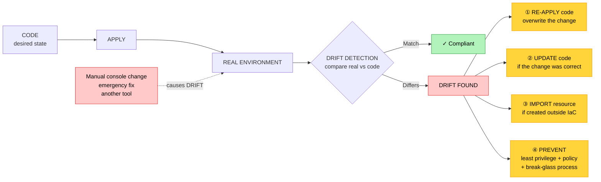

# Objective 2.4 — Given a scenario, use code to deploy and configure cloud resources

> **Domain 2.0 — Deployment (19% of exam)** · Exam CV0-004 V4 · Objectives doc v5.0
> **Status:** Exam-ready · **Version:** 2.0 (enhanced) · Supersedes `full notes/Objective-2.4-Code-Deploy-Configure.md`

---

## 0. How to use this note

| Pass | What to read | Time |
|---|---|---|
| **1st (learn)** | Sections 1 → 8 in order | ~70 min |
| **2nd (drill)** | Section 6 (JSON vs YAML, including the gotchas) + Section 5 (scripting logic) | ~25 min |
| **3rd (test)** | Section 11 (practice) + Section 12 (PBQ drills) | ~30 min |
| **Exam eve** | Section 13 (60-second recall sheet) only | ~5 min |

> 📌 **This is the only objective with real syntax on it.** "Given a scenario, **use code**" plus explicitly named formats (JSON, YAML) and scripting constructs means you may be shown a snippet and asked what it does or why it fails. Section 6.4 (YAML gotchas) and Section 5 (predict-the-result logic) are the highest-yield parts.

---

## 1. Official objective coverage

> **2.4 Given a scenario, use code to deploy and configure cloud resources.**
> - Infrastructure as code (IaC)
> - Configuration as code (CaC)
> - **Scripting logic**
>   - Variables · Conditionals · Operators · Data types · Functions
> - Repeatability
> - Drift detection
> - Versioning
> - Testing
> - Documentation
> - **Formats**
>   - JavaScript Object Notation (JSON)
>   - Yet Another Markup Language (YAML)

### 1.1 What the verb tells you

**"Given a scenario, use code"** — an **application** objective with a hands-on flavour. Expect:

- A **snippet** and "what does this produce?" or "why does this fail?"
- A requirement and "which construct implements it?" (conditional vs variable vs function)
- A symptom and "what practice would have prevented it?" (drift, versioning, testing)

### 1.2 Coverage checklist

- [ ] I can state the difference between **IaC** and **CaC**
- [ ] I can distinguish **declarative** from **imperative**
- [ ] I know what **idempotency** means and why it matters
- [ ] I can read and write basic **YAML** and **JSON** and convert between them
- [ ] I know **YAML forbids tabs** and why unquoted values are dangerous
- [ ] I know **JSON has no comments and no trailing commas**
- [ ] I can identify the five **data types** and spot a type mismatch
- [ ] I can evaluate **operators** including logical precedence
- [ ] I know what a **conditional** and a **function** each do in a template
- [ ] I can define **drift**, name its causes, and give three remediation options
- [ ] I know the IaC **testing** stages in order
- [ ] I know what **state** is and why it must be protected
- [ ] I know why **secrets must never be hard-coded** in templates

---

## 2. The core mental model

### 2.1 Why code instead of clicks

```text
   MANUAL CONSOLE ("ClickOps")          INFRASTRUCTURE AS CODE
   ┌──────────────────────────┐         ┌──────────────────────────┐
   │ Click through a portal    │         │ Write a template file     │
   │ Nobody knows what changed │         │ Every change is a commit  │
   │ Dev ≠ test ≠ prod         │         │ Same code → same result   │
   │ "How did we build this?"  │         │ The code IS the answer    │
   │ No review, no rollback    │         │ Peer review + git history │
   │ Rebuilding takes days     │         │ Rebuilding takes minutes  │
   │ Audit = screenshots       │         │ Audit = the repository    │
   └──────────────────────────┘         └──────────────────────────┘
        ▲ SNOWFLAKE servers                  ▲ REPEATABLE, reviewable,
          nobody dares touch                   recoverable, auditable
```

### 2.2 ★ IaC vs CaC — where the boundary sits

```text
   ┌─────────────────────────────────────────────────────────────┐
   │  CONFIGURATION AS CODE (CaC)                                │
   │  ─────────────────────────                                  │
   │  WHAT GOES ON/INSIDE the resource:                          │
   │    · install and configure packages                          │
   │    · OS hardening, users, services                           │
   │    · application config files                                │
   │    · keeps the fleet CONVERGED to a desired state            │
   │  Tools: Ansible, Chef, Puppet, SaltStack                     │
   ├═════════════════════════════════════════════════════════════┤
   │  INFRASTRUCTURE AS CODE (IaC)                               │
   │  ────────────────────────                                   │
   │  WHAT RESOURCES EXIST:                                       │
   │    · VMs, networks, subnets, route tables                    │
   │    · load balancers, storage, databases                      │
   │    · IAM roles and policies                                  │
   │  Tools: Terraform, CloudFormation, ARM/Bicep, Pulumi         │
   └─────────────────────────────────────────────────────────────┘

   ★ IaC BUILDS the thing. CaC CONFIGURES what's inside it.
     IaC creates the VM · CaC installs and tunes the web server on it.
```

> 💡 **The boundary blurs in practice.** Immutable infrastructure (see 1.7) sidesteps CaC entirely: instead of configuring a running server, you bake a new image and replace the instance — so IaC does everything. Containers take the same approach: the image *is* the configuration.

### 2.3 Declarative vs imperative

```text
   DECLARATIVE — "WHAT I want"          IMPERATIVE — "HOW to do it"
   ┌──────────────────────────┐         ┌──────────────────────────┐
   │ desired_state:            │         │ create_vm()               │
   │   web_servers: 3          │         │ create_vm()               │
   │                           │         │ create_vm()               │
   │ The TOOL works out the    │         │ YOU specify every step,   │
   │ steps: are there 2?       │         │ in order.                 │
   │ → create 1. Are there 4?  │         │ Run it twice → 6 VMs.     │
   │ → destroy 1. Already 3?   │         │                           │
   │ → do NOTHING.             │         │                           │
   └──────────────────────────┘         └──────────────────────────┘
   ✓ IDEMPOTENT by design                ✗ Not idempotent by default
   ✓ Self-healing toward desired state    ✓ Full control of sequence
   Terraform, CloudFormation, ARM,        Shell scripts, CLI commands,
   Kubernetes manifests                   ordered procedural scripts
```

**Idempotency** — running the same operation repeatedly produces the same end state as running it once. It is what makes IaC safe to re-apply, and it is the property to name when a question asks why declarative tooling is preferred.

---

## 3. Infrastructure as code (IaC)

| | |
|---|---|
| **Definition** | Defining and provisioning infrastructure — compute, network, storage, identity — through **machine-readable definition files** kept in version control, rather than manual configuration. |
| **Benefits** | **Repeatability** — identical environments every time · **speed** — stand up a full stack in minutes · **version control** — every change reviewed and reversible · **auditability** — the repo is the record · **disaster recovery** — rebuild from code · **cost control** — destroy non-production environments and recreate on demand · **self-documenting** |
| **Costs** | Learning curve; the **state** must be managed and protected; a bad template can destroy production at scale; tooling and provider version drift |
| **Tools** | **Terraform** (multi-cloud, declarative) · **CloudFormation** (AWS) · **ARM / Bicep** (Azure) · **Deployment Manager** (GCP) · **Pulumi** (general-purpose languages) · **Kubernetes manifests / Helm** (see 1.6) |
| **Exam triggers** | "provision infrastructure from a template", "identical dev/test/prod environments", "rebuild the environment from code", "no manual console changes", "version-controlled infrastructure" |

### 3.1 State — the concept that trips people up

Most IaC tools keep a **state** record mapping what is in your code to the real resources that exist.

| Aspect | Why it matters |
|---|---|
| **Purpose** | Lets the tool compute the *difference* between desired and actual, so it changes only what is needed |
| **Remote storage** | Teams must share one state, stored centrally — not on a laptop |
| **Locking** | Prevents two people applying at once and corrupting it |
| **★ Sensitive content** | State can contain **plaintext secrets and resource details** — it must be encrypted and access-controlled |
| **Import** | An existing manually created resource can be **imported** into state so IaC manages it going forward |

---

## 4. Configuration as code (CaC)

| | |
|---|---|
| **Definition** | Defining the **configuration applied to systems** — packages, services, users, files, OS settings, application config — in version-controlled code, applied automatically and repeatedly. |
| **Key property** | **Idempotent convergence** — running the playbook/recipe repeatedly drives systems to the declared state and makes no change if they already match |
| **Benefits** | Consistent configuration across a fleet; eliminates configuration drift on existing servers; documents the build; fast rebuild; auditable change history |
| **Tools** | **Ansible** (agentless, push, YAML) · **Chef** (agent, Ruby) · **Puppet** (agent, declarative) · **SaltStack** |
| **Push vs pull** | **Push** — a control node connects out and applies config (Ansible). **Pull** — agents periodically fetch and apply the desired state (Puppet, Chef) |
| **Exam triggers** | "ensure all servers have the same configuration", "install and configure software automatically", "enforce a hardened baseline", "playbook", "converge to a desired state" |

---

## 5. Scripting logic

The five named constructs, with examples you should be able to read.

### 5.1 Variables

Named placeholders that let one template serve many contexts.

```yaml
# YAML — variable definitions
environment: production
region: ap-southeast-1
instance_count: 3
enable_backups: true
allowed_ports: [80, 443]
```

```hcl
# Used with interpolation
name = "web-${environment}-${region}"     # → "web-production-ap-southeast-1"
```

| Concept | Note |
|---|---|
| **Sources** | Defaults in the file · runtime parameters · **environment variables** · lookups from existing resources · secret stores |
| **Scope** | Global vs local/module-scoped — a variable defined inside a module is not visible outside it |
| **Interpolation** | Embedding a variable inside a string: `"web-${env}-sg"` |
| **★ Never hard-code** | Region, account IDs, sizes, and **especially secrets** belong in variables — secrets belong in a **secret store**, not the file |

### 5.2 Conditionals

Branch on a value so one template covers several cases.

```yaml
# Ansible style
- name: Install monitoring agent
  package: name=monitoring-agent state=present
  when: environment == "production"
```

```hcl
# Ternary — one template, different sizes per environment
instance_type  = var.environment == "prod" ? "large" : "small"
instance_count = var.environment == "prod" ? 3 : 1
```

**Why they matter:** one parameterised template replaces several near-duplicate copies, which is what keeps environments genuinely identical apart from intended differences.

### 5.3 Operators

| Category | Operators | Example | Result |
|---|---|---|---|
| **Arithmetic** | `+ - * / %` | `7 % 3` | `1` (remainder) |
| **Comparison** | `== != > < >= <=` | `count >= 3` | `true` / `false` |
| **Logical** | `&&` (AND), `\|\|` (OR), `!` (NOT) | `is_prod && has_backup` | `true` only if **both** |
| **Assignment** | `=` | `region = "eu-west-1"` | assigns |

**Precedence — highest to lowest:** `!` (NOT) → arithmetic → comparison → `&&` (AND) → `||` (OR). Use parentheses when in doubt.

```text
   PREDICT THE RESULT

   env = "prod" · count = 4 · backups = false

   ① count > 2 && env == "prod"        → true  && true   → TRUE
   ② count > 5 || env == "prod"        → false || true   → TRUE
   ③ !backups                          → !false          → TRUE
   ④ backups && count > 2              → false && true   → FALSE
   ⑤ count % 2 == 0                    → 4 % 2 = 0 → 0 == 0 → TRUE

   ⚠ = assigns · == compares. Confusing them is the classic error.
```

### 5.4 Data types

| Type | JSON | YAML | Note |
|---|---|---|---|
| **String** | `"web-server"` | `web-server` or `"web-server"` | Quote anything ambiguous |
| **Number** | `3`, `2.5` | `3`, `2.5` | **Unquoted** |
| **Boolean** | `true` / `false` | `true` / `false` (also `yes`/`no` in YAML 1.1) | Lowercase in JSON |
| **List / array** | `["a", "b"]` | `- a`<br>`- b` | Ordered collection |
| **Map / object / dictionary** | `{"key": "value"}` | `key: value` | Key–value pairs |
| **Null** | `null` | `null`, `~`, or empty | Absence of a value |

> ⚠️ **Type mismatch is a top failure cause.** `"3"` (string) does not satisfy a parameter expecting `3` (number). A parameter expecting a list will reject a single string. Read the error message — it usually names the expected type.

### 5.5 Functions

Functions compute a value rather than hard-coding it.

| Category | Examples | Purpose |
|---|---|---|
| **String** | `join`, `split`, `upper`, `replace`, `format` | Build names and identifiers |
| **Numeric** | `min`, `max`, `ceil`, `floor`, `abs` | Calculate sizes and counts |
| **Collection** | `length`, `lookup`, `element`, `contains`, `merge` | Work with lists and maps |
| **Reference/intrinsic** | `!Ref`, `!GetAtt`, `!Sub` (CloudFormation) | Retrieve a resource's ID or attribute |
| **Encoding/lookup** | `base64`, `file`, `jsonencode` | Transform data |

```yaml
# CloudFormation intrinsics
BucketName: !Sub "logs-${Environment}-${AWS::Region}"   # string substitution
SecurityGroup: !Ref WebSecurityGroup                    # get the resource's ID
Endpoint: !GetAtt Database.Endpoint.Address             # get an attribute
```

```hcl
# Common function usage
subnet_count = length(var.availability_zones)   # list length → number
instance_type = lookup(var.sizes, var.env, "small")  # map lookup with default
```

> 💡 **A function always *returns a value*** used somewhere else. `!Ref` returns a resource identifier; `!GetAtt` returns one of its attributes; `length()` returns a number.

---

## 6. Formats — JSON and YAML

### 6.1 The same structure in both

```json
{
  "environment": "production",
  "region": "ap-southeast-1",
  "instance_count": 3,
  "enable_backups": true,
  "tags": {
    "Owner": "platform-team",
    "CostCenter": "CC-1042"
  },
  "allowed_ports": [80, 443, 8443],
  "database": {
    "engine": "postgres",
    "version": "15.4",
    "multi_az": true
  }
}
```

```yaml
# The identical structure in YAML — note the comments, which JSON cannot have
environment: production
region: ap-southeast-1
instance_count: 3
enable_backups: true

tags:
  Owner: platform-team
  CostCenter: CC-1042

allowed_ports:
  - 80
  - 443
  - 8443

database:
  engine: postgres
  version: "15.4"        # ← QUOTED: unquoted 15.4 is a number, and
  multi_az: true         #   a version like 1.10 would become 1.1
```

### 6.2 JSON

| Property | Rule |
|---|---|
| Structure | `{}` objects, `[]` arrays |
| Keys | **Must be double-quoted strings** |
| Strings | **Double quotes only** — single quotes are invalid |
| **Comments** | ❌ **Not supported at all** |
| Trailing commas | ❌ **Invalid** |
| Whitespace | Irrelevant to meaning |
| Strengths | Unambiguous, universal, ideal for **APIs and machine exchange** |
| Weaknesses | Verbose; **no comments**; painful to hand-edit and review |

### 6.3 YAML

| Property | Rule |
|---|---|
| Structure | **Indentation** (nesting) and `-` (list items) |
| Keys | Unquoted by default |
| Comments | ✅ `#` — a major advantage for reviewable templates |
| **Tabs** | ❌ **FORBIDDEN — spaces only** |
| Multi-line strings | `\|` preserves newlines · `>` folds into one line |
| Reuse | Anchors `&name` and aliases `*name` |
| Documents | `---` separates multiple documents in one file |
| Strengths | Human-readable, comment-friendly, concise — the default for **Kubernetes, Ansible, CI/CD pipelines** |
| Weaknesses | **Indentation-sensitive**; implicit typing causes surprises |

> 💡 **YAML is a superset of JSON** — valid JSON is generally valid YAML. That is why many tools accept either.

### 6.4 ★ YAML gotchas — the highest-yield syntax content

```text
   ① TABS ARE ILLEGAL — SPACES ONLY
      services:
      →   web:            ← a TAB here fails to parse
      ★ The single most common YAML error.

   ② INDENTATION DEFINES STRUCTURE — be consistent (2 spaces is usual)
      parent:
        child: value          ✓ child belongs to parent
      parent:
      child: value            ✗ child is now a SIBLING — different meaning

   ③ IMPLICIT BOOLEANS — the "Norway problem"
      country: NO             → parsed as BOOLEAN false, not "NO"!
      enabled: yes            → boolean true
      ★ FIX: quote it →  country: "NO"

   ④ NUMBERS LOSE FORMATTING
      version: 1.10           → number 1.1  (trailing zero gone)
      port: 022               → may be read as octal
      ★ FIX: quote version strings →  version: "1.10"

   ⑤ COLONS AND SPECIAL CHARACTERS IN VALUES
      title: Report: Q4       ✗ the second colon breaks parsing
      title: "Report: Q4"     ✓

   ⑥ MULTI-LINE STRINGS
      script: |               keeps line breaks
        line one
        line two
      note: >                 folds into a single line
        this becomes
        one long line
```

---

## 7. The supporting practices

### 7.1 Repeatability

| | |
|---|---|
| **Definition** | The same code produces the **same environment every time**, with no manual steps. |
| **Depends on** | Parameterising all differences into **variables** · **no hard-coded** IDs, regions, or secrets · **idempotent** tooling · **pinned versions** of modules and providers |
| **Delivers** | Identical dev/test/prod · disposable environments · reliable disaster recovery · the end of **snowflake servers** |
| **Exam triggers** | "environments keep drifting apart", "we can't reproduce the environment", "identical staging and production" |

### 7.2 ★ Drift detection

| | |
|---|---|
| **Definition** | Detecting when the **live environment no longer matches** what the code declares. |
| **Causes** | Manual console changes ("ClickOps") · emergency fixes made under pressure and never codified · another tool or team modifying the same resources · provider-side changes or defaults |
| **Why it matters** | Drift silently breaks repeatability, invalidates disaster recovery, creates **undocumented security exposure**, and makes the next `apply` produce surprising results |
| **How to detect** | Tool-native comparison of state vs reality (`terraform plan`, CloudFormation **drift detection**), scheduled automated checks, and cloud config/compliance services |
| **Exam triggers** | "someone changed it in the console", "the environment no longer matches the template", "unexplained configuration differences" |



> ⚠️ **The remediation choice matters.** Blindly re-applying the code **reverts an emergency fix** and can cause a second outage. Decide first whether the drift was *wrong* (re-apply) or *right but uncodified* (update the code).

### 7.3 Versioning

| Practice | Purpose |
|---|---|
| **Version control (git)** | Every change is a reviewable, revertible commit with an author and a reason |
| **Branching + pull requests** | Peer review before infrastructure changes reach production (see 5.1) |
| **Tags / releases** | Mark known-good versions of a template |
| **Semantic versioning** | `MAJOR.MINOR.PATCH` — major signals a breaking change |
| **★ Pin module and provider versions** | An unpinned dependency can change under you and break a previously working deployment |
| **Changelog** | Record what changed and why |

### 7.4 Testing

```text
   THE IaC TESTING PIPELINE — cheapest and fastest first

   ① FORMAT / LINT          style and obvious errors
      ↓                     yamllint, terraform fmt, cfn-lint
   ② VALIDATE               syntax and schema correctness
      ↓                     terraform validate
   ③ PLAN / DRY RUN         ★ PREVIEW exactly what will change
      ↓                     terraform plan, CloudFormation change set
                            ★ THE MOST IMPORTANT SAFETY STEP —
                              shows what will be CREATED, CHANGED,
                              and especially DESTROYED
   ④ POLICY AS CODE         automated guardrails
      ↓                     "no public storage buckets", "encryption
                            required", "approved regions only"
                            Checkov, tfsec, OPA, Sentinel
   ⑤ DEPLOY TO SANDBOX      integration test in a throwaway environment
      ↓
   ⑥ APPLY TO PRODUCTION    with review and approval
      ↓
   ⑦ DRIFT DETECTION        scheduled, ongoing
```

> ★ **If one testing step is examined, it is the plan/dry run.** Never apply infrastructure code without previewing the change set — the difference between "3 to add" and "3 to add, 1 to destroy" is a production database.

### 7.5 Documentation

| What to document | Why |
|---|---|
| **README** — purpose, prerequisites, how to run | Onboarding and handover |
| **Inputs/variables reference** | What must be supplied, with types and defaults |
| **Outputs** | What the template produces for other stacks to consume |
| **Inline comments** — the **why**, not the what | "Why this size / this region / this exception" |
| **Runbooks** — deploy, rollback, teardown | Incident response and disaster recovery |
| **Architecture diagram** | Fast comprehension |

> 💡 **Comment the *why*.** The code already states *what* it does. What it cannot state is why a value was chosen — that context is what makes the next change safe.

### 7.6 Security in IaC — commonly tested

| Practice | Why |
|---|---|
| **★ Never hard-code secrets** | Credentials in a template are committed to git **forever**, visible to everyone with repo access. Use a secret store or injected variables |
| **Protect state files** | State can hold plaintext secrets — encrypt at rest and restrict access |
| **Least privilege for the pipeline** | The deployment identity should be able to do only what it must |
| **Policy as code** | Enforce guardrails automatically rather than by review alone |
| **Scan templates** | Detect insecure defaults (public buckets, open security groups) before deployment (see 4.1) |

---

## 8. Comparison tables

### 8.1 ★ JSON vs YAML

| Feature | **JSON** | **YAML** |
|---|---|---|
| Structure defined by | **Braces and brackets** | **Indentation** |
| **Comments** | ❌ **Not supported** | ✅ `#` |
| **Tabs allowed** | Yes (whitespace ignored) | ❌ **NO — spaces only** |
| Quotes | **Double only** | Single, double, or none |
| Trailing commas | ❌ Invalid | N/A |
| Whitespace-sensitive | ❌ No | ✅ **Yes** |
| Verbosity | Higher | Lower |
| Human readability | Lower | **Higher** |
| Machine/API friendliness | **Higher** | High |
| Implicit typing surprises | Rare | **Common** (`NO` → false, `1.10` → 1.1) |
| Typical use | APIs, data exchange, IAM policies | **Kubernetes, Ansible, CI/CD pipelines, templates** |
| Relationship | — | **YAML is a superset of JSON** |

### 8.2 IaC vs CaC

| | **Infrastructure as code** | **Configuration as code** |
|---|---|---|
| Manages | **Resources that exist** — VMs, networks, storage, IAM | **Settings inside/on** systems — packages, services, files |
| Question answered | "What should exist?" | "How should it be configured?" |
| Typical tools | Terraform, CloudFormation, ARM/Bicep, Pulumi | Ansible, Chef, Puppet, SaltStack |
| Runs | At provisioning time | At provisioning **and continuously** to converge |
| Output | Provisioned infrastructure | Consistently configured systems |
| Replaced by | — | **Immutable infrastructure / container images** |

### 8.3 Declarative vs imperative

| | **Declarative** | **Imperative** |
|---|---|---|
| You specify | **The desired end state** | **The steps to take** |
| The tool | Works out the actions | Executes your instructions |
| **Idempotent** | ✅ **Yes, inherently** | ❌ Not by default |
| Run twice | Same result | May duplicate resources |
| Handles existing resources | Reconciles to match | May fail or duplicate |
| Examples | Terraform, CloudFormation, Kubernetes manifests | Shell scripts, CLI sequences |

### 8.4 Practice → problem it solves

| Practice | Problem solved |
|---|---|
| **IaC** | Manual, unrepeatable, unauditable provisioning |
| **CaC** | Inconsistent configuration across a fleet |
| **Repeatability** | "It works in dev but not in prod"; snowflake servers |
| **Drift detection** | Console changes silently diverging from code |
| **Versioning** | "Who changed this, when, and why?"; no rollback |
| **Testing** | Destroying production with an unreviewed change |
| **Documentation** | Nobody knows how to run or rebuild it |
| **Variables** | Hard-coded values preventing reuse |
| **Conditionals** | Maintaining near-duplicate templates per environment |
| **Functions** | Hard-coded derived values that go stale |

---

## 9. Exam traps & distractor patterns

| # | Trap | The truth |
|---|---|---|
| 1 | "YAML allows tabs for indentation" | ⚠️ **Tabs are forbidden — spaces only.** The most common YAML parse failure |
| 2 | "JSON supports comments" | ❌ **It does not.** Only YAML has `#` comments |
| 3 | "IaC and CaC are the same" | IaC **builds** resources; CaC **configures** what's inside them |
| 4 | "Imperative scripts are idempotent" | Only **declarative** tooling is idempotent by design — running an imperative script twice can create duplicates |
| 5 | "`country: NO` is the string NO" | YAML parses it as **boolean false**. Quote ambiguous values |
| 6 | "`version: 1.10` keeps the trailing zero" | It becomes the **number 1.1**. Quote version strings |
| 7 | "`\"3\"` and `3` are interchangeable" | **String vs number** — a strict schema rejects the mismatch |
| 8 | "`=` and `==` are the same" | `=` **assigns**, `==` **compares** |
| 9 | "Drift is fixed by re-applying the code" | Sometimes — but that **reverts an emergency fix**. Decide whether the drift was wrong (re-apply) or right (codify it) |
| 10 | "State files are just metadata" | They can contain **plaintext secrets** — encrypt and restrict them |
| 11 | "Secrets in a private repo are safe" | They are in **git history forever** and visible to everyone with access. Use a secret store |
| 12 | "Testing means running it and seeing" | The **plan/dry run** previews changes — including **destructions** — before anything happens |
| 13 | "Version control is only for application code" | Infrastructure code needs branching, review, tagging, and **pinned dependency versions** |
| 14 | "Documentation should describe what the code does" | The code shows *what*. Document the **why** |
| 15 | "One template per environment is good practice" | Use **one parameterised template with variables and conditionals** — duplicates diverge |
| 16 | "YAML and JSON are incompatible" | **YAML is a superset of JSON** — valid JSON is generally valid YAML |

**Disambiguation drill:**

| Pair | The deciding question |
|---|---|
| **IaC vs CaC** | Creating a **resource** or configuring **inside** one? |
| **Declarative vs imperative** | Did you state the **end state** or the **steps**? |
| **JSON vs YAML** | Do you need **comments and readability** (YAML) or **strict machine exchange** (JSON)? |
| **Variable vs function** | Supplying a value in, or **computing** one? |
| **Conditional vs variable** | **Branching** on a value, or just parameterising it? |
| **Drift detection vs testing** | Detecting divergence **after** deployment vs validating **before** |
| **Repeatability vs versioning** | Same result every run vs a **history** of changes |

---

## 10. Keyword → answer trigger table

| If you see… | Think |
|---|---|
| provision VMs/networks/storage from a template · rebuild the environment from code | **IaC** |
| install and configure software on servers · enforce a baseline · playbook · converge | **CaC** |
| state the end result and let the tool figure it out · running twice changes nothing | **Declarative / idempotent** |
| step-by-step commands · run twice and you get duplicates | **Imperative** |
| indentation-based, comments allowed, used by Kubernetes and Ansible | **YAML** |
| braces and brackets, no comments, strict quoting, used by APIs | **JSON** |
| template fails to parse and there's a tab character | **YAML — tabs forbidden** |
| `country: NO` became `false` · `1.10` became `1.1` | **YAML implicit typing — quote it** |
| avoid hard-coding the region so one template serves all environments | **Variables** |
| deploy 3 instances in prod but 1 in dev | **Conditional** |
| combine two booleans, compare counts | **Operators** |
| a string was supplied where a number was expected | **Data type mismatch** |
| compute a name or count instead of hard-coding it · `!Ref`, `!GetAtt`, `length()` | **Functions** |
| same code gives the same environment every time | **Repeatability** |
| someone changed it in the console and it no longer matches the template | **Drift detection** |
| who changed this and can we roll it back? | **Versioning** |
| preview what will be created, changed, and destroyed | **Plan / dry run / change set** |
| block public buckets automatically before deployment | **Policy as code** |
| credentials were committed to the repository | **Secrets management failure** |

---

## 11. Practice questions

<details>
<summary><b>Q1.</b> A YAML template fails to parse with an indentation error. The developer used the Tab key to indent nested keys. What is the problem?</summary>

A. YAML requires exactly four spaces · **B. YAML forbids tab characters for indentation — only spaces are allowed** · C. The file needs a `---` header · D. Nested keys must be quoted

**Correct: B.** Tabs are illegal in YAML and are the single most common cause of parse failures.
- **A wrong:** Any consistent number of spaces works; two is conventional.
- **C wrong:** `---` separates documents and is optional for a single document.
- **D wrong:** Keys do not need quoting unless ambiguous.
</details>

<details>
<summary><b>Q2.</b> Which format supports inline comments?</summary>

A. JSON · **B. YAML** · C. Both · D. Neither

**Correct: B — YAML**, using `#`. JSON has no comment syntax at all, which is a common reason teams prefer YAML for templates that need explanation.
- **A/C/D wrong:** JSON's lack of comments is a defining limitation.
</details>

<details>
<summary><b>Q3.</b> What is the PRIMARY difference between infrastructure as code and configuration as code?</summary>

A. IaC uses YAML; CaC uses JSON · **B. IaC provisions the resources that exist; CaC configures the software and settings on or inside them** · C. IaC is manual; CaC is automated · D. They are identical

**Correct: B.** IaC builds the VM; CaC installs and tunes the web server on it.
- **A wrong:** Both formats are used by both.
- **C wrong:** Both are automated.
- **D wrong:** CompTIA lists them separately.
</details>

<details>
<summary><b>Q4.</b> A YAML file contains <code>country: NO</code>. When loaded, the value is <code>false</code>. Why?</summary>

A. The file is corrupt · **B. YAML implicit typing interprets unquoted NO as a boolean; quoting it as "NO" preserves the string** · C. NO is a reserved key name · D. The parser requires uppercase strings to be escaped

**Correct: B.** The "Norway problem" — YAML treats `yes/no/on/off/true/false` as booleans unless quoted.
- **A/C/D wrong:** The file is valid; the typing is simply implicit.
</details>

<details>
<summary><b>Q5.</b> Given <code>env = "prod"</code>, <code>count = 4</code>, <code>backups = false</code>, what does <code>count > 2 && backups</code> evaluate to?</summary>

A. true · **B. false** · C. An error · D. "prod"

**Correct: B — false.** `count > 2` is true, but `backups` is false, and logical AND requires **both** operands to be true.
- **A wrong:** AND is not satisfied by one true operand.
- **C/D wrong:** The expression is valid and returns a boolean.
</details>

<details>
<summary><b>Q6.</b> An engineer applies an infrastructure template twice in a row using a declarative tool. What happens on the second run?</summary>

A. Resources are duplicated · **B. Nothing changes, because declarative tooling is idempotent and the actual state already matches the desired state** · C. The deployment fails · D. All resources are destroyed and recreated

**Correct: B.** Idempotency is the defining safety property of declarative IaC.
- **A wrong:** That is imperative behaviour.
- **C/D wrong:** Neither occurs when state already matches.
</details>

<details>
<summary><b>Q7.</b> After an outage, an engineer fixes a security group directly in the console. A week later the pipeline re-applies the template and the outage recurs. What happened, and what should have been done?</summary>

**A. Configuration drift — the manual fix was not codified, so re-applying reverted it; the change should have been made in code** · B. The state file was corrupt · C. YAML parsing failed · D. The provider version changed

**Correct: A.** Drift remediation requires deciding whether the change was wrong (re-apply) or right but uncodified (update the code). Here it was right and should have been committed.
- **B/C/D wrong:** None explain a reverted manual change.
</details>

<details>
<summary><b>Q8.</b> Which testing step previews exactly which resources will be created, modified, and DESTROYED before anything happens?</summary>

A. Linting · B. Syntax validation · **C. Plan / dry run / change set** · D. Documentation review

**Correct: C.** The plan is the critical safety gate — the difference between "3 to add" and "3 to add, 1 to destroy" can be a production database.
- **A/B wrong:** Both catch style and syntax errors but predict nothing about impact.
- **D wrong:** Documentation is not an execution preview.
</details>

<details>
<summary><b>Q9.</b> A template hard-codes <code>region = "us-east-1"</code> and must now also deploy to Europe. What is the correct fix?</summary>

**A. Replace the hard-coded value with a variable supplied at deployment time** · B. Copy the template and edit the copy · C. Add a comment noting the region · D. Convert the file to JSON

**Correct: A.** Parameterising differences is what makes one template serve many environments, and it is the foundation of repeatability.
- **B wrong:** Duplicate templates diverge over time — the problem IaC exists to prevent.
- **C/D wrong:** Neither changes behaviour.
</details>

<details>
<summary><b>Q10.</b> Which construct deploys three instances in production but one in development from a single template?</summary>

A. A function · **B. A conditional** · C. A comment · D. A data type

**Correct: B — a conditional.** Branching on the environment value lets one template cover both cases.
- **A wrong:** Functions compute values but do not branch on their own.
- **C/D wrong:** Neither controls flow.
</details>

<details>
<summary><b>Q11.</b> A deployment fails with "expected number, received string" for the parameter <code>instance_count: "3"</code>. What is wrong?</summary>

**A. A data type mismatch — the quoted value is a string, but a number is required** · B. The parameter name is misspelled · C. YAML does not support numbers · D. Comments are not allowed

**Correct: A.** Quoting turns `3` into `"3"`; strict schemas reject the type mismatch.
- **B wrong:** The error names the type, not the key.
- **C/D wrong:** YAML supports numbers, and comments are unrelated.
</details>

<details>
<summary><b>Q12.</b> Which practice ensures the same code produces the same environment every time, with no manual steps?</summary>

A. Drift detection · **B. Repeatability** · C. Documentation · D. Versioning

**Correct: B — repeatability.** It depends on parameterised variables, no hard-coded values, idempotent tooling, and pinned versions.
- **A wrong:** Drift detection finds divergence after the fact.
- **C/D wrong:** Both are valuable but describe different practices.
</details>

<details>
<summary><b>Q13.</b> Why must infrastructure state files be encrypted and access-controlled?</summary>

A. They are very large · **B. They can contain sensitive values, including plaintext secrets and detailed resource information** · C. They are written in YAML · D. They expire after 30 days

**Correct: B.** State is not merely metadata — it is a security-sensitive artefact.
- **A/C/D wrong:** None are true or relevant.
</details>

<details>
<summary><b>Q14.</b> A developer commits a database password directly into a Terraform file in a private repository. What is the MAIN risk?</summary>

A. YAML parsing errors · **B. The secret is permanently in git history and visible to everyone with repository access; it must be moved to a secret store and rotated** · C. Increased file size · D. Slower deployments

**Correct: B.** Private does not mean secret, and deleting the line later does not remove it from history — the credential must be rotated.
- **A/C/D wrong:** None describe the security exposure.
</details>

<details>
<summary><b>Q15.</b> Which pair of tools is CORRECTLY matched to its category?</summary>

A. Ansible = IaC; Terraform = CaC · **B. Terraform = IaC; Ansible = CaC** · C. Both are CaC · D. Both are imperative

**Correct: B.** Terraform provisions resources; Ansible configures systems — though the boundary blurs in practice.
- **A wrong:** The pairing is reversed.
- **C wrong:** Terraform is an IaC tool.
- **D wrong:** Both are primarily declarative in use.
</details>

<details>
<summary><b>Q16.</b> Which statement about JSON is CORRECT?</summary>

A. It supports `#` comments · B. Single quotes are valid for strings · **C. Keys must be double-quoted and trailing commas are invalid** · D. Indentation determines structure

**Correct: C.** JSON is strict about quoting and punctuation.
- **A wrong:** JSON has no comment syntax.
- **B wrong:** Only double quotes are valid.
- **D wrong:** That is YAML; JSON ignores whitespace.
</details>

<details>
<summary><b>Q17.</b> An automated check runs nightly comparing deployed resources against the templates and reports differences. What is this called?</summary>

A. Linting · B. Versioning · **C. Drift detection** · D. Unit testing

**Correct: C.** Drift detection identifies divergence between declared and actual state, most often caused by manual console changes.
- **A/D wrong:** Both operate on code before deployment.
- **B wrong:** Versioning tracks changes to the code itself.
</details>

<details>
<summary><b>Q18.</b> Which YAML feature preserves line breaks in a multi-line string?</summary>

A. `>` · **B. `\|`** · C. `&` · D. `---`

**Correct: B — the pipe (`|`) block scalar**, which keeps newlines. The fold (`>`) collapses them into a single line.
- **C wrong:** `&` defines an anchor for reuse.
- **D wrong:** `---` separates documents.
</details>

<details>
<summary><b>Q19.</b> A team wants to automatically block any template that would create a publicly accessible storage bucket, before deployment. What should they implement?</summary>

A. Drift detection · B. Documentation review · **C. Policy as code in the pipeline** · D. Versioning

**Correct: C.** Policy-as-code tools evaluate templates against guardrails and fail the build automatically, rather than relying on human review.
- **A wrong:** Drift detection runs after deployment.
- **B wrong:** Manual review is inconsistent at scale.
- **D wrong:** Versioning records changes but enforces nothing.
</details>

<details>
<summary><b>Q20.</b> What does an intrinsic function such as <code>!GetAtt Database.Endpoint.Address</code> do?</summary>

A. Creates a database · **B. Returns an attribute of an existing resource so it can be used elsewhere in the template** · C. Adds a comment · D. Declares a variable

**Correct: B.** Functions return values — `!Ref` returns a resource identifier, `!GetAtt` returns a specific attribute, `!Sub` performs string substitution.
- **A wrong:** Resource creation is declared separately.
- **C/D wrong:** Neither is a function's role.
</details>

<details>
<summary><b>Q21.</b> Why should module and provider versions be pinned in infrastructure code?</summary>

A. To reduce file size · **B. So an upstream change cannot silently alter behaviour and break a previously working deployment** · C. Because YAML requires it · D. To enable comments

**Correct: B.** Unpinned dependencies undermine repeatability — the same code can produce different results on different days.
- **A/C/D wrong:** None relate to dependency stability.
</details>

<details>
<summary><b>Q22.</b> Which is the BEST use of comments in infrastructure code?</summary>

A. Restating what each line does · **B. Explaining WHY a decision was made — why this size, this region, this exception** · C. Storing credentials · D. Listing every past change

**Correct: B.** The code already states *what*; context about *why* is what makes the next change safe.
- **A wrong:** Redundant comments add noise and go stale.
- **C wrong:** Never put credentials in code.
- **D wrong:** Version control history serves that purpose.
</details>

<details>
<summary><b>Q23.</b> Which describes imperative infrastructure automation?</summary>

A. Declaring the desired end state and letting the tool reconcile · **B. Specifying the exact sequence of steps to execute, which may create duplicates if run twice** · C. Automatically idempotent · D. Only possible with YAML

**Correct: B.** Imperative approaches specify *how*; without added logic they are not idempotent.
- **A/C wrong:** Both describe declarative tooling.
- **D wrong:** Format is unrelated.
</details>

<details>
<summary><b>Q24.</b> A resource was created manually in the console and now needs to be managed by IaC going forward. What is the appropriate action?</summary>

A. Delete and recreate it through code · **B. Import the existing resource into the tool's state so it becomes managed** · C. Ignore it · D. Convert the template to JSON

**Correct: B.** Import brings an unmanaged resource under IaC control without destroying it — one of the standard drift remediation options.
- **A wrong:** Possible but unnecessarily disruptive for a live resource.
- **C wrong:** Unmanaged resources are exactly what causes drift.
- **D wrong:** Format is irrelevant.
</details>

<details>
<summary><b>Q25.</b> Which practice MOST directly addresses the question "who changed this infrastructure, when, and why — and can we revert it?"</summary>

A. Repeatability · B. Drift detection · **C. Versioning in source control** · D. Data types

**Correct: C.** Version control provides authorship, timestamps, review history, and the ability to revert.
- **A wrong:** Repeatability concerns consistent results.
- **B wrong:** Drift detection finds divergence but not authorship history.
- **D wrong:** Unrelated.
</details>

---

## 12. PBQ-style drills

### Drill A — Find the YAML errors

```yaml
services:
	web:                          # (a)
    image: nginx
    replicas: 3
  database:
    engine: postgres
    version: 1.10                 # (b)
    region: NO                    # (c)
    title: Report: Q4             # (d)
```

<details><summary>Answers</summary>

**(a)** A **tab** was used to indent `web:` — YAML forbids tabs. Use spaces.
**(b)** `1.10` parses as the **number 1.1**, losing the trailing zero. Quote it: `version: "1.10"`.
**(c)** `NO` parses as **boolean false**. Quote it: `region: "NO"`.
**(d)** The second colon breaks parsing. Quote the value: `title: "Report: Q4"`.

Note also that `web:` and `database:` are inconsistently indented relative to each other — after fixing the tab they must align.
</details>

### Drill B — Convert JSON to YAML

```json
{
  "name": "api-gateway",
  "replicas": 2,
  "enabled": true,
  "ports": [80, 443],
  "labels": { "tier": "frontend", "env": "prod" }
}
```

<details><summary>Answer</summary>

```yaml
name: api-gateway
replicas: 2
enabled: true
ports:
  - 80
  - 443
labels:
  tier: frontend
  env: prod
```

`ports: [80, 443]` (flow style) is also valid YAML — YAML is a superset of JSON.
</details>

### Drill C — Evaluate the expressions

Given `env = "prod"`, `count = 6`, `backups = true`, `region = "eu-west-1"`:

| # | Expression | Result? |
|---|---|---|
| 1 | `count >= 6 && backups` | |
| 2 | `env == "dev" \|\| count > 4` | |
| 3 | `!backups` | |
| 4 | `count % 4` | |
| 5 | `env == "prod" && region == "us-east-1"` | |
| 6 | `count / 2 > 2 \|\| !backups` | |

<details><summary>Answers</summary>

1 → **true** (true && true)
2 → **true** (false || true)
3 → **false** (NOT true)
4 → **2** (6 ÷ 4 = 1 remainder 2)
5 → **false** (true && false)
6 → **true** (3 > 2 is true, so OR short-circuits to true)
</details>

### Drill D — Name the construct or practice

| # | Requirement or symptom | Answer? |
|---|---|---|
| 1 | Avoid hard-coding the region so one template serves all environments | |
| 2 | Deploy a monitoring agent only in production | |
| 3 | Compute the subnet count from the length of an AZ list | |
| 4 | Someone changed a security group in the console | |
| 5 | Preview what will be destroyed before applying | |
| 6 | Roll back to last week's known-good template | |
| 7 | Ensure every server has the same hardened OS baseline | |
| 8 | Automatically reject templates that open port 22 to the internet | |

<details><summary>Answers</summary>

1 → **Variable** · 2 → **Conditional** · 3 → **Function** (`length()`) · 4 → **Drift detection** · 5 → **Plan / dry run / change set** · 6 → **Versioning** · 7 → **CaC** · 8 → **Policy as code**
</details>

### Drill E — Order the testing pipeline

Put in order: *apply to production · policy-as-code scan · lint/format · plan/dry run · deploy to sandbox · validate syntax · scheduled drift detection*

<details><summary>Answer</summary>

1. **Lint/format** — style and obvious errors
2. **Validate syntax** — schema correctness
3. **Plan / dry run** — ★ preview creations, changes, and **destructions**
4. **Policy-as-code scan** — automated guardrails
5. **Deploy to sandbox** — integration test
6. **Apply to production** — with review and approval
7. **Scheduled drift detection** — ongoing

**Principle:** cheapest and fastest checks first; nothing reaches production without a previewed plan.
</details>

---

## 13. 60-second recall sheet

```text
╔══════════════════════════════════════════════════════════════════════╗
║  2.4 — CODE TO DEPLOY AND CONFIGURE  (verb = "USE CODE" → PBQ-likely)║
╠══════════════════════════════════════════════════════════════════════╣
║  IaC  = WHAT RESOURCES EXIST (VMs, networks, storage, IAM)           ║
║         Terraform · CloudFormation · ARM/Bicep · Pulumi              ║
║  CaC  = WHAT'S CONFIGURED ON/INSIDE them (packages, services, files) ║
║         Ansible · Chef · Puppet · SaltStack                          ║
║  ★ IaC BUILDS the VM · CaC CONFIGURES the web server on it           ║
║  DECLARATIVE (state the END STATE, tool reconciles) → IDEMPOTENT     ║
║  IMPERATIVE  (state the STEPS) → run twice, get duplicates           ║
╠══════════════════════════════════════════════════════════════════════╣
║  ★ YAML GOTCHAS — highest-yield syntax content                       ║
║   ⚠ TABS ARE FORBIDDEN — SPACES ONLY (#1 parse failure)              ║
║   ⚠ country: NO   → BOOLEAN false ("Norway problem") → QUOTE IT      ║
║   ⚠ version: 1.10 → NUMBER 1.1 (trailing zero lost) → QUOTE IT       ║
║   ⚠ value with a colon → must be quoted                              ║
║   | keeps newlines · > folds to one line · --- separates documents   ║
║  JSON: {} [] · DOUBLE quotes only · NO COMMENTS · no trailing commas ║
║        whitespace irrelevant · YAML IS A SUPERSET OF JSON            ║
╠══════════════════════════════════════════════════════════════════════╣
║  SCRIPTING LOGIC                                                     ║
║   VARIABLES   avoid hard-coding → one template, many environments    ║
║   CONDITIONALS branch: 3 instances in prod, 1 in dev                 ║
║   OPERATORS   + - * / % · == != > < · && || !  (= assigns, == compares)║
║               precedence: ! → arithmetic → comparison → && → ||      ║
║   DATA TYPES  string · number · boolean · list · map · null          ║
║               ⚠ "3" (string) ≠ 3 (number) — top failure cause        ║
║   FUNCTIONS   RETURN a value: length() lookup() !Ref !GetAtt !Sub    ║
╠══════════════════════════════════════════════════════════════════════╣
║  REPEATABILITY same code → same environment · needs variables,       ║
║                no hard-coded values, idempotent tools, PINNED versions║
║  DRIFT        real ≠ code · caused by CONSOLE CHANGES / emergency fix║
║   FIX: ① re-apply code ② update code if the change was RIGHT         ║
║        ③ IMPORT unmanaged resource ④ prevent: least privilege+policy ║
║   ⚠ Blindly re-applying REVERTS an emergency fix → second outage     ║
║  VERSIONING   git · PRs · tags · semver · ★ PIN provider/module vers.║
║  TESTING      lint → validate → ★PLAN/DRY RUN (shows DESTROYS!) →    ║
║               policy-as-code → sandbox → apply → drift check         ║
║  DOCUMENTATION README, inputs, runbooks · comment the ***WHY***      ║
║  SECURITY     ⚠ NEVER hard-code secrets (git history is FOREVER)     ║
║               STATE FILES can hold PLAINTEXT SECRETS → encrypt them  ║
╚══════════════════════════════════════════════════════════════════════╝
```

---

## 14. Cross-references

| Related objective | Connection |
|---|---|
| **1.3 Cloud networking** | VPCs, subnets, and route tables are exactly what IaC provisions; **SDN** is what makes API-driven networking possible |
| **1.5 Cloud-native design** | **Declarative configuration** and immutable infrastructure are core cloud-native principles; twelve-factor factor 3 puts config in the environment |
| **1.6 Containerization** | Kubernetes manifests and Helm charts **are** IaC, written in YAML; the container image replaces much of CaC |
| **1.8 Cost considerations** | **Tags applied automatically by IaC** are what make cost allocation reliable |
| **2.1 Deployment models** | The same code can target public, private, or hybrid targets — with provider-specific differences |
| **2.2 Deployment strategies** | The pipeline that executes blue-green, canary, and rolling deployments is code |
| **2.5 Provisioning** | Requirements are turned into resources **through** this code |
| **4.1 Vulnerability management** | **Template scanning and policy as code** catch insecure defaults before deployment |
| **4.3 IAM** | Least-privilege pipeline identities; IAM policies are themselves JSON |
| **5.1 Source control** | Branching, pull requests, and history are the versioning mechanism |
| **5.2 CI/CD** | Where lint, validate, plan, scan, and apply actually run |
| **6.1 Troubleshoot deployment** | Failed templates, type mismatches, YAML parse errors, and drift are the fault scenarios |

> 🔑 **Carry this forward:** if a question describes a manual, unrepeatable, or undocumented change, the answer involves **putting it in code and version control**. If it describes reality diverging from code, the answer is **drift detection** — followed by a judgement about whether to re-apply or codify.

---

*Source of truth: CompTIA Cloud+ CV0-004 V4 Exam Objectives, document version 5.0. Syntax examples are illustrative and generic; the exam is vendor-neutral and does not test a specific tool's dialect.*
