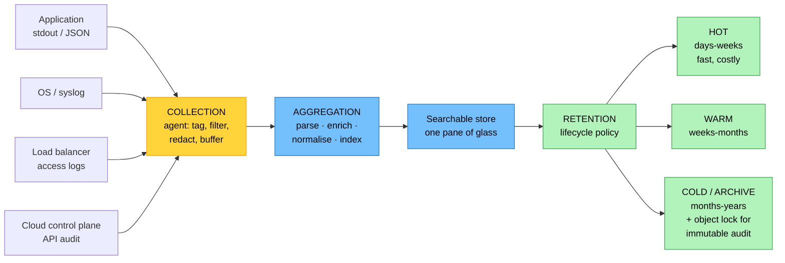
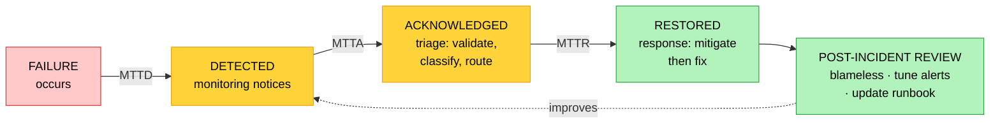

# Objective 3.1 — Given a scenario, configure appropriate resources to achieve observability

> **Domain 3.0 — Operations (17% of exam)** · Exam CV0-004 V4 · Objectives doc v5.0
> **Status:** Exam-ready · **Version:** 2.0 (enhanced) · Supersedes `full notes/Objective-3.1-Observability.md`

---

## 0. How to use this note

| Pass | What to read | Time |
|---|---|---|
| **1st (learn)** | Sections 1 → 8 in order | ~65 min |
| **2nd (drill)** | Section 2.2 (the three pillars) + 6.1 (alert design) + 7.2 (time sync) | ~20 min |
| **3rd (test)** | Section 11 (practice) + Section 12 (PBQ drills) | ~30 min |
| **Exam eve** | Section 13 (60-second recall sheet) only | ~5 min |

> 📌 **First objective of Domain 3 (Operations, 17%).** The whole objective turns on one sentence: **metrics tell you WHAT, logs tell you WHY, traces tell you WHERE, alerts tell you WHEN to act.** Almost every question is "which of these four do I need?"

---

## 1. Official objective coverage

> **3.1 Given a scenario, configure appropriate resources to achieve observability.**
> - **Logging**
>   - Collection
>   - Aggregation
>   - Retention
> - Tracing
> - **Monitoring**
>   - Metrics
> - **Alerting**
>   - Triage
>   - Response

### 1.1 What the verb tells you

**"Given a scenario, configure"** — an **application** objective. You are given a symptom or a goal and must select *and configure* the right capability. Expect:

- A symptom → "which observability resource would identify this?"
- A compliance or forensic need → retention and immutability
- A noisy on-call → triage, deduplication, alert design
- A distributed latency problem → tracing, not logs or metrics

### 1.2 Coverage checklist

- [ ] I can state what **each of the four** answers (what / why / where / when)
- [ ] I know the difference between **monitoring** and **observability**
- [ ] I know the three logging sub-stages and what each solves
- [ ] I know **structured logging** and why it matters at scale
- [ ] I can name the metric types: **counter, gauge, histogram**
- [ ] I know the **four golden signals**, and **RED** vs **USE**
- [ ] I can explain a **trace**, a **span**, and trace-context propagation
- [ ] I know **head-based vs tail-based sampling**
- [ ] I know why **high cardinality** is expensive
- [ ] I can distinguish **triage** from **response**
- [ ] I know **MTTD / MTTA / MTTR / MTBF**
- [ ] I know alerts must be **actionable** and should fire on **symptoms**, not causes
- [ ] I know why **clock synchronisation (NTP)** is a prerequisite for correlation

---

## 2. The core mental model

### 2.1 Monitoring vs observability

```text
   MONITORING                          OBSERVABILITY
   ┌──────────────────────────┐        ┌──────────────────────────┐
   │ Watching for the failures │        │ Being able to ASK NEW     │
   │ you ALREADY PREDICTED     │        │ QUESTIONS of a running    │
   │                           │        │ system without shipping   │
   │ Dashboards and thresholds │        │ new code                  │
   │ you defined in advance    │        │                           │
   │                           │        │ Rich, high-context data   │
   │ "Is CPU above 80%?"       │        │ "Why are Malaysian users  │
   │                           │        │  on Android seeing        │
   │ KNOWN unknowns            │        │  timeouts only at 09:00?" │
   └──────────────────────────┘        │ UNKNOWN unknowns          │
                                       └──────────────────────────┘
   ★ Monitoring is a SUBSET of observability. You monitor what you
     expect to break; observability is what lets you diagnose what
     you did not expect.
```

### 2.2 ★ The three pillars plus the action layer

```text
   ┌─────────────┬─────────────┬─────────────┐
   │   METRICS   │    LOGS     │   TRACES    │  ← THE THREE PILLARS
   ├─────────────┼─────────────┼─────────────┤
   │   "WHAT"    │    "WHY"    │   "WHERE"   │
   │             │             │             │
   │ numeric     │ discrete    │ one request │
   │ time series │ event       │ across many │
   │             │ records     │ services    │
   │             │             │             │
   │ Is it       │ What        │ Which hop   │
   │ healthy     │ actually    │ is slow or  │
   │ right now?  │ happened?   │ failing?    │
   │             │             │             │
   │ CHEAP       │ MEDIUM      │ MEDIUM-HIGH │
   │ to store    │ cost        │ cost        │
   │             │             │             │
   │ aggregated, │ detailed,   │ causal      │
   │ low detail  │ high volume │ ordering    │
   └─────────────┴─────────────┴─────────────┘
                        │
                        ▼
              ┌─────────────────────┐
              │      ALERTING       │  ← THE ACTION LAYER
              │       "WHEN"        │
              │  turns observation  │
              │  into human action  │
              │  TRIAGE → RESPONSE  │
              └─────────────────────┘

   ★ THE ANSWERING RULE
     "Is something wrong?"           → METRICS
     "What exactly happened?"        → LOGS
     "Which service is the problem?" → TRACES
     "Who needs to act, and now?"    → ALERTING
```

### 2.3 How they work together in one incident

```text
   09:14  METRIC   error rate crosses 2% → threshold breached
   09:14  ALERT    fires; TRIAGE dedups 40 alarms into 1 incident,
                   classifies SEV2, routes to the payments on-call
   09:16  TRACE    a slow request shows 90% of latency in the
                   payment-gateway span  →  WHERE
   09:19  LOG      that service's logs show connection-pool
                   exhaustion  →  WHY
   09:25  RESPONSE runbook: raise pool size, restart, verify
   09:31  METRIC   error rate back to baseline → incident resolved
   next day       blameless post-incident review; tune the threshold

   ★ Each pillar narrows the search. Metrics detect, traces localise,
     logs explain, alerting mobilises.
```

---

## 3. Logging

### 3.1 Collection

| | |
|---|---|
| **Definition** | Capturing event records at the source — OS (syslog, Windows Event Log), applications (stdout/stderr), containers, network devices, load balancers, databases, and the **cloud control plane** (API audit logs). |
| **Agent vs agentless** | **Agent** (Fluent Bit, CloudWatch agent, Filebeat) runs on the host: tags, filters, redacts, and buffers through network outages. **Agentless** pulls from a managed service API — less control, nothing to install |
| **★ Structured logging** | Emit **JSON** with consistent fields rather than free text. `{"level":"ERROR","service":"payments","trace_id":"abc","msg":"..."}` is queryable; `ERROR payments failed` is not, at scale |
| **Log levels** | `TRACE` → `DEBUG` → `INFO` → `WARN` → `ERROR` → `FATAL`. Production usually runs at INFO; DEBUG is enabled temporarily and is a common cause of cost spikes |
| **What to redact at source** | Passwords, tokens, card numbers, personal data — **before** they leave the host |
| **Failure modes** | **Log blindness** (a source emits nothing, so it fails silently) and **log noise** (everything is captured, so signal drowns) |
| **Exam triggers** | "capture application events", "install an agent", "forward logs from every server", "stdout/syslog", "audit the control plane" |

> ⚠️ **Twelve-factor factor 11 (see 1.5): treat logs as an event stream to stdout.** The application should not manage log files, rotation, or shipping — the platform does. Writing to local files invites disks filling and logs dying with the container.

### 3.2 Aggregation

| | |
|---|---|
| **Definition** | Shipping logs from many heterogeneous sources into **one centralised, queryable store** so events can be correlated across the estate. |
| **Pipeline** | agents → **router/processor** (parse, enrich with region/instance/service, normalise schema) → **search backend** (OpenSearch, Splunk, or a cloud log service) |
| **Why** | Answers questions no single host can: *"show every 5xx across all services in the last hour."* Reduces **MTTD** by giving one pane of glass. Enables log-based metrics and dashboards |
| **★ Cardinality** | The number of unique label/field combinations. **High-cardinality fields** (per-user IDs, request IDs, full URLs) explode index size and cost — keep them searchable but **unindexed** where possible |
| **Normalisation** | One common schema and consistent timestamps, or correlation is impossible |
| **Exam triggers** | "correlate events across services/regions", "single pane of glass", "centralised log store", "search all logs at once" |

### 3.3 Retention

| | |
|---|---|
| **Definition** | How long log data is kept before archival or deletion, driven by the triangle of **cost, compliance, and debugging need**. |
| **Tiering** | **Hot** — recent, fast, expensive, for active troubleshooting (days–weeks) · **Warm** — cheaper, slower (weeks–months) · **Cold/archive** — object storage for long-term compliance (months–years) |
| **★ Compliance drivers** | Frameworks mandate minimum windows — commonly **1 year for security/audit logs**, longer for financial and legal records. The **strictest applicable requirement governs** |
| **Immutability** | Regulatory and forensic use often requires **WORM/object lock** and **legal hold** so logs provably cannot be altered (see 1.4, 4.2) |
| **Automation** | Lifecycle policies move data hot → warm → cold → deleted automatically; log rotation at the source stops local disks filling |
| **Exam triggers** | "keep audit logs for 7 years", "prove logs were not altered", "reduce log storage cost", "legal hold", "compliance retention" |



---

## 4. Monitoring and metrics

| | |
|---|---|
| **Definition** | Continuous collection and visualisation of **metrics** — numeric time-series measurements describing system behaviour. A metric has a **name**, **labels/dimensions**, a **value**, and a **timestamp**. |
| **Why metrics first** | Cheap to store, fast to query, easy to alert on. They answer *"is it healthy right now?"* and drive dashboards, capacity planning, and **auto-scaling** (see 3.2) |
| **Limitation** | Metrics are **aggregated** — they tell you the error rate rose, never which request failed or why. That needs logs and traces |
| **Exam triggers** | "CPU/memory/latency dashboard", "threshold alarm", "capacity planning", "scale on a metric", "p95 latency" |

### 4.1 Metric types

```text
   COUNTER            monotonically INCREASES (resets on restart)
                      requests_total, errors_total, bytes_sent
                      → you graph the RATE of change, not the value

   GAUGE              goes UP and DOWN
                      cpu_percent, memory_in_use, queue_depth,
                      active_connections

   HISTOGRAM          buckets a distribution → yields PERCENTILES
                      request_duration → p50, p95, p99
                      ★ percentiles are what users actually feel

   SUMMARY            similar to histogram; percentiles computed
                      at the client rather than the backend
```

> ★ **Use percentiles, not averages.** An average latency of 200 ms can hide a p99 of 8 seconds — the slowest 1% of requests, which is often your most valuable customers. Averages conceal exactly the users who are suffering.

### 4.2 What to measure — three standard frameworks

```text
   FOUR GOLDEN SIGNALS  (general purpose)
   ┌──────────────┬────────────────────────────────────────────┐
   │ LATENCY      │ how long requests take (split success/fail)│
   │ TRAFFIC      │ how much demand — requests/sec, throughput │
   │ ERRORS       │ rate of failed requests                    │
   │ SATURATION   │ how full the system is — the constrained   │
   │              │ resource's utilisation vs its limit        │
   └──────────────┴────────────────────────────────────────────┘

   RED  — for request-driven SERVICES
     RATE      requests per second
     ERRORS    failed requests per second
     DURATION  time per request (percentiles)

   USE  — for RESOURCES (CPU, disk, network, memory)
     UTILIZATION  % of time busy
     SATURATION   queued work waiting
     ERRORS       error counts

   ★ RED for the service your users call. USE for the hardware
     underneath it. Golden signals blend both.
```

### 4.3 SLI, SLO, and the error budget

| Term | Meaning |
|---|---|
| **SLI** | Service Level **Indicator** — the measured value (99.97% of requests succeeded) |
| **SLO** | Service Level **Objective** — your internal target (99.95%) |
| **SLA** | Service Level **Agreement** — the contractual promise with penalties (99.9%) |
| **★ Error budget** | `1 − SLO`. At 99.9%, you may fail 0.1% of requests — about **43 minutes a month**. It is a *budget*: spend it on risk |

**Burn-rate alerting** is the modern practice: instead of paging on "CPU > 80%", page when the **error budget is being consumed too fast to last the month**. It alerts on user impact rather than on a proxy.

---

## 5. Tracing

| | |
|---|---|
| **Definition** | **Distributed tracing** follows a **single request** as it travels across services, queues, and databases, producing a timeline of every hop with its duration and status. |
| **Structure** | A **trace** = one request's whole journey, identified by a **trace ID**. A **span** = one unit of work within it (an HTTP call, a DB query), with a span ID and a parent span ID — forming a tree |
| **Propagation** | Context passes between services in headers — the **W3C Trace Context `traceparent`** header, usually via **OpenTelemetry**. ⚠️ If any service fails to forward the header, **the trace breaks at that point** |
| **Instrumentation** | **Automatic** (agent or sidecar, no code change) or **manual** (explicit spans in code, richer detail) |
| **Also gives you** | A **service dependency map**, and visibility of cascading failures |
| **Exam triggers** | "which microservice is slow", "request crosses ten services", "find the bottleneck in a distributed call chain", "span", "trace ID" |

```text
   A TRACE — one checkout request, 840 ms total

   trace_id: 7f3a…
   ├─ [span] api-gateway            ██                        40 ms
   │   └─ [span] auth-service        ███                      55 ms
   │   └─ [span] cart-service        ████                     70 ms
   │       └─ [span] cache lookup    █                        12 ms
   │   └─ [span] payment-service     ████████████████████    620 ms ← ★
   │       └─ [span] db query        ███████████████████     590 ms ← ★
   │   └─ [span] notification        ██                       35 ms
                                     └────────────────────┘
   ★ 70% of the total is ONE database query inside payment-service.
     Metrics would show "checkout is slow"; logs would show thousands
     of lines across seven services. The TRACE points at the query.
```

### 5.1 Sampling

Storing every trace at scale is prohibitive, so traces are sampled:

| | **Head-based** | **Tail-based** |
|---|---|---|
| Decision made | **At the start** of the request | **After the trace completes** |
| Cost | Cheap and simple | Higher — all spans must be buffered |
| Risk | **May discard the rare error or slow trace** you needed | — |
| Benefit | Predictable volume | **Keeps all errors and slow traces**, samples the boring ones |

> 💡 **Tail-based sampling is what you want for diagnosis** — it guarantees the interesting traces survive. Head-based is cheaper but throws away 99% of requests before knowing whether any were the failure you are hunting.

---

## 6. Alerting

### 6.1 ★ Alert design — what makes an alert good

```text
   ┌──────────────────────────────────────────────────────────────┐
   │ ① EVERY ALERT MUST BE ACTIONABLE                             │
   │    If nobody does anything when it fires, it should not       │
   │    exist. Delete it or make it a dashboard.                   │
   ├──────────────────────────────────────────────────────────────┤
   │ ② ALERT ON SYMPTOMS, NOT CAUSES                              │
   │    Page on "checkout error rate > 2%" (users are hurting),    │
   │    not "CPU > 80%" (may be entirely fine).                    │
   ├──────────────────────────────────────────────────────────────┤
   │ ③ INCLUDE CONTEXT                                             │
   │    Service, region, severity, dashboard link, and a           │
   │    RUNBOOK LINK. An alert with no runbook wastes minutes.     │
   ├──────────────────────────────────────────────────────────────┤
   │ ④ SET SEVERITY DELIBERATELY                                   │
   │    PAGE-worthy (wake someone) vs TICKET-worthy (business      │
   │    hours). Most alerts are not page-worthy.                   │
   ├──────────────────────────────────────────────────────────────┤
   │ ⑤ TUNE TO AVOID ALERT FATIGUE                                 │
   │    Constant false positives train people to ignore alerts —   │
   │    then the real one is ignored too.                          │
   └──────────────────────────────────────────────────────────────┘
```

**Alarm vs alert:** an **alarm** is a threshold crossing (may be benign); an **alert** is a notification that something needs attention. Not every alarm should become an alert.

### 6.2 Triage

| | |
|---|---|
| **Definition** | Evaluating an incoming alert to decide **whether it is real, how severe it is, and who owns it** — before anyone spends effort fixing. |
| **Activities** | **Validate** (real or false positive) · **classify severity** (SEV1–SEV4) · **deduplicate and correlate** (forty alarms from one root cause become one incident) · **route** to the right on-call team · **escalate** if unacknowledged |
| **Purpose** | Suppresses noise, surfaces signal, and directly combats **alert fatigue** |
| **Metric** | Drives **MTTA** — mean time to acknowledge |
| **Exam triggers** | "five engineers paged for one root cause", "which team owns this", "classify severity", "reduce alert noise", "deduplicate" |

**Typical severity scheme:**

| Severity | Meaning | Response |
|---|---|---|
| **SEV1** | Critical — full outage or data loss | Page immediately, all hands, incident bridge |
| **SEV2** | Major — significant degradation | Page on-call |
| **SEV3** | Minor — limited impact, workaround exists | Ticket, business hours |
| **SEV4** | Informational / cosmetic | Backlog |

### 6.3 Response

| | |
|---|---|
| **Definition** | The action after triage — **acknowledge → investigate → mitigate → restore → review**. |
| **Mechanisms** | **Runbook execution** (documented steps) · **automated remediation** (auto-rollback a bad deploy, auto-scale, restart a failed container, clear a full disk) · **escalation** · **communication** (status page, incident bridge) |
| **★ Mitigate before you diagnose** | Restore service first — roll back, fail over, scale out. Root cause analysis comes after users are served |
| **Automation caution** | Automated remediation reduces MTTR but must be guarded against false positives — an auto-restart loop can turn a small problem into an outage |
| **Afterwards** | **Blameless post-incident review**: what happened, why the alert did or did not fire, whether the threshold and runbook need tuning |
| **Metric** | Drives **MTTR** |
| **Exam triggers** | "alerts fire but nobody acts", "no runbook", "automatically replace the failed instance", "post-mortem", "reduce time to recover" |

### 6.4 The incident lifecycle and its metrics



| Metric | Full name | Improve it by |
|---|---|---|
| **MTTD** | Mean time to **detect** | Better monitoring coverage, symptom-based alerts |
| **MTTA** | Mean time to **acknowledge** | Good triage, routing, on-call rotas, less noise |
| **MTTR** | Mean time to **repair/restore** | Runbooks, automation, practised failover |
| **MTBF** | Mean time **between** failures | Reliability engineering, redundancy |

Recall from 1.2: `Availability = MTBF / (MTBF + MTTR)` — **reducing MTTR raises availability**, and is usually cheaper than raising MTBF.

---

## 7. Cross-cutting concerns

### 7.1 Correlation — tying the pillars together

```text
   The SAME identifier must appear in all three pillars:

   TRACE   trace_id: 7f3a…  span: payment-service        620 ms
                 │
                 ▼ same trace_id
   LOG     {"ts":"09:19:03Z","level":"ERROR","service":"payments",
            "trace_id":"7f3a…","msg":"connection pool exhausted"}
                 │
                 ▼ same labels
   METRIC  payments_errors_total{service="payments",region="ap-se-1"}

   ★ A CORRELATION ID (or trace ID) propagated through every service
     and written into every log line is what lets you jump from a
     slow span straight to the exact log lines that explain it.
```

### 7.2 ★ Time synchronisation — the prerequisite everyone forgets

If hosts disagree about the time, **cross-system correlation becomes impossible**: log lines interleave in the wrong order, traces show negative durations, and forensic timelines are inadmissible.

| Requirement | Why |
|---|---|
| **NTP on every host** | Keeps clocks within milliseconds |
| **Log in UTC** | Removes time-zone and daylight-saving ambiguity |
| **ISO 8601 timestamps** | Unambiguous, sortable |
| **Include milliseconds** | Second-granularity is too coarse to order events |

> ⚠️ **Clock skew is a classic Domain 6 fault too.** "The logs show the response arriving before the request" is a time-sync problem, not a physics problem.

### 7.3 Controlling observability cost

Log and metric ingestion can rival compute spend. The levers:

| Lever | Effect |
|---|---|
| **Set log levels appropriately** | DEBUG left on in production is the classic cost spike |
| **Sample traces** (tail-based) | Keep the interesting ones, discard the routine |
| **Limit metric cardinality** | Avoid per-user or per-request labels on metrics |
| **Tier and expire logs** | Hot → warm → cold → delete via lifecycle policy |
| **Filter at the source** | Drop health-check noise before it is shipped |
| **Aggregate before storing** | Pre-compute rather than storing every raw data point |

### 7.4 Related monitoring types (see 1.2)

| Type | What it does |
|---|---|
| **Synthetic monitoring** | Scripted transactions on a schedule — catches breakage **with no real traffic**, e.g. at 03:00 |
| **Real user monitoring (RUM)** | Instruments actual sessions — true experienced performance by geography and device |
| **Health checks** | Load balancer/orchestrator probes driving traffic routing and restarts (see 1.6) |
| **SIEM** | Security-focused aggregation and correlation for threat detection (see 4.6) |

---

## 8. Comparison tables

### 8.1 ★ The four capabilities

| | **Metrics (monitoring)** | **Logs** | **Traces** | **Alerting** |
|---|---|---|---|---|
| Answers | **WHAT** is happening | **WHY** it happened | **WHERE** it happened | **WHEN** to act |
| Data | Numeric time series | Discrete event records | Spans in a request tree | Notifications |
| Granularity | Aggregated | Per event | Per request | Per incident |
| Storage cost | **Low** | Medium | Medium–high | Low (process) |
| Query speed | **Fast** | Slower | Moderate | — |
| Best for | Health, dashboards, **auto-scaling**, capacity | Root cause, audit, forensics | Distributed latency, dependencies | Mobilising humans |
| Weak at | Explaining causes | Aggregate trends | Non-request work | Detecting anything itself |
| Key risk | Averages hiding p99 | Volume and cost | Broken context propagation | **Alert fatigue** |

### 8.2 Logging stages

| Stage | Purpose | Key decision | Failure mode |
|---|---|---|---|
| **Collection** | Capture at the source | Agent vs agentless; **structured JSON**; redact secrets | Log blindness / log noise |
| **Aggregation** | Centralise and correlate | Pipeline, schema, **cardinality** | Cannot correlate across services |
| **Retention** | How long to keep | Hot/warm/cold tiers, **immutability**, legal hold | Forensic gap, or runaway cost |

### 8.3 Triage vs response

| | **Triage** | **Response** |
|---|---|---|
| Question | "Is this real, how bad, and whose is it?" | "How do we fix it?" |
| Activities | Validate, classify, dedup, route, escalate | Acknowledge, mitigate, restore, review |
| Output | A severity and an owner | Restored service and a post-mortem |
| Metric | **MTTA** | **MTTR** |
| Failure mode | **Alert fatigue** | Alerts fire but nobody acts |

### 8.4 Symptom → capability

| Symptom / requirement | Configure |
|---|---|
| "Is the system healthy right now?" | **Metrics dashboard** |
| "Requests are slow across ten microservices" | **Distributed tracing** |
| "Why did this specific transaction fail?" | **Logs** (found via the trace ID) |
| "We need to know within a minute if checkout breaks" | **Alerting** on a symptom metric |
| "Correlate errors across all regions" | **Log aggregation** |
| "Keep audit logs 7 years, provably unaltered" | **Retention + object lock/WORM** |
| "Five engineers paged for one root cause" | **Triage — dedup and correlation** |
| "Alerts fire but nobody does anything" | **Response — on-call, runbooks, automation** |
| "Detect breakage at 3 a.m. with no traffic" | **Synthetic monitoring** |
| "Logs from different servers are out of order" | **NTP time synchronisation** |
| "Observability bill has tripled" | **Log level, sampling, cardinality, retention** |
| "Average latency looks fine but users complain" | **Percentiles — p95/p99, not averages** |

### 8.5 Multi-cloud mapping

| Capability | AWS | Azure | Google Cloud |
|---|---|---|---|
| Metrics & dashboards | CloudWatch | Azure Monitor | Cloud Monitoring |
| Log aggregation | CloudWatch Logs | Log Analytics | Cloud Logging |
| Tracing | X-Ray | Application Insights | Cloud Trace |
| Synthetic checks | CloudWatch Synthetics | Availability tests | Uptime checks |
| Control-plane audit | CloudTrail | Activity Log | Cloud Audit Logs |
| Alerting | CloudWatch Alarms + SNS | Azure Monitor Alerts | Alerting policies |
| Open standard | **OpenTelemetry** | OpenTelemetry | OpenTelemetry |

---

## 9. Exam traps & distractor patterns

| # | Trap | The truth |
|---|---|---|
| 1 | "Monitoring and observability are the same" | Monitoring watches **predicted** failures; observability lets you investigate **unpredicted** ones. Monitoring is a subset |
| 2 | "Use logs to find which microservice is slow" | That is **tracing**. Logs explain *why* once you know *where* |
| 3 | "Metrics will tell you why it failed" | Metrics are aggregated — they show *that* the error rate rose, never *why* |
| 4 | "Average latency is the metric to watch" | Averages hide the tail. Use **p95/p99** — the users who suffer are in the tail |
| 5 | "More alerts means better coverage" | It means **alert fatigue**. Every alert must be **actionable**; the rest are dashboards |
| 6 | "Alert on CPU above 80%" | Alert on **symptoms** users feel (error rate, latency), not causes that may be harmless |
| 7 | "Triage and response are the same" | **Triage** decides *what and whose*; **response** fixes it. Triage drives MTTA, response drives MTTR |
| 8 | "Aggregation and retention are the same" | Aggregation **centralises**; retention decides **how long to keep** |
| 9 | "Keep everything forever to be safe" | Cost is prohibitive. **Tier it**, and let the strictest compliance requirement set the floor |
| 10 | "Retention alone satisfies the auditor" | Forensic and regulatory use usually needs **immutability (WORM/object lock)** to prove logs were not altered |
| 11 | "Head-based sampling is fine for debugging" | It decides **before** knowing the outcome, so it discards the rare errors you need. **Tail-based** keeps them |
| 12 | "Add user ID as a metric label for detail" | **High cardinality** explodes cost. Keep per-user detail in logs and traces, not metric labels |
| 13 | "A broken trace means tracing is unsupported" | More often a service **failed to propagate the `traceparent` header** |
| 14 | "Fix the root cause first" | **Mitigate first** — restore service by rollback, failover, or scaling. Root cause analysis follows |
| 15 | "Automated remediation is always safer" | Guard it — an auto-restart loop reacting to a false positive can escalate a minor issue into an outage |
| 16 | "Timestamps do not matter much" | Without **NTP and UTC**, cross-system correlation and forensic timelines fall apart |
| 17 | "Post-mortems assign blame" | **Blameless** reviews find systemic causes; blame suppresses reporting and makes the next incident worse |

**Disambiguation drill:**

| Pair | The deciding question |
|---|---|
| **Metrics vs logs** | Do you need a **number over time**, or the **detail of one event**? |
| **Logs vs traces** | Do you know **which service** is at fault? If not → trace first |
| **Monitoring vs alerting** | **Detecting** a condition vs **notifying a human** about it |
| **Triage vs response** | Deciding **what and whose** vs **fixing** it |
| **Collection vs aggregation** | Getting logs **off the host** vs bringing them **together** |
| **Aggregation vs retention** | **Where** they live vs **how long** they live |
| **Synthetic vs RUM** | Scripted probes with **no real traffic** vs **real user** sessions |
| **Head vs tail sampling** | Decide **before** the request runs vs **after** it completes |

---

## 10. Keyword → answer trigger table

| If you see… | Configure |
|---|---|
| CPU/memory/latency over time · dashboard · threshold · capacity planning · scale on a metric | **Metrics / monitoring** |
| what exactly happened · error detail · audit trail · forensic investigation | **Logs** |
| which service in the chain is slow · request crosses many microservices · span · trace ID | **Distributed tracing** |
| notify the on-call · page someone · threshold breached and a human is needed | **Alerting** |
| install an agent · forward stdout/syslog · capture from every host | **Log collection** |
| correlate across services and regions · single pane of glass · search everything at once | **Log aggregation** |
| keep for N years · reduce log storage cost · lifecycle to archive | **Log retention** |
| prove the logs were not altered · legal hold | **Immutable retention (WORM/object lock)** |
| five pages for one root cause · which team owns this · classify severity | **Triage (dedup, correlation, routing)** |
| alerts fire but nobody acts · no runbook · auto-replace the failed instance | **Response** |
| p95 / p99 · averages look fine but users complain | **Percentiles from a histogram** |
| requests/sec, errors/sec, duration | **RED method** |
| utilisation, saturation, errors on a resource | **USE method** |
| latency, traffic, errors, saturation | **Four golden signals** |
| how much failure are we allowed this month | **Error budget (1 − SLO)** |
| detect breakage at 3 a.m. with no users online | **Synthetic monitoring** |
| logs from different hosts are out of order | **NTP / UTC timestamps** |
| observability bill has tripled | **Log level, sampling, cardinality, retention** |
| keep all error traces but only some normal ones | **Tail-based sampling** |

---

## 11. Practice questions

<details>
<summary><b>Q1.</b> Users report that checkout is slow. The request passes through eight microservices. Which capability MOST directly identifies where the delay occurs?</summary>

A. Metrics dashboard · B. Log aggregation · **C. Distributed tracing** · D. Synthetic monitoring

**Correct: C — tracing.** A trace shows each span's duration across the whole request path, pinpointing which service or query consumes the time.
- **A wrong:** Metrics show *that* latency rose, not which hop caused it.
- **B wrong:** Logs explain *why* once you know *where*; searching eight services' logs blind is far slower.
- **D wrong:** Synthetic monitoring detects breakage but does not decompose latency by service.
</details>

<details>
<summary><b>Q2.</b> What is the PRIMARY difference between monitoring and observability?</summary>

A. They are synonyms · **B. Monitoring watches for failures you predicted in advance; observability lets you investigate problems you did not anticipate** · C. Observability only applies to containers · D. Monitoring is manual, observability automated

**Correct: B.** Monitoring covers known-unknowns via predefined dashboards and thresholds; observability is the property that lets you ask new questions of a live system.
- **A wrong:** Monitoring is a subset of observability.
- **C/D wrong:** Neither is accurate.
</details>

<details>
<summary><b>Q3.</b> Security requires audit logs retained for seven years with proof they have not been altered. What should be configured?</summary>

A. Hot-tier retention for seven years · **B. Lifecycle transition to archive storage with object lock/WORM and a defined retention period** · C. Increase the log level to DEBUG · D. Head-based sampling

**Correct: B.** Archive tiering controls cost over seven years, and object lock provides the immutability that proves logs were not tampered with.
- **A wrong:** Seven years of hot-tier storage is prohibitively expensive.
- **C wrong:** Log verbosity does not address retention or integrity.
- **D wrong:** Sampling applies to traces.
</details>

<details>
<summary><b>Q4.</b> One database failure generates 40 alarms and pages five engineers simultaneously. What is missing?</summary>

**A. Triage — deduplication and correlation into a single incident with one owner** · B. More monitoring coverage · C. Longer log retention · D. Tail-based sampling

**Correct: A.** Triage validates, deduplicates, correlates related alarms into one incident, classifies severity, and routes to a single owning team.
- **B wrong:** The problem is too much notification, not too little detection.
- **C/D wrong:** Neither addresses alert handling.
</details>

<details>
<summary><b>Q5.</b> Which metric type is appropriate for a value that only ever increases, such as total requests served?</summary>

**A. Counter** · B. Gauge · C. Histogram · D. Summary

**Correct: A — counter.** Counters increase monotonically (resetting on restart); you graph their rate of change.
- **B wrong:** A gauge moves up and down, like memory in use.
- **C/D wrong:** Both describe distributions used to derive percentiles.
</details>

<details>
<summary><b>Q6.</b> Average API latency is 180 ms and within target, yet customers complain of slowness. What should be examined?</summary>

A. The counter for total requests · **B. Percentile latency such as p95 and p99, which reveal the slow tail hidden by the average** · C. Log retention settings · D. The trace sampling rate

**Correct: B.** An average conceals the tail; a p99 of several seconds means the slowest 1% of requests — real users — are suffering.
- **A wrong:** Request volume says nothing about latency distribution.
- **C/D wrong:** Neither reveals user-experienced latency.
</details>

<details>
<summary><b>Q7.</b> Which practice BEST reduces alert fatigue?</summary>

A. Route every alarm to the on-call phone · **B. Ensure every alert is actionable, alert on user-facing symptoms rather than causes, and deduplicate related alarms** · C. Increase all thresholds by 50% · D. Disable alerting overnight

**Correct: B.** Actionability, symptom-based alerting, and correlation are the standard remedies — noise trains people to ignore alerts, including the real ones.
- **A wrong:** That causes the fatigue.
- **C wrong:** Blanket threshold raising hides genuine problems.
- **D wrong:** Outages do not respect business hours.
</details>

<details>
<summary><b>Q8.</b> A team wants to keep every trace that contains an error or exceeds a latency threshold, while sampling only a fraction of normal traffic. Which approach is required?</summary>

A. Head-based sampling · **B. Tail-based sampling** · C. No sampling at all · D. Log aggregation

**Correct: B — tail-based.** The sampling decision is made **after** the trace completes, so errors and slow traces can be retained selectively.
- **A wrong:** Head-based decides at the start, before the outcome is known, so it discards errors at random.
- **C wrong:** Retaining everything is prohibitively expensive at scale.
- **D wrong:** Aggregation applies to logs.
</details>

<details>
<summary><b>Q9.</b> Log lines from different servers appear out of chronological order, making an incident timeline impossible to reconstruct. What is the MOST likely cause?</summary>

A. Insufficient retention · **B. Clock skew — hosts are not synchronised via NTP and/or are not logging in UTC** · C. Head-based sampling · D. High cardinality

**Correct: B.** Correlation across systems depends on synchronised, unambiguous timestamps — NTP, UTC, and ISO 8601 with milliseconds.
- **A wrong:** Retention concerns how long logs are kept.
- **C wrong:** Sampling applies to traces.
- **D wrong:** Cardinality affects index cost.
</details>

<details>
<summary><b>Q10.</b> Which alerting approach reflects best practice?</summary>

A. Page when any server exceeds 80% CPU · **B. Page when the checkout error rate exceeds the level users would notice, with a runbook link attached** · C. Page on every log line containing "error" · D. Page only during business hours

**Correct: B.** Alert on **symptoms** users experience, and include the context and runbook that make the alert actionable.
- **A wrong:** High CPU may be entirely healthy — a cause, not a symptom.
- **C wrong:** That generates enormous noise.
- **D wrong:** Severity should determine paging, not the clock alone.
</details>

<details>
<summary><b>Q11.</b> Which pairing of pillar to question is CORRECT?</summary>

A. Metrics → why did it fail · B. Traces → is the system healthy · **C. Logs → what exactly happened in this event** · D. Alerting → where is the bottleneck

**Correct: C.** Logs are discrete event records containing the detail of what occurred.
- **A wrong:** Metrics answer *what/whether*, not *why*.
- **B wrong:** Overall health is a metrics question.
- **D wrong:** Locating a bottleneck is tracing.
</details>

<details>
<summary><b>Q12.</b> A team adds a per-user-ID label to a metric to improve granularity. What is the consequence?</summary>

A. Improved query performance · **B. A cardinality explosion that dramatically increases storage and query cost** · C. Better trace propagation · D. Reduced log volume

**Correct: B.** Each unique label combination creates a separate time series; per-user labels can create millions.
- **A wrong:** It degrades performance.
- **C/D wrong:** Neither is affected by metric labels.

Per-user detail belongs in **logs and traces**, not metric labels.
</details>

<details>
<summary><b>Q13.</b> During an outage, what should the responder do FIRST?</summary>

A. Perform full root cause analysis · **B. Mitigate to restore service — roll back, fail over, or scale out** · C. Write the post-mortem · D. Increase log retention

**Correct: B.** Restore service first; diagnosis follows. Users care about availability, not about your understanding of the cause.
- **A wrong:** Root cause analysis during an active outage extends the outage.
- **C wrong:** Post-mortems happen after resolution.
- **D wrong:** Irrelevant during an incident.
</details>

<details>
<summary><b>Q14.</b> Which metrics framework is designed for measuring request-driven services?</summary>

A. USE (Utilization, Saturation, Errors) · **B. RED (Rate, Errors, Duration)** · C. CAP · D. MTTR

**Correct: B — RED.** Rate, errors, and duration describe a service from the caller's perspective.
- **A wrong:** USE targets **resources** such as CPU, disk, and network.
- **C wrong:** CAP is a distributed-database theorem (see 1.9).
- **D wrong:** MTTR is an incident metric.
</details>

<details>
<summary><b>Q15.</b> A distributed trace stops partway through a request chain. What is the MOST likely cause?</summary>

A. Log retention expired · **B. A service failed to propagate the trace context header to its downstream call** · C. Metrics cardinality is too high · D. The alert was not acknowledged

**Correct: B.** Tracing depends on each service forwarding the `traceparent` (or equivalent) header; one service dropping it breaks the chain from that point.
- **A/C/D wrong:** None affect trace continuity.
</details>

<details>
<summary><b>Q16.</b> What does an error budget represent?</summary>

A. The monthly cost of incidents · **B. The amount of unreliability permitted by the SLO — for a 99.9% SLO, roughly 43 minutes of failure per month** · C. The number of open tickets · D. The log storage allowance

**Correct: B.** Error budget = 1 − SLO, and it can be deliberately spent on release risk. Burn-rate alerting pages when it is being consumed too quickly.
- **A/C/D wrong:** None relate to the reliability target.
</details>

<details>
<summary><b>Q17.</b> Which describes the correct relationship between the logging sub-stages?</summary>

**A. Collection captures logs at the source, aggregation centralises them for correlation, and retention determines how long they are kept** · B. Aggregation captures, collection centralises, retention deletes · C. All three are the same operation · D. Retention happens before collection

**Correct: A.** They form a sequential pipeline, and CompTIA lists them in that order.
- **B/C/D wrong:** All misorder or conflate the stages.
</details>

<details>
<summary><b>Q18.</b> A team needs to detect a broken checkout flow at 03:00 when no customers are online. What should be configured?</summary>

A. Real user monitoring · **B. Synthetic monitoring with scripted transactions on a schedule** · C. Log retention extension · D. Tail-based sampling

**Correct: B.** Synthetic checks run scripted journeys regardless of real traffic, so breakage is found before the first customer meets it.
- **A wrong:** RUM requires real users, of whom there are none at 03:00.
- **C/D wrong:** Neither performs detection.
</details>

<details>
<summary><b>Q19.</b> Which metric would a team improve by introducing runbooks and automated remediation?</summary>

A. MTBF · B. MTTD · C. MTTA · **D. MTTR**

**Correct: D — mean time to repair/restore.** Runbooks and automation shorten the time from acknowledgement to service restoration.
- **A wrong:** MTBF is improved by reliability engineering, not faster recovery.
- **B wrong:** Detection time is improved by monitoring coverage.
- **C wrong:** Acknowledgement time is improved by triage and routing.
</details>

<details>
<summary><b>Q20.</b> An organisation's observability bill has tripled after enabling verbose logging in production. Which combination BEST controls it?</summary>

**A. Restore appropriate log levels, filter noise at the source, limit metric cardinality, and apply lifecycle-based retention tiering** · B. Delete all logs older than one day · C. Disable tracing entirely · D. Stop collecting metrics

**Correct: A.** The standard levers address volume at ingestion and cost over time without losing diagnostic capability.
- **B wrong:** One day breaches most compliance requirements and destroys forensic capability.
- **C/D wrong:** Both remove capability rather than managing cost.
</details>

<details>
<summary><b>Q21.</b> What is the purpose of a blameless post-incident review?</summary>

A. To identify who caused the outage · **B. To find systemic causes and improve detection, alerting, and runbooks without discouraging honest reporting** · C. To calculate the SLA penalty · D. To close the incident ticket

**Correct: B.** Blame suppresses reporting, which makes the next incident worse; the goal is systemic improvement.
- **A wrong:** That is exactly what "blameless" excludes.
- **C/D wrong:** Both are administrative, not the purpose.
</details>

<details>
<summary><b>Q22.</b> Which log format best supports querying at scale?</summary>

A. Free-text lines · **B. Structured JSON with consistent field names** · C. Binary blobs · D. Screenshots

**Correct: B.** Structured logs are machine-parseable, allowing filtering and aggregation by field rather than fragile text matching.
- **A wrong:** Free text requires brittle parsing.
- **C/D wrong:** Neither is queryable.
</details>

<details>
<summary><b>Q23.</b> Which of the four golden signals measures how full the constrained resource is?</summary>

A. Latency · B. Traffic · C. Errors · **D. Saturation**

**Correct: D — saturation.** It expresses how close the most constrained resource is to its limit, and is the leading indicator of impending trouble.
- **A/B/C wrong:** Each measures a different signal — time per request, demand volume, and failure rate respectively.
</details>

<details>
<summary><b>Q24.</b> After finding a slow span in a trace, how does an engineer find the detailed reason for the slowness?</summary>

**A. Use the trace ID to retrieve the correlated log lines from that service** · B. Increase the metric scrape interval · C. Extend retention · D. Add another dashboard

**Correct: A.** A trace or correlation ID written into every log line is what lets you jump from *where* to *why*.
- **B/C/D wrong:** None provide the per-event detail that explains the span.
</details>

<details>
<summary><b>Q25.</b> Which statement about alerting is CORRECT?</summary>

A. Every threshold crossing should page someone · **B. An alert that nobody acts on should be deleted or converted to a dashboard** · C. Alerts replace the need for runbooks · D. Alerting detects problems by itself

**Correct: B.** Actionability is the test of a good alert; non-actionable signals belong on a dashboard.
- **A wrong:** Most alarms are not page-worthy.
- **C wrong:** Runbooks are what make response fast.
- **D wrong:** Monitoring detects; alerting notifies.
</details>

---

## 12. PBQ-style drills

### Drill A — Which capability?

| # | Requirement | Capability? |
|---|---|---|
| 1 | Show CPU and request rate over the last 24 hours | |
| 2 | Find which of nine services is adding 600 ms | |
| 3 | Determine why one specific payment failed | |
| 4 | Notify the on-call engineer within 60 seconds of a checkout outage | |
| 5 | Search errors across every service and region at once | |
| 6 | Prove audit logs were not modified over five years | |
| 7 | Detect a broken login flow at 04:00 with no live users | |

<details><summary>Answers</summary>

1 → **Metrics / monitoring** · 2 → **Distributed tracing** · 3 → **Logs** · 4 → **Alerting** · 5 → **Log aggregation** · 6 → **Retention with immutability (WORM/object lock)** · 7 → **Synthetic monitoring**
</details>

### Drill B — Triage or response?

| # | Activity | Which? |
|---|---|---|
| 1 | Collapse 40 alarms into one incident | |
| 2 | Roll back the bad deployment | |
| 3 | Classify the incident as SEV2 | |
| 4 | Route to the payments on-call team | |
| 5 | Execute the runbook to raise the connection pool | |
| 6 | Escalate because nobody acknowledged in 15 minutes | |
| 7 | Hold a blameless post-incident review | |

<details><summary>Answers</summary>

1 → **Triage** · 2 → **Response** · 3 → **Triage** · 4 → **Triage** · 5 → **Response** · 6 → **Triage** · 7 → **Response** (the review phase)

**Rule:** triage decides *what it is and whose it is* (drives MTTA); response *fixes it* (drives MTTR).
</details>

### Drill C — Choose the metric type

| # | Measurement | Type? |
|---|---|---|
| 1 | Total bytes sent since start-up | |
| 2 | Current queue depth | |
| 3 | p95 request duration | |
| 4 | Number of active connections | |
| 5 | Cumulative count of 5xx responses | |

<details><summary>Answers</summary>

1 → **Counter** · 2 → **Gauge** · 3 → **Histogram** (percentiles from bucketed distribution) · 4 → **Gauge** · 5 → **Counter**
</details>

### Drill D — Diagnose the observability gap

| # | Symptom | Gap + fix? |
|---|---|---|
| 1 | Outage lasted 40 minutes before anyone noticed | |
| 2 | Alert fired at 02:00; acknowledged at 05:00 | |
| 3 | Team knew a service was slow but not which one | |
| 4 | Auditor could not confirm logs were unaltered | |
| 5 | Engineers routinely ignore alerts | |
| 6 | Incident timeline could not be reconstructed | |
| 7 | Average latency healthy, customers complaining | |

<details><summary>Answers</summary>

1 → **MTTD too high** → add symptom-based alerting and monitoring coverage
2 → **MTTA too high** → fix triage, routing, on-call rota; reduce noise
3 → **No distributed tracing** → instrument with OpenTelemetry, propagate trace context
4 → **No immutable retention** → WORM/object lock with a defined retention period
5 → **Alert fatigue** → make every alert actionable, alert on symptoms, dedup
6 → **Clock skew / no aggregation** → NTP, UTC, ISO 8601 timestamps, centralise logs
7 → **Measuring averages** → switch to p95/p99 percentiles
</details>

---

## 13. 60-second recall sheet

```text
╔══════════════════════════════════════════════════════════════════════╗
║  3.1 — OBSERVABILITY   (Domain 3.0 Operations = 17%)                 ║
╠══════════════════════════════════════════════════════════════════════╣
║  ★ METRICS = WHAT · LOGS = WHY · TRACES = WHERE · ALERTS = WHEN      ║
║   MONITORING watches failures you PREDICTED (known unknowns)         ║
║   OBSERVABILITY lets you investigate the UNPREDICTED                 ║
╠══════════════════════════════════════════════════════════════════════╣
║  LOGGING   COLLECTION → AGGREGATION → RETENTION                      ║
║   COLLECTION  agent vs agentless · STRUCTURED JSON · redact secrets  ║
║               at source · levels TRACE→DEBUG→INFO→WARN→ERROR→FATAL   ║
║               ⚠ DEBUG left on in prod = cost spike                   ║
║   AGGREGATION centralise + correlate · one pane of glass             ║
║               ⚠ HIGH CARDINALITY (per-user IDs) explodes cost        ║
║   RETENTION   hot → warm → COLD/ARCHIVE · compliance sets the floor  ║
║               (often 1 yr audit) · ⚠ forensics needs IMMUTABILITY    ║
║               (WORM/object lock + legal hold)                        ║
╠══════════════════════════════════════════════════════════════════════╣
║  METRICS  COUNTER (only up) · GAUGE (up/down) · HISTOGRAM (→ p95/p99)║
║   ★ USE PERCENTILES, NOT AVERAGES — averages hide the suffering tail ║
║   4 GOLDEN SIGNALS: LATENCY · TRAFFIC · ERRORS · SATURATION          ║
║   RED (services): Rate · Errors · Duration                           ║
║   USE (resources): Utilization · Saturation · Errors                 ║
║   SLI measured → SLO target → SLA contract                           ║
║   ERROR BUDGET = 1 − SLO (99.9% ≈ 43 min/month)                      ║
╠══════════════════════════════════════════════════════════════════════╣
║  TRACING  TRACE = one request · SPAN = one unit of work · tree by    ║
║   trace_id + parent span. Context via `traceparent` (OpenTelemetry). ║
║   ⚠ One service not forwarding the header BREAKS the trace           ║
║   SAMPLING: HEAD = decide at start (cheap, LOSES rare errors)        ║
║             TAIL = decide after completion (KEEPS errors/slow) ★     ║
╠══════════════════════════════════════════════════════════════════════╣
║  ALERTING  ★ every alert must be ACTIONABLE · alert on SYMPTOMS      ║
║   (user-facing) NOT causes (CPU 80% may be fine) · include RUNBOOK   ║
║   TRIAGE   validate · classify SEV1-4 · DEDUP/CORRELATE · route ·    ║
║            escalate           → drives MTTA · prevents ALERT FATIGUE ║
║   RESPONSE acknowledge · MITIGATE FIRST (rollback/failover/scale) ·  ║
║            restore · BLAMELESS post-mortem   → drives MTTR           ║
║   MTTD detect · MTTA acknowledge · MTTR repair · MTBF between        ║
║   Availability = MTBF / (MTBF + MTTR) → cutting MTTR raises uptime   ║
╠══════════════════════════════════════════════════════════════════════╣
║  ⚠ CORRELATION needs the SAME trace/correlation ID in logs, metrics  ║
║    and traces — AND SYNCHRONISED CLOCKS (NTP, UTC, ISO 8601, ms).    ║
║    Clock skew makes timelines and forensics impossible.              ║
║  COST levers: log level · tail sampling · cardinality · retention    ║
║    tiering · filter at source                                        ║
╚══════════════════════════════════════════════════════════════════════╝
```

---

## 14. Cross-references

| Related objective | Connection |
|---|---|
| **1.2 Service availability** | **SLA/SLO/SLI**, MTTD/MTTR/MTBF, synthetic monitoring and RUM are introduced there; availability monitoring is an explicit sub-objective |
| **1.5 Cloud-native design** | **Distributed tracing is mandatory** with microservices — you cannot debug a distributed system with logs alone; logs as event streams is twelve-factor XI |
| **1.6 Containerization** | Liveness/readiness probes are health checks; container logs go to stdout and are shipped by the platform |
| **1.8 Cost considerations** | Log ingestion and retention are real line items — cardinality, sampling, and tiering are cost levers |
| **1.10 Optimizing workloads** | **You cannot optimise what you do not measure** — this is where the bottleneck data comes from |
| **2.2 Deployment strategies** | **Canary deployments are impossible without per-version metrics**; automated rollback depends on alert gates |
| **3.2 Scaling** | Auto-scaling is driven by monitored metrics |
| **3.3 Backup and recovery** | Monitoring backup success and testing restores |
| **4.2 Compliance** | Log retention periods and immutability are compliance-driven |
| **4.6 Monitor suspicious activities** | **SIEM** applies aggregation and correlation to security events |
| **6.x Troubleshooting** | This objective supplies the evidence every troubleshooting workflow depends on |

> 🔑 **Carry this forward:** when a scenario describes a symptom, ask which question you are actually trying to answer — *what, why, where,* or *when* — and the capability follows directly.

---

*Source of truth: CompTIA Cloud+ CV0-004 V4 Exam Objectives, document version 5.0. The four golden signals, RED/USE methods, and error-budget practice are industry-standard SRE conventions included as supporting context. Product names are illustrative; the exam is vendor-neutral.*
