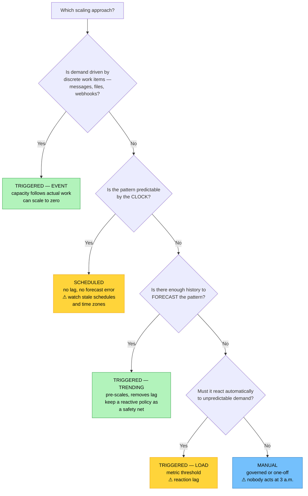

# Objective 3.2 — Given a scenario, configure appropriate scaling approaches

> **Domain 3.0 — Operations (17% of exam)** · Exam CV0-004 V4 · Objectives doc v5.0
> **Status:** Exam-ready · **Version:** 2.0 (enhanced) · Supersedes `full notes/Objective-3.2-Scaling-Approaches.md`

---

## 0. How to use this note

| Pass | What to read | Time |
|---|---|---|
| **1st (learn)** | Sections 1 → 7 in order | ~55 min |
| **2nd (drill)** | Section 2.2 (approach × type matrix) + Section 5 (auto-scaling config) + Section 6 (what limits scaling) | ~20 min |
| **3rd (test)** | Section 10 (practice) + Section 11 (PBQ drills) | ~30 min |
| **Exam eve** | Section 12 (60-second recall sheet) only | ~4 min |

> 📌 **The objective has two independent axes** — *approach* (when scaling happens) and *type* (what changes). Almost every question asks you to pick one of each. Section 6 covers what stops scaling from working, which is where the harder questions and the Domain 6 crossovers live.

---

## 1. Official objective coverage

> **3.2 Given a scenario, configure appropriate scaling approaches.**
> - **Approaches**
>   - **Triggered**
>     - Trending
>     - Load
>     - Event
>   - Scheduled
>   - Manual
> - **Types**
>   - Horizontal
>   - Vertical

### 1.1 What the verb tells you

**"Given a scenario, configure"** — an **application** objective. You must select the approach *and* the type, and know the configuration knobs that make it work: thresholds, cooldowns, warm-up, min/desired/max, health checks, and draining.

### 1.2 Coverage checklist

- [ ] I know **horizontal** vs **vertical** and which improves availability
- [ ] I know which type has a **hard ceiling** and which usually requires **downtime**
- [ ] I can distinguish the three **triggered** sub-types: trending, load, event
- [ ] I know **scheduled** and **manual** and when each is correct
- [ ] I know **elasticity** is not the same as **scalability**
- [ ] I understand **reaction lag** and why reactive scaling always trails demand
- [ ] I know what **cooldown** and **warm-up** prevent
- [ ] I know why **CPU is often the wrong scaling metric**
- [ ] I know **scale-in is the risky direction** and what protects it
- [ ] I can name at least four things that **stop scaling from working**
- [ ] I know **statelessness** is the prerequisite for horizontal scaling

---

## 2. The core mental model

### 2.1 ★ Horizontal vs vertical

```text
   VERTICAL — "scale UP / DOWN"          HORIZONTAL — "scale OUT / IN"
   change the SIZE of one thing          change the NUMBER of things

        ┌────────┐                        ┌────┐
        │        │                        │ VM │
        │  BIG   │                        └────┘
        │   VM   │      ┌────┐            ┌────┐ ┌────┐ ┌────┐ ┌────┐
        │        │  ◄── │ VM │            │ VM │ │ VM │ │ VM │ │ VM │
        │        │      └────┘            └────┘ └────┘ └────┘ └────┘
        └────────┘                              ▲ behind a load balancer

   ✓ Simple — no app changes needed      ✓ Effectively UNBOUNDED
   ✓ Works for STATEFUL apps             ✓ IMPROVES AVAILABILITY
     (single-writer DB, legacy)            (survives instance loss,
   ✗ HARD CEILING — a biggest             spans AZs)
     instance size exists                ✓ No downtime to scale
   ✗ Usually needs a STOP/START          ✗ Requires a STATELESS app
     → DOWNTIME                            (or externalised state)
   ✗ Still ONE instance = still a        ✗ Needs a load balancer and
     single point of failure               health checks
   ✗ Does NOT improve availability       ✗ Cost scales linearly
```

> ★ **The distinction that decides most questions:** horizontal scaling **improves availability**; vertical scaling does not — you still have one instance, so it remains a single point of failure. And vertical has a **ceiling** you will eventually hit, while horizontal is limited mainly by quota and budget.

### 2.2 The two axes — approach × type

```text
                      TYPE (what changes)
                 HORIZONTAL          VERTICAL
              ┌──────────────────┬──────────────────┐
   TRIGGERED  │ auto-scaling     │ rare — resizing  │
    trending  │ group scales out │ usually needs a  │
    load      │ on a forecast,   │ restart, so it   │
    event     │ metric, or event │ is seldom        │
              │ ★ THE COMMON     │ automated        │
              │   CASE           │                  │
   ───────────┼──────────────────┼──────────────────┤
   SCHEDULED  │ 5 → 20 instances │ resize before a  │
              │ at 08:00 weekdays│ known peak, in a │
              │                  │ maintenance slot │
   ───────────┼──────────────────┼──────────────────┤
   MANUAL     │ ops sets desired │ ops resizes the  │
              │ capacity for a   │ DB instance      │
              │ known event      │ ★ COMMON for     │
              │                  │   vertical       │
              └──────────────────┴──────────────────┘

   ★ APPROACH answers WHEN scaling happens.
     TYPE answers WHAT changes.
     They are independent — pick one of each.
```

### 2.3 Scalability vs elasticity

| | **Scalability** | **Elasticity** |
|---|---|---|
| Meaning | The **capacity to grow** to handle more load | **Automatic, rapid, bidirectional** matching of capacity to demand |
| Direction | Usually up/out | **Both** — out *and* in |
| Automation | May be manual | **Automatic** |
| Time frame | Planned, over time | **Minutes**, continuously |
| Cost effect | More capacity costs more | **Releases capacity when idle, so you stop paying** |

> 💡 **Elasticity is what makes cloud economics work.** A system that only scales out is scalable; one that also scales *in* when demand falls is elastic — and that scale-in is where the savings come from (see 1.8).

### 2.4 ★ The reaction-lag problem

```text
   DEMAND vs CAPACITY under reactive (load-based) scaling

   ▲                          ╭──────────╮
   │                        ╭─╯          ╰─╮        ← DEMAND
   │  capacity ────────╮  ╭─╯               ╰────
   │                   ╰──┼──╮ ╭──────────╮
   │                      │  ╰─╯          ╰──      ← CAPACITY
   │                      │
   └──────────────────────┼─────────────────────► time
                          │
                  ┌───────┴────────────────────┐
                  │ THE LAG:                   │
                  │  detect breach   1-5 min   │
                  │ + launch instance 1-3 min  │
                  │ + boot + warm-up  1-5 min  │
                  │ + health check pass ~1 min │
                  │  ────────────────────────  │
                  │  TOTAL: often 3-10 MINUTES │
                  │  ← users are degraded here │
                  └────────────────────────────┘

   MITIGATIONS
     · TRENDING (predictive) — pre-scale before demand arrives
     · SCHEDULED — pre-scale for known cycles
     · Keep a larger baseline (min capacity) — costs more
     · Faster-starting units: CONTAINERS (ms) or SERVERLESS
       instead of VMs (minutes)  — see 1.10
     · Pre-warmed / pre-baked images to cut boot time
```

---

## 3. Types

### 3.1 Horizontal scaling (scale out / in)

| | |
|---|---|
| **Definition** | Adding or removing **identical instances** so load is distributed across more units. |
| **Requires** | A **stateless** application (or externalised session state — see 1.5), a **load balancer** to distribute traffic, and **health checks** so only ready instances receive requests |
| **Strengths** | **Effectively unbounded**; **improves availability** (survives instance and AZ failure); no downtime to scale; the cloud-native default |
| **Limits** | Application must tolerate it; cost grows linearly; subject to quotas, subnet IP space, and downstream capacity (Section 6) |
| **Implemented by** | Auto-scaling group · Kubernetes **HPA** (pods) and **cluster autoscaler** (nodes) · serverless concurrency |
| **Exam triggers** | "add more instances", "scale out", "behind a load balancer", "handle more concurrent users", "survive an instance failure", "stateless" |

### 3.2 Vertical scaling (scale up / down)

| | |
|---|---|
| **Definition** | Changing the **size** of an existing resource — more vCPU, memory, or IOPS — rather than the count. |
| **Strengths** | **No application changes required**; works for **stateful** workloads that cannot be distributed — single-writer databases, legacy monoliths, per-socket-licensed software |
| **★ Limits** | A **hard ceiling** (the largest instance type exists); usually requires a **stop/start → downtime**; **does not improve availability** — one instance is still a single point of failure |
| **Also covers** | Increasing provisioned IOPS or storage capacity, not just compute |
| **Exam triggers** | "resize the instance", "larger instance type", "the database cannot be sharded", "legacy application that cannot run multiple copies", "scale up" |

> ⚠️ **Over-allocating vCPUs can make a VM *slower*.** The scheduler may need to find that many free cores simultaneously before the VM can run (see 1.7). Vertical scaling is not automatically "more performance."

---

## 4. Approaches

### 4.1 Triggered — Trending (predictive)

| | |
|---|---|
| **How it decides** | Analyses **historical patterns** to forecast demand and scales **before** the load arrives. |
| **Strength** | **Eliminates reaction lag** for recurring patterns — capacity is already in place |
| **Weakness** | Needs sufficient history; **cannot foresee novel events** (a viral post, a news mention). Usually run *alongside* a reactive policy as a safety net |
| **Best for** | Recurring daily/weekly cycles, workloads with long provisioning times (large VMs, warm caches, data clusters) |
| **Exam triggers** | "predictive", "based on historical patterns", "forecast", "scale before the morning ramp", "learns the weekly pattern" |

### 4.2 Triggered — Load (reactive)

| | |
|---|---|
| **How it decides** | A **monitored metric crosses a threshold** for a sustained period — CPU, memory, request count, latency, queue depth. |
| **Configuration** | Target metric · threshold · **breach duration** (how long before acting) · adjustment size · **cooldown** |
| **Strength** | Handles **unpredictable** demand; the most common and intuitive approach |
| **★ Weakness** | **Reaction lag** — it responds only *after* users are already affected (Section 2.4) |
| **Best for** | Spiky, unpredictable traffic where the pattern cannot be forecast |
| **Exam triggers** | "when CPU exceeds 70% for 5 minutes", "unpredictable traffic", "react to utilisation", "threshold", "target tracking" |

### 4.3 Triggered — Event

| | |
|---|---|
| **How it decides** | A **discrete event** occurs — a message lands on a queue, a file is uploaded, a webhook fires — rather than a continuous metric crossing a line. |
| **Strength** | Capacity follows **actual work items**, not a proxy metric. Near-zero lag, and can **scale to zero** when idle |
| **Weakness** | Requires a reliable event source; the consumer must keep pace with arrival rate |
| **Best for** | Asynchronous and batch work, queue-driven processing, file-triggered pipelines, serverless (see 1.1, 1.5) |
| **Exam triggers** | "each message triggers a worker", "when a file is uploaded", "queue depth", "event-driven", "scale to zero between jobs" |

### 4.4 Scheduled

| | |
|---|---|
| **How it decides** | The **clock** — capacity changes at predetermined times via a cron/calendar policy. |
| **Strength** | **No lag and no forecast error** — the pattern is known by policy, not inferred. Simple and predictable |
| **Weakness** | **Stale schedules** silently waste money or under-provision; **time-zone and daylight-saving errors** are a classic fault |
| **Best for** | Known business cycles: business hours, month-end payroll, weekly batch, academic terms, retail events with fixed dates |
| **Also** | The cost lever from 1.8 — scheduling non-production **off** outside business hours saves roughly 70% |
| **Exam triggers** | "every weekday at 08:00", "month-end", "known business hours", "cron", "predictable by the calendar" |

### 4.5 Manual

| | |
|---|---|
| **How it decides** | A **human** changes capacity through the console, CLI, API, or an IaC change. |
| **Strength** | Full control; appropriate where changes must be **governed, reviewed, or are rare** |
| **★ Weakness** | **Nobody adjusts it at 03:00.** Unexpected demand goes unserved until a person acts |
| **Best for** | One-off events, tightly governed environments, vertical resizes, workloads whose scaling has significant blast radius |
| **Exam triggers** | "the operations team resizes", "one-off change", "requires approval", "console change", "before a planned event" |

### 4.6 Choosing an approach



---

## 5. Configuring auto-scaling

### 5.1 The anatomy of a scaling group

```text
   ┌────────────────────────────────────────────────────────────┐
   │  MAXIMUM        20   ← hard ceiling; protects the budget   │
   │                       and downstream systems               │
   │                                                            │
   │  DESIRED         8   ← what the group is trying to run     │
   │                       right now; scaling policies move it  │
   │                                                            │
   │  MINIMUM         4   ← never drops below; your baseline    │
   │                       and your availability floor          │
   └────────────────────────────────────────────────────────────┘

   Plus:
     LAUNCH TEMPLATE   the image, size, network, and IAM role
                       used for every new instance
     HEALTH CHECK      instance-level or LOAD-BALANCER-level.
                       ★ LB health checks catch an app that is
                         running but broken; instance checks do not
     AZ SPREAD         distribute across AZs for availability (1.2)
     TERMINATION       which instance to remove on scale-in
     POLICY
```

> ★ **Set minimum for availability, maximum for protection.** The minimum keeps enough capacity to survive an instance failure; the maximum stops a runaway loop — or a traffic flood — from scaling into a five-figure bill or overwhelming the database.

### 5.2 Scaling policy styles

| Style | How it works | Use when |
|---|---|---|
| **Target tracking** | Keep a metric at a target value (e.g. average CPU at 50%); the platform computes the adjustment | The default — simplest and usually best |
| **Step scaling** | Different adjustments for different breach sizes (10% over → +1; 50% over → +4) | Demand spikes vary greatly in size |
| **Simple scaling** | One fixed adjustment, then wait out the cooldown | Legacy; largely superseded |
| **Scheduled action** | Set min/desired/max at a given time | Known calendar patterns |
| **Predictive** | Forecast from history and pre-scale | Recurring cycles, slow-starting instances |

### 5.3 ★ Choosing the scaling metric

**CPU is the default and it is frequently the wrong choice.** Match the metric to what actually saturates:

| Workload | Better metric than CPU | Why |
|---|---|---|
| Web/API tier | **Requests per instance**, or p95 **latency** | CPU may be low while the app is blocked on I/O |
| Queue workers | **Queue depth**, or messages per instance | The backlog *is* the demand signal |
| Memory-bound apps | **Memory utilisation** | CPU stays flat while memory fills |
| Connection-bound | **Active connections** | Saturation is connections, not compute |
| Serverless | **Concurrency** | There are no instances to measure |
| Batch | **Job queue length / pending jobs** | Work waiting is the true backlog |

> ⚠️ **The classic wrong answer:** scaling a queue-worker fleet on CPU. Workers waiting on I/O show low CPU while thousands of messages pile up, so the fleet never scales. **Queue depth** is the correct signal.

### 5.4 Preventing thrashing

```text
   FLAPPING (no cooldown)              STABLE (with cooldown + hysteresis)
   ▲                                   ▲
   │  ╱╲  ╱╲  ╱╲  ╱╲                   │      ╭────────────
   │ ╱  ╲╱  ╲╱  ╲╱  ╲                  │  ╭───╯
   │╱                ╲                 │──╯
   └────────────────────►              └────────────────────►
   scale out → metric drops →          scale out → WAIT (cooldown)
   scale in → metric rises →           → re-evaluate → stable
   scale out … forever

   THE CONTROLS
   COOLDOWN        pause after a scaling action before another may
                   occur — lets the change take effect first
   WARM-UP         new instances' metrics are excluded until they are
                   ready — otherwise their idle CPU drags the average
                   down and triggers a premature scale-in
   HYSTERESIS      different thresholds for out and in
                   (out at 70%, in at 30% — not both at 50%)
   BREACH DURATION require the threshold to hold for N minutes,
                   so a momentary spike does not trigger scaling
```

### 5.5 ★ Scale-in is the dangerous direction

Scaling **out** is safe — you add capacity. Scaling **in** terminates running instances, and that is where things break.

| Control | Purpose |
|---|---|
| **Connection draining / deregistration delay** | Let in-flight requests finish before the instance is removed |
| **Graceful shutdown handling** | The app must catch the termination signal and stop cleanly |
| **Scale-in protection** | Exclude instances currently processing long jobs |
| **Termination policy** | Choose *which* instance to remove (oldest, newest, closest to billing hour, balanced across AZs) |
| **Externalised state** | Sessions and in-progress work must not live only on the terminated instance (see 1.5) |
| **Slower scale-in than scale-out** | Scale out fast to protect users; scale in slowly to avoid removing capacity you are about to need |

---

## 6. What stops scaling from working

This is where the harder questions live, and every item is a cross-domain link.

| Limit | Symptom | Fix |
|---|---|---|
| **★ Statefulness** | Sessions lost when instances are added or removed | Externalise state to a cache or database (**1.5**) |
| **★ Subnet IP exhaustion** | Scaling fails to launch; "no available addresses" | A `/24` subnet gives ~251 usable IPs — size CIDR for **maximum** scale (**1.3**) |
| **★ Database connection limits** | Web tier scales fine, then the database rejects connections | Connection pooler/proxy; the database is the shared bottleneck (**1.9**) |
| **Service quotas** | Cannot exceed N instances/IPs/volumes | Request a quota increase **in advance** |
| **Licensing** | Per-instance or per-socket licences | Licence model may cap horizontal scaling (**1.8**) |
| **Downstream dependencies** | You scaled the web tier and a third-party API began throttling | Scale or protect the whole path; add backpressure and circuit breakers (**1.5**) |
| **Vertical ceiling** | No larger instance type exists | Re-architect to scale horizontally |
| **Boot/warm-up time** | Capacity always arrives late | Predictive/scheduled scaling, faster units, pre-baked images |
| **Maximum set too low** | Scaling stops short of demand | Raise the max — deliberately, with the budget in mind |
| **Sticky sessions** | New instances receive no traffic | Externalise sessions; avoid affinity (**1.3**) |

```text
   ★ SCALING MOVES THE BOTTLENECK — IT DOES NOT REMOVE IT

   BEFORE                          AFTER scaling the web tier
   ┌──────┐                        ┌──────┐┌──────┐┌──────┐┌──────┐
   │ web  │ ← saturated            │ web  ││ web  ││ web  ││ web  │
   └──┬───┘                        └──┬───┘└──┬───┘└──┬───┘└──┬───┘
      │                               └───────┴───────┴───────┘
   ┌──▼───┐                                   │
   │  DB  │ ← fine                       ┌────▼────┐
   └──────┘                              │   DB    │ ← NOW SATURATED
                                         └─────────┘   (connections)

   Always ask: after this scales, WHAT becomes the new constraint?
```

---

## 7. Comparison tables

### 7.1 ★ Horizontal vs vertical

| Aspect | **Horizontal (out/in)** | **Vertical (up/down)** |
|---|---|---|
| What changes | **Number** of instances | **Size** of one instance |
| Ceiling | Quota and budget — effectively unbounded | **Hard maximum instance size** |
| Downtime to scale | **None** | **Usually a stop/start** |
| Availability effect | ✅ **Improves** — survives instance loss | ❌ **No improvement** — still one instance |
| App requirement | **Stateless** or externalised state | None — works for stateful |
| Speed | Minutes (boot time) | Minutes plus a restart |
| Cost pattern | Linear with count | Steps between instance sizes |
| Automation | Commonly automated | Usually manual/scheduled |
| Best for | Web tiers, microservices, stateless workers | Single-writer databases, legacy monoliths, licence-bound apps |

### 7.2 The five approaches

| Approach | Decides from | Lag | Handles the unexpected | Best for |
|---|---|---|---|---|
| **Triggered — trending** | Historical forecast | **None** (pre-scales) | ❌ No | Recurring patterns, slow-booting instances |
| **Triggered — load** | Live metric threshold | **Reaction lag** | ✅ Yes | Unpredictable, spiky demand |
| **Triggered — event** | A discrete event | **Near zero** | ✅ Yes | Queue/batch/async work; scale to zero |
| **Scheduled** | The clock | **None** (planned) | ❌ No | Known business cycles |
| **Manual** | A human | **Human-dependent** | ❌ Not unattended | Governed or one-off changes |

### 7.3 Configuration knobs

| Knob | Prevents / provides | If wrong |
|---|---|---|
| **Minimum** | Availability floor | Too low → no redundancy |
| **Maximum** | Budget and downstream protection | Too low → capped short of demand; too high → runaway cost |
| **Cooldown** | Thrashing | Flapping between out and in |
| **Warm-up** | Premature scale-in | New instances' idle metrics drag the average |
| **Breach duration** | Reacting to noise | Scaling on a momentary spike |
| **Hysteresis** (different in/out thresholds) | Oscillation | Constant churn around one threshold |
| **Health check type** | Detecting broken-but-running apps | Traffic sent to a hung instance |
| **Connection draining** | Dropped in-flight requests | Users see errors on scale-in |
| **Termination policy** | Which instance is removed | Losing the wrong instance or unbalancing AZs |

### 7.4 Scenario → configuration

| Scenario | Approach + type |
|---|---|
| "Unpredictable traffic spikes on a stateless web tier" | **Triggered–load + horizontal** |
| "Traffic rises every weekday at 08:00" | **Scheduled** (or **trending**) **+ horizontal** |
| "Each uploaded file must be processed" | **Triggered–event + horizontal** (often serverless) |
| "Queue backlog grows during the day" | **Triggered–load on queue depth + horizontal** |
| "Database cannot be sharded but needs more memory" | **Manual/scheduled + vertical** |
| "Payroll runs on the 1st at 01:00" | **Scheduled + horizontal** |
| "Dev environments idle overnight" | **Scheduled** scale-to-zero (see 1.8) |
| "One-off marketing launch next Tuesday" | **Manual** (or scheduled) **+ horizontal** |
| "Slow-booting instances always arrive late" | **Trending/predictive + horizontal** |
| "Legacy app cannot run more than one copy" | **Vertical only** |

---

## 8. Exam traps & distractor patterns

| # | Trap | The truth |
|---|---|---|
| 1 | "Vertical scaling improves availability" | It does **not** — one instance remains a single point of failure. **Horizontal** improves availability |
| 2 | "Horizontal scaling works for any application" | It requires **statelessness** or externalised state. A single-writer database cannot simply be cloned |
| 3 | "Vertical scaling is unlimited" | There is a **largest instance type**, and resizing usually needs a **stop/start** |
| 4 | "Auto-scaling responds instantly" | **Reaction lag** is typically 3–10 minutes: detect, launch, boot, warm up, pass health checks |
| 5 | "Always scale on CPU" | Often the **wrong metric**. Queue workers need **queue depth**; web tiers may need requests or latency |
| 6 | "Scale-in is as safe as scale-out" | Scale-in **terminates instances** — it needs draining, graceful shutdown, and externalised state |
| 7 | "Cooldown is optional" | Without it the system **flaps** — scale out, metric drops, scale in, metric rises, forever |
| 8 | "Scheduled scaling is inferior to reactive" | For a **known calendar pattern** it is better — no lag and no forecast error |
| 9 | "Predictive scaling handles anything" | It forecasts from **history**; a novel viral event is not in the history. Keep a reactive policy alongside |
| 10 | "Elasticity and scalability are the same" | Scalability is the **capacity to grow**; elasticity is **automatic, rapid, bidirectional** matching — including scaling **in** |
| 11 | "Auto-scaling fixes performance problems" | It adds capacity. If the constraint is a slow query or a downstream limit, it **moves the bottleneck**, sometimes making things worse |
| 12 | "Set maximum high so you never run out" | The maximum protects your **budget** and your **database**. A runaway loop or traffic flood can otherwise scale into an outage |
| 13 | "Scaling out always works if quota allows" | **Subnet IP exhaustion** stops launches — a `/24` gives ~251 usable addresses (see 1.3) |
| 14 | "The web tier is the only thing to scale" | Scaling it can saturate the **database connection limit** — scale or protect the whole path |
| 15 | "Sticky sessions are fine with auto-scaling" | They undermine even distribution and break graceful scale-in. Externalise session state |

**Disambiguation drill:**

| Pair | The deciding question |
|---|---|
| **Horizontal vs vertical** | Can the app run as **multiple copies**? If not → vertical |
| **Trending vs load** | Do we **forecast** it, or **react** to it? |
| **Load vs event** | A **continuous metric** crossing a line, or a **discrete work item** arriving? |
| **Scheduled vs trending** | Known by the **clock** (scheduled) or **inferred from history** (trending)? |
| **Scheduled vs manual** | **Automated** on a calendar, or a **person** deciding? |
| **Scalability vs elasticity** | Can it grow, or does it grow **and shrink automatically**? |
| **Cooldown vs warm-up** | Pause **between actions** vs ignore a **new instance's metrics** until ready |

---

## 9. Keyword → answer trigger table

| If you see… | Configure |
|---|---|
| add more instances · scale out · behind a load balancer · stateless · survive instance failure | **Horizontal** |
| resize · larger instance type · cannot be sharded · legacy single-copy app · more memory for the database | **Vertical** |
| CPU above 70% for 5 minutes · unpredictable spikes · react to utilisation | **Triggered — load** |
| predictive · learns the weekly pattern · pre-scale before the ramp · forecast from history | **Triggered — trending** |
| each message/file triggers work · queue depth · event-driven · scale to zero when idle | **Triggered — event** |
| every weekday at 08:00 · month-end · known business hours · cron | **Scheduled** |
| the ops team changes capacity · one-off · requires approval | **Manual** |
| queue backlog grows but CPU stays low | **Wrong metric — scale on queue depth** |
| capacity oscillates in and out repeatedly | **Missing cooldown / hysteresis** |
| new instances trigger an immediate scale-in | **Missing warm-up period** |
| users dropped mid-request during scale-in | **Connection draining / graceful shutdown** |
| scaling fails with no available IP addresses | **Subnet CIDR too small** (1.3) |
| web tier scaled, database now rejecting connections | **Connection limit — pooler** (1.9) |
| capacity always arrives after the spike | **Reaction lag — use trending/scheduled or faster units** |
| dev environments idle overnight | **Scheduled scale-in / shutdown** (1.8) |
| scaling stopped at 10 instances despite demand | **Maximum too low, or a service quota** |

---

## 10. Practice questions

<details>
<summary><b>Q1.</b> A stateless web tier experiences unpredictable traffic spikes. Which combination is MOST appropriate?</summary>

**A. Triggered load-based scaling with horizontal scaling** · B. Scheduled scaling with vertical scaling · C. Manual scaling with vertical scaling · D. Trending scaling with vertical scaling

**Correct: A.** Unpredictable demand cannot be forecast or scheduled, so a metric threshold must drive it; a stateless tier scales out cleanly behind a load balancer.
- **B wrong:** A schedule cannot anticipate unpredictable spikes.
- **C wrong:** Nobody is available to act at arbitrary times.
- **D wrong:** Trending needs a predictable historical pattern, and vertical scaling requires a restart.
</details>

<details>
<summary><b>Q2.</b> Which statement about vertical scaling is CORRECT?</summary>

A. It improves availability by adding redundancy · **B. It has a hard ceiling at the largest instance size and usually requires a restart** · C. It requires the application to be stateless · D. It is unbounded

**Correct: B.** Vertical scaling is bounded by the largest available instance and normally needs a stop/start.
- **A wrong:** One instance remains a single point of failure — availability is unchanged.
- **C wrong:** Statelessness is the requirement for **horizontal** scaling.
- **D wrong:** Horizontal is effectively unbounded; vertical is not.
</details>

<details>
<summary><b>Q3.</b> A queue-worker fleet is configured to scale on CPU utilisation. The queue backlog grows to thousands of messages, but the fleet never scales out. Why?</summary>

A. The cooldown is too short · **B. The workers are I/O-bound, so CPU stays low while the backlog grows — the correct metric is queue depth** · C. The maximum is set too high · D. Vertical scaling should be used instead

**Correct: B.** The scaling signal must reflect actual demand. For queue consumers the backlog *is* the demand; CPU is a poor proxy.
- **A wrong:** A cooldown does not prevent an unmet threshold from firing.
- **C wrong:** A high maximum would not block scaling.
- **D wrong:** More workers, not bigger ones, is the answer.
</details>

<details>
<summary><b>Q4.</b> Capacity repeatedly scales out and back in every few minutes. What is MOST likely missing?</summary>

A. A load balancer · **B. A cooldown period and/or different thresholds for scale-out and scale-in** · C. A larger instance type · D. Connection draining

**Correct: B.** Without a cooldown, the metric drops immediately after scaling, triggering a scale-in, which raises it again — classic flapping. Hysteresis (out at 70%, in at 30%) reinforces stability.
- **A wrong:** A load balancer distributes traffic; it does not damp scaling decisions.
- **C wrong:** Instance size is unrelated to oscillation.
- **D wrong:** Draining protects in-flight requests, not stability.
</details>

<details>
<summary><b>Q5.</b> Traffic reliably rises every weekday at 08:00, and instances take six minutes to become ready. Which approach BEST avoids user-visible degradation?</summary>

A. Load-based scaling on CPU · **B. Scheduled or trending (predictive) scaling that provisions capacity before 08:00** · C. Manual scaling · D. Vertical scaling

**Correct: B.** With a known pattern and slow-booting instances, pre-scaling removes the reaction lag entirely.
- **A wrong:** Reactive scaling begins only after users are already affected, and six minutes of boot time makes that worse.
- **C wrong:** Requires someone present every morning.
- **D wrong:** Resizing needs a restart and does not address the ramp.
</details>

<details>
<summary><b>Q6.</b> During scale-in, users report dropped sessions and failed requests. What should be configured?</summary>

**A. Connection draining, graceful shutdown handling, and externalised session state** · B. A larger maximum capacity · C. Predictive scaling · D. A shorter cooldown

**Correct: A.** Scale-in terminates instances; in-flight requests must be allowed to complete and session state must not live only on the terminated instance.
- **B wrong:** Capacity limits are unrelated to termination behaviour.
- **C wrong:** Predictive scaling changes *when* capacity changes, not how instances are removed.
- **D wrong:** A shorter cooldown would make it worse.
</details>

<details>
<summary><b>Q7.</b> What is the PRIMARY difference between scalability and elasticity?</summary>

A. They are the same · **B. Scalability is the capacity to grow; elasticity is automatic, rapid, bidirectional matching of capacity to demand, including scaling in** · C. Elasticity applies only to storage · D. Scalability is automatic; elasticity is manual

**Correct: B.** The scale-**in** half is what turns capacity into cost savings.
- **A/C wrong:** They are distinct, and elasticity applies broadly.
- **D wrong:** Reversed.
</details>

<details>
<summary><b>Q8.</b> A web tier scales from 10 to 80 instances during a sale. The application then begins failing with database connection errors. What happened?</summary>

A. The load balancer failed · **B. Scaling moved the bottleneck — the database's connection limit was exhausted by the larger fleet** · C. The cooldown was too long · D. The instances were undersized

**Correct: B.** Each instance holds a connection pool; multiplying instances multiplies connections until the database refuses them. A connection pooler or proxy is the standard remedy (see 1.9).
- **A wrong:** The errors are database-specific.
- **C/D wrong:** Neither explains connection exhaustion.
</details>

<details>
<summary><b>Q9.</b> Which scaling approach can reduce capacity to zero when there is no work?</summary>

A. Scheduled only · **B. Triggered — event (commonly with serverless)** · C. Vertical · D. Manual

**Correct: B.** Event-driven scaling ties capacity to actual work items, so with no events there is nothing running and nothing billed.
- **A wrong:** A schedule can scale to zero at set times but not in response to work.
- **C wrong:** Vertical scaling changes size, not count.
- **D wrong:** Manual requires a person.
</details>

<details>
<summary><b>Q10.</b> An auto-scaling group launches new instances, but they immediately trigger a scale-in. What is MOST likely misconfigured?</summary>

A. The termination policy · **B. The instance warm-up period — new instances' idle metrics are dragging the group average down** · C. The launch template · D. The health check type

**Correct: B.** Until an instance is serving traffic its low utilisation pulls the average down, appearing to justify scaling in. A warm-up excludes it until ready.
- **A wrong:** Termination policy chooses *which* instance, not whether to scale in.
- **C/D wrong:** Neither explains the metric distortion.
</details>

<details>
<summary><b>Q11.</b> A legacy application cannot run as multiple concurrent copies. Which scaling type is available?</summary>

A. Horizontal only · **B. Vertical only** · C. Both equally · D. Neither

**Correct: B.** Without the ability to run multiple instances, only resizing the single instance is possible — accepting the ceiling and the restart.
- **A wrong:** Horizontal requires multiple copies.
- **C/D wrong:** Vertical remains available.
</details>

<details>
<summary><b>Q12.</b> Auto-scaling fails to launch new instances with an error indicating no available IP addresses. What is the cause?</summary>

A. Service quota on instances · **B. The subnet's CIDR range is too small for the required number of instances** · C. The maximum capacity is too low · D. The launch template is invalid

**Correct: B.** A `/24` subnet provides roughly 251 usable addresses in cloud environments; scaling beyond that exhausts the range. Subnets must be sized for maximum scale (see 1.3).
- **A wrong:** A quota error names the resource limit, not addresses.
- **C wrong:** That would stop scaling silently, not produce an address error.
- **D wrong:** A template error would fail differently.
</details>

<details>
<summary><b>Q13.</b> Which scaling policy style maintains a metric at a specified value and lets the platform compute the adjustment?</summary>

**A. Target tracking** · B. Step scaling · C. Simple scaling · D. Scheduled action

**Correct: A.** Target tracking keeps a chosen metric near a target (for example, 50% average CPU) and is the usual default.
- **B wrong:** Step scaling applies different adjustments by breach magnitude.
- **C wrong:** Simple scaling applies one fixed adjustment and waits out a cooldown.
- **D wrong:** A scheduled action changes capacity by the clock.
</details>

<details>
<summary><b>Q14.</b> Why should an auto-scaling group's maximum capacity be set deliberately rather than very high?</summary>

A. To improve boot times · **B. It protects the budget and downstream systems — a runaway loop or traffic flood could otherwise scale into a huge bill or overwhelm the database** · C. It is required for health checks · D. It determines the instance type

**Correct: B.** The maximum is a safety limit as much as a capacity setting.
- **A/C/D wrong:** None relate to the maximum.
</details>

<details>
<summary><b>Q15.</b> Which approach eliminates reaction lag for a workload whose demand pattern repeats weekly?</summary>

A. Load-based scaling · **B. Trending (predictive) or scheduled scaling** · C. Manual scaling · D. Vertical scaling

**Correct: B.** Both provision capacity *before* demand arrives — trending by forecasting from history, scheduled by the clock.
- **A wrong:** Reactive scaling by definition acts after the threshold is crossed.
- **C wrong:** Manual depends on someone being present.
- **D wrong:** Type, not approach, and it requires a restart.
</details>

<details>
<summary><b>Q16.</b> An organisation wants dev and test environments to consume no capacity outside business hours. Which approach?</summary>

**A. Scheduled scaling (or scheduled shutdown)** · B. Load-based scaling · C. Event-driven scaling · D. Vertical scaling

**Correct: A.** The pattern is known by the clock; scheduling saves roughly 70% on non-production (see 1.8).
- **B wrong:** Idle environments generate no metric signal to react to.
- **C wrong:** There is no triggering work item.
- **D wrong:** Resizing does not stop the spend.
</details>

<details>
<summary><b>Q17.</b> Which health check type detects an application that is running but has become unresponsive?</summary>

A. Instance/hardware status check · **B. Load balancer health check against an application endpoint** · C. Cooldown timer · D. Termination policy

**Correct: B.** An instance-level check confirms the VM is alive; only an application-level probe detects a hung or broken service (see 1.6 readiness probes).
- **A wrong:** The instance is healthy at the hypervisor level.
- **C/D wrong:** Neither performs health detection.
</details>

<details>
<summary><b>Q18.</b> Which is a limitation of predictive (trending) scaling?</summary>

A. It cannot scale horizontally · **B. It forecasts from historical patterns, so it cannot anticipate novel events such as an unexpected viral surge** · C. It requires manual approval · D. It only works with vertical scaling

**Correct: B.** This is why predictive policies are normally paired with a reactive policy as a safety net.
- **A/C/D wrong:** None are accurate.
</details>

<details>
<summary><b>Q19.</b> An application uses sticky sessions tied to individual instances. What problem does this create for auto-scaling?</summary>

**A. New instances receive little traffic, and scale-in drops the sessions bound to terminated instances** · B. Instances cannot boot · C. Cooldowns stop working · D. Vertical scaling becomes impossible

**Correct: A.** Session affinity undermines even distribution and makes graceful scale-in impossible. Externalising session state is the fix (see 1.5).
- **B/C/D wrong:** None follow from session affinity.
</details>

<details>
<summary><b>Q20.</b> Which pairing of approach to scenario is INCORRECT?</summary>

A. Event-driven → each uploaded file starts a processing task · B. Scheduled → payroll batch on the 1st of the month · **C. Trending → a completely novel product launch with no historical data** · D. Load-based → unpredictable traffic spikes

**Correct: C.** Trending requires history to forecast from; a first-time event has none. Scheduled or manual pre-scaling would suit better.
- **A/B/D wrong:** All three pairings are appropriate.
</details>

<details>
<summary><b>Q21.</b> What does an instance warm-up setting control?</summary>

A. How long an instance may run · **B. How long before a newly launched instance's metrics count toward the group's aggregate** · C. The cooldown between scaling actions · D. The boot image used

**Correct: B.** It prevents an instance that is still starting from distorting the average and triggering a premature scale-in.
- **A/C/D wrong:** None describe warm-up.
</details>

<details>
<summary><b>Q22.</b> A database instance needs more memory and cannot be sharded. Which approach and type fit?</summary>

**A. Manual or scheduled, vertical** · B. Triggered load-based, horizontal · C. Event-driven, horizontal · D. Trending, horizontal

**Correct: A.** A single-writer database that cannot be distributed must be resized, and because resizing requires a restart it is normally done deliberately in a maintenance window.
- **B/C/D wrong:** All assume the workload can run as multiple instances.
</details>

<details>
<summary><b>Q23.</b> Which statement about auto-scaling and performance problems is CORRECT?</summary>

A. Auto-scaling resolves any performance issue · **B. Auto-scaling adds capacity; if the real constraint is elsewhere it simply moves the bottleneck** · C. Auto-scaling replaces monitoring · D. Auto-scaling eliminates the need for right-sizing

**Correct: B.** Scaling a tier can push saturation onto the database, a downstream API, or the network. Always ask what becomes the next constraint (see 1.10).
- **A wrong:** A slow query is not fixed by more instances.
- **C wrong:** Auto-scaling **depends** on monitoring (see 3.1).
- **D wrong:** Right-sizing and scaling are complementary (see 1.8).
</details>

<details>
<summary><b>Q24.</b> Which minimum capacity setting is appropriate for a production service that must survive the loss of one instance?</summary>

A. Minimum of 1 · **B. Minimum of at least 2, spread across availability zones** · C. Minimum of 0 · D. Minimum equal to maximum

**Correct: B.** A minimum of two across AZs preserves service during an instance or zone failure (see 1.2).
- **A wrong:** One instance is a single point of failure.
- **C wrong:** Zero provides no baseline for a production service.
- **D wrong:** That removes elasticity entirely.
</details>

<details>
<summary><b>Q25.</b> A team needs capacity for a one-off marketing launch next Tuesday with an unknown traffic profile. What is the MOST appropriate configuration?</summary>

**A. Manually or scheduled pre-scale a higher baseline, with load-based triggered scaling above it as a safety net** · B. Load-based scaling alone · C. Vertical scaling alone · D. Predictive scaling alone

**Correct: A.** A known date justifies pre-scaling; an unknown magnitude justifies keeping a reactive policy to absorb whatever arrives. Blending approaches is standard practice.
- **B wrong:** Reactive alone leaves the launch spike to the reaction lag.
- **C wrong:** Resizing does not address concurrency at scale.
- **D wrong:** There is no history for a first-time event.
</details>

---

## 11. PBQ-style drills

### Drill A — Approach and type

| # | Scenario | Approach + type? |
|---|---|---|
| 1 | Stateless API, traffic unpredictable | |
| 2 | Payroll cluster runs 01:00–06:00 on the 1st | |
| 3 | Each uploaded video must be transcoded | |
| 4 | Single-writer database needs more RAM | |
| 5 | Traffic rises every weekday at 08:00; instances take 6 min to boot | |
| 6 | One-off product launch on a known date | |

<details><summary>Answers</summary>

1 → **Triggered–load + horizontal** · 2 → **Scheduled + horizontal** · 3 → **Triggered–event + horizontal** (serverless suits well) · 4 → **Manual/scheduled + vertical** · 5 → **Trending or scheduled + horizontal** · 6 → **Scheduled/manual pre-scale + horizontal**, with a load-based policy as a safety net
</details>

### Drill B — Choose the scaling metric

| # | Workload | Metric? |
|---|---|---|
| 1 | Queue-consuming workers, I/O bound | |
| 2 | Web API where latency matters | |
| 3 | In-memory cache tier | |
| 4 | Serverless function | |
| 5 | Batch job scheduler | |

<details><summary>Answers</summary>

1 → **Queue depth** (or messages per instance) — **not CPU**
2 → **Requests per instance** or **p95 latency**
3 → **Memory utilisation**
4 → **Concurrency** (there are no instances to measure)
5 → **Pending job count**
</details>

### Drill C — Diagnose the scaling failure

| # | Symptom | Cause + fix? |
|---|---|---|
| 1 | Capacity oscillates every few minutes | |
| 2 | New instances immediately cause a scale-in | |
| 3 | Users dropped mid-request when capacity reduces | |
| 4 | Launch fails: no available IP addresses | |
| 5 | Web tier scaled; database now refuses connections | |
| 6 | Backlog grows but the fleet never scales | |
| 7 | Capacity always arrives after the spike has passed | |
| 8 | Scaling stops at 10 instances despite continued demand | |

<details><summary>Answers</summary>

1 → **No cooldown / same threshold both directions** → add cooldown and hysteresis
2 → **No warm-up period** → exclude new instances' metrics until ready
3 → **No connection draining / stateful sessions** → enable draining, externalise state
4 → **Subnet CIDR too small** → size subnets for maximum scale (1.3)
5 → **Database connection limit** → connection pooler/proxy (1.9)
6 → **Wrong metric** (CPU on I/O-bound workers) → scale on queue depth
7 → **Reaction lag** → predictive/scheduled scaling, faster-starting units, pre-baked images
8 → **Maximum too low, or a service quota** → raise deliberately, request quota in advance
</details>

### Drill D — Set the group parameters

A production web tier must survive an AZ failure, normally needs 6 instances, and must never exceed a budget of 24 instances. Give min, desired, max, and two other settings you would configure.

<details><summary>Answer</summary>

- **Minimum: 4** (at least 2 per AZ across two AZs, so an AZ loss still leaves a working pair)
- **Desired: 6**
- **Maximum: 24** (budget and downstream protection)
- **Health check type: load balancer** — detects running-but-broken applications
- **Cooldown + warm-up** — prevent flapping and premature scale-in
- Also worth setting: **connection draining**, **AZ-balanced termination policy**, and a **scale-out faster than scale-in** asymmetry
</details>

---

## 12. 60-second recall sheet

```text
╔══════════════════════════════════════════════════════════════════════╗
║  3.2 — SCALING APPROACHES   (two independent axes)                   ║
╠══════════════════════════════════════════════════════════════════════╣
║  ★ TYPE = WHAT changes                                               ║
║   HORIZONTAL (out/in)  NUMBER of instances · effectively UNBOUNDED · ║
║     NO downtime · ★ IMPROVES AVAILABILITY · needs STATELESS app + LB ║
║   VERTICAL (up/down)   SIZE of one instance · ★ HARD CEILING ·       ║
║     usually STOP/START = DOWNTIME · does NOT improve availability ·  ║
║     works for STATEFUL (single-writer DB, legacy, licence-bound)     ║
╠══════════════════════════════════════════════════════════════════════╣
║  ★ APPROACH = WHEN it happens                                        ║
║   TRIGGERED–TRENDING  forecast from HISTORY, pre-scales, NO LAG      ║
║                       ⚠ can't foresee novel events → pair w/ load    ║
║   TRIGGERED–LOAD      metric threshold · handles the unpredictable   ║
║                       ⚠ REACTION LAG (3-10 min total)                ║
║   TRIGGERED–EVENT     discrete work item (queue msg, file, webhook)  ║
║                       near-zero lag · CAN SCALE TO ZERO              ║
║   SCHEDULED           the CLOCK · no lag, no forecast error          ║
║                       ⚠ stale schedules, time zones                  ║
║   MANUAL              a human · ⚠ nobody acts at 3 a.m.              ║
╠══════════════════════════════════════════════════════════════════════╣
║  SCALABILITY = can grow │ ELASTICITY = automatic, rapid, BOTH        ║
║   directions — the SCALE-IN is where the cost saving comes from      ║
╠══════════════════════════════════════════════════════════════════════╣
║  CONFIG  MIN (availability floor) · DESIRED · MAX (budget + protects ║
║   downstream) · LAUNCH TEMPLATE · AZ SPREAD                          ║
║   COOLDOWN  pause between actions → stops FLAPPING                   ║
║   WARM-UP   ignore new instance metrics → stops PREMATURE SCALE-IN   ║
║   HYSTERESIS different in/out thresholds (out 70%, in 30%)           ║
║   HEALTH CHECK: LB-level catches running-but-BROKEN apps             ║
║  ★ SCALE-IN IS THE DANGEROUS DIRECTION → connection DRAINING,        ║
║    graceful shutdown, externalised state, termination policy         ║
╠══════════════════════════════════════════════════════════════════════╣
║  ★ CPU IS OFTEN THE WRONG METRIC                                     ║
║    queue workers → QUEUE DEPTH · web → requests or p95 latency ·     ║
║    memory-bound → memory · serverless → CONCURRENCY                  ║
╠══════════════════════════════════════════════════════════════════════╣
║  WHAT STOPS SCALING                                                  ║
║   STATEFULNESS · SUBNET IP EXHAUSTION (/24 ≈ 251) · DATABASE         ║
║   CONNECTION LIMITS · service quotas · licensing · downstream        ║
║   throttling · vertical ceiling · boot time · MAX too low ·          ║
║   sticky sessions                                                    ║
║  ★ SCALING MOVES THE BOTTLENECK — ask what saturates NEXT            ║
╚══════════════════════════════════════════════════════════════════════╝
```

---

## 13. Cross-references

| Related objective | Connection |
|---|---|
| **1.2 Service availability** | Horizontal scaling across AZs is how availability is achieved; minimum capacity is the availability floor |
| **1.3 Cloud networking** | Load balancers distribute scaled capacity; **subnet CIDR must be sized for maximum scale** or launches fail |
| **1.5 Cloud-native design** | **Statelessness is the prerequisite** for horizontal scaling; externalised session state; backpressure protects downstream |
| **1.6 Containerization** | **HPA** scales pods, **cluster autoscaler** scales nodes; readiness probes gate traffic |
| **1.7 Virtualization** | Vertical scaling is resizing a VM; over-allocating vCPUs can *reduce* performance |
| **1.8 Cost considerations** | Elasticity is the lever that makes pay-per-use pay off; **scheduled scale-in on non-production saves ~70%** |
| **1.9 Database concepts** | Read replicas and sharding are the database forms of scaling; **connection limits** are the classic downstream constraint |
| **1.10 Optimizing workloads** | Scaling is one of the six levers; auto-scaling changes **count**, right-sizing changes **size** |
| **2.5 Provisioning** | Availability and performance requirements determine the scaling configuration |
| **3.1 Observability** | **Auto-scaling is driven by monitored metrics** — the metric choice decides whether it works at all |
| **6.x Troubleshooting** | Flapping, failed launches, IP exhaustion, and connection exhaustion are recurring fault scenarios |

> 🔑 **Carry this forward:** pick the **type** from whether the app can run as multiple copies, and the **approach** from how the demand is known — by event, by clock, by forecast, by metric, or by a person. Then check what becomes the next bottleneck.

---

*Source of truth: CompTIA Cloud+ CV0-004 V4 Exam Objectives, document version 5.0. Reaction-lag figures are representative orders of magnitude. Product names are illustrative; the exam is vendor-neutral.*
