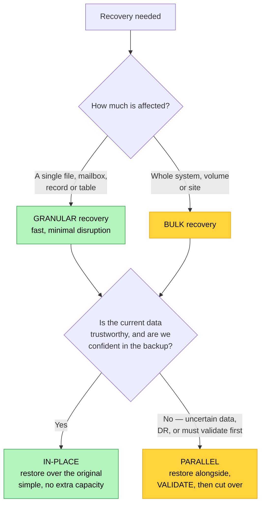

# Objective 3.3 — Given a scenario, use appropriate backup and recovery methods

> **Domain 3.0 — Operations (17% of exam)** · Exam CV0-004 V4 · Objectives doc v5.0
> **Status:** Exam-ready · **Version:** 2.0 (enhanced) · Supersedes `full notes/Objective-3.3-Backup-Recovery.md`

---

## 0. How to use this note

| Pass | What to read | Time |
|---|---|---|
| **1st (learn)** | Sections 1 → 10 in order | ~70 min |
| **2nd (drill)** | Section 3.4 (the restore maths) + Section 2.3 (3-2-1) + Section 8 (testing) | ~25 min |
| **3rd (test)** | Section 13 (practice) + Section 14 (PBQ drills) | ~30 min |
| **Exam eve** | Section 15 (60-second recall sheet) only | ~5 min |

> 📌 **The single most-tested item is the restore chain**: how many pieces you need to recover from full vs incremental vs differential. Section 3.4 works the arithmetic. If you learn one thing here, learn that.

---

## 1. Official objective coverage

> **3.3 Given a scenario, use appropriate backup and recovery methods.**
> - **Backup types** — Incremental · Full · Differential
> - **Backup locations** — On site · Off site
> - Schedule
> - Retention
> - Replication
> - Encryption
> - **Testing** — Recoverability · Integrity
> - **Recovery types** — In-place · Parallel
> - **Recovery options** — Bulk · Granular

### 1.1 What the verb tells you

**"Given a scenario, use appropriate…"** — an **application** objective, and one of the most PBQ-shaped in the exam. Expect to be given an RPO/RTO, a failure, or a compliance requirement and asked to select the backup type, location, schedule, and recovery method.

### 1.2 Coverage checklist

- [ ] I can define **full**, **incremental**, and **differential** and say what each backs up
- [ ] I can **count the restore pieces** for each type from a given schedule
- [ ] I know which type is fastest to **back up** and which is fastest to **restore**
- [ ] I know the **archive bit** behaviour of each
- [ ] I know the **3-2-1 rule**
- [ ] I know **replication is not backup** and why
- [ ] I know **schedule drives RPO** and location/type drive **RTO**
- [ ] I know **GFS** retention
- [ ] I know why losing the **encryption key** destroys the backup
- [ ] I can distinguish **recoverability** testing from **integrity** testing
- [ ] I can distinguish **in-place** from **parallel** recovery
- [ ] I can distinguish **bulk** from **granular** recovery
- [ ] I know **application-consistent** vs **crash-consistent** backups
- [ ] I know what makes a backup **ransomware-resistant**

---

## 2. The core mental model

### 2.1 What a backup is actually for

```text
   BACKUPS PROTECT AGAINST THINGS REDUNDANCY CANNOT

   ✓ Accidental deletion          ✓ Ransomware / malicious encryption
   ✓ Data corruption              ✓ Bad deployment or migration
   ✓ Malicious insider            ✓ Regulatory / legal retrieval
   ✓ Site or region loss

   ✗ HA, RAID, and REPLICATION do NOT protect against ANY of the
     first five — they faithfully copy the deletion or corruption
     to every replica within milliseconds.
```

### 2.2 Backup vs snapshot vs replication

| | **Backup** | **Snapshot** | **Replication** |
|---|---|---|---|
| What it is | Independent copy, retained | Point-in-time state of a volume | Continuous copy to another location |
| Independent of the source | ✅ **Yes** | ❌ Usually depends on the base disk | ❌ No — mirrors the source |
| Protects against deletion/corruption | ✅ **Yes** | Partially (if retained and separate) | ❌ **No — it copies the delete** |
| Protects against site loss | ✅ If off site | Only if replicated elsewhere | ✅ Yes |
| Typical RPO | Minutes–hours | Minutes | **Near zero** |
| Typical RTO | Slower (restore) | Fast | **Fastest (failover)** |
| Primary purpose | **Recoverability** | Fast rollback | **Availability / DR** |

> ★ **The most-repeated point in this objective: replication is not a backup.** It gives you availability and a low RPO, but it propagates every deletion, corruption, and ransomware encryption to the replica. You need **both**.

### 2.3 The 3-2-1 rule

```text
   ┌──────────────────────────────────────────────────────────────┐
   │   3   copies of the data (the original + 2 backups)          │
   │   2   different media types or storage systems               │
   │   1   copy OFF SITE                                          │
   └──────────────────────────────────────────────────────────────┘

   MODERN EXTENSION — 3-2-1-1-0
   ┌──────────────────────────────────────────────────────────────┐
   │  +1   copy IMMUTABLE or AIR-GAPPED (offline / WORM)          │
   │       → this is the ransomware control                       │
   │   0   errors — verified by TESTING the restore               │
   └──────────────────────────────────────────────────────────────┘
```

---

## 3. Backup types

### 3.1 The three types visually

```text
   Full backup Sunday. Data changes each weekday.

   FULL — copies EVERYTHING, every time
   SUN ████████████  MON ████████████  TUE ████████████
   Backup: SLOWEST, LARGEST · Restore: FASTEST (one piece, no chain)

   INCREMENTAL — copies changes since the LAST BACKUP OF ANY TYPE
   SUN ████████████  MON ██  TUE ██  WED ██  THU ██  FRI ██
       (full)         Δmon    Δtue    Δwed    Δthu    Δfri
   Backup: FASTEST, SMALLEST · Restore: SLOWEST (full + EVERY link)
   ⚠ Each day only holds that day's changes. Break one link and
     everything after it is unrecoverable.

   DIFFERENTIAL — copies changes since the last FULL backup
   SUN ████████████  MON ██  TUE ████  WED ██████  THU ████████
       (full)         Δmon   Δmon-tue  Δmon-wed   Δmon-thu
   Backup: GROWS each day · Restore: FAST (full + ONE differential)
   ⚠ By the end of the week a differential approaches the size of
     a full backup.
```

### 3.2 Full

| | |
|---|---|
| **Backs up** | **Everything** selected, regardless of what changed |
| **Backup speed / size** | **Slowest and largest** |
| **Restore** | **Fastest and simplest — one set, no dependencies** |
| **Archive bit** | **Clears it** |
| **Use when** | The baseline of any strategy; small datasets; when restore speed matters far more than backup cost |
| **Exam triggers** | "complete copy", "self-contained", "simplest restore", "weekly baseline" |

### 3.3 Incremental

| | |
|---|---|
| **Backs up** | Only what changed **since the last backup of any type** (full *or* incremental) |
| **Backup speed / size** | **Fastest and smallest** — minimal backup window and storage |
| **Restore** | **Slowest** — requires the full **plus every incremental in order** |
| **Archive bit** | **Clears it** |
| **★ Risk** | **Chain fragility** — one missing or corrupt link makes every later restore impossible |
| **Use when** | Backup window is tight, data volumes are large, storage cost matters, and a longer RTO is acceptable |
| **Exam triggers** | "smallest backup", "shortest backup window", "changes since the last backup", "minimise storage" |

### 3.4 ★ Differential — and the restore maths

| | |
|---|---|
| **Backs up** | Everything changed **since the last FULL backup** |
| **Backup speed / size** | **Medium, and grows** each day until the next full |
| **Restore** | **Fast — full + the single latest differential (two pieces)** |
| **Archive bit** | **Does NOT clear it** — this is why each differential keeps accumulating |
| **Use when** | You want a balance: quicker restores than incremental, smaller backups than full |
| **Exam triggers** | "changes since the last full", "restore needs only two sets", "balance backup and restore time" |

```text
   ★ THE CLASSIC EXAM CALCULATION

   Schedule: FULL on Sunday, then one backup each weekday.
   Failure occurs Thursday afternoon. How many sets to restore?

   WITH INCREMENTALS                    WITH DIFFERENTIALS
   ┌────────────────────────┐           ┌────────────────────────┐
   │ Sunday   FULL       ①  │           │ Sunday   FULL       ①  │
   │ Monday   incr       ②  │           │ Monday   diff       ✗  │
   │ Tuesday  incr       ③  │           │ Tuesday  diff       ✗  │
   │ Wednesday incr      ④  │           │ Wednesday diff      ✗  │
   │ Thursday incr       ⑤  │           │ Thursday diff       ②  │
   └────────────────────────┘           └────────────────────────┘
     5 SETS, in strict order              2 SETS ← faster, simpler
     Any one missing = FAILURE            Only the LATEST diff needed

   ★ THE TRADE-OFF IN ONE LINE
     INCREMENTAL  = fast backup,  slow restore, fragile chain
     DIFFERENTIAL = slower backup, fast restore, robust
     FULL         = slowest backup, fastest restore, most storage
```

### 3.5 Application-consistent vs crash-consistent

| | **Crash-consistent** | **Application-consistent** |
|---|---|---|
| How | Copies what is on disk at that instant — like pulling the power cord | Application is **quiesced**: in-flight writes flushed, buffers committed, then the copy is taken |
| In-flight transactions | May be lost or partial | **Captured cleanly** |
| On restore | The application/database may need to run recovery on start-up | Opens cleanly |
| Mechanism | Simple volume snapshot | Pre/post-freeze scripts, database-aware agents, OS shadow-copy services |
| Use for | Stateless servers, non-transactional file data | **Databases and transactional applications** |

> ⚠️ **A crash-consistent backup of a database may restore into a corrupt or unusable state.** If a scenario mentions a database or transactional integrity, the answer involves an **application-consistent** backup.

---

## 4. Backup locations

| | **On site** | **Off site** |
|---|---|---|
| Where | Same facility, region, or account as production | Different region, account, provider, or physical location |
| **Restore speed** | **Fast** — local, high bandwidth | Slower — network transfer, possibly archive retrieval |
| **Protects against** | Deletion, corruption, hardware failure | **All of that, plus site/region loss and account compromise** |
| Cost | Lower | Storage plus **egress** on restore |
| Weakness | ❌ **Destroyed with the site** — and reachable by ransomware that reached production | Retrieval time and cost |
| Typical role | Day-to-day operational recovery | **Disaster recovery and compliance** |

**The standard pattern:** keep a recent on-site copy for fast everyday restores **and** an off-site copy for disaster and ransomware protection — which is exactly what the 3-2-1 rule encodes.

> ★ **Ransomware raises the bar.** An off-site copy that production can still write to can be encrypted too. The control is **immutability (WORM/object lock)** or a genuine **air gap** — see Section 7.2.

---

## 5. Schedule and retention

### 5.1 Schedule — driven by RPO

```text
   ★ BACKUP FREQUENCY IS DETERMINED BY THE RPO

        RPO = 24 hours   →  daily backup
        RPO = 1 hour     →  hourly backup
        RPO = 15 minutes →  15-minute incrementals or log shipping
        RPO = 0          →  synchronous replication (NOT backup alone)

   Worst-case data loss = the interval between backups.
```

| Concept | Meaning |
|---|---|
| **Backup window** | The period in which backups may run without harming production. A backup that no longer fits its window is why incrementals exist |
| **Frequency** | Set by the RPO, not by convenience |
| **Full-backup cadence** | Periodic fulls reset the chain — weekly full + daily incrementals is the classic pattern |
| **Synthetic full** | The backup system **builds** a new full from the last full plus subsequent increments, without re-reading the source — full-restore speed without the full-backup window |
| **Incremental forever** | Only one initial full; the system synthesises restore points thereafter |

### 5.2 Retention — how long copies are kept

| Driver | Effect |
|---|---|
| **Compliance/regulatory** | Sets the **minimum** — often years (see 4.2) |
| **Legal hold** | Suspends deletion regardless of policy |
| **Operational need** | How far back you might realistically need to go |
| **Cost** | The counterweight — tier older backups to archive (see 1.4) |

**GFS — Grandfather-Father-Son**, the classic rotation:

```text
   SON          daily backups        kept ~7 days
   FATHER       weekly backups       kept ~4-5 weeks
   GRANDFATHER  monthly backups      kept ~12 months
                (+ yearly)           kept for the compliance period

   ★ Gives fine granularity recently and coarse granularity far back,
     without storing every daily backup forever.
```

> ⚠️ **Retention and archive tiers interact.** Moving old backups to an archive tier saves money but adds **hours of retrieval time** to any restore from them — and early deletion incurs minimum-retention charges (see 1.4, 1.8).

---

## 6. Replication

| | |
|---|---|
| **Definition** | Continuously copying data to another location as it changes. |
| **Synchronous** | Write acknowledged only when committed at both ends → **RPO = 0**, higher write latency, practical **within a region** |
| **Asynchronous** | Write acknowledged locally, copied after → **RPO > 0** (replica lag), lower latency, used **across regions** |
| **Gives you** | Availability, fast failover, low RTO and RPO, geographic redundancy |
| **★ Does NOT give you** | Protection from deletion, corruption, ransomware, or a bad deployment — **all are replicated faithfully** |
| **Exam triggers** | "continuous copy", "near-zero RPO", "failover to the replica", "geo-redundancy" |

```text
   ★ REPLICATION vs BACKUP — WHY YOU NEED BOTH

   09:00  Ransomware encrypts the production volume
   09:00  Replication copies the encrypted blocks to the replica
          → BOTH copies are now useless

   09:00  Last night's BACKUP is untouched, off site, immutable
          → this is the only thing that recovers you

   REPLICATION protects AVAILABILITY. BACKUP protects RECOVERABILITY.
```

---

## 7. Encryption

### 7.1 Where it applies

| | Requirement |
|---|---|
| **At rest** | Backup data encrypted in storage — commonly AES-256 |
| **In transit** | TLS while backups move to their destination |
| **Key management** | Provider-managed or customer-managed keys (see 4.x) |

### 7.2 The two things that get tested

```text
   ① ★ LOSE THE KEY, LOSE THE BACKUP
      An encrypted backup with no key is indistinguishable from
      random data. Keys must be:
        · backed up themselves, SEPARATELY from the data
        · escrowed with defined recovery custody
        · rotated without orphaning older backups
        · available in the DR region — a key that only exists in
          the failed region is no key at all

   ② IMMUTABILITY IS THE RANSOMWARE CONTROL
      Encryption stops someone READING your backup.
      It does NOT stop someone DELETING or ENCRYPTING it.
      For that you need:
        · WORM / object lock with a retention period (see 1.4)
        · a separate account/credentials from production
        · or a genuine AIR GAP (offline media)
      ★ Modern ransomware deliberately targets backups first.
```

---

## 8. Testing

**An untested backup is an assumption, not a capability.** CompTIA splits testing into two distinct checks:

| | **Recoverability testing** | **Integrity testing** |
|---|---|---|
| Question | "**Can** we restore it?" | "Is the restored data **correct and complete**?" |
| Proves | The process, media, credentials, keys, and documentation work | The data is uncorrupted and usable |
| Method | Perform an actual restore to a test environment | **Checksums/hashes**, record counts, application-level validation, opening the database |
| Fails when | Media unreadable, key missing, chain broken, runbook wrong, nobody knows how | Data restored but silently corrupt, truncated, or logically inconsistent |
| Also measures | **Actual RTO** — how long the restore really took | Whether the backup was application-consistent |

**Testing practices worth knowing:**

| Practice | Why |
|---|---|
| **Restore to an isolated environment** | Never test by restoring over production |
| **Test on a schedule**, not after an incident | The failure you find during an outage is the expensive one |
| **Measure the restore time** | Confirms the **RTO** is actually achievable |
| **Test the full DR scenario periodically** | Restoring one file proves little about recovering a whole system |
| **Verify the backup catalog/index** | Losing the catalogue can make otherwise-good backups unusable |
| **Validate after any change** | New schema, new encryption key, new tooling |

> ⚠️ **The two classic testing failures:** a backup job reporting success for months while writing nothing usable, and a restore that succeeds technically but produces a database that will not open because the backup was crash-consistent.

---

## 9. Recovery

### 9.1 Recovery types — in-place vs parallel

```text
   IN-PLACE RECOVERY                    PARALLEL RECOVERY
   restore OVER the original            restore ALONGSIDE the original

   ┌──────────────┐                     ┌──────────────┐ ┌──────────────┐
   │  PRODUCTION  │                     │  PRODUCTION  │ │   RESTORED   │
   │   (broken)   │ ◄── restore         │  (untouched) │ │     COPY     │
   │              │                     │              │ │              │
   └──────────────┘                     └──────────────┘ └──────┬───────┘
                                                                 │ validate
   ✓ Simple, no extra resources                                  ▼ then
   ✓ Original location and addresses                          cut over
   ✗ ★ DESTROYS the current state —                    ✓ Original preserved
     no going back if the backup                       ✓ VALIDATE before
     is bad                                              committing
   ✗ Downtime for the whole restore                    ✓ Enables side-by-side
   → routine, low-risk, confident                        comparison
                                                       ✗ Needs extra capacity
                                                       ✗ Cutover step required
                                                       → DR, uncertain data,
                                                         migrations, testing
```

| | **In-place** | **Parallel** |
|---|---|---|
| Restores to | The original location, overwriting | A **separate** environment |
| Original data | **Overwritten and gone** | **Preserved** |
| Validation before commit | ❌ No | ✅ **Yes** |
| Extra resources | None | Required |
| Risk | High — a bad backup destroys what was left | Low |
| Best for | Routine restores, confident recovery, simple failures | **DR**, uncertain data, testing, migrations, cutovers |

### 9.2 Recovery options — bulk vs granular

| | **Bulk** | **Granular** |
|---|---|---|
| Scope | Whole system, volume, or dataset | **Individual items** — a file, a mailbox, a table, a record |
| Speed | Slower — everything is restored | **Fast** — only what is needed |
| Disruption | High — usually service downtime | **Minimal** |
| Use for | Site loss, total corruption, DR, full rebuild | Accidental deletion, one corrupted file, single-user recovery |
| Requirement | — | The backup product must support **item-level indexing** |

> 💡 **Granular recovery is the everyday case.** Most real restores are "a user deleted one file" — restoring an entire file server for that is disproportionate and disruptive.

### 9.3 Choosing the method



---

## 10. Comparison tables

### 10.1 ★ The three backup types

| | **Full** | **Incremental** | **Differential** |
|---|---|---|---|
| Backs up | Everything | Changes since **the last backup of any type** | Changes since **the last full** |
| Backup time | **Slowest** | **Fastest** | Medium, **grows daily** |
| Storage used | **Most** | **Least** | Medium, grows |
| **Restore pieces** | **1** | **Full + ALL increments** | **Full + 1 (latest diff)** |
| Restore speed | **Fastest** | **Slowest** | Fast |
| Chain fragility | None | **High — one broken link fails everything after** | Low |
| Archive bit | **Clears** | **Clears** | **Does not clear** |
| Best when | Restore speed is critical | Backup window/storage is tight | Balanced requirement |

### 10.2 Where each concept fits RTO/RPO

| Decision | Primarily affects |
|---|---|
| **Backup frequency (schedule)** | **RPO** — worst-case data loss is the gap between backups |
| **Backup type** | **RTO** — how many pieces and how long to reassemble |
| **Backup location** | **RTO** — local restores are far faster than off-site or archive retrieval |
| **Storage tier** | **RTO** — archive retrieval can add hours (see 1.4) |
| **Recovery option (bulk/granular)** | **RTO** — restoring one file is minutes, a whole system is hours |
| **Replication** | **RPO and RTO** — but not recoverability from logical damage |

### 10.3 Threat → the control that actually helps

| Threat | Control |
|---|---|
| Instance or disk failure | RAID / replication / HA (see 1.2) |
| **Accidental deletion** | **Backup with retention**, or versioning |
| **Data corruption** | **Backup** — restore to a point before the corruption |
| **Ransomware** | **Immutable, off-site, credential-separated backup** (3-2-1-1-0) |
| Site or region loss | **Off-site backup** + DR site (see 1.2) |
| Regulatory retrieval | **Long-term retention**, often immutable |
| Bad deployment | Backup, or rollback (see 2.2) |
| Someone reads the backup media | **Encryption at rest** |

### 10.4 Scenario → method

| Scenario | Method |
|---|---|
| "A user deleted one spreadsheet" | **Granular, in-place** restore |
| "Region lost; rebuild elsewhere" | **Bulk, parallel** recovery from **off-site** backup |
| "Restore to verify before committing" | **Parallel** recovery |
| "Backup window is only two hours" | **Incremental** (smallest and fastest) |
| "Restores must be fast; storage is not a concern" | **Full**, or full + **differential** |
| "Balance backup size against restore speed" | **Differential** |
| "RPO of 15 minutes" | Backups/log shipping **every 15 minutes** |
| "Zero data loss" | **Synchronous replication** — plus backups for recoverability |
| "Keep 7 years, provably unaltered" | **Long retention + immutability (WORM)** in archive |
| "Ransomware encrypted production and the local backup" | **Immutable off-site copy** with separate credentials |
| "Backup of a transactional database" | **Application-consistent** backup |
| "Prove the backup actually works" | **Recoverability test** (restore) + **integrity check** (checksums) |

---

## 11. Exam traps & distractor patterns

| # | Trap | The truth |
|---|---|---|
| 1 | "Replication is a backup" | It **copies the deletion, corruption, and ransomware** too. Replication = availability; backup = recoverability. You need both |
| 2 | "Incremental restores are fast because the backups are small" | **Backwards.** Small backups, but restore needs the full **plus every increment in order** — the slowest and most fragile restore |
| 3 | "Differential backups only store yesterday's changes" | They store **everything since the last full**, so they grow daily |
| 4 | "Differential clears the archive bit" | It does **not** — that is precisely why it keeps accumulating. Full and incremental **do** clear it |
| 5 | "A weekly full plus daily differentials needs many sets to restore" | Only **two**: the full and the **latest** differential |
| 6 | "Encryption protects backups from ransomware" | Encryption stops someone **reading** it. It does not stop deletion or re-encryption — that needs **immutability or an air gap** |
| 7 | "The backup succeeded, so we are protected" | A green job status is not proof. Only a **test restore** proves recoverability |
| 8 | "Off-site backup alone defeats ransomware" | Not if production credentials can still write to it. It must be **immutable, air-gapped, or credential-separated** |
| 9 | "In-place recovery is always simplest, so prefer it" | It **destroys the current state** — if the backup turns out to be bad you have nothing. Use **parallel** when the data or backup is uncertain |
| 10 | "Snapshots are backups" | Snapshots usually **depend on the base volume** and live on the same storage — they are fast rollback, not independent copies |
| 11 | "Schedule affects RTO" | Schedule sets **RPO**. Type, location, tier, and scope drive **RTO** |
| 12 | "Archive-tier backups restore quickly" | Archive retrieval can take **hours** (see 1.4) — it can break the RTO |
| 13 | "Any backup of a database is fine" | A **crash-consistent** copy may restore into an unusable state. Databases need **application-consistent** backups |
| 14 | "Losing the encryption key is recoverable" | It is not. The backup becomes random data — keys need separate backup, escrow, and DR-region availability |
| 15 | "Longer retention is always better" | It costs money and expands legal exposure. Retention should meet the **compliance minimum** and the operational need |
| 16 | "Testing means checking the job log" | Testing means **restoring** (recoverability) **and validating the data** (integrity) |

**Disambiguation drill:**

| Pair | The deciding question |
|---|---|
| **Incremental vs differential** | Changes since the **last backup** (incremental) or since the **last full** (differential)? |
| **Backup vs replication** | Recover from a **mistake** (backup) or survive a **failure** (replication)? |
| **Snapshot vs backup** | Is it **independent** of the source, and retained separately? |
| **In-place vs parallel** | Do you need to **validate before committing**, or preserve the original? |
| **Bulk vs granular** | Is it **one item** or the **whole system**? |
| **Recoverability vs integrity** | **Can** we restore it, or is the restored data **correct**? |
| **On site vs off site** | Fast routine restore, or **survive losing the site**? |
| **Crash vs application-consistent** | Does the workload have **transactions**? |

---

## 12. Keyword → answer trigger table

| If you see… | Think |
|---|---|
| complete copy every time · simplest restore · one set | **Full** |
| smallest backup · shortest backup window · changes since the last backup | **Incremental** |
| changes since the last full · restore needs only two sets · grows each day | **Differential** |
| restore took five sets in strict order | **Incremental chain** |
| fast restore · local · everyday recovery | **On site** |
| survive losing the region · disaster recovery · compliance copy | **Off site** |
| how often do we back up · worst-case data loss | **Schedule → RPO** |
| how long do we keep them · daily/weekly/monthly rotation | **Retention → GFS** |
| keep 7 years, provably unaltered | **Retention + immutability (WORM)** |
| continuous copy · near-zero RPO · failover target | **Replication** (not a backup) |
| ransomware encrypted production *and* the backups | **Immutable / air-gapped off-site copy** |
| protect the backup from being read | **Encryption at rest** |
| the key was lost | **Backup unrecoverable — escrow keys separately** |
| can we actually restore it? | **Recoverability testing** |
| is the restored data correct and complete? | **Integrity testing (checksums)** |
| restore over the original | **In-place** |
| restore alongside, validate, then cut over | **Parallel** |
| one deleted file or mailbox | **Granular** |
| whole system or site rebuild | **Bulk** |
| database must restore cleanly | **Application-consistent backup** |
| three copies, two media, one off site | **3-2-1 rule** |

---

## 13. Practice questions

<details>
<summary><b>Q1.</b> A full backup runs Sunday and incremental backups run each weekday. A failure occurs Thursday afternoon. How many backup sets are required to restore?</summary>

A. 1 · B. 2 · C. 3 · **D. 5**

**Correct: D — five.** The Sunday full plus Monday, Tuesday, Wednesday, and Thursday incrementals, applied in order. Each incremental holds only that day's changes.
- **A wrong:** That is the full-backup-only case.
- **B wrong:** Two sets is the **differential** answer.
- **C wrong:** Undercounts the chain.
</details>

<details>
<summary><b>Q2.</b> The same schedule uses differential backups instead. How many sets are required?</summary>

A. 1 · **B. 2** · C. 4 · D. 5

**Correct: B — two.** The Sunday full plus **only the latest** (Thursday) differential, because each differential contains everything changed since the full.
- **A wrong:** The full alone loses the week's changes.
- **C/D wrong:** Intermediate differentials are not needed — only the most recent.
</details>

<details>
<summary><b>Q3.</b> Ransomware encrypts production data. Synchronous replication to a second region is in place. What is the outcome?</summary>

A. The replica is unaffected and can be failed over to · **B. The replica is also encrypted, because replication faithfully copies the change — recovery requires a backup** · C. Replication automatically reverts the change · D. Only the primary is affected because replication is one-way

**Correct: B.** Replication protects **availability**, not **recoverability**; it propagates the malicious encryption within milliseconds.
- **A/C/D wrong:** All misunderstand what replication does. This is the most-tested point in the objective.
</details>

<details>
<summary><b>Q4.</b> Which backup type has the SHORTEST backup window but the LONGEST restore time?</summary>

A. Full · **B. Incremental** · C. Differential · D. Synthetic full

**Correct: B — incremental.** It captures only the changes since the last backup of any type, making it fastest to write and slowest to reassemble.
- **A wrong:** Full is the opposite on both counts.
- **C wrong:** Differential sits between the two.
- **D wrong:** A synthetic full is constructed by the backup system to give full-restore speed.
</details>

<details>
<summary><b>Q5.</b> A user accidentally deletes one file from a 4 TB file server. What is the MOST appropriate recovery?</summary>

**A. Granular, in-place restore of that single file** · B. Bulk parallel restore of the entire server · C. Failover to the replica · D. Full system rebuild from the off-site copy

**Correct: A.** Item-level recovery restores just what is needed in minutes with no service disruption.
- **B wrong:** Restoring 4 TB for one file is disproportionate and disruptive.
- **C wrong:** The replica contains the same deletion.
- **D wrong:** Vastly more work than the situation requires.
</details>

<details>
<summary><b>Q6.</b> Which statement about the archive bit is CORRECT?</summary>

A. All three backup types clear it · **B. Full and incremental backups clear it; differential backups do not** · C. Only differential clears it · D. None of them clear it

**Correct: B.** Because differential backups leave the bit set, each one continues to include everything changed since the last full — which is why they grow.
- **A/C/D wrong:** Each misstates the behaviour that produces the differential's defining property.
</details>

<details>
<summary><b>Q7.</b> An organisation must recover a region-wide outage by rebuilding in a second region and validating before directing users to it. Which recovery type and option apply?</summary>

**A. Bulk recovery, parallel type** · B. Granular recovery, in-place type · C. Bulk recovery, in-place type · D. Granular recovery, parallel type

**Correct: A.** The whole environment is being restored (**bulk**) into a separate location so it can be validated before cutover (**parallel**).
- **B/D wrong:** Granular restores individual items.
- **C wrong:** There is no original environment to restore over — and in-place would prevent validation.
</details>

<details>
<summary><b>Q8.</b> What does the 3-2-1 backup rule specify?</summary>

**A. Three copies of the data, on two different media types, with one copy off site** · B. Three backups per day, two locations, one week retention · C. Three full backups, two differentials, one incremental · D. Three tests per year, two auditors, one report

**Correct: A.** The modern extension **3-2-1-1-0** adds one immutable or air-gapped copy and zero errors verified by testing.
- **B/C/D wrong:** None is the rule.
</details>

<details>
<summary><b>Q9.</b> A backup job has reported success nightly for six months. What proves the organisation can actually recover?</summary>

A. The job status log · B. The backup file sizes · **C. A test restore to an isolated environment, with the restored data validated** · D. The retention policy

**Correct: C.** Recoverability testing (can we restore?) plus integrity testing (is the data correct?) are the only proof. A green job status is not.
- **A/B wrong:** Both can look healthy while producing unusable backups.
- **D wrong:** Retention says how long copies are kept, not whether they work.
</details>

<details>
<summary><b>Q10.</b> What is the PRIMARY difference between recoverability testing and integrity testing?</summary>

A. They are the same · **B. Recoverability proves the restore process works; integrity proves the restored data is correct and uncorrupted** · C. Recoverability applies to files, integrity to databases · D. Integrity testing replaces the need to restore

**Correct: B.** CompTIA lists them separately because they fail independently — a restore can succeed while the data is silently corrupt.
- **A/C/D wrong:** Each misstates the split.
</details>

<details>
<summary><b>Q11.</b> An RPO of 15 minutes is required. What does this dictate?</summary>

A. Restores must complete within 15 minutes · **B. Backups, snapshots, or log shipping must occur at least every 15 minutes** · C. Retention must be 15 days · D. The backup window is 15 minutes

**Correct: B.** RPO is the maximum tolerable **data loss**, and worst-case loss equals the interval between recovery points.
- **A wrong:** That describes RTO.
- **C/D wrong:** Neither is what RPO defines.
</details>

<details>
<summary><b>Q12.</b> Backups are encrypted with a customer-managed key. The key is lost. What is the impact?</summary>

A. The provider can recover the data · **B. The backups are permanently unrecoverable — they are indistinguishable from random data** · C. Only the newest backups are affected · D. Integrity checks will restore access

**Correct: B.** This is why keys must be backed up separately, escrowed with defined custody, and available in the DR region.
- **A wrong:** With customer-managed keys the provider cannot decrypt.
- **C/D wrong:** All backups under that key are affected, and integrity checking does not decrypt.
</details>

<details>
<summary><b>Q13.</b> Ransomware encrypted production and also the on-site backup repository, which production servers could write to. What control would have prevented this?</summary>

A. Stronger encryption of the backups · **B. An off-site copy that is immutable (WORM/object lock) or air-gapped, with credentials separate from production** · C. More frequent incremental backups · D. Longer retention

**Correct: B.** Modern ransomware targets backups first. Immutability, credential separation, or a true air gap is the control — this is the "+1" of 3-2-1-1-0.
- **A wrong:** Encryption prevents reading, not deletion or re-encryption.
- **C/D wrong:** More or longer-retained backups in a writable location are equally vulnerable.
</details>

<details>
<summary><b>Q14.</b> A database is backed up with a simple volume snapshot while transactions are in flight. What risk does this create?</summary>

A. None; snapshots are always safe · **B. The backup is crash-consistent, so the database may require recovery on start-up or fail to open cleanly** · C. The snapshot cannot be encrypted · D. The RPO becomes zero

**Correct: B.** Transactional workloads need **application-consistent** backups, in which the application is quiesced and buffers flushed before the copy is taken.
- **A wrong:** Crash consistency is precisely the risk.
- **C/D wrong:** Neither follows.
</details>

<details>
<summary><b>Q15.</b> Which recovery type preserves the original data so it can be compared before committing?</summary>

A. In-place · **B. Parallel** · C. Bulk · D. Granular

**Correct: B — parallel.** The restore lands in a separate environment, is validated, and only then is traffic cut over.
- **A wrong:** In-place overwrites the original, leaving no fallback if the backup proves bad.
- **C/D wrong:** Those are recovery **options** (scope), not types.
</details>

<details>
<summary><b>Q16.</b> Which retention scheme keeps daily backups for a week, weekly for about a month, and monthly for a year?</summary>

A. 3-2-1 · **B. Grandfather-Father-Son (GFS)** · C. Incremental forever · D. Synthetic full

**Correct: B — GFS.** It provides fine granularity for recent data and coarse granularity further back, without storing every daily backup indefinitely.
- **A wrong:** 3-2-1 concerns copies, media, and location.
- **C/D wrong:** Both are backup-generation techniques, not retention schemes.
</details>

<details>
<summary><b>Q17.</b> Backups older than 90 days are moved to an archive storage tier to reduce cost. What is the operational consequence?</summary>

A. Backups become immutable automatically · **B. Restores from those backups may take hours to retrieve, which must be reflected in the RTO** · C. Integrity is lost · D. Retention is shortened

**Correct: B.** Archive tiers trade retrieval latency for low storage cost (see 1.4) — the RTO for older restores must account for it.
- **A wrong:** Immutability is a separate setting.
- **C/D wrong:** Neither follows from tiering.
</details>

<details>
<summary><b>Q18.</b> Which backup strategy minimises the nightly backup window on a large dataset while accepting a longer restore?</summary>

A. Nightly full backups · **B. Weekly full plus nightly incrementals** · C. Nightly differentials only · D. Continuous synchronous replication

**Correct: B.** Incrementals capture the least data and complete fastest, at the cost of a longer, chain-dependent restore.
- **A wrong:** Nightly fulls maximise the window.
- **C wrong:** Differentials grow daily, lengthening the window as the week progresses — and they require a periodic full anyway.
- **D wrong:** Replication is not a backup.
</details>

<details>
<summary><b>Q19.</b> Which statement about snapshots versus backups is CORRECT?</summary>

A. They are equivalent · **B. Snapshots typically depend on the base volume and reside on the same storage, so they are fast rollback points rather than independent copies** · C. Snapshots are always off site · D. Backups cannot be automated

**Correct: B.** A snapshot chain lost with its underlying storage protects nothing — that is why an independent, retained, off-site copy is still required (see 1.7).
- **A/C/D wrong:** Each is inaccurate.
</details>

<details>
<summary><b>Q20.</b> Which factor MOST directly determines the RPO?</summary>

**A. How frequently backups or recovery points are created** · B. How long a restore takes · C. Whether recovery is bulk or granular · D. The encryption algorithm

**Correct: A.** Worst-case data loss equals the interval between recovery points.
- **B/C wrong:** Both affect **RTO**.
- **D wrong:** Encryption affects confidentiality, not the recovery point.
</details>

<details>
<summary><b>Q21.</b> A backup system builds a new full backup from the previous full plus subsequent incrementals, without re-reading the source. What is this called?</summary>

A. Differential backup · **B. Synthetic full backup** · C. Bulk recovery · D. Replication

**Correct: B — synthetic full.** It gives the restore simplicity of a full backup without imposing a full backup window on production.
- **A wrong:** A differential reads changed data from the source.
- **C/D wrong:** Neither is a backup-generation technique.
</details>

<details>
<summary><b>Q22.</b> Which combination BEST meets "recover a deleted record quickly, and survive losing the entire region"?</summary>

**A. Granular recovery from an on-site copy, plus an off-site copy for regional disaster** · B. Bulk recovery only, off site · C. Replication only · D. On-site backups only

**Correct: A.** The two requirements need different things: speed and item-level scope for everyday restores, geographic separation for disaster — which is what 3-2-1 encodes.
- **B wrong:** Bulk recovery for one record is disproportionate.
- **C wrong:** Replication copies the deletion.
- **D wrong:** On-site copies die with the region.
</details>

<details>
<summary><b>Q23.</b> Why should restores be tested to an isolated environment rather than over production?</summary>

**A. A test that overwrites production destroys current data and risks an outage if the backup is faulty** · B. Isolated restores are faster · C. Production cannot be restored to · D. Integrity checks only work in isolation

**Correct: A.** Testing must not create the incident it is meant to prevent — this is the same logic as preferring parallel recovery when confidence is low.
- **B/C/D wrong:** None is the reason.
</details>

<details>
<summary><b>Q24.</b> An organisation must retain financial records for seven years and prove they were never altered. What is required?</summary>

A. Replication to a second region · B. Nightly incrementals with 7-year retention on standard storage · **C. Long-term retention in archive storage with WORM/object lock and a defined retention period** · D. Encryption alone

**Correct: C.** Retention satisfies the duration; **immutability** satisfies the "never altered" requirement; archive tiering controls the cost over seven years (see 1.4, 4.2).
- **A wrong:** Replication provides neither retention nor immutability.
- **B wrong:** Meets duration but not tamper-evidence, and is costly.
- **D wrong:** Encryption prevents reading, not alteration or deletion.
</details>

<details>
<summary><b>Q25.</b> Which sequence correctly orders a well-run recovery from an uncertain backup?</summary>

A. Restore in place, then validate · **B. Restore in parallel, validate the data and application, then cut over** · C. Cut over first, then restore · D. Delete production, then restore

**Correct: B.** Parallel recovery preserves the original and allows validation before committing — the safe order when either the data or the backup is uncertain.
- **A wrong:** In-place has already destroyed the fallback by the time you validate.
- **C/D wrong:** Both are unsafe.
</details>

---

## 14. PBQ-style drills

### Drill A — Count the restore sets

Full backup Sunday; one backup each weekday. State how many sets are needed to restore after a Friday-evening failure.

| # | Weekday backup type | Sets? |
|---|---|---|
| 1 | Incremental | |
| 2 | Differential | |
| 3 | Full every day | |

<details><summary>Answers</summary>

1 → **6** — Sunday full + Mon, Tue, Wed, Thu, Fri incrementals, in strict order
2 → **2** — Sunday full + Friday differential only
3 → **1** — Friday's full alone

**The trade-off:** the incremental schedule wrote the least data each night; the full schedule wrote the most. Restore effort is exactly inverted.
</details>

### Drill B — Match the requirement

| # | Requirement | Method? |
|---|---|---|
| 1 | Backup window is 90 minutes for 20 TB | |
| 2 | Restore must complete as fast as possible | |
| 3 | One deleted mailbox item | |
| 4 | Region destroyed; rebuild and verify before go-live | |
| 5 | Prove backups have not been altered for 5 years | |
| 6 | Zero data loss for a transactional system | |
| 7 | Transactional database backup that opens cleanly | |

<details><summary>Answers</summary>

1 → **Incremental** · 2 → **Full** (or full + latest differential) · 3 → **Granular, in-place** · 4 → **Bulk, parallel, from off-site** · 5 → **Immutable retention (WORM) in archive** · 6 → **Synchronous replication** *plus* backups for recoverability · 7 → **Application-consistent backup**
</details>

### Drill C — Which control for which threat?

| # | Threat | Control? |
|---|---|---|
| 1 | Disk fails in a server | |
| 2 | Admin deletes a production table | |
| 3 | Ransomware encrypts production and the writable backup share | |
| 4 | Entire region goes offline | |
| 5 | Someone steals a backup tape | |
| 6 | Silent data corruption discovered weeks later | |

<details><summary>Answers</summary>

1 → **RAID / replication / HA** — not a backup problem
2 → **Backup with retention** (replication would copy the delete)
3 → **Immutable or air-gapped off-site copy with separate credentials** (3-2-1-1-0)
4 → **Off-site backup + DR site**
5 → **Encryption at rest**
6 → **Retention long enough to reach a clean point** + **integrity testing** to have detected it earlier
</details>

### Drill D — Design the strategy

A transactional database has RPO 15 minutes, RTO 2 hours, a 7-year compliance retention, and a ransomware concern. Outline the strategy.

<details><summary>Answer</summary>

- **Schedule:** transaction-log backups every **15 minutes** (meets RPO); weekly full + daily differentials for the base
- **Type:** **application-consistent** (database-aware, quiesced) — a crash-consistent copy risks an unusable restore
- **Location:** on-site copy for fast restores **plus** off-site copy — 3-2-1
- **RTO 2 hours:** favour **full + latest differential** over long incremental chains; keep recent backups in a **fast tier**, not archive
- **Retention:** GFS rotation, with monthly/yearly copies tiered to **archive** for the 7 years
- **Ransomware:** at least one copy **immutable (WORM/object lock)** with **credentials separate from production**
- **Encryption:** at rest and in transit, with keys **escrowed and available in the DR region**
- **Testing:** scheduled **restore tests** (recoverability, and measure actual RTO) plus **checksum/application validation** (integrity)
</details>

---

## 15. 60-second recall sheet

```text
╔══════════════════════════════════════════════════════════════════════╗
║  3.3 — BACKUP AND RECOVERY                                           ║
╠══════════════════════════════════════════════════════════════════════╣
║  ★ THE THREE TYPES — and the RESTORE COUNT                           ║
║   FULL          everything · slowest backup, MOST storage            ║
║                 → RESTORE = 1 SET, fastest, no chain                 ║
║   INCREMENTAL   changes since the LAST BACKUP (any type)             ║
║                 fastest backup, LEAST storage                        ║
║                 → RESTORE = FULL + EVERY INCREMENT, in order         ║
║                 ⚠ one broken link kills everything after it          ║
║   DIFFERENTIAL  changes since the LAST FULL · grows daily            ║
║                 → RESTORE = FULL + LATEST DIFF ONLY = 2 SETS         ║
║   ARCHIVE BIT: full CLEARS · incremental CLEARS · diff does NOT      ║
╠══════════════════════════════════════════════════════════════════════╣
║  ★ REPLICATION IS NOT A BACKUP — it copies the DELETE, the           ║
║    CORRUPTION and the RANSOMWARE. Availability ≠ recoverability.     ║
║  BACKUP = independent, retained · SNAPSHOT = fast rollback, usually  ║
║    depends on the base volume · REPLICATION = continuous mirror      ║
╠══════════════════════════════════════════════════════════════════════╣
║  3-2-1 RULE   3 copies · 2 media · 1 OFF SITE                        ║
║    3-2-1-1-0  +1 IMMUTABLE/AIR-GAPPED (the ransomware control)       ║
║               +0 errors — VERIFIED BY TESTING                        ║
║  ON SITE  fast restore, dies with the site │ OFF SITE  survives      ║
║    disaster, slower, egress cost                                     ║
╠══════════════════════════════════════════════════════════════════════╣
║  SCHEDULE  → sets the RPO (worst-case loss = gap between backups)    ║
║  TYPE/LOCATION/TIER/SCOPE → set the RTO                              ║
║  RETENTION → GFS: daily(son) ~7d · weekly(father) ~4w ·              ║
║              monthly(grandfather) ~12m · compliance sets the FLOOR   ║
║  ⚠ ARCHIVE TIER restores take HOURS — factor into the RTO            ║
╠══════════════════════════════════════════════════════════════════════╣
║  ENCRYPTION  at rest + in transit · ★ LOSE THE KEY = LOSE THE BACKUP ║
║    → escrow keys SEPARATELY and make them available in the DR region ║
║    ⚠ Encryption stops READING, not DELETING → immutability for that  ║
╠══════════════════════════════════════════════════════════════════════╣
║  ★ TESTING — an untested backup is an ASSUMPTION                     ║
║   RECOVERABILITY  "CAN we restore?"  → do an actual restore,         ║
║                    to an ISOLATED environment, and MEASURE THE RTO   ║
║   INTEGRITY       "Is the data CORRECT?" → checksums, record counts, ║
║                    open the database                                 ║
║  APPLICATION-CONSISTENT (quiesced) vs CRASH-CONSISTENT (power-pull)  ║
║   → databases and transactional apps NEED application-consistent     ║
╠══════════════════════════════════════════════════════════════════════╣
║  RECOVERY TYPE    IN-PLACE  over the original — simple but           ║
║                             ★ DESTROYS the current state            ║
║                   PARALLEL  alongside → VALIDATE → cut over          ║
║                             → DR, uncertain data, migrations         ║
║  RECOVERY OPTION  BULK  whole system/site │ GRANULAR  one file,      ║
║                   mailbox, record — the everyday case                ║
╚══════════════════════════════════════════════════════════════════════╝
```

---

## 16. Cross-references

| Related objective | Connection |
|---|---|
| **1.2 Service availability** | **RTO and RPO** are defined there and drive every decision here; hot/warm/cold sites are the DR counterpart |
| **1.4 Storage** | Backup targets and tiers; **archive retrieval time** affects RTO; **object lock/WORM** provides immutability; snapshots are incremental |
| **1.7 Virtualization** | VM snapshots are **not** backups — they depend on the base disk and long chains degrade performance |
| **1.8 Cost considerations** | Retention and tiering are the cost levers; minimum-retention charges apply to archive tiers |
| **1.9 Database concepts** | **PITR** (backups + transaction logs) is how databases achieve a low RPO; application-consistent backups matter most here |
| **2.2 Deployment strategies** | Backups are the fallback when a deployment rollback is impossible |
| **3.1 Observability** | Monitor backup job success **and** test-restore results — a green job log is not proof |
| **3.4 Resource lifecycle** | Decommissioning must consider retention obligations before data is destroyed |
| **4.2 Compliance** | Retention periods, legal hold, and immutability requirements originate here |
| **4.4 / 4.6 Security** | Encryption, key management, and ransomware defence |
| **6.x Troubleshooting** | Failed restores, broken incremental chains, missing keys, and crash-consistent database backups are recurring faults |

> 🔑 **Carry this forward:** decide **frequency from the RPO**, **type and location from the RTO**, **retention from compliance**, and then **prove all of it with a test restore**. Everything else in this objective follows from those four.

---

*Source of truth: CompTIA Cloud+ CV0-004 V4 Exam Objectives, document version 5.0. The 3-2-1 rule and GFS rotation are long-standing industry conventions included as supporting context. Product names are illustrative; the exam is vendor-neutral.*
