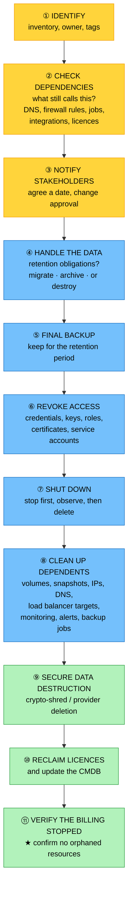

# Objective 3.4 — Given a scenario, manage the life cycle of cloud resources

> **Domain 3.0 — Operations (17% of exam)** · Exam CV0-004 V4 · Objectives doc v5.0
> **Status:** Exam-ready · **Version:** 2.0 (enhanced) · Supersedes `full notes/Objective-3.4-Resource-Lifecycle.md`

---

## 0. How to use this note

| Pass | What to read | Time |
|---|---|---|
| **1st (learn)** | Sections 1 → 8 in order | ~55 min |
| **2nd (drill)** | Section 2.2 (semantic versioning) + 7.1 (EOL vs EOS) + 7.2 (decommissioning checklist) | ~20 min |
| **3rd (test)** | Section 11 (practice) + Section 12 (PBQ drills) | ~30 min |
| **Exam eve** | Section 13 (60-second recall sheet) only | ~4 min |

> 📌 **Final objective of Domain 3.** Two things carry the marks: telling **patch / minor / major** apart (semantic versioning makes this mechanical), and telling **EOL apart from EOS** — the second of which is the one with the security and compliance consequence.

---

## 1. Official objective coverage

> **3.4 Given a scenario, manage the life cycle of cloud resources.**
> - Patches
> - **Updates**
>   - Major
>   - Minor
> - Testing
> - **Data**
>   - Ephemeral
>   - Persistent
> - **Decommissioning**
>   - End of life
>   - End of support

### 1.1 What the verb tells you

**"Given a scenario, manage"** — an **application** objective covering the *routine, planned* work of keeping resources healthy from provisioning to retirement.

> ⚠️ **Scope boundary.** This objective is **not** vulnerability scanning, CVE assessment, or remediation prioritisation — that is **4.1**. Here, patching is a *maintenance* activity, not a *security-response* activity.

### 1.2 Coverage checklist

- [ ] I can distinguish a **patch**, a **minor update**, and a **major update**
- [ ] I know **semantic versioning** (`MAJOR.MINOR.PATCH`) and what each position signals
- [ ] I know **major updates remove**, **minor updates deprecate**
- [ ] I know **in-place patching** vs **immutable replacement** and which is cloud-native
- [ ] I know what **staged rollout rings** are for
- [ ] I can distinguish **ephemeral** from **persistent** data and place a workload's data correctly
- [ ] I know **EOL** and **EOS** and **which one is the security cliff**
- [ ] I can list the steps of a safe **decommissioning**
- [ ] I know why **orphaned resources** matter
- [ ] I know how data is securely destroyed in the cloud (**crypto-shredding**)

---

## 2. The core mental model

### 2.1 The resource lifecycle

```text
        ┌──────────────┐
        │  ① PROVISION │  build from code (2.4/2.5), tag it (1.8)
        └──────┬───────┘
               ▼
        ┌──────────────┐
        │  ② OPERATE   │  monitor (3.1), scale (3.2), back up (3.3)
        └──────┬───────┘
               ▼
        ┌──────────────┐
        │  ③ MAINTAIN  │  ★ PATCH → MINOR → MAJOR
        │              │    each preceded by TESTING
        └──────┬───────┘
               │  ◄── loops for the resource's working life
               ▼
        ┌──────────────┐
        │④ DECOMMISSION│  triggered by EOL/EOS or business need
        └──────────────┘    retain or destroy data · reclaim licences
                            · remove access · stop the billing

   ★ THE FAILURE MODE AT EACH END
     Skip ③ → you drift onto unsupported, unpatchable software
     Skip ④ → ORPHANED RESOURCES that bill forever and stay
              unpatched (a cost problem AND a security problem)
```

### 2.2 ★ Semantic versioning makes patch/minor/major mechanical

```text
                    MAJOR . MINOR . PATCH
                      │       │       │
                      │       │       └─ backward-compatible BUG FIXES
                      │       │          low risk · frequent · automate
                      │       │
                      │       └───────── backward-compatible NEW FEATURES
                      │                  medium risk · test first
                      │                  ⚠ DEPRECATES old things (warns)
                      │
                      └───────────────── BREAKING CHANGES
                                         high risk · project-level
                                         ⚠ REMOVES deprecated things

   14.4  →  14.6   = PATCH/MINOR level  → routine, low risk
   14.x  →  15.0   = MAJOR              → plan, test, migrate, sign off

   ★ THE RULE THAT ANSWERS THE QUESTION
     MINOR versions DEPRECATE (warn you something will go away).
     MAJOR versions REMOVE it. That is why majors break things.
```

### 2.3 Risk and frequency

```text
   FREQUENCY ▲
             │  ●  PATCH        frequent · low risk · automate
             │
             │       ●  MINOR   periodic · medium risk · test in staging
             │
             │            ●  MAJOR  rare · HIGH risk · project, rollback
             │                       plan, stakeholder sign-off
             └──────────────────────────────────────► RISK / EFFORT

   ★ The amount of testing should scale with the risk, and so
     should the size of the rollout rings.
```

---

## 3. Patches

| | |
|---|---|
| **Definition** | A small, targeted fix for a specific bug, security flaw, or performance problem **within the existing version**. Also called a hotfix, security update, service pack, or rollup. |
| **Version impact** | Changes the **PATCH** position only — you stay on the same release |
| **Risk** | **Low** — but not zero; patches have broken production before |
| **Cadence** | Frequent; security patches may be out-of-band and urgent |
| **★ Responsibility** | Under the shared responsibility model (1.1), the **customer patches the guest OS and applications in IaaS**; the provider patches the platform in PaaS/FaaS/SaaS |
| **Exam triggers** | "security fix", "no version change", "apply to the fleet", "patch Tuesday", "hotfix", "keep systems current" |

### 3.1 Two ways to patch — and which is cloud-native

```text
   IN-PLACE PATCHING                  IMMUTABLE REPLACEMENT
   patch the running servers          build a NEW image, replace them

   ┌────┐ ┌────┐ ┌────┐               ┌────┐ ┌────┐ ┌────┐
   │ v1 │ │ v1 │ │ v1 │  ── patch ──► │ v1'│ │ v1'│ │ v1'│
   └────┘ └────┘ └────┘   in place    └────┘ └────┘ └────┘

                                      ┌──────────────┐
                                      │ GOLDEN IMAGE │ ← patch here once
                                      │   (baked)    │
                                      └──────┬───────┘
                                             ▼ replace instances
                                      ┌────┐ ┌────┐ ┌────┐
                                      │ v2 │ │ v2 │ │ v2 │
                                      └────┘ └────┘ └────┘

   ✓ Simple, no re-deploy              ✓ NO CONFIGURATION DRIFT (2.4)
   ✓ Works for stateful systems        ✓ Every instance provably identical
   ✗ Causes CONFIGURATION DRIFT        ✓ Rollback = redeploy the old image
     over time — servers diverge       ✓ Tests the build path every time
   ✗ Failed patch is hard to undo      ✗ Requires stateless design (1.5)
   ✗ Each server patched separately    ✗ Longer initial pipeline

   ★ IMMUTABLE REPLACEMENT is the cloud-native answer, and it uses
     the deployment strategies from 2.2 (rolling, blue-green, canary).
```

### 3.2 The patch management process

```text
   ① IDENTIFY   know what you run — an accurate INVENTORY is the
      ↓         prerequisite. You cannot patch what you do not know about
   ② ASSESS     severity, applicability, and urgency. Does it affect us?
      ↓
   ③ TEST       apply in a non-production environment first
      ↓
   ④ DEPLOY     in RINGS, during a maintenance window, with a
      ↓         rollback plan
   ⑤ VERIFY     confirm the patch applied AND the service still works
      ↓
   ⑥ DOCUMENT   record what was applied, where, and when — for audit
```

**Staged rollout rings** limit blast radius:

```text
   RING 0        RING 1         RING 2          RING 3
   ┌───────┐     ┌────────┐     ┌──────────┐    ┌────────────┐
   │  dev  │ ──► │  test  │ ──► │ a subset │ ──►│ everything │
   │       │     │/staging│     │ of prod  │    │    else    │
   └───────┘     └────────┘     └──────────┘    └────────────┘
                                  ↑ canary — soak here before
                                    committing to the fleet (2.2)
```

---

## 4. Updates

### 4.1 Minor updates

| | |
|---|---|
| **Definition** | **Backward-compatible** new features and improvements **within the same major version**. |
| **Version impact** | The **MINOR** position changes (`14.4 → 14.6`, `1.28 → 1.29`) |
| **Risk** | **Medium** — usually safe, but still test |
| **★ Key behaviour** | **Deprecates** — old features are flagged as going away but **still work**. This is your warning window before the next major |
| **Approach** | Test in staging, then roll out in rings; track which version each environment runs |
| **Exam triggers** | "backward compatible", "new features, nothing breaks", "same major version", "deprecation warnings appeared" |

### 4.2 Major updates

| | |
|---|---|
| **Definition** | **Breaking changes** — significant new architecture, changed or removed APIs, altered defaults, sometimes data-format migrations. |
| **Version impact** | The **MAJOR** position changes (`14.x → 15.0`, `Java 8 → Java 21`) |
| **Risk** | **Highest** |
| **★ Key behaviour** | **Removes** what earlier minors deprecated — which is exactly why things break |
| **Approach** | Treat as a **project**: compatibility assessment, dependency review, a **parallel environment** (2.2), full regression testing, data migration plan, stakeholder sign-off, and a **tested rollback** |
| **★ The strategic trap** | Deferring majors indefinitely eventually strands you on **unsupported software you can no longer patch** — turning a planned upgrade into a forced, rushed one |
| **Exam triggers** | "breaking changes", "API removed", "requires migration", "recompile", "major version upgrade", "significant re-testing" |

---

## 5. Testing

| | |
|---|---|
| **Definition** | Validating that a patch, update, or configuration change works **before it reaches production users** — and confirming that a rollback path exists. |
| **Why the cloud raises the bar** | Cloning a production-like environment is cheap and fast, so "we had no test environment" is no longer a defensible reason to test on live users |
| **Exam triggers** | "validate before production", "staging environment", "regression test", "rollback plan", "canary", "maintenance window" |

| Test type | What it checks |
|---|---|
| **Smoke test** | Does it start and serve basic requests at all? |
| **Regression test** | Did the change break anything that previously worked? |
| **Integration test** | Do the dependent systems still interoperate? |
| **Performance test** | Has latency or throughput degraded? |
| **User acceptance (UAT)** | Does it meet the business requirement? |
| **Canary / staged rollout** | Does it behave under **real** traffic on a small slice? (2.2) |
| **Rollback test** | ★ Can we actually go back? Untested rollback is an assumption |

> ⚠️ **Test the rollback, not just the change.** The most expensive maintenance failures are the ones where the update broke production *and* the rollback had never been exercised. Same principle as backup testing in 3.3.

---

## 6. Data — ephemeral and persistent

| | **Ephemeral** | **Persistent** |
|---|---|---|
| Lifetime | Tied to the process, container, or instance | **Independent** of any compute resource |
| Survives stop/terminate | ❌ **No — data is gone** | ✅ **Yes** |
| Examples | Instance store, `/tmp`, swap, in-memory cache, container writable layer, `emptyDir` | Network block volumes, file shares, object storage, managed databases |
| Performance | **Fastest** (local, no network hop) | Slightly slower (network-attached) |
| Cost | Effectively free (included) | Charged per GB |
| Use for | Scratch, temp files, caches, buffers, intermediate results | **Anything you cannot recompute or afford to lose** |
| Backed up | ❌ Not directly | ✅ Snapshots and backups (3.3) |

```text
   ★ THE PLACEMENT RULE

   Can you REGENERATE it cheaply?      → EPHEMERAL is fine
   Would losing it hurt the business?  → PERSISTENT, and back it up

   THE CLASSIC FAILURE
   A database or user uploads written to instance store or a
   container's writable layer. It works perfectly — until the
   instance is stopped, rescheduled, or scaled in, and every
   record is gone.
```

> 💡 **This is the same rule as 1.5's statelessness and 1.6's persistent volumes.** Externalising state is what makes instances disposable — which is what makes scaling (3.2), immutable patching, and self-healing possible. Ephemeral-by-default is a *feature*, provided the important data lives elsewhere.

---

## 7. Decommissioning

### 7.1 ★ End of life vs end of support

```text
   VENDOR PRODUCT TIMELINE

   ──────────────┬──────────────────┬──────────────────┬──────────►
       ACTIVE    │   EOL announced  │  END OF LIFE     │ END OF
       SUPPORT   │   (advance       │  (EOL)           │ SUPPORT
                 │    notice)       │                  │ (EOS/EOSL)
                 │                  │                  │
                 │                  │ no longer SOLD   │ ★ NO MORE
                 │                  │ or actively      │   SECURITY
                 │                  │ DEVELOPED        │   PATCHES
                 │                  │                  │
                 │                  │ support often    │ ⚠ THE CLIFF
                 │                  │ CONTINUES        │
   ◄─── plan and migrate in this window ───────────────►
                                                        ▲
                        ★ EOS is the date that matters ─┘
                          for SECURITY and COMPLIANCE
```

| | **End of life (EOL)** | **End of support (EOS / EOSL)** |
|---|---|---|
| Meaning | Vendor stops **selling and developing** it | Vendor stops **supporting and patching** it |
| New features | ❌ Stopped | ❌ Stopped |
| Security patches | ✅ Usually still provided | ❌ **None — this is the security cliff** |
| Vendor support | ✅ Usually still available | ❌ None (or paid extended support) |
| Your risk | Planning risk — start migrating | **Unpatchable known vulnerabilities** |
| Compliance | Generally acceptable | ⚠️ **Frameworks such as PCI DSS require supported software** — running past EOS can fail an audit |

> ★ **The distinction in one line: EOL means you can no longer buy it; EOS means you can no longer secure it.** EOL is the warning; **EOS is the deadline**. Extended support may be purchasable to buy time, but it is a stopgap, not a plan.

### 7.2 The decommissioning process

Retiring a resource is not "delete the VM" — doing that alone leaves data, cost, and security exposure behind.



**The two most-missed steps:**

| Step | Why it is missed, and what it costs |
|---|---|
| **⑧ Clean up dependents** | Deleting an instance leaves **unattached volumes, snapshots, unassociated IPs, stale DNS records, load balancer targets, and monitoring alerts**. These bill indefinitely (1.8) and generate noise (3.1) |
| **⑪ Verify billing stopped** | The only proof the decommission actually completed. **Orphaned resources are the most common source of cloud waste** |

### 7.3 Secure data destruction in the cloud

You cannot physically shred a disk you do not own, so cloud sanitisation works differently:

| Method | How it works |
|---|---|
| **★ Crypto-shredding** | Data was encrypted at rest; **destroy the key** and the ciphertext is permanently unrecoverable. The standard cloud approach |
| **Provider deletion guarantees** | The provider's documented process for wiping and reusing media — part of their side of shared responsibility (1.1) |
| **Overwriting** | Possible on block storage but often unnecessary given encryption |
| **Retention holds first** | ⚠️ **Check legal hold and retention obligations before destroying anything** (3.3, 4.2) |

> ⚠️ **Decommissioning has a compliance dimension in both directions:** destroying data too *early* can breach a retention requirement or legal hold; keeping it too *long* can breach a data-minimisation requirement. Check obligations before you delete.

---

## 8. Comparison tables

### 8.1 ★ Patch vs minor vs major

| | **Patch** | **Minor update** | **Major update** |
|---|---|---|---|
| Version position | `x.y.**Z**` | `x.**Y**.z` | `**X**.y.z` |
| Contains | Bug and security fixes | Backward-compatible features | **Breaking changes** |
| Backward compatible | ✅ Yes | ✅ Yes | ❌ **No** |
| Deprecates / removes | Neither | **Deprecates** (warns) | **Removes** |
| Risk | **Low** | Medium | **High** |
| Frequency | Frequent | Periodic | Rare |
| Testing needed | Automated smoke/regression | Staging + regression | **Full project: compatibility, parallel env, UAT, sign-off** |
| Rollback | Straightforward | Straightforward | **Complex — may involve data migration** |
| Typical approach | Automate | Scheduled rings | Planned project with a maintenance window |

### 8.2 Ephemeral vs persistent

| | **Ephemeral** | **Persistent** |
|---|---|---|
| Survives instance stop | ❌ | ✅ |
| Survives termination | ❌ | ✅ |
| Survives reschedule | ❌ | ✅ |
| Backed up | ❌ | ✅ |
| Speed | **Fastest** | Slightly slower |
| Cost | Included | Per GB |
| Right for | Cache, scratch, temp, buffers | **Databases, uploads, business records** |

### 8.3 EOL vs EOS

| | **End of life** | **End of support** |
|---|---|---|
| Vendor still sells it | ❌ | ❌ |
| Vendor still develops it | ❌ | ❌ |
| **Security patches** | ✅ Usually | ❌ **No** |
| Technical support | ✅ Usually | ❌ (or paid extended) |
| Safe to run? | Temporarily, while migrating | ⚠️ **No — unpatchable** |
| Compliance impact | Low | **High — can fail an audit** |
| Your action | **Plan and budget the migration** | **Migrate now, or buy extended support as a stopgap** |

### 8.4 Scenario → lifecycle action

| Scenario | Action |
|---|---|
| "Security fix released, no version change" | **Patch** — test, then roll out in rings |
| "New features, same major version, nothing breaks" | **Minor update** |
| "API removed, requires recompilation" | **Major update** — project with parallel environment |
| "Deprecation warnings started appearing" | A **minor update** warned you; a **major** will remove it |
| "Servers have drifted apart over years of patching" | **Immutable replacement** from a golden image (2.4) |
| "Vendor stops issuing security patches in 6 months" | **EOS** — migrate before that date |
| "Product no longer sold but still supported" | **EOL** — begin planning |
| "Temp files during a batch job" | **Ephemeral** storage |
| "User uploads and database records" | **Persistent** storage, backed up |
| "Data vanished when the instance was rescheduled" | It was on **ephemeral** storage |
| "Deleted the VM but still being billed" | **Orphaned dependents** — volumes, snapshots, IPs |
| "Must destroy data but disks belong to the provider" | **Crypto-shredding** |
| "Retiring a system that holds regulated records" | Check **retention and legal hold before destroying** |

---

## 9. Exam traps & distractor patterns

| # | Trap | The truth |
|---|---|---|
| 1 | "EOL and EOS are the same" | **EOL** = no longer sold or developed (patches often continue). **EOS** = **no more security patches** — the real deadline |
| 2 | "Running EOL software is a compliance failure" | Running **past EOS** is. EOL is the planning warning; EOS is the cliff |
| 3 | "A patch changes the version number" | It changes only the **PATCH** position — you stay on the same release |
| 4 | "Minor updates can break things" | They are **backward compatible**; they **deprecate** but do not remove. **Major** updates remove |
| 5 | "Patches are risk-free, so skip testing" | Low risk is not zero risk — test in a ring before the fleet |
| 6 | "In-place patching is best practice in the cloud" | It causes **configuration drift**. The cloud-native answer is **immutable replacement** from a patched golden image |
| 7 | "Ephemeral storage is just cheap persistent storage" | **Data is destroyed** when the instance stops, terminates, or is rescheduled |
| 8 | "Instance store is fine for a database" | Never. Databases need **persistent** storage plus backups |
| 9 | "Decommissioning means deleting the instance" | Volumes, snapshots, IPs, DNS records, monitoring, and licences all survive it — and keep billing |
| 10 | "Deleting the resource stops the cost" | **Verify the billing stopped.** Orphaned dependents are the most common cloud waste |
| 11 | "Delete data immediately when retiring a system" | Check **retention obligations and legal hold** first (3.3, 4.2) |
| 12 | "You cannot securely destroy data in the cloud" | **Crypto-shredding** — destroy the encryption key and the ciphertext is unrecoverable |
| 13 | "Deferring major updates is the safe choice" | It strands you on software you can no longer patch, converting a planned upgrade into a forced one |
| 14 | "Test the update" | Also **test the rollback** — an untested rollback is an assumption, exactly as with backups |
| 15 | "This objective covers CVE scanning" | That is **4.1**. Here patching is routine maintenance |

**Disambiguation drill:**

| Pair | The deciding question |
|---|---|
| **Patch vs minor** | Bug fix only, or **new functionality**? |
| **Minor vs major** | **Backward compatible**, or does something break/get removed? |
| **EOL vs EOS** | Can you still **buy** it, or can you still **patch** it? |
| **Ephemeral vs persistent** | Does it survive the instance stopping? |
| **In-place vs immutable** | Patch the server, or **replace it** with a patched image? |
| **Deprecated vs removed** | Still works with a warning (**minor**), or gone (**major**)? |

---

## 10. Keyword → answer trigger table

| If you see… | Think |
|---|---|
| security fix · hotfix · no version change · patch Tuesday | **Patch** |
| backward compatible · new features · same major version · deprecation warning | **Minor update** |
| breaking change · API removed · recompile · migration required · significant testing | **Major update** |
| servers have drifted apart · inconsistent configuration | **Immutable replacement from a golden image** |
| dev → test → subset of prod → everything | **Staged rollout rings** |
| validate before production · staging · regression · rollback plan | **Testing** |
| temp files · scratch · cache · intermediate results | **Ephemeral storage** |
| user uploads · database · business records · must survive | **Persistent storage** |
| data disappeared when the instance stopped or was rescheduled | **It was on ephemeral storage** |
| vendor no longer sells or develops it | **EOL** |
| vendor no longer issues security patches | **EOS — the security and compliance cliff** |
| audit requires supported software | **Cannot run past EOS** |
| still billed after deleting the server | **Orphaned volumes, snapshots, IPs** |
| must prove the data is destroyed but we do not own the disks | **Crypto-shredding (destroy the key)** |
| retiring a system holding regulated records | **Check retention/legal hold before destruction** |
| reclaim licences, update the CMDB, remove monitoring | **Decommissioning checklist** |

---

## 11. Practice questions

<details>
<summary><b>Q1.</b> A vendor announces that a database version will stop receiving security patches in nine months. What does this date represent, and what is the required action?</summary>

**A. End of support (EOS) — migrate to a supported version before that date** · B. End of life (EOL) — no action needed · C. A minor update deadline · D. A patch window

**Correct: A.** EOS is the point after which known vulnerabilities can never be fixed, which is both a security and a compliance problem.
- **B wrong:** EOL means no longer sold or developed; patches often continue past it. EOS is the cliff.
- **C/D wrong:** Neither describes a vendor support milestone.
</details>

<details>
<summary><b>Q2.</b> An application moves from version 14.6 to 15.0. What should the team expect?</summary>

A. Only bug fixes, no testing required · B. Backward-compatible features · **C. Breaking changes — features deprecated in earlier versions may now be removed, requiring compatibility testing and a rollback plan** · D. A security patch only

**Correct: C.** The **MAJOR** position changed, which signals breaking changes; majors remove what minors previously deprecated.
- **A wrong:** That is a patch.
- **B wrong:** That is a minor update.
- **D wrong:** A patch changes only the third position.
</details>

<details>
<summary><b>Q3.</b> A batch job writes intermediate files to instance store for speed. The instance is terminated mid-run. What happens?</summary>

A. The files are automatically backed up · **B. The intermediate files are lost, because instance store is ephemeral** · C. The files migrate to persistent storage · D. Nothing is lost

**Correct: B.** Ephemeral storage does not survive termination. That is acceptable here **only because** the intermediates can be recomputed — the source and final output must live on persistent storage.
- **A/C/D wrong:** Ephemeral data is not preserved or migrated.
</details>

<details>
<summary><b>Q4.</b> After years of individually patching servers, a fleet has drifted into inconsistent configurations. What approach prevents this recurring?</summary>

A. Patch more frequently in place · **B. Immutable replacement — patch a golden image and replace instances from it** · C. Disable automatic patching · D. Increase the maintenance window

**Correct: B.** Replacing instances from a single patched image guarantees every server is identical and eliminates drift (see 2.4).
- **A wrong:** More in-place patching produces more drift.
- **C wrong:** That creates a security problem.
- **D wrong:** Window length does not address consistency.
</details>

<details>
<summary><b>Q5.</b> A team deletes several virtual machines but the monthly bill barely changes. What is the MOST likely reason?</summary>

**A. Orphaned dependent resources — unattached volumes, snapshots, and unassociated IP addresses continue to bill** · B. Billing is delayed by a quarter · C. The VMs were reserved instances · D. Deletion does not reduce cost

**Correct: A.** Decommissioning must clean up dependents; orphaned resources are the most common source of cloud waste (see 1.8).
- **B wrong:** Billing reflects usage promptly.
- **C wrong:** Reservations would be a separate, visible line item.
- **D wrong:** Proper deletion does reduce cost.
</details>

<details>
<summary><b>Q6.</b> Which statement about minor updates is CORRECT?</summary>

A. They remove deprecated features · **B. They are backward compatible and may deprecate features, warning that a future major version will remove them** · C. They always require recompilation · D. They change the major version number

**Correct: B.** Deprecation in a minor version is the warning window before removal in a major version.
- **A wrong:** Removal happens in **major** updates.
- **C/D wrong:** Neither is true of minors.
</details>

<details>
<summary><b>Q7.</b> An organisation must retire a system containing regulated financial records. What must be checked BEFORE destroying the data?</summary>

**A. Retention obligations and any legal hold** · B. The licence count · C. The instance type · D. The patch level

**Correct: A.** Destroying data subject to a retention requirement or legal hold is itself a compliance breach — the obligation survives the system (see 3.3, 4.2).
- **B/C/D wrong:** All are decommissioning steps, but none carry legal consequence.
</details>

<details>
<summary><b>Q8.</b> How is data securely destroyed in a cloud environment where the customer does not own the physical disks?</summary>

A. Physical shredding by the customer · **B. Crypto-shredding — destroying the encryption key so the remaining ciphertext is unrecoverable** · C. Renaming the storage bucket · D. Detaching the volume

**Correct: B.** Crypto-shredding is the standard cloud sanitisation method, complemented by the provider's documented media-handling process.
- **A wrong:** The customer has no physical access.
- **C/D wrong:** Neither destroys data.
</details>

<details>
<summary><b>Q9.</b> Which storage placement is appropriate for a container's session cache?</summary>

**A. Ephemeral storage, with session state also externalised to a shared cache if it must survive** · B. Persistent block storage per container · C. Archive tier object storage · D. Instance store for the database as well

**Correct: A.** A cache is regenerable, so ephemeral is appropriate — but anything that must survive a restart belongs in an external store (see 1.5, 1.6).
- **B wrong:** Unnecessary cost and complexity for regenerable data.
- **C wrong:** Archive retrieval takes hours.
- **D wrong:** A database must never sit on ephemeral storage.
</details>

<details>
<summary><b>Q10.</b> Which describes the correct sequence for applying a patch across a production fleet?</summary>

A. Apply to all production servers simultaneously · **B. Test in a non-production environment, then deploy in staged rings with a rollback plan, then verify** · C. Apply to production first to validate under real load · D. Wait for the next major version

**Correct: B.** Test → staged rings → verify limits blast radius while confirming the patch works under real conditions.
- **A wrong:** No blast-radius control.
- **C wrong:** That tests on users.
- **D wrong:** Deferring security patches until a major release leaves known vulnerabilities open.
</details>

<details>
<summary><b>Q11.</b> A product reaches end of life but the vendor continues issuing security patches for another 18 months. What is the appropriate response?</summary>

A. No action — EOL is not significant · **B. Begin planning and budgeting the migration, targeting completion before end of support** · C. Immediately shut the system down · D. Purchase extended support instead of migrating

**Correct: B.** EOL is the warning that starts the clock; the migration must complete before **EOS**, when patches stop.
- **A wrong:** EOL signals that the countdown has begun.
- **C wrong:** Disproportionate while support continues.
- **D wrong:** Extended support is a stopgap, not a substitute for migration.
</details>

<details>
<summary><b>Q12.</b> In semantic versioning, what does a change from 3.2.7 to 3.2.8 indicate?</summary>

A. Breaking changes · B. New backward-compatible features · **C. Backward-compatible bug or security fixes** · D. A new architecture

**Correct: C.** Only the **PATCH** position changed, so it is a fix within the same release.
- **A wrong:** That would be the major position.
- **B wrong:** That would be the minor position.
- **D wrong:** That accompanies a major version change.
</details>

<details>
<summary><b>Q13.</b> Which testing step is MOST often omitted and causes the greatest damage when an update fails?</summary>

A. Smoke testing · B. Performance testing · **C. Testing the rollback path** · D. Documentation review

**Correct: C.** Teams routinely verify that the change works but never confirm they can reverse it — so a failed update becomes an extended outage. The same principle as untested backups (3.3).
- **A/B/D wrong:** All valuable, but none carry the same failure cost.
</details>

<details>
<summary><b>Q14.</b> Under the shared responsibility model, who patches the guest operating system of an IaaS virtual machine?</summary>

**A. The customer** · B. The cloud provider · C. Neither — cloud VMs do not need patching · D. The hardware vendor

**Correct: A.** In IaaS the customer owns everything from the guest OS upward (see 1.1). In PaaS, FaaS, and SaaS the provider patches the platform.
- **B wrong:** The provider patches the host and hypervisor.
- **C/D wrong:** Neither is accurate.
</details>

<details>
<summary><b>Q15.</b> Which pair of decommissioning steps is MOST commonly skipped?</summary>

A. Notifying stakeholders and taking a backup · **B. Cleaning up dependent resources and verifying that billing has stopped** · C. Identifying the resource and its owner · D. Revoking access

**Correct: B.** Deleting an instance leaves volumes, snapshots, IPs, DNS records, monitoring alerts, and load balancer targets behind — all billing and all unmanaged.
- **A/C/D wrong:** Important, but they are more consistently performed.
</details>

<details>
<summary><b>Q16.</b> An application writes user-uploaded files to the container's writable layer. What is the risk?</summary>

**A. The uploads are lost whenever the container is restarted, rescheduled, or scaled in** · B. Uploads will be duplicated across containers · C. The container cannot start · D. Uploads will be encrypted automatically

**Correct: A.** The container writable layer is **ephemeral** (see 1.6). User uploads must go to a persistent volume or object storage.
- **B/C/D wrong:** None follow from the placement.
</details>

<details>
<summary><b>Q17.</b> Which activity belongs to Objective 4.1 rather than this objective?</summary>

A. Applying a vendor security patch during a maintenance window · **B. Scanning systems to identify and score CVEs for remediation prioritisation** · C. Upgrading from a minor to a major version · D. Decommissioning an EOS system

**Correct: B.** Vulnerability scanning, assessment, and CVE handling belong to **4.1**; here, patching is routine planned maintenance.
- **A/C/D wrong:** All are lifecycle-management activities.
</details>

<details>
<summary><b>Q18.</b> Which is the PRIMARY strategic risk of repeatedly deferring major version upgrades?</summary>

A. Increased storage cost · **B. The software eventually passes end of support, leaving known vulnerabilities unpatchable and forcing a rushed migration** · C. Minor updates stop being released · D. Licences become cheaper

**Correct: B.** Deferring converts a planned, testable upgrade into an urgent, high-risk one, often under compliance pressure.
- **A/C/D wrong:** None is the principal risk.
</details>

<details>
<summary><b>Q19.</b> A staged rollout applies a change to development, then staging, then 5% of production, then the remainder. What is the purpose?</summary>

**A. Limiting blast radius — problems are discovered on a small population before the full fleet is affected** · B. Reducing storage cost · C. Satisfying licensing requirements · D. Improving backup speed

**Correct: A.** Rings, like canary deployments (2.2), contain the impact of a bad change.
- **B/C/D wrong:** None is the purpose of staged rollout.
</details>

<details>
<summary><b>Q20.</b> Which resources should be reviewed as part of decommissioning a virtual machine?</summary>

**A. Attached volumes, snapshots, IP addresses, DNS records, load balancer targets, monitoring alerts, backup jobs, and licences** · B. Only the virtual machine itself · C. Only the network interfaces · D. Only the storage volumes

**Correct: A.** Each of these survives the instance independently, continuing to bill and to generate alerts if not removed.
- **B/C/D wrong:** All are incomplete, which is exactly how orphaned resources arise.
</details>

<details>
<summary><b>Q21.</b> A minor version upgrade produces deprecation warnings in the application logs. What do these indicate?</summary>

A. The application has already broken · **B. Features still work but will be removed in a future major version — a warning window to make changes** · C. A patch is required immediately · D. The upgrade failed

**Correct: B.** Deprecation is the mechanism by which minor versions warn you before a major version removes something.
- **A/D wrong:** Deprecated features continue to function.
- **C wrong:** Deprecation is not a patch trigger.
</details>

<details>
<summary><b>Q22.</b> Which storage type should hold a transactional database's data files?</summary>

A. Instance store · B. Container writable layer · **C. Persistent block storage, with backups** · D. Ephemeral scratch space

**Correct: C.** Databases require durable, low-latency, persistent storage plus a backup strategy (see 1.4, 3.3).
- **A/B/D wrong:** All are ephemeral and lose data on stop, restart, or reschedule.
</details>

<details>
<summary><b>Q23.</b> What is the correct order of the patch management process?</summary>

A. Deploy → identify → test → verify · **B. Identify → assess → test → deploy → verify → document** · C. Test → document → identify → deploy · D. Assess → deploy → identify → test

**Correct: B.** You cannot patch what you have not inventoried, and you cannot claim compliance without documenting what was applied where.
- **A/C/D wrong:** All place deployment before assessment or testing.
</details>

<details>
<summary><b>Q24.</b> Which statement about ephemeral storage is CORRECT?</summary>

A. It is slower than persistent storage · **B. It offers the highest performance because it is local, but its contents are destroyed when the instance stops or is replaced** · C. It is automatically backed up · D. It survives instance termination

**Correct: B.** Local attachment gives the best performance; non-persistence is the trade-off, which is fine for regenerable data.
- **A wrong:** It is typically the fastest option.
- **C/D wrong:** Neither is true.
</details>

<details>
<summary><b>Q25.</b> An audit finds the organisation running an operating system version that passed end of support two years ago. What is the compliance implication?</summary>

**A. Likely a finding — frameworks commonly require supported software receiving security updates, and the system is unpatchable against known vulnerabilities** · B. No implication if the system is behind a firewall · C. Acceptable if backups are current · D. Acceptable if the system is not internet-facing

**Correct: A.** Past EOS the vendor issues no security fixes, so known vulnerabilities are permanent — a standard audit finding.
- **B/D wrong:** Compensating controls reduce risk but do not satisfy a "supported software" requirement.
- **C wrong:** Backups address recovery, not vulnerability.
</details>

---

## 12. PBQ-style drills

### Drill A — Classify the change

| # | Change | Patch / minor / major? |
|---|---|---|
| 1 | 14.4 → 14.6, new backward-compatible features | |
| 2 | 3.2.7 → 3.2.8, security fix | |
| 3 | Java 8 → Java 21, APIs removed, recompilation required | |
| 4 | Deprecation warnings appear but everything still works | |
| 5 | Kubernetes 1.28 → 1.29, beta APIs added, deprecations flagged | |
| 6 | Configuration format changed and old configs no longer load | |

<details><summary>Answers</summary>

1 → **Minor** · 2 → **Patch** · 3 → **Major** · 4 → **Minor** (deprecation is the warning) · 5 → **Minor** · 6 → **Major** (breaking change)
</details>

### Drill B — Ephemeral or persistent?

| # | Data | Placement? |
|---|---|---|
| 1 | Rendering job's intermediate frames | |
| 2 | Customer order records | |
| 3 | Session cache regenerable on demand | |
| 4 | User-uploaded documents | |
| 5 | Compiler build artefacts, re-creatable | |
| 6 | Application logs needed for a 1-year audit | |

<details><summary>Answers</summary>

1 → **Ephemeral** · 2 → **Persistent + backups** · 3 → **Ephemeral** (externalise if it must survive) · 4 → **Persistent** · 5 → **Ephemeral** · 6 → **Persistent**, shipped to central log storage with retention (3.1, 3.3)

**The rule:** can you regenerate it cheaply? If not, it is persistent.
</details>

### Drill C — Order the decommissioning

Put in order: *revoke access · verify billing stopped · identify dependencies · final backup · delete dependent resources · notify stakeholders · destroy data securely · shut down*

<details><summary>Answer</summary>

1. **Identify dependencies** — what still calls this?
2. **Notify stakeholders** — agree a date, obtain change approval
3. **Final backup** — retained per policy
4. **Revoke access** — credentials, keys, roles, certificates
5. **Shut down** — stop first and observe before deleting
6. **Delete dependent resources** — volumes, snapshots, IPs, DNS, LB targets, monitoring
7. **Destroy data securely** — crypto-shred, *after* confirming retention obligations
8. **Verify billing stopped** — the proof it actually completed

**Most-skipped:** steps 6 and 8 — which is exactly how orphaned resources appear.
</details>

### Drill D — EOL or EOS?

| # | Situation | Which, and what do you do? |
|---|---|---|
| 1 | Vendor stops selling the product; patches continue for 2 years | |
| 2 | Vendor issues its final security patch next month | |
| 3 | Auditor asks whether all software is vendor-supported | |
| 4 | You must buy time on an unmigrated system | |

<details><summary>Answers</summary>

1 → **EOL** — begin planning and budgeting the migration; the clock has started
2 → **EOS** — migrate before that date; after it, vulnerabilities are permanent
3 → The auditor is testing for systems past **EOS** — those are the findings
4 → Purchase **extended support** as a stopgap, and continue the migration
</details>

---

## 13. 60-second recall sheet

```text
╔══════════════════════════════════════════════════════════════════════╗
║  3.4 — RESOURCE LIFE CYCLE   (scope: routine maintenance, NOT CVE    ║
║                               scanning — that is 4.1)                ║
╠══════════════════════════════════════════════════════════════════════╣
║  ★ SEMANTIC VERSIONING   MAJOR . MINOR . PATCH                       ║
║   PATCH  bug/security fix · backward compatible · LOW risk · automate║
║   MINOR  new features · backward compatible · ★ DEPRECATES (warns)   ║
║   MAJOR  ★ BREAKING · ★ REMOVES what minors deprecated · project-    ║
║          level: compatibility test, parallel env, sign-off, rollback ║
║   ⚠ Deferring majors → you drift PAST EOS onto unpatchable software  ║
╠══════════════════════════════════════════════════════════════════════╣
║  PATCHING  identify → assess → TEST → deploy in RINGS → verify →     ║
║            document.  Rings: dev → staging → canary → fleet          ║
║   IN-PLACE  simple but causes CONFIGURATION DRIFT                    ║
║   ★ IMMUTABLE REPLACEMENT (patch the GOLDEN IMAGE, replace instances)║
║     = the cloud-native answer · no drift · rollback = old image      ║
║   IaaS: CUSTOMER patches the guest OS (1.1)                          ║
║  TESTING  smoke · regression · integration · UAT · canary            ║
║   ★ TEST THE ROLLBACK TOO — untested rollback is an assumption       ║
╠══════════════════════════════════════════════════════════════════════╣
║  DATA   EPHEMERAL  instance store · /tmp · swap · container writable ║
║          layer · emptyDir  → LOST on stop/terminate/reschedule       ║
║          fastest, free → cache, scratch, temp, regenerable only      ║
║         PERSISTENT block/file/object/managed DB → survives, backed   ║
║          up → databases, uploads, business records                   ║
║   ★ RULE: can you REGENERATE it cheaply? No → PERSISTENT             ║
╠══════════════════════════════════════════════════════════════════════╣
║  ★ EOL vs EOS — THE MOST-TESTED PAIR                                 ║
║   EOL  END OF LIFE   no longer SOLD or DEVELOPED                     ║
║                      → security patches OFTEN CONTINUE               ║
║                      → your action: PLAN + BUDGET the migration      ║
║   EOS  END OF SUPPORT  ★ NO MORE SECURITY PATCHES = THE CLIFF        ║
║                      → unpatchable known vulns · AUDIT FINDING       ║
║                        (PCI DSS etc. require supported software)     ║
║                      → migrate, or buy EXTENDED SUPPORT as a stopgap ║
║   "EOL = can't BUY it · EOS = can't SECURE it"                       ║
╠══════════════════════════════════════════════════════════════════════╣
║  DECOMMISSIONING — not just "delete the VM"                          ║
║   identify → CHECK DEPENDENCIES → notify → handle DATA (retention/   ║
║   LEGAL HOLD first!) → final backup → revoke access → shut down →    ║
║   ★ DELETE DEPENDENTS (volumes, snapshots, IPs, DNS, LB targets,     ║
║     monitoring, backup jobs) → SECURE DESTRUCTION → reclaim licences ║
║   → ★ VERIFY THE BILLING STOPPED                                     ║
║   Cloud secure deletion = CRYPTO-SHREDDING (destroy the key)         ║
║   ⚠ Orphaned resources = top cloud waste (1.8) AND unpatched risk    ║
╚══════════════════════════════════════════════════════════════════════╝
```

---

## 14. Cross-references

| Related objective | Connection |
|---|---|
| **1.1 Service models** | **Who patches what** — the customer patches the guest OS in IaaS; the provider patches the platform above it |
| **1.4 Storage** | Persistent storage types; archive tiers for retained data; object lock for immutable retention |
| **1.5 Cloud-native design** | **Externalising state** is what makes instances disposable, enabling immutable patching |
| **1.6 Containerization** | The container **writable layer is ephemeral**; persistent volumes are the durable counterpart |
| **1.7 Virtualization** | **Golden images** and templates are what immutable patching replaces instances from; **VM sprawl** is the lifecycle failure |
| **1.8 Cost considerations** | **Orphaned resources** are the most common waste; decommissioning is a cost discipline |
| **2.2 Deployment strategies** | Rolling, blue-green, and canary are **how** patches and updates reach production safely |
| **2.4 Code to deploy** | Immutable patching removes **configuration drift**; lifecycle changes belong in version control |
| **3.1 Observability** | Verify a patch by watching metrics and logs afterwards; remove alerts for decommissioned resources |
| **3.3 Backup and recovery** | Final backups before decommissioning; retention obligations constrain destruction |
| **4.1 Vulnerability management** | **The adjacent objective** — CVE scanning, assessment, and prioritisation live there; here patching is routine maintenance |
| **4.2 Compliance** | Retention, legal hold, data destruction evidence, and the requirement to run supported software |

> 🔑 **Carry this forward:** classify the change by **which version position moves**, decide storage by **whether you can regenerate the data**, and treat **EOS — not EOL — as the deadline** that forces action.

---

*Source of truth: CompTIA Cloud+ CV0-004 V4 Exam Objectives, document version 5.0. Semantic versioning is an industry convention (semver.org) included because it makes the patch/minor/major distinction unambiguous. Product names are illustrative; the exam is vendor-neutral.*
