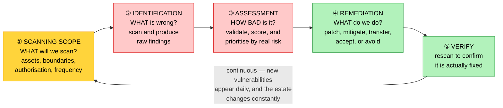

# Objective 4.1 — Explain vulnerability management concepts

> **Domain 4.0 — Security (19% of exam)** · Exam CV0-004 V4 · Objectives doc v5.0
> **Status:** Exam-ready · **Version:** 2.0 (enhanced) · Supersedes `full notes/Objective-4.1-Vulnerability-Management.md`

---

## 0. How to use this note

| Pass | What to read | Time |
|---|---|---|
| **1st (learn)** | Sections 1 → 9 in order | ~55 min |
| **2nd (drill)** | Section 2.1 (the four terms) + Section 7 (CVE/CWE/CVSS) + Section 6.2 (risk treatment) | ~20 min |
| **3rd (test)** | Section 12 (practice) + Section 13 (PBQ drills) | ~30 min |
| **Exam eve** | Section 14 (60-second recall sheet) only | ~4 min |

> 📌 **First objective of Domain 4 (Security, 19% — the joint-largest domain).** Two things carry the marks: mapping an action to the correct **step** of the cycle, and telling the **identifier family apart** — CVE, CWE, CVSS, CWSS are all on CompTIA's acronym list and are routinely confused.

---

## 1. Official objective coverage

> **4.1 Explain vulnerability management concepts.**
> - **Steps**
>   - Scanning scope
>   - Identification
>   - Assessment
>   - Remediation
> - **Common Vulnerabilities and Exposures (CVEs)**

### 1.1 What the verb tells you

**"Explain"** — definitions and mechanisms, precisely. But questions are usually framed as a scenario: *"an admin runs a tool that lists out-of-date software on 500 servers — which step is this?"* You are mapping an action onto the four-step vocabulary.

> ⚠️ **Scope boundary.** Routine patching as *maintenance* is **3.4**. Here, patching is the **remediation** step of a security process driven by discovered vulnerabilities.

### 1.2 Coverage checklist

- [ ] I can distinguish **vulnerability**, **threat**, **exploit**, and **risk**
- [ ] I can name the four steps **in order** and map an activity to each
- [ ] I know what **scanning scope** decides, and why it must be refreshed in cloud
- [ ] I know **credentialed vs non-credentialed** scanning and which is more accurate
- [ ] I know **false positive** vs **false negative** and which is more dangerous
- [ ] I know what **CVSS** scores and its **severity bands**
- [ ] I can distinguish **CVE** from **CWE**
- [ ] I know **CVSS base / temporal / environmental** metric groups
- [ ] I know severity alone does not set priority — **exposure and asset criticality** matter
- [ ] I can name the **five risk treatments**, not just "patch it"
- [ ] I know what a **zero-day** is and why remediation differs
- [ ] I know the cycle **closes with verification**, and is continuous
- [ ] I know scanning is bounded by the **shared responsibility model** and provider authorisation

---

## 2. The core mental model

### 2.1 ★ Vulnerability, threat, exploit, risk

```text
   VULNERABILITY   a WEAKNESS that could be taken advantage of
                   "the door lock is broken"
                   → unpatched software, misconfiguration,
                     weak credentials, exposed port

   THREAT          the ACTOR or EVENT that could take advantage
                   "there are burglars in the area"
                   → attacker, malware, insider, natural event

   EXPLOIT         the TECHNIQUE OR CODE that actually uses it
                   "the crowbar that opens that specific lock"
                   → a working proof-of-concept or attack tool

   RISK            the LIKELIHOOD and IMPACT of the threat
                   exploiting the vulnerability
                   "how likely a burglary is, and what it would cost"

              RISK  ≈  THREAT  ×  VULNERABILITY  ×  IMPACT

   ★ You cannot remove threats — you have no control over attackers.
     Vulnerability management reduces risk by removing or reducing
     the VULNERABILITY, which is the part you control.
```

### 2.2 The cycle — and it is a cycle



> ★ **The loop is the point.** A vulnerability scan is a photograph, not a state. New CVEs are published daily and cloud estates change hourly, so a point-in-time scan is stale almost immediately. **Verification (rescan) closes the loop** — without it you have a ticket marked "done," not a fixed system.

---

## 3. Step 1 — Scanning scope

| | |
|---|---|
| **Definition** | Deciding **what will be scanned**, within what boundaries, how often, and with what authorisation — before any scanning happens. |
| **What it covers** | Which assets (VMs, containers and images, functions, databases, storage, network, application code, IaC templates) · which environments (production vs non-production) · internal vs internet-facing · scan frequency · time windows · **authorisation** |
| **Too narrow** | You miss the forgotten internet-facing database — the classic breach |
| **Too broad** | Slow scans, noise, and possible disruption of live services |
| **★ The cloud problem** | The estate is **elastic** — instances appear and disappear hourly. A static asset list is wrong within a day. Scope must be **dynamic**, driven by **tags** and an automated asset inventory (see 1.8) |
| **Exam triggers** | "decide which systems to include", "define boundaries", "asset inventory", "which environments", "before scanning begins", "rules of engagement" |

> ⚠️ **You cannot scan what you do not know you own.** Scope depends on an accurate inventory — which is why tagging discipline (1.8) and IaC (2.4) are security controls, not just cost and consistency tools. Shadow IT and forgotten resources are outside scope by accident, and that is exactly where breaches start.

---

## 4. Step 2 — Identification

| | |
|---|---|
| **Definition** | Actually **detecting** weaknesses in the scoped assets — comparing installed versions, configurations, and exposed services against databases of known issues. |
| **Output** | A raw list of **findings** — not yet validated, not yet prioritised |
| **Finds** | Missing patches · **misconfigurations** (a public storage bucket, an open security group) · weak or default credentials · unnecessary exposed services · insecure protocols · expired certificates · non-compliant baselines |
| **Exam triggers** | "the scanner produced a list", "detected out-of-date software", "discovered a public bucket", "findings report" |

### 4.1 ★ Credentialed vs non-credentialed scanning

```text
   NON-CREDENTIALED (unauthenticated)   CREDENTIALED (authenticated)
   scan from OUTSIDE, no login          scan from INSIDE, with an account

   ┌──────────┐                         ┌──────────┐
   │ SCANNER  │──probes ports and       │ SCANNER  │──logs in, reads
   └──────────┘  banners───► [HOST]     └──────────┘  installed packages,
                                                       patch level, config
   ✓ Shows the ATTACKER'S VIEW           ✓ FAR MORE ACCURATE and complete
   ✓ No credentials to manage            ✓ FEWER FALSE POSITIVES
   ✗ Infers from version banners         ✓ Sees configuration and
     → MANY FALSE POSITIVES                missing patches directly
   ✗ Misses internal issues              ✗ Requires managing credentials
                                           (themselves a risk to protect)

   ★ Use BOTH: credentialed for accuracy and depth, non-credentialed
     to see what an attacker sees from outside.
```

| Other distinctions | Meaning |
|---|---|
| **Agent-based vs agentless** | An agent on the host reports continuously (good for ephemeral and disconnected assets); agentless scans over the network (nothing to install) |
| **Internal vs external** | Inside the network perimeter vs from the internet — different attack surface |
| **Active vs passive** | Active sends probes (accurate, some load); passive observes traffic (no impact, less complete) |
| **Continuous vs point-in-time** | Continuous suits elastic cloud estates; scheduled scans go stale between runs |

### 4.2 False positives and false negatives

| | **False positive** | **False negative** |
|---|---|---|
| Meaning | Reported, but **not actually a vulnerability** | **A real vulnerability that was not reported** |
| Cost | Wasted effort, and **alert fatigue** that trains teams to ignore findings | **A real weakness left open** |
| ★ Which is worse | Annoying and corrosive | **Dangerous — this is the one that gets you breached** |
| Reduced by | Credentialed scanning, tuning, validation | Broader scope, credentialed scans, updated signatures, multiple tools |

---

## 5. Step 3 — Assessment

| | |
|---|---|
| **Definition** | **Validating and prioritising** the findings — deciding which are real, how severe, and what to fix first. |
| **Output** | A **prioritised, risk-ranked** list |
| **Inputs to the decision** | **CVSS severity** · is it **internet-facing**? · does the asset hold **sensitive data**? · is there a **known exploit in the wild**? · is there a **compensating control** already? · business criticality of the asset |
| **Exam triggers** | "prioritise which to fix first", "rate the severity", "determine business impact", "is it exploitable in our environment", "risk ranking" |

### 5.1 ★ Severity is not the same as priority

```text
   CVSS gives SEVERITY — how bad the flaw is INTRINSICALLY.
   PRIORITY needs YOUR CONTEXT as well.

   ┌────────────────────────────────────────────────────────────────┐
   │ CVSS 9.8 CRITICAL on an isolated test VM with no data,         │
   │          no internet exposure, and no known exploit            │
   │          →  probably NOT your first job                        │
   ├────────────────────────────────────────────────────────────────┤
   │ CVSS 6.5 MEDIUM on an internet-facing server holding           │
   │          customer records, with a working exploit circulating  │
   │          →  ★ FIX THIS FIRST                                   │
   └────────────────────────────────────────────────────────────────┘

   PRIORITY  ≈  SEVERITY  ×  EXPOSURE  ×  ASSET CRITICALITY
                            ×  EXPLOIT AVAILABILITY

   ★ A scanner ranks by severity. A security team ranks by RISK.
```

---

## 6. Step 4 — Remediation

| | |
|---|---|
| **Definition** | Taking action to **remove or reduce** the risk, then **verifying** it worked. |
| **Exam triggers** | "apply the patch", "implement a compensating control", "accept the risk", "decommission the system", "rescan to confirm" |

### 6.1 The action itself

| Action | When |
|---|---|
| **Patch / update** | A vendor fix exists — the primary remediation (see 3.4) |
| **Reconfigure** | The finding is a misconfiguration, not a software flaw — close the bucket, tighten the security group |
| **Upgrade / replace** | The version is past **end of support** and unpatchable (3.4) |
| **Compensating control** | No patch available yet — reduce exposure instead (WAF rule, network restriction, disable the feature, segmentation) |
| **Decommission** | The asset is not needed — the cleanest fix of all |

### 6.2 ★ The five risk treatments — remediation is not always "patch it"

```text
   ① REMEDIATE / MITIGATE   fix or reduce it
                            patch, reconfigure, add a control
                            → the default

   ② TRANSFER               shift the financial consequence
                            cyber insurance, contractual terms,
                            move the function to a provider
                            ⚠ transfers the COST, not the
                              ACCOUNTABILITY (see 1.1)

   ③ ACCEPT                 knowingly live with it
                            ★ must be DOCUMENTED, time-boxed, and
                              approved by someone with authority
                            → used when the fix costs more than the
                              risk, or breaks something critical

   ④ AVOID                  eliminate the exposure entirely
                            decommission the system, stop using
                            the feature

   ⑤ (deferred)             schedule it for a maintenance window
                            with a compensating control meanwhile

   ★ "Accept" is a legitimate answer — but only when it is a
     DOCUMENTED, APPROVED decision, not silent inaction.
```

### 6.3 Zero-days and remediation SLAs

**A zero-day** is a vulnerability with **no vendor patch available** — disclosed or exploited before a fix exists. You cannot remediate by patching, so the response is **mitigation**: compensating controls, virtual patching at a WAF, disabling the affected feature, network isolation, and heightened monitoring until a patch ships.

**Remediation timeframes** are normally defined by policy and severity:

| Severity | Typical target | Note |
|---|---|---|
| **Critical (9.0–10.0)** | Emergency — days, sometimes hours | Often out-of-band, outside the normal window |
| **High (7.0–8.9)** | Days to weeks | |
| **Medium (4.0–6.9)** | Weeks to the next cycle | |
| **Low (0.1–3.9)** | Next scheduled maintenance | |

> ⚠️ **Remediation is not complete until it is verified.** Rescan and confirm the finding is gone. A closed ticket is not evidence — and a "fixed" patch that failed to apply across part of the fleet is a common audit finding.

---

## 7. CVE and the identifier family

All four of these appear on CompTIA's acronym list, and they are routinely confused.

### 7.1 CVE — Common Vulnerabilities and Exposures

```text
   CVE-2024-12345
   │    │     │
   │    │     └── sequential identifier
   │    └──────── year assigned
   └───────────── the catalogue

   WHAT IT IS   A unique, public identifier for ONE SPECIFIC
                vulnerability in ONE SPECIFIC product/version.
   WHO         Assigned by MITRE and CVE Numbering Authorities.
   WHY         A common language. "CVE-2024-12345" means the same
               thing to your scanner, your vendor, your auditor,
               and every security bulletin.
   NOTE        A CVE identifier carries NO severity by itself —
               severity comes from CVSS, added by databases such
               as the NVD.
```

### 7.2 ★ CVE vs CWE — the distinction that gets tested

```text
   CWE  =  the CLASS of weakness (the category)
           CWE-79   Cross-site scripting
           CWE-89   SQL injection
           CWE-22   Path traversal

   CVE  =  a SPECIFIC INSTANCE in a specific product
           CVE-2024-12345 → SQL injection in AcmeCMS 4.2

                    CWE-89 (SQL injection)
                          │
          ┌───────────────┼───────────────┐
          ▼               ▼               ▼
     CVE-2023-xxxx   CVE-2024-12345   CVE-2024-yyyy
     (Product A)      (AcmeCMS 4.2)    (Product C)

   ★ MANY CVEs map to ONE CWE.
     CWE describes the KIND of mistake; CVE names WHERE it occurred.
```

### 7.3 CVSS — Common Vulnerability Scoring System

```text
   SEVERITY BANDS (CVSS v3.x)

   0.0        NONE
   0.1 – 3.9  LOW        ░░
   4.0 – 6.9  MEDIUM     ▒▒▒▒
   7.0 – 8.9  HIGH       ▓▓▓▓▓▓
   9.0 – 10.0 CRITICAL   ██████████

   THREE METRIC GROUPS
   ┌──────────────┬──────────────────────────────────────────────┐
   │ BASE         │ intrinsic qualities that DO NOT change —     │
   │              │ attack vector, complexity, privileges needed,│
   │              │ user interaction, impact on C/I/A            │
   │              │ ★ this is the score usually quoted           │
   ├──────────────┼──────────────────────────────────────────────┤
   │ TEMPORAL     │ changes OVER TIME — exploit maturity, is a   │
   │              │ patch available, confidence in the report    │
   ├──────────────┼──────────────────────────────────────────────┤
   │ ENVIRONMENTAL│ YOUR context — how critical this asset is    │
   │              │ to you, and your security requirements       │
   │              │ ★ this is what turns severity into priority  │
   └──────────────┴──────────────────────────────────────────────┘
```

### 7.4 The family at a glance

| | **CVE** | **CWE** | **CVSS** | **CWSS** |
|---|---|---|---|---|
| Stands for | Common Vulnerabilities and **Exposures** | Common **Weakness** Enumeration | Common **Vulnerability Scoring** System | Common **Weakness Scoring** System |
| Answers | **Which specific flaw?** | **What kind of flaw?** | **How severe is this flaw?** | **How severe is this weakness type?** |
| Granularity | One product, one flaw | A category | A 0–10 score | A score |
| Example | `CVE-2024-12345` | `CWE-89` (SQL injection) | `9.8 Critical` | — |
| Relationship | **Many CVEs → one CWE**; each CVE is usually given a CVSS score | | | |

---

## 8. Vulnerability management in the cloud

| Consideration | What changes |
|---|---|
| **★ Shared responsibility** | You scan **your** layer. In IaaS that is the guest OS and up; in PaaS it is your code and configuration; in SaaS you assess the **vendor**, not the platform (see 1.1) |
| **★ Provider authorisation** | Scanning is testing against infrastructure you do not own. Providers publish permitted-activity policies; **penetration testing in particular may require notification or approval**, and unauthorised scanning can breach the terms of service |
| **Elastic estate** | Assets appear and disappear — scope must be **tag-driven and continuous**, not a static list |
| **★ Shift left** | Scan **before** deployment: container **images in the registry** (1.6), **IaC templates** (2.4), and dependencies. Fixing at build time is far cheaper than in production |
| **Immutable infrastructure** | Remediation is often **replace the instance from a patched image**, not patch in place (3.4) |
| **Managed services** | The provider patches the platform — your job is configuration, access, and data (1.1) |
| **SBOM** | A software bill of materials lists components and dependencies, so when a CVE lands you can answer "are we affected?" quickly |
| **Posture management** | Continuous checking for **misconfiguration** — public buckets, over-permissive roles, unencrypted volumes — often the larger cloud risk than unpatched software |

```text
   ★ WHERE TO SCAN IN THE CLOUD — SHIFT LEFT

   IaC TEMPLATE ──► CONTAINER IMAGE ──► RUNNING WORKLOAD ──► CONFIG
   (2.4)            (1.6, in the        (traditional          POSTURE
                     registry)           scanning)            (misconfig)

   ◄──────── cheaper and safer to fix ─────────────────────────►
     caught here = never deployed        caught here = incident response
```

### 8.1 Vulnerability scanning vs penetration testing

| | **Vulnerability scanning** | **Penetration testing** |
|---|---|---|
| What it does | **Identifies** known weaknesses | **Attempts to exploit** them |
| Method | Automated, signature/database driven | Human-led, creative, chains findings together |
| Frequency | Continuous or regular | Periodic (often annual or per release) |
| Depth | Broad, shallow | Narrow, deep |
| Proves | The weakness **may** exist | The weakness **is** exploitable, and what it leads to |
| Risk to systems | Low | Higher — can disrupt |
| Provider approval | Generally permitted within policy | ⚠️ **Often requires notification or authorisation** |

---

## 9. Comparison tables

### 9.1 ★ The four steps

| Step | Question | Activity | Output |
|---|---|---|---|
| **① Scanning scope** | **What will we examine?** | Define assets, boundaries, environments, frequency, authorisation | A defined, authorised scope |
| **② Identification** | **What is wrong?** | Run scans; detect missing patches, misconfigurations, exposures | Raw findings list |
| **③ Assessment** | **How bad, and what first?** | Validate, score with CVSS, weigh exposure and asset criticality | Prioritised risk-ranked list |
| **④ Remediation** | **What do we do about it?** | Patch, reconfigure, mitigate, transfer, accept, or avoid — then **verify** | Reduced risk, confirmed by rescan |

### 9.2 Activity → step

| Activity | Step |
|---|---|
| "We decided to include all production-tagged instances" | **Scanning scope** |
| "The tool listed 400 out-of-date packages" | **Identification** |
| "A public storage bucket was discovered" | **Identification** |
| "We ranked findings by CVSS and internet exposure" | **Assessment** |
| "We confirmed the finding was a false positive" | **Assessment** |
| "We applied the vendor patch" | **Remediation** |
| "No patch exists, so we blocked it at the WAF" | **Remediation (mitigation)** |
| "Management signed off on living with it for 90 days" | **Remediation (documented acceptance)** |
| "We rescanned and the finding is gone" | **Remediation — verification** |

### 9.3 Risk treatment options

| Treatment | Meaning | Example |
|---|---|---|
| **Remediate/mitigate** | Fix or reduce | Patch, reconfigure, add a control |
| **Transfer** | Shift the financial consequence | Insurance, contract, use a managed service |
| **Accept** | Documented, approved decision to live with it | Low severity, isolated asset, fix breaks production |
| **Avoid** | Remove the exposure entirely | Decommission the system or disable the feature |
| **Defer** | Schedule later, with a compensating control now | Next maintenance window |

### 9.4 Scan type selection

| Requirement | Scan type |
|---|---|
| Most accurate patch-level detection | **Credentialed** |
| See what an attacker sees | **Non-credentialed, external** |
| Ephemeral or short-lived instances | **Agent-based** or image scanning |
| No software may be installed | **Agentless** |
| No impact on production traffic | **Passive** |
| Catch problems before deployment | **Image and IaC scanning (shift left)** |
| Prove exploitability and impact | **Penetration test** (with authorisation) |

---

## 10. Exam traps & distractor patterns

| # | Trap | The truth |
|---|---|---|
| 1 | "Vulnerability and threat are the same" | A **vulnerability** is the weakness; a **threat** is what might exploit it; an **exploit** is the technique; **risk** is likelihood × impact |
| 2 | "A CVE tells you how severe it is" | A CVE is only an **identifier**. Severity comes from **CVSS** |
| 3 | "CVE and CWE are interchangeable" | **CWE** is the **class** of weakness (SQL injection); **CVE** is a **specific instance** in a specific product. Many CVEs map to one CWE |
| 4 | "Fix the highest CVSS score first" | Severity ≠ priority. A **medium** on an internet-facing system holding customer data with a live exploit outranks a **critical** on an isolated test box |
| 5 | "Remediation means patching" | It also includes reconfiguring, compensating controls, **transfer**, documented **acceptance**, and **decommissioning** |
| 6 | "Accepting a risk is negligence" | It is legitimate **when documented, time-boxed, and approved** by someone with authority. Silent inaction is the problem |
| 7 | "Non-credentialed scans are more thorough" | **Credentialed** scans are far more accurate with fewer false positives. Non-credentialed shows the attacker's outside view |
| 8 | "False positives are the dangerous ones" | They waste effort and cause fatigue, but a **false negative** — a real vulnerability never reported — is what gets you breached |
| 9 | "Scanning finds only missing patches" | It also finds **misconfigurations** — public buckets, open security groups, weak credentials — which in cloud are often the bigger risk |
| 10 | "A zero-day can be patched immediately" | By definition **no patch exists yet** — the response is mitigation and compensating controls until one ships |
| 11 | "The ticket is closed, so it is fixed" | **Verification by rescan** is what proves remediation; partial rollouts across a fleet are common |
| 12 | "A quarterly scan is sufficient in cloud" | The estate changes hourly and new CVEs appear daily. Scope must be **continuous and tag-driven** |
| 13 | "You may scan anything in your cloud account" | Scanning touches provider infrastructure. Check the **permitted-use policy**; **penetration testing may require authorisation** |
| 14 | "Scanning is the same as penetration testing" | Scanning **identifies**; penetration testing **exploits** to prove impact |
| 15 | "In SaaS you scan the provider's platform" | You assess the **vendor** (certifications, contracts). You scan **your** layer only (1.1) |
| 16 | "Scan production only" | Scan **images and IaC before deployment** — shift left. Fixing at build time is far cheaper |

**Disambiguation drill:**

| Pair | The deciding question |
|---|---|
| **Vulnerability vs risk** | The **weakness itself**, or the **likelihood and impact** of it being exploited? |
| **CVE vs CWE** | A **specific flaw in a product**, or the **category** of mistake? |
| **CVE vs CVSS** | The **name**, or the **score**? |
| **Identification vs assessment** | **Finding** it, or deciding **how bad** it is? |
| **Severity vs priority** | The flaw's intrinsic badness, or badness **in your environment**? |
| **Credentialed vs non-credentialed** | Accuracy from inside, or the **attacker's view** from outside? |
| **Mitigate vs accept** | Reduce the risk, or **document and approve** living with it? |
| **Scanning vs pen testing** | Identify weaknesses, or **prove they are exploitable**? |

---

## 11. Keyword → answer trigger table

| If you see… | Think |
|---|---|
| decide which systems to include · define boundaries · asset inventory · rules of engagement | **Scanning scope** |
| the scanner produced a list · detected out-of-date software · found a public bucket | **Identification** |
| rank by severity · which to fix first · is it internet-facing · confirmed a false positive | **Assessment** |
| applied the patch · blocked it at the WAF · management accepted the risk · decommissioned it | **Remediation** |
| rescanned and confirmed the fix | **Remediation — verification** |
| a unique identifier for a specific flaw · CVE-2024-… | **CVE** |
| the category of weakness · SQL injection as a class | **CWE** |
| a 0–10 severity score · 9.8 Critical | **CVSS** |
| base, temporal, environmental | **CVSS metric groups** |
| accurate patch detection · logged in to the host | **Credentialed scan** |
| what an attacker sees from outside | **Non-credentialed / external scan** |
| a real vulnerability that was never reported | **False negative — the dangerous one** |
| reported but not actually a problem | **False positive** |
| no patch exists yet | **Zero-day → mitigate with compensating controls** |
| documented, approved, time-boxed decision to live with it | **Risk acceptance** |
| insurance or contractual shift of cost | **Risk transfer** |
| scan the image in the registry and the IaC template | **Shift left** |
| attempts to exploit and prove impact | **Penetration testing** (needs authorisation) |
| public buckets, over-permissive roles, unencrypted volumes | **Misconfiguration / posture management** |

---

## 12. Practice questions

<details>
<summary><b>Q1.</b> An administrator runs a tool that produces a list of out-of-date software across 500 servers. Which step of vulnerability management is this?</summary>

A. Scanning scope · **B. Identification** · C. Assessment · D. Remediation

**Correct: B — identification.** The scan detects potential weaknesses and produces raw findings; they have not yet been validated or prioritised.
- **A wrong:** Scope was decided before the scan ran.
- **C wrong:** Assessment is judging severity and priority.
- **D wrong:** Nothing has been fixed yet.
</details>

<details>
<summary><b>Q2.</b> What is the difference between a vulnerability and a threat?</summary>

A. They are synonyms · **B. A vulnerability is a weakness that could be taken advantage of; a threat is the actor or event that could take advantage of it** · C. A threat is a weakness; a vulnerability is an attacker · D. A vulnerability is a score

**Correct: B.** You control vulnerabilities; you do not control threats — which is why vulnerability management reduces risk by addressing the weakness.
- **A/C wrong:** The terms are distinct and not reversed.
- **D wrong:** That describes CVSS.
</details>

<details>
<summary><b>Q3.</b> Which finding should be remediated FIRST?</summary>

A. CVSS 9.8 on an isolated development VM with no data and no internet exposure · **B. CVSS 6.5 on an internet-facing server holding customer records, with a working exploit circulating** · C. CVSS 8.0 on a decommissioned system · D. CVSS 3.1 on an internal print server

**Correct: B.** Priority combines severity with **exposure, asset criticality, and exploit availability**. A medium on a reachable, data-holding, actively exploited system outranks a critical on an isolated box.
- **A wrong:** High severity but negligible real risk.
- **C wrong:** A decommissioned system presents no exposure.
- **D wrong:** Low severity and low exposure.
</details>

<details>
<summary><b>Q4.</b> What does a CVE identifier provide?</summary>

A. A severity score from 0 to 10 · **B. A unique public identifier for one specific vulnerability in a specific product, giving the industry a common language** · C. A category of weakness such as SQL injection · D. A remediation procedure

**Correct: B.** CVE names the flaw; it carries no severity of its own.
- **A wrong:** That is CVSS.
- **C wrong:** That is CWE.
- **D wrong:** CVE records do not prescribe fixes.
</details>

<details>
<summary><b>Q5.</b> What is the relationship between CVE and CWE?</summary>

**A. CWE describes the class of weakness; CVE identifies a specific instance in a specific product, and many CVEs map to one CWE** · B. They are the same catalogue · C. CVE is the category, CWE the instance · D. CWE replaced CVE

**Correct: A.** CWE-89 is "SQL injection" as a category; many individual CVEs across many products are instances of it.
- **B/D wrong:** They are distinct and both current.
- **C wrong:** The roles are reversed.
</details>

<details>
<summary><b>Q6.</b> Which scanning approach produces the most accurate results with the fewest false positives?</summary>

A. Non-credentialed external scanning · **B. Credentialed (authenticated) scanning** · C. Passive monitoring · D. Port scanning only

**Correct: B.** Logging in lets the scanner read actual installed versions, patch levels, and configuration rather than inferring from banners.
- **A wrong:** Valuable for showing the attacker's view, but it infers and produces more false positives.
- **C/D wrong:** Both are less complete.
</details>

<details>
<summary><b>Q7.</b> Which is more dangerous, and why?</summary>

A. A false positive, because it wastes time · **B. A false negative, because a real vulnerability exists but was never reported, so nobody addresses it** · C. They are equally dangerous · D. Neither matters if CVSS is used

**Correct: B.** A false positive costs effort and erodes trust in the tooling; a false negative leaves a genuine weakness open.
- **A/C/D wrong:** Each understates the asymmetry.
</details>

<details>
<summary><b>Q8.</b> A critical vulnerability is announced, but the vendor has not released a patch. What is the appropriate response?</summary>

A. Wait for the patch and take no action · **B. Apply compensating controls — WAF rules, network restriction, disabling the affected feature — and monitor closely until a patch ships** · C. Accept the risk permanently · D. Decommission all affected systems immediately

**Correct: B.** This is a **zero-day**: there is nothing to patch, so remediation takes the form of mitigation.
- **A wrong:** Leaves the exposure open with no controls.
- **C wrong:** Permanent acceptance of a critical exposure is not defensible.
- **D wrong:** Disproportionate in most cases, though avoidance is an option for non-essential systems.
</details>

<details>
<summary><b>Q9.</b> Which CVSS band corresponds to a score of 7.5?</summary>

A. Medium · **B. High** · C. Critical · D. Low

**Correct: B — High (7.0–8.9).** The bands are Low 0.1–3.9, Medium 4.0–6.9, High 7.0–8.9, Critical 9.0–10.0.
- **A wrong:** Medium ends at 6.9.
- **C wrong:** Critical starts at 9.0.
- **D wrong:** Low ends at 3.9.
</details>

<details>
<summary><b>Q10.</b> Management formally documents and approves a decision to live with a low-severity finding on an isolated system for 90 days. What is this?</summary>

A. Negligence · **B. Risk acceptance — a legitimate treatment when documented, time-boxed, and approved by someone with authority** · C. Risk transfer · D. Risk avoidance

**Correct: B.** Acceptance is a valid risk treatment; what distinguishes it from negligence is documentation, approval, and a review date.
- **A wrong:** Silent inaction would be; a documented decision is not.
- **C wrong:** Transfer shifts the financial consequence elsewhere.
- **D wrong:** Avoidance removes the exposure entirely.
</details>

<details>
<summary><b>Q11.</b> Why must scanning scope be dynamic in a cloud environment?</summary>

A. Scanners require it · **B. The estate is elastic — instances appear and disappear constantly, so a static asset list becomes inaccurate almost immediately; scope should be tag-driven and continuous** · C. Because CVEs change daily · D. To reduce licence costs

**Correct: B.** Auto-scaling, ephemeral instances, and rapid provisioning mean a fixed inventory is stale within a day — which is why tagging is a security control, not just a cost tool.
- **A wrong:** It is an environmental requirement, not a tool constraint.
- **C wrong:** True but a separate reason relating to frequency.
- **D wrong:** Not the driver.
</details>

<details>
<summary><b>Q12.</b> Under the shared responsibility model, what does a customer scan in a SaaS environment?</summary>

A. The provider's application code · B. The provider's operating systems · **C. Their own configuration, access, and data — while assessing the vendor through certifications and contracts** · D. Nothing at all

**Correct: C.** In SaaS the provider secures the platform; the customer's scope is configuration, identity, and data, plus vendor due diligence (see 1.1).
- **A/B wrong:** Scanning the provider's platform is generally not permitted and not the customer's responsibility.
- **D wrong:** Configuration and access remain the customer's.
</details>

<details>
<summary><b>Q13.</b> What is the PRIMARY difference between vulnerability scanning and penetration testing?</summary>

A. They are the same · **B. Scanning identifies known weaknesses automatically; penetration testing attempts to exploit them to prove impact** · C. Scanning requires authorisation, pen testing does not · D. Pen testing is fully automated

**Correct: B.** Scanning is broad and shallow; penetration testing is narrow, deep, human-led, and chains findings together.
- **A wrong:** Distinct activities.
- **C wrong:** Reversed — **penetration testing** is the one more likely to require provider authorisation.
- **D wrong:** Penetration testing is human-led.
</details>

<details>
<summary><b>Q14.</b> Which CVSS metric group reflects how critical the affected asset is to YOUR organisation?</summary>

A. Base · B. Temporal · **C. Environmental** · D. Exploitability

**Correct: C — environmental.** Base captures intrinsic characteristics, temporal captures how things change over time, and environmental applies your context — which is what turns severity into priority.
- **A wrong:** Base is context-free.
- **B wrong:** Temporal covers exploit maturity and patch availability.
- **D wrong:** Exploitability is a component of the base score, not a group.
</details>

<details>
<summary><b>Q15.</b> A team applies patches to remediate findings and immediately closes the tickets. What step is missing?</summary>

A. Assessment · B. Scoping · **C. Verification — rescanning to confirm the vulnerabilities are actually resolved** · D. Identification

**Correct: C.** A closed ticket is not evidence; partial rollouts and failed patches across a fleet are common, and rescanning is what proves remediation.
- **A/B/D wrong:** All occurred earlier in the cycle.
</details>

<details>
<summary><b>Q16.</b> A scan discovers a storage bucket configured for public read access. What type of finding is this?</summary>

**A. A misconfiguration — which in cloud environments is often a greater risk than unpatched software** · B. A zero-day · C. A false positive by definition · D. A CWE

**Correct: A.** Vulnerability management covers misconfiguration as well as software flaws, and cloud posture issues like public buckets and over-permissive roles are a leading cause of breaches.
- **B wrong:** Nothing here is an unpatched software flaw.
- **C wrong:** It is a genuine finding.
- **D wrong:** CWE is a weakness classification scheme.
</details>

<details>
<summary><b>Q17.</b> Which practice catches vulnerabilities before workloads reach production?</summary>

A. Quarterly production scanning · **B. Shift-left scanning of container images in the registry and infrastructure-as-code templates** · C. Annual penetration testing · D. Passive network monitoring

**Correct: B.** Scanning build artefacts and templates prevents deployment of known-vulnerable components, and is far cheaper than remediating in production (see 1.6, 2.4).
- **A/C wrong:** Both detect issues only after deployment.
- **D wrong:** Passive monitoring observes running traffic.
</details>

<details>
<summary><b>Q18.</b> Which sequence correctly orders the vulnerability management steps?</summary>

A. Identification → scanning scope → remediation → assessment · **B. Scanning scope → identification → assessment → remediation** · C. Assessment → identification → scope → remediation · D. Remediation → identification → assessment → scope

**Correct: B.** Decide what to examine, find what is wrong, judge how bad it is, then act — and rescan to verify.
- **A/C/D wrong:** All place scoping or remediation out of sequence.
</details>

<details>
<summary><b>Q19.</b> An organisation purchases cyber insurance to cover potential losses from a vulnerability it cannot economically fix. Which risk treatment is this?</summary>

A. Mitigation · B. Acceptance · **C. Transfer** · D. Avoidance

**Correct: C — transfer.** Insurance shifts the **financial consequence**. It does not shift accountability — regulators and customers still hold the organisation responsible (see 1.1).
- **A wrong:** Mitigation reduces the risk itself.
- **B wrong:** Acceptance takes no action beyond documenting.
- **D wrong:** Avoidance removes the exposure.
</details>

<details>
<summary><b>Q20.</b> Before running a penetration test against workloads in a public cloud, what should the organisation do?</summary>

**A. Check the provider's permitted-use policy and obtain any required authorisation** · B. Nothing — you own your account · C. Notify only internal stakeholders · D. Disable all logging first

**Correct: A.** Testing touches provider infrastructure; unauthorised activity can breach the terms of service, and providers publish rules of engagement.
- **B wrong:** Account ownership does not extend to unrestricted testing of shared infrastructure.
- **C wrong:** Internal notice alone is insufficient.
- **D wrong:** Disabling logging destroys the evidence you need.
</details>

<details>
<summary><b>Q21.</b> Which combination BEST reduces false positives in scanning?</summary>

**A. Credentialed scanning plus tuning and validation of findings** · B. Increasing scan frequency · C. Scanning only externally · D. Reducing the scope

**Correct: A.** Authenticated scans read actual state rather than inferring it, and validating findings removes the remainder.
- **B wrong:** More frequent inaccurate scans produce more false positives.
- **C wrong:** External-only scanning increases them.
- **D wrong:** Narrowing scope risks false negatives instead.
</details>

<details>
<summary><b>Q22.</b> What does an SBOM help an organisation do when a new CVE is announced?</summary>

**A. Quickly determine whether any deployed software contains the affected component** · B. Automatically patch the vulnerability · C. Calculate the CVSS score · D. Replace penetration testing

**Correct: A.** A software bill of materials inventories components and dependencies, answering "are we affected?" in minutes rather than days.
- **B/C/D wrong:** An SBOM is an inventory, not a remediation, scoring, or testing tool.
</details>

<details>
<summary><b>Q23.</b> A vulnerability exists in a system scheduled for decommissioning next month. Which treatment is MOST appropriate?</summary>

A. Major version upgrade · **B. Avoidance — proceed with decommissioning, applying a compensating control in the interim** · C. Transfer via insurance · D. Ignore it

**Correct: B.** Removing the system eliminates the exposure entirely; a temporary control covers the remaining window.
- **A wrong:** Upgrading something about to be retired wastes effort.
- **C wrong:** Insurance does not address a fixable exposure.
- **D wrong:** Ignoring is not a documented decision.
</details>

<details>
<summary><b>Q24.</b> Which statement about CVSS is CORRECT?</summary>

A. It replaces CVE identifiers · **B. It scores severity from 0 to 10 across base, temporal, and environmental metric groups** · C. It lists categories of weakness · D. It is assigned by the customer only

**Correct: B.** CVSS quantifies severity; CVE names the flaw; CWE classifies the weakness type.
- **A wrong:** They are complementary.
- **C wrong:** That is CWE.
- **D wrong:** Base scores are published by databases such as the NVD; customers apply environmental metrics.
</details>

<details>
<summary><b>Q25.</b> Why is vulnerability management described as a continuous cycle rather than a project?</summary>

**A. New vulnerabilities are disclosed constantly and cloud estates change continuously, so any scan result is stale almost immediately** · B. Because scanners require monthly licences · C. Because CVSS scores are recalculated daily · D. Because auditors require it quarterly

**Correct: A.** A scan is a photograph, not a state — which is why the loop returns to scoping and why verification closes each pass.
- **B/D wrong:** Commercial and audit factors are not the reason.
- **C wrong:** Base scores are generally stable; temporal metrics change occasionally.
</details>

---

## 13. PBQ-style drills

### Drill A — Map the activity to the step

| # | Activity | Step? |
|---|---|---|
| 1 | Tagging all production assets so scans include them | |
| 2 | The scanner reports 240 findings | |
| 3 | Confirming a reported finding does not actually exist | |
| 4 | Ranking findings by exposure and data sensitivity | |
| 5 | Adding a WAF rule because no patch exists | |
| 6 | Rescanning after patching | |
| 7 | Deciding not to scan the isolated lab network | |

<details><summary>Answers</summary>

1 → **Scanning scope** · 2 → **Identification** · 3 → **Assessment** (false-positive validation) · 4 → **Assessment** · 5 → **Remediation** (mitigation) · 6 → **Remediation — verification** · 7 → **Scanning scope**
</details>

### Drill B — Name the identifier

| # | Description | CVE / CWE / CVSS / CWSS? |
|---|---|---|
| 1 | `CVE-2024-3400` | |
| 2 | "Cross-site scripting" as a category of flaw | |
| 3 | A score of 9.8 rated Critical | |
| 4 | Base, temporal and environmental metric groups | |
| 5 | Many of these map to a single category | |

<details><summary>Answers</summary>

1 → **CVE** (a specific flaw in a specific product) · 2 → **CWE** · 3 → **CVSS** · 4 → **CVSS** · 5 → **CVEs** map to one **CWE**
</details>

### Drill C — Choose the risk treatment

| # | Situation | Treatment? |
|---|---|---|
| 1 | Vendor patch available and tested | |
| 2 | No patch exists; WAF rule blocks the attack path | |
| 3 | System retires next month | |
| 4 | Low severity, isolated, fix would break production; signed off for 90 days | |
| 5 | Cyber insurance purchased against residual loss | |

<details><summary>Answers</summary>

1 → **Remediate** (patch) · 2 → **Mitigate** (compensating control) · 3 → **Avoid** (decommission) · 4 → **Accept** — documented, time-boxed, approved · 5 → **Transfer** (cost only, not accountability)
</details>

### Drill D — Prioritise these findings

| # | Finding |
|---|---|
| A | CVSS 9.1, internal-only test server, no sensitive data, no known exploit |
| B | CVSS 5.4, internet-facing, holds customer PII, exploit code public |
| C | CVSS 7.8, internal server, sensitive data, no known exploit |
| D | CVSS 8.2, system decommissioned last week |

<details><summary>Answer</summary>

**Order: B → C → A → D**

- **B first** — despite only medium severity, it is internet-facing, holds regulated data, and has a **public exploit**. Highest real risk.
- **C second** — high severity plus sensitive data, but not externally reachable and no exploit circulating.
- **A third** — high score, but no exposure, no data, no exploit.
- **D last / not at all** — verify the decommission completed (see 3.4); if the asset is gone there is no exposure.

**The lesson:** the scanner would have ordered these A → D → C → B. Priority is **severity × exposure × asset criticality × exploit availability**, not the score alone.
</details>

---

## 14. 60-second recall sheet

```text
╔══════════════════════════════════════════════════════════════════════╗
║  4.1 — VULNERABILITY MANAGEMENT   (Domain 4.0 Security = 19%)        ║
║  Scope note: routine patching as MAINTENANCE is 3.4. Here it is      ║
║  the REMEDIATION step of a security process.                         ║
╠══════════════════════════════════════════════════════════════════════╣
║  ★ THE FOUR TERMS                                                    ║
║   VULNERABILITY  the WEAKNESS (unpatched software, misconfig)        ║
║   THREAT         the ACTOR/EVENT that could exploit it               ║
║   EXPLOIT        the CODE/TECHNIQUE that actually does               ║
║   RISK           LIKELIHOOD × IMPACT                                 ║
║   → you can't remove THREATS; you remove VULNERABILITIES             ║
╠══════════════════════════════════════════════════════════════════════╣
║  ★ THE FOUR STEPS (+ verify, and it LOOPS)                           ║
║   ① SCANNING SCOPE  WHAT will we scan? assets, boundaries,           ║
║       authorisation ⚠ cloud is ELASTIC → TAG-DRIVEN + CONTINUOUS     ║
║   ② IDENTIFICATION  WHAT is wrong? raw findings — includes           ║
║       MISCONFIGURATIONS (public buckets), not just missing patches   ║
║   ③ ASSESSMENT      HOW BAD? validate, score, PRIORITISE             ║
║   ④ REMEDIATION     ACT → then ★ VERIFY BY RESCAN                    ║
╠══════════════════════════════════════════════════════════════════════╣
║  SCANNING  CREDENTIALED (logged in) = ACCURATE, FEW FALSE POSITIVES  ║
║            NON-CREDENTIALED = the ATTACKER'S VIEW, more FPs          ║
║            agent vs agentless · internal vs external · active/passive║
║   FALSE POSITIVE = reported but not real (wastes effort, fatigue)    ║
║   ★ FALSE NEGATIVE = REAL but NOT reported ← THE DANGEROUS ONE       ║
╠══════════════════════════════════════════════════════════════════════╣
║  ★ IDENTIFIER FAMILY (all on the acronym list)                       ║
║   CVE   ONE SPECIFIC flaw in a SPECIFIC product · CVE-2024-12345     ║
║         ⚠ carries NO severity by itself                              ║
║   CWE   the CLASS of weakness (CWE-89 = SQL injection)               ║
║         ★ MANY CVEs → ONE CWE                                        ║
║   CVSS  0–10 SEVERITY score                                          ║
║         LOW 0.1-3.9 · MED 4.0-6.9 · HIGH 7.0-8.9 · CRIT 9.0-10.0    ║
║         groups: BASE (intrinsic) · TEMPORAL (over time) ·            ║
║                 ENVIRONMENTAL (YOUR context → turns severity into    ║
║                 priority)                                            ║
║   CWSS  scoring for weakness types                                   ║
╠══════════════════════════════════════════════════════════════════════╣
║  ★ SEVERITY ≠ PRIORITY                                               ║
║    PRIORITY = severity × EXPOSURE × ASSET CRITICALITY × EXPLOIT      ║
║    A MEDIUM internet-facing with PII and a live exploit BEATS a      ║
║    CRITICAL on an isolated test box.                                 ║
╠══════════════════════════════════════════════════════════════════════╣
║  ★ FIVE RISK TREATMENTS — remediation is NOT only "patch it"         ║
║   REMEDIATE/MITIGATE · TRANSFER (cost, NOT accountability) ·         ║
║   ACCEPT (documented, time-boxed, APPROVED) · AVOID (decommission) · ║
║   DEFER (with a compensating control)                                ║
║  ZERO-DAY = no patch exists → MITIGATE (WAF, isolate, disable)       ║
╠══════════════════════════════════════════════════════════════════════╣
║  CLOUD  you scan YOUR layer (1.1) · check PROVIDER AUTHORISATION —   ║
║   PEN TESTING may need approval · SHIFT LEFT: scan IaC templates and ║
║   CONTAINER IMAGES before deploy · SBOM answers "are we affected?"   ║
║   SCAN = identifies │ PEN TEST = exploits to PROVE impact            ║
╚══════════════════════════════════════════════════════════════════════╝
```

---

## 15. Cross-references

| Related objective | Connection |
|---|---|
| **1.1 Service models** | **You scan your layer only** — the shared responsibility boundary defines scope; in SaaS you assess the vendor instead |
| **1.3 Cloud networking** | Open security groups and internet-facing exposure are findings; segmentation is a compensating control |
| **1.6 Containerization** | **Container image scanning** in the registry; minimal base images mean far fewer CVEs |
| **1.8 Cost considerations** | **Tagging** drives dynamic scan scope — making it a security control, not just a cost tool |
| **2.4 Code to deploy** | **IaC template scanning and policy-as-code** catch misconfiguration before deployment — shift left |
| **3.1 Observability** | Detecting exploitation attempts; alert fatigue is the same failure mode as false-positive fatigue |
| **3.4 Resource life cycle** | **The adjacent objective** — patching as routine maintenance lives there; **EOS software is permanently unpatchable**, which is a standing vulnerability |
| **4.2 Compliance** | Frameworks mandate scanning frequency, remediation timeframes, and evidence |
| **4.3 IAM** | Over-permissive roles and weak credentials are findings; least privilege is remediation |
| **4.5 Security controls** | Compensating controls are the mitigation half of remediation |
| **4.6 Monitor suspicious activities** | Detecting exploitation of a vulnerability you have not yet fixed |
| **6.3 Security troubleshooting** | Responding when a vulnerability has actually been exploited |

> 🔑 **Carry this forward:** map the activity to **one of four steps**, remember that **CVE names, CVSS scores, CWE classifies**, and that priority is **risk in your environment**, not the score on the report.

---

*Source of truth: CompTIA Cloud+ CV0-004 V4 Exam Objectives, document version 5.0. CVSS bands follow CVSS v3.x. CVE, CWE, CVSS, and CWSS all appear on CompTIA's CV0-004 acronym list. Product names are illustrative; the exam is vendor-neutral.*
