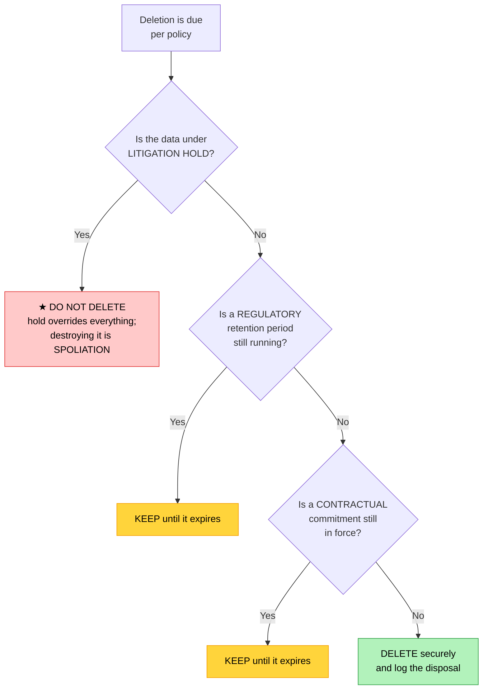

# Objective 4.2 — Compare and contrast aspects of compliance and regulation

> **Domain 4.0 — Security (19% of exam)** · Exam CV0-004 V4 · Objectives doc v5.0
> **Status:** Exam-ready · **Version:** 2.0 (enhanced) · Supersedes `full notes/Objective-4.2-Compliance-Regulation.md`

---

## 0. How to use this note

| Pass | What to read | Time |
|---|---|---|
| **1st (learn)** | Sections 1 → 8 in order | ~55 min |
| **2nd (drill)** | Section 3.1 (sovereignty vs locality) + Section 7.5 (attestation vs certification) + Section 2.3 (compliance inheritance) | ~20 min |
| **3rd (test)** | Section 11 (practice) + Section 12 (PBQ drills) | ~30 min |
| **Exam eve** | Section 13 (60-second recall sheet) only | ~4 min |

> 📌 **Three distinctions carry this objective:** **sovereignty vs locality** (legal consequence vs physical place), **attestation vs certification** (SOC 2 vs ISO 27001), and **what compliance you inherit vs what you still own**. Everything else is vocabulary around them.

---

## 1. Official objective coverage

> **4.2 Compare and contrast aspects of compliance and regulation.**
> - Data sovereignty
> - Data ownership
> - Data locality
> - Data classification
> - **Data retention**
>   - Litigation hold
>   - Contractual
>   - Regulatory
> - **Industry standards**
>   - Systems and Organization Controls 2 (SOC 2)
>   - Payment Card Industry Data Security Standards (PCI DSS)
>   - International Organization for Standardization (ISO) 27001
>   - Cloud Security Alliance

### 1.1 What the verb tells you

**"Compare and contrast"** — questions are built from the differences between similar-sounding terms. The dangerous pairs here are **sovereignty vs locality**, **the three retention drivers**, and **the four standards**, which differ in what they cover, who issues them, and whether they are law.

### 1.2 Coverage checklist

- [ ] I can distinguish **data sovereignty** from **data locality/residency**
- [ ] I know **who owns** customer data in the cloud, and who is **controller** vs **processor**
- [ ] I know the standard **classification levels** and that classification **drives controls**
- [ ] I can name the **three retention drivers** and which **overrides** the others
- [ ] I know a **litigation hold** suspends normal deletion
- [ ] I know **SOC 2 Type I vs Type II**
- [ ] I know **SOC 2 is an attestation** and **ISO 27001 is a certification**
- [ ] I know **PCI DSS is contractual, not law**
- [ ] I know what the **Cloud Security Alliance** provides (CCM, CAIQ, **STAR**)
- [ ] I know **the provider's certifications do not make me compliant**
- [ ] I know why **key custody** is a sovereignty control

---

## 2. The core mental model

### 2.1 The four questions compliance asks about data

```text
   ┌──────────────────────────────────────────────────────────────┐
   │ ① WHERE is it?      → DATA LOCALITY / RESIDENCY              │
   │                       the physical place you choose           │
   ├──────────────────────────────────────────────────────────────┤
   │ ② WHOSE LAWS        → DATA SOVEREIGNTY                        │
   │   apply to it?        the legal consequence of ①              │
   ├──────────────────────────────────────────────────────────────┤
   │ ③ WHOSE is it?      → DATA OWNERSHIP                          │
   │                       customer owns; provider is custodian    │
   ├──────────────────────────────────────────────────────────────┤
   │ ④ HOW SENSITIVE,    → DATA CLASSIFICATION → drives controls   │
   │   and HOW LONG?       DATA RETENTION      → drives lifecycle  │
   └──────────────────────────────────────────────────────────────┘
                              │
                              ▼
              INDUSTRY STANDARDS tell you what "good"
              looks like, and give you something to
              PROVE to auditors and customers
```

### 2.2 Compliance is about evidence, not intent

```text
   BEING SECURE           ≠           BEING COMPLIANT
   ─────────────                      ───────────────
   The control works                  You can PROVE the control
                                      worked, for the whole period,
                                      to a third party

   ★ This is why compliance drives: logging and retention (3.1),
     immutable audit trails (3.3), documented policy, and
     periodic testing. "We do that" is not evidence.
```

### 2.3 ★ Compliance inheritance — the point people get wrong

```text
   ┌────────────────────────────────────────────────────────────────┐
   │  WHAT YOU INHERIT from the provider's certifications           │
   │    physical security · environmental controls · hardware       │
   │    lifecycle · hypervisor · the provider's own processes       │
   │    → they hand you an audit report; you cite it as evidence    │
   ├════════════════════════════════════════════════════════════════┤
   │  WHAT REMAINS YOURS regardless of any provider certification   │
   │    data classification · access control and IAM · encryption   │
   │    choices and KEY CUSTODY · network exposure · retention      │
   │    and deletion · logging and evidence · your application ·    │
   │    which REGION you chose                                      │
   └────────────────────────────────────────────────────────────────┘

   ★ "Our provider is ISO 27001 certified, therefore we are
     compliant" is FALSE. You inherit controls, not compliance.
     This is the shared responsibility model (1.1) applied to audit.
```

---

## 3. Sovereignty, locality, and residency

### 3.1 ★ The distinction that gets tested

```text
   DATA LOCALITY / RESIDENCY        DATA SOVEREIGNTY
   ─────────────────────────        ────────────────
   WHERE the data physically         WHOSE LAWS govern it
   sits — the region, country,       — determined by where it
   or data centre                    physically sits

   It is a PLACE.                    It is a LEGAL CONSEQUENCE.
   It is the CONTROL you set.        It is the RESULT.

   ┌──────────────────────────────────────────────────────────────┐
   │  You CHOOSE locality (pick the region).                       │
   │  Sovereignty then APPLIES TO YOU whether you like it or not.  │
   └──────────────────────────────────────────────────────────────┘

   ★ THE CONSEQUENCE THAT MATTERS
     Data stored in a country is subject to that country's laws —
     including lawful government access requests — REGARDLESS of
     who owns the data or where the company is headquartered.
     Moving data across a border changes which government can
     compel its disclosure.
```

| | **Data locality / residency** | **Data sovereignty** |
|---|---|---|
| Answers | **Where** is it stored? | **Whose laws** apply to it? |
| Nature | A physical/technical fact you control | A **legal** condition that follows from it |
| Set by | Your region and replication choices | The jurisdiction of that location |
| Example requirement | "Citizen data must remain in-country" | "In-country data is subject to national law and lawful access" |
| Control | Choose the region; restrict cross-region replication and backups | Cannot be configured away — only influenced by choosing location and **key custody** |

> ⚠️ **The most common design failure:** the primary region is compliant, but a **backup, replica, log stream, or CDN cache** quietly puts a copy somewhere else. Residency requirements apply to **every copy**, including backups (3.3) and observability data (3.1).

### 3.2 Key custody as a sovereignty control

If the provider holds the encryption keys, the provider can be compelled to decrypt. Holding keys yourself narrows that exposure:

| Model | Who holds the key | Sovereignty implication |
|---|---|---|
| **Provider-managed keys** | Provider | Convenient; the provider can technically decrypt |
| **Customer-managed keys (CMK/BYOK)** | Provider stores, customer controls policy | Customer can revoke access; still within the provider's systems |
| **Hold-your-own-key / external key store** | **Customer, outside the provider** | Strongest separation; provider cannot decrypt without you |

---

## 4. Data ownership

| | |
|---|---|
| **The rule** | **The customer owns their data.** The provider owns the infrastructure and acts as a **custodian/processor** — it stores and processes data on the customer's instruction |
| **Why it matters** | Ownership determines who decides access, encryption, retention, deletion, and disclosure — and **who is accountable to the regulator** |
| **Check the contract** | Ownership, permitted use (may the provider use your data to train models?), deletion on termination, **data portability and exit**, and breach-notification duties |
| **Exam triggers** | "who owns the data in the cloud", "the provider is a custodian", "exit and data return", "the provider may not use customer data for other purposes" |

**Controller vs processor** (privacy-regulation vocabulary worth recognising):

| | **Controller** | **Processor** |
|---|---|---|
| Decides | **Why and how** data is processed | Nothing — acts **on instruction** |
| Usually | The **customer** | The **cloud provider** |
| Accountable to the regulator | ✅ **Yes** | Has direct duties, but the controller is accountable |

> ★ **Responsibility can be delegated; accountability cannot** — the same principle as the shared responsibility model in 1.1. The regulator fines the controller, not the provider.

---

## 5. Data classification

| | |
|---|---|
| **Definition** | Labelling data by **sensitivity and business impact** so that protection is proportionate. |
| **Why it matters** | It is the **input to every other control decision** — encryption, access, retention, residency, logging, and which environments the data may enter |
| **Exam triggers** | "label data by sensitivity", "right-size the controls", "public vs confidential", "handling requirements" |

```text
   TYPICAL LEVELS              CONTROLS THEY DRIVE
   ┌──────────────┐
   │ RESTRICTED   │  strongest: encryption + CMK, MFA, least privilege,
   │ (regulated)  │  full audit logging, residency limits, DLP,
   │ PII/PHI/CHD  │  no use in non-production, approval to access
   ├──────────────┤
   │ CONFIDENTIAL │  encryption, role-based access, audit logging,
   │              │  masking in non-production
   ├──────────────┤
   │ INTERNAL     │  authentication required, standard logging
   ├──────────────┤
   │ PUBLIC       │  integrity only — no confidentiality requirement
   └──────────────┘

   ★ Classification is what stops you spending vault-grade money on
     a marketing PDF, and equally stops you leaving customer records
     on a public bucket.
```

**Regulated data types worth recognising:** **PII** (personal data) · **PHI** (health data) · **cardholder data / CHD** (payment cards) · intellectual property · financial records.

---

## 6. Data retention

### 6.1 The three drivers — and which wins

```text
   ① REGULATORY   imposed by LAW or a regulator
                  "financial records for 7 years"
                  ⚠ non-compliance = fines, sanctions

   ② CONTRACTUAL  agreed with a customer, partner, or in an SLA
                  "we will retain your logs for 12 months"
                  ⚠ non-compliance = breach of contract

   ③ LITIGATION HOLD (legal hold)
                  ★ triggered by actual or ANTICIPATED litigation
                  ★ SUSPENDS ALL NORMAL DELETION for the affected
                    data — including automated lifecycle expiry
                  ⚠ destroying data under hold = SPOLIATION, which
                    carries severe legal sanction

   ┌──────────────────────────────────────────────────────────────┐
   │ ★ RESOLUTION RULE                                             │
   │   A LITIGATION HOLD OVERRIDES EVERYTHING — including          │
   │   scheduled deletion and even erasure requests.               │
   │   Otherwise, the LONGEST APPLICABLE requirement governs.      │
   └──────────────────────────────────────────────────────────────┘
```

### 6.2 Over-retention is also a risk

| Keeping too little | Keeping too long |
|---|---|
| Regulatory penalty | **Data-minimisation breach** (privacy regulation) |
| Cannot produce evidence in an audit | Larger breach blast radius |
| **Spoliation** if under legal hold | Storage cost (see 1.8) |
| Lost forensic capability | Greater e-discovery burden and legal exposure |

> ⚠️ **Retention conflicts are real exam scenarios.** A privacy "right to erasure" request against records under an active **legal hold** or a statutory retention period does not simply delete them — the hold or the statute prevails, and the request is refused with a documented basis.

### 6.3 Making retention real

| Mechanism | Purpose |
|---|---|
| **Lifecycle policies** | Automate transition and expiry (see 1.4) |
| **Object lock / WORM** | Make records **immutable** for the retention period — required where tamper-evidence matters (3.3) |
| **Legal hold flag** | Suspends deletion regardless of policy |
| **Audit logging of deletion** | Evidence that disposal followed policy |
| **Secure destruction** | **Crypto-shredding** and documented disposal (3.4) |



---

## 7. Industry standards

### 7.1 SOC 2

| | |
|---|---|
| **What** | An **attestation report** on a service organisation's controls, produced by an independent auditor (a CPA firm) against the **Trust Services Criteria**. |
| **Criteria** | **Security** (mandatory), plus optionally **Availability**, **Processing Integrity**, **Confidentiality**, **Privacy** |
| **★ Type I vs Type II** | **Type I** — are the controls **suitably designed** at a **point in time**? **Type II** — did they **operate effectively over a period** (typically 3–12 months)? **Type II is the meaningful one** |
| **Output** | A **report**, usually shared under NDA — not a public certificate |
| **Who cares** | Enterprise customers performing vendor due diligence |
| **Exam triggers** | "service organisation controls", "Type II report", "operating effectiveness over a period", "auditor's attestation" |

### 7.2 PCI DSS

| | |
|---|---|
| **What** | The **Payment Card Industry Data Security Standard** — security requirements for anyone who stores, processes, or transmits **cardholder data**. |
| **★ Status** | **Not a law** — a **contractual obligation** imposed by the card brands. Non-compliance means fines, higher fees, or losing the ability to take card payments |
| **Scope** | The **cardholder data environment (CDE)** — and **network segmentation reduces scope**, which is the single biggest cost lever |
| **Validation** | By merchant level: larger merchants need an assessor-led **Report on Compliance**; smaller ones may use a **self-assessment questionnaire** |
| **Themes** | Segmentation, encryption of cardholder data, access control, **logging and monitoring**, vulnerability management, **no default credentials**, supported software |
| **Exam triggers** | "credit card data", "cardholder data environment", "segmentation to reduce scope", "card brands require it" |

### 7.3 ISO/IEC 27001

| | |
|---|---|
| **What** | An international standard for an **Information Security Management System (ISMS)** — a documented, risk-based management framework, not a technical checklist. |
| **★ Status** | **Certifiable.** An accredited body audits you and issues a **certificate**, maintained through surveillance audits on a multi-year cycle |
| **Emphasis** | Risk assessment and treatment, management commitment, documented processes, **continual improvement**, and a set of reference controls |
| **Who cares** | International customers and regulators; widely recognised as a baseline of security maturity |
| **Exam triggers** | "ISMS", "internationally recognised certification", "risk-based management system", "certified by an accredited body" |

### 7.4 Cloud Security Alliance (CSA)

| | |
|---|---|
| **What** | A non-profit that publishes **cloud-specific** security guidance and a public assurance registry. |
| **Key artefacts** | **CCM** — Cloud Controls Matrix, a cloud control framework mapped to other standards · **CAIQ** — a standard questionnaire providers answer · **STAR** registry (**Security, Trust, Assurance and Risk**) — publicly published provider assurance |
| **STAR levels** | **Level 1** self-assessment · **Level 2** third-party audit · **Level 3** continuous monitoring |
| **Why it matters** | Lets a customer compare providers' security posture **without running its own audit** — the practical answer to cloud vendor due diligence |
| **Exam triggers** | "cloud-specific control framework", "STAR registry", "Cloud Controls Matrix", "compare providers' security posture" |

### 7.5 ★ Attestation vs certification — the distinction to memorise

```text
   SOC 2  =  ATTESTATION          ISO 27001  =  CERTIFICATION
   ─────────────────────          ────────────────────────────
   An auditor EXAMINES and        An accredited body AUDITS and
   REPORTS an OPINION on your     ISSUES A CERTIFICATE that your
   controls                       ISMS conforms to the standard

   Output: a REPORT (under NDA)   Output: a public CERTIFICATE
   Scope: controls YOU define,    Scope: a management SYSTEM
          against the Trust               against a fixed standard
          Services Criteria
   Type II covers a PERIOD        Certificate covers a cycle with
                                  surveillance audits

   PCI DSS = a CONTRACTUAL MANDATE (from the card brands, not law)
   CSA     = a FRAMEWORK + public REGISTRY (not a certification body)
```

---

## 8. Comparison tables

### 8.1 ★ The five data aspects

| Aspect | Question | Nature | You control it by |
|---|---|---|---|
| **Locality / residency** | **Where** is it? | Physical fact | Choosing the region; restricting replication, backups, logs, CDN |
| **Sovereignty** | **Whose laws** apply? | Legal consequence | Choosing location — and **key custody** |
| **Ownership** | **Whose** is it? | Contractual/legal | The contract; customer owns, provider is custodian |
| **Classification** | **How sensitive**? | Policy label | Labelling, then mapping labels to controls |
| **Retention** | **How long**? | Policy + law | Lifecycle policies, object lock, legal hold |

### 8.2 The three retention drivers

| | **Regulatory** | **Contractual** | **Litigation hold** |
|---|---|---|---|
| Source | Law or regulator | An agreement or SLA | Actual or anticipated legal action |
| Typical duration | Fixed (e.g. 7 years) | As negotiated | **Until the matter closes** |
| Consequence of breach | Fines, sanctions | Breach of contract | **Spoliation — severe sanction** |
| Can it be overridden? | Only by a longer requirement or a hold | Yes, by law or a hold | ★ **No — it overrides everything** |

### 8.3 ★ The four standards

| | **SOC 2** | **PCI DSS** | **ISO 27001** | **CSA** |
|---|---|---|---|---|
| Type | **Attestation report** | **Contractual standard** | **Certification** | **Framework + registry** |
| Legal force | None (assurance) | **Contractual**, not law | None (assurance) | None |
| Covers | Service organisation controls | **Cardholder data** | An **ISMS** | Cloud-specific controls |
| Issued by | CPA/audit firm | Card brands / PCI SSC | Accredited certification body | Cloud Security Alliance |
| Output | Report, usually under NDA | AoC / ROC / SAQ | **Public certificate** | CCM, CAIQ, **STAR** listing |
| Time dimension | **Type I point-in-time; Type II over a period** | Annual validation | Certification cycle with surveillance | Level 1/2/3 |
| Cloud-specific | ❌ | ❌ | ❌ | ✅ **Yes** |
| Scope lever | Criteria selected | **Segmentation reduces CDE scope** | ISMS scope statement | — |

### 8.4 Requirement → what it drives

| Requirement | Drives |
|---|---|
| "Data must remain in-country" | **Region choice** — and every copy: backups, replicas, logs, CDN |
| "Subject to national law and lawful access" | **Sovereignty** — consider **key custody** and a sovereign/community cloud (2.1) |
| "Who owns the data?" | The **contract** — customer owns, provider is custodian |
| "Protect according to sensitivity" | **Classification** → encryption, IAM, logging, masking |
| "Keep for 7 years, provably unaltered" | **Retention + object lock/WORM** (1.4, 3.3) |
| "Preserve everything relating to this dispute" | **Litigation hold** — suspend all deletion |
| "Prove controls worked all year" | **SOC 2 Type II** |
| "We take card payments" | **PCI DSS** — and segment to reduce scope |
| "Internationally recognised security certification" | **ISO 27001** |
| "Compare cloud providers' security posture" | **CSA STAR / CAIQ** |

---

## 9. Exam traps & distractor patterns

| # | Trap | The truth |
|---|---|---|
| 1 | "Sovereignty and locality are the same" | **Locality is the physical place you choose; sovereignty is the legal consequence that follows.** You control one and inherit the other |
| 2 | "Our provider is ISO 27001 certified, so we are compliant" | ❌ You **inherit controls, not compliance**. Classification, access, encryption, retention, region, and evidence remain yours |
| 3 | "The provider owns data stored on its infrastructure" | The **customer owns** the data; the provider is a **custodian/processor** |
| 4 | "Using a processor transfers accountability" | Responsibility can be delegated; **accountability cannot**. The **controller** answers to the regulator |
| 5 | "Encryption solves data residency" | Encrypted data still **physically resides** somewhere. Residency is about location; **key custody** is the related lever |
| 6 | "Only the primary database must stay in-region" | **Every copy** — backups, replicas, logs, CDN caches, DR sites — is in scope |
| 7 | "PCI DSS is a law" | It is a **contractual obligation** from the card brands. Real consequences, but not legislation |
| 8 | "SOC 2 is a certification" | It is an **attestation report**. **ISO 27001** is the certification |
| 9 | "SOC 2 Type I proves the controls work" | Type I covers **design at a point in time**. **Type II** covers **operating effectiveness over a period** |
| 10 | "A right-to-erasure request always requires deletion" | A **litigation hold** or statutory retention period **prevails**; refuse with a documented basis |
| 11 | "Keeping data longer is always safer" | **Over-retention** breaches data minimisation, enlarges breach impact, and increases e-discovery burden and cost |
| 12 | "Deleting data under legal hold is just a policy breach" | It is **spoliation of evidence**, which carries severe legal sanction |
| 13 | "Classification is paperwork" | It is the **input to every control decision** — encryption, access, retention, residency, and where data may be used |
| 14 | "CSA issues certifications" | CSA publishes a **framework (CCM), a questionnaire (CAIQ), and the STAR registry** — it is not a certification body |
| 15 | "Compliance means being secure" | Compliance means being able to **prove** it to a third party — which is why logging, retention, and immutability matter |

**Disambiguation drill:**

| Pair | The deciding question |
|---|---|
| **Locality vs sovereignty** | The **place**, or the **law that follows from the place**? |
| **Ownership vs custody** | Who **decides** about the data, vs who **holds** it? |
| **Controller vs processor** | Who determines **why and how**, vs who acts **on instruction**? |
| **Regulatory vs contractual retention** | Imposed by **law**, or agreed in an **agreement**? |
| **Retention vs litigation hold** | A **schedule**, or a **freeze that overrides the schedule**? |
| **SOC 2 vs ISO 27001** | **Attestation report** on controls, or **certification** of a management system? |
| **SOC 2 Type I vs II** | **Design at a point in time**, or **effectiveness over a period**? |
| **PCI DSS vs ISO 27001** | **Cardholder data**, contractual — vs an **ISMS**, certifiable |

---

## 10. Keyword → answer trigger table

| If you see… | Think |
|---|---|
| data must remain in-country · choose an in-country region | **Data locality / residency** |
| subject to that nation's laws · government may compel disclosure · foreign jurisdiction | **Data sovereignty** |
| who owns the data stored with the provider | **Data ownership** — customer owns, provider is custodian |
| determines why and how data is processed | **Controller** (customer); processor = provider |
| label by sensitivity · public/internal/confidential/restricted · right-size controls | **Data classification** |
| keep for 7 years by law | **Regulatory retention** |
| we promised the customer 12 months of logs | **Contractual retention** |
| preserve everything relating to this dispute · suspend deletion | **★ Litigation hold — overrides everything** |
| destroyed evidence under hold | **Spoliation** |
| prove controls operated effectively over a period | **SOC 2 Type II** |
| controls suitably designed at a point in time | **SOC 2 Type I** |
| cardholder data · segmentation to reduce scope · card brands require it | **PCI DSS** (contractual, not law) |
| ISMS · internationally recognised certification · accredited body | **ISO 27001** |
| Cloud Controls Matrix · CAIQ · STAR registry | **Cloud Security Alliance** |
| the provider is certified, are we compliant? | **No — you inherit controls, not compliance** |
| provider could be compelled to decrypt | **Key custody — CMK/BYOK or hold-your-own-key** |
| prove it to an auditor | **Evidence: logging, retention, immutability** |

---

## 11. Practice questions

<details>
<summary><b>Q1.</b> A company stores EU customer data in a data centre located in another country. Which concept determines which laws govern that data?</summary>

A. Data locality · **B. Data sovereignty** · C. Data classification · D. Data ownership

**Correct: B — sovereignty.** Data is subject to the laws of the jurisdiction where it physically resides, regardless of who owns it or where the company is headquartered.
- **A wrong:** Locality is the physical **place**; sovereignty is the **legal consequence** of that place.
- **C wrong:** Classification concerns sensitivity.
- **D wrong:** Ownership concerns who controls the data.
</details>

<details>
<summary><b>Q2.</b> A cloud provider holds SOC 2 Type II and ISO 27001. Does this make its customer compliant?</summary>

A. Yes, compliance is inherited in full · **B. No — the customer inherits certain infrastructure controls but retains responsibility for classification, access, encryption, retention, region choice, and evidence** · C. Yes, if the customer signs the contract · D. Only for PCI DSS

**Correct: B.** You inherit **controls**, not compliance. This is the shared responsibility model (1.1) applied to audit.
- **A/C wrong:** Provider certifications cover the provider's scope only.
- **D wrong:** PCI DSS scope is likewise shared, not transferred.
</details>

<details>
<summary><b>Q3.</b> A litigation hold is issued covering three years of email. The retention policy would delete email after 12 months. What happens?</summary>

**A. Deletion is suspended for the affected data — the litigation hold overrides the retention schedule** · B. The policy proceeds; the hold applies only to new data · C. The data is archived and then deleted on schedule · D. The hold applies only if a court orders it

**Correct: A.** A legal hold freezes normal disposal, including automated lifecycle expiry. Destroying data under hold is **spoliation**.
- **B/C wrong:** The hold applies to existing data and suspends deletion entirely.
- **D wrong:** Holds are commonly triggered by **anticipated** litigation, before any order.
</details>

<details>
<summary><b>Q4.</b> What is the difference between SOC 2 Type I and Type II?</summary>

A. Type I is more rigorous · **B. Type I assesses whether controls are suitably designed at a point in time; Type II assesses whether they operated effectively over a period** · C. Type II covers only availability · D. They are issued by different bodies

**Correct: B.** Type II, covering typically 3–12 months of operation, is the report enterprise customers actually want.
- **A wrong:** Type II is the more rigorous.
- **C wrong:** Both cover the selected Trust Services Criteria.
- **D wrong:** Both are attestations by an audit firm.
</details>

<details>
<summary><b>Q5.</b> Which statement about PCI DSS is CORRECT?</summary>

A. It is national legislation · **B. It is a contractual standard imposed by the card brands, and network segmentation reduces the scope of the cardholder data environment** · C. It certifies an ISMS · D. It applies to all personal data

**Correct: B.** PCI DSS is contractual rather than statutory, and segmentation is the primary lever for reducing assessment scope and cost.
- **A wrong:** It is not law, though consequences are real.
- **C wrong:** That is ISO 27001.
- **D wrong:** It applies specifically to cardholder data.
</details>

<details>
<summary><b>Q6.</b> Who owns customer data stored in a public cloud provider's infrastructure?</summary>

**A. The customer — the provider acts as a custodian/processor** · B. The provider, since it owns the storage · C. Joint ownership · D. Whoever holds the encryption keys

**Correct: A.** The customer owns the data and decides on access, encryption, retention, and deletion; the provider processes on instruction.
- **B wrong:** Owning the hardware does not confer ownership of the data.
- **C wrong:** Contracts typically state customer ownership explicitly.
- **D wrong:** Key custody affects control, not legal ownership.
</details>

<details>
<summary><b>Q7.</b> An organisation must keep citizen data within national borders. Which of the following is MOST likely to be overlooked?</summary>

A. The primary database region · **B. Backups, cross-region replicas, log streams, and CDN caches, which may place copies elsewhere** · C. The application code repository · D. The instance type

**Correct: B.** Residency applies to **every copy**. Backups (3.3) and observability data (3.1) are the classic gaps.
- **A wrong:** The primary is usually configured correctly.
- **C/D wrong:** Neither is regulated data placement.
</details>

<details>
<summary><b>Q8.</b> Which framework is specifically cloud-focused and publishes a registry allowing customers to compare providers' security posture?</summary>

A. ISO 27001 · B. SOC 2 · C. PCI DSS · **D. Cloud Security Alliance**

**Correct: D — CSA.** It publishes the **Cloud Controls Matrix**, the **CAIQ** questionnaire, and the **STAR** registry.
- **A/B/C wrong:** All are valuable but none is cloud-specific, and none provides a public comparison registry.
</details>

<details>
<summary><b>Q9.</b> What is the relationship between data classification and security controls?</summary>

A. They are unrelated · **B. Classification determines the level of protection applied — encryption, access control, logging, retention, and where the data may reside** · C. Classification applies only to public data · D. Controls determine classification

**Correct: B.** Classification is the **input** to every other control decision, ensuring protection is proportionate to sensitivity.
- **A/C wrong:** Classification spans all levels and drives controls.
- **D wrong:** The dependency runs the other way.
</details>

<details>
<summary><b>Q10.</b> An organisation receives a data-erasure request for records that are subject to a seven-year statutory retention period. What is the correct response?</summary>

A. Delete the records immediately · **B. Refuse or defer the erasure with a documented legal basis, because the statutory retention obligation prevails** · C. Delete and restore from backup later · D. Transfer the records to another region

**Correct: B.** Where a legal retention obligation or litigation hold applies, it takes precedence over an erasure request; the refusal must be documented.
- **A/C wrong:** Deleting would breach the retention requirement.
- **D wrong:** Relocation does not resolve the conflict.
</details>

<details>
<summary><b>Q11.</b> Which standard results in a publicly verifiable certificate issued by an accredited body?</summary>

A. SOC 2 · **B. ISO 27001** · C. CSA CAIQ · D. PCI DSS SAQ

**Correct: B.** ISO 27001 certifies an ISMS, with a certificate maintained through surveillance audits.
- **A wrong:** SOC 2 produces an **attestation report**, usually shared under NDA.
- **C wrong:** CAIQ is a self-assessment questionnaire.
- **D wrong:** A self-assessment questionnaire is not a public certificate.
</details>

<details>
<summary><b>Q12.</b> A regulator requires that stored audit logs cannot be altered. Which combination satisfies this?</summary>

**A. Retention policy plus object lock/WORM immutability** · B. Encryption at rest only · C. Cross-region replication · D. Longer log verbosity

**Correct: A.** Retention sets the duration; **immutability** provides tamper-evidence (see 1.4, 3.3).
- **B wrong:** Encryption prevents reading, not alteration or deletion.
- **C wrong:** Replication copies changes, including deletions.
- **D wrong:** Verbosity is unrelated to integrity.
</details>

<details>
<summary><b>Q13.</b> Which term describes the physical location where data is stored?</summary>

A. Data sovereignty · **B. Data locality / residency** · C. Data classification · D. Data ownership

**Correct: B.** Locality is the place; **sovereignty** is the legal regime that applies because of it.
- **A/C/D wrong:** Each addresses a different aspect.
</details>

<details>
<summary><b>Q14.</b> Why might an organisation choose to hold its own encryption keys outside the provider?</summary>

**A. So the provider cannot decrypt the data even if legally compelled, strengthening the sovereignty position** · B. To improve performance · C. To reduce storage cost · D. Because provider-managed keys are not encrypted

**Correct: A.** Key custody is a sovereignty and control lever — if the provider holds the keys, it can be compelled to use them.
- **B/C wrong:** External key management typically adds latency and cost.
- **D wrong:** Provider-managed keys are still cryptographically sound.
</details>

<details>
<summary><b>Q15.</b> Which retention driver arises from an agreement with a customer rather than from law?</summary>

A. Regulatory · **B. Contractual** · C. Litigation hold · D. Classification

**Correct: B.** Contractual retention is negotiated — for example an SLA promising 12 months of log availability.
- **A wrong:** Regulatory retention is imposed by law.
- **C wrong:** A hold arises from actual or anticipated litigation.
- **D wrong:** Classification concerns sensitivity, not duration.
</details>

<details>
<summary><b>Q16.</b> Under privacy regulation, which party is accountable to the regulator for how personal data is processed?</summary>

**A. The controller — normally the cloud customer** · B. The processor — normally the cloud provider · C. Both equally in all cases · D. The data subject

**Correct: A.** The controller determines why and how data is processed and answers to the regulator, even though processors have their own direct duties.
- **B wrong:** The processor acts on instruction.
- **C wrong:** Accountability sits with the controller.
- **D wrong:** The data subject is the individual whose data it is.
</details>

<details>
<summary><b>Q17.</b> Which action MOST reduces the cost and effort of a PCI DSS assessment?</summary>

A. Encrypting all company data · **B. Network segmentation to shrink the cardholder data environment** · C. Obtaining ISO 27001 certification · D. Increasing log retention

**Correct: B.** Scope drives cost; segmenting the CDE removes systems from assessment entirely.
- **A wrong:** Broad encryption is good practice but does not reduce scope.
- **C wrong:** Different standard; it does not substitute.
- **D wrong:** Longer retention increases cost.
</details>

<details>
<summary><b>Q18.</b> An auditor asks for evidence that access controls functioned correctly throughout the past year. What is needed?</summary>

**A. Retained, tamper-evident audit logs covering the whole period** · B. A copy of the security policy · C. The provider's certificate · D. A current configuration screenshot

**Correct: A.** Compliance is about **provable** operation over time, which is why logging, retention, and immutability are compliance controls (3.1, 3.3).
- **B wrong:** Policy states intent, not operation.
- **C wrong:** The provider's certificate covers the provider's scope.
- **D wrong:** A snapshot proves nothing about the period.
</details>

<details>
<summary><b>Q19.</b> Which of the following is NOT a legal requirement, yet carries real business consequences for non-compliance?</summary>

A. GDPR · **B. PCI DSS** · C. National data-residency law · D. Sector financial regulation

**Correct: B.** PCI DSS is a **contractual** standard from the card brands; failing it can bring fines, higher fees, or loss of card-processing ability.
- **A/C/D wrong:** All are legal or regulatory obligations.
</details>

<details>
<summary><b>Q20.</b> What risk arises from retaining data longer than required?</summary>

A. None; more data is always safer · **B. Breach of data-minimisation obligations, a larger breach blast radius, higher storage cost, and greater e-discovery burden** · C. Loss of certification automatically · D. Reduced availability

**Correct: B.** Retention is bounded on **both** sides — too little breaches retention obligations, too much breaches minimisation and increases exposure.
- **A wrong:** Over-retention is a genuine risk.
- **C/D wrong:** Neither follows automatically.
</details>

<details>
<summary><b>Q21.</b> Which describes the Cloud Controls Matrix?</summary>

**A. A cloud-specific control framework published by the CSA and mapped to other standards** · B. A certification issued by ISO · C. A PCI DSS self-assessment form · D. A SOC 2 report type

**Correct: A.** The CCM lets organisations assess cloud controls and map them onto frameworks they already report against.
- **B/C/D wrong:** Each belongs to a different body or standard.
</details>

<details>
<summary><b>Q22.</b> A company must satisfy a 3-year contractual retention and a 7-year regulatory retention for the same records. How long must it keep them?</summary>

A. 3 years · **B. 7 years — the longest applicable requirement governs** · C. 5 years, the average · D. Either, at the company's discretion

**Correct: B.** Where multiple obligations apply, the longest governs — and a litigation hold would extend it further.
- **A/C/D wrong:** Satisfying only the shorter period breaches the regulatory obligation.
</details>

<details>
<summary><b>Q23.</b> Which classification level would typically require encryption with customer-managed keys, MFA, full audit logging, and prohibition of use in non-production environments?</summary>

A. Public · B. Internal · C. Confidential · **D. Restricted (regulated data such as PII, PHI, or cardholder data)**

**Correct: D.** The most sensitive tier attracts the strongest controls, including restrictions on where the data may be used at all.
- **A/B/C wrong:** Each attracts progressively lighter controls.
</details>

<details>
<summary><b>Q24.</b> What does data sovereignty imply that data locality alone does not?</summary>

**A. That the data becomes subject to the laws of that jurisdiction, including potential lawful government access, regardless of who owns it** · B. That the data is encrypted · C. That the data is replicated · D. That the customer loses ownership

**Correct: A.** Locality is a technical fact; sovereignty is the legal exposure that follows, which is precisely why sovereign and community clouds exist (see 2.1).
- **B/C wrong:** Neither follows from location.
- **D wrong:** Ownership is unaffected.
</details>

<details>
<summary><b>Q25.</b> An enterprise customer performing vendor due diligence asks for evidence that a SaaS provider's controls operated effectively over the last year. What should the provider supply?</summary>

A. An ISO 27001 certificate only · **B. A SOC 2 Type II report covering that period** · C. A PCI DSS SAQ · D. A CSA STAR Level 1 self-assessment

**Correct: B.** Type II is precisely an opinion on **operating effectiveness over a period**.
- **A wrong:** Useful assurance, but it certifies a management system rather than reporting on control operation over the period.
- **C wrong:** Applies to cardholder data.
- **D wrong:** Level 1 is a self-assessment, not independent evidence.
</details>

---

## 12. PBQ-style drills

### Drill A — Name the aspect

| # | Statement | Aspect? |
|---|---|---|
| 1 | "Citizen records must be stored in a national data centre" | |
| 2 | "Records held here are subject to this country's laws" | |
| 3 | "The customer, not the provider, controls deletion" | |
| 4 | "This dataset is labelled Restricted" | |
| 5 | "Financial records must be kept 7 years" | |
| 6 | "Preserve all documents relating to the dispute" | |

<details><summary>Answers</summary>

1 → **Data locality/residency** · 2 → **Data sovereignty** · 3 → **Data ownership** · 4 → **Data classification** · 5 → **Regulatory retention** · 6 → **Litigation hold**
</details>

### Drill B — Which standard?

| # | Requirement | Standard? |
|---|---|---|
| 1 | Prove controls operated effectively over 12 months | |
| 2 | We process credit card payments | |
| 3 | Internationally recognised certification of a security management system | |
| 4 | Compare several cloud providers' security posture without auditing them | |
| 5 | Controls suitably designed as at 30 June | |

<details><summary>Answers</summary>

1 → **SOC 2 Type II** · 2 → **PCI DSS** · 3 → **ISO 27001** · 4 → **CSA STAR / CAIQ** · 5 → **SOC 2 Type I**
</details>

### Drill C — Resolve the retention conflict

| # | Situation | Outcome? |
|---|---|---|
| 1 | Policy says delete at 12 months; regulation requires 7 years | |
| 2 | Regulation requires 7 years; litigation hold issued in year 3 | |
| 3 | Contract says 2 years; regulation says 5 years | |
| 4 | Erasure request received for data under active legal hold | |
| 5 | No obligation applies; data is 10 years old | |

<details><summary>Answers</summary>

1 → **Keep 7 years** — longest applicable requirement governs
2 → **Do not delete at 7 years** — the hold suspends disposal until the matter closes
3 → **Keep 5 years**
4 → **Refuse/defer with a documented basis** — the hold prevails; deleting would be **spoliation**
5 → **Delete securely and log the disposal** — over-retention is its own risk
</details>

### Drill D — Inherit or own?

For a customer running workloads on a SOC 2 and ISO 27001 certified provider, mark each as **inherited** or **still yours**.

| # | Control |
|---|---|
| 1 | Physical data-centre security |
| 2 | Choosing which region data is stored in |
| 3 | Hypervisor patching |
| 4 | Who has administrative access to your account |
| 5 | Encryption key custody |
| 6 | Retention and deletion of your records |
| 7 | Hardware disposal and media sanitisation |
| 8 | Evidence that your access reviews took place |

<details><summary>Answers</summary>

**Inherited:** 1, 3, 7
**Still yours:** 2, 4, 5, 6, 8

★ The pattern is identical to 1.1: the provider secures the infrastructure; **data, identity, configuration, and evidence remain yours** — and so does accountability to the regulator.
</details>

---

## 13. 60-second recall sheet

```text
╔══════════════════════════════════════════════════════════════════════╗
║  4.2 — COMPLIANCE AND REGULATION                                     ║
╠══════════════════════════════════════════════════════════════════════╣
║  ★ LOCALITY vs SOVEREIGNTY                                           ║
║   LOCALITY/RESIDENCY = WHERE it physically sits — the CONTROL        ║
║                        you choose (region)                           ║
║   SOVEREIGNTY        = WHOSE LAWS apply — the CONSEQUENCE            ║
║     → data in a country is subject to that country's law, INCLUDING  ║
║       lawful government access, whoever owns it                      ║
║   ⚠ Residency applies to EVERY COPY: backups, replicas, LOGS, CDN   ║
║   Key custody (CMK/BYOK/HYOK) is the sovereignty lever               ║
╠══════════════════════════════════════════════════════════════════════╣
║  OWNERSHIP  CUSTOMER owns the data · provider is CUSTODIAN/PROCESSOR ║
║   CONTROLLER (customer) decides why/how → ACCOUNTABLE to regulator   ║
║   PROCESSOR (provider) acts on instruction                           ║
║   ★ Responsibility delegates; ACCOUNTABILITY DOES NOT                ║
║  CLASSIFICATION  PUBLIC → INTERNAL → CONFIDENTIAL → RESTRICTED       ║
║   drives encryption, IAM, logging, retention, residency, masking     ║
╠══════════════════════════════════════════════════════════════════════╣
║  ★ RETENTION — THREE DRIVERS                                         ║
║   REGULATORY   by law (7 years) · breach = fines                     ║
║   CONTRACTUAL  by agreement/SLA · breach = contract breach           ║
║   LITIGATION HOLD  actual/ANTICIPATED litigation                     ║
║     ★ OVERRIDES EVERYTHING incl. scheduled deletion and erasure      ║
║       requests · deleting = SPOLIATION (severe sanction)             ║
║   Otherwise: LONGEST APPLICABLE REQUIREMENT GOVERNS                  ║
║   ⚠ OVER-retention is ALSO a risk: minimisation breach, bigger       ║
║     blast radius, cost, e-discovery burden                           ║
╠══════════════════════════════════════════════════════════════════════╣
║  ★ THE FOUR STANDARDS                                                ║
║   SOC 2      ATTESTATION REPORT (CPA firm) · Trust Services Criteria ║
║              TYPE I = design at a POINT IN TIME                      ║
║              TYPE II = OPERATING EFFECTIVENESS OVER A PERIOD ← real  ║
║   PCI DSS    CARDHOLDER DATA · ★ CONTRACTUAL, NOT LAW (card brands)  ║
║              ★ SEGMENTATION REDUCES CDE SCOPE = the cost lever       ║
║   ISO 27001  ★ CERTIFICATION of an ISMS by an accredited body        ║
║   CSA        cloud-specific: CCM (controls) · CAIQ (questionnaire) · ║
║              STAR registry L1 self / L2 audit / L3 continuous        ║
║   ATTESTATION (SOC 2 = report) vs CERTIFICATION (ISO = certificate)  ║
╠══════════════════════════════════════════════════════════════════════╣
║  ★ COMPLIANCE INHERITANCE                                            ║
║   INHERIT: physical security · hardware · hypervisor · provider ops  ║
║   STILL YOURS: classification · IAM · ENCRYPTION + KEY CUSTODY ·     ║
║     region choice · retention/deletion · LOGGING AND EVIDENCE · app  ║
║   ⚠ "Our provider is certified so we are compliant" = FALSE         ║
║  COMPLIANCE = being able to PROVE it (logs, retention, immutability) ║
╚══════════════════════════════════════════════════════════════════════╝
```

---

## 14. Cross-references

| Related objective | Connection |
|---|---|
| **1.1 Service models** | **Compliance inheritance is the shared responsibility model applied to audit** — you inherit controls, never accountability |
| **1.2 Service availability** | Data residency constrains region and DR-site selection; multicloud raises sovereignty questions |
| **1.4 Storage** | **Object lock/WORM** delivers immutable retention; archive tiering makes long retention affordable |
| **1.8 Cost considerations** | Retention duration is a direct cost driver; tagging supports data inventory |
| **2.1 Deployment models** | **Sovereign and community clouds** exist because of residency and jurisdiction requirements; single tenancy may be mandated |
| **2.3 Cloud migration** | Regulatory and compliance are two of the eleven migration considerations; residency constrains the target region |
| **3.1 Observability** | Log retention periods and immutable audit trails are compliance-driven — and logs are themselves regulated data |
| **3.3 Backup and recovery** | Backups must satisfy the same residency and retention rules; legal hold suspends backup expiry |
| **3.4 Resource life cycle** | Check retention and legal hold **before** decommissioning; running past **EOS** can fail an audit |
| **4.1 Vulnerability management** | Frameworks mandate scanning frequency, remediation timeframes, and evidence |
| **4.3 IAM** | Access reviews, least privilege, and audit trails are the evidence auditors ask for |

> 🔑 **Carry this forward:** compliance questions reduce to four asks — **where is it, whose laws apply, how sensitive is it, and how long must it be kept** — and one rule: you inherit controls from your provider, but **never accountability**.

---

*Source of truth: CompTIA Cloud+ CV0-004 V4 Exam Objectives, document version 5.0. SOC 2, PCI DSS, ISO 27001, and CSA descriptions reflect the standards as commonly examined; controller/processor terminology follows GDPR. This is exam preparation, not legal advice — obligations vary by jurisdiction and sector.*
