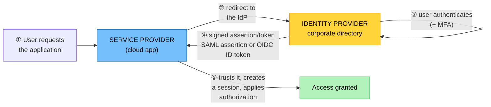

# Objective 4.3 — Given a scenario, implement identity and access management

> **Domain 4.0 — Security (19% of exam)** · Exam CV0-004 V4 · Objectives doc v5.0
> **Status:** Exam-ready · **Version:** 2.0 (enhanced) · Supersedes `full notes/Objective-4.3-Identity-Access-Management.md`

---

## 0. How to use this note

| Pass | What to read | Time |
|---|---|---|
| **1st (learn)** | Sections 1 → 9 in order | ~75 min |
| **2nd (drill)** | Section 2.2 (management vs resource plane) + 5.6 (SAML/OIDC/OAuth) + 6 (authorization models) | ~25 min |
| **3rd (test)** | Section 11 (practice) + Section 12 (PBQ drills) | ~35 min |
| **Exam eve** | Section 13 (60-second recall sheet) only | ~6 min |

> 📌 **The largest objective in Domain 4**, and the one with the most confusable terms. The highest-value item is **SAML vs OIDC vs OAuth 2.0** — OAuth is *authorization*, OIDC adds *authentication* on top of it, and SAML does both in XML. Get that straight and a whole family of questions becomes easy.

---

## 1. Official objective coverage

> **4.3 Given a scenario, implement identity and access management.**
> - **Secure access to the cloud management environment**
>   - **Programmatic access** — API · SDK
>   - CLI
>   - Web portal
> - **Secure access to the cloud resources**
>   - API · SSH · RDP · Bastion host
> - **Authentication models**
>   - Local users · **Federation (SAML)** · Token-based · Directory-based · **MFA** · OpenID Connect
> - **Authorization models**
>   - Role-based access control · Group-based access control · **OAuth 2.0** · Discretionary
> - **Accounting**
>   - Audit trail

### 1.1 A quirk in the source document

CompTIA's objectives document and its acronym list both expand **CLI** as *"Common Language Infrastructure."* In the context of this objective — listed alongside API, SDK, and web portal as ways of reaching the cloud management environment — it unambiguously means the **command-line interface**. Read it that way; just do not be thrown if the exam reproduces CompTIA's own expansion.

### 1.2 What the verb tells you

**"Given a scenario, implement"** — an **application** objective. You will be given an access requirement and asked to choose the mechanism, the authentication model, and the authorization model — and to spot the insecure option.

### 1.3 Coverage checklist

- [ ] I can distinguish the **management plane** from the **resource plane**
- [ ] I know the four ways into the management environment and that they all reach the same **API**
- [ ] I know the ports for **SSH (22)** and **RDP (3389)**
- [ ] I know what a **bastion host** is for, and its modern alternatives
- [ ] I can define **AAA** — authentication, authorization, accounting
- [ ] I know the difference between **authentication** and **authorization**
- [ ] I can explain **federation** and the **IdP / SP** relationship
- [ ] ★ I know **SAML vs OIDC vs OAuth 2.0** and which one is *not* authentication
- [ ] I know the three **MFA factor categories** and which factor is weakest
- [ ] I can compare **RBAC**, **group-based**, and **discretionary** access control
- [ ] I know why **long-lived static keys** are a problem and what replaces them
- [ ] I know what an **audit trail** must capture and why it must be **immutable**

---

## 2. The core mental model

### 2.1 AAA — the frame for the whole objective

```text
   ┌──────────────────────────────────────────────────────────────┐
   │ AUTHENTICATION   "WHO ARE YOU?"                              │
   │                  proving identity                            │
   │                  → local users, federation/SAML, tokens,     │
   │                    directory, MFA, OIDC                      │
   ├──────────────────────────────────────────────────────────────┤
   │ AUTHORIZATION    "WHAT MAY YOU DO?"                          │
   │                  granting permissions to a proven identity   │
   │                  → RBAC, group-based, OAuth 2.0, DAC         │
   ├──────────────────────────────────────────────────────────────┤
   │ ACCOUNTING       "WHAT DID YOU DO?"                          │
   │                  recording actions for audit and forensics   │
   │                  → the AUDIT TRAIL                            │
   └──────────────────────────────────────────────────────────────┘

   ★ CompTIA's last three bullets are exactly AAA, in order.
     Authentication ALWAYS precedes authorization; accounting
     records the result of both.
```

### 2.2 ★ Two access surfaces — management plane vs resource plane

```text
   ┌─────────────────────────────────────────────────────────────────┐
   │  MANAGEMENT PLANE (control plane)                               │
   │  "Create, configure, and destroy cloud resources"               │
   │                                                                 │
   │   WEB PORTAL ─┐                                                 │
   │   CLI ────────┼──► ★ ALL of these call the SAME PROVIDER API    │
   │   SDK ────────┤      (the portal is just a UI over it)          │
   │   API ────────┘                                                 │
   │                                                                 │
   │   ⚠ COMPROMISE HERE = TOTAL. An attacker can delete             │
   │     everything, exfiltrate data, or spin up resources.          │
   │     Protect with MFA, least privilege, and federation.          │
   ├═════════════════════════════════════════════════════════════════┤
   │  RESOURCE PLANE (data plane)                                    │
   │  "Log in to and use the resources themselves"                   │
   │                                                                 │
   │   SSH (port 22)   → Linux shell access                          │
   │   RDP (port 3389) → Windows desktop access                      │
   │   API             → application-level access to services        │
   │   via a BASTION HOST for anything in a private subnet           │
   └─────────────────────────────────────────────────────────────────┘

   ★ These are SEPARATE surfaces with SEPARATE credentials.
     A user may administer the cloud account without any login to
     the servers — and vice versa. Questions often turn on which
     plane is being described.
```

---

## 3. Secure access to the management environment

| Method | What it is | Best for | Security notes |
|---|---|---|---|
| **Web portal / console** | Browser GUI over the provider API | Exploration, one-off tasks, learning | **MFA mandatory**; avoid using it for repeatable changes — no audit of intent, and it causes **drift** (2.4) |
| **CLI** (command-line interface) | Terminal commands calling the API | Scripting, automation, bulk operations | Credentials sit in config files — protect them; prefer short-lived tokens |
| **SDK** | Language libraries (Python, Java, Go…) calling the API | Building applications that manage resources | Use the **instance/workload identity**, never embedded keys |
| **API** | The REST interface underneath all of the above | Everything, ultimately | Authenticated per request; the surface that must be secured |

> ★ **All four are the same door.** The portal, CLI, and SDK are conveniences over the API. Securing "the management environment" means securing **API access** — which is why credential hygiene and MFA matter more than which tool someone uses.

### 3.1 Protecting the management plane

| Control | Why |
|---|---|
| **MFA on all human accounts** | Password compromise alone must not grant control-plane access |
| **★ Protect the root/owner account** | Use it only for the few tasks that require it; MFA it; store credentials in a break-glass process; do not use it daily |
| **Federation instead of local users** | Central lifecycle — a leaver is disabled once, in the directory |
| **Least privilege + separation of duties** | No standing administrative access |
| **Short-lived credentials over static keys** | Rotate automatically; a leaked token expires |
| **Audit logging of every API call** | The accounting layer (Section 7) |
| **IP/network conditions** | Restrict management access to known networks where practical |

---

## 4. Secure access to cloud resources

### 4.1 The protocols

| | **SSH** | **RDP** |
|---|---|---|
| Port | **22** | **3389** |
| Platform | Linux/Unix (and modern Windows) | Windows desktop |
| Access | Encrypted shell | Graphical desktop |
| Authentication | **Key pairs** (preferred) or password | Password, smart card, certificate |
| Hardening | Disable password auth, disable root login, use key pairs, change default port, restrict source | **Never expose to the internet**, enforce network-level authentication, restrict source |

> ⚠️ **Exposing SSH or RDP directly to the internet (`0.0.0.0/0`) is one of the most exploited misconfigurations there is.** Both are relentlessly scanned and brute-forced. Access must come through a controlled path.

### 4.2 Bastion host (jump box)

```text
   ✗ WRONG                              ✓ RIGHT
   ┌────────┐                           ┌────────┐
   │ Admin  │                           │ Admin  │
   └───┬────┘                           └───┬────┘
       │ SSH/RDP from anywhere              │ SSH/RDP from an
       ▼ open to 0.0.0.0/0                  ▼ allow-listed source
   ┌─────────────────────┐              ┌──────────────────┐
   │  PRIVATE SUBNET     │              │ PUBLIC SUBNET    │
   │  ┌────┐┌────┐┌────┐ │              │  ┌────────────┐  │
   │  │ VM ││ VM ││ VM │ │              │  │  BASTION   │  │ hardened,
   │  └────┘└────┘└────┘ │              │  │    HOST    │  │ minimal,
   │  every host exposed │              │  └─────┬──────┘  │ logged, MFA
   └─────────────────────┘              └────────┼─────────┘
                                        ┌────────▼─────────┐
                                        │ PRIVATE SUBNET   │
                                        │ ┌────┐┌────┐┌───┐│ only the
                                        │ │ VM ││ VM ││VM ││ bastion may
                                        │ └────┘└────┘└───┘│ reach these
                                        └──────────────────┘
```

| | |
|---|---|
| **What** | A single hardened host in a public subnet that is the **only** entry point to instances in private subnets |
| **Why** | Shrinks the attack surface to one auditable machine; centralises logging and MFA; private instances need no public IPs |
| **Hardening** | Minimal software, aggressive patching, MFA, source-IP restriction, session logging, no data stored on it |
| **★ Modern alternatives** | **Managed session services** (browser/agent-based access with no open inbound ports at all) · **VPN** into the private network (1.3) · **zero-trust access brokers**. These remove even the bastion's exposed port |
| **Exam triggers** | "jump box", "single point of entry", "no public IPs on the servers", "administer private instances securely" |

---

## 5. Authentication models

### 5.1 Local users

| | |
|---|---|
| **What** | Accounts defined **within** the individual cloud account, system, or application |
| **Good for** | Small environments, break-glass accounts, service-specific accounts |
| **★ Problems** | **Does not scale** — an identity per person per system · no central lifecycle, so **leavers keep access** · inconsistent password policy · credential sprawl |
| **Exam triggers** | "accounts created directly on each system", "no central directory", "small organisation" |

### 5.2 Directory-based

| | |
|---|---|
| **What** | A **central identity store** (LDAP, Active Directory, or a cloud directory) that many systems authenticate against |
| **Benefit** | One identity per person, central password policy, **one place to disable a leaver**, group membership drives access |
| **Exam triggers** | "central directory", "LDAP", "Active Directory", "single user store for the organisation" |

### 5.3 Federation

| | |
|---|---|
| **What** | A **trust relationship** that lets an identity from one domain (the **identity provider**) be accepted by another (the **service provider** / relying party) — **without** creating an account there. |
| **Why** | **Single sign-on** across organisations and SaaS; the user's credentials never leave the IdP; **deprovisioning is instant and central** — disable in the directory and every federated application is closed |
| **Roles** | **IdP** — authenticates the user and issues an assertion/token. **SP / relying party** — trusts it and grants a session |
| **Exam triggers** | "single sign-on", "corporate credentials for a third-party service", "no separate account needed", "disable once, revoke everywhere" |



### 5.4 Token-based

| | |
|---|---|
| **What** | Authentication produces a **time-limited token** (often a **JWT**) that is presented on subsequent requests instead of credentials |
| **Why it is better than static keys** | **Short-lived** — a leaked token expires · **scoped** to specific permissions · **revocable** · never puts a long-term secret on a client |
| **Where you meet it** | Session tokens, API tokens, assumed-role credentials, OIDC ID tokens, OAuth access tokens |
| **Exam triggers** | "temporary credentials", "expires after N minutes", "bearer token", "assume a role", "no long-lived keys" |

### 5.5 Multifactor authentication (MFA)

```text
   THE THREE FACTOR CATEGORIES — MFA needs TWO DIFFERENT ones

   ① SOMETHING YOU KNOW    password, PIN, security question
   ② SOMETHING YOU HAVE    phone app (TOTP), hardware token,
                           smart card, FIDO2 security key
   ③ SOMETHING YOU ARE     fingerprint, face, iris  (biometrics)

   ⚠ TWO PASSWORDS ARE NOT MFA — that is two of the same factor.

   STRENGTH, WEAKEST TO STRONGEST
     SMS/voice codes   ⚠ vulnerable to SIM-swap and interception
     TOTP app codes    good
     Push approval     good, but watch MFA-fatigue push-bombing
     FIDO2 / hardware  ★ strongest — phishing-resistant
```

| | |
|---|---|
| **Why it matters** | The **single highest-value control** against credential theft — passwords are phished, reused, and leaked constantly |
| **Where it is mandatory** | Root/owner accounts, all administrative and management-plane access, and any access to regulated data |
| **Exam triggers** | "password alone is insufficient", "second factor", "compromised credentials must not grant access", "protect the administrator account" |

### 5.6 ★ SAML vs OIDC vs OAuth 2.0 — the distinction that gets tested

```text
   ┌──────────────────────────────────────────────────────────────┐
   │ OAuth 2.0   =  AUTHORIZATION — DELEGATED ACCESS              │
   │                "let this app act on my behalf, with these    │
   │                 permissions, without giving it my password"  │
   │                ⚠ IT IS **NOT** AN AUTHENTICATION PROTOCOL    │
   │                Issues ACCESS TOKENS with SCOPES              │
   ├──────────────────────────────────────────────────────────────┤
   │ OIDC        =  AUTHENTICATION LAYER **ON TOP OF** OAuth 2.0  │
   │                Adds an ID TOKEN (a JWT) that says WHO the    │
   │                user is. JSON-based, modern, mobile and API   │
   │                friendly. "Sign in with…"                     │
   ├──────────────────────────────────────────────────────────────┤
   │ SAML 2.0    =  AUTHENTICATION **and** authorization data,    │
   │                XML-based, browser-redirect SSO.              │
   │                The established ENTERPRISE federation standard│
   └──────────────────────────────────────────────────────────────┘

              OIDC  =  OAuth 2.0  +  identity
              ─────────────────────────────────
   ★ If a question says "used only to grant an application limited
     access to resources on a user's behalf" → OAuth 2.0.
     If it says "verify who the user is" → OIDC or SAML.
```

| | **SAML 2.0** | **OIDC** | **OAuth 2.0** |
|---|---|---|---|
| Primary purpose | **Authentication** + attributes | **Authentication** | **Authorization (delegation)** |
| Format | **XML** assertions | **JSON / JWT** | JSON tokens |
| Built on | Standalone | **OAuth 2.0** | Standalone |
| Typical use | Enterprise SSO to SaaS, browser-based | Modern web, mobile, APIs, "sign in with…" | Third-party app access to your data |
| Key artefact | SAML **assertion** | **ID token** | **Access token** + scopes |
| Answers | "Who are you, and what are your attributes?" | "Who are you?" | "**What may this app do on your behalf?**" |

> ⚠️ **The classic trap:** treating OAuth 2.0 as a login mechanism. It authorises **an application** to act with delegated permissions; it does not authenticate **a user**. That is precisely the gap OIDC was created to fill. CompTIA reinforces this by listing **OAuth 2.0 under authorization models**, not authentication.

---

## 6. Authorization models

### 6.1 The models

| Model | How access is decided | Strengths | Weaknesses |
|---|---|---|---|
| **RBAC** — role-based | Permissions attach to **roles**; users are assigned roles matching job function | **Scales well**, consistent, easy to audit, supports least privilege and separation of duties | Role explosion if over-granular; roles must be maintained |
| **Group-based** | Permissions attach to **groups**; users inherit through membership | Simple, maps to directory groups, easy joiner/leaver handling | Nested groups obscure effective permissions; **permission creep** as people move roles |
| **OAuth 2.0** | A user **delegates** scoped access to an application | No password sharing; scoped and revocable | Over-broad scopes are commonly granted without scrutiny |
| **Discretionary (DAC)** | The **resource owner** decides who may access their resource | Flexible, easy for users | ⚠️ **Inconsistent and hard to audit** — users over-share; no central policy |

**Adjacent models worth recognising:**

| Model | Meaning |
|---|---|
| **MAC** — mandatory | The **system** enforces access from labels/clearances; users cannot change it. Government and military |
| **ABAC** — attribute-based | Decisions from **attributes** — department, location, device posture, time, data classification. Very granular; the basis of most modern policy conditions |

```text
   WHO DECIDES ACCESS?

   DAC   the RESOURCE OWNER decides         → flexible, inconsistent
   RBAC  your ROLE decides                  → scalable, auditable ★
   MAC   the SYSTEM/policy decides          → rigid, highest assurance
   ABAC  ATTRIBUTES decide (context)        → granular, complex
```

### 6.2 The principles that ride on top

| Principle | Meaning |
|---|---|
| **★ Least privilege** | Grant only the permissions needed for the task, and no more — the single most repeated answer in this objective |
| **Separation of duties** | No one person can complete a sensitive action alone (request vs approve) |
| **Just-in-time (JIT) access** | Elevate temporarily, with approval and expiry — no standing admin rights |
| **Permission creep** | Access accumulates as people change roles; countered by **periodic access reviews / recertification** |
| **Deny by default** | Nothing is permitted unless explicitly granted |
| **Explicit deny wins** | Where policies conflict, an explicit deny normally overrides an allow |

### 6.3 Machine and workload identity

| Problem | The right answer |
|---|---|
| An application needs to call cloud APIs | ★ **Assign an identity/role to the workload** (instance profile, managed identity, workload identity) — the platform supplies **short-lived, auto-rotated** credentials |
| A script needs long-term credentials | Avoid. If unavoidable, store in a **secret store**, scope tightly, and **rotate** |
| Credentials in code or images | ❌ Never — they persist in git history and image layers **forever** (see 2.4, 1.6) |

---

## 7. Accounting — the audit trail

| | |
|---|---|
| **Definition** | Recording **who did what, to what, when, from where, and with what result** — the "third A" of AAA. |
| **What it must capture** | Identity · action · target resource · timestamp (**UTC, synchronised**) · source IP/session · **success or failure** · before/after where relevant |
| **★ Why failures matter** | **Failed** authentication and authorization attempts are the signal of an attack in progress — successes alone hide the reconnaissance |
| **Integrity** | Logs must be **tamper-evident** — write to a separate account/store, apply **object lock/WORM**, and restrict who may delete them (see 1.4, 3.3) |
| **Used for** | Forensics, incident response, compliance evidence, access reviews, detecting privilege misuse |
| **Exam triggers** | "who deleted the bucket", "prove who accessed the record", "non-repudiation", "audit evidence", "track administrative actions" |

> ★ **Accounting is what makes authentication and authorization provable.** Compliance frameworks (4.2) do not ask whether you *have* access control — they ask you to **evidence** that it worked, for the whole period, which is only possible from a retained, immutable audit trail.

> ⚠️ **Never let administrators delete their own audit logs.** Ship logs to a separate account or immutable store — otherwise the first act of a compromised administrator is to erase the evidence.

---

## 8. Comparison tables

### 8.1 ★ Management plane vs resource plane

| | **Management plane** | **Resource plane** |
|---|---|---|
| Purpose | Create, configure, destroy resources | Log in to and use the resources |
| Methods | **Web portal, CLI, SDK, API** | **SSH (22), RDP (3389), API** |
| Identity | Cloud IAM users/roles, federated identities | OS accounts, SSH keys, application accounts |
| Access path | Provider API endpoint | Via **bastion**, VPN, or session service |
| Blast radius if compromised | **Total — delete or exfiltrate everything** | Limited to that host or service |
| Key controls | **MFA**, least privilege, federation, API audit logging | Bastion/session service, key management, no public exposure |

### 8.2 Authentication models

| Model | Identity lives | Scales | Central deprovisioning | Best for |
|---|---|---|---|---|
| **Local users** | On each system | ❌ Poorly | ❌ No | Break-glass, tiny environments |
| **Directory-based** | Central directory | ✅ Yes | ✅ Yes | One organisation, many systems |
| **Federation (SAML/OIDC)** | The **IdP**, trusted by others | ✅ **Best** | ✅ **Instant, everywhere** | SSO to SaaS and across organisations |
| **Token-based** | Issued after authentication | ✅ Yes | ✅ Via expiry/revocation | APIs, workloads, short-lived access |
| **MFA** | An **additional factor**, not a model on its own | — | — | **Everywhere it can be applied** |

### 8.3 Authorization models

| | **RBAC** | **Group-based** | **DAC** | **OAuth 2.0** |
|---|---|---|---|---|
| Decision based on | **Job role** | **Group membership** | **Resource owner's choice** | **Delegated scopes** |
| Central control | ✅ Strong | ✅ Good | ❌ **Weak** | Per-grant |
| Auditability | ✅ **High** | Medium (nesting hides it) | ❌ **Low** | Medium |
| Scales | ✅ **Yes** | ✅ Yes | ❌ No | N/A |
| Main risk | Role explosion | **Permission creep** | **Over-sharing** | **Over-broad scopes** |
| Typical use | Cloud IAM roles | Directory groups | File shares, personal drives | Third-party app access |

### 8.4 Requirement → mechanism

| Requirement | Implement |
|---|---|
| "Administer private instances without public IPs" | **Bastion host** or managed session service |
| "Staff use corporate credentials for a SaaS app" | **Federation (SAML or OIDC)** |
| "Disable a leaver's access everywhere at once" | **Federation / central directory** |
| "A password alone must not grant admin access" | **MFA** |
| "Let an app read a user's calendar without their password" | **OAuth 2.0** |
| "Verify who the user is, for a mobile app" | **OIDC** |
| "Enterprise browser-based SSO to a SaaS portal" | **SAML** |
| "Permissions by job function" | **RBAC** |
| "An application needs cloud API access" | **Workload/instance identity**, not static keys |
| "Temporary elevated access for a change window" | **JIT elevation** with expiry |
| "Prove who deleted the storage bucket" | **Audit trail** (immutable) |
| "Users are accumulating permissions over time" | **Access reviews / recertification** |
| "Protect the root account" | **MFA + break-glass process**, not daily use |

---

## 9. Exam traps & distractor patterns

| # | Trap | The truth |
|---|---|---|
| 1 | "OAuth 2.0 is an authentication protocol" | ❌ It is **authorization/delegation**. **OIDC** is the authentication layer built on top of it — which is why CompTIA lists OAuth under **authorization models** |
| 2 | "SAML and OAuth do the same thing" | **SAML** authenticates (XML, enterprise SSO); **OAuth** delegates access. **OIDC** is the modern JSON equivalent of SAML's authentication role |
| 3 | "Two passwords is MFA" | Two of the **same factor** is not multifactor. You need **two different categories** |
| 4 | "SMS is a strong second factor" | It is the **weakest** — SIM-swap and interception. FIDO2/hardware keys are phishing-resistant |
| 5 | "Authentication and authorization are the same" | **Who you are** vs **what you may do**. Authentication always comes first |
| 6 | "A bastion host is optional if we use strong passwords" | Exposing **SSH/RDP to the internet** is among the most exploited misconfigurations, regardless of password strength |
| 7 | "Local users are fine, they're simpler" | They do not scale and there is **no central deprovisioning** — leavers keep access |
| 8 | "Group-based access is the same as RBAC" | Similar in effect, but groups suffer **permission creep** as people move roles, and nesting obscures effective permissions |
| 9 | "DAC is the most secure model" | It is the **least auditable** — owners over-share and there is no central policy |
| 10 | "The web portal is the safest way to make changes" | It is fine for exploration, but manual changes cause **drift** and lack the reviewability of code (2.4) |
| 11 | "Long-lived access keys are fine if stored securely" | Prefer **workload identity and short-lived tokens** — a leaked static key is valid until someone notices |
| 12 | "Credentials in a private repo are safe" | They live in **git history forever** and in image layers (2.4, 1.6). Rotate them |
| 13 | "Log successful logins only" | **Failed attempts are the attack signal.** Log both |
| 14 | "Administrators should manage their own audit logs" | Ship logs to a **separate account/immutable store** — otherwise a compromised admin erases the evidence first |
| 15 | "Use the root account for day-to-day administration" | Root/owner is for the few tasks that require it — **MFA it and keep it in a break-glass process** |
| 16 | "Least privilege slows people down too much" | It is the **most repeated correct answer** in this objective; JIT elevation resolves the friction |

**Disambiguation drill:**

| Pair | The deciding question |
|---|---|
| **Authentication vs authorization** | Proving **who**, or deciding **what they may do**? |
| **OAuth 2.0 vs OIDC** | Delegating **app access** (OAuth), or establishing **who the user is** (OIDC)? |
| **SAML vs OIDC** | **XML, enterprise, browser SSO** vs **JSON/JWT, modern apps and APIs** |
| **Federation vs directory** | Identity trusted **across** organisations, or a central store **within** one? |
| **RBAC vs group-based** | Permissions by **job role**, or by **group membership**? |
| **DAC vs MAC** | The **owner** decides, or the **system** enforces? |
| **Management vs resource plane** | Configuring the **cloud**, or logging into a **server**? |
| **Bastion vs VPN** | A single hardened **jump host**, or extending the **network** to the user? |

---

## 10. Keyword → answer trigger table

| If you see… | Think |
|---|---|
| create/configure/delete cloud resources · console, CLI, SDK, API | **Management plane** |
| log in to the server · shell · desktop | **Resource plane** |
| port 22 · Linux shell | **SSH** |
| port 3389 · Windows desktop | **RDP** |
| jump box · single entry point · no public IPs on the servers | **Bastion host** |
| no open inbound ports at all for admin access | **Managed session service / VPN / zero trust** |
| corporate credentials for a third-party app · SSO · disable once revoke everywhere | **Federation** |
| XML assertions · enterprise browser SSO | **SAML** |
| ID token · JWT · "sign in with" · mobile and API friendly | **OIDC** |
| let this app act on my behalf with limited scope · no password sharing | **OAuth 2.0 (authorization)** |
| central user store · LDAP · Active Directory | **Directory-based** |
| accounts created on each system separately | **Local users** |
| temporary credentials · expires in 15 minutes · assume a role | **Token-based** |
| second factor · password alone is not enough | **MFA** |
| phishing-resistant second factor | **FIDO2 / hardware key** |
| permissions by job function | **RBAC** |
| permissions inherited from membership | **Group-based** |
| the file owner grants access to whoever they choose | **Discretionary (DAC)** |
| the system enforces labels and clearances | **MAC** |
| decisions based on department, device, location, time | **ABAC** |
| who deleted it · non-repudiation · audit evidence | **Accounting / audit trail** |
| users accumulate access as they change roles | **Permission creep → access reviews** |
| temporary elevation with approval and expiry | **JIT access** |
| application needs to call cloud APIs | **Workload/instance identity, not static keys** |

---

## 11. Practice questions

<details>
<summary><b>Q1.</b> Which statement about OAuth 2.0 is CORRECT?</summary>

A. It authenticates users and issues an ID token · **B. It is an authorization framework for delegated access, allowing an application to act on a user's behalf with scoped permissions** · C. It replaces SAML for enterprise SSO · D. It is an XML-based assertion format

**Correct: B.** OAuth 2.0 grants **delegated authorization**; it does not establish who the user is. That is why CompTIA lists it under **authorization models**.
- **A wrong:** ID tokens come from **OIDC**, the authentication layer built on OAuth.
- **C wrong:** SAML remains the established enterprise browser-SSO standard.
- **D wrong:** That is SAML.
</details>

<details>
<summary><b>Q2.</b> An organisation wants staff to access a SaaS application using their existing corporate credentials, with access revoked automatically when someone leaves. What should be implemented?</summary>

**A. Federation with the corporate identity provider (SAML or OIDC)** · B. Local user accounts in the SaaS application · C. A shared administrator account · D. Discretionary access control

**Correct: A.** Federation means the SaaS trusts assertions from the corporate IdP — credentials never leave it, and **disabling the directory account revokes access everywhere at once**.
- **B wrong:** Local accounts persist after the person leaves.
- **C wrong:** Shared accounts destroy accountability.
- **D wrong:** DAC is an authorization model, not an authentication mechanism.
</details>

<details>
<summary><b>Q3.</b> Which of the following qualifies as multifactor authentication?</summary>

A. A password plus a security question · **B. A password plus a code from a hardware token** · C. Two different passwords · D. A fingerprint plus a retina scan

**Correct: B.** Something you **know** plus something you **have** — two different categories.
- **A wrong:** Both are "something you know."
- **C wrong:** Two of the same factor.
- **D wrong:** Both are "something you are" — strong, but not multifactor.
</details>

<details>
<summary><b>Q4.</b> Administrators need to manage instances in private subnets that have no public IP addresses. What is the appropriate design?</summary>

A. Assign public IPs and restrict by password complexity · **B. Deploy a hardened bastion host in a public subnet as the sole entry point, or use a managed session service with no open inbound ports** · C. Open SSH to 0.0.0.0/0 on all instances · D. Disable SSH entirely

**Correct: B.** A bastion concentrates exposure into one auditable, hardened host; managed session services remove the exposed port altogether.
- **A/C wrong:** Exposing SSH/RDP to the internet is among the most exploited misconfigurations.
- **D wrong:** Administration would become impossible.
</details>

<details>
<summary><b>Q5.</b> What is the difference between authentication and authorization?</summary>

A. They are synonyms · **B. Authentication proves who you are; authorization determines what you are permitted to do** · C. Authorization happens first · D. Authentication applies only to humans

**Correct: B.** Authentication always precedes authorization, and accounting records the outcome of both — the AAA sequence.
- **A/C wrong:** Distinct, and in that order.
- **D wrong:** Workloads and services authenticate too.
</details>

<details>
<summary><b>Q6.</b> An application running on a cloud instance must call provider APIs. What is the MOST secure approach?</summary>

A. Embed an access key in the application code · B. Store a long-lived key in an environment variable · **C. Assign a workload/instance identity so the platform supplies short-lived, automatically rotated credentials** · D. Use the root account's credentials

**Correct: C.** Workload identity removes static secrets entirely — credentials are short-lived and rotated by the platform.
- **A wrong:** Keys in code persist in git history and image layers forever.
- **B wrong:** Better than code, but still a long-lived secret to leak and rotate.
- **D wrong:** Root credentials should never be used by applications.
</details>

<details>
<summary><b>Q7.</b> Which authorization model assigns permissions based on job function and scales best in large organisations?</summary>

A. Discretionary access control · **B. Role-based access control** · C. Mandatory access control · D. OAuth 2.0

**Correct: B — RBAC.** Roles map to job functions, making access consistent, auditable, and easy to grant or revoke as people move.
- **A wrong:** DAC leaves decisions to resource owners and is hard to audit.
- **C wrong:** MAC is system-enforced via labels — rigid, used in high-assurance environments.
- **D wrong:** OAuth delegates application access, not organisational permissions.
</details>

<details>
<summary><b>Q8.</b> Which ports are associated with SSH and RDP respectively?</summary>

**A. 22 and 3389** · B. 21 and 3306 · C. 443 and 22 · D. 3389 and 22

**Correct: A.** SSH is **22**, RDP is **3389**.
- **B wrong:** 21 is FTP, 3306 is MySQL.
- **C wrong:** 443 is HTTPS.
- **D wrong:** The two are reversed.
</details>

<details>
<summary><b>Q9.</b> Which capability does OIDC add that OAuth 2.0 alone does not provide?</summary>

A. Token expiry · **B. Authentication — an ID token establishing who the user is** · C. Encryption of traffic · D. Role-based permissions

**Correct: B.** OIDC is an identity layer **on top of** OAuth 2.0, adding the ID token so relying parties learn the user's identity.
- **A wrong:** OAuth tokens already expire.
- **C wrong:** Transport security is provided by TLS.
- **D wrong:** Neither protocol defines organisational roles.
</details>

<details>
<summary><b>Q10.</b> An auditor asks who deleted a production storage bucket last month. Which capability provides the answer?</summary>

A. Authentication · B. Authorization · **C. Accounting — the audit trail** · D. Federation

**Correct: C.** Accounting records who did what, to what, when, and from where — the third A of AAA.
- **A/B wrong:** Both control access; neither records the action.
- **D wrong:** Federation establishes identity, not history.
</details>

<details>
<summary><b>Q11.</b> Why must audit logs be written to a separate account or immutable store?</summary>

**A. So a compromised administrator cannot delete the evidence of their actions** · B. To reduce storage cost · C. To improve query performance · D. Because logs cannot be encrypted in place

**Correct: A.** If administrators can delete their own audit trail, the first act of a compromise is to erase it. Object lock/WORM and account separation prevent that (see 1.4, 3.3).
- **B/C/D wrong:** None is the security rationale.
</details>

<details>
<summary><b>Q12.</b> Which authentication approach provides the weakest second factor?</summary>

A. FIDO2 hardware security key · B. TOTP authenticator app · **C. SMS text message code** · D. Push notification approval

**Correct: C.** SMS is vulnerable to SIM-swap and interception. Hardware keys are phishing-resistant and strongest.
- **A/B/D wrong:** All are stronger, though push is susceptible to MFA-fatigue attacks.
</details>

<details>
<summary><b>Q13.</b> Users have accumulated permissions over several role changes and now hold far more access than their current jobs require. What addresses this?</summary>

A. Enabling MFA · **B. Periodic access reviews and recertification, plus role-based rather than accumulated group grants** · C. Rotating passwords more often · D. Adding a bastion host

**Correct: B.** This is **permission creep**; reviews recertify who should hold what, and RBAC prevents accumulation by tying access to current role.
- **A/C/D wrong:** All are valuable controls but none removes excess standing permissions.
</details>

<details>
<summary><b>Q14.</b> Which access method should be used for repeatable, auditable changes to cloud infrastructure?</summary>

A. The web portal · **B. Infrastructure as code invoking the API, executed through a pipeline** · C. Manual CLI commands typed ad hoc · D. Direct database edits

**Correct: B.** Code gives review, version history, repeatability, and drift prevention (see 2.4). All access methods reach the same API — the difference is reviewability.
- **A/C wrong:** Both are manual and cause configuration drift.
- **D wrong:** Not a management-plane method.
</details>

<details>
<summary><b>Q15.</b> In a discretionary access control model, who decides who may access a resource?</summary>

A. A central security policy · **B. The resource owner** · C. The system, based on labels · D. The user's role

**Correct: B.** DAC delegates the decision to the owner — flexible, but inconsistent and hard to audit, with over-sharing as the common failure.
- **A/D wrong:** Those describe centrally managed models such as RBAC.
- **C wrong:** That is MAC.
</details>

<details>
<summary><b>Q16.</b> Which statement about the cloud management plane is CORRECT?</summary>

A. It is accessed only through the web portal · **B. The portal, CLI, and SDK all invoke the same provider API, so securing API access secures all of them** · C. It is less sensitive than server access · D. MFA is unnecessary if passwords are strong

**Correct: B.** All the tools are conveniences over one API — which is why credential hygiene and MFA matter more than the tool chosen.
- **A wrong:** Four documented methods exist.
- **C wrong:** Management-plane compromise is **total** — an attacker can destroy or exfiltrate everything.
- **D wrong:** MFA is essential on the management plane.
</details>

<details>
<summary><b>Q17.</b> An organisation wants no standing administrative permissions, granting elevation only when needed and only for a limited period. What is this called?</summary>

A. Discretionary access control · **B. Just-in-time (JIT) access** · C. Federation · D. Token-based authentication

**Correct: B.** JIT elevation removes permanent privilege while keeping work possible, usually with approval and automatic expiry.
- **A/C/D wrong:** None describes time-bound privilege elevation.
</details>

<details>
<summary><b>Q18.</b> Which authentication model does NOT scale well and leaves departed staff with access?</summary>

**A. Local users defined on each individual system** · B. Federation · C. Directory-based · D. Token-based

**Correct: A.** Local accounts require per-system provisioning and, crucially, per-system **deprovisioning** — which is routinely missed.
- **B/C wrong:** Both provide central lifecycle management.
- **D wrong:** Tokens expire by design.
</details>

<details>
<summary><b>Q19.</b> A mobile application needs to verify a user's identity using an existing identity provider, exchanging JSON tokens. Which protocol fits?</summary>

A. SAML · **B. OIDC** · C. LDAP · D. RDP

**Correct: B — OIDC.** JSON/JWT-based and designed for modern web, mobile, and API scenarios.
- **A wrong:** SAML is XML and browser-redirect oriented — awkward for mobile.
- **C wrong:** LDAP is a directory protocol.
- **D wrong:** RDP is remote desktop access.
</details>

<details>
<summary><b>Q20.</b> Which log entries are MOST important for detecting an attack in progress?</summary>

A. Successful logins only · **B. Both successful and failed authentication and authorization attempts** · C. Only administrative actions · D. Only actions during business hours

**Correct: B.** **Failed** attempts reveal reconnaissance and brute-force activity; successes alone hide the attempt phase.
- **A/C/D wrong:** Each omits the signal that indicates an attack underway.
</details>

<details>
<summary><b>Q21.</b> What is the appropriate handling of a cloud account's root/owner credentials?</summary>

**A. Enable MFA, use it only for tasks that require it, and keep the credentials in a controlled break-glass process** · B. Use it for daily administration for convenience · C. Share it among the platform team · D. Store it in the application configuration

**Correct: A.** Root has unrestricted power, so it should be protected, rarely used, and never shared or embedded.
- **B/C/D wrong:** Each dramatically increases blast radius and destroys accountability.
</details>

<details>
<summary><b>Q22.</b> A user grants a third-party analytics application read access to their files without sharing their password. Which model is in use?</summary>

A. SAML federation · B. Directory-based authentication · **C. OAuth 2.0 delegated authorization** · D. Mandatory access control

**Correct: C.** OAuth issues a **scoped access token** so the application acts on the user's behalf without ever seeing credentials.
- **A/B wrong:** Both concern proving identity, not delegating access.
- **D wrong:** MAC is system-enforced labelling.
</details>

<details>
<summary><b>Q23.</b> Which pairing of model to weakness is CORRECT?</summary>

A. RBAC — over-sharing by owners · B. DAC — role explosion · **C. Group-based — permission creep as users change roles** · D. OAuth 2.0 — cannot be revoked

**Correct: C.** Group membership accumulates as people move, and nesting obscures effective permissions.
- **A wrong:** Over-sharing is the **DAC** weakness.
- **B wrong:** Role explosion is the **RBAC** weakness.
- **D wrong:** OAuth grants are revocable; the real risk is over-broad scopes.
</details>

<details>
<summary><b>Q24.</b> Which combination BEST secures administrative access to a cloud environment?</summary>

**A. Federated identities with MFA, least-privilege roles, JIT elevation, and immutable audit logging** · B. Shared administrator account with a long password · C. Local accounts per administrator with password rotation · D. Root credentials distributed to the platform team

**Correct: A.** Central identity with instant deprovisioning, a second factor, minimal standing privilege, and tamper-evident evidence.
- **B/D wrong:** Shared and root credentials destroy accountability.
- **C wrong:** Local accounts do not scale and lack central deprovisioning.
</details>

<details>
<summary><b>Q25.</b> Which principle should guide every permission grant in this objective?</summary>

A. Grant broadly to avoid support tickets · **B. Least privilege — only the permissions required for the task, and no more** · C. Grant by seniority · D. Copy an existing user's permissions

**Correct: B.** Least privilege is the most frequently correct answer across IAM scenarios; JIT elevation resolves the friction it creates.
- **A/C wrong:** Both produce excessive standing access.
- **D wrong:** Copying propagates permission creep.
</details>

---

## 12. PBQ-style drills

### Drill A — Authentication, authorization, or accounting?

| # | Activity | Which A? |
|---|---|---|
| 1 | Verifying a one-time code from an authenticator app | |
| 2 | Deciding whether a user may delete a bucket | |
| 3 | Recording that a user deleted a bucket at 14:22 UTC | |
| 4 | Checking a SAML assertion from the IdP | |
| 5 | Attaching a role granting read-only access | |
| 6 | Reviewing failed login attempts from an unusual country | |

<details><summary>Answers</summary>

1 → **Authentication** · 2 → **Authorization** · 3 → **Accounting** · 4 → **Authentication** · 5 → **Authorization** · 6 → **Accounting** (feeding detection — see 4.6)
</details>

### Drill B — SAML, OIDC, or OAuth 2.0?

| # | Scenario | Which? |
|---|---|---|
| 1 | Enterprise browser SSO to a SaaS portal using XML assertions | |
| 2 | A mobile app verifies user identity with JSON web tokens | |
| 3 | A user lets a third-party app read their calendar without sharing a password | |
| 4 | An ID token is issued describing the authenticated user | |
| 5 | Scoped access tokens are issued to an application | |

<details><summary>Answers</summary>

1 → **SAML** · 2 → **OIDC** · 3 → **OAuth 2.0** · 4 → **OIDC** · 5 → **OAuth 2.0**

**The rule:** OAuth = *what may this app do*; OIDC = *who is this user* (OAuth + identity); SAML = the XML enterprise equivalent of OIDC's role.
</details>

### Drill C — Choose the access mechanism

| # | Requirement | Mechanism? |
|---|---|---|
| 1 | Administer Linux hosts in a private subnet | |
| 2 | Automate resource provisioning in a pipeline | |
| 3 | A one-off investigation of a setting | |
| 4 | An application must read from a managed database | |
| 5 | Give contractors elevated access for one change window | |
| 6 | Windows desktop access to a private server | |

<details><summary>Answers</summary>

1 → **SSH via a bastion host** or managed session service
2 → **IaC calling the API**, authenticated with a pipeline identity (2.4)
3 → **Web portal** (acceptable for read-only exploration)
4 → **Workload/instance identity**, not static keys
5 → **JIT elevation** with approval and expiry
6 → **RDP via a bastion host** or session service
</details>

### Drill D — Fix the insecure design

| # | Current state | Fix? |
|---|---|---|
| 1 | SSH open to 0.0.0.0/0 on every instance | |
| 2 | Access key hard-coded in the application image | |
| 3 | All engineers share one administrator login | |
| 4 | Administrators can delete the audit logs | |
| 5 | Root account used for daily work | |
| 6 | Leavers still have access to three SaaS apps | |

<details><summary>Answers</summary>

1 → **Bastion host or session service**; remove public exposure; restrict source
2 → **Workload identity**; remove the key and **rotate it** — it persists in image layers (1.6)
3 → **Individual federated identities** — shared accounts destroy accountability
4 → Ship logs to a **separate account with object lock/WORM**
5 → **MFA + break-glass process**; use least-privilege roles day to day
6 → **Federate** so directory disablement revokes access everywhere at once
</details>

---

## 13. 60-second recall sheet

```text
╔══════════════════════════════════════════════════════════════════════╗
║  4.3 — IDENTITY AND ACCESS MANAGEMENT                                ║
║  ★ AAA: AUTHENTICATION (who?) → AUTHORIZATION (what may you do?)     ║
║         → ACCOUNTING (what did you do?)  = CompTIA's last 3 bullets  ║
╠══════════════════════════════════════════════════════════════════════╣
║  ★ TWO PLANES                                                        ║
║   MANAGEMENT  create/configure/destroy resources                     ║
║     WEB PORTAL · CLI · SDK · API → ★ ALL CALL THE SAME API           ║
║     ⚠ compromise = TOTAL → MFA, least privilege, federation          ║
║   RESOURCE    log in to the resource itself                          ║
║     SSH :22 (Linux) · RDP :3389 (Windows) · API                      ║
║     ⚠ NEVER expose SSH/RDP to 0.0.0.0/0 → BASTION HOST (single       ║
║       hardened entry, private subnets have no public IPs) or a       ║
║       managed SESSION SERVICE (no open inbound ports at all)         ║
║   (CompTIA's doc expands CLI oddly as "Common Language               ║
║    Infrastructure" — in context it means command-line interface)     ║
╠══════════════════════════════════════════════════════════════════════╣
║  AUTHENTICATION MODELS                                               ║
║   LOCAL USERS   per-system · ⚠ no central deprovisioning → leavers   ║
║                 keep access                                          ║
║   DIRECTORY     central store (LDAP/AD) · one place to disable       ║
║   FEDERATION    IdP ↔ SP trust · SSO · ★ disable once, revoke        ║
║                 EVERYWHERE                                           ║
║   TOKEN-BASED   short-lived, scoped, revocable (JWT) → beats static  ║
║                 keys                                                 ║
║   MFA           2 of 3 DIFFERENT factors: KNOW · HAVE · ARE          ║
║                 ⚠ two passwords ≠ MFA · SMS = WEAKEST ·              ║
║                   FIDO2/hardware = phishing-resistant ★              ║
╠══════════════════════════════════════════════════════════════════════╣
║  ★★ SAML vs OIDC vs OAuth 2.0 — THE #1 TRAP                          ║
║   OAuth 2.0 = AUTHORIZATION / DELEGATION — "let this app act on my   ║
║               behalf with these scopes"  ⚠ NOT AUTHENTICATION       ║
║               (CompTIA lists it under AUTHORIZATION models)          ║
║   OIDC      = AUTHENTICATION layer ON TOP OF OAuth 2.0 · ID TOKEN    ║
║               (JWT) · JSON · modern web/mobile/API · "sign in with"  ║
║   SAML 2.0  = AUTHENTICATION · XML assertions · enterprise browser   ║
║               SSO                                                    ║
║               OIDC = OAuth 2.0 + IDENTITY                            ║
╠══════════════════════════════════════════════════════════════════════╣
║  AUTHORIZATION MODELS — WHO DECIDES?                                 ║
║   RBAC   your ROLE decides → scalable, auditable ★ (risk: role       ║
║          explosion)                                                  ║
║   GROUP  membership decides → simple (risk: PERMISSION CREEP)        ║
║   DAC    the RESOURCE OWNER decides → flexible but ⚠ least auditable,║
║          over-sharing                                                ║
║   OAuth  delegated SCOPES (risk: over-broad scopes)                  ║
║   (MAC = the SYSTEM enforces labels · ABAC = attributes/context)     ║
║  PRINCIPLES: ★ LEAST PRIVILEGE · separation of duties · JIT          ║
║   elevation · deny by default · ACCESS REVIEWS vs permission creep   ║
║  WORKLOADS: use INSTANCE/WORKLOAD IDENTITY, never static keys        ║
║   ⚠ keys in code/images persist in git history and layers FOREVER    ║
╠══════════════════════════════════════════════════════════════════════╣
║  ACCOUNTING / AUDIT TRAIL                                            ║
║   WHO · WHAT · WHEN (UTC, NTP-synced) · WHERE · SUCCESS **AND FAIL** ║
║   ⚠ FAILED attempts are the attack signal                            ║
║   ⚠ Admins must NOT be able to delete their own logs → separate      ║
║     account + OBJECT LOCK/WORM                                       ║
║   ★ Accounting is what makes access control PROVABLE for audit (4.2) ║
║  ROOT/OWNER: MFA + break-glass only · never daily use, never shared  ║
╚══════════════════════════════════════════════════════════════════════╝
```

---

## 14. Cross-references

| Related objective | Connection |
|---|---|
| **1.1 Service models** | **Identity and access are always the customer's responsibility**, in every service model |
| **1.3 Cloud networking** | Bastion hosts sit in public subnets serving private ones; VPN is the alternative access path; security groups restrict SSH/RDP sources |
| **1.5 Cloud-native design** | Federated identity is what makes a hybrid or multi-service estate usable as one environment |
| **1.6 Containerization** | Kubernetes **RBAC**, service accounts, and namespace scoping; secrets must not be baked into images |
| **2.4 Code to deploy** | **Never hard-code credentials** — they persist in git history; pipelines should use least-privilege workload identities |
| **3.1 Observability** | The audit trail is a log stream — collection, retention, and immutability apply |
| **4.1 Vulnerability management** | Over-permissive roles, default credentials, and exposed SSH/RDP are standard findings |
| **4.2 Compliance** | Access reviews, least privilege, and **audit evidence** are exactly what auditors test |
| **4.4 / 4.5 Security** | IAM is the primary preventive control; bastions and MFA are technical controls |
| **4.6 Monitor suspicious activities** | Failed authentication patterns and privilege escalation are detected from accounting data |
| **6.3 Security troubleshooting** | Permission errors, expired tokens, federation trust failures, and MFA lockouts |

> 🔑 **Carry this forward:** decide **which plane** the scenario is about, apply **AAA in order**, and remember that **OAuth authorises an application while OIDC and SAML authenticate a person**. When in doubt, the answer involves **least privilege and MFA**.

---

*Source of truth: CompTIA Cloud+ CV0-004 V4 Exam Objectives, document version 5.0. MAC and ABAC are included as adjacent models for contrast, not as official sub-bullets. Product names are illustrative; the exam is vendor-neutral.*
