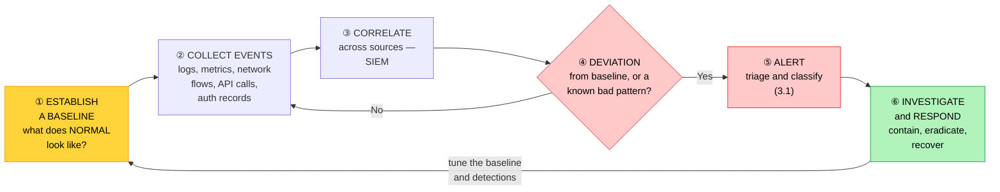

# Objective 4.6 — Given a scenario, monitor suspicious activities to identify common attacks

> **Domain 4.0 — Security (19% of exam)** · Exam CV0-004 V4 · Objectives doc v5.0
> **Status:** Exam-ready · **Version:** 2.0 (enhanced) · Supersedes `full notes/Objective-4.6-Monitor-Suspicious-Activities.md`

---

## 0. How to use this note

| Pass | What to read | Time |
|---|---|---|
| **1st (learn)** | Sections 1 → 8 in order | ~65 min |
| **2nd (drill)** | Section 6.7 (metadata attack) + Section 7 (attack → indicator table) | ~25 min |
| **3rd (test)** | Section 11 (practice) + Section 12 (PBQ drills) | ~30 min |
| **Exam eve** | Section 13 (60-second recall sheet) only | ~5 min |

> 📌 **This is a detection objective — the question is always "what would you SEE?"** The three cloud-specific attack types — **cryptojacking, zombie instances, and metadata** — are the distinctive content and the most likely to appear. The metadata attack in particular is the one many candidates have never met.

---

## 1. Official objective coverage

> **4.6 Given a scenario, monitor suspicious activities to identify common attacks.**
> - Event monitoring
> - Deviation from the baseline
> - Unnecessary open ports
> - **Attack types**
>   - **Vulnerability exploitation** — Human error · Outdated software
>   - **Social engineering** — Phishing
>   - **Malware** — Ransomware
>   - DDoS
>   - **Cryptojacking**
>   - **Zombie instances**
>   - **Metadata**

### 1.1 What the verb tells you

**"Monitor suspicious activities to identify common attacks"** — you are given **symptoms** and must name the **attack**. Every attack type below is presented with its **indicators**, because that is the direction the exam asks the question.

### 1.2 Coverage checklist

- [ ] I know what **event monitoring** collects and why correlation matters
- [ ] I know what a **baseline** is and why deviation is the core detection method
- [ ] I know why **unnecessary open ports** are both a weakness and a signal
- [ ] I can name the indicators of **vulnerability exploitation**
- [ ] I know the two named causes: **human error** and **outdated software**
- [ ] I can identify **phishing** from authentication telemetry
- [ ] I can name the distinctive indicators of **ransomware**
- [ ] I can distinguish a **DDoS** from a legitimate traffic surge
- [ ] ★ I can identify **cryptojacking** from its indicators
- [ ] ★ I know both meanings of **zombie instances**
- [ ] ★ I understand the **metadata service attack** and how to prevent it

---

## 2. The core mental model

### 2.1 The detection pipeline



> ★ **You cannot detect abnormal without first defining normal.** Everything in this objective rests on the baseline — which is why "deviation from the baseline" is listed as a first-class item alongside monitoring itself.

### 2.2 What suspicious activity looks like, generically

```text
   FIVE CATEGORIES OF SIGNAL

   ① IDENTITY     logins at unusual times, from unusual places,
                  impossible travel, new devices, privilege changes,
                  ★ FAILED attempts followed by a SUCCESS

   ② NETWORK      unexpected outbound connections, traffic to unknown
                  destinations, port scans, volume spikes, new
                  listening ports

   ③ COMPUTE      sustained abnormal CPU/GPU, unfamiliar processes,
                  instances launched in unused regions

   ④ DATA         mass reads, mass modification, large egress,
                  access to records outside a user's normal scope

   ⑤ CONFIGURATION  security groups opened, logging disabled,
                  public access enabled, new admin users, key creation

   ★ Two signals that almost always matter:
     · LOGGING BEING DISABLED — an attacker covering their tracks
     · A COST SPIKE — often the first sign of cryptojacking or DDoS
```

---

## 3. Event monitoring

| | |
|---|---|
| **Definition** | Continuous collection and analysis of **security-relevant events** — authentication, API calls, network flows, host activity, configuration changes — to identify malicious activity. |
| **Sources** | Control-plane **API audit logs** · authentication and IAM events · network flow logs · host/endpoint telemetry (EDR) · application logs · WAF, IDS/IPS, and DLP alerts · configuration/posture findings |
| **★ SIEM** | Security Information and Event Management — **aggregates and correlates** events from all sources so a multi-stage attack visible only across systems can be spotted |
| **Why correlation matters** | A failed login here, a new key there, and an outbound connection elsewhere are unremarkable alone — **together they are an intrusion** |
| **Prerequisites** | Retention long enough for investigation, **synchronised clocks (NTP/UTC)**, and **immutable storage** so an attacker cannot erase the trail (3.1, 4.3) |
| **Exam triggers** | "collect and correlate security events", "single view across systems", "detect multi-stage attacks", "SIEM" |

> ⚠️ **The same failure mode as 3.1 applies here: alert fatigue.** Too many low-value alerts train responders to ignore them — and the real one is ignored too. Tune to actionable signals.

---

## 4. Deviation from the baseline

| | |
|---|---|
| **Definition** | Detecting attacks by comparing current behaviour against an **established profile of normal** — for users, systems, network traffic, and cost. |
| **What is baselined** | Login times, locations, and devices · typical API calls per identity · normal CPU/memory/network profile · usual data-access volume · **normal spend** · listening ports and running processes |
| **Why it matters** | **Signature detection only finds known attacks** (4.5). Baseline deviation is how you catch **novel behaviour, insider misuse, and compromised-but-valid credentials** — where nothing "malicious" is technically happening |
| **★ The trade-off** | More false positives than signatures, and the baseline must be **learned during clean operation** — baselining a compromised environment makes the compromise look normal |
| **Related term** | **UEBA** — user and entity behaviour analytics |
| **Exam triggers** | "unusual for this user", "outside normal working hours", "impossible travel", "deviation from normal", "unexpected spike" |

```text
   ★ THE DETECTION THAT SIGNATURES CANNOT MAKE

   A valid administrator, with valid credentials, using a valid API —
   but at 03:00, from a country they have never logged in from,
   enumerating every storage bucket in the account.

   Nothing matches an attack signature. EVERYTHING deviates from
   the baseline. This is a compromised credential in use.
```

---

## 5. Unnecessary open ports

| | |
|---|---|
| **Why it matters** | Every listening port is **attack surface**. Ports opened "temporarily", left by default, or opened by a misconfiguration are among the most commonly exploited weaknesses |
| **The classic exposures** | **SSH (22)** and **RDP (3389)** open to `0.0.0.0/0` · database ports (3306, 5432, 1433) reachable from the internet · management interfaces · legacy services nobody uses |
| **How they are found — by you** | Configuration/posture scanning, security-group audits, vulnerability scans (4.1), and network flow analysis showing listeners |
| **How they are found — by attackers** | **Continuous internet-wide port scanning.** An exposed database is typically discovered within minutes, not days |
| **As a detection signal** | A **new** listening port appearing on a host is a strong indicator of compromise — backdoors, reverse shells, and mining software all listen or connect out |
| **Remediation** | Close it, restrict the source range, put it behind a **bastion or session service** (4.3), and enforce with policy-as-code so it cannot recur (2.4) |
| **Exam triggers** | "port scan detected", "database reachable from the internet", "SSH open to the world", "unexpected listening port appeared" |

---

## 6. Attack types

### 6.1 Vulnerability exploitation

| | |
|---|---|
| **What** | An attacker uses a **known weakness** — unpatched software or a misconfiguration — to gain access or execute code. |
| **★ CompTIA's two named causes** | **Human error** (misconfiguration) and **outdated software** (missing patches) |
| **Indicators** | IDS/IPS or WAF alerts matching exploit patterns · unexpected process execution · new outbound connections from a server · a service crashing then restarting · web-server logs with malformed or injection-style requests · **a known-vulnerable version present in the inventory** |
| **Prevention** | Patching (3.4), vulnerability management (4.1), hardening and benchmarks (4.4), configuration policy enforcement (2.4) |

**Human error — the misconfiguration half:**

| Common error | Detection |
|---|---|
| **Public storage bucket** | Posture scanning, public-access findings, access logs from unknown IPs |
| **Over-permissive security group** | Configuration audit, drift detection |
| **Over-broad IAM permissions** | Access analysis, unused-permission reports |
| **Logging disabled** | ★ Alert on it — this is often deliberate, not accidental |
| **Default credentials left in place** | Benchmark scanning (4.4) |

**Outdated software:** running past **end of support** means vulnerabilities are **permanently unpatchable** (3.4) — a standing exposure and an audit finding.

### 6.2 Social engineering and phishing

| | |
|---|---|
| **What** | Manipulating **people** rather than technology — phishing emails, spear phishing (targeted), vishing (voice), smishing (SMS), pretexting, business email compromise |
| **★ Why it dominates** | It bypasses technical controls entirely. Stolen valid credentials produce **legitimate-looking** access — which is precisely why baseline deviation matters |
| **★ Indicators (post-compromise)** | Login from an **unusual country or device** · **impossible travel** (two logins too far apart in time and distance) · authentication at unusual hours · **MFA fatigue** — repeated push prompts until the user approves one · a mailbox rule created to auto-forward or hide replies · a password or MFA device changed unexpectedly |
| **Prevention** | **Phishing-resistant MFA (FIDO2)** (4.3) · user training and reporting · email filtering and link protection · conditional access by device and location |
| **Exam triggers** | "user entered credentials on a fake site", "login from another continent minutes later", "repeated MFA prompts", "email rule forwarding to an external address" |

### 6.3 Malware and ransomware

| | |
|---|---|
| **Malware** | Malicious software — viruses, worms, trojans, spyware, rootkits, **ransomware**, and cryptominers |
| **Ransomware** | Encrypts data and demands payment; modern variants also **exfiltrate first** and threaten publication (double extortion) |
| **★ Ransomware indicators** | **Mass file modification or renaming in a short window** · a sudden spike in write/rename operations · **attempts to delete backups, snapshots, or shadow copies** · ransom-note files appearing · encryption processes consuming CPU · unusual outbound transfer **before** the encryption (exfiltration) |
| **★ The defence that matters** | **Immutable, off-site backups with credentials separate from production** — 3-2-1-1-0 (3.3). Encryption does not stop deletion; **immutability does** |
| **Prevention** | Endpoint protection/EDR (4.5) · patching · least privilege to limit blast radius · network segmentation · email filtering |
| **Exam triggers** | "files renamed with a new extension", "backup deletion attempted", "ransom note", "mass encryption detected" |

> ★ **The single most-tested ransomware fact:** attackers **target the backups first**. A backup repository that production credentials can write to is encrypted along with everything else — which is why immutability and credential separation are the control (3.3, 4.4).

### 6.4 DDoS

| | |
|---|---|
| **What** | Distributed denial of service — many sources overwhelming a target so legitimate users cannot be served (4.5 covers the defences). |
| **★ Indicators** | Traffic spike from **an unusually large number of distinct sources** · a geographic distribution unlike your normal users · request patterns that are too uniform · error rate and latency rising while **CPU per request stays normal** · connection tables filling · **auto-scaling triggering at an unusual time** · a sudden **cost spike** |
| **★ Distinguishing it from a legitimate surge** | A marketing campaign or news mention produces **organic** patterns — varied user agents, referrers, session behaviour, and a plausible geography. A DDoS is **uniform, sourceless, and does not convert** |
| **Exam triggers** | "service unavailable but nothing was compromised", "flood from thousands of IPs", "latency and errors rising with no deployment change" |

### 6.5 ★ Cryptojacking

| | |
|---|---|
| **What** | **Unauthorised use of your compute to mine cryptocurrency.** The attacker's goal is not your data — it is your CPU, GPU, and your bill. |
| **How it arrives** | An exploited vulnerability or exposed service · **stolen cloud credentials** used to launch new instances · a malicious container image · a compromised dependency |
| **★ Indicators** | **Sustained CPU or GPU near 100%** with no corresponding business workload · **an unexplained cost spike** — often the *first* sign · **instances launched in regions you never use** · unusually large instance types, especially **GPU** · outbound connections to **mining pools** (stratum protocol, unusual ports) · unfamiliar processes consuming all CPU · performance degradation of legitimate workloads |
| **★ Why cloud is the target** | Attackers get elastic, someone-else-funded compute. A stolen credential with permission to launch instances is worth real money — which is why **credential theft leads directly to cryptojacking** |
| **Prevention/detection** | Least privilege on instance-launch permissions · **budget alerts and anomaly detection** (1.8, 3.1) · region restrictions via policy · CPU baselines · egress filtering · image scanning (4.1) |
| **Exam triggers** | "CPU pegged at 100% with no workload", "unexpected instances in an unused region", "cloud bill suddenly tripled", "outbound to a mining pool" |

```text
   ★ THE CRYPTOJACKING SIGNATURE

   COST      ▁▁▁▁▁▁▁▁████████   sudden, sustained spike
   CPU       ▁▁▁▁▁▁▁▁████████   pinned at ~100%, no business load
   REGIONS   normally 1  →  now 6, including ones you never use
   INSTANCES normal sizes → large GPU types appear
   EGRESS    new connections to unfamiliar pool endpoints

   ⚠ The BILL is frequently the first alarm that fires — which is
     why budget anomaly detection is a SECURITY control, not just
     a finance one.
```

### 6.6 ★ Zombie instances

CompTIA's term carries **two meanings in practice**, and both are examinable — read the scenario to see which is described.

| | **① Orphaned / forgotten instances** | **② Compromised bot instances** |
|---|---|---|
| What | Running resources **nobody owns or uses** — left from a project, a test, or a departed employee | Instances **compromised and conscripted** into a botnet |
| Why dangerous | **Unpatched and unmonitored** — an easy foothold; also pure wasted cost | Used to attack others (DDoS, scanning, spam) — your account is the source |
| Indicators | No owner tag · no logins for months · not present in IaC · no recent deployments · continuous billing with no business function | **Unexplained outbound traffic**, especially high-volume or to many destinations · abuse notifications from the provider · connections to command-and-control |
| Remediation | Inventory and tag everything · lifecycle/decommission process (3.4) · orphan cleanup (1.8) | **Isolate immediately**, snapshot for forensics, rebuild from a known-good image |

> ★ **The two meanings connect.** A forgotten, unpatched instance is exactly what gets compromised and turned into a bot — so the orphan-cleanup discipline from 3.4 and 1.8 is a *security* control, not just a cost one.

### 6.7 ★ Metadata attacks — the cloud-native one

This is the attack most candidates have never encountered, and it is distinctive to cloud.

```text
   THE INSTANCE METADATA SERVICE

   Every cloud instance can query a LINK-LOCAL address —
   conventionally 169.254.169.254 — to learn about itself:

     · instance ID, region, network configuration
     · user data / bootstrap script  ⚠ often contains secrets
     · ★ TEMPORARY CREDENTIALS for the instance's IAM ROLE

   It is unauthenticated BY DESIGN — anything running on the
   instance can read it. That is the whole problem.

   ★ THE ATTACK CHAIN (SSRF → credential theft → cloud takeover)

   ① The application has a Server-Side Request Forgery flaw —
      it fetches a URL supplied by the user
              │
   ② Attacker supplies:  http://169.254.169.254/...credentials
              │
   ③ The SERVER makes the request (it is trusted, and local)
              │
   ④ The metadata service returns the instance role's
      TEMPORARY CREDENTIALS
              │
   ⑤ Attacker now acts AS THE INSTANCE — reading buckets,
      launching instances, escalating — from anywhere
```

| | |
|---|---|
| **★ Key indicators** | Application logs showing requests to **169.254.169.254** or the metadata hostname · outbound requests to link-local addresses from a web app · ★ **instance-role credentials being used from an IP address that is not the instance** — a very strong signal · unusual API calls made by an instance role · SSRF-style patterns in request parameters |
| **★ Prevention** | **Require session-oriented metadata access (IMDSv2-style)** — a token must be requested with a PUT before credentials can be read, which simple SSRF cannot do · **restrict the hop limit** so responses cannot be proxied onward · **disable metadata** where not needed · **least privilege on the instance role** — the credentials are only as dangerous as the role allows · fix the SSRF (input validation, allow-list outbound destinations) · WAF rules |
| **Also** | **Never put secrets in user data** — anything on the instance can read it (4.4) |
| **Exam triggers** | "169.254.169.254", "instance metadata", "SSRF", "instance credentials used externally", "the application fetched a URL supplied by the user" |

> ★ **This is how several major cloud breaches happened.** The lesson the exam wants: **the instance role's permissions define the blast radius**, so least privilege on instance roles is what limits the damage when SSRF happens.

---

## 7. ★ Attack → indicator quick reference

This is the table the exam questions are built from.

| Attack | What you would SEE |
|---|---|
| **Vulnerability exploitation** | IDS/WAF exploit alerts · unexpected process execution · new outbound connections · known-vulnerable version in inventory |
| **Human error (misconfig)** | Public bucket findings · over-permissive security group · **logging disabled** · drift alerts |
| **Outdated software** | Vulnerability-scan findings · EOS software in inventory |
| **Phishing / social engineering** | Login from an unusual country or device · **impossible travel** · odd hours · **MFA fatigue prompts** · mailbox forwarding rule created |
| **Ransomware** | **Mass file modification/rename** · write-operation spike · **backup or snapshot deletion attempts** · ransom notes · exfiltration before encryption |
| **DDoS** | Traffic flood from **many distinct sources** · uniform request patterns · latency and errors rising · scaling events · cost spike |
| **Cryptojacking** | **CPU/GPU pinned near 100%** with no workload · **cost spike** · instances in **unused regions** · GPU instance types · **mining-pool egress** |
| **Zombie (orphaned)** | No owner tag · no logins for months · not in IaC · billing with no business function |
| **Zombie (bot)** | Unexplained high-volume outbound · many destinations · provider abuse notice · C2 connections |
| **Metadata attack** | Requests to **169.254.169.254** in app logs · **instance-role credentials used from an external IP** · unusual API calls by an instance role |

---

## 8. Comparison tables

### 8.1 Detection methods

| | **Signature-based** | **Baseline deviation (anomaly)** |
|---|---|---|
| Detects | **Known** attacks | **Novel** behaviour, insider misuse, stolen valid credentials |
| Misses | **Zero-days** | Slow, low-and-slow activity that resembles normal |
| False positives | Low | **Higher** |
| Requires | Signature updates | A **clean learned baseline** |
| Example catch | Known exploit pattern in a request | Admin enumerating all buckets at 03:00 from a new country |

### 8.2 Cost spike as a security signal

| Attack | Why the bill moves |
|---|---|
| **Cryptojacking** | Attacker-launched instances and pinned CPU/GPU |
| **DDoS** | Auto-scaling absorbs the flood and bills you — *economic denial of sustainability* (4.5) |
| **Data exfiltration** | Large **egress** charges (1.8) |
| **Zombie instances** | Continuous billing for resources doing nothing |

> ★ **Budget anomaly alerts are a security control.** In several of these attacks the finance system detects the incident before the security tooling does.

### 8.3 Attack goal → what the attacker wants

| Attack | The attacker wants |
|---|---|
| Vulnerability exploitation | **Access** — a foothold |
| Phishing | **Credentials** |
| Ransomware | **Payment** (via denial of access, plus exfiltration leverage) |
| DDoS | **Denial of availability** (or cost damage) |
| **Cryptojacking** | **Your compute — and your bill** |
| **Zombie instances** | **Infrastructure to attack others**, or an unmonitored foothold |
| **Metadata attack** | **Your cloud credentials**, and the permissions behind them |

---

## 9. Exam traps & distractor patterns

| # | Trap | The truth |
|---|---|---|
| 1 | "High CPU means the application is busy" | Sustained ~100% CPU with **no business workload**, plus a cost spike, is **cryptojacking** |
| 2 | "A cost spike is a finance problem" | It is frequently the **first indicator** of cryptojacking, DDoS absorption, or data exfiltration |
| 3 | "Cryptojacking steals data" | It steals **compute and money** — data theft is not the goal, which is why it can run unnoticed for months |
| 4 | "Zombie instances are only a cost problem" | They are **unpatched and unmonitored**, making them an easy foothold — and the term also covers **compromised bot instances** |
| 5 | "The metadata service is protected by authentication" | It is **unauthenticated by design** — anything on the instance can read it. That is why SSRF is so dangerous |
| 6 | "SSRF is just a web bug" | In cloud it is a **credential-theft primitive** — it reaches the metadata service and steals the instance role's credentials |
| 7 | "Encrypting backups protects against ransomware" | Encryption stops **reading**, not **deletion or re-encryption**. **Immutability (WORM) with separate credentials** is the control |
| 8 | "Ransomware only encrypts" | Modern variants **exfiltrate first** (double extortion) — so watch for large egress *before* the encryption |
| 9 | "Signature detection will catch a compromised admin account" | Nothing matches a signature — valid credentials, valid API. Only **baseline deviation** catches it |
| 10 | "You can baseline at any time" | The baseline must be learned during **clean** operation — baselining a compromised environment normalises the compromise |
| 11 | "A traffic surge is a DDoS" | Legitimate surges are **organic** — varied agents, referrers, sessions, plausible geography. DDoS is **uniform and does not convert** |
| 12 | "Open ports are only a vulnerability" | A **newly appearing** listening port is also a strong **detection signal** of a backdoor or reverse shell |
| 13 | "Phishing is prevented by training alone" | Training helps, but **phishing-resistant MFA (FIDO2)** is the control that survives a user entering credentials on a fake site |
| 14 | "MFA stops all credential attacks" | **MFA fatigue / push bombing** works against push-approval MFA — repeated prompts until the user accepts |
| 15 | "Logging being disabled is a config error" | Treat it as **an attacker covering their tracks** until proven otherwise — alert on it |

**Disambiguation drill:**

| Pair | The deciding question |
|---|---|
| **Cryptojacking vs DDoS** | Is **your compute** being consumed, or **your availability** attacked? |
| **Cryptojacking vs legitimate load** | Is there a **business workload** matching the CPU, and did **cost** jump? |
| **DDoS vs viral traffic** | Is the traffic **organic and converting**, or uniform and sourceless? |
| **Orphaned vs bot zombie** | **Idle and forgotten**, or **actively sending traffic**? |
| **Metadata attack vs normal API use** | Are instance-role credentials being used **from the instance**, or from elsewhere? |
| **Signature vs baseline detection** | A **known pattern**, or **unusual for this identity**? |
| **Ransomware vs backup failure** | Mass **modification/rename**, and were **backups targeted**? |

---

## 10. Keyword → answer trigger table

| If you see… | Identify |
|---|---|
| CPU pinned at 100% with no workload · cost tripled · instances in unused regions · GPU types appearing · mining-pool egress | **Cryptojacking** |
| instances with no owner, no logins for months, not in IaC, still billing | **Zombie instances (orphaned)** |
| unexplained high-volume outbound · provider abuse notice · C2 connections | **Zombie instances (compromised bot)** |
| requests to 169.254.169.254 · SSRF · instance credentials used from an external IP | **Metadata attack** |
| mass file renaming · backup/snapshot deletion attempted · ransom note | **Ransomware** |
| large egress before the encryption | **Double-extortion ransomware (exfiltration)** |
| login from another continent minutes later · impossible travel · repeated MFA prompts · new mailbox forwarding rule | **Phishing / credential compromise** |
| flood from thousands of IPs · uniform requests · errors and latency rising | **DDoS** |
| public bucket · over-permissive security group · logging disabled | **Human error (misconfiguration)** |
| known-vulnerable version still deployed · past end of support | **Outdated software** |
| valid admin, valid API, but 03:00 from a new country enumerating everything | **Baseline deviation — compromised credentials** |
| new listening port appeared on a host | **Possible backdoor / reverse shell** |
| database reachable from the internet · SSH open to 0.0.0.0/0 | **Unnecessary open ports** |
| correlate events across many systems to spot a multi-stage attack | **SIEM / event monitoring** |

---

## 11. Practice questions

<details>
<summary><b>Q1.</b> Monitoring shows several instances at 100% CPU with no corresponding business workload, new instances running in a region the company never uses, and a tripled cloud bill. What is happening?</summary>

A. DDoS attack · **B. Cryptojacking** · C. Ransomware · D. Data exfiltration

**Correct: B — cryptojacking.** Unauthorised mining consumes compute and money; unused regions and a cost spike are its classic signature.
- **A wrong:** A DDoS produces inbound traffic floods and availability loss, not attacker-launched instances.
- **C wrong:** Ransomware shows mass file modification, not sustained CPU across new instances.
- **D wrong:** Exfiltration shows large **egress**, not pinned CPU.
</details>

<details>
<summary><b>Q2.</b> An application has a Server-Side Request Forgery flaw. An attacker supplies a URL pointing at 169.254.169.254. What is the risk?</summary>

**A. The instance metadata service returns the instance role's temporary credentials, allowing the attacker to act as the instance against the cloud API** · B. The server crashes · C. The attacker reads the local filesystem · D. Nothing — the address is unroutable externally

**Correct: A.** The metadata service is unauthenticated by design and exposes IAM role credentials; SSRF turns a web bug into cloud credential theft.
- **B/C wrong:** Neither describes the metadata exposure.
- **D wrong:** The **server** makes the request locally, which is exactly why it works.
</details>

<details>
<summary><b>Q3.</b> Which control MOST directly prevents the metadata attack described above?</summary>

A. Encrypting data at rest · **B. Requiring session-token-based metadata access (IMDSv2-style), restricting the hop limit, and applying least privilege to the instance role** · C. Enabling a NACL deny rule · D. Increasing log retention

**Correct: B.** A required PUT-then-GET token defeats simple SSRF, hop limits stop proxying, and least privilege limits the blast radius if credentials are still obtained.
- **A wrong:** Irrelevant to credential theft via metadata.
- **C wrong:** The request is local (link-local), not filtered by a NACL.
- **D wrong:** Retention aids investigation, not prevention.
</details>

<details>
<summary><b>Q4.</b> Files across a file server are being renamed with an unfamiliar extension, write operations have spiked, and attempts were made to delete snapshots. What attack is this?</summary>

A. Cryptojacking · **B. Ransomware** · C. DDoS · D. Zombie instances

**Correct: B — ransomware.** Mass modification plus **attempts to destroy backups** is the defining pattern; attackers target recovery capability first.
- **A wrong:** Cryptojacking consumes CPU, not file operations.
- **C wrong:** DDoS affects availability of a service, not file contents.
- **D wrong:** Zombie instances relate to orphaned or bot-conscripted compute.
</details>

<details>
<summary><b>Q5.</b> A user's account shows a successful login from one country, then another login 20 minutes later from a country 8,000 km away. What is this indicator called, and what does it suggest?</summary>

**A. Impossible travel — indicating compromised credentials, likely from phishing** · B. Load balancing · C. A DDoS attack · D. Normal roaming behaviour

**Correct: A.** Two authentications that cannot physically be the same person are a classic baseline-deviation signal of credential compromise.
- **B/D wrong:** Neither explains a physically impossible sequence.
- **C wrong:** DDoS concerns availability.
</details>

<details>
<summary><b>Q6.</b> Why can baseline deviation detect a compromised administrator account when signature-based detection cannot?</summary>

**A. The activity uses valid credentials and legitimate APIs, so it matches no attack signature — but it deviates strongly from that identity's normal pattern** · B. Signatures are updated too slowly · C. Baselines inspect encrypted traffic · D. Signatures only work on networks

**Correct: A.** Nothing about the traffic is technically malicious; only its *unusualness* for that identity betrays it.
- **B wrong:** Even current signatures would not match legitimate API calls.
- **C/D wrong:** Neither is the reason.
</details>

<details>
<summary><b>Q7.</b> An audit finds 40 running instances with no owner tag, no logins for eight months, and no presence in the infrastructure code. What are they, and why do they matter?</summary>

**A. Zombie (orphaned) instances — unpatched and unmonitored, they are an easy foothold as well as wasted cost** · B. Auto-scaling reserve capacity · C. Bastion hosts · D. Canary deployments

**Correct: A.** Forgotten instances drift out of patching and monitoring, which is exactly what makes them attractive to compromise — the cost problem and the security problem are the same problem (1.8, 3.4).
- **B/C/D wrong:** All would be tagged, managed, and known.
</details>

<details>
<summary><b>Q8.</b> Which observation would MOST strongly suggest that instance role credentials have been stolen?</summary>

A. High CPU on the instance · **B. The instance role's credentials being used in API calls originating from an IP address that is not the instance** · C. The instance was restarted · D. A new security group was attached

**Correct: B.** Instance-role credentials should only ever be used *by* that instance; use from elsewhere means they were extracted — typically via metadata/SSRF.
- **A wrong:** Suggests cryptojacking or load.
- **C/D wrong:** Neither indicates credential theft.
</details>

<details>
<summary><b>Q9.</b> Traffic to a website increases tenfold. Which pattern suggests a legitimate surge rather than a DDoS?</summary>

**A. Varied user agents and referrers, plausible geographic distribution, normal session behaviour, and conversions continuing** · B. Uniform request patterns from thousands of unrelated IPs · C. Requests with identical headers and no session progression · D. Traffic sourced mainly from unusual regions with no referrers

**Correct: A.** Organic traffic behaves like people; DDoS traffic is mechanically uniform and does not convert.
- **B/C/D wrong:** All three describe automated attack traffic.
</details>

<details>
<summary><b>Q10.</b> Security logging is disabled on a production account. How should this be treated?</summary>

A. As a routine configuration change · **B. As a potential indicator of an attacker covering their tracks, and alerted on immediately** · C. As a cost optimisation · D. As acceptable if backups exist

**Correct: B.** Disabling logging destroys evidence, so it is treated as suspicious until proven otherwise — and audit logs should be immutable and out of administrators' reach (4.3).
- **A/C/D wrong:** Each normalises a high-severity signal.
</details>

<details>
<summary><b>Q11.</b> Which defence is MOST effective against ransomware once systems are already encrypted?</summary>

A. Antivirus signatures · **B. Restoring from immutable, off-site backups with credentials separate from production** · C. Encrypting the data at rest · D. A WAF rule

**Correct: B.** Recovery is the goal at that point, and only backups the attacker could not reach are useful — the 3-2-1-1-0 pattern (3.3).
- **A wrong:** Prevention, and too late here.
- **C wrong:** Encryption does not prevent an attacker encrypting it again.
- **D wrong:** A WAF protects web applications.
</details>

<details>
<summary><b>Q12.</b> An attacker sends repeated MFA push notifications until the user approves one. What is this technique?</summary>

**A. MFA fatigue (push bombing) — mitigated by phishing-resistant factors such as FIDO2, number matching, and rate limiting prompts** · B. Impossible travel · C. Credential stuffing · D. Cryptojacking

**Correct: A.** Push-approval MFA is vulnerable to sheer persistence; hardware-backed, phishing-resistant factors are the answer (4.3).
- **B wrong:** That is a geographic anomaly.
- **C wrong:** Credential stuffing reuses leaked passwords at scale.
- **D wrong:** Unrelated.
</details>

<details>
<summary><b>Q13.</b> Which is the PRIMARY purpose of a SIEM in this objective?</summary>

A. To block attacks inline · **B. To aggregate and correlate events from many sources so multi-stage attacks visible only across systems can be detected** · C. To replace backups · D. To scan for vulnerabilities

**Correct: B.** Individually unremarkable events — a failed login, a new key, an outbound connection — become an intrusion when correlated.
- **A wrong:** Blocking inline is an IPS/WAF function (4.5).
- **C/D wrong:** Different capabilities entirely.
</details>

<details>
<summary><b>Q14.</b> Why is a sudden increase in cloud spend treated as a security signal?</summary>

**A. Because cryptojacking, DDoS absorption by auto-scaling, and large-scale data exfiltration all show up as cost before they show up elsewhere** · B. Because providers overcharge during attacks · C. Because budgets are compliance requirements · D. It is not a security signal

**Correct: A.** In several of these attacks the finance alert fires before the security tooling does, which makes budget anomaly detection a genuine security control (1.8, 4.5).
- **B/C wrong:** Neither is the reason.
- **D wrong:** It is one of the most reliable cloud attack signals.
</details>

<details>
<summary><b>Q15.</b> A host that previously had no listening services now has an unexpected port open and an outbound connection to an unknown address. What does this suggest?</summary>

**A. Possible compromise — a backdoor or reverse shell** · B. Normal patching activity · C. A load balancer health check · D. DNS resolution

**Correct: A.** A newly appearing listener plus unexplained egress is a strong compromise indicator; open ports are both a weakness and a detection signal.
- **B/C/D wrong:** None creates a new unexpected listening port with unknown outbound traffic.
</details>

<details>
<summary><b>Q16.</b> Which two causes of vulnerability exploitation does CompTIA name explicitly?</summary>

A. Insider threat and malware · **B. Human error and outdated software** · C. DDoS and phishing · D. Weak encryption and poor logging

**Correct: B.** The objective lists **human error** (misconfiguration) and **outdated software** (missing patches) as the sub-bullets under vulnerability exploitation.
- **A/C/D wrong:** None matches the stated sub-bullets.
</details>

<details>
<summary><b>Q17.</b> What is the risk of establishing a behavioural baseline in an environment that is already compromised?</summary>

**A. The malicious activity is learned as normal, so it will never trigger a deviation alert** · B. The baseline expires sooner · C. Signatures stop working · D. Logging is disabled

**Correct: A.** A baseline must be learned during clean operation, or it normalises the intrusion.
- **B/C/D wrong:** None follows from a contaminated baseline.
</details>

<details>
<summary><b>Q18.</b> An organisation receives an abuse notification from its cloud provider reporting that its instances are attacking third parties. What has most likely occurred?</summary>

A. Cryptojacking · **B. Instances have been compromised and conscripted into a botnet — zombie instances in the compromised sense** · C. Ransomware · D. A metadata attack only

**Correct: B.** High-volume outbound traffic and third-party abuse reports indicate the instances are now the attack source.
- **A wrong:** Cryptojacking consumes compute rather than attacking others.
- **C wrong:** Ransomware encrypts data.
- **D wrong:** A metadata attack is a credential-theft step, possibly the initial access, but not the described behaviour.
</details>

<details>
<summary><b>Q19.</b> Which prevention step limits the damage if instance metadata credentials are stolen?</summary>

**A. Applying least privilege to the instance role, so the stolen credentials can do very little** · B. Increasing instance size · C. Enabling auto-scaling · D. Adding more log retention

**Correct: A.** The stolen credentials carry exactly the role's permissions — least privilege is what bounds the blast radius (4.3, 4.4).
- **B/C wrong:** Neither affects permissions.
- **D wrong:** Aids investigation after the fact.
</details>

<details>
<summary><b>Q20.</b> Which pair of indicators together most strongly suggests double-extortion ransomware?</summary>

**A. Large outbound data transfer shortly before mass file encryption begins** · B. High CPU and a cost spike · C. Traffic from thousands of IPs · D. Login from an unusual country

**Correct: A.** Modern ransomware exfiltrates first so it can threaten publication as well as denying access — the egress precedes the encryption.
- **B wrong:** That is cryptojacking.
- **C wrong:** That is DDoS.
- **D wrong:** That indicates credential compromise.
</details>

<details>
<summary><b>Q21.</b> An SSH port is found open to 0.0.0.0/0 on a production instance. How quickly should this be expected to be discovered by attackers?</summary>

**A. Within minutes — the internet is continuously scanned for exposed services** · B. Within a year · C. Only if the IP is published · D. Never, if the password is strong

**Correct: A.** Internet-wide scanning is constant and automated; exposure is discovered almost immediately, which is why bastions and restricted source ranges exist (4.3).
- **B/C wrong:** Both dramatically understate scanning activity.
- **D wrong:** Password strength does not prevent discovery or brute forcing.
</details>

<details>
<summary><b>Q22.</b> Which detection approach would identify an employee accessing far more customer records than usual, without any technical violation?</summary>

A. Signature-based IDS · **B. Baseline deviation / user behaviour analytics** · C. WAF rules · D. Port scanning

**Correct: B.** The access is authorised and unremarkable individually; only comparison against the user's normal pattern reveals it — the insider-threat case.
- **A/C wrong:** No signature or payload rule is violated.
- **D wrong:** Unrelated to data access.
</details>

<details>
<summary><b>Q23.</b> Which of the following is NOT a listed attack type in this objective?</summary>

A. Cryptojacking · B. Zombie instances · **C. SQL injection** · D. Metadata

**Correct: C.** SQL injection is a real attack, but the objective's list is vulnerability exploitation, social engineering, malware, DDoS, cryptojacking, zombie instances, and metadata. SQL injection would fall under **vulnerability exploitation**, and its control is the WAF (4.5).
- **A/B/D wrong:** All three are explicitly named.
</details>

<details>
<summary><b>Q24.</b> What makes cloud environments particularly attractive targets for cryptojacking?</summary>

**A. Stolen credentials grant elastic compute the attacker does not pay for, so instances can be launched at scale on the victim's account** · B. Cloud CPUs are faster · C. Cloud providers do not log activity · D. Mining is legal in cloud

**Correct: A.** Elasticity plus someone else's budget is the appeal, which is why instance-launch permissions deserve tight least privilege and region restrictions.
- **B wrong:** Hardware is comparable.
- **C wrong:** Providers log extensively.
- **D wrong:** Unauthorised use is not legal.
</details>

<details>
<summary><b>Q25.</b> Which sequence correctly describes the detection pipeline?</summary>

A. Alert → baseline → collect → investigate · **B. Establish a baseline → collect events → correlate → detect deviation → alert → investigate and respond → tune** · C. Investigate → collect → baseline → alert · D. Collect → alert → baseline

**Correct: B.** You cannot detect abnormal without first defining normal, and the loop closes by tuning the baseline and detections after each incident.
- **A/C/D wrong:** All place the baseline after detection, which is backwards.
</details>

---

## 12. PBQ-style drills

### Drill A — Name the attack from the indicators

| # | Indicators | Attack? |
|---|---|---|
| 1 | CPU 100%, unused regions, bill tripled | |
| 2 | Files renamed en masse, snapshot deletion attempted | |
| 3 | Login from two continents 20 minutes apart | |
| 4 | Requests to 169.254.169.254 in app logs | |
| 5 | Instances with no owner, no logins in eight months | |
| 6 | Millions of uniform requests from thousands of IPs | |
| 7 | Instance-role credentials used from an external IP | |
| 8 | Provider abuse notice; heavy outbound to many destinations | |

<details><summary>Answers</summary>

1 → **Cryptojacking** · 2 → **Ransomware** · 3 → **Phishing/credential compromise (impossible travel)** · 4 → **Metadata attack (SSRF)** · 5 → **Zombie instances (orphaned)** · 6 → **DDoS** · 7 → **Metadata attack — stolen instance credentials** · 8 → **Zombie instances (compromised bots)**
</details>

### Drill B — Detection method

| # | Scenario | Signature or baseline? |
|---|---|---|
| 1 | Known exploit pattern in an HTTP request | |
| 2 | Valid admin enumerating all buckets at 03:00 from a new country | |
| 3 | Malware file matching a known hash | |
| 4 | An employee downloading 50× their normal record volume | |
| 5 | A brand-new zero-day exploitation technique | |

<details><summary>Answers</summary>

1 → **Signature** · 2 → **Baseline deviation** · 3 → **Signature** · 4 → **Baseline deviation (UEBA)** · 5 → **Baseline deviation** — signatures do not yet exist
</details>

### Drill C — Trace the metadata attack

Put the steps in order: *attacker acts as the instance against the cloud API · metadata service returns role credentials · application fetches a user-supplied URL · attacker supplies the link-local metadata address · server makes the local request*

<details><summary>Answer</summary>

1. **Application fetches a user-supplied URL** (the SSRF flaw)
2. **Attacker supplies the link-local metadata address** (169.254.169.254)
3. **Server makes the local request** — it is trusted and local, so it succeeds
4. **Metadata service returns role credentials** — unauthenticated by design
5. **Attacker acts as the instance against the cloud API** — from anywhere

**Prevention at each stage:** fix the SSRF · require session-token metadata access · restrict the hop limit · **least privilege on the instance role** so step 5 achieves little.
</details>

### Drill D — Which signal, which system?

| # | Signal | Where would you see it? |
|---|---|---|
| 1 | Impossible travel | |
| 2 | Mining-pool egress | |
| 3 | Mass file rename | |
| 4 | Public bucket created | |
| 5 | Unexpected cost spike | |
| 6 | Logging disabled | |

<details><summary>Answers</summary>

1 → **Authentication/IAM logs** (3.1, 4.3) · 2 → **Network flow logs / egress filtering** · 3 → **Endpoint/EDR and file-system telemetry** (4.5) · 4 → **Configuration posture scanning / API audit log** · 5 → **Budget anomaly detection** (1.8) · 6 → **Control-plane API audit log — alert on it immediately**
</details>

---

## 13. 60-second recall sheet

```text
╔══════════════════════════════════════════════════════════════════════╗
║  4.6 — MONITOR SUSPICIOUS ACTIVITIES                                 ║
║  The question is always: WHAT WOULD YOU SEE?                         ║
╠══════════════════════════════════════════════════════════════════════╣
║  PIPELINE  BASELINE → collect events → CORRELATE (SIEM) → detect     ║
║   DEVIATION → alert/triage → investigate & respond → TUNE            ║
║   ★ You cannot detect abnormal without first defining NORMAL         ║
║   ⚠ Baseline must be learned during CLEAN operation                  ║
║  SIGNATURE = known attacks, few FPs, MISSES ZERO-DAYS                ║
║  BASELINE  = catches NOVEL, INSIDER, and STOLEN VALID CREDENTIALS    ║
║   (valid user + valid API + wildly unusual pattern = compromise)     ║
║  OPEN PORTS: attack surface AND a signal — a NEW listener = backdoor ║
║   SSH:22 / RDP:3389 open to 0.0.0.0/0 is found in MINUTES            ║
╠══════════════════════════════════════════════════════════════════════╣
║  ★ ATTACK → INDICATORS                                               ║
║   VULN EXPLOITATION  IDS/WAF alerts · unexpected processes · new     ║
║     outbound · known-vulnerable version present                      ║
║     causes CompTIA names: HUMAN ERROR (misconfig) + OUTDATED SOFTWARE║
║   PHISHING  unusual country/device · ★IMPOSSIBLE TRAVEL · odd hours  ║
║     · ★MFA FATIGUE pushes · new mailbox forwarding rule              ║
║     → fix with PHISHING-RESISTANT MFA (FIDO2)                        ║
║   RANSOMWARE  ★MASS FILE RENAME/MODIFY · write spike ·               ║
║     ★BACKUP/SNAPSHOT DELETION ATTEMPTS · ransom notes ·              ║
║     ★LARGE EGRESS BEFORE encryption = DOUBLE EXTORTION               ║
║     → defence = IMMUTABLE OFF-SITE BACKUPS, separate creds (3.3)     ║
║   DDoS  flood from MANY DISTINCT sources · UNIFORM patterns ·        ║
║     latency/errors up · scaling triggers · cost spike                ║
║     vs LEGITIMATE surge = organic, varied, and CONVERTS              ║
╠══════════════════════════════════════════════════════════════════════╣
║  ★★ THE THREE CLOUD-SPECIFIC ONES                                    ║
║   CRYPTOJACKING  steals COMPUTE + MONEY (not data)                   ║
║     ★ CPU/GPU pinned ~100% with NO business workload                 ║
║     ★ COST SPIKE — often the FIRST alarm                             ║
║     ★ instances in REGIONS YOU NEVER USE · GPU types · mining-pool   ║
║       egress                                                         ║
║   ZOMBIE INSTANCES  ★ TWO MEANINGS                                   ║
║     ① ORPHANED: no owner tag, no logins, not in IaC → UNPATCHED,     ║
║        UNMONITORED foothold + wasted cost                            ║
║     ② COMPROMISED BOT: heavy unexplained OUTBOUND, provider ABUSE    ║
║        NOTICE, C2 traffic                                            ║
║     → they connect: the forgotten instance is what gets compromised  ║
║   METADATA  ★ 169.254.169.254 — link-local, UNAUTHENTICATED BY       ║
║     DESIGN, returns the INSTANCE ROLE'S TEMPORARY CREDENTIALS        ║
║     CHAIN: SSRF → fetch metadata → steal creds → act as the instance ║
║     INDICATORS: requests to 169.254.169.254 in app logs ·            ║
║       ★ INSTANCE-ROLE CREDENTIALS USED FROM AN IP THAT IS NOT THE    ║
║         INSTANCE                                                     ║
║     PREVENT: require SESSION TOKEN (IMDSv2-style) · limit HOP LIMIT ·║
║       disable if unused · ★ LEAST PRIVILEGE ON THE INSTANCE ROLE     ║
║       (it bounds the blast radius) · fix the SSRF · no secrets in    ║
║       user data                                                      ║
╠══════════════════════════════════════════════════════════════════════╣
║  ★ A COST SPIKE IS A SECURITY SIGNAL — cryptojacking · DDoS absorbed ║
║    by auto-scaling · data exfiltration (egress) · zombie instances   ║
║  ★ LOGGING DISABLED = treat as an attacker covering tracks           ║
╚══════════════════════════════════════════════════════════════════════╝
```

---

## 14. Cross-references

| Related objective | Connection |
|---|---|
| **1.3 Cloud networking** | Open ports, security groups, egress filtering, flow logs |
| **1.8 Cost considerations** | **Budget anomaly detection is a security control** — cryptojacking and exfiltration show up as cost first |
| **3.1 Observability** | Event collection, correlation, alert triage and response; clock sync and immutable logs are prerequisites |
| **3.2 Scaling** | A scaling **maximum** limits the cost damage of an absorbed DDoS |
| **3.3 Backup and recovery** | **Immutable off-site backups** are the ransomware answer; attackers target backups first |
| **3.4 Resource life cycle** | **Orphan cleanup and decommissioning are security controls** — forgotten instances become zombies |
| **4.1 Vulnerability management** | Outdated software and misconfiguration are the findings that become exploitation |
| **4.3 IAM** | Impossible travel and MFA fatigue are identity signals; **least privilege on instance roles** bounds the metadata attack |
| **4.4 Security best practices** | Hardening closes unnecessary ports; no secrets in user data; Zero Trust limits lateral movement |
| **4.5 Security controls** | IDS/IPS, WAF, DLP, and endpoint protection are the tools that generate these detections |
| **6.3 Security troubleshooting** | Responding once an attack has been identified |

> 🔑 **Carry this forward:** for each attack, know the **one or two indicators that are distinctive to it** — pinned CPU plus a cost spike is cryptojacking; mass renames plus backup deletion is ransomware; `169.254.169.254` in application logs is a metadata attack.

---

*Source of truth: CompTIA Cloud+ CV0-004 V4 Exam Objectives, document version 5.0. The metadata service address 169.254.169.254 is the widely used convention across major providers. Product names are illustrative; the exam is vendor-neutral.*
