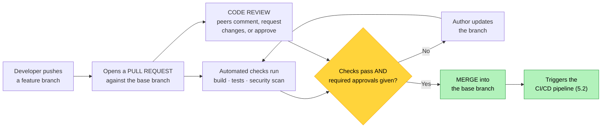

# Objective 5.1 — Explain source control concepts

> **Domain 5.0 — DevOps Fundamentals (10% of exam)** · Exam CV0-004 V4 · Objectives doc v5.0
> **Status:** Exam-ready · **Version:** 2.0 (enhanced) · Supersedes `full notes/Objective-5.1-Source-Control.md`

---

## 0. How to use this note

| Pass | What to read | Time |
|---|---|---|
| **1st (learn)** | Sections 1 → 10 in order | ~45 min |
| **2nd (drill)** | Section 2.2 (the four areas) + Section 8.1 (merge types) + Section 9.2 (branch strategies) | ~15 min |
| **3rd (test)** | Section 13 (practice) + Section 14 (PBQ drills) | ~25 min |
| **Exam eve** | Section 15 (60-second recall sheet) only | ~4 min |

> 📌 **First objective of Domain 5 (DevOps Fundamentals, 10% — the smallest domain).** This is vocabulary, and it is mostly free marks: the questions are "which action does X?" The two things that actually trip people up are **pull request vs `git pull`** and **merge vs rebase vs squash**.

---

## 1. Official objective coverage

> **5.1 Explain source control concepts.**
> - Version management
> - Code review
> - Pull request
> - Code push
> - Code commit
> - Code merge
> - Branch management

### 1.1 What the verb tells you

**"Explain"** — definitions and mechanisms. Expect vocabulary and "which action does this?" questions, not scenarios requiring judgement. The exam is vendor-neutral, but **Git** is the de facto standard and CompTIA names it explicitly in **5.4**, so Git terminology is what you will see.

### 1.2 Coverage checklist

- [ ] I can order the workflow: **branch → commit → push → PR → review → merge**
- [ ] I know the four areas: **working directory, staging, local repository, remote**
- [ ] I know a **commit is local** until pushed
- [ ] ★ I know a **pull request is not `git pull`**
- [ ] I know **fetch vs pull**
- [ ] I can distinguish **fast-forward**, **merge commit**, **squash**, and **rebase**
- [ ] I know what a **merge conflict** is and how it is resolved
- [ ] I know **`revert` vs `reset`** and which is safe on shared branches
- [ ] I can compare **trunk-based**, **GitHub Flow**, and **GitFlow**
- [ ] I know what **branch protection** enforces
- [ ] ★ I know why a committed secret must be **rotated**, not just deleted
- [ ] I know why source control is **compliance evidence**

---

## 2. The core mental model

### 2.1 The workflow loop

```text
   ① CLONE / PULL      get the current state of the repository
        ↓
   ② BRANCH            create an isolated line of work
        ↓
   ③ EDIT              change files in your WORKING DIRECTORY
        ↓
   ④ STAGE             select which changes to include
        ↓
   ⑤ COMMIT            snapshot them LOCALLY, with a message
        ↓
   ⑥ PUSH              upload commits to the REMOTE
        ↓
   ⑦ PULL REQUEST      propose merging your branch into the base
        ↓
   ⑧ CODE REVIEW       humans inspect; automated checks run
        ↓
   ⑨ MERGE             changes enter the target branch
        ↓
   ⑩ back to ①         — and VERSION MANAGEMENT keeps every step
                          recorded and reversible
```

### 2.2 ★ The four areas — where your changes actually live

```text
   ┌───────────────┐  git add   ┌───────────┐  git commit  ┌────────────┐
   │   WORKING     │ ─────────► │  STAGING  │ ───────────► │   LOCAL    │
   │   DIRECTORY   │            │   AREA    │              │ REPOSITORY │
   │ your edited   │            │ what will │              │ your commit│
   │ files         │            │ go in the │              │ history    │
   │               │            │ next commit│             │            │
   └───────────────┘            └───────────┘              └─────┬──────┘
                                                                  │
                                                          git push │
                                                                  ▼
                                                          ┌────────────┐
                                                          │   REMOTE   │
                                                          │ REPOSITORY │
                                                          │ the shared │
                                                          │ copy       │
                                                          └────────────┘
                                     git fetch / git pull ◄────┘

   ★ A COMMIT IS LOCAL. Nothing is shared with the team until you PUSH.
     This is the single most common misunderstanding of the model.
```

### 2.3 Why it matters beyond code

| Benefit | Why it counts on this exam |
|---|---|
| **History and rollback** | Every change is attributable and reversible |
| **Collaboration** | Many people work in parallel without overwriting each other |
| **★ Applies to infrastructure too** | **IaC lives in source control** (2.4) — the same review and history apply to infrastructure changes |
| **Triggers automation** | A push is what starts a **CI/CD pipeline** (5.2) |
| **★ Compliance evidence** | *Who changed what, when, why, and who approved it* — exactly what an auditor asks for (4.2) |

---

## 3. Version management

| | |
|---|---|
| **Definition** | Tracking every change to a body of work over time so any prior state can be identified, compared, and restored. |
| **What each change records** | A unique identifier (**commit hash**), author, timestamp, message, and the parent it came from — forming a complete, navigable history |
| **Undoing changes** | **`revert`** creates a **new commit** that reverses an earlier one — **safe on shared branches**. **`reset`** moves the branch pointer and **rewrites history** — **dangerous on shared branches** |
| **Marking releases** | **Tags** label a specific commit as a release, usually with **semantic versioning** `MAJOR.MINOR.PATCH` (see 3.4) |
| **Exam triggers** | "track changes over time", "roll back to a previous state", "who changed this and when", "history", "tag a release" |

**Centralised vs distributed:**

| | **Centralised** (SVN, TFVC) | **Distributed** (Git, Mercurial) |
|---|---|---|
| History lives | On the **server** | **On every developer's machine** |
| Works offline | ❌ Mostly no | ✅ **Yes — commit, branch, view history offline** |
| Branching | Heavier, less used | **Cheap and routine** |
| Single point of failure | The server | Every clone is a full backup |
| Dominant today | Legacy | ✅ **Git** |

---

## 4. Code commit

| | |
|---|---|
| **Definition** | Saving a **snapshot** of staged changes to the local repository, with a message describing the change. |
| **Identified by** | A **hash**, plus author, timestamp, and parent commit(s). A **merge commit has two parents** |
| **★ Local only** | A commit exists **only on your machine** until you push |
| **Good practice** | Small, **atomic**, logically complete changes · a clear message (short subject, then **why** in the body) · commit often |
| **`git add` first** | Only **staged** changes are included — this is what the staging area is for |
| **★ Never commit** | **Secrets**, credentials, keys · build artefacts · large binaries · local config. Use **`.gitignore`** and secret scanning |
| **Exam triggers** | "save a snapshot locally", "record the change with a message", "stage then commit" |

> ⚠️ **The trap that matters most: a committed secret is compromised.** Git history retains every version, so deleting the line in a later commit does **not** remove it — anyone who clones the repository can recover it. **The credential must be rotated** (see 4.4, 2.4).

---

## 5. Code push

| | |
|---|---|
| **Definition** | Uploading local commits to the **remote repository** so others can see them. |
| **Effect** | Transfers commits and moves the remote branch pointer — and is typically **what triggers the CI/CD pipeline** (5.2) |
| **Rejected pushes** | If the remote has commits you do not have, the push is **rejected** — you must fetch/pull and integrate first |
| **★ Force push** | Overwrites remote history. **Never on a shared branch** — it destroys others' work and rewrites the audit trail |
| **Exam triggers** | "upload local commits to the shared repository", "publish my changes", "push rejected" |

**Fetch vs pull — a commonly tested pair:**

| | **fetch** | **pull** |
|---|---|---|
| Downloads remote changes | ✅ | ✅ |
| Merges them into your branch | ❌ **No** | ✅ **Yes** |
| Safe to run anytime | ✅ **Yes** | Can create conflicts |
| Equivalent to | — | **fetch + merge** |

---

## 6. Pull request

| | |
|---|---|
| **Definition** | A formal **proposal to merge** one branch into another, bundling the changes, a description, and the review conversation. Called a **merge request** in some platforms. |
| **What it enables** | **Code review** · automated checks (build, tests, security scanning) · discussion and inline comments · an **approval record** |
| **Lifecycle** | Push a branch → open the PR against a base branch → reviewers comment, request changes, or approve → checks pass → **merge** |
| **★ It is the process wrapper** | The PR is the *social and governance* step; the **merge** is the mechanical one |
| **Exam triggers** | "propose changes for review before merging", "request that my branch be merged", "reviewers approve before it goes to main" |



> ★ **The terminology trap:** a **pull request** is a *proposal to merge a branch*, reviewed by people. **`git pull`** is a *command that downloads and merges remote changes into your local branch*. Same word, entirely different things — and CompTIA knows it.

---

## 7. Code review

| | |
|---|---|
| **Definition** | Peer examination of proposed changes **before** they are merged. |
| **What it catches** | Logic errors and bugs · security weaknesses (hard-coded secrets, injection, over-broad permissions) · deviation from standards · missing tests · unintended blast radius |
| **Secondary benefits** | **Knowledge sharing** across the team · mentoring · shared ownership · **an auditable record of who approved the change** |
| **Enforced by** | **Branch protection** — require N approvals, require specific code owners, require status checks to pass, prohibit direct pushes |
| **★ Complements automation** | Human review sits alongside automated **static analysis and secret scanning** (5.2, 4.1) — defence in depth, not a substitute |
| **Common failures** | **Rubber-stamping** (approving without reading) · PRs so large nobody can review them meaningfully · no defined ownership · review as a bottleneck rather than a fast loop |
| **Exam triggers** | "peers inspect before merge", "two approvals required", "catch defects before production", "who approved this change" |

---

## 8. Code merge

| | |
|---|---|
| **Definition** | Combining the changes from one branch into another. |
| **Exam triggers** | "integrate the feature branch into main", "combine changes", "conflict on the same lines" |

### 8.1 ★ The four ways changes get integrated

```text
   FAST-FORWARD                     the base has no new commits, so the
   main ──A──B──────────►           pointer simply MOVES FORWARD
                 ╲                  ✓ linear history · NO merge commit
   feature        C──D              ✗ only possible if the base
   result: main ──A──B──C──D          has not moved

   MERGE COMMIT (3-way)             branches DIVERGED, so a new commit
   main ──A──B──────E──M            with TWO PARENTS joins them
              ╲       ╱             ✓ preserves true history
   feature     C─────D              ✓ safe on shared branches
                                    ✗ history graph gets busy

   SQUASH                           all branch commits COLLAPSE into one
   main ──A──B──────────S           ✓ clean, readable main history
              ╲                     ✗ loses the granular commit history
   feature     C──D──E

   REBASE                           branch commits are REPLAYED on top
   main ──A──B──C'──D'──►           of the new base
                                    ✓ perfectly linear history
   (was:  ╲ C──D off B)             ✗ ★ REWRITES COMMIT HASHES —
                                      NEVER rebase a SHARED branch
```

| | **Fast-forward** | **Merge commit** | **Squash** | **Rebase** |
|---|---|---|---|---|
| Creates a merge commit | ❌ | ✅ | ❌ (one new commit) | ❌ |
| History shape | Linear | **Branched graph** | Linear | **Linear** |
| Preserves branch commits | ✅ | ✅ | ❌ **Collapsed** | ✅ (rewritten) |
| Rewrites history | ❌ | ❌ | ❌ | ✅ **Yes** |
| Safe on shared branches | ✅ | ✅ | ✅ | ❌ **No** |

### 8.2 Merge conflicts

```text
   A CONFLICT occurs when two branches change THE SAME LINES
   differently and the tool cannot decide which is correct.

   <<<<<<< HEAD
   max_connections = 100        ← the version on the current branch
   =======
   max_connections = 250        ← the version being merged in
   >>>>>>> feature/tuning

   RESOLUTION
     ① A HUMAN edits the file to the correct final content
     ② Remove the conflict markers
     ③ Stage the resolved file
     ④ Complete the merge (commit)

   ★ PREVENTION: short-lived branches and frequent integration.
     The longer a branch lives, the more it diverges — and the
     worse the conflict.
```

---

## 9. Branch management

| | |
|---|---|
| **Definition** | Creating, naming, organising, protecting, and retiring branches so parallel work stays safe and integrable. |
| **Why branch** | Isolate work in progress from the stable line; enable parallel development; keep the mainline releasable |
| **★ The core tension** | **Long-lived branches diverge**, producing painful conflicts and "merge hell". **Short-lived branches integrate cleanly.** Nearly every branching best practice follows from this |
| **Naming** | Conventional prefixes — `feature/`, `bugfix/`, `hotfix/`, `release/` — plus a ticket reference |
| **Hygiene** | **Delete merged branches**; do not accumulate stale ones |
| **Exam triggers** | "isolate work in progress", "keep main deployable", "branching strategy", "protect the main branch" |

### 9.1 Branch protection

Rules applied to important branches (usually `main`):

| Rule | Effect |
|---|---|
| **Require pull request** | No direct pushes to the branch |
| **Require N approvals** | Enforces code review |
| **Require code owners** | Specific people must approve specific paths |
| **Require status checks** | Build, tests, and scans must pass first |
| **Prohibit force push** | Protects history and the audit trail |
| **Restrict who may merge** | Limits release authority |

### 9.2 Branching strategies

```text
   TRUNK-BASED DEVELOPMENT
   main ──●──●──●──●──●──●──►     everyone integrates to main
           ╲╱  ╲╱  ╲╱             constantly; branches live HOURS
   ✓ Minimal divergence, fewest conflicts, best fit for continuous
     delivery
   ✗ Demands strong automated testing and FEATURE FLAGS (2.2) to
     hide unfinished work

   GITHUB FLOW  (feature-branch flow)
   main ──●─────────●─────────●──►   main is ALWAYS DEPLOYABLE
           ╲       ╱ ╲       ╱
            ●──●──●   ●──●──●        short-lived feature branches,
                                     merged via PULL REQUEST
   ✓ Simple, review-friendly, suits most teams
   ✗ Assumes one production version at a time

   GITFLOW
   main    ──●──────────────●──►     releases and hotfixes only
              ╲            ╱
   release     ●────●─────●
                ╲       ╱
   develop  ─────●──●──●──────►      integration branch
                ╲  ╱ ╲  ╱
   feature       ●─   ●─            long-lived feature branches
   ✓ Suits scheduled releases and supporting multiple versions
   ✗ HEAVY — many long-lived branches, more divergence and merge
     pain; poor fit for continuous delivery
```

| | **Trunk-based** | **GitHub Flow** | **GitFlow** |
|---|---|---|---|
| Branch lifetime | **Hours** | Days | **Weeks** |
| Number of long-lived branches | 1 (`main`) | 1 (`main`) | **2+** (`main`, `develop`) |
| Merge conflict risk | **Lowest** | Low | **Highest** |
| Requires feature flags | ✅ Usually | Sometimes | Rarely |
| Fits continuous delivery | ✅ **Best** | ✅ Good | ❌ Poorly |
| Best for | High-frequency deployment, mature CI | Most teams | Scheduled releases, multiple supported versions |

---

## 10. Comparison tables

### 10.1 The seven concepts

| Concept | One line | Local or remote |
|---|---|---|
| **Version management** | Track and reverse every change over time | Both |
| **Code commit** | Snapshot staged changes with a message | **Local** |
| **Code push** | Upload local commits to the shared remote | Local → **remote** |
| **Pull request** | Propose merging a branch, for review | **Remote** (platform) |
| **Code review** | Peers inspect the change before merge | **Remote** (platform) |
| **Code merge** | Combine one branch's changes into another | Either |
| **Branch management** | Organise, protect, and retire lines of work | Both |

### 10.2 Commonly confused pairs

| | Means | Not to be confused with |
|---|---|---|
| **Pull request** | A **proposal to merge a branch**, reviewed by people | **`git pull`** — download + merge remote changes locally |
| **fetch** | Download only | **pull** — download **and merge** |
| **commit** | Save **locally** | **push** — publish to the remote |
| **revert** | New commit that **undoes** an earlier one — safe | **reset** — **rewrites history**, unsafe on shared branches |
| **merge** | Preserves history, safe on shared branches | **rebase** — rewrites hashes, never on shared branches |
| **squash** | Collapses branch commits into **one** | **merge commit** — keeps them all |

### 10.3 Action → concept

| Action described | Concept |
|---|---|
| "Save my changes locally with a message" | **Commit** |
| "Send my work to the shared repository" | **Push** |
| "Ask the team to review and integrate my branch" | **Pull request** |
| "Two colleagues must approve before it merges" | **Code review** (enforced by branch protection) |
| "Combine the feature branch into main" | **Merge** |
| "Roll back to last week's state" | **Version management** (`revert`) |
| "Isolate this work so main stays deployable" | **Branch management** |
| "Bring the latest remote changes into my branch" | **`git pull`** (fetch + merge) |
| "See what changed remotely without changing my work" | **`git fetch`** |
| "Undo a commit already pushed to a shared branch" | **`revert`** — never `reset` |
| "Collapse 14 messy commits into one on merge" | **Squash** |

---

## 11. Exam traps & distractor patterns

| # | Trap | The truth |
|---|---|---|
| 1 | "A pull request is the same as `git pull`" | ❌ A **pull request proposes merging a branch** for review. **`git pull`** downloads and merges remote changes locally |
| 2 | "Committing shares my work with the team" | A commit is **local**. Nothing is shared until you **push** |
| 3 | "`fetch` and `pull` are the same" | **`fetch` downloads only**; **`pull` = fetch + merge** |
| 4 | "Rebase is just a tidier merge" | Rebase **rewrites commit hashes** — **never on a shared branch** |
| 5 | "`reset` is the way to undo a pushed commit" | `reset` **rewrites history**. On shared branches use **`revert`**, which adds a new reversing commit |
| 6 | "Force push is fine if you are careful" | It **overwrites remote history** and destroys others' work — prohibited on shared branches by branch protection |
| 7 | "Deleting a committed secret fixes it" | ❌ It stays in **history forever**. The credential is compromised and **must be rotated** (4.4) |
| 8 | "Code review can be replaced by automated scanning" | They are **complementary** — scanning catches known patterns, humans catch logic and intent |
| 9 | "Long-lived feature branches are safer" | They **diverge**, causing painful conflicts. **Short-lived branches integrate cleanly** |
| 10 | "GitFlow is the modern best practice" | It is **heavyweight** and a poor fit for continuous delivery; trunk-based or GitHub Flow suit most teams |
| 11 | "Squash and merge preserve the same history" | **Squash collapses** branch commits into one — granular history is lost |
| 12 | "Source control is only for application code" | **IaC lives in source control too** (2.4) — same review, same history, same rollback |
| 13 | "A merge conflict means something is broken" | It means two branches changed **the same lines** — a human decides the correct result |
| 14 | "Branch protection is optional bureaucracy" | It is what **enforces** review and passing checks — and produces the approval record auditors want (4.2) |

**Disambiguation drill:**

| Pair | The deciding question |
|---|---|
| **Pull request vs `git pull`** | A **proposal reviewed by people**, or a **command that merges remote changes**? |
| **Commit vs push** | Saved **locally**, or published to the **remote**? |
| **Fetch vs pull** | Download **only**, or download **and merge**? |
| **Revert vs reset** | Add a **reversing commit** (safe), or **rewrite history** (unsafe)? |
| **Merge vs rebase** | Preserve history, or **rewrite it for linearity**? |
| **Squash vs merge commit** | **One** combined commit, or all of them preserved? |
| **Trunk-based vs GitFlow** | Branches living **hours**, or **weeks**? |

---

## 12. Keyword → answer trigger table

| If you see… | Think |
|---|---|
| track changes over time · roll back to a previous state · who changed what and when | **Version management** |
| save a snapshot locally with a message · stage then save | **Commit** |
| upload my commits to the shared repository · publish my work | **Push** |
| push was rejected because the remote has newer commits | **Fetch/pull and integrate first** |
| propose merging my branch · request review before integration | **Pull request** |
| two approvals required · peers inspect before merge · who approved it | **Code review / branch protection** |
| combine the branch into main | **Merge** |
| same lines changed differently | **Merge conflict** |
| pointer just moves forward, no merge commit | **Fast-forward** |
| collapse many commits into one | **Squash** |
| replay commits on a new base, linear history | **Rebase** (never on shared branches) |
| undo a commit already on a shared branch | **`revert`** |
| rewrites history · dangerous on shared branches | **`reset`** / force push |
| isolate work so main stays deployable | **Branch management** |
| branches live hours, everyone integrates constantly | **Trunk-based development** |
| main always deployable, short feature branches, PR to merge | **GitHub Flow** |
| main + develop + release + hotfix branches | **GitFlow** |
| password committed six months ago | **Rotate it — history is permanent** |
| evidence of who changed and approved infrastructure | **Source control as compliance evidence** |

---

## 13. Practice questions

<details>
<summary><b>Q1.</b> What is the difference between a pull request and <code>git pull</code>?</summary>

A. They are the same operation · **B. A pull request is a proposal to merge a branch, reviewed by people; `git pull` is a command that downloads and merges remote changes into your local branch** · C. `git pull` requires approval · D. A pull request only works on private repositories

**Correct: B.** Identical wording, entirely different concepts — one is a governance process on the platform, the other is a local command.
- **A/C wrong:** `git pull` involves no review.
- **D wrong:** Pull requests work on any repository.
</details>

<details>
<summary><b>Q2.</b> A developer commits changes but colleagues cannot see them. Why?</summary>

A. The commit failed · **B. A commit is local — the changes must be pushed to the remote repository before others can see them** · C. The branch is protected · D. A pull request is required to commit

**Correct: B.** The local repository is separate from the remote; **push** is what publishes.
- **A wrong:** The commit succeeded.
- **C wrong:** Protection governs merging, not local commits.
- **D wrong:** PRs govern merging, not committing.
</details>

<details>
<summary><b>Q3.</b> Which operation downloads remote changes WITHOUT merging them into the current branch?</summary>

**A. fetch** · B. pull · C. push · D. merge

**Correct: A — fetch.** It retrieves remote objects so you can inspect them; **pull** is fetch **plus** merge.
- **B wrong:** Pull merges automatically.
- **C wrong:** Push sends changes the other way.
- **D wrong:** Merge integrates already-available changes.
</details>

<details>
<summary><b>Q4.</b> A commit containing a database password was pushed to a repository three months ago. The line has since been deleted in a later commit. What must be done?</summary>

A. Nothing — the line is removed · **B. Treat the credential as compromised and rotate it, because the value remains recoverable in the repository history** · C. Make the repository private · D. Add the file to `.gitignore`

**Correct: B.** Version control retains every prior state; anyone who can clone the repository can recover the secret. **Rotation is mandatory** (4.4).
- **A wrong:** Deletion in a later commit does not remove history.
- **C wrong:** Private does not mean secret — everyone with access still sees it.
- **D wrong:** `.gitignore` prevents future commits, not past ones.
</details>

<details>
<summary><b>Q5.</b> Which merge approach rewrites commit hashes and must not be used on shared branches?</summary>

A. Fast-forward · B. Merge commit · C. Squash · **D. Rebase**

**Correct: D — rebase.** Replaying commits onto a new base produces new hashes, which breaks anyone who already has the old ones.
- **A/B wrong:** Neither rewrites existing commits.
- **C wrong:** Squash creates one new commit but does not rewrite the shared branch's existing history.
</details>

<details>
<summary><b>Q6.</b> A commit on a shared branch introduced a defect and must be undone. What is the safe approach?</summary>

**A. `revert` — create a new commit that reverses the change** · B. `reset` to the previous commit and force push · C. Delete the branch · D. Squash the history

**Correct: A.** Revert is additive and preserves history, so nobody else's clone is broken.
- **B wrong:** Reset plus force push **rewrites shared history** and destroys others' work.
- **C/D wrong:** Neither undoes the change safely.
</details>

<details>
<summary><b>Q7.</b> What causes a merge conflict?</summary>

A. Two developers working on different files · **B. Two branches changing the same lines of the same file differently, so the tool cannot determine the correct result** · C. Pushing to a protected branch · D. Committing without a message

**Correct: B.** A human must decide the correct final content, remove the markers, and complete the merge.
- **A wrong:** Different files merge cleanly.
- **C/D wrong:** Neither produces a conflict.
</details>

<details>
<summary><b>Q8.</b> Which branching strategy involves branches living only hours and everyone integrating to main constantly?</summary>

**A. Trunk-based development** · B. GitFlow · C. Release branching · D. Long-lived feature branching

**Correct: A.** Trunk-based minimises divergence and suits continuous delivery, but requires strong automated testing and **feature flags** to hide unfinished work (2.2).
- **B wrong:** GitFlow uses multiple long-lived branches.
- **C/D wrong:** Both involve longer-lived branches.
</details>

<details>
<summary><b>Q9.</b> What is the PRIMARY purpose of a code review?</summary>

A. To slow down releases · **B. To have peers inspect proposed changes before merge — catching defects and security issues, sharing knowledge, and creating an approval record** · C. To replace automated testing · D. To assign blame

**Correct: B.** It is a human quality gate that complements automated scanning and produces auditable evidence of who approved what.
- **A/D wrong:** Neither is a purpose.
- **C wrong:** Review and automation are complementary (5.2).
</details>

<details>
<summary><b>Q10.</b> Which branch protection rule prevents changes reaching main without review?</summary>

**A. Require a pull request with a minimum number of approvals before merging** · B. Require commit messages · C. Enable squash merging · D. Delete branches after merge

**Correct: A.** Requiring a PR blocks direct pushes and enforces review; status checks can be required alongside.
- **B/C/D wrong:** All are useful hygiene but none enforces review.
</details>

<details>
<summary><b>Q11.</b> What distinguishes distributed version control from centralised?</summary>

A. Distributed requires constant server connectivity · **B. Every developer has a full local copy of the history, so commits, branching, and history browsing work offline** · C. Centralised supports branching; distributed does not · D. They are identical in operation

**Correct: B.** The full local history is what makes branching cheap and offline work possible — and means every clone is effectively a backup.
- **A wrong:** That describes centralised systems.
- **C wrong:** Distributed systems made branching cheap.
- **D wrong:** The models differ fundamentally.
</details>

<details>
<summary><b>Q12.</b> A team wants a clean, linear history on main without preserving 14 intermediate work-in-progress commits from a feature branch. Which merge approach fits?</summary>

A. Merge commit · **B. Squash and merge** · C. Fast-forward · D. Rebase the shared branch

**Correct: B — squash.** The branch's commits collapse into a single commit on main, keeping the mainline readable.
- **A wrong:** A merge commit preserves all 14.
- **C wrong:** Fast-forward is only possible when the base has not moved, and it preserves the commits.
- **D wrong:** Rebasing a **shared** branch is unsafe.
</details>

<details>
<summary><b>Q13.</b> Why does a push get rejected?</summary>

A. The commit message is too short · **B. The remote branch contains commits the local branch does not have, so the local branch must integrate them first** · C. The file is too large · D. The branch is new

**Correct: B.** Pushing would otherwise discard the remote commits; fetch or pull and integrate, then push.
- **A/C/D wrong:** None is the standard cause of a non-fast-forward rejection.
</details>

<details>
<summary><b>Q14.</b> Which statement about source control and infrastructure is CORRECT?</summary>

A. Source control applies only to application code · **B. Infrastructure as code lives in source control, so infrastructure changes gain the same history, review, and rollback as application changes** · C. Infrastructure changes should be made manually for speed · D. IaC cannot be reviewed

**Correct: B.** This is a central connection to 2.4 — putting infrastructure in version control is what makes it reviewable, auditable, and reversible.
- **A/D wrong:** IaC is ordinary text and is reviewed like any code.
- **C wrong:** Manual changes cause drift and lack review.
</details>

<details>
<summary><b>Q15.</b> Which merge produces no merge commit because the base branch has not advanced?</summary>

**A. Fast-forward** · B. Three-way merge · C. Squash · D. Rebase

**Correct: A.** With no divergence, the branch pointer simply moves forward, keeping history linear.
- **B wrong:** A three-way merge creates a merge commit with two parents when branches have diverged.
- **C wrong:** Squash creates one new commit.
- **D wrong:** Rebase replays commits rather than moving a pointer.
</details>

<details>
<summary><b>Q16.</b> Why do long-lived feature branches cause problems?</summary>

**A. They diverge further from the mainline over time, producing larger and more painful merge conflicts** · B. They consume excessive storage · C. They cannot be reviewed · D. They prevent tagging

**Correct: A.** Divergence is the core tension in branch management, and it is why short-lived branches and frequent integration are recommended.
- **B/C/D wrong:** None is the significant problem.
</details>

<details>
<summary><b>Q17.</b> An auditor asks who approved a change to production infrastructure and when. Where is this evidence found?</summary>

**A. The source control history and the pull request approval record** · B. The running server's configuration · C. The billing console · D. The load balancer logs

**Correct: A.** Commit history plus PR approvals answer *who changed what, when, why, and who signed off* — precisely what compliance requires (4.2).
- **B wrong:** Current state shows what exists, not who authorised it.
- **C/D wrong:** Neither records change authorship.
</details>

<details>
<summary><b>Q18.</b> Which action publishes local commits so a CI/CD pipeline can be triggered?</summary>

A. Commit · **B. Push** · C. Stage · D. Branch

**Correct: B — push.** Uploading to the remote is what typically triggers the pipeline (5.2).
- **A wrong:** Commits stay local.
- **C wrong:** Staging selects what to commit.
- **D wrong:** Branching creates a line of work.
</details>

<details>
<summary><b>Q19.</b> What does the staging area do?</summary>

**A. It holds the specific changes that will be included in the next commit** · B. It stores the remote copy · C. It runs tests before commit · D. It resolves merge conflicts automatically

**Correct: A.** Staging lets you commit a deliberate subset of your working-directory changes rather than everything at once.
- **B wrong:** That is the remote repository.
- **C/D wrong:** Neither is a function of staging.
</details>

<details>
<summary><b>Q20.</b> Which branching strategy uses separate main, develop, release, and hotfix branches?</summary>

A. Trunk-based development · B. GitHub Flow · **C. GitFlow** · D. Forking workflow

**Correct: C — GitFlow.** It suits scheduled releases and supporting multiple versions, but its long-lived branches make it a poor fit for continuous delivery.
- **A wrong:** Trunk-based keeps a single mainline.
- **B wrong:** GitHub Flow uses main plus short-lived feature branches.
- **D wrong:** Forking is about repository copies, not this branch structure.
</details>

<details>
<summary><b>Q21.</b> What is the effect of a force push to a shared branch?</summary>

**A. It overwrites the remote history, potentially destroying colleagues' commits and breaking their clones** · B. It merges faster · C. It creates a backup · D. It has no effect if you have permission

**Correct: A.** This is why branch protection commonly prohibits it, and why the audit trail is compromised by it.
- **B/C wrong:** Neither is true.
- **D wrong:** Permission makes it possible, not safe.
</details>

<details>
<summary><b>Q22.</b> Which pairing is CORRECT?</summary>

A. Commit → publishes to the remote · B. Fetch → downloads and merges · **C. Merge → combines one branch's changes into another** · D. Pull request → a local command

**Correct: C.** Merge is the mechanical integration step, whether triggered by a command or by a pull request.
- **A wrong:** Push publishes.
- **B wrong:** Fetch downloads only.
- **D wrong:** A pull request is a platform process, not a local command.
</details>

<details>
<summary><b>Q23.</b> A team practising trunk-based development needs to merge incomplete work without exposing it to users. What technique supports this?</summary>

**A. Feature flags, keeping the code deployed but disabled until it is ready** · B. Long-lived branches · C. Force pushing · D. Disabling code review

**Correct: A.** Feature flags separate deploy from release (2.2), which is what makes constant integration to main practical.
- **B wrong:** That is the opposite of trunk-based.
- **C/D wrong:** Neither addresses unfinished work.
</details>

<details>
<summary><b>Q24.</b> Which is a recognised failure mode of code review?</summary>

A. Reviews catching too many defects · **B. Rubber-stamping — approving without genuinely reading, often caused by pull requests too large to review meaningfully** · C. Creating an audit record · D. Sharing knowledge across the team

**Correct: B.** Oversized PRs and approval pressure produce approvals that provide no assurance; small, frequent changes are the remedy.
- **A/C/D wrong:** All are benefits rather than failures.
</details>

<details>
<summary><b>Q25.</b> Which sequence correctly describes the standard workflow?</summary>

A. Commit → branch → merge → push → review · **B. Branch → commit → push → pull request → review → merge** · C. Push → commit → review → branch → merge · D. Review → merge → commit → push

**Correct: B.** Isolate the work, snapshot it locally, publish it, propose it, have it reviewed, then integrate.
- **A/C/D wrong:** Each places steps out of order — most commonly putting the merge before the review.
</details>

---

## 14. PBQ-style drills

### Drill A — Name the operation

| # | Description | Operation? |
|---|---|---|
| 1 | Save a local snapshot with a message | |
| 2 | Upload local commits to the shared repository | |
| 3 | Download remote changes without integrating them | |
| 4 | Download remote changes and integrate them | |
| 5 | Propose that a branch be integrated, with review | |
| 6 | Undo a pushed commit safely | |
| 7 | Collapse a branch's commits into one on integration | |

<details><summary>Answers</summary>

1 → **Commit** · 2 → **Push** · 3 → **Fetch** · 4 → **Pull** · 5 → **Pull request** · 6 → **Revert** · 7 → **Squash**
</details>

### Drill B — Safe or unsafe on a shared branch?

| # | Action | Safe? |
|---|---|---|
| 1 | `revert` | |
| 2 | `reset` + force push | |
| 3 | Merge commit | |
| 4 | Rebase | |
| 5 | Squash on merge into main | |

<details><summary>Answers</summary>

1 → **Safe** — adds a reversing commit
2 → **Unsafe** — rewrites history, destroys others' work
3 → **Safe** — additive
4 → **Unsafe on a shared branch** — rewrites hashes (fine on your own unpushed branch)
5 → **Safe** — creates one new commit on main; only the feature branch's granular history is lost
</details>

### Drill C — Choose the branching strategy

| # | Situation | Strategy? |
|---|---|---|
| 1 | Deploying many times a day, strong automated tests, feature flags in use | |
| 2 | Quarterly releases, two supported versions in production | |
| 3 | Small team, main must always be deployable, PR-based review | |

<details><summary>Answers</summary>

1 → **Trunk-based development** · 2 → **GitFlow** · 3 → **GitHub Flow**
</details>

### Drill D — Order the workflow

Put in order: *code review · commit · merge · branch · push · pull request*

<details><summary>Answer</summary>

**branch → commit → push → pull request → code review → merge**

Version management underpins all of it — every step is recorded and reversible.
</details>

---

## 15. 60-second recall sheet

```text
╔══════════════════════════════════════════════════════════════════════╗
║  5.1 — SOURCE CONTROL   (Domain 5.0 DevOps Fundamentals = 10%)       ║
╠══════════════════════════════════════════════════════════════════════╣
║  ★ WORKFLOW  BRANCH → COMMIT → PUSH → PULL REQUEST → REVIEW → MERGE  ║
║  ★ FOUR AREAS  working dir ─add→ STAGING ─commit→ LOCAL REPO         ║
║                ─push→ REMOTE          (fetch/pull come back)         ║
║    ★ A COMMIT IS LOCAL — nothing is shared until you PUSH            ║
╠══════════════════════════════════════════════════════════════════════╣
║  VERSION MANAGEMENT  history + rollback · hash, author, time, message║
║    REVERT = new commit that undoes → ★ SAFE on shared branches       ║
║    RESET  = rewrites history      → ⚠ UNSAFE on shared branches     ║
║    tags + semantic versioning (3.4) · DISTRIBUTED (Git) = full local ║
║    history, offline work, cheap branching                            ║
║  COMMIT  snapshot of STAGED changes · small, atomic, clear message   ║
║  PUSH    publish to remote · ★ usually TRIGGERS THE CI/CD PIPELINE   ║
║    rejected if remote has newer commits → fetch/pull first           ║
║    ⚠ FORCE PUSH overwrites shared history — never on shared branches ║
║  ★ FETCH = download ONLY  │  PULL = FETCH + MERGE                    ║
╠══════════════════════════════════════════════════════════════════════╣
║  ★★ PULL REQUEST ≠ git pull                                          ║
║    PULL REQUEST = a PROPOSAL to merge a branch, reviewed by PEOPLE   ║
║    git pull      = a COMMAND that downloads AND merges locally       ║
║  CODE REVIEW  peers inspect BEFORE merge · catches bugs, security,   ║
║    standards · shares knowledge · ★ creates the APPROVAL RECORD      ║
║    enforced by BRANCH PROTECTION (require PR, N approvals, status    ║
║    checks, no force push) · ⚠ rubber-stamping + oversized PRs        ║
╠══════════════════════════════════════════════════════════════════════╣
║  ★ MERGE TYPES                                                       ║
║   FAST-FORWARD  base hasn't moved → pointer advances, NO merge commit║
║   MERGE COMMIT  diverged → new commit with TWO PARENTS · preserves   ║
║                 history · SAFE on shared branches                    ║
║   SQUASH        collapses branch commits into ONE · clean main ·     ║
║                 loses granular history                               ║
║   REBASE        replays onto new base · LINEAR · ⚠ REWRITES HASHES — ║
║                 NEVER ON A SHARED BRANCH                             ║
║   CONFLICT = same lines changed differently → <<<<<<< ======= >>>>>>>║
║     a HUMAN resolves · prevented by SHORT-LIVED branches             ║
╠══════════════════════════════════════════════════════════════════════╣
║  BRANCHING  ★ core tension: LONG-LIVED BRANCHES DIVERGE → merge hell ║
║   TRUNK-BASED  branches live HOURS · best for CD · needs strong CI + ║
║                FEATURE FLAGS                                         ║
║   GITHUB FLOW  main always deployable + short feature branches + PR  ║
║   GITFLOW      main+develop+release+hotfix · scheduled releases ·    ║
║                HEAVY, poor fit for continuous delivery               ║
╠══════════════════════════════════════════════════════════════════════╣
║  ⚠ NEVER COMMIT SECRETS — history is PERMANENT.                      ║
║    ★ IF IT WAS EVER COMMITTED, IT IS COMPROMISED → ROTATE IT (4.4)   ║
║  ★ IaC LIVES HERE TOO (2.4) — same review, history, rollback         ║
║  ★ COMPLIANCE EVIDENCE: who changed what, when, why, who APPROVED    ║
╚══════════════════════════════════════════════════════════════════════╝
```

---

## 16. Cross-references

| Related objective | Connection |
|---|---|
| **2.2 Deployment strategies** | **Feature flags** are what make trunk-based development practical; deployment strategies act on merged code |
| **2.4 Code to deploy and configure** | **IaC lives in source control** — versioning, review, and rollback for infrastructure; secrets must never be committed |
| **3.4 Resource life cycle** | **Semantic versioning** and tagging releases |
| **4.2 Compliance** | Commit history and PR approvals are the **audit evidence** of who changed and authorised what |
| **4.4 Security best practices** | **A committed secret is compromised and must be rotated**; secret scanning belongs in the pipeline |
| **5.2 CI/CD** | **A push triggers the pipeline**; automated build, test, and security checks gate the pull request |
| **5.4 DevOps tools** | **Git** and **GitHub Actions** are named explicitly there |

> 🔑 **Carry this forward:** remember the order — **branch, commit, push, pull request, review, merge** — and the two distinctions the exam leans on: **a pull request is not `git pull`**, and **rebase rewrites history while merge preserves it**.

---

*Source of truth: CompTIA Cloud+ CV0-004 V4 Exam Objectives, document version 5.0. Git terminology is used because it is the de facto standard and CompTIA names Git explicitly in 5.4; the concepts are tool-independent.*
