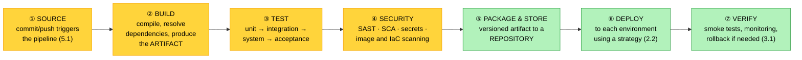

# Objective 5.2 — Explain concepts related to CI/CD pipelines

> **Domain 5.0 — DevOps Fundamentals (10% of exam)** · Exam CV0-004 V4 · Objectives doc v5.0
> **Status:** Exam-ready · **Version:** 2.0 (enhanced) · Supersedes `full notes/Objective-5.2-CI-CD.md`

---

## 0. How to use this note

| Pass | What to read | Time |
|---|---|---|
| **1st (learn)** | Sections 1 → 11 in order | ~55 min |
| **2nd (drill)** | Section 2.1 (CI vs the two CDs) + Section 5.2 (build once, deploy many) + Section 9 (artifacts) | ~20 min |
| **3rd (test)** | Section 14 (practice) + Section 15 (PBQ drills) | ~25 min |
| **Exam eve** | Section 16 (60-second recall sheet) only | ~4 min |

> 📌 **One distinction dominates this objective: continuous integration vs continuous *delivery* vs continuous *deployment*.** Two of those share the initials "CD" and differ by a single human approval step. Learn Section 2.1 first — a large share of the questions resolve to it.

---

## 1. Official objective coverage

> **5.2 Explain concepts related to continuous integration/continuous deployment (CI/CD) pipelines.**
> - Automation
> - Code integration
> - **Code deployment** — Build
> - Testing
> - Security
> - Workflow
> - **Artifacts**
>   - **Images** — VM · Container
>   - **Packages** — RPM · Debian · ZIP · tar
>   - Flat file
> - **Repositories** — Public · Private

### 1.1 What the verb tells you

**"Explain"** — definitions and mechanisms. Expect "which stage does X happen in?", "what is the difference between…", and "which artifact type is…" questions.

### 1.2 Coverage checklist

- [ ] ★ I can distinguish **continuous integration**, **continuous delivery**, and **continuous deployment**
- [ ] I know the order of the **pipeline stages**
- [ ] I know what **build** produces and why it happens once
- [ ] ★ I know the **build once, deploy many** principle
- [ ] I can name the **test types** and roughly where each sits
- [ ] I know what **shift-left security** means and the main scan types
- [ ] I know what **triggers** a pipeline
- [ ] I can list the **artifact types** CompTIA names
- [ ] I know **RPM vs Debian** package formats
- [ ] I know the risks of **public repositories** versus private

---

## 2. The core mental model

### 2.1 ★ CI vs continuous delivery vs continuous deployment

```text
   ┌──────────────────────────────────────────────────────────────────┐
   │ CONTINUOUS INTEGRATION (CI)                                      │
   │ Developers merge to the mainline FREQUENTLY, and every           │
   │ integration is automatically BUILT and TESTED.                   │
   │ Goal: catch integration problems in minutes, not weeks.          │
   │ Ends at: a validated build.                                      │
   └──────────────────────────────────────────────────────────────────┘
                                 ▼
   ┌──────────────────────────────────────────────────────────────────┐
   │ CONTINUOUS DELIVERY (CD)                                         │
   │ Every change that passes is AUTOMATICALLY MADE RELEASABLE and    │
   │ deployed through to a staging/pre-production environment.        │
   │ ★ RELEASE TO PRODUCTION IS A MANUAL DECISION — someone presses   │
   │   the button.                                                    │
   └──────────────────────────────────────────────────────────────────┘
                                 ▼
   ┌──────────────────────────────────────────────────────────────────┐
   │ CONTINUOUS DEPLOYMENT (CD)                                       │
   │ Every change that passes ALL automated gates goes STRAIGHT TO    │
   │ PRODUCTION.                                                      │
   │ ★ NO HUMAN APPROVAL STEP AT ALL.                                 │
   └──────────────────────────────────────────────────────────────────┘

   ★ THE ONE-LINE DISCRIMINATOR
     Continuous DELIVERY  = ready to deploy, human decides WHEN
     Continuous DEPLOYMENT = deployed automatically, NO human gate

     If the scenario mentions an approval, sign-off, or a release
     button → DELIVERY. If it says every passing commit reaches
     production automatically → DEPLOYMENT.
```

> ⚠️ **Continuous deployment requires far more maturity** — comprehensive automated tests, strong monitoring, feature flags, and automated rollback. Without those, it deploys defects to production faster than anyone can react.

### 2.2 The pipeline



```text
   ◄──────── CONTINUOUS INTEGRATION ────────►◄──── CD ────►
   source · build · test · security scan      package · deploy · verify

   ★ FAIL FAST: put the cheapest, fastest checks FIRST. A syntax
     error should fail in 10 seconds, not after a 40-minute test run.
```

---

## 3. Automation

| | |
|---|---|
| **Definition** | Executing the build, test, security, and deployment steps **without manual intervention**, triggered by a defined event. |
| **Why it is the foundation** | **Repeatability** — the same steps run identically every time · **speed** — feedback in minutes · **removes human error** from repetitive work · **auditability** — every run is logged · **scales** — the 500th deployment costs the same as the first |
| **Pipeline as code** | The pipeline definition itself lives in **source control** (5.1), so it is versioned, reviewed, and reproducible — just like IaC (2.4) |
| **What stays manual** | Approval gates in continuous *delivery*, and exception handling |
| **Exam triggers** | "without manual steps", "runs automatically on every commit", "repeatable process", "reduce human error" |

---

## 4. Code integration

| | |
|---|---|
| **Definition** | Merging developers' work into the shared mainline **frequently** — ideally at least daily — with an automated build and test on every integration. |
| **The problem it solves** | **"Integration hell"** — when branches diverge for weeks, merging becomes a large, risky, conflict-ridden event (see 5.1) |
| **What happens on integration** | Checkout → **build** → **unit and integration tests** → static analysis → report pass/fail fast |
| **Practices** | Small, frequent commits · **short-lived branches** (trunk-based, 5.1) · a **broken build is fixed immediately** and takes priority · everyone integrates to the same mainline |
| **Exam triggers** | "merge to mainline frequently", "build and test on every commit", "catch conflicts early", "the build must never stay broken" |

---

## 5. Build and code deployment

### 5.1 Build

| | |
|---|---|
| **Definition** | Transforming source code into a **runnable, deployable artifact** — compiling, resolving dependencies, bundling, and packaging. |
| **Outputs** | An **artifact**: a container image, a VM image, a package (RPM, `.deb`, ZIP, tar), or a compiled binary |
| **Also produced** | Build metadata — version, commit hash, timestamp, dependency manifest (**SBOM**) |
| **Exam triggers** | "compile the code", "resolve dependencies", "produce the deployable output", "build stage" |

### 5.2 ★ Build once, deploy many

```text
   ✗ WRONG — build per environment      ✓ RIGHT — build once, promote

   source ──build──► DEV                source ──build──► ARTIFACT
   source ──build──► TEST                                    │ v1.4.2
   source ──build──► PROD                        ┌───────────┼───────────┐
                                                 ▼           ▼           ▼
   Three different binaries.                    DEV        TEST        PROD
   ⚠ "It worked in test" means
     nothing — PROD is a               THE SAME artifact is promoted.
     DIFFERENT BUILD.                  Only CONFIGURATION differs per
                                       environment (twelve-factor III,
                                       see 1.5).

   ★ The artifact you tested is EXACTLY the artifact you deploy.
     This is why artifacts are IMMUTABLE and VERSIONED.
```

### 5.3 Code deployment

| | |
|---|---|
| **Definition** | Placing the built artifact into a target environment and making it run. |
| **Environments** | Typically **dev → test/QA → staging → production**, each a promotion gate |
| **How it is done** | Using a deployment strategy — **rolling, blue-green, canary, or in-place** (see 2.2) |
| **Configuration** | Supplied **per environment**, injected at deploy time — never baked into the artifact |
| **After deploying** | **Smoke tests**, health checks, monitoring, and an automated **rollback** path (2.2, 3.1) |
| **Exam triggers** | "promote to the next environment", "deploy the artifact", "release to production", "roll back on failure" |

---

## 6. Testing

| | |
|---|---|
| **Definition** | Automated verification at each stage that the change is correct and has broken nothing. |
| **Principle** | **Fail fast** — cheapest and fastest tests first, so feedback arrives in seconds |
| **Exam triggers** | "automated tests on every commit", "regression", "verify before promotion", "quality gate" |

```text
   ★ THE TEST PYRAMID

              ▲   E2E / ACCEPTANCE      few · slow · brittle · expensive
             ╱ ╲  whole system, real
            ╱   ╲ user journeys
           ╱─────╲
          ╱       ╲ INTEGRATION        some · moderate speed
         ╱         ╲ components +
        ╱           ╲ dependencies
       ╱─────────────╲
      ╱               ╲ UNIT           MANY · fast · cheap · isolated
     ╱                 ╲ single functions/classes
    ╱___________________╲

   ⚠ THE ANTI-PATTERN (the "ice cream cone"): mostly slow end-to-end
     tests and few unit tests — slow feedback, flaky results, and
     failures that are hard to localise.
```

| Test type | What it checks | Stage |
|---|---|---|
| **Unit** | One function or class in isolation | Build/CI, first |
| **Integration** | Components working together, and with dependencies | CI |
| **System / end-to-end** | The whole application through real user journeys | Later CI or staging |
| **Regression** | That previously working behaviour still works | Every run |
| **Smoke** | Does it start and serve basic requests? | **Immediately after deploy** |
| **Performance/load** | Latency and throughput under load | Staging |
| **User acceptance (UAT)** | Meets the business requirement | Pre-release |
| **Security** | See Section 7 | Throughout |

---

## 7. Security

**"Shift left"** — move security checks as early in the pipeline as possible, where defects are cheapest to fix. Often called **DevSecOps**: security automated *into* the pipeline rather than bolted on at the end.

```text
   ◄─────────── CHEAPER AND SAFER TO FIX ───────────────

   COMMIT        BUILD          TEST          DEPLOY         RUNTIME
   secret scan   SAST           DAST          policy as      runtime
   pre-commit    SCA (deps)     image scan    code /         monitoring
   hooks         IaC scan       container     admission      (4.6)
                 licence check  scan          control
```

| Check | What it does | When |
|---|---|---|
| **Secret scanning** | Detects credentials in code before they are committed or merged | Commit / PR |
| **SAST** — static analysis | Analyses **source code** without running it | Build |
| **SCA** — software composition analysis | Checks **third-party dependencies** for known **CVEs** and licence issues (4.1) | Build |
| **IaC scanning** | Finds insecure infrastructure definitions before deployment (2.4) | Build |
| **Container image scanning** | Finds vulnerable packages in the image (1.6, 4.1) | After build, in the registry |
| **DAST** — dynamic analysis | Tests the **running application** from outside | Test/staging |
| **Policy as code / admission control** | Blocks non-compliant artifacts or configurations from deploying (2.4) | Deploy gate |
| **SBOM generation** | Records every component so "are we affected?" can be answered fast (1.11, 4.1) | Build |

| | **SAST** | **DAST** | **SCA** |
|---|---|---|---|
| Analyses | **Source code** | **A running application** | **Dependencies** |
| Needs the app running | ❌ No | ✅ **Yes** | ❌ No |
| Runs | Early (build) | Later (test/staging) | Early (build) |
| Finds | Insecure code patterns, injection risks | Runtime and configuration flaws | Known **CVEs** in libraries |

> ★ **The pipeline is also an attack surface.** It holds deployment credentials and can push to production, so it needs **least-privilege pipeline identities**, protected branches (5.1), no secrets in the pipeline definition, and audit logging (4.3).

---

## 8. Workflow

| | |
|---|---|
| **Definition** | The defined **sequence of stages, triggers, conditions, and gates** that a change passes through. |
| **Triggers** | **Push/commit** (5.1) · **pull request opened or updated** · **merge to main** · **schedule** (nightly builds) · **manual** · an upstream pipeline completing · a tag being created |
| **Structure** | Stages run in order; **jobs within a stage can run in parallel**; later stages depend on earlier ones passing |
| **Gates** | Automated (tests must pass, coverage threshold, security scan clean) and **manual approvals** — the latter being what makes it continuous *delivery* rather than deployment |
| **Failure handling** | Fail fast, notify, and **stop the pipeline** — a failed stage must not promote |
| **Environments** | Progressive promotion dev → test → staging → production, often with different approval requirements per environment |
| **Exam triggers** | "runs on every pull request", "requires approval before production", "stages run in sequence", "nightly build", "pipeline stopped at the test stage" |

---

## 9. Artifacts

| | |
|---|---|
| **Definition** | The **deployable output of a build** — the thing that gets stored, versioned, promoted, and deployed. |
| **Key properties** | **Immutable** (never modified after build) · **versioned** · **traceable** to the commit that produced it · stored in a **repository** |
| **Exam triggers** | "the output of the build", "promote the same package to production", "stored in the registry", "versioned build output" |

### 9.1 ★ The types CompTIA names

```text
   IMAGES
   ┌──────────────────────────────────────────────────────────────┐
   │ VM IMAGE          a full machine image — OS + software        │
   │                   AMI, VHD/VHDX, OVA, qcow2                   │
   │                   → boots as a virtual machine (1.7)          │
   │                   → the basis of GOLDEN IMAGES and immutable   │
   │                     infrastructure (3.4)                       │
   ├──────────────────────────────────────────────────────────────┤
   │ CONTAINER IMAGE   application + dependencies, LAYERED,        │
   │                   shares the host kernel (1.6)                 │
   │                   → far smaller and faster to start than a VM  │
   │                     image; stored in a container REGISTRY      │
   └──────────────────────────────────────────────────────────────┘

   PACKAGES
   ┌──────────────┬───────────────────────────────────────────────┐
   │ RPM          │ Red Hat Package Manager — RHEL, CentOS,       │
   │ (.rpm)       │ Fedora, SUSE                                   │
   ├──────────────┼───────────────────────────────────────────────┤
   │ DEBIAN       │ Debian package — Debian, Ubuntu                │
   │ (.deb)       │                                                │
   ├──────────────┼───────────────────────────────────────────────┤
   │ ZIP          │ Cross-platform compressed archive              │
   ├──────────────┼───────────────────────────────────────────────┤
   │ TAR          │ Tape archive — bundles files, commonly         │
   │ (.tar/.tar.gz)│ compressed as a "tarball". Unix/Linux standard│
   └──────────────┴───────────────────────────────────────────────┘

   FLAT FILE      plain, unstructured or simply structured files —
                  configuration, scripts, CSV/JSON data, static
                  content. No packaging or compilation.

   ★ RPM = Red Hat family.  DEB = Debian/Ubuntu family.
     That single mapping answers most package questions.
```

---

## 10. Repositories

| | |
|---|---|
| **Definition** | Where code and artifacts are **stored, versioned, and distributed**. |
| **Two kinds** | **Source repositories** — the code (5.1). **Artifact repositories** — the built outputs: container registries, package repositories, binary stores |
| **Exam triggers** | "where images are stored", "pull dependencies from", "internal registry", "publicly available packages" |

### 10.1 Public vs private

| | **Public** | **Private** |
|---|---|---|
| Access | Anyone | **Authenticated and access-controlled** |
| Contents | Open-source packages, official base images | **Proprietary code and internal artifacts** |
| Examples | Public container registries, language package indexes | Internal registries and artifact stores |
| Cost | Free tier, limited | Storage and transfer |
| **★ Risks** | **Supply-chain attacks** · **typosquatting** (a malicious package with a near-identical name) · **unvetted or abandoned packages** · **rate limits** breaking builds · upstream changes or deletions | You operate and secure it |
| Controls | Pin versions/digests, verify signatures, scan everything, use an internal mirror | Access control, scanning, retention policies |

> ★ **The standard practice: pull public dependencies once, vet and scan them, then serve them from a private repository or pull-through cache.** That removes rate-limit fragility, gives reproducible builds, and stops an upstream change breaking or compromising your pipeline (see 1.6, 4.1).

> ⚠️ **Pin by digest or an immutable version, never a floating tag.** `:latest` is a mutable pointer — two builds a day apart can produce different results, which destroys reproducibility (1.6).

---

## 11. Comparison tables

### 11.1 ★ The three terms

| | **Continuous integration** | **Continuous delivery** | **Continuous deployment** |
|---|---|---|---|
| Scope ends at | A **validated build** | **Ready to release** (deployed to staging) | **Live in production** |
| Automated build and test | ✅ | ✅ | ✅ |
| Automatically deployed to production | ❌ | ❌ | ✅ **Yes** |
| **Human approval to release** | N/A | ✅ **Required** | ❌ **None** |
| Maturity required | Moderate | High | **Very high** — full test coverage, monitoring, feature flags, automated rollback |
| Abbreviation | CI | CD | CD |

### 11.2 Pipeline stage → what happens

| Stage | Activity | Fails when |
|---|---|---|
| **Source** | Trigger on commit, PR, merge, or schedule | — |
| **Build** | Compile, resolve dependencies, produce the artifact | Compilation or dependency errors |
| **Test** | Unit → integration → system | A test fails or coverage drops |
| **Security** | SAST, SCA, secret scan, image and IaC scan | A policy or severity threshold is breached |
| **Package/store** | Version and publish the artifact to a repository | Registry unavailable, tag conflict |
| **Deploy** | Promote through environments using a strategy | Health checks fail |
| **Verify** | Smoke tests and monitoring | Errors after release → **roll back** |

### 11.3 Artifact type → use

| Artifact | Deployed as | Typical use |
|---|---|---|
| **VM image** | A virtual machine | Golden images, immutable infrastructure (1.7, 3.4) |
| **Container image** | A container | Microservices, portable workloads (1.6) |
| **RPM** | An installed package | Red Hat / CentOS / Fedora / SUSE |
| **Debian (.deb)** | An installed package | Debian / Ubuntu |
| **ZIP** | An extracted archive | Cross-platform bundles, function packages |
| **tar / tarball** | An extracted archive | Unix/Linux distribution |
| **Flat file** | Copied into place | Configuration, scripts, static content, data |

### 11.4 Security scan selection

| Requirement | Scan |
|---|---|
| Find insecure patterns in our own source code | **SAST** |
| Find known CVEs in third-party libraries | **SCA** |
| Test the running application for exploitable flaws | **DAST** |
| Stop credentials being committed | **Secret scanning** |
| Find vulnerable packages inside a container image | **Image scanning** |
| Catch an insecure security group before it is created | **IaC scanning / policy as code** |
| Answer "are we affected by this new CVE?" quickly | **SBOM** |

---

## 12. Exam traps & distractor patterns

| # | Trap | The truth |
|---|---|---|
| 1 | "Continuous delivery and continuous deployment are the same" | ❌ **Delivery** makes every change *releasable* — a **human decides when**. **Deployment** releases automatically with **no human gate** |
| 2 | "CI includes deploying to production" | CI ends at a **validated build**. Deployment is the CD half |
| 3 | "Build separately for each environment" | ❌ **Build once, deploy many.** Rebuilding per environment means production runs a **different binary** from the one you tested |
| 4 | "Configuration should be baked into the artifact" | Artifacts are **immutable**; configuration is injected **per environment** at deploy time (twelve-factor III, 1.5) |
| 5 | "Put end-to-end tests first for confidence" | **Fail fast** — cheap, fast unit tests first. E2E-heavy suites are the **ice-cream-cone anti-pattern**: slow, flaky, hard to localise |
| 6 | "Security testing belongs at the end" | **Shift left** — the earlier a defect is found, the cheaper it is to fix |
| 7 | "SAST and DAST are interchangeable" | **SAST** analyses **source code** without running it; **DAST** tests a **running application** |
| 8 | "SCA scans our own code" | **SCA scans third-party dependencies** for known CVEs and licence issues |
| 9 | "Public repositories are fine for production builds" | **Supply-chain risk, typosquatting, and rate limits.** Vet, scan, and serve from a **private repository or pull-through cache** |
| 10 | "Use `:latest` so builds always get the newest version" | `:latest` is a **mutable pointer** — builds become non-reproducible. **Pin a digest or immutable version** |
| 11 | "RPM and Debian packages are interchangeable" | **RPM = Red Hat family. `.deb` = Debian/Ubuntu family** |
| 12 | "Continuous deployment is simply better" | It demands **very high maturity** — without full test coverage, monitoring, and automated rollback it ships defects to production faster |
| 13 | "A broken build can be fixed later" | In CI a **broken build blocks everyone** and is fixed immediately — it is the highest-priority work |
| 14 | "The pipeline is infrastructure, not an attack surface" | It holds **production deployment credentials**. Least-privilege pipeline identity, protected branches, and audit logging apply (4.3) |
| 15 | "Artifacts can be edited after the build" | They are **immutable and versioned** — that is what makes promotion trustworthy |

**Disambiguation drill:**

| Pair | The deciding question |
|---|---|
| **Continuous delivery vs deployment** | Is there a **human approval** before production? |
| **CI vs CD** | Does it end at a **validated build**, or does it **release**? |
| **SAST vs DAST** | Analysing **code at rest**, or a **running application**? |
| **SAST vs SCA** | **Our code**, or **third-party dependencies**? |
| **Build vs deploy** | Producing the **artifact**, or **placing and running** it? |
| **VM image vs container image** | A full **machine with an OS**, or an **application sharing the host kernel**? |
| **RPM vs Debian** | **Red Hat family**, or **Debian/Ubuntu family**? |
| **Public vs private repository** | Open to anyone, or **access-controlled and vetted**? |

---

## 13. Keyword → answer trigger table

| If you see… | Think |
|---|---|
| merge to mainline frequently · build and test on every commit · catch conflicts early | **Continuous integration** |
| every change is releasable but someone approves the production release | **Continuous delivery** |
| every passing commit goes straight to production with no approval | **Continuous deployment** |
| compile, resolve dependencies, produce the deployable output | **Build** |
| the same package is promoted through dev, test, and production | **Build once, deploy many** |
| configuration differs per environment but the artifact does not | **Immutable artifact + injected config** |
| cheapest tests first, feedback in seconds | **Fail fast / test pyramid** |
| mostly slow end-to-end tests, few unit tests | **Ice-cream-cone anti-pattern** |
| analyse source code without running it | **SAST** |
| test the running application from outside | **DAST** |
| check third-party libraries for known CVEs | **SCA** |
| detect credentials before they are committed | **Secret scanning** |
| block an insecure template before deployment | **IaC scanning / policy as code** |
| security checks moved earlier in the pipeline | **Shift left / DevSecOps** |
| runs on every pull request · nightly build · manual approval gate | **Workflow triggers and gates** |
| the deployable output of the build, versioned and immutable | **Artifact** |
| full machine image with an OS | **VM image** |
| application plus dependencies, layered, shares the host kernel | **Container image** |
| .rpm | **Red Hat family package** |
| .deb | **Debian/Ubuntu family package** |
| plain configuration or data file, no packaging | **Flat file** |
| builds break when the upstream registry rate-limits us | **Use a private repository / pull-through cache** |
| two builds a day apart produced different results | **Floating tag — pin a digest** |

---

## 14. Practice questions

<details>
<summary><b>Q1.</b> What is the difference between continuous delivery and continuous deployment?</summary>

A. They are the same · **B. Continuous delivery makes every passing change releasable but requires a human decision to release to production; continuous deployment releases automatically with no human gate** · C. Delivery skips testing · D. Deployment applies only to containers

**Correct: B.** The single differentiator is the **manual approval step** before production.
- **A wrong:** They share initials but differ materially.
- **C wrong:** Both depend on comprehensive automated testing.
- **D wrong:** Neither is tied to a packaging format.
</details>

<details>
<summary><b>Q2.</b> A team builds the application separately for each environment. What is the risk?</summary>

**A. Production runs a different binary from the one that was tested, so testing provides no guarantee** · B. Builds take less time · C. Configuration cannot be changed · D. Artifacts become immutable

**Correct: A.** **Build once, deploy many** exists precisely so the artifact you tested is the artifact you ship; only configuration should vary by environment.
- **B wrong:** It takes more time, not less.
- **C/D wrong:** Neither follows.
</details>

<details>
<summary><b>Q3.</b> Which analysis examines source code for insecure patterns without executing the application?</summary>

**A. SAST** · B. DAST · C. SCA · D. Penetration testing

**Correct: A — static application security testing.** It runs early, at build time, on the code itself.
- **B wrong:** DAST tests a **running** application.
- **C wrong:** SCA examines third-party dependencies.
- **D wrong:** Penetration testing is human-led exploitation (4.1).
</details>

<details>
<summary><b>Q4.</b> Which package format is associated with Red Hat, CentOS, and Fedora?</summary>

**A. RPM** · B. Debian (.deb) · C. ZIP · D. tar

**Correct: A — RPM (Red Hat Package Manager).** `.deb` belongs to the Debian/Ubuntu family.
- **B wrong:** Debian/Ubuntu.
- **C/D wrong:** Both are general-purpose archives, not distribution package formats.
</details>

<details>
<summary><b>Q5.</b> A pipeline's first stage is a 40-minute end-to-end test suite. What principle is being violated?</summary>

**A. Fail fast — the cheapest, fastest checks should run first so obvious failures are caught in seconds** · B. Build once, deploy many · C. Shift left · D. Immutability

**Correct: A.** Running expensive tests before cheap ones wastes time and delays feedback; this is also the ice-cream-cone anti-pattern.
- **B wrong:** That concerns artifact promotion.
- **C wrong:** Shift left concerns security placement, though the spirit is related.
- **D wrong:** Unrelated to test ordering.
</details>

<details>
<summary><b>Q6.</b> Which scan identifies known CVEs in third-party libraries the application depends on?</summary>

A. SAST · B. DAST · **C. SCA (software composition analysis)** · D. Secret scanning

**Correct: C.** SCA inventories dependencies and matches them against vulnerability databases, and also flags licence issues (4.1).
- **A wrong:** SAST analyses your own code.
- **B wrong:** DAST tests the running app.
- **D wrong:** Secret scanning finds credentials.
</details>

<details>
<summary><b>Q7.</b> What does "shift left" mean in a CI/CD context?</summary>

A. Moving deployments to an earlier time of day · **B. Moving security and quality checks earlier in the pipeline, where defects are cheaper and safer to fix** · C. Reducing the number of environments · D. Using left-aligned code formatting

**Correct: B.** Catching a vulnerability at commit or build time is far cheaper than finding it in production.
- **A/C/D wrong:** None is the meaning.
</details>

<details>
<summary><b>Q8.</b> A build pipeline references a container base image by the tag <code>:latest</code>. Two builds a day apart produce different results. Why?</summary>

**A. A tag is a mutable pointer — it can be moved to a different image, so builds are not reproducible. Pin a digest or an immutable version** · B. The registry was offline · C. The Dockerfile changed · D. Caching was disabled

**Correct: A.** Reproducibility requires an immutable reference (see 1.6).
- **B/C/D wrong:** None explains a silently changing base image.
</details>

<details>
<summary><b>Q9.</b> Which describes continuous integration?</summary>

**A. Developers merge to the mainline frequently, and every integration is automatically built and tested** · B. Every change is deployed to production automatically · C. Manual testing before each release · D. Building an artifact once per quarter

**Correct: A.** CI's purpose is to surface integration problems within minutes rather than after weeks of divergence.
- **B wrong:** That is continuous deployment.
- **C/D wrong:** Both are the opposite of CI.
</details>

<details>
<summary><b>Q10.</b> An organisation's builds fail intermittently because a public package registry rate-limits their requests. What is the appropriate remedy?</summary>

**A. Mirror vetted dependencies into a private repository or pull-through cache** · B. Retry the build more often · C. Switch to `:latest` tags · D. Disable dependency scanning

**Correct: A.** A private repository removes rate-limit fragility, gives reproducible builds, and lets you vet and scan what enters (4.1).
- **B wrong:** More retries worsen rate limiting.
- **C wrong:** That harms reproducibility.
- **D wrong:** That removes a security control.
</details>

<details>
<summary><b>Q11.</b> Which artifact type contains an application plus its dependencies and shares the host kernel?</summary>

A. VM image · **B. Container image** · C. RPM package · D. Flat file

**Correct: B.** Container images are layered and kernel-sharing, making them far smaller and faster to start than VM images (1.6).
- **A wrong:** A VM image includes a full guest OS.
- **C wrong:** An RPM installs onto an existing system.
- **D wrong:** A flat file is unpackaged content.
</details>

<details>
<summary><b>Q12.</b> What triggers a CI/CD pipeline most commonly?</summary>

**A. A commit or push to the source repository, or a pull request being opened or updated** · B. A monthly calendar reminder · C. A user logging in · D. An instance restarting

**Correct: A.** Source-control events are the standard trigger, which is the direct link to 5.1. Schedules and manual runs are also used.
- **B/C/D wrong:** None is a typical pipeline trigger.
</details>

<details>
<summary><b>Q13.</b> Why must artifacts be immutable and versioned?</summary>

**A. So the artifact tested in one environment is provably the same one promoted to the next, making testing meaningful and rollback reliable** · B. To reduce storage cost · C. Because registries require it · D. To speed up compilation

**Correct: A.** Immutability plus versioning is what makes promotion trustworthy and rollback precise.
- **B/C/D wrong:** None is the reason.
</details>

<details>
<summary><b>Q14.</b> Which testing type runs immediately after a deployment to confirm the application starts and serves basic requests?</summary>

A. Unit testing · B. Load testing · **C. Smoke testing** · D. Static analysis

**Correct: C.** A smoke test is the quick post-deployment sanity check that gates whether to proceed or roll back (2.2).
- **A wrong:** Unit tests run at build time.
- **B wrong:** Load testing measures performance, usually in staging.
- **D wrong:** Static analysis runs on code before deployment.
</details>

<details>
<summary><b>Q15.</b> A change passes all automated tests and security scans and is deployed to production without anyone approving it. Which practice is in use?</summary>

A. Continuous integration · B. Continuous delivery · **C. Continuous deployment** · D. Manual release management

**Correct: C.** No human gate is the defining characteristic — and it requires very high test, monitoring, and rollback maturity.
- **A wrong:** CI ends at a validated build.
- **B wrong:** Delivery requires a release decision.
- **D wrong:** Nothing manual occurred.
</details>

<details>
<summary><b>Q16.</b> Which is a genuine risk of consuming packages from public repositories?</summary>

**A. Typosquatting and supply-chain compromise, where a malicious package with a near-identical name is installed** · B. Packages are always outdated · C. They cannot be scanned · D. They are incompatible with containers

**Correct: A.** Name-similarity attacks and compromised upstream packages are a real and growing supply-chain threat; vetting, scanning, and private mirrors are the controls.
- **B/C/D wrong:** None is accurate.
</details>

<details>
<summary><b>Q17.</b> Where should environment-specific configuration live?</summary>

A. Baked into the artifact at build time · **B. Supplied to the artifact at deploy time, per environment** · C. Hard-coded in source · D. In the container image layers

**Correct: B.** Injecting configuration keeps one artifact promotable across all environments (twelve-factor III, 1.5) — and keeps secrets out of images (4.4).
- **A/D wrong:** Both force a rebuild per environment and can leak secrets into layers.
- **C wrong:** Hard-coding prevents reuse and risks committing secrets.
</details>

<details>
<summary><b>Q18.</b> Which scan tests a deployed, running application for exploitable flaws?</summary>

A. SAST · **B. DAST** · C. SCA · D. Secret scanning

**Correct: B — dynamic application security testing.** It requires a running instance, so it sits later in the pipeline, typically against staging.
- **A/C/D wrong:** All operate on code, dependencies, or repositories without running the application.
</details>

<details>
<summary><b>Q19.</b> In continuous integration, what should happen when the shared build breaks?</summary>

**A. It becomes the team's highest priority and is fixed immediately, because a broken mainline blocks everyone** · B. It is logged and addressed in the next sprint · C. The pipeline is disabled · D. Tests are removed until it passes

**Correct: A.** A broken build stops integration for the whole team, so fixing it takes precedence over new work.
- **B wrong:** Deferring blocks everyone and compounds divergence.
- **C/D wrong:** Both remove the safety net rather than restoring it.
</details>

<details>
<summary><b>Q20.</b> Which artifact type is used as the basis for golden images and immutable infrastructure?</summary>

**A. VM image** · B. Flat file · C. ZIP archive · D. Debian package

**Correct: A.** A VM image contains the OS and pre-installed, hardened software, so instances launch already in the desired state (1.7, 3.4, 4.4).
- **B/C/D wrong:** None provides a bootable machine baseline.
</details>

<details>
<summary><b>Q21.</b> Why is the CI/CD pipeline itself considered a security-sensitive asset?</summary>

**A. It holds credentials capable of deploying to production, so a compromised pipeline can push malicious code directly** · B. It stores customer data · C. It is internet-facing by default · D. It cannot be logged

**Correct: A.** Pipeline identities need least privilege, secrets belong in a secret store, and pipeline runs must be audited (4.3, 4.4).
- **B/C wrong:** Neither is generally true.
- **D wrong:** Pipeline runs are logged and should be.
</details>

<details>
<summary><b>Q22.</b> Which sequence correctly orders the pipeline stages?</summary>

A. Deploy → build → test → source · **B. Source → build → test → security scan → package → deploy → verify** · C. Test → source → deploy → build · D. Build → deploy → test → source

**Correct: B.** Trigger, produce the artifact, validate it, scan it, store it, promote it, then confirm in place.
- **A/C/D wrong:** Each places deployment before the artifact exists or before validation.
</details>

<details>
<summary><b>Q23.</b> What does an SBOM produced during the build enable?</summary>

**A. Quickly determining whether deployed software contains a component affected by a newly announced CVE** · B. Faster compilation · C. Automatic patching · D. Replacing DAST

**Correct: A.** A software bill of materials inventories components and dependencies, turning "are we affected?" from a multi-day investigation into a query (4.1, 1.11).
- **B/C/D wrong:** An SBOM is an inventory, not a build optimiser, patcher, or test.
</details>

<details>
<summary><b>Q24.</b> Which combination describes a mature continuous deployment practice?</summary>

**A. Comprehensive automated testing, strong monitoring, feature flags, and automated rollback** · B. Manual approval before every release · C. Weekly deployment windows · D. Testing performed only in production

**Correct: A.** Without those, removing the human gate simply ships defects to production faster.
- **B wrong:** That is continuous **delivery**.
- **C wrong:** Scheduled windows contradict continuous deployment.
- **D wrong:** Testing in production only is reckless, not mature.
</details>

<details>
<summary><b>Q25.</b> Which pairing of artifact to platform is CORRECT?</summary>

A. `.deb` → Red Hat Enterprise Linux · **B. `.rpm` → RHEL, CentOS, Fedora** · C. `.rpm` → Ubuntu · D. tar → a bootable virtual machine

**Correct: B.** RPM is the Red Hat family format; `.deb` belongs to Debian and Ubuntu.
- **A/C wrong:** The families are reversed.
- **D wrong:** A tarball is an archive, not a bootable image.
</details>

---

## 15. PBQ-style drills

### Drill A — CI, delivery, or deployment?

| # | Description | Which? |
|---|---|---|
| 1 | Every commit triggers a build and unit tests | |
| 2 | Passing changes reach staging automatically; a manager clicks "release" | |
| 3 | Every passing change reaches production with no approval | |
| 4 | Developers merge to main at least daily | |
| 5 | The pipeline ends at a validated build artifact | |

<details><summary>Answers</summary>

1 → **Continuous integration** · 2 → **Continuous delivery** · 3 → **Continuous deployment** · 4 → **Continuous integration** · 5 → **Continuous integration**

**The discriminator between 2 and 3 is the human approval.**
</details>

### Drill B — Which security scan?

| # | Requirement | Scan? |
|---|---|---|
| 1 | Find SQL-injection-prone patterns in our own code | |
| 2 | Find a vulnerable version of a logging library we import | |
| 3 | Test the deployed staging app for exploitable flaws | |
| 4 | Stop an AWS key being committed | |
| 5 | Find a vulnerable OS package inside our container image | |
| 6 | Block a template that creates a public bucket | |

<details><summary>Answers</summary>

1 → **SAST** · 2 → **SCA** · 3 → **DAST** · 4 → **Secret scanning** · 5 → **Container image scanning** · 6 → **IaC scanning / policy as code**
</details>

### Drill C — Name the artifact type

| # | Description | Type? |
|---|---|---|
| 1 | Bootable machine image containing a hardened OS | |
| 2 | Layered application bundle sharing the host kernel | |
| 3 | Installable package for Ubuntu | |
| 4 | Installable package for RHEL | |
| 5 | Compressed cross-platform archive of function code | |
| 6 | A plain configuration file copied into place | |

<details><summary>Answers</summary>

1 → **VM image** · 2 → **Container image** · 3 → **Debian (.deb)** · 4 → **RPM** · 5 → **ZIP** · 6 → **Flat file**
</details>

### Drill D — Order the pipeline

Put in order: *deploy · security scan · verify · build · source trigger · test · store artifact*

<details><summary>Answer</summary>

**source trigger → build → test → security scan → store artifact → deploy → verify**

Two principles ride on this order: **fail fast** (cheap checks first) and **build once, deploy many** (one artifact stored, then promoted through environments with only configuration changing).
</details>

---

## 16. 60-second recall sheet

```text
╔══════════════════════════════════════════════════════════════════════╗
║  5.2 — CI/CD PIPELINES                                               ║
╠══════════════════════════════════════════════════════════════════════╣
║  ★★ THE THREE TERMS — the #1 question                                ║
║   CONTINUOUS INTEGRATION  merge to mainline OFTEN + auto BUILD/TEST  ║
║      → ends at a VALIDATED BUILD                                     ║
║   CONTINUOUS DELIVERY     every change is RELEASABLE, deployed to    ║
║      staging → ★ A HUMAN DECIDES WHEN to release to production       ║
║   CONTINUOUS DEPLOYMENT   every passing change goes STRAIGHT TO      ║
║      PRODUCTION → ★ NO HUMAN GATE (needs full tests, monitoring,     ║
║      feature flags, automated rollback)                              ║
║   ★ THE DIFFERENCE IS THE APPROVAL STEP                              ║
╠══════════════════════════════════════════════════════════════════════╣
║  PIPELINE  SOURCE → BUILD → TEST → SECURITY → PACKAGE/STORE →        ║
║            DEPLOY → VERIFY                                           ║
║   TRIGGERS: push/commit · PR opened or updated · merge · schedule ·  ║
║   manual · tag         GATES: automated checks + MANUAL APPROVALS    ║
║   ★ FAIL FAST — cheapest/fastest checks FIRST                        ║
║  AUTOMATION = repeatability, speed, no human error, auditability     ║
║   pipeline-as-code lives in SOURCE CONTROL (5.1)                     ║
║  CODE INTEGRATION solves "INTEGRATION HELL" · short-lived branches · ║
║   ★ a BROKEN BUILD is the team's top priority                        ║
╠══════════════════════════════════════════════════════════════════════╣
║  ★ BUILD ONCE, DEPLOY MANY                                           ║
║    ONE artifact promoted dev → test → staging → prod                 ║
║    ONLY CONFIGURATION differs per environment (twelve-factor III)    ║
║    ⚠ Rebuilding per environment means PROD runs a DIFFERENT BINARY   ║
║      from the one you tested                                         ║
║    Artifacts are IMMUTABLE + VERSIONED + traceable to the commit     ║
╠══════════════════════════════════════════════════════════════════════╣
║  TESTING — THE PYRAMID: many fast UNIT → some INTEGRATION →          ║
║   few slow E2E.  ⚠ inverted = "ICE CREAM CONE" anti-pattern          ║
║   SMOKE test runs immediately AFTER DEPLOY                           ║
║  SECURITY — ★ SHIFT LEFT (DevSecOps)                                 ║
║   SAST = OUR SOURCE CODE, not running · SCA = THIRD-PARTY DEPS/CVEs  ║
║   DAST = the RUNNING APP · secret scanning · image scanning ·        ║
║   IaC scanning / policy as code · SBOM ("are we affected?")          ║
║   ⚠ The PIPELINE ITSELF holds prod credentials → least privilege     ║
╠══════════════════════════════════════════════════════════════════════╣
║  ★ ARTIFACTS (the build output)                                      ║
║   IMAGES     VM IMAGE = full OS, bootable → golden images (1.7/3.4)  ║
║              CONTAINER IMAGE = app + deps, layered, shares kernel    ║
║   PACKAGES   ★ RPM = RED HAT family (RHEL/CentOS/Fedora/SUSE)        ║
║              ★ .deb = DEBIAN family (Debian/Ubuntu)                  ║
║              ZIP = cross-platform archive · TAR = Unix tarball       ║
║   FLAT FILE  plain config/script/data — no packaging                 ║
╠══════════════════════════════════════════════════════════════════════╣
║  REPOSITORIES  source repos (5.1) AND artifact repos/registries      ║
║   PUBLIC  ⚠ SUPPLY-CHAIN attacks · TYPOSQUATTING · unvetted ·       ║
║           RATE LIMITS breaking builds · upstream changes             ║
║   PRIVATE access-controlled, vetted, scanned, reproducible           ║
║   ★ Vet public deps once, then serve from a PRIVATE MIRROR/CACHE     ║
║   ⚠ PIN A DIGEST — ":latest" is mutable and destroys reproducibility ║
╚══════════════════════════════════════════════════════════════════════╝
```

---

## 17. Cross-references

| Related objective | Connection |
|---|---|
| **1.5 Cloud-native design** | **Config in the environment** (twelve-factor III) is what makes build-once-deploy-many work |
| **1.6 Containerization** | Container images are the dominant artifact; registries are the artifact repository; pin digests, not `:latest` |
| **1.7 Virtualization** | VM images as artifacts; golden images |
| **2.2 Deployment strategies** | The **deploy** stage executes rolling, blue-green, or canary — and the rollback path |
| **2.4 Code to deploy and configure** | IaC and policy-as-code run **inside** the pipeline; pipeline-as-code is versioned like any code |
| **3.1 Observability** | The **verify** stage depends on monitoring; canary gates need per-version metrics |
| **3.4 Resource life cycle** | Semantic versioning of artifacts; immutable replacement built from pipeline output |
| **4.1 Vulnerability management** | SCA and image scanning are pipeline-embedded vulnerability management; SBOM answers exposure questions |
| **4.4 Security best practices** | Secrets must never be in the pipeline definition or the artifact; scanning enforces hardening |
| **5.1 Source control** | **A push triggers the pipeline**; branch protection requires status checks to pass before merge |
| **5.4 DevOps tools** | Jenkins, GitHub Actions, Docker, Terraform, and Kubernetes are named there |

> 🔑 **Carry this forward:** the two ideas that generate most correct answers are **the approval step distinguishes delivery from deployment**, and **build once, deploy many** — the artifact you tested must be the artifact you ship.

---

*Source of truth: CompTIA Cloud+ CV0-004 V4 Exam Objectives, document version 5.0. The test pyramid, shift-left security, and SAST/DAST/SCA terminology are industry conventions included as supporting context. Product names are illustrative; the exam is vendor-neutral.*
