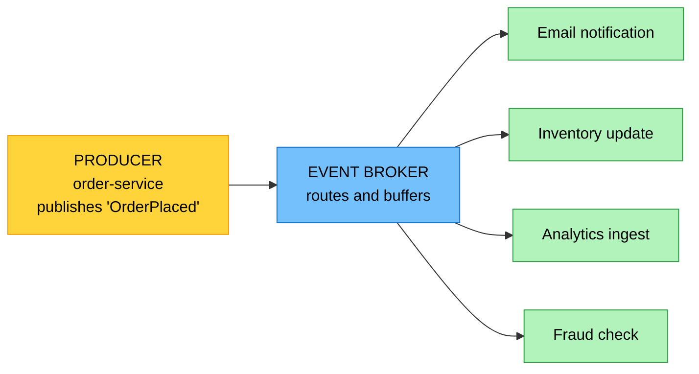

# Objective 5.3 — Explain concepts related to integration of systems

> **Domain 5.0 — DevOps Fundamentals (10% of exam)** · Exam CV0-004 V4 · Objectives doc v5.0
> **Status:** Exam-ready · **Version:** 2.0 (enhanced) · Supersedes `full notes/Objective-5.3-Integration-Systems.md`

---

## 0. How to use this note

| Pass | What to read | Time |
|---|---|---|
| **1st (learn)** | Sections 1 → 9 in order | ~45 min |
| **2nd (drill)** | Section 2.1 (sync vs async) + Section 9.1 (the four API styles) + Section 8.1 (over/under-fetching) | ~15 min |
| **3rd (test)** | Section 12 (practice) + Section 13 (PBQ drills) | ~25 min |
| **Exam eve** | Section 14 (60-second recall sheet) only | ~4 min |

> 📌 **A small objective with clean, distinct answers.** Most questions reduce to picking the right integration style from a described requirement — the discriminators are **synchronous vs event-driven**, **request/response vs persistent bidirectional**, and **fixed response shape vs client-specified**.

---

## 1. Official objective coverage

> **5.3 Explain concepts related to integration of systems.**
> - Event-driven architectures
> - **Web services**
>   - Representational State Transfer (REST)
>   - Simple Object Access Protocol (SOAP)
>   - Remote procedure call (RPC)
> - Web sockets
> - GraphQL

### 1.1 What the verb tells you

**"Explain"** — definitions and comparisons. Expect "which integration style fits this requirement?" and "what is the difference between X and Y?"

### 1.2 Coverage checklist

- [ ] I can distinguish **synchronous** integration from **event-driven**
- [ ] I know REST's defining traits: **resources, HTTP verbs, stateless, usually JSON**
- [ ] I know SOAP is a **protocol**, uses **XML only**, and has a **WSDL contract**
- [ ] I know **RPC is action-oriented** while REST is resource-oriented
- [ ] I know what **gRPC** adds — HTTP/2, binary encoding, streaming
- [ ] ★ I know **WebSockets are persistent and bidirectional**, unlike HTTP request/response
- [ ] ★ I know GraphQL solves **over-fetching and under-fetching** from a **single endpoint**
- [ ] I know GraphQL's trade-offs — caching and expensive queries
- [ ] I can pick the right style from a stated requirement

---

## 2. The core mental model

### 2.1 ★ Two fundamentally different ways to integrate

```text
   SYNCHRONOUS (request/response)      ASYNCHRONOUS (event-driven)

   ┌────────┐  request   ┌────────┐    ┌────────┐  publish  ╔═══════╗
   │ CLIENT │ ─────────► │ SERVER │    │PRODUCER│ ────────► ║ BROKER║
   │        │ ◄───────── │        │    └────────┘           ╚═══╤═══╝
   └────────┘  response  └────────┘     fire and                │
     ▲ WAITS for the answer             forget          ┌───────┼───────┐
                                                        ▼       ▼       ▼
   REST · SOAP · RPC · GraphQL                      consumer consumer consumer

   ✓ Simple, immediate answer            ✓ DECOUPLED — producer doesn't
   ✓ Easy to reason about                  know who listens
   ✗ Both sides must be UP                ✓ Buffers spikes; survives a
   ✗ Caller BLOCKS                          consumer outage
   ✗ Failure CASCADES                     ✗ EVENTUAL consistency
                                          ✗ Harder to trace end-to-end

   ★ THE DECIDER: does the caller need the answer NOW?
     Yes → synchronous web service.  No → event-driven.
```

### 2.2 The integration styles at a glance

```text
   REQUEST/RESPONSE                     PERSISTENT / STREAMING
   ┌──────────────────────────┐         ┌──────────────────────────┐
   │ REST     resource-oriented│         │ WEBSOCKETS               │
   │          verbs on URIs    │         │   full-duplex, always-on │
   │ SOAP     strict XML       │         │   server can PUSH        │
   │          protocol + WSDL  │         │                          │
   │ RPC      action-oriented  │         │ gRPC streaming           │
   │          call a procedure │         │ GraphQL subscriptions    │
   │ GRAPHQL  client asks for  │         │   (usually over          │
   │          exactly the      │         │    WebSockets)           │
   │          fields it needs  │         └──────────────────────────┘
   └──────────────────────────┘

   EVENT-DRIVEN — decoupled, asynchronous, broker in the middle
```

---

## 3. Event-driven architectures

| | |
|---|---|
| **Definition** | Components communicate by **producing and reacting to events** — a notification that something happened — rather than calling each other directly. |
| **The three parts** | **Producer** emits an event · **broker / event bus** routes and buffers it · **consumers** react independently |
| **★ Key property** | The producer **does not know or care who is listening** — this is the loose coupling from 1.5 |
| **Benefits** | Services fail, scale, and deploy **independently** · spikes are **buffered** by the broker · **new consumers are added with no change to the producer** · reactions run **in parallel** |
| **Costs** | **Eventual consistency** · harder to trace one business action end to end (needs distributed tracing, 3.1) · **duplicate delivery** must be handled — consumers should be **idempotent** · more moving parts |
| **Patterns** | **Pub/sub (fan-out)** — every subscriber gets a copy · **queue** — exactly one worker per message · **event streaming** — retained, replayable log · **choreography** (services react to events) vs **orchestration** (a coordinator drives) |
| **Exam triggers** | "one event triggers several independent actions", "producer does not know the consumers", "must keep accepting orders if the processor is down", "add a new consumer without changing the publisher" |



> ★ **Same content as 1.5, viewed from the integration angle.** There, fan-out and loose coupling were *design principles*; here they are an *integration architecture*. Expect the same distinctions: pub/sub delivers to **every** subscriber, a queue delivers to **exactly one** worker.

---

## 4. REST

| | |
|---|---|
| **What it is** | An **architectural style** (not a protocol) for web services, built on standard HTTP. |
| **Core idea** | Everything is a **resource** identified by a **URI**, and you act on it with standard **HTTP verbs** |
| **Data format** | Usually **JSON** (XML and others possible) |
| **Key constraints** | **Stateless** — each request carries everything needed; the server keeps no session · **cacheable** · uniform interface · client–server separation · layered system |
| **Strengths** | Simple, lightweight, human-readable, universally supported, **cacheable**, works natively in browsers — **the dominant style for public APIs** |
| **Limitations** | Fixed response shapes lead to **over-fetching and under-fetching** (see GraphQL) · no built-in contract or formal standard · multiple round trips for related data |
| **Exam triggers** | "resources and HTTP verbs", "stateless", "JSON over HTTP", "public web API", "simple and lightweight" |

```text
   RESOURCES + VERBS  (verbs map onto CRUD)

   POST   /orders          → CREATE a new order
   GET    /orders/123      → READ order 123
   PUT    /orders/123      → UPDATE (replace) order 123
   PATCH  /orders/123      → UPDATE (partial) order 123
   DELETE /orders/123      → DELETE order 123

   STATUS CODES
     2xx  success        200 OK · 201 Created · 204 No Content
     4xx  CLIENT error   400 Bad Request · 401 Unauthorized ·
                         403 Forbidden · 404 Not Found ·
                         429 Too Many Requests (rate limited, 4.4)
     5xx  SERVER error   500 Internal Server Error ·
                         503 Service Unavailable

   ★ 4xx = the CALLER did something wrong.
     5xx = the SERVER failed. That split is testable.
```

---

## 5. SOAP

| | |
|---|---|
| **What it is** | **Simple Object Access Protocol** — a **strict, standards-based protocol** for exchanging structured information. |
| **Format** | **XML only** — always. A message is an **envelope** containing an optional **header** and a **body** |
| **Contract** | **WSDL** (Web Services Description Language) formally describes the service — operations, parameters, and types — so clients can be generated automatically |
| **Transport** | **Transport-agnostic** — usually HTTP, but also SMTP, JMS and others |
| **Built-in standards (WS-\*)** | **WS-Security** (message-level signing and encryption, not just transport TLS) · reliable messaging · atomic transactions |
| **Strengths** | **Formal contract** and strong typing · **message-level security** · built-in error handling (**faults**) · transaction support — favoured in **banking, finance, telecom, healthcare, and legacy enterprise integration** |
| **Limitations** | **Verbose and heavy** (XML envelopes) · rigid · steeper learning curve · poor fit for mobile and browsers |
| **Exam triggers** | "XML envelope", "WSDL", "WS-Security", "formal contract", "enterprise or legacy integration", "message-level security", "built-in transactions" |

```text
   A SOAP MESSAGE

   ┌─────────────────────────────────────────┐
   │ ENVELOPE                                │
   │ ┌─────────────────────────────────────┐ │
   │ │ HEADER    (optional)                │ │  security tokens,
   │ │                                     │ │  transaction context,
   │ └─────────────────────────────────────┘ │  routing
   │ ┌─────────────────────────────────────┐ │
   │ │ BODY      (required)                │ │  the actual request,
   │ │   ...or FAULT on error              │ │  response, or fault
   │ └─────────────────────────────────────┘ │
   └─────────────────────────────────────────┘

   ★ SOAP is a PROTOCOL with rules. REST is a STYLE with conventions.
     That is the cleanest one-line contrast.
```

---

## 6. RPC

| | |
|---|---|
| **What it is** | **Remote procedure call** — invoking a function on a remote system **as though it were local**. |
| **★ Orientation** | **Action-oriented** — you call `createOrder()`. REST is **resource-oriented** — you `POST /orders` |
| **Variants** | **XML-RPC** and **JSON-RPC** (simple, text-based) · **gRPC** (modern, high-performance) |
| **gRPC specifics** | Runs over **HTTP/2** · uses **Protocol Buffers** — a compact **binary** format · strongly typed via a `.proto` contract · supports **streaming** (client, server, and bidirectional) · very low latency and small payloads |
| **Strengths** | **Fast and efficient**, especially gRPC · strong typing and generated clients · excellent for **internal service-to-service** communication in microservices |
| **Limitations** | Binary formats are **not human-readable** · **not natively browser-friendly** (needs a proxy) · tighter coupling to the interface definition · less cacheable than REST |
| **Exam triggers** | "call a remote function as if local", "high-performance internal service communication", "Protocol Buffers", "binary, low latency", "strongly typed contract between microservices" |

---

## 7. WebSockets

| | |
|---|---|
| **What it is** | A protocol providing a **persistent, full-duplex (bidirectional) connection** over a single TCP connection. |
| **How it starts** | The client sends an HTTP request that **upgrades** the connection to the WebSocket protocol; from then on the connection **stays open** |
| **★ The defining capability** | **The server can push data to the client at any time**, without the client asking — impossible with plain HTTP request/response |
| **Strengths** | **Real-time, low-latency** bidirectional messaging · far less overhead than repeated polling · no repeated connection setup or HTTP headers |
| **Limitations** | **Stateful connections** complicate horizontal scaling and load balancing (see 1.5) · connections consume server resources · needs reconnection handling · not cacheable · some proxies and firewalls interfere |
| **Use cases** | Chat and messaging · **live dashboards and price feeds** · multiplayer gaming · collaborative editing · notifications · streaming telemetry |
| **Exam triggers** | "real-time updates pushed to the client", "bidirectional", "persistent connection", "live feed without polling", "chat application" |

```text
   HTTP POLLING (wasteful)              WEBSOCKET (efficient)

   client ──request──► server           client ──upgrade──► server
   client ◄─"nothing"── server                 ═══════════
   client ──request──► server           connection STAYS OPEN
   client ◄─"nothing"── server                 ═══════════
   client ──request──► server           server ──push──► client (anytime)
   client ◄──DATA!───── server          client ──push──► server (anytime)

   ⚠ Every poll costs a full request/         ✓ One handshake, then
     response cycle, mostly for nothing         messages flow both ways
```

---

## 8. GraphQL

| | |
|---|---|
| **What it is** | A **query language for APIs** plus a runtime that resolves those queries — served from a **single endpoint**. |
| **★ The core idea** | The **client specifies exactly which fields it wants**, and receives exactly that — no more, no less |
| **Structure** | A strongly typed **schema** defines what can be queried. Operations are **queries** (read), **mutations** (write), and **subscriptions** (real-time updates, usually delivered **over WebSockets**) |
| **Strengths** | Eliminates **over-fetching and under-fetching** · one round trip for related data · a self-documenting typed schema · clients evolve without new endpoints — excellent for **mobile** and varied clients |
| **★ Limitations** | **Caching is harder** — one endpoint and POST bodies defeat simple HTTP caching · **complex or deeply nested queries can be extremely expensive**, so depth and complexity limits are a **security** requirement (4.4) · steeper server-side complexity · rate limiting by request count is meaningless when one request can be huge |
| **Exam triggers** | "client requests exactly the fields it needs", "single endpoint", "avoid multiple round trips", "mobile clients need different data shapes", "over-fetching" |

### 8.1 ★ The problem GraphQL solves

```text
   OVER-FETCHING (REST)
   GET /users/42  →  returns 40 fields
   The mobile app needed 2 of them.  ⚠ wasted bandwidth and battery

   UNDER-FETCHING (REST) — "the N+1 problem"
   GET /users/42          → the user
   GET /users/42/orders   → their orders
   GET /orders/1/items    → items for order 1
   GET /orders/2/items    → items for order 2 …
   ⚠ Many round trips; latency multiplies (see 1.10)

   GRAPHQL — ONE request, EXACTLY the fields wanted
   POST /graphql
   {
     user(id: 42) {
       name
       orders { total items { sku } }
     }
   }
   → one round trip, one response, nothing wasted
```

---

## 9. Comparison tables

### 9.1 ★ The four API styles

| | **REST** | **SOAP** | **RPC (gRPC)** | **GraphQL** |
|---|---|---|---|---|
| Type | **Architectural style** | **Protocol** | Protocol/style | **Query language** |
| Orientation | **Resources** | Operations | **Actions/procedures** | **Fields the client asks for** |
| Format | Usually **JSON** | **XML only** | **Binary (protobuf)** for gRPC | JSON |
| Transport | HTTP | HTTP, SMTP, JMS… | **HTTP/2** | HTTP |
| Contract | Optional (OpenAPI) | **WSDL — mandatory** | **`.proto` — mandatory** | **Schema — mandatory** |
| Endpoints | Many (one per resource) | One service endpoint | One per service | **One** |
| Human-readable | ✅ | ✅ (verbose) | ❌ **Binary** | ✅ |
| Cacheable | ✅ **Easily** | ❌ Poorly | ❌ Poorly | ❌ **Harder** |
| Browser-native | ✅ | ✅ | ❌ (needs proxy) | ✅ |
| Streaming | ❌ | ❌ | ✅ **Yes** | Via subscriptions |
| Built-in security standards | TLS only | ✅ **WS-Security (message-level)** | TLS | TLS |
| Best for | **Public web APIs** | **Enterprise/legacy, finance, formal contracts** | **Internal microservice calls, high performance** | **Varied clients, mobile, avoiding round trips** |

### 9.2 Synchronous vs event-driven

| | **Synchronous (REST/SOAP/RPC/GraphQL)** | **Event-driven** |
|---|---|---|
| Caller | **Waits for the response** | **Fires and forgets** |
| Both sides must be available | ✅ **Yes** | ❌ No — the broker buffers |
| Coupling | Tighter (temporal) | **Loose** |
| Traffic spikes | Overwhelm the downstream | **Buffered** |
| Consistency | Immediate | **Eventual** |
| Failure behaviour | **Cascades** | Isolated |
| Adding a consumer | Change the caller | **No change to the producer** |
| Tracing one action | Straightforward | **Harder — needs distributed tracing** |

### 9.3 HTTP request/response vs WebSockets

| | **HTTP (REST etc.)** | **WebSockets** |
|---|---|---|
| Connection | New per request (or keep-alive) | **Persistent, single connection** |
| Direction | **Client asks, server answers** | **Full-duplex — either side sends anytime** |
| Server-initiated push | ❌ Requires polling | ✅ **Native** |
| Overhead per message | HTTP headers each time | Minimal after handshake |
| Cacheable | ✅ | ❌ |
| Scaling | Easy (stateless) | **Harder (stateful connections)** |
| Use for | Standard CRUD APIs | **Real-time feeds, chat, live dashboards** |

### 9.4 Requirement → integration style

| Requirement | Style |
|---|---|
| Simple public API over HTTP with JSON | **REST** |
| Formal contract, message-level security, enterprise/legacy integration | **SOAP** |
| Fast internal microservice-to-microservice calls with strong typing | **gRPC (RPC)** |
| Live price feed pushed to browsers without polling | **WebSockets** |
| Mobile clients need different subsets of the same data | **GraphQL** |
| Reduce many round trips for related data | **GraphQL** |
| One event must trigger several independent reactions | **Event-driven (pub/sub)** |
| Keep accepting requests while a downstream service is down | **Event-driven (queue)** |
| Distribute work across a pool of workers | **Queue (point-to-point)** |
| Response must be cacheable at the edge | **REST** |
| Bidirectional streaming between services | **gRPC streaming** |

---

## 10. Exam traps & distractor patterns

| # | Trap | The truth |
|---|---|---|
| 1 | "REST is a protocol" | REST is an **architectural style**. **SOAP is the protocol** |
| 2 | "SOAP can use JSON" | ❌ SOAP is **XML only, always** |
| 3 | "REST and RPC are the same" | REST is **resource-oriented** (`POST /orders`); RPC is **action-oriented** (`createOrder()`) |
| 4 | "WebSockets are just faster HTTP" | They are **persistent and full-duplex** — the server can **push** without being asked. HTTP cannot |
| 5 | "Use polling for real-time updates" | Polling wastes requests and adds latency; **WebSockets** are the answer for server-initiated updates |
| 6 | "GraphQL replaces REST everywhere" | It solves over/under-fetching but makes **caching harder** and introduces **expensive-query risk** |
| 7 | "GraphQL uses many endpoints" | **One endpoint.** The query describes what is wanted |
| 8 | "Rate limiting by request count protects a GraphQL API" | One request can be arbitrarily expensive — you need **query depth and complexity limits** (4.4) |
| 9 | "Event-driven gives immediate consistency" | It gives **eventual** consistency — that is the trade for decoupling |
| 10 | "gRPC works natively in browsers" | It generally needs a **proxy**; REST and GraphQL are browser-native |
| 11 | "WebSockets scale as easily as REST" | They are **stateful and long-lived**, which complicates load balancing and horizontal scaling |
| 12 | "WS-Security is the same as HTTPS" | TLS secures the **transport**; **WS-Security** signs and encrypts the **message itself**, so it survives intermediaries |
| 13 | "4xx means the server failed" | **4xx = client error. 5xx = server error** |
| 14 | "In pub/sub each message goes to one consumer" | **Pub/sub delivers a copy to every subscriber.** A **queue** delivers to exactly one worker (1.5) |

**Disambiguation drill:**

| Pair | The deciding question |
|---|---|
| **REST vs SOAP** | A **flexible style over HTTP with JSON**, or a **strict XML protocol with a WSDL contract**? |
| **REST vs RPC** | Acting on a **resource**, or calling a **procedure**? |
| **REST vs GraphQL** | Fixed response shape, or **client-specified fields**? |
| **HTTP vs WebSockets** | Client asks and server answers, or **either side sends at any time**? |
| **Synchronous vs event-driven** | Does the caller need the answer **now**? |
| **Pub/sub vs queue** | **Every** subscriber gets a copy, or **exactly one** worker takes it? |
| **TLS vs WS-Security** | Securing the **channel**, or the **message**? |

---

## 11. Keyword → answer trigger table

| If you see… | Think |
|---|---|
| resources and HTTP verbs · stateless · JSON over HTTP · public API · cacheable | **REST** |
| XML envelope · WSDL · WS-Security · formal contract · banking/legacy · message-level security | **SOAP** |
| call a remote function as if local · action-oriented | **RPC** |
| Protocol Buffers · HTTP/2 · binary · high-performance internal microservice calls · streaming | **gRPC** |
| persistent connection · server pushes without being asked · bidirectional · real-time chat or live feed | **WebSockets** |
| client asks for exactly the fields it needs · single endpoint · avoid many round trips · mobile clients | **GraphQL** |
| returns 40 fields when 2 were needed | **Over-fetching → GraphQL** |
| four separate calls to assemble one screen | **Under-fetching / N+1 → GraphQL** |
| one event triggers several independent reactions | **Event-driven pub/sub** |
| keep accepting work while the consumer is offline | **Event-driven queue** |
| producer does not know who consumes | **Event-driven (loose coupling)** |
| a deeply nested query consumed all the CPU | **GraphQL complexity/depth limits needed** |
| 404, 429 | **Client-side (4xx)** errors |
| 500, 503 | **Server-side (5xx)** errors |

---

## 12. Practice questions

<details>
<summary><b>Q1.</b> What is the PRIMARY difference between REST and SOAP?</summary>

A. REST uses XML; SOAP uses JSON · **B. REST is an architectural style typically using JSON over HTTP; SOAP is a strict protocol using XML only, with a formal WSDL contract** · C. SOAP is newer than REST · D. They are identical

**Correct: B.** Style versus protocol, and flexible JSON versus mandatory XML with a formal contract.
- **A wrong:** Reversed — SOAP is XML-only.
- **C wrong:** SOAP predates REST's dominance.
- **D wrong:** They differ substantially.
</details>

<details>
<summary><b>Q2.</b> An application must push live price updates to thousands of browser clients the moment prices change. Which technology fits?</summary>

A. REST polling every second · **B. WebSockets** · C. SOAP · D. Batch file transfer

**Correct: B.** WebSockets provide a persistent, full-duplex connection so the **server can push** without the client asking.
- **A wrong:** Polling wastes requests, adds latency, and scales badly.
- **C wrong:** SOAP is request/response and heavyweight.
- **D wrong:** Batch transfer is not real-time.
</details>

<details>
<summary><b>Q3.</b> A mobile app receives 40 fields per user record but only displays 2, and must make four separate calls to build one screen. Which technology addresses both problems?</summary>

A. SOAP · B. WebSockets · **C. GraphQL** · D. RPC

**Correct: C.** GraphQL eliminates **over-fetching** (40 fields for 2) and **under-fetching** (four round trips) by letting the client request exactly what it needs in one query.
- **A wrong:** SOAP is more verbose, not less.
- **B wrong:** WebSockets address real-time push, not response shape.
- **D wrong:** RPC still returns fixed procedure results.
</details>

<details>
<summary><b>Q4.</b> Which integration approach allows a producer to emit an event without knowing which systems will consume it?</summary>

**A. Event-driven architecture with a broker** · B. Synchronous REST calls · C. SOAP with WSDL · D. gRPC unary calls

**Correct: A.** The broker decouples producer from consumers, so new consumers are added with no change to the producer (1.5).
- **B/C/D wrong:** All are synchronous and require the caller to know its target.
</details>

<details>
<summary><b>Q5.</b> Which characteristic is unique to gRPC among the listed web-service styles?</summary>

A. It uses JSON · **B. It uses HTTP/2 with binary Protocol Buffers and supports bidirectional streaming** · C. It requires a WSDL · D. It is browser-native

**Correct: B.** The binary encoding and HTTP/2 streaming make it fast and efficient — ideal for internal service-to-service calls.
- **A wrong:** gRPC uses protobuf, not JSON.
- **C wrong:** WSDL belongs to SOAP; gRPC uses `.proto`.
- **D wrong:** gRPC typically needs a proxy for browsers.
</details>

<details>
<summary><b>Q6.</b> Which HTTP status code range indicates the client made an error?</summary>

A. 2xx · B. 3xx · **C. 4xx** · D. 5xx

**Correct: C.** 4xx is client error (400 bad request, 401 unauthorized, 404 not found, 429 rate limited); **5xx** indicates a server failure.
- **A wrong:** 2xx is success.
- **B wrong:** 3xx is redirection.
- **D wrong:** 5xx is server error.
</details>

<details>
<summary><b>Q7.</b> Which requirement points specifically to SOAP rather than REST?</summary>

**A. A formal machine-readable contract, message-level security that survives intermediaries, and built-in transaction support** · B. Lightweight JSON responses · C. Browser-native calls · D. Easy edge caching

**Correct: A.** WSDL contracts, WS-Security, and WS-* transaction standards are SOAP's distinguishing strengths — hence its use in finance and legacy enterprise integration.
- **B/C/D wrong:** All favour REST.
</details>

<details>
<summary><b>Q8.</b> What is the main trade-off of adopting event-driven architecture?</summary>

A. It requires XML · **B. Eventual consistency and harder end-to-end tracing, in exchange for decoupling and resilience** · C. It cannot scale · D. Consumers must be online

**Correct: B.** Decoupling buys independence and spike buffering, at the cost of immediate consistency and observability complexity (3.1).
- **A wrong:** Format is unrelated.
- **C wrong:** It scales very well.
- **D wrong:** Broker buffering means consumers can be offline.
</details>

<details>
<summary><b>Q9.</b> A GraphQL API is being abused by deeply nested queries that consume enormous server resources. Which control addresses this?</summary>

**A. Query depth and complexity limits** · B. Rate limiting by request count alone · C. Switching to XML · D. Adding more endpoints

**Correct: A.** Because a single GraphQL request can be arbitrarily expensive, complexity limiting is a genuine **security** control (4.4).
- **B wrong:** Counting requests is meaningless when one request can be huge.
- **C/D wrong:** Neither addresses query cost.
</details>

<details>
<summary><b>Q10.</b> Which statement about REST's statelessness is CORRECT?</summary>

**A. Each request must contain everything needed to process it; the server stores no client session between requests** · B. The server remembers the client's previous requests · C. It means data cannot be stored · D. It requires WebSockets

**Correct: A.** Statelessness is what makes REST easy to scale horizontally and cache (1.5).
- **B wrong:** That is the opposite of stateless.
- **C wrong:** Application data is stored; the *session* is not held on the server.
- **D wrong:** Unrelated.
</details>

<details>
<summary><b>Q11.</b> Which is resource-oriented rather than action-oriented?</summary>

**A. REST — `POST /orders`** · B. RPC — `createOrder()` · C. SOAP operations · D. gRPC methods

**Correct: A.** REST models nouns (resources) acted on by standard verbs; RPC and gRPC model verbs (procedures).
- **B/D wrong:** Both invoke named procedures.
- **C wrong:** SOAP is operation-oriented.
</details>

<details>
<summary><b>Q12.</b> Why are WebSocket connections harder to scale than REST APIs?</summary>

**A. They are stateful and long-lived, so connections are pinned to a server, complicating load balancing and horizontal scaling** · B. They use more bandwidth per message · C. They cannot be encrypted · D. They only work on one port

**Correct: A.** Persistent connections conflict with the statelessness that makes horizontal scaling easy (1.5, 3.2).
- **B wrong:** They use **less** overhead per message than repeated HTTP.
- **C wrong:** WebSockets support TLS.
- **D wrong:** Not the scaling issue.
</details>

<details>
<summary><b>Q13.</b> What does a WSDL provide?</summary>

**A. A formal machine-readable description of a SOAP service's operations, parameters, and types, allowing clients to be generated** · B. A caching directive · C. A GraphQL schema · D. A container manifest

**Correct: A.** The WSDL is SOAP's contract, which is why SOAP suits environments demanding formal, strongly typed integration agreements.
- **B/C/D wrong:** Each belongs to a different technology.
</details>

<details>
<summary><b>Q14.</b> An order service must continue accepting orders even while the fulfilment service is offline for maintenance. Which integration approach achieves this?</summary>

A. Synchronous REST call to fulfilment · **B. Publish the order to a queue that fulfilment consumes when available** · C. gRPC unary call · D. SOAP request/response

**Correct: B.** The broker buffers messages, decoupling availability of the two services (1.5).
- **A/C/D wrong:** All are synchronous — if fulfilment is down, the order call fails.
</details>

<details>
<summary><b>Q15.</b> Which is the defining capability of WebSockets compared with plain HTTP?</summary>

A. Encryption · **B. The server can send data to the client at any time over a persistent, full-duplex connection** · C. Caching · D. Stateless operation

**Correct: B.** Server-initiated push over an always-open bidirectional channel is what HTTP request/response cannot do.
- **A wrong:** Both support TLS.
- **C wrong:** WebSockets are **not** cacheable; HTTP is.
- **D wrong:** WebSockets are stateful.
</details>

<details>
<summary><b>Q16.</b> In a publish/subscribe event architecture, how many consumers receive each message?</summary>

A. Exactly one · **B. Every subscriber receives its own copy** · C. Only the first to respond · D. None until polled

**Correct: B.** Pub/sub is one-to-many broadcast; a **queue** is where exactly one worker takes each message (1.5).
- **A wrong:** That describes a queue.
- **C/D wrong:** Neither reflects pub/sub delivery.
</details>

<details>
<summary><b>Q17.</b> Which format does SOAP use?</summary>

A. JSON · **B. XML only** · C. Protocol Buffers · D. YAML

**Correct: B.** SOAP messages are always XML envelopes containing an optional header and a required body.
- **A/C/D wrong:** None is used by SOAP.
</details>

<details>
<summary><b>Q18.</b> Two internal microservices exchange high volumes of small messages and need minimal latency with a strongly typed contract. Which is MOST appropriate?</summary>

A. SOAP · B. REST with JSON · **C. gRPC** · D. GraphQL

**Correct: C.** Binary protobuf over HTTP/2 with a `.proto` contract gives the smallest payloads and lowest latency for internal service-to-service traffic.
- **A wrong:** SOAP's XML overhead is the opposite of what is needed.
- **B wrong:** Workable but heavier and less strongly typed.
- **D wrong:** GraphQL targets flexible client queries, not internal throughput.
</details>

<details>
<summary><b>Q19.</b> What problem does "under-fetching" describe?</summary>

**A. A single endpoint returns too little, so the client must make several additional round trips to assemble what it needs** · B. Returning more fields than needed · C. Rate limiting · D. Losing messages in a queue

**Correct: A.** Multiple sequential calls multiply latency (1.10); GraphQL collapses them into one query.
- **B wrong:** That is over-fetching.
- **C/D wrong:** Neither is related.
</details>

<details>
<summary><b>Q20.</b> How does WS-Security differ from using HTTPS?</summary>

**A. WS-Security signs and encrypts the message itself, so protection persists across intermediaries; TLS only secures the transport between two endpoints** · B. They are identical · C. WS-Security is faster · D. HTTPS works only with SOAP

**Correct: A.** Message-level security survives being relayed through brokers and gateways, which transport-level encryption does not.
- **B/C wrong:** They operate at different layers, and WS-Security adds overhead.
- **D wrong:** HTTPS is universal.
</details>

<details>
<summary><b>Q21.</b> Which style typically offers the easiest HTTP caching?</summary>

**A. REST** · B. GraphQL · C. gRPC · D. SOAP

**Correct: A.** REST's `GET` on distinct URIs maps directly onto HTTP caching, including at CDNs (1.3).
- **B wrong:** A single POST endpoint defeats simple HTTP caching.
- **C/D wrong:** Both are poorly cacheable.
</details>

<details>
<summary><b>Q22.</b> A GraphQL API delivers real-time updates to clients. Which mechanism is typically used?</summary>

A. Polling with queries · **B. Subscriptions, usually delivered over WebSockets** · C. SOAP faults · D. gRPC streaming

**Correct: B.** GraphQL subscriptions provide the real-time operation type, and WebSockets are the usual transport — the two technologies combine.
- **A wrong:** Polling is what subscriptions avoid.
- **C/D wrong:** Both belong to other technologies.
</details>

<details>
<summary><b>Q23.</b> Which pairing of style to best-fit use case is INCORRECT?</summary>

A. REST → public web API · B. gRPC → internal high-performance microservice calls · **C. SOAP → lightweight mobile API** · D. GraphQL → clients needing different data shapes

**Correct: C.** SOAP's verbose XML envelopes make it a **poor** fit for mobile; REST or GraphQL suit that far better.
- **A/B/D wrong:** All three pairings are appropriate.
</details>

<details>
<summary><b>Q24.</b> Which characteristic do REST, SOAP, RPC, and GraphQL all share, and event-driven architecture does not?</summary>

**A. They are synchronous request/response — the caller waits for a reply** · B. They all use XML · C. They all require a broker · D. They all support streaming

**Correct: A.** The synchronous/asynchronous split is the top-level division in this objective.
- **B wrong:** Only SOAP is XML-only.
- **C wrong:** A broker is the event-driven component.
- **D wrong:** Streaming is not universal among them.
</details>

<details>
<summary><b>Q25.</b> Which is the correct one-line contrast between REST and SOAP?</summary>

**A. SOAP is a protocol with strict rules; REST is an architectural style with conventions** · B. Both are protocols · C. Both are styles · D. REST requires a WSDL

**Correct: A.** That single sentence answers most REST-versus-SOAP questions.
- **B/C wrong:** They are different categories of thing.
- **D wrong:** WSDL belongs to SOAP; REST may optionally use OpenAPI.
</details>

---

## 13. PBQ-style drills

### Drill A — Pick the integration style

| # | Requirement | Style? |
|---|---|---|
| 1 | Public API, JSON, cacheable at the CDN | |
| 2 | Bank integration requiring a formal contract and message-level security | |
| 3 | Live sports scores pushed to browsers | |
| 4 | Mobile app needing different field subsets per screen | |
| 5 | High-throughput internal calls between two microservices | |
| 6 | One "order placed" event triggering email, analytics, and fulfilment | |
| 7 | Accept requests while the downstream processor is offline | |

<details><summary>Answers</summary>

1 → **REST** · 2 → **SOAP** · 3 → **WebSockets** · 4 → **GraphQL** · 5 → **gRPC** · 6 → **Event-driven pub/sub** · 7 → **Event-driven queue**
</details>

### Drill B — Over-fetching, under-fetching, or neither?

| # | Situation | Which? |
|---|---|---|
| 1 | Endpoint returns 40 fields; the client uses 3 | |
| 2 | Building one screen requires five sequential API calls | |
| 3 | A GraphQL query returns exactly the requested fields in one call | |

<details><summary>Answers</summary>

1 → **Over-fetching** · 2 → **Under-fetching (N+1)** · 3 → **Neither — this is what GraphQL exists to achieve**
</details>

### Drill C — Match the artefact to the technology

| # | Artefact | Technology? |
|---|---|---|
| 1 | WSDL | |
| 2 | `.proto` file | |
| 3 | Typed schema with queries, mutations, subscriptions | |
| 4 | XML envelope with header and body | |
| 5 | URIs acted on by GET/POST/PUT/DELETE | |

<details><summary>Answers</summary>

1 → **SOAP** · 2 → **gRPC** · 3 → **GraphQL** · 4 → **SOAP** · 5 → **REST**
</details>

### Drill D — Synchronous or event-driven?

| # | Requirement | Which? |
|---|---|---|
| 1 | The caller needs the result before it can continue | |
| 2 | Several unrelated systems must react to the same occurrence | |
| 3 | Traffic spikes must be absorbed without overwhelming the consumer | |
| 4 | A user submits a form and expects an immediate confirmation number | |
| 5 | A new analytics consumer must be added without changing the producer | |

<details><summary>Answers</summary>

1 → **Synchronous** · 2 → **Event-driven (pub/sub)** · 3 → **Event-driven (queue buffers)** · 4 → **Synchronous** · 5 → **Event-driven**
</details>

---

## 14. 60-second recall sheet

```text
╔══════════════════════════════════════════════════════════════════════╗
║  5.3 — INTEGRATION OF SYSTEMS                                        ║
║  ★ TOP-LEVEL SPLIT: does the caller need the answer NOW?             ║
║    YES → SYNCHRONOUS web service   NO → EVENT-DRIVEN                 ║
╠══════════════════════════════════════════════════════════════════════╣
║  EVENT-DRIVEN  producer → BROKER → consumers                         ║
║   ★ producer does NOT know who listens · decoupled · buffers spikes  ║
║   · survives consumer outage · add consumers with NO producer change ║
║   ✗ EVENTUAL consistency · harder tracing · duplicates → consumers   ║
║     must be IDEMPOTENT                                               ║
║   PUB/SUB = EVERY subscriber gets a copy │ QUEUE = exactly ONE worker║
╠══════════════════════════════════════════════════════════════════════╣
║  ★ REST   architectural STYLE · RESOURCES + HTTP VERBS · STATELESS · ║
║    usually JSON · ★ EASILY CACHEABLE · browser-native                ║
║    → the default for PUBLIC web APIs                                 ║
║    POST=create GET=read PUT/PATCH=update DELETE=delete (CRUD)        ║
║    ★ 4xx = CLIENT error (400/401/403/404/429) · 5xx = SERVER (500/503)║
║  ★ SOAP   a PROTOCOL · ★ XML ONLY · ENVELOPE (header+body) ·         ║
║    ★ WSDL contract · transport-agnostic · ★ WS-SECURITY = MESSAGE-   ║
║    level (survives intermediaries, unlike TLS) · transactions        ║
║    → banking, finance, legacy enterprise · verbose, poor for mobile  ║
║  ★ RPC    call a procedure AS IF LOCAL · ACTION-oriented             ║
║    (REST = RESOURCE-oriented — the key contrast)                     ║
║    gRPC: HTTP/2 + PROTOCOL BUFFERS (binary) + STREAMING + .proto     ║
║    → fastest for INTERNAL microservice-to-microservice               ║
║    ✗ not human-readable · ✗ not browser-native (needs a proxy)       ║
╠══════════════════════════════════════════════════════════════════════╣
║  ★ WEBSOCKETS  PERSISTENT, FULL-DUPLEX over one TCP connection       ║
║    starts as an HTTP UPGRADE, then stays open                        ║
║    ★ THE SERVER CAN PUSH ANY TIME — HTTP cannot                      ║
║    → chat, live dashboards, price feeds, gaming, collaboration       ║
║    ✗ STATEFUL → harder to load-balance and scale · not cacheable     ║
║    (beats POLLING, which wastes a full round trip for nothing)       ║
╠══════════════════════════════════════════════════════════════════════╣
║  ★ GRAPHQL  QUERY LANGUAGE · ★ SINGLE ENDPOINT · client asks for     ║
║    EXACTLY the fields it wants · typed SCHEMA · queries/mutations/   ║
║    SUBSCRIPTIONS (usually over WebSockets)                           ║
║    ★ SOLVES: OVER-FETCHING (40 fields, needed 2) and                 ║
║              UNDER-FETCHING / N+1 (many round trips)                 ║
║    ✗ CACHING IS HARDER (one POST endpoint)                           ║
║    ⚠ ONE query can be ENORMOUSLY expensive → DEPTH/COMPLEXITY LIMITS ║
║      are a SECURITY control; counting requests is meaningless        ║
╚══════════════════════════════════════════════════════════════════════╝
```

---

## 15. Cross-references

| Related objective | Connection |
|---|---|
| **1.3 Cloud networking** | API gateways front these services; REST caches well at a **CDN**; WebSockets need load-balancer support |
| **1.5 Cloud-native design** | **Event-driven architecture, fan-out, loose coupling, and idempotency** are taught there in depth; statelessness is what makes REST scale |
| **1.9 Database concepts** | The N+1 problem appears at the data layer too |
| **1.10 Optimizing workloads** | Chatty APIs multiply **latency**; batching and GraphQL reduce round trips |
| **3.1 Observability** | Event-driven systems need **distributed tracing** — you cannot follow one action through a broker with logs alone |
| **3.2 Scaling** | WebSockets' stateful connections complicate horizontal scaling |
| **4.4 Security best practices** | **API security** — authentication, input validation, rate limiting, and GraphQL complexity limits |
| **5.2 CI/CD** | API contracts (WSDL, `.proto`, GraphQL schema, OpenAPI) are versioned and tested in the pipeline |

> 🔑 **Carry this forward:** ask whether the caller must wait (synchronous or event-driven), then whether the server must **push** (WebSockets), and finally whether the **client should choose the response shape** (GraphQL). Everything else is REST unless a formal contract or message-level security is demanded — which is SOAP — or raw internal performance is — which is gRPC.

---

*Source of truth: CompTIA Cloud+ CV0-004 V4 Exam Objectives, document version 5.0. gRPC, Protocol Buffers, and OpenAPI are named as common implementations for recognition; the exam is vendor-neutral.*
