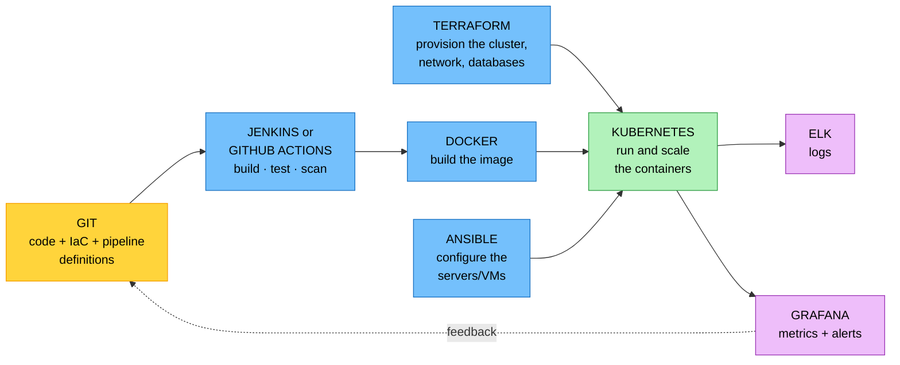

# Objective 5.4 — Explain the importance of tools used in DevOps environments

> **Domain 5.0 — DevOps Fundamentals (10% of exam)** · Exam CV0-004 V4 · Objectives doc v5.0
> **Status:** Exam-ready · **Version:** 2.0 (enhanced) · Supersedes `full notes/Objective-5.4-DevOps-Tools.md`

---

## 0. How to use this note

| Pass | What to read | Time |
|---|---|---|
| **1st (learn)** | Sections 1 → 8 in order | ~50 min |
| **2nd (drill)** | Section 2.1 (the four families) + Section 7 (the five confusable pairs) + Section 8.1 (master table) | ~15 min |
| **3rd (test)** | Section 11 (practice) + Section 12 (PBQ drills) | ~25 min |
| **Exam eve** | Section 13 (60-second recall sheet) only | ~4 min |

> 📌 **The easiest objective in the exam to score full marks on — and the easiest to lose marks on carelessly.** Nine named tools, each with one job. Every question is "what does this tool do?" or "which tool solves this problem?" The only real difficulty is the handful of pairs that sit next to each other (Section 7). Learn those five pairs and this objective is finished.

---

## 1. Official objective coverage

> **5.4 Explain the importance of tools used in DevOps environments.**
> - Ansible
> - Docker
> - Elasticsearch, Logstash, and Kibana (**ELK**) stack
> - Git
> - GitHub actions
> - Grafana
> - Jenkins
> - Kubernetes
> - Terraform

### 1.1 What the verb tells you

**"Explain the importance of"** — you must know **what each tool does, what problem it solves, and where it sits in the pipeline**. You are **not** expected to write playbooks, HCL, or manifests. Recognition and role-matching is the depth required.

> ⚠️ **This is the only objective in CV0-004 that names specific commercial and open-source products.** CompTIA is normally vendor-neutral; here the product names *are* the answer options.

### 1.2 Coverage checklist

- [ ] I can state each of the nine tools' **one-line job**
- [ ] ★ **Terraform vs Ansible** — provision infrastructure vs configure existing servers
- [ ] ★ **Docker vs Kubernetes** — build/run one container vs orchestrate many
- [ ] ★ **Grafana vs Kibana** — metrics dashboards vs log search
- [ ] ★ **Jenkins vs GitHub Actions** — self-hosted and plugin-driven vs managed and repo-native
- [ ] **Git vs GitHub Actions** — version control vs the automation that reacts to it
- [ ] I know each tool's **language/artefact** (playbook, Dockerfile, `.github/workflows/*.yml`, Jenkinsfile, manifest, HCL)
- [ ] I know **Ansible is agentless** and **has no state file**; **Terraform has state**
- [ ] I know the three ELK components' **individual** roles
- [ ] I can name the **managed cloud equivalent** of each tool

---

## 2. The core mental model

### 2.1 ★ The nine tools are four families

```text
╔═══════════════════════════════════════════════════════════════════════╗
║  DON'T MEMORISE NINE THINGS. MEMORISE FOUR FAMILIES.                  ║
╠═══════════════════════════════════════════════════════════════════════╣
║                                                                       ║
║  ① BUILD THE INFRASTRUCTURE      ② PACKAGE AND RUN THE APP            ║
║    ┌───────────────────────┐       ┌───────────────────────┐          ║
║    │ TERRAFORM             │       │ DOCKER                │          ║
║    │  create the resources │       │  package one container│          ║
║    │  (has STATE)          │       │                       │          ║
║    │ ANSIBLE               │       │ KUBERNETES            │          ║
║    │  configure what exists│       │  orchestrate MANY     │          ║
║    │  (AGENTLESS, no state)│       │  across a cluster     │          ║
║    └───────────────────────┘       └───────────────────────┘          ║
║                                                                       ║
║  ③ VERSION AND AUTOMATE          ④ OBSERVE WHAT IS RUNNING           ║
║    ┌───────────────────────┐       ┌───────────────────────┐          ║
║    │ GIT                   │       │ ELK STACK             │          ║
║    │  the source of truth  │       │  LOGS — collect,      │          ║
║    │ JENKINS               │       │  index, search        │          ║
║    │  self-hosted CI/CD    │       │ GRAFANA               │          ║
║    │ GITHUB ACTIONS        │       │  METRICS — dashboards │          ║
║    │  managed, in-repo CI  │       │  and alerts           │          ║
║    └───────────────────────┘       └───────────────────────┘          ║
╚═══════════════════════════════════════════════════════════════════════╝

   ★ If you can place a tool in its family, you can answer the question.
```

### 2.2 Where each tool sits in the delivery pipeline



### 2.3 The one-line job of each tool

| Tool | One line | Family |
|---|---|---|
| **Terraform** | Provisions cloud **infrastructure** declaratively, tracking it in **state** | Build infra |
| **Ansible** | **Agentlessly configures** existing servers to a desired state | Build infra |
| **Docker** | **Packages** an app and its dependencies into a portable **container image** | Package/run |
| **Kubernetes** | **Orchestrates** containers across a cluster — scheduling, scaling, self-healing | Package/run |
| **Git** | **Distributed version control** — the source of truth that triggers everything | Version/automate |
| **Jenkins** | **Self-hosted** CI/CD automation server with a vast **plugin** ecosystem | Version/automate |
| **GitHub Actions** | **Managed** CI/CD defined as YAML **inside the repository** | Version/automate |
| **ELK stack** | Centralised **log** collection, indexing, search, and visualisation | Observe |
| **Grafana** | **Metric** dashboards and alerting across many data sources | Observe |

---

## 3. Family ① — Build the infrastructure

### 3.1 Terraform

| | |
|---|---|
| **What it is** | An **Infrastructure as Code (IaC)** tool from HashiCorp that **provisions** cloud resources. |
| **Language** | **HCL** (HashiCorp Configuration Language) — **declarative**: you describe the desired end state, not the steps |
| **★ Key artefact** | The **state file** — Terraform's record of what it actually created, used to compute changes and detect **drift** (2.4) |
| **Workflow** | `init` (download providers) → **`plan`** (preview the changes) → `apply` (make them) → `destroy` (tear down) |
| **★ `plan` matters** | It shows exactly what will be **created, changed, or destroyed before anything happens** — the safety feature that makes IaC reviewable |
| **Providers** | Plugins that talk to each cloud's API — **AWS, Azure, GCP, and hundreds more**, so one tool and one language spans **multiple clouds** |
| **Why it matters** | Repeatable, version-controlled, reviewable infrastructure · eliminates snowflake environments · enables identical dev/staging/prod |
| **Cloud-native alternatives** | **AWS CloudFormation** · **Azure ARM/Bicep** · **Google Cloud Deployment Manager** — each is **single-cloud**; Terraform is **cloud-agnostic** |
| **Exam triggers** | "provision infrastructure", "HCL", "state file", "preview changes before applying", "multi-cloud IaC", "drift detection" |

### 3.2 Ansible

| | |
|---|---|
| **What it is** | A **configuration-management and automation** tool that brings **existing** servers to a desired state. |
| **★ Agentless** | Connects over **SSH** (Linux) or **WinRM** (Windows) and **pushes** changes — **nothing is installed on the targets**. This is its single most-tested trait |
| **Language** | **YAML** playbooks |
| **Key terms** | **Inventory** = the list of managed hosts · **playbook** = the automation file · **task** = one action · **role** = a reusable bundle · **module** = the unit that does the work |
| **★ Idempotent** | Running the same playbook repeatedly converges to the same state without duplicating work (1.5) |
| **★ No state file** | Unlike Terraform, Ansible keeps **no record** of what it manages — it evaluates the target each run |
| **Why it matters** | Configures servers at scale · enforces hardening baselines · reverses configuration drift · low barrier to adopt (no agent rollout) |
| **Compare with** | **Puppet and Chef** — **agent-based** and typically **pull** model, where the node fetches its configuration. Ansible is **agentless push** |
| **Exam triggers** | "agentless", "SSH, no agent to install", "playbook", "configure existing servers", "enforce a baseline across hundreds of servers" |

---

## 4. Family ② — Package and run the app

### 4.1 Docker

| | |
|---|---|
| **What it is** | The dominant **containerization** platform — packages an application with its dependencies into a **portable image** that runs identically anywhere. |
| **★ Key mechanic** | Containers **share the host OS kernel** — so they start in **seconds** and are far lighter than VMs, which each carry a full guest OS (1.6, 1.7) |
| **Key terms** | **Image** = immutable template built in **layers** · **container** = a running instance of an image · **Dockerfile** = the build recipe · **registry** = where images are stored (Docker Hub, ECR, ACR) · **volume** = persistent storage that outlives the container |
| **Docker Compose** | Defines a **multi-container** application in one YAML file — for local development, **not** production orchestration |
| **Why it matters** | Solves "works on my machine" · makes builds reproducible · the unit that CI produces and Kubernetes runs |
| **Security notes (4.4)** | Don't run as **root** · **scan images** for vulnerabilities · pin to a **digest**, not `:latest` · beware **untrusted public images** |
| **Exam triggers** | "package the app with its dependencies", "portable image", "shares the host kernel", "Dockerfile", "runs identically anywhere" |

### 4.2 Kubernetes

| | |
|---|---|
| **What it is** | A **container orchestration** platform that runs, scales, and heals containerized applications across a **cluster of nodes**. Abbreviated **K8s**. |
| **Key objects** | **Pod** = the **smallest deployable unit** (one or more containers sharing network and storage) · **Deployment** = desired replica count plus **rolling updates** · **Service** = a stable network endpoint and load balancing · **Namespace** = logical isolation for multi-tenancy |
| **Architecture** | **Control plane** (API server, etcd, scheduler, controller manager) decides · **worker nodes** run the pods via the **kubelet** (full detail in 1.6) |
| **★ What it does for you** | **Scheduling** onto nodes · **self-healing** (restarts failed pods, replaces dead nodes) · **scaling** (manual or **HPA**) · **service discovery** · **rolling and canary deployments** (2.2) |
| **★ How it works** | **Declarative reconciliation** — you declare the desired state in YAML manifests and the controllers continuously drive actual state toward it |
| **Managed offerings** | **AWS EKS · Azure AKS · Google GKE** — the provider runs the control plane for you |
| **Exam triggers** | "orchestrate containers at scale", "self-healing", "pod", "desired replicas", "across a cluster of nodes", "automatic scaling of containers" |

---

## 5. Family ③ — Version and automate

### 5.1 Git

| | |
|---|---|
| **What it is** | The **distributed version control system** underpinning modern DevOps — covered in full in **5.1**. |
| **Distributed** | Every developer holds a **complete local copy of the history** — commits and branching work offline, unlike centralised SVN/TFVC |
| **★ Its role in 5.4** | Git is the **source of truth and the trigger**. A push or pull request is what **starts the pipeline**. It also stores the Terraform HCL, Ansible playbooks, Dockerfiles, Kubernetes manifests, and the pipeline definitions themselves — **everything as code** |
| **Not the same as** | **GitHub / GitLab / Bitbucket** are *hosting platforms* built around Git. **Git is the tool; GitHub is a service** |
| **Exam triggers** | "distributed version control", "full local history", "source of truth", "a push triggers the pipeline" |

### 5.2 Jenkins

| | |
|---|---|
| **What it is** | A long-established, **self-hosted** CI/CD automation server. |
| **★ Defining strength** | An **enormous plugin ecosystem** — 1,800+ plugins mean it can integrate with almost anything, including legacy and on-premises systems |
| **Pipeline as code** | A **Jenkinsfile** (Groovy-based) stored in the repository; pipelines can also be built in the UI |
| **Architecture** | A **controller** coordinates; **agents/nodes** execute the jobs |
| **★ The trade-off** | You **run, patch, secure, and scale it yourself** — including keeping the plugins updated, which is a real security burden (4.1) |
| **Best for** | Complex, highly customised, multi-repo, on-premises, or hybrid pipelines where a managed service cannot reach |
| **Exam triggers** | "self-hosted CI/CD server", "plugins", "Jenkinsfile", "on-premises build automation", "maximum flexibility, you maintain it" |

### 5.3 GitHub Actions

| | |
|---|---|
| **What it is** | A **CI/CD automation platform built into GitHub** — workflows live in the repository alongside the code. |
| **Where it lives** | **YAML files in `.github/workflows/`** — so the pipeline is version-controlled and **reviewed in pull requests like any other code** |
| **Structure** | **Workflow** → **jobs** → **steps** → **actions** (reusable units). Jobs execute on **runners** — GitHub-hosted or **self-hosted** |
| **Triggers** | `push` · `pull_request` · `schedule` (cron) · `workflow_dispatch` (manual) · release and issue events |
| **★ The trade-off vs Jenkins** | **Managed** — no server to maintain — but tied to GitHub, and usage is metered |
| **Security note (5.2)** | Marketplace actions are **third-party code running in your pipeline with your secrets** — pin them to a commit SHA, not a moving tag |
| **Exam triggers** | "CI/CD native to the repository", "YAML workflow in `.github/workflows`", "runs on push or pull request", "managed, no server to maintain" |

---

## 6. Family ④ — Observe what is running

### 6.1 ELK stack — Elasticsearch, Logstash, Kibana

**The three components have three distinct jobs, and the exam tests them individually:**

```text
   ┌──────────────┐    ┌────────────────┐    ┌──────────────┐
   │  LOGSTASH    │───►│ ELASTICSEARCH  │───►│    KIBANA    │
   │  (or Beats)  │    │                │    │              │
   │  COLLECT     │    │  STORE, INDEX  │    │  VISUALISE   │
   │  parse,      │    │  and SEARCH    │    │  search UI,  │
   │  transform,  │    │  the log data  │    │  dashboards  │
   │  ship        │    │                │    │              │
   └──────────────┘    └────────────────┘    └──────────────┘
      the INTAKE          the DATABASE          the WINDOW

   ★ L = collect · E = store and search · K = see it
```

| | |
|---|---|
| **What it is** | A centralised **logging and log-analytics** pipeline (now often called the **Elastic Stack**). |
| **Elasticsearch** | A **distributed search and indexing engine** — stores logs and queries them fast |
| **Logstash** | **Collects, parses, transforms, and ships** logs to Elasticsearch. **Beats** are lightweight single-purpose shippers used instead of or alongside it |
| **Kibana** | The **web UI** — search, dashboards, and visualisation of the indexed data |
| **Why it matters** | In the cloud, logs are scattered across many ephemeral instances and services. **Centralised, searchable logs** are essential for troubleshooting (Domain 6), auditing (4.2), and security forensics (4.6) |
| **Alternatives** | **Splunk** · **AWS OpenSearch** (a fork of Elasticsearch) · **Grafana Loki** · CloudWatch Logs |
| **Exam triggers** | "centralised logging", "search across all logs", "index and query log data", "log forensics", the individual component roles |

### 6.2 Grafana

| | |
|---|---|
| **What it is** | An open-source **visualisation, dashboarding, and alerting** platform for **metrics and time-series** data. |
| **★ Defining trait** | **Data-source agnostic** — it *queries* other systems rather than storing data itself. Sources include **Prometheus, CloudWatch, Elasticsearch, InfluxDB, Loki**, and SQL databases |
| **What it provides** | Live dashboards of CPU, latency, error rate, throughput · **threshold-based alerting** · SLO and golden-signal views (3.1) |
| **Common pairing** | **Prometheus + Grafana** — Prometheus **scrapes and stores** the metrics, Grafana **displays and alerts** on them. That division of labour is testable |
| **Exam triggers** | "metric dashboards", "time-series visualisation", "alert when latency exceeds a threshold", "single pane of glass across multiple data sources" |

---

## 7. ★ The five confusable pairs — where the marks are won

### 7.1 Terraform vs Ansible

```text
   TERRAFORM                            ANSIBLE
   ─────────────────────────            ─────────────────────────
   PROVISIONS infrastructure            CONFIGURES existing systems
   "create the VM, VPC, database"       "install nginx on the VM"
   Declarative (HCL)                    YAML playbooks, task-based
   ★ KEEPS A STATE FILE                 ★ NO STATE FILE
   Manages the resource LIFECYCLE       Converges the machine's config
   (create → change → destroy)
   Agentless (calls cloud APIs)         Agentless (SSH / WinRM)

   ★ ONE LINE: Terraform BUILDS THE HOUSE. Ansible FURNISHES IT.
     They are complementary, not competitors — most shops use both.
```

### 7.2 Docker vs Kubernetes

| | **Docker** | **Kubernetes** |
|---|---|---|
| Scope | **One container**, on one host | **Many containers**, across a **cluster** |
| Job | **Build and run** an image | **Schedule, scale, heal** |
| Builds images | ✅ **Yes** | ❌ **No** — it *runs* images others built |
| Self-healing | ❌ | ✅ Restarts failed pods |
| Scaling | Manual | ✅ Automatic (**HPA**) |
| Unit | Container | **Pod** |

> ★ **One line:** Docker **makes and runs** the container; Kubernetes **manages a fleet of them**. They are layers, not rivals.

### 7.3 Grafana vs Kibana

| | **Grafana** | **Kibana** |
|---|---|---|
| Primary data | ★ **Metrics / time-series** | ★ **Logs** |
| Data sources | ★ **Many, agnostic** (Prometheus, CloudWatch, Elasticsearch…) | **Elasticsearch** (its own stack) |
| Strength | **Dashboards and alerting** | **Search and forensics** |
| Part of | Standalone | **The ELK stack** |

> ★ **One line:** "How fast/how many?" → **Grafana**. "What exactly did the log say?" → **Kibana**.

### 7.4 Jenkins vs GitHub Actions

| | **Jenkins** | **GitHub Actions** |
|---|---|---|
| Hosting | ★ **Self-hosted — you maintain it** | ★ **Managed by GitHub** |
| Definition | **Jenkinsfile** (Groovy) | **YAML in `.github/workflows/`** |
| Extensibility | ★ **Huge plugin ecosystem** | Marketplace actions |
| Setup effort | High | Very low |
| Ongoing burden | Patching, plugin CVEs, scaling agents | Minimal |
| Best for | **On-prem, legacy, highly customised, multi-repo** | **GitHub-hosted projects wanting zero ops** |

### 7.5 Git vs GitHub Actions vs GitHub

| Item | What it is |
|---|---|
| **Git** | The **version control tool** itself — runs on your machine |
| **GitHub** | A **hosting platform/service** built around Git (so are GitLab and Bitbucket) |
| **GitHub Actions** | The **CI/CD automation** feature of GitHub that reacts to repository events |

> ⚠️ A classic distractor swaps these. **Git stores the change; Actions reacts to it.**

---

## 8. Comparison tables

### 8.1 ★ Master table — all nine tools

| Tool | Category | Language / artefact | Agent? | State? | Managed cloud equivalent |
|---|---|---|---|---|---|
| **Terraform** | IaC / provisioning | **HCL** (`.tf`) | No | ★ **Yes** | CloudFormation · ARM/Bicep · Deployment Manager |
| **Ansible** | Configuration management | **YAML** playbook | ★ **No — agentless** | ★ **No** | AWS Systems Manager · Azure Automation |
| **Docker** | Containerization | **Dockerfile** | n/a | n/a | ECR/ACR (registry) · ECS · Cloud Run |
| **Kubernetes** | Container orchestration | **YAML** manifests | kubelet on nodes | etcd (cluster) | **EKS · AKS · GKE** |
| **Git** | Version control | Repository / commits | n/a | n/a | CodeCommit · Azure Repos · Cloud Source Repos |
| **Jenkins** | CI/CD server | **Jenkinsfile** (Groovy) | Agents/nodes | n/a | CodePipeline · Azure Pipelines · Cloud Build |
| **GitHub Actions** | CI/CD (managed) | **YAML** in `.github/workflows/` | Runners | n/a | (is itself managed) |
| **ELK stack** | Logging | n/a | Beats/Logstash | Indices | **OpenSearch** · CloudWatch Logs · Azure Monitor Logs |
| **Grafana** | Metrics dashboards | Dashboards/queries | n/a | n/a | Amazon Managed Grafana · CloudWatch dashboards |

### 8.2 Which tool produces or consumes what

| Artefact | Produced by | Consumed by |
|---|---|---|
| Container **image** | **Docker** (built in CI) | **Kubernetes**, ECS |
| **HCL** infrastructure definition | Terraform | The cloud provider's API |
| **Playbook** | Ansible | The target servers |
| **Manifest** (YAML) | Author/CI | Kubernetes API server |
| **Jenkinsfile** / workflow YAML | Author | Jenkins / GitHub Actions |
| **Logs** | The running application | **ELK** |
| **Metrics** | Exporters / Prometheus / CloudWatch | **Grafana** |
| Everything above, versioned | Author | **Git** — the source of truth |

### 8.3 Requirement → tool

| Requirement | Tool |
|---|---|
| Create a VPC, cluster, and database from code, previewing changes first | **Terraform** |
| Enforce an SSH hardening baseline nightly on 300 existing servers | **Ansible** |
| Package an app so it runs identically on a laptop and in production | **Docker** |
| Keep 5 replicas alive, restart failures, scale on CPU load | **Kubernetes** |
| Track every change to the code with full history and branching | **Git** |
| Run tests and deploy automatically on every pull request, with no server to run | **GitHub Actions** |
| Highly customised on-premises build pipeline integrating legacy systems | **Jenkins** |
| Search across all application logs to trace an incident | **ELK (Kibana)** |
| Dashboard p99 latency and alert when it breaches the SLO | **Grafana** |
| Provision infrastructure identically on AWS *and* Azure with one tool | **Terraform** |
| Detect that someone changed infrastructure outside the pipeline | **Terraform (drift via state)** |
| Store the built container image | **A registry — Docker Hub / ECR** |

### 8.4 Adjacent tools that appear as distractors

| Tool | What it actually is | Don't confuse with |
|---|---|---|
| **Puppet / Chef** | Configuration management — **agent-based, pull model** | **Ansible (agentless, push)** |
| **Prometheus** | **Collects and stores** metrics (time-series database) | **Grafana**, which *displays* them |
| **Splunk** | Commercial log analytics platform | **ELK** |
| **Packer** | Builds **machine images** (AMIs, VM images) | **Docker** (container images), **Terraform** (provisioning) |
| **ArgoCD / Flux** | **GitOps** — continuously syncs a cluster to Git | Jenkins/Actions (push-based CI/CD) |
| **CloudFormation** | AWS-native, **single-cloud** IaC | **Terraform** (multi-cloud) |
| **Vagrant** | Local development VM environments | Docker |
| **Nagios / Zabbix** | Traditional infrastructure monitoring | Grafana |
| **Helm** | Kubernetes **package manager** (charts) | Kubernetes itself |

---

## 9. Exam traps & distractor patterns

| # | Trap | The truth |
|---|---|---|
| 1 | "Ansible requires an agent on each node" | ❌ **Ansible is agentless** — SSH/WinRM push. **Puppet and Chef** are the agent-based ones |
| 2 | "Ansible keeps a state file" | ❌ **Terraform** has state. Ansible has **none** |
| 3 | "Terraform configures software on servers" | It **provisions infrastructure**. **Ansible** configures what is on it |
| 4 | "Kubernetes builds container images" | ❌ It **runs** images. **Docker** builds them |
| 5 | "Docker orchestrates containers across a cluster" | Docker runs containers on a host; **Kubernetes** orchestrates across nodes |
| 6 | "A container is the smallest deployable Kubernetes unit" | ❌ The **Pod** is |
| 7 | "Grafana stores the metrics" | ❌ It **queries other sources** (Prometheus, CloudWatch). Prometheus stores |
| 8 | "Kibana is for metrics dashboards" | **Kibana = logs** (within ELK). **Grafana = metrics**, multi-source |
| 9 | "Logstash stores and indexes the logs" | ❌ Logstash **collects and ships**; **Elasticsearch** stores and indexes |
| 10 | "Jenkins is a managed service" | ❌ Jenkins is **self-hosted** — you patch and scale it. **GitHub Actions** is managed |
| 11 | "GitHub Actions workflows are written in a Jenkinsfile" | ❌ **YAML in `.github/workflows/`**. Jenkinsfile is Groovy, for Jenkins |
| 12 | "Terraform uses YAML" | ❌ **HCL**. YAML belongs to Ansible, Kubernetes, and Actions |
| 13 | "Git and GitHub are the same thing" | Git is the **tool**; GitHub is a **hosting service** built around it |
| 14 | "Docker containers each run a full guest OS" | ❌ They **share the host kernel** — that is why they are light and fast (1.7) |
| 15 | "`terraform apply` shows you the changes before making them" | **`terraform plan`** previews; **`apply`** executes |
| 16 | "Terraform only works with AWS" | It is **multi-cloud** via providers. **CloudFormation** is the AWS-only one |
| 17 | "Docker Compose is a production orchestrator" | It defines **multi-container apps locally**. Production orchestration is **Kubernetes** |

**Disambiguation drill:**

| Pair | The deciding question |
|---|---|
| **Terraform vs Ansible** | Is the thing being **created** (Terraform) or **configured** (Ansible)? |
| **Docker vs Kubernetes** | **One** container, or **many across machines**? |
| **Grafana vs Kibana** | **Numbers over time** (Grafana), or **log text** (Kibana)? |
| **Jenkins vs Actions** | Who **maintains the server** — you, or the provider? |
| **Prometheus vs Grafana** | **Stores** the metrics, or **shows** them? |
| **Elasticsearch vs Logstash** | **Stores and searches**, or **collects and ships**? |
| **Git vs GitHub Actions** | **Records** the change, or **reacts** to it? |
| **Ansible vs Puppet/Chef** | **Agentless push**, or **agent-based pull**? |

---

## 10. Keyword → answer trigger table

| If you see… | Think |
|---|---|
| agentless · SSH, no agent installed · playbook · inventory · configure existing servers · enforce a baseline | **Ansible** |
| HCL · state file · `plan` before `apply` · provision infrastructure · multi-cloud IaC · drift detection | **Terraform** |
| Dockerfile · image · shares the host kernel · portable, runs anywhere · registry · "works on my machine" | **Docker** |
| pod · replicas · self-healing · orchestrate at scale · HPA · cluster of nodes · EKS/AKS/GKE | **Kubernetes** |
| distributed version control · full local history · branch and merge · source of truth · push triggers the pipeline | **Git** |
| Jenkinsfile · Groovy · self-hosted · plugins · controller and agents · on-premises CI | **Jenkins** |
| `.github/workflows` · runs on push/PR · runners · managed CI in the repo | **GitHub Actions** |
| centralised logging · index and search logs · Elasticsearch/Logstash/Kibana · log forensics | **ELK stack** |
| metric dashboards · time-series · alert on threshold · multiple data sources · pairs with Prometheus | **Grafana** |
| agent-based, pull model configuration management | **Puppet / Chef** (not Ansible) |
| scrapes and stores metrics | **Prometheus** (not Grafana) |
| builds machine images / AMIs | **Packer** (not Docker) |
| AWS-only infrastructure as code | **CloudFormation** (not Terraform) |
| Kubernetes package manager, charts | **Helm** |

---

## 11. Practice questions

<details>
<summary><b>Q1.</b> Which characteristic distinguishes Ansible from Puppet and Chef?</summary>

A. It uses HCL · **B. It is agentless, connecting over SSH or WinRM with nothing installed on the targets** · C. It maintains a state file · D. It orchestrates containers

**Correct: B.** Agentless push is Ansible's defining trait; Puppet and Chef install an agent that pulls its configuration.
- **A wrong:** HCL is Terraform's language; Ansible uses YAML.
- **C wrong:** Terraform has state; Ansible does not.
- **D wrong:** That is Kubernetes.
</details>

<details>
<summary><b>Q2.</b> A team needs to create a VPC, an EKS cluster, and an RDS database from version-controlled code, and to preview exactly what will change before applying. Which tool?</summary>

**A. Terraform** · B. Ansible · C. Docker · D. Grafana

**Correct: A.** Terraform provisions infrastructure declaratively, and `terraform plan` previews creations, changes, and destructions before `apply`.
- **B wrong:** Ansible configures existing systems rather than provisioning cloud resources with lifecycle state.
- **C wrong:** Docker packages applications.
- **D wrong:** Grafana visualises metrics.
</details>

<details>
<summary><b>Q3.</b> What is the smallest deployable unit in Kubernetes?</summary>

A. Container · **B. Pod** · C. Node · D. Deployment

**Correct: B.** A pod holds one or more containers that share network and storage, and it is what Kubernetes schedules.
- **A wrong:** Containers run *inside* pods.
- **C wrong:** A node is a worker machine.
- **D wrong:** A Deployment manages a set of pods; it is not the smallest unit.
</details>

<details>
<summary><b>Q4.</b> In the ELK stack, which component stores and indexes the log data for fast searching?</summary>

A. Logstash · **B. Elasticsearch** · C. Kibana · D. Beats

**Correct: B.** Elasticsearch is the distributed search and indexing engine at the centre of the stack.
- **A/D wrong:** Logstash and Beats **collect, parse, and ship** logs.
- **C wrong:** Kibana is the visualisation and search **UI**.
</details>

<details>
<summary><b>Q5.</b> Which pairing correctly reflects the division of labour between Prometheus and Grafana?</summary>

**A. Prometheus scrapes and stores metrics; Grafana queries and visualises them** · B. Grafana stores metrics; Prometheus displays them · C. Both store metrics independently · D. Prometheus is a logging tool

**Correct: A.** Grafana is deliberately **data-source agnostic** — it holds no data of its own.
- **B wrong:** Reversed.
- **C wrong:** Grafana does not store time-series data.
- **D wrong:** Prometheus is a metrics system; logging is ELK's domain.
</details>

<details>
<summary><b>Q6.</b> A company runs a highly customised build pipeline on-premises that integrates several legacy systems, and requires deep plugin-level control. Which CI/CD tool is MOST appropriate?</summary>

A. GitHub Actions · **B. Jenkins** · C. Terraform · D. Kubernetes

**Correct: B.** Jenkins is self-hosted with an enormous plugin ecosystem, making it the usual answer for on-premises and heavily customised pipelines.
- **A wrong:** Actions is managed and GitHub-centric — a poorer fit for legacy on-prem integration.
- **C/D wrong:** Neither is a CI/CD server.
</details>

<details>
<summary><b>Q7.</b> Where are GitHub Actions workflows defined?</summary>

A. In a Jenkinsfile · **B. As YAML files in `.github/workflows/` in the repository** · C. In HCL · D. In the Kubernetes control plane

**Correct: B.** Keeping the workflow in the repo means the pipeline is versioned and reviewed like any other code.
- **A wrong:** Jenkinsfile belongs to Jenkins and is Groovy-based.
- **C wrong:** HCL is Terraform.
- **D wrong:** Unrelated.
</details>

<details>
<summary><b>Q8.</b> Why do Docker containers start in seconds while virtual machines take minutes?</summary>

**A. Containers share the host operating system kernel, whereas each VM boots its own full guest OS** · B. Containers use faster disks · C. Containers have no dependencies · D. Containers run only on bare metal

**Correct: A.** Sharing the kernel removes the guest-OS boot and the per-VM memory overhead (1.6, 1.7).
- **B wrong:** Storage is not the differentiator.
- **C wrong:** Dependencies are bundled into the image.
- **D wrong:** Containers run on VMs routinely.
</details>

<details>
<summary><b>Q9.</b> Which statement about Terraform state is CORRECT?</summary>

**A. It records the infrastructure Terraform has created, enabling change planning and drift detection** · B. It stores application logs · C. It is Ansible's inventory file · D. Terraform does not track state

**Correct: A.** State is how Terraform knows what already exists, and therefore how it computes a plan and spots drift.
- **B wrong:** Logs go to ELK/CloudWatch.
- **C wrong:** Inventory is Ansible's host list.
- **D wrong:** State is central to Terraform.
</details>

<details>
<summary><b>Q10.</b> Which tool would you use to enforce a consistent SSH and package baseline nightly across 300 existing Linux servers?</summary>

A. Terraform · **B. Ansible** · C. Kubernetes · D. Kibana

**Correct: B.** Configuration management of **existing** systems, applied idempotently, is exactly Ansible's role — and it reverses drift.
- **A wrong:** Terraform provisions resources; it does not manage in-OS configuration.
- **C wrong:** Kubernetes orchestrates containers.
- **D wrong:** Kibana visualises logs.
</details>

<details>
<summary><b>Q11.</b> What does Kubernetes do that Docker alone does not?</summary>

A. Build images from a Dockerfile · **B. Schedule, scale, and self-heal containers across a cluster of nodes** · C. Store container images · D. Version-control the source

**Correct: B.** Orchestration across many machines — plus self-healing and autoscaling — is the layer Kubernetes adds.
- **A wrong:** Building images is Docker's job, not Kubernetes'.
- **C wrong:** That is a registry.
- **D wrong:** That is Git.
</details>

<details>
<summary><b>Q12.</b> An operations team must trace exactly what an application logged during an incident last night, across dozens of ephemeral instances. Which tool fits BEST?</summary>

A. Grafana · **B. The ELK stack** · C. Terraform · D. Ansible

**Correct: B.** Centralised log collection, indexing, and search is what ELK exists for — essential when instances are ephemeral.
- **A wrong:** Grafana is metric-focused; it shows that errors rose, not the log text.
- **C/D wrong:** Neither handles logs.
</details>

<details>
<summary><b>Q13.</b> Which language does Terraform use to define infrastructure?</summary>

A. YAML · **B. HCL (HashiCorp Configuration Language)** · C. Groovy · D. XML

**Correct: B.** HCL is declarative — you describe the desired end state.
- **A wrong:** YAML is Ansible, Kubernetes manifests, and Actions workflows.
- **C wrong:** Groovy is the Jenkinsfile language.
- **D wrong:** Not used.
</details>

<details>
<summary><b>Q14.</b> Which correctly describes the relationship between Git and GitHub?</summary>

**A. Git is the distributed version control tool; GitHub is a hosting platform and service built around it** · B. They are the same product · C. GitHub is the tool and Git is the website · D. Git is a CI/CD server

**Correct: A.** GitLab and Bitbucket are alternative platforms around the same underlying Git tool.
- **B/C wrong:** Reversed or conflated.
- **D wrong:** CI/CD servers are Jenkins and GitHub Actions.
</details>

<details>
<summary><b>Q15.</b> Which Terraform command previews the changes without making them?</summary>

A. `terraform apply` · **B. `terraform plan`** · C. `terraform init` · D. `terraform destroy`

**Correct: B.** `plan` shows exactly what will be created, changed, or destroyed — the reviewable safety step.
- **A wrong:** `apply` executes the changes.
- **C wrong:** `init` initialises providers and the backend.
- **D wrong:** `destroy` tears infrastructure down.
</details>

<details>
<summary><b>Q16.</b> A dashboard must display latency from Prometheus, cost data from CloudWatch, and error counts from Elasticsearch in one place. Which tool?</summary>

**A. Grafana** · B. Kibana · C. Logstash · D. Jenkins

**Correct: A.** Grafana's data-source-agnostic design lets one dashboard span multiple back ends — the "single pane of glass."
- **B wrong:** Kibana is tied to Elasticsearch and log-focused.
- **C wrong:** Logstash ingests; it does not visualise.
- **D wrong:** Jenkins is CI/CD.
</details>

<details>
<summary><b>Q17.</b> Which pair of tools is COMPLEMENTARY rather than competing?</summary>

**A. Terraform and Ansible — one provisions the infrastructure, the other configures it** · B. Jenkins and GitHub Actions · C. ELK and Splunk · D. Puppet and Chef

**Correct: A.** Terraform builds the resources and Ansible configures what runs on them; most organisations use both together.
- **B/C/D wrong:** Each pair consists of direct alternatives for the same job.
</details>

<details>
<summary><b>Q18.</b> What is the role of Logstash in the ELK stack?</summary>

A. Visualising dashboards · **B. Collecting, parsing, transforming, and shipping logs to Elasticsearch** · C. Indexing and searching the data · D. Orchestrating containers

**Correct: B.** Logstash (and the lighter Beats) is the ingestion pipeline.
- **A wrong:** That is Kibana.
- **C wrong:** That is Elasticsearch.
- **D wrong:** That is Kubernetes.
</details>

<details>
<summary><b>Q19.</b> A startup wants CI/CD with no server to patch, scale, or secure, and wants the pipeline reviewed in pull requests. Which is MOST appropriate?</summary>

A. Jenkins · **B. GitHub Actions** · C. Ansible · D. Grafana

**Correct: B.** Actions is fully managed and its YAML workflow lives in the repository, so it is reviewed like any other code change.
- **A wrong:** Jenkins requires you to host, patch, and scale it.
- **C/D wrong:** Neither is a CI/CD platform.
</details>

<details>
<summary><b>Q20.</b> Which tool provides self-healing by automatically restarting failed application instances?</summary>

A. Docker · **B. Kubernetes** · C. Terraform · D. Git

**Correct: B.** Kubernetes controllers continuously reconcile actual state to the declared desired state, replacing failed pods.
- **A wrong:** Docker can restart a container by policy but does not reschedule across a cluster.
- **C wrong:** Terraform provisions; it does not monitor running workloads.
- **D wrong:** Git is version control.
</details>

<details>
<summary><b>Q21.</b> Which statement about Ansible playbooks is CORRECT?</summary>

**A. They are YAML files that are idempotent — re-running converges to the same state without duplicating changes** · B. They are Groovy scripts · C. They require an agent on each node · D. They store infrastructure state

**Correct: A.** Idempotency is what makes it safe to run a playbook on a schedule to reverse drift.
- **B wrong:** Groovy is the Jenkinsfile language.
- **C wrong:** Ansible is agentless.
- **D wrong:** Ansible keeps no state file.
</details>

<details>
<summary><b>Q22.</b> An organisation must provision equivalent infrastructure on both AWS and Azure using a single tool and language. Which is MOST appropriate?</summary>

**A. Terraform** · B. AWS CloudFormation · C. Azure Bicep · D. Docker Compose

**Correct: A.** Terraform's provider model makes it cloud-agnostic, which is its main advantage over native IaC.
- **B wrong:** CloudFormation is AWS-only.
- **C wrong:** Bicep is Azure-only.
- **D wrong:** Compose defines local multi-container apps.
</details>

<details>
<summary><b>Q23.</b> Which tool builds the container image that Kubernetes later runs?</summary>

A. Kubernetes itself · **B. Docker** · C. Helm · D. Grafana

**Correct: B.** Docker builds images from a Dockerfile; Kubernetes only schedules and runs images pulled from a registry.
- **A wrong:** Kubernetes does not build images.
- **C wrong:** Helm packages Kubernetes manifests as charts.
- **D wrong:** Grafana visualises metrics.
</details>

<details>
<summary><b>Q24.</b> Which tool set makes the DevOps principle of "everything as code" possible by storing IaC, playbooks, manifests, and pipeline definitions together with the application?</summary>

**A. Git** · B. Grafana · C. Elasticsearch · D. Docker Hub

**Correct: A.** Git is the source of truth: it versions the code *and* all the automation, and a push is what triggers the pipeline.
- **B/C wrong:** Both are observability tools.
- **D wrong:** Docker Hub stores images, not source.
</details>

<details>
<summary><b>Q25.</b> Which describes the KEY operational trade-off of choosing Jenkins over a managed CI/CD service?</summary>

**A. Maximum flexibility through plugins, at the cost of hosting, patching, securing, and scaling the server yourself** · B. It is cheaper in every case · C. It cannot define pipelines as code · D. It works only with GitHub

**Correct: A.** The plugin ecosystem is the strength; the self-hosting burden — including plugin vulnerabilities — is the cost.
- **B wrong:** Self-hosting carries real operational cost.
- **C wrong:** The Jenkinsfile is pipeline as code.
- **D wrong:** Jenkins is repository-agnostic.
</details>

---

## 12. PBQ-style drills

### Drill A — Match the tool to its category

| # | Tool | Category? |
|---|---|---|
| 1 | Terraform | |
| 2 | Ansible | |
| 3 | Docker | |
| 4 | Kubernetes | |
| 5 | Git | |
| 6 | Jenkins | |
| 7 | GitHub Actions | |
| 8 | ELK stack | |
| 9 | Grafana | |

<details><summary>Answers</summary>

1 → **IaC / infrastructure provisioning** · 2 → **Configuration management** · 3 → **Containerization** · 4 → **Container orchestration** · 5 → **Version control** · 6 → **CI/CD (self-hosted)** · 7 → **CI/CD (managed)** · 8 → **Logging/log analytics** · 9 → **Metrics dashboards and alerting**
</details>

### Drill B — Match the artefact to its tool

| # | Artefact | Tool? |
|---|---|---|
| 1 | Dockerfile | |
| 2 | Playbook (YAML) | |
| 3 | Jenkinsfile (Groovy) | |
| 4 | `.tf` file in HCL | |
| 5 | `.github/workflows/ci.yml` | |
| 6 | Pod / Deployment manifest | |
| 7 | Inventory | |
| 8 | State file | |

<details><summary>Answers</summary>

1 → **Docker** · 2 → **Ansible** · 3 → **Jenkins** · 4 → **Terraform** · 5 → **GitHub Actions** · 6 → **Kubernetes** · 7 → **Ansible** · 8 → **Terraform**
</details>

### Drill C — Pick the tool for the requirement

| # | Requirement | Tool? |
|---|---|---|
| 1 | Preview infrastructure changes before they are made | |
| 2 | Configure 300 existing servers with no agent installed | |
| 3 | Keep 5 replicas running and restart any that fail | |
| 4 | Search all application logs to investigate an incident | |
| 5 | Alert when p99 latency crosses 500 ms | |
| 6 | Package the app so it runs identically everywhere | |
| 7 | Run tests automatically on every pull request, with no server to maintain | |
| 8 | Deep customisation of an on-premises pipeline with legacy integrations | |

<details><summary>Answers</summary>

1 → **Terraform (`plan`)** · 2 → **Ansible** · 3 → **Kubernetes** · 4 → **ELK (Kibana)** · 5 → **Grafana** · 6 → **Docker** · 7 → **GitHub Actions** · 8 → **Jenkins**
</details>

### Drill D — True or false

| # | Statement | T/F? |
|---|---|---|
| 1 | Ansible requires an agent on each managed node | |
| 2 | Terraform maintains a state file; Ansible does not | |
| 3 | Kubernetes builds container images | |
| 4 | Grafana stores the metrics it displays | |
| 5 | Kibana is part of the ELK stack and is log-focused | |
| 6 | Jenkins is a managed service requiring no maintenance | |
| 7 | Docker containers share the host OS kernel | |
| 8 | Terraform works with multiple cloud providers | |

<details><summary>Answers</summary>

1 → **False** (agentless) · 2 → **True** · 3 → **False** (Docker does) · 4 → **False** (it queries other sources) · 5 → **True** · 6 → **False** (self-hosted) · 7 → **True** · 8 → **True**
</details>

---

## 13. 60-second recall sheet

```text
╔══════════════════════════════════════════════════════════════════════╗
║  5.4 — DEVOPS TOOLS — nine tools, FOUR FAMILIES                      ║
╠══════════════════════════════════════════════════════════════════════╣
║ ① BUILD THE INFRASTRUCTURE                                           ║
║   TERRAFORM  IaC · HCL · DECLARATIVE · ★ HAS A STATE FILE ·          ║
║     plan (PREVIEW) → apply · drift detection · ★ MULTI-CLOUD         ║
║     (CloudFormation/ARM-Bicep = single-cloud equivalents)            ║
║   ANSIBLE    config mgmt · YAML PLAYBOOKS · inventory ·              ║
║     ★ AGENTLESS (SSH/WinRM, PUSH) · ★ NO STATE FILE · IDEMPOTENT     ║
║     (Puppet/Chef = AGENT-BASED, PULL — the classic distractor)       ║
║   ★ Terraform BUILDS THE HOUSE · Ansible FURNISHES IT                ║
╠══════════════════════════════════════════════════════════════════════╣
║ ② PACKAGE AND RUN                                                    ║
║   DOCKER     Dockerfile → IMAGE → container · registry · volume      ║
║     ★ SHARES THE HOST KERNEL → starts in seconds (VMs boot a full OS)║
║     Compose = multi-container LOCAL dev, NOT production              ║
║   KUBERNETES orchestrates MANY containers ACROSS NODES               ║
║     ★ POD = SMALLEST DEPLOYABLE UNIT · Deployment · Service ·        ║
║     Namespace · SELF-HEALING · HPA autoscaling · rolling updates     ║
║     declarative reconciliation · EKS / AKS / GKE                     ║
║   ★ Docker BUILDS AND RUNS ONE · K8s MANAGES THE FLEET               ║
║     ⚠ KUBERNETES DOES NOT BUILD IMAGES                               ║
╠══════════════════════════════════════════════════════════════════════╣
║ ③ VERSION AND AUTOMATE                                               ║
║   GIT        distributed VCS · FULL LOCAL HISTORY · source of truth  ║
║     a PUSH TRIGGERS THE PIPELINE · stores HCL, playbooks, manifests, ║
║     pipeline defs = "EVERYTHING AS CODE"                             ║
║     ⚠ Git = the TOOL · GitHub = a HOSTING SERVICE                    ║
║   JENKINS    ★ SELF-HOSTED · JENKINSFILE (Groovy) · HUGE PLUGINS ·   ║
║     controller + agents · YOU patch/scale/secure it                  ║
║     → on-prem, legacy, heavily customised                            ║
║   GITHUB ACTIONS ★ MANAGED · ★ YAML in .github/workflows/ ·          ║
║     workflow→jobs→steps→actions · RUNNERS · push/PR/schedule/manual  ║
║     → zero ops, pipeline reviewed in the PR                          ║
╠══════════════════════════════════════════════════════════════════════╣
║ ④ OBSERVE                                                            ║
║   ELK = ★ LOGS.  L collects/parses/ships (or BEATS) →                ║
║          E STORES, INDEXES, SEARCHES → K VISUALISES (the UI)         ║
║          (Splunk, OpenSearch = alternatives)                         ║
║   GRAFANA = ★ METRICS · TIME-SERIES DASHBOARDS + ALERTS ·            ║
║          ★ DATA-SOURCE AGNOSTIC — STORES NOTHING ITSELF              ║
║          ★ PROMETHEUS SCRAPES/STORES · GRAFANA DISPLAYS              ║
║   ★ "How fast / how many?" → GRAFANA                                 ║
║     "What did the log actually say?" → KIBANA                        ║
╠══════════════════════════════════════════════════════════════════════╣
║ LANGUAGE CHEAT: HCL→Terraform · Groovy→Jenkinsfile ·                 ║
║   YAML→Ansible, Kubernetes, GitHub Actions · Dockerfile→Docker       ║
╚══════════════════════════════════════════════════════════════════════╝
```

---

## 14. Cross-references

| Related objective | Connection |
|---|---|
| **1.6 Containerization** | Full depth on Docker, images, and Kubernetes architecture — pods, control plane, kubelet |
| **1.7 Virtualization** | Why containers sharing the kernel beat VMs on startup time and density |
| **2.2 Deployment strategies** | Kubernetes implements the rolling, blue-green, and canary strategies |
| **2.4 Code, deploy & configure** | **IaC vs CaC** — the concept behind Terraform vs Ansible; YAML gotchas; **drift** |
| **2.5 Provision cloud resources** | Terraform is how provisioning gets automated |
| **3.1 Observability** | The three pillars — ELK covers **logs**, Grafana covers **metrics** |
| **3.2 Scaling approaches** | Kubernetes HPA as autoscaling in practice |
| **4.1 Vulnerability management** | Scanning container images; patching Jenkins plugins |
| **4.4 Security best practices** | Secrets in pipelines; not running containers as root |
| **5.1 Source control** | Git in full — branching, merging, pull requests |
| **5.2 CI/CD** | Jenkins and GitHub Actions are the pipelines described there; artefact and supply-chain risks |
| **6.1 Troubleshoot deployment** | ELK and Grafana are the tools you reach for when a deployment misbehaves |

> 🔑 **Carry this forward:** if you can place a tool in one of the four families and recall the five confusable pairs — **Terraform/Ansible, Docker/Kubernetes, Grafana/Kibana, Jenkins/Actions, Git/GitHub** — every question in this objective becomes a one-step lookup.

---

*Source of truth: CompTIA Cloud+ CV0-004 V4 Exam Objectives, document version 5.0. CompTIA names these nine products explicitly; Prometheus, Puppet, Chef, Packer, Helm, Splunk, and the cloud-native equivalents are included because they appear as answer options.*
