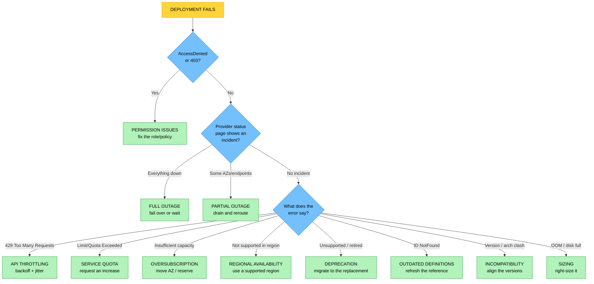

# Objective 6.1 — Given a scenario, troubleshoot deployment issues

> **Domain 6.0 — Troubleshooting (12% of exam)** · Exam CV0-004 V4 · Objectives doc v5.0
> **Status:** Exam-ready · **Version:** 2.0 (enhanced) · Supersedes `full notes/Objective-6.1-Troubleshoot-Deployment.md`

---

## 0. How to use this note

| Pass | What to read | Time |
|---|---|---|
| **1st (learn)** | Sections 1 → 9 in order | ~55 min |
| **2nd (drill)** | ★ Section 10 (the two confusion clusters) + Section 11 (symptom → cause master table) | ~20 min |
| **3rd (test)** | Section 14 (practice) + Section 15 (PBQ drills) | ~30 min |
| **Exam eve** | Section 16 (60-second recall sheet) only | ~5 min |

> 📌 **This is a "Given a scenario" objective — the hardest verb.** You will not be asked "what is a service quota." You will be given a **symptom** and asked for the **cause** or the **fix**. Nine causes can produce superficially similar symptoms, so almost every mark in this objective is won or lost on **Section 10 — telling the lookalike causes apart**.

---

## 1. Official objective coverage

> **6.1 Given a scenario, troubleshoot deployment issues.**
> - Incompatibility
> - **Misconfigurations**
>   - Resource allocation
>   - Permission issues
>   - Oversubscription
>   - Sizing issues
> - Outdated component definitions
> - Deprecation of functionality
> - **Outages**
>   - Full
>   - Partial
> - **Resource limits**
>   - API throttling
>   - Service quotas
> - Regional service availability

### 1.1 What the verb tells you

**"Given a scenario"** — the highest-depth verb. You must **apply** knowledge: read a symptom, identify the root cause, and choose the correct remediation. Expect **performance-based questions** here, since Domain 6 is the natural home for them.

> ⚠️ **Note on methodology:** CV0-003 had a dedicated "use the troubleshooting methodology" objective. **CV0-004 does not** — Domain 6 is only 6.1, 6.2, and 6.3. The scaffold in Section 2.3 is included because it helps you reason through scenarios, **not** because it is a listed objective.

### 1.2 Coverage checklist

- [ ] I can name all **nine** causes and their sub-types
- [ ] ★ I can separate the **"not enough" trio** — sizing vs service quota vs oversubscription
- [ ] ★ I can separate the **"not available" trio** — deprecation vs regional availability vs outage
- [ ] ★ I know **throttling is a RATE limit; a quota is a QUANTITY limit**
- [ ] I know `AccessDenied` / `403` is **always** permissions
- [ ] I know **full vs partial** outage and that the remediation differs
- [ ] I know **incompatibility** (a live clash) vs **outdated definitions** (a dead pointer)
- [ ] I can match a **remediation** to each cause, not just name the cause
- [ ] I know **who owns the fix** — me, my account limits, or the provider

---

## 2. The core mental model

### 2.1 ★ Three questions resolve almost every scenario

```text
╔═══════════════════════════════════════════════════════════════════════╗
║  Q1: IS IT A PERMISSION PROBLEM?                                      ║
║      "AccessDenied" / "403 Forbidden" / "not authorized"              ║
║      → PERMISSION ISSUES. Stop. It is never anything else.            ║
╠═══════════════════════════════════════════════════════════════════════╣
║  Q2: IS THE THING MISSING, OR IS THERE NOT ENOUGH OF IT?              ║
║                                                                       ║
║   ┌─── "NOT AVAILABLE" ───────────┐  ┌─── "NOT ENOUGH" ────────────┐  ║
║   │ Gone EVERYWHERE, forever      │  │ What I got is TOO SMALL     │  ║
║   │   → DEPRECATION               │  │   → SIZING                  │  ║
║   │ Never offered HERE            │  │ My ACCOUNT can't have more  │  ║
║   │   → REGIONAL AVAILABILITY     │  │   → SERVICE QUOTA           │  ║
║   │ Exists here, DOWN RIGHT NOW   │  │ The PROVIDER has none left  │  ║
║   │   → OUTAGE (full or partial)  │  │   → OVERSUBSCRIPTION        │  ║
║   └───────────────────────────────┘  └─────────────────────────────┘  ║
╠═══════════════════════════════════════════════════════════════════════╣
║  Q3: IS IT A MISMATCH OR A BAD SETTING?                               ║
║      Pieces clash at runtime (version, arch, API) → INCOMPATIBILITY   ║
║      Template points at something gone   → OUTDATED COMPONENT DEFS    ║
║      Too many calls per second (429)     → API THROTTLING             ║
║      Wrong value / wrong resource chosen → MISCONFIGURATION           ║
╚═══════════════════════════════════════════════════════════════════════╝
```

### 2.2 The triage flow



### 2.3 A reasoning scaffold (useful, but *not* a CV0-004 objective)

1. **Identify the symptom precisely** — the exact error string is usually the whole answer
2. **Establish the blast radius** — one resource, one AZ, one region, or everything? This separates outage types from configuration faults
3. **Ask what changed** — a deployment that worked last week and fails now points to deprecation, an outdated reference, or a new quota ceiling
4. **Check whether it is yours to fix** — provider incidents and capacity exhaustion are not fixed by editing your template
5. **Apply the narrowest fix** — see the trap in Section 12 about over-reacting to partial outages
6. **Verify, then prevent** — pin versions, add drift detection, spread across AZs, add retries

---

## 3. Incompatibility

| | |
|---|---|
| **Definition** | Two components that each work in isolation **cannot work together** — a version, dependency, architecture, or API mismatch. |
| **★ The tell** | Nothing is missing and nothing is denied — the pieces **clash at runtime or build time** |
| **Common forms** | **Runtime version** (code needs 3.12, image provides 3.9) · **CPU architecture** (an x86/amd64 image on arm64 nodes) · **library/ABI** (a missing or wrong `GLIBC`) · **API version** (a Kubernetes manifest using an API version the upgraded cluster removed) · **SDK vs service** · OS or driver mismatch |
| **Typical errors** | `exec format error` · `ImportError` / `ModuleNotFoundError` · `GLIBC_2.34 not found` · `no matches for kind ... in version ...` |
| **Fix** | Rebuild against the matching base image · build **multi-architecture** images · pin compatible versions · update the manifest to a supported API version |
| **Prevent** | Pin dependency versions (5.2) · test on an environment identical to production · use the same base image in CI as in production |
| **Exam triggers** | "works on the developer's laptop but not on the cluster", "after upgrading the cluster", "built on x86, runs on ARM", "version mismatch" |

> ⚠️ **Do not confuse with outdated component definitions (Section 5).** Incompatibility = both things exist but **don't fit**. Outdated definitions = the thing being referenced **no longer exists**.

---

## 4. Misconfigurations

The **largest bucket** — a value that was chosen, typed, or omitted incorrectly. CompTIA lists four sub-types.

### 4.1 Resource allocation

| | |
|---|---|
| **Definition** | The **wrong kind or distribution** of resource was assigned — wrong instance family, wrong storage class, missing container requests/limits, wrong node selector. |
| **★ Distinguish from sizing** | **Allocation = the wrong *type* or *placement***. **Sizing = the right type but the wrong *magnitude*.** |
| **Examples** | A CPU-optimised family chosen for a memory-bound workload · a container with **no resource requests set**, so the scheduler packs it onto a starved node · burstable instances chosen for sustained load, exhausting CPU credits · HDD-backed storage assigned to an IOPS-heavy database (1.4) |
| **Typical symptoms** | Poor performance despite "enough" resources on paper · unpredictable throttling · pods scheduled onto the wrong nodes |
| **Fix** | Match the family and class to the workload profile · set **requests and limits** explicitly · use the right storage tier |
| **Exam triggers** | "wrong instance family", "no resource limits defined", "burstable instance ran out of credits", "CPU-optimised for a memory-heavy job" |

### 4.2 Permission issues

| | |
|---|---|
| **Definition** | The **identity performing the deployment** lacks the rights for the action — a user, role, service account, or pipeline identity. |
| **★ The tell** | ★ **`AccessDenied` or `403 Forbidden` is ALWAYS a permission issue.** No capacity, quota, region, or outage produces it |
| **Common forms** | The CI/CD pipeline's role lacks a needed action · a missing **trust relationship** so a role cannot be assumed · an SCP or organisation policy denying it at a higher level · a resource-based policy (bucket/registry) blocking the principal · expired or rotated credentials |
| **The classic scenario** | ★ **"It works from my laptop but fails in the pipeline."** The developer has broad personal credentials; the pipeline identity has least-privilege ones. The **pipeline role** is the answer |
| **Fix** | Grant the specific missing action to the deploying principal, following **least privilege** (4.3) — do not attach admin |
| **Exam triggers** | "AccessDenied", "403", "not authorized to perform", "works locally, fails in CI", "after credentials were rotated" |

### 4.3 Oversubscription

| | |
|---|---|
| **Definition** | **More resource has been promised than physically exists.** Two senses appear on the exam. |
| **★ Sense A — the provider has no capacity** | You request an instance type and the platform has **none free in that availability zone right now**. Error: `InsufficientInstanceCapacity`. It is **AZ-specific** — the same request often succeeds in another AZ **Fix:** try another AZ or instance type · spread via autoscaling across AZs · buy a **capacity reservation** for critical steady-state workloads |
| **★ Sense B — your own hosts are over-committed** | A hypervisor or cluster has been deliberately over-allocated (1.7), and contention now bites. Symptoms: **high CPU ready time / CPU steal**, memory ballooning or swapping, slow I/O — all while the VM's own sizing looks correct. **Fix:** reduce the over-commit ratio · migrate VMs to a less loaded host · add hosts |
| **★ Critical distinction** | ★ **Raising a quota does NOT fix oversubscription.** The limit is physical capacity, not your account's allowance |
| **Exam triggers** | "insufficient capacity in this availability zone", "launches fine in another AZ", "high CPU steal / CPU ready time despite correct sizing", "noisy neighbour", "host is over-committed" |

### 4.4 Sizing issues

| | |
|---|---|
| **Definition** | The resource is the **right type but too small** for the workload. |
| **★ The tell** | The workload **starts** and then dies or degrades **under load** — it is not blocked from provisioning |
| **Typical symptoms** | ★ **Out of memory / OOMKilled** · `no space left on device` · CPU pegged at 100% with growing queues · database connection limits exhausted · a container repeatedly restarting (`CrashLoopBackOff`) after hitting its memory limit |
| **Fix** | Right-size to a larger instance or volume · raise the container memory limit · enable autoscaling (3.2) · expand the disk |
| **Prevent** | Load-test before release · monitor utilisation against limits (3.1) · right-size continuously (1.8) |
| **★ Distinguish** | Sizing is **your own choice, freely fixable**. A **quota** blocks you from getting more. **Oversubscription** means the provider has none to give |
| **Exam triggers** | "out of memory", "disk full", "crashes under load", "instance too small", "worked in test with less traffic" |

---

## 5. Outdated component definitions

| | |
|---|---|
| **Definition** | The deployment definition — IaC template, image reference, module, manifest — **points at something that no longer exists**. |
| **★ The tell** | ★ A **dead pointer**. The definition is syntactically fine; the **target is gone** |
| **Common forms** | A hardcoded machine-image ID that has been deregistered · a referenced subnet, security group, or key pair that was deleted · a pinned module or base-image tag that was removed from the registry · a stale container image digest · a template referencing a parameter that was retired |
| **Typical errors** | `InvalidAMIID.NotFound` · `ImagePullBackOff` / `manifest unknown` · "resource ... does not exist" · "parameter not recognised" |
| **Fix** | Refresh the reference to a current ID or tag · re-pull the module · **parameterise** rather than hardcode — look the ID up dynamically instead of embedding it |
| **Prevent** | ★ **Drift detection** (2.4) · avoid hardcoded IDs · scheduled rebuilds so stale references surface before a real deployment |
| **Exam triggers** | "template references an image that no longer exists", "worked last quarter, the subnet was deleted since", "hardcoded ID", "ImagePullBackOff" |

---

## 6. Deprecation of functionality

| | |
|---|---|
| **Definition** | The **provider has retired** a feature, API version, instance type, or service — **everywhere, permanently**. |
| **★ The tell** | ★ **It used to work, and it is now gone for everyone, in every region.** This is the vendor's decision, not your configuration |
| **Common forms** | An older instance generation retired · an API version switched off after its sunset date · a TLS/cipher version disabled (see 6.3) · an authentication method withdrawn · a managed-service engine version reaching end of support (3.4) |
| **Typical errors** | "unsupported instance type" · "this API version is no longer available" · "unknown parameter" on a call that worked previously |
| **Fix** | ★ **Migrate to the documented replacement** — there is no way to keep using the old one |
| **Prevent** | Track **provider deprecation notices and sunset dates** · treat **EOL/EOS** dates as planned work (3.4) · avoid pinning to versions nearing sunset |
| **★ Distinguish** | **Deprecation** = existed, now gone **everywhere**. **Regional availability** = exists, but was **never offered here**. **Outage** = exists here, **temporarily down** |
| **Exam triggers** | "no longer supported", "retired by the provider", "the API was sunset", "worked last month, now rejected everywhere", "end of support" |

---

## 7. Outages

**Definition:** the service is unavailable because of a **provider-side failure**, not your configuration. The exam splits this by **blast radius**, and the correct remediation differs.

### 7.1 Full vs partial

| | **Full outage** | **Partial outage** |
|---|---|---|
| **Blast radius** | ★ An **entire service or region** | ★ **Some** AZs, endpoints, or features |
| **Symptom** | Everything fails **uniformly** | Works in one AZ, fails in another — or one feature is degraded while the rest is fine |
| **Your options** | ★ **Fail over to another region**, or wait for recovery | ★ **Drain the affected AZ and reroute** to healthy ones |
| **Design that survives it** | **Multi-region** architecture (1.2) | **Multi-AZ** architecture — often absorbs it automatically |
| **Exam tell** | "all users, all AZs, provider status page confirms" | "only zone B is affected; A and C are healthy" |

| | |
|---|---|
| **How to confirm** | ★ **Check the provider's status/health dashboard.** If an incident is posted, stop debugging your own configuration |
| **Typical errors** | `503 Service Unavailable` · timeouts · widespread `5xx` responses (recall from 5.3 that **5xx = server-side**) |
| **Prevent / mitigate** | Multi-AZ and multi-region design · health checks that route around failures · retries with backoff · graceful degradation and circuit breakers (1.5) · a tested DR plan matched to your RTO/RPO (3.3) |
| **★ The trap** | ★ **Do not trigger a full region failover for a single-AZ problem.** A regional failover is disruptive and slow; rerouting within the region is the proportionate response |

---

## 8. Resource limits

**Two different ceilings that are constantly confused.** One limits **how fast**, the other limits **how many**.

### 8.1 API throttling

| | |
|---|---|
| **Definition** | You are calling an API **faster than the allowed rate**, so requests are rejected. |
| **★ The tell** | ★ **`429 Too Many Requests`** — the exam's clearest single signal. The service is **healthy**; you are simply too chatty |
| **Why it appears** | Aggressive polling loops · a large parallel CI/CD fan-out · many instances calling the same API on the same schedule · a retry storm making the problem worse |
| **★ Fix** | ★ **Exponential backoff with jitter** · honour the `Retry-After` header · **batch** calls · cache results · stagger scheduled jobs · reduce polling frequency |
| **Why jitter matters** | Without random jitter, every client retries at the same instant and the **thundering herd** re-triggers the throttle |
| **★ What does NOT fix it** | ★ Requesting a **quota increase** — that raises *how many resources* you may have, not *how fast you may call* |
| **Exam triggers** | "429", "rate limit exceeded", "started after we added parallel jobs", "slow only at peak", "polling loop" |

### 8.2 Service quotas

| | |
|---|---|
| **Definition** | An **account-level cap on the total quantity** of a resource you may have — vCPUs per family, IP addresses, VPCs, function concurrency, storage buckets. |
| **★ The tell** | ★ **`LimitExceeded` / `QuotaExceeded`** — and crucially, ★ **the same failure occurs in every AZ**, because the limit belongs to your account, not to any location |
| **Fix** | ★ **Request a quota increase** · or **free unused resources** (delete zombie instances, release unattached IPs — see 4.6) · or distribute across accounts |
| **Prevent** | ★ **Monitor quota utilisation and alert before the ceiling**, especially ahead of scaling events · request increases **in advance** of a planned launch |
| **★ Distinguish** | A quota failure follows you **everywhere**; **oversubscription** is local to an AZ. If moving AZ fixes it, it was capacity — if it fails identically everywhere, it is a quota |
| **Exam triggers** | "quota exceeded", "vCPU limit", "limit exceeded", "fails identically in every availability zone", "autoscaling stopped adding instances at exactly 20" |

---

## 9. Regional service availability

| | |
|---|---|
| **Definition** | The service, instance type, or feature is **not offered in the region you chose** — and never has been. |
| **★ The tell** | ★ It works perfectly in another region, and there is **no incident and no capacity problem** — the catalogue simply does not include it there |
| **Why it happens** | Providers roll new services out **region by region**; specialised hardware (GPU/ML accelerators) is offered in a subset of regions; some regions are constrained by local law or infrastructure |
| **Typical errors** | "not supported in this region" · `UnsupportedOperation` · the service is absent from the region's console entirely |
| **Fix** | Deploy to a **supported region** · choose an alternative instance type or service that *is* available locally · redesign to place only that component in a supported region |
| **★ The tension with compliance** | ★ **Data sovereignty** (4.2) may *require* a specific region that does not offer the service. Then the answer is an architectural change, not "move the region" |
| **Prevent** | ★ **Check the regional service catalogue during design**, before committing to a region |
| **★ Distinguish** | **Never here** = regional availability. **Was everywhere, now gone** = deprecation. **Here but down** = outage. **Here and up but full** = oversubscription |
| **Exam triggers** | "not available in this region", "works in us-east-1 but not ap-southeast-1", "GPU instances cannot be launched here", "the service does not appear in the console for that region" |

---

## 10. ★ The two confusion clusters — where the marks are won

### 10.1 The "NOT ENOUGH" trio

```text
   THE WORKLOAD CANNOT GET THE RESOURCES IT NEEDS. WHICH ONE?

   ┌──────────────────────────────────────────────────────────────────┐
   │ SIZING            "I chose something too small."                 │
   │   Symptom  OOM · disk full · CPU pegged · CrashLoopBackOff       │
   │   Scope    This one workload                                     │
   │   Fix      ★ RIGHT-SIZE IT — entirely within your control        │
   ├──────────────────────────────────────────────────────────────────┤
   │ SERVICE QUOTA     "My ACCOUNT is not allowed any more."          │
   │   Symptom  LimitExceeded / QuotaExceeded                         │
   │   Scope    ★ IDENTICAL IN EVERY AZ AND EVERY ATTEMPT             │
   │   Fix      ★ REQUEST AN INCREASE, or free unused resources       │
   ├──────────────────────────────────────────────────────────────────┤
   │ OVERSUBSCRIPTION  "The PROVIDER has none left right now."        │
   │   Symptom  InsufficientInstanceCapacity · CPU steal / ready time │
   │   Scope    ★ ONE AZ OR ONE HOST — another AZ works               │
   │   Fix      ★ MOVE AZ / change type / reserve capacity            │
   │            ⚠ A QUOTA INCREASE DOES NOTHING HERE                  │
   └──────────────────────────────────────────────────────────────────┘

   ★ THE DECIDING TEST:
     Does it fail the SAME in every AZ?      → SERVICE QUOTA
     Does another AZ work?                    → OVERSUBSCRIPTION
     Did it launch fine and then die on load? → SIZING
```

### 10.2 The "NOT AVAILABLE" trio

```text
   THE THING I NEED ISN'T THERE. WHICH ONE?

                     WAS IT EVER AVAILABLE HERE?
                     ┌────────────┴────────────┐
                    NO                        YES
                     │                         │
            ┌────────▼────────┐        IS IT AVAILABLE NOW?
            │    REGIONAL     │        ┌────────┴────────┐
            │  AVAILABILITY   │       NO                YES
            │ "never offered  │        │                 │
            │  in this region"│  ┌─────▼──────┐   ┌──────▼──────┐
            │ FIX: use a      │  │ Gone for   │   │ It's there  │
            │ supported region│  │ EVERYONE,  │   │ — a         │
            └─────────────────┘  │ PERMANENTLY│   │ different   │
                                 │ →DEPRECATION│  │ cause       │
                                 │ FIX: migrate│  └─────────────┘
                                 │ Temporarily │
                                 │ DOWN        │
                                 │ → OUTAGE    │
                                 │ FIX: failover│
                                 │  or wait    │
                                 └─────────────┘

   ★ PERMANENT + EVERYWHERE = DEPRECATION
     PERMANENT + HERE ONLY   = REGIONAL AVAILABILITY
     TEMPORARY               = OUTAGE
```

### 10.3 Rate vs quantity

| | **API throttling** | **Service quota** |
|---|---|---|
| Limits | ★ **How FAST** (requests per second) | ★ **How MANY** (total resources) |
| Signal | ★ **`429 Too Many Requests`** | ★ **`LimitExceeded` / `QuotaExceeded`** |
| Is the service healthy? | ✅ Yes — you are just too chatty | ✅ Yes — you have reached your allowance |
| Onset | Under **burst or parallel load**; disappears when traffic drops | At an **exact count**, and stays |
| Fix | ★ **Backoff + jitter, batch, cache, stagger** | ★ **Request an increase** or free resources |
| Does a quota increase help? | ❌ **No** | ✅ Yes |
| Does slowing down help? | ✅ Yes | ❌ **No** |

### 10.4 Incompatibility vs outdated component definitions

| | **Incompatibility** | **Outdated component definitions** |
|---|---|---|
| Nature | ★ Both things exist but **don't fit** | ★ The referenced thing **no longer exists** |
| Analogy | A plug that doesn't match the socket | An address for a building that was demolished |
| Example | An x86 image on ARM nodes; a manifest using a removed API version | A hardcoded image ID that was deregistered; a deleted subnet |
| Error style | `exec format error`, `GLIBC not found`, "no matches for kind" | `...NotFound`, `ImagePullBackOff`, "does not exist" |
| Fix | **Align the versions** — rebuild, re-pin, update the manifest | **Refresh the reference** — and parameterise it |

### 10.5 Permission vs everything else

> ★ **The single most reliable rule in this objective:** `AccessDenied` and `403` mean **permissions**. Not capacity. Not quota. Not region. Not an outage. If the scenario shows an authorization error, the answer is the identity's rights — and the fix is granting the **specific missing action**, never attaching an administrator policy.

---

## 11. ★ Symptom → cause → fix master table

| Symptom / error | Root cause | Fix |
|---|---|---|
| `AccessDenied`, `403 Forbidden`, "not authorized" | **Permission issues** | Grant the missing action to the deploying principal |
| Works locally, fails in the CI/CD pipeline | **Permission issues** (pipeline role) | Fix the pipeline's role, not the developer's |
| `InsufficientInstanceCapacity` in one AZ | **Oversubscription** | Try another AZ or type; reserve capacity |
| Another AZ launches the same request fine | **Oversubscription** | Spread across AZs |
| `LimitExceeded` / `QuotaExceeded` / "vCPU limit" | **Service quota** | Request an increase; free unused resources |
| Fails identically in **every** AZ at an exact count | **Service quota** | Request an increase |
| `429 Too Many Requests` / "rate limit exceeded" | **API throttling** | Exponential backoff with jitter; batch; stagger |
| Failures appear only during parallel CI runs or peak | **API throttling** | Reduce call rate; stagger jobs |
| High **CPU steal / ready time**, correct sizing | **Oversubscription** (host over-commit) | Reduce over-commit; migrate to a less loaded host |
| **OOMKilled**, `no space left on device`, `CrashLoopBackOff` under load | **Sizing issues** | Right-size the instance, volume, or memory limit |
| Wrong instance family for the workload profile; no requests/limits set | **Resource allocation** | Match family and class to the workload; set limits |
| Burstable instance exhausted its CPU credits | **Resource allocation** | Move to a sustained-performance family |
| `exec format error`; x86 image on ARM nodes | **Incompatibility** (architecture) | Build multi-architecture images |
| `GLIBC not found`; `ImportError` after a base-image change | **Incompatibility** | Rebuild against the matching base |
| "no matches for kind" after a cluster upgrade | **Incompatibility** (API version) | Update the manifest to a supported version |
| `InvalidAMIID.NotFound`; a deleted subnet or key pair | **Outdated component definitions** | Refresh the reference; parameterise it |
| `ImagePullBackOff` / "manifest unknown" | **Outdated component definitions** | Point at an image that still exists |
| "unsupported instance type"; an API version switched off | **Deprecation of functionality** | Migrate to the documented replacement |
| "unknown parameter" on a call that worked last month | **Deprecation** | Update to the current API |
| Everything fails uniformly; the status page confirms an incident | **Full outage** | Fail over to another region, or wait |
| Only zone B fails; A and C are healthy | **Partial outage** | Drain zone B and reroute |
| Widespread `503` during a posted provider incident | **Outage** | Check the status page first |
| "not supported in this region"; works in another region | **Regional service availability** | Deploy to a supported region |
| GPU instances cannot be launched, no incident, no quota issue | **Regional service availability** | Use a region that offers them |

### 11.1 Who owns the fix

| Cause | Owner |
|---|---|
| Incompatibility · resource allocation · sizing · outdated definitions · API throttling | ★ **You** — change your code, template, or call pattern |
| Permission issues | **You** — but via the identity's policy |
| Service quotas | ★ **You ask, the provider approves** |
| Oversubscription (provider capacity) · outages · deprecation · regional availability | ★ **The provider** — you can only work around it |

---

## 12. Exam traps & distractor patterns

| # | Trap | The truth |
|---|---|---|
| 1 | "Raise the quota to fix `InsufficientInstanceCapacity`" | ❌ That is **oversubscription** — physical capacity. **Move AZ** or reserve. A quota increase changes nothing |
| 2 | "Raise the quota to fix a `429`" | ❌ `429` is **throttling** — a **rate** limit. Add **backoff and jitter** |
| 3 | "Slow down your calls to fix a quota error" | ❌ Quotas are about **quantity**. Slowing down does not help |
| 4 | "`AccessDenied` might be a capacity problem" | ❌ ★ `AccessDenied`/`403` is **always permissions** |
| 5 | "Fix the developer's credentials when the pipeline fails" | The **pipeline's role** is what lacks the permission — the developer's laptop working is the *clue*, not the fix |
| 6 | "Attach an administrator policy to fix the permission error" | ❌ Violates **least privilege** (4.3). Grant the **specific action** |
| 7 | "Fail over the whole region because one AZ is degraded" | ❌ That is a **partial** outage — **reroute within the region**. Regional failover is disproportionate |
| 8 | "Deprecation and regional availability are the same" | **Deprecation** = gone **everywhere, permanently**. **Regional** = **never offered here** |
| 9 | "An outage means the service was deprecated" | Outages are **temporary**; deprecation is **permanent** |
| 10 | "Sizing and oversubscription are the same" | **Sizing** = you picked something too small (you can fix it). **Oversubscription** = the provider has none free |
| 11 | "Sizing and quota are the same" | **Sizing** = too small. **Quota** = you may not have *more* |
| 12 | "Incompatibility and outdated definitions are the same" | **Incompatibility** = things exist but clash. **Outdated** = the target is **gone** |
| 13 | "Debug the template when the provider status page shows an incident" | ★ **Check the status page first.** If there is an incident, it is not your configuration |
| 14 | "Retry immediately after a 429" | ❌ Retrying immediately worsens it — a **retry storm**. Back off **with jitter** |
| 15 | "Move to another region to satisfy the missing service" — always | Often right, but **data sovereignty** (4.2) may forbid it. Then re-architect instead |
| 16 | "Hardcode the working image ID to fix `NotFound`" | That recreates the same fault later. **Parameterise** and look it up dynamically |
| 17 | "A partial outage needs no action because it is not total" | It still degrades users — **drain and reroute** the affected zone |

**Disambiguation drill:**

| Pair | The deciding question |
|---|---|
| **Oversubscription vs quota** | Does **another AZ work**? Yes → capacity. Fails everywhere identically → quota |
| **Throttling vs quota** | **How fast** (429) or **how many** (LimitExceeded)? |
| **Sizing vs quota** | Did it **launch and then die**, or was it **refused**? |
| **Deprecation vs regional** | Did it **used to work here**? Yes → deprecation. Never → regional |
| **Deprecation vs outage** | **Permanent** or **temporary**? |
| **Full vs partial outage** | Is **anything** still healthy? |
| **Incompatibility vs outdated defs** | Does the target **exist but clash**, or **not exist**? |
| **Allocation vs sizing** | **Wrong type**, or **right type too small**? |
| **Permissions vs anything** | Does the error say **denied/403**? Then stop — it's permissions |

---

## 13. Keyword → answer trigger table

| If you see… | Think |
|---|---|
| `AccessDenied` · `403` · "not authorized" · works locally but not in CI | **Permission issues** |
| `InsufficientInstanceCapacity` · "another AZ worked" · CPU steal · noisy neighbour | **Oversubscription** |
| `LimitExceeded` · `QuotaExceeded` · "vCPU limit" · fails the same in every AZ | **Service quotas** |
| `429` · "rate limit exceeded" · only under parallel load · polling loop | **API throttling** |
| OOM · OOMKilled · disk full · `CrashLoopBackOff` · crashes under load | **Sizing issues** |
| wrong instance family · no requests/limits · burst credits exhausted · wrong storage tier | **Resource allocation** |
| `exec format error` · ARM vs x86 · `GLIBC` · "no matches for kind" after upgrade | **Incompatibility** |
| `...NotFound` · `ImagePullBackOff` · deleted subnet · hardcoded ID | **Outdated component definitions** |
| "no longer supported" · "retired" · API sunset · unknown parameter that used to work | **Deprecation of functionality** |
| provider status page incident · everything down uniformly | **Full outage** |
| one AZ failing, others healthy · one endpoint degraded | **Partial outage** |
| "not supported in this region" · works in another region · GPUs unavailable here | **Regional service availability** |

---

## 14. Practice questions

<details>
<summary><b>Q1.</b> A pipeline that deploys successfully from a developer's workstation fails in CI with `AccessDenied` on the same command. What is the MOST likely cause?</summary>

A. Service quota exhausted · **B. The pipeline's service identity lacks the required permission** · C. Regional service availability · D. API throttling

**Correct: B.** `AccessDenied` is always authorization. The developer's broad personal credentials succeed where the pipeline's least-privilege role does not — the working laptop is the *clue*, and the fix is granting the specific missing action to the **pipeline role**.
- **A wrong:** A quota produces `LimitExceeded`, not an authorization error.
- **C wrong:** Regional unavailability reports an unsupported operation.
- **D wrong:** Throttling returns `429`.
</details>

<details>
<summary><b>Q2.</b> An instance launch fails with `InsufficientInstanceCapacity` in one availability zone. The account's quota utilisation is well below its limit. What is the cause, and the correct fix?</summary>

**A. Oversubscription — retry in a different AZ or instance type, or reserve capacity** · B. Service quota — request an increase · C. Regional availability — change region · D. Throttling — add backoff

**Correct: A.** The provider has no free physical capacity of that type in that zone at that moment. ★ **A quota increase does nothing here** — the constraint is capacity, not allowance.
- **B wrong:** The quota is explicitly not exhausted, and a quota failure would occur in every AZ.
- **C wrong:** The type *is* offered in the region; it is simply full in that zone.
- **D wrong:** Throttling produces `429`.
</details>

<details>
<summary><b>Q3.</b> An autoscaling group stops adding instances at exactly 20, failing identically in every availability zone with `LimitExceeded`. What is the cause?</summary>

A. Oversubscription · **B. Service quota** · C. Partial outage · D. Sizing issue

**Correct: B.** ★ The two tells are the **exact ceiling** and that it fails **identically everywhere** — quotas are account-scoped, so no AZ escapes them. Request an increase or release unused resources.
- **A wrong:** Capacity exhaustion is AZ-specific; another zone would work.
- **C wrong:** An outage would not stop at a precise number.
- **D wrong:** Sizing affects a running workload, not the ability to launch more.
</details>

<details>
<summary><b>Q4.</b> After a team increased CI parallelism, deployments intermittently fail with HTTP 429. What is the correct remediation?</summary>

A. Request a vCPU quota increase · **B. Implement exponential backoff with jitter and stagger the jobs** · C. Move to another region · D. Increase the instance size

**Correct: B.** `429` is **API throttling** — a rate limit. Backoff spreads the calls out, and **jitter** prevents every client retrying in the same instant.
- **A wrong:** ★ A quota governs *how many resources*, not *how fast you may call*.
- **C wrong:** Rate limits apply per region anyway; this does not address the cause.
- **D wrong:** Instance size is unrelated to API call rate.
</details>

<details>
<summary><b>Q5.</b> A container deploys successfully but is repeatedly killed with an out-of-memory error once traffic arrives. What is the cause?</summary>

A. Permission issue · B. Service quota · **C. Sizing issue** · D. Deprecation

**Correct: C.** It **launched successfully** and then died **under load** — the classic sizing signature. Raise the memory limit or move to a larger instance.
- **A wrong:** It deployed, so authorization succeeded.
- **B wrong:** A quota would have blocked provisioning entirely.
- **D wrong:** Deprecation removes functionality; it does not cause OOM.
</details>

<details>
<summary><b>Q6.</b> A container image built in CI fails on the cluster's nodes with `exec format error`. What is the cause?</summary>

**A. Incompatibility — the image architecture does not match the nodes** · B. Outdated component definition · C. Oversubscription · D. Regional availability

**Correct: A.** `exec format error` is the signature of an **architecture mismatch** — typically an x86/amd64 image on arm64 nodes. Build a multi-architecture image.
- **B wrong:** The image exists and was pulled; nothing is a dead reference.
- **C/D wrong:** Neither produces a binary-format error.
</details>

<details>
<summary><b>Q7.</b> An IaC deployment that has not changed in six months now fails because it references a machine image ID that no longer exists. What is the cause?</summary>

A. Incompatibility · **B. Outdated component definitions** · C. Deprecation of functionality · D. Misconfiguration of permissions

**Correct: B.** A **dead pointer** — the definition is valid but its target is gone. The durable fix is to **parameterise** the lookup rather than hardcode an ID.
- **A wrong:** Incompatibility means things exist but clash; here the target does not exist.
- **C wrong:** Deprecation is the provider retiring a *capability*, not one specific image being deregistered.
- **D wrong:** No authorization error is present.
</details>

<details>
<summary><b>Q8.</b> A provider announces that an API version will be switched off, and after the sunset date all calls using it are rejected everywhere. What is this an example of?</summary>

A. Regional service availability · **B. Deprecation of functionality** · C. Full outage · D. Incompatibility

**Correct: B.** ★ **Permanent and everywhere** — the definition of deprecation. The only remedy is migrating to the replacement.
- **A wrong:** Regional unavailability means it was **never** offered there; this worked previously everywhere.
- **C wrong:** Outages are temporary and unplanned.
- **D wrong:** Nothing is clashing; the capability is gone.
</details>

<details>
<summary><b>Q9.</b> Users in one availability zone receive errors while the other two zones serve traffic normally. The provider's status page confirms a zonal issue. What is the BEST response?</summary>

A. Fail over the entire workload to another region · **B. Drain the affected zone and route traffic to the healthy ones** · C. Request a quota increase · D. Rebuild the container images

**Correct: B.** This is a **partial outage**, and the proportionate response is rerouting within the region — which a multi-AZ design largely does automatically.
- **A wrong:** ★ Regional failover is disruptive and slow; reserve it for a **full** outage.
- **C/D wrong:** Neither addresses a provider-side zonal failure.
</details>

<details>
<summary><b>Q10.</b> A deployment fails in `ap-southeast-1` with an unsupported-operation error but succeeds in `us-east-1`. There is no active incident and quota use is low. What is the cause?</summary>

A. Deprecation · **B. Regional service availability** · C. Oversubscription · D. Permission issue

**Correct: B.** The service or instance type is simply **not offered** in that region. Deploy to a supported region, or choose an alternative that is available locally.
- **A wrong:** Deprecation would break it in **every** region, including `us-east-1`.
- **C wrong:** Capacity exhaustion reports insufficient capacity and is zone-specific.
- **D wrong:** Permissions produce `AccessDenied`.
</details>

<details>
<summary><b>Q11.</b> A VM shows sustained high CPU **steal time** and sluggish I/O, yet its own CPU and memory allocation match the workload's requirements. What is the MOST likely cause?</summary>

A. Sizing issue · **B. Oversubscription of the underlying host** · C. API throttling · D. Service quota

**Correct: B.** High **steal / CPU ready time** means the guest is waiting for a physical CPU that other guests are using — the host is **over-committed** (1.7). Reduce the over-commit ratio or migrate the VM.
- **A wrong:** The sizing is explicitly stated to be correct.
- **C wrong:** Throttling is an API-level `429`, not runtime CPU contention.
- **D wrong:** Quotas block provisioning, not runtime performance.
</details>

<details>
<summary><b>Q12.</b> After a cluster upgrade, deploying an existing manifest fails with "no matches for kind" on a resource type. What is the cause?</summary>

**A. Incompatibility — the manifest uses an API version the upgraded cluster no longer serves** · B. Permission issue · C. Sizing issue · D. Partial outage

**Correct: A.** The upgrade removed a deprecated API version, so the manifest and the cluster no longer fit. Update the manifest to a supported API version.
- **B wrong:** No authorization error appears.
- **C wrong:** Nothing has run out of resources.
- **D wrong:** The failure is deterministic, not a provider incident.
</details>

<details>
<summary><b>Q13.</b> Which pair of symptoms BEST distinguishes a service quota problem from a capacity problem?</summary>

**A. A quota fails identically in every AZ at a fixed ceiling; capacity exhaustion is zone-specific and another AZ succeeds** · B. A quota returns 429; capacity returns 403 · C. Quotas affect only storage; capacity affects only compute · D. They are the same

**Correct: A.** ★ **"Does another AZ work?"** is the single fastest discriminator in this objective.
- **B wrong:** `429` is throttling, and `403` is permissions — neither is involved.
- **C wrong:** Both apply across resource types.
- **D wrong:** The remediations differ entirely.
</details>

<details>
<summary><b>Q14.</b> A deployment of a memory-intensive database is placed on a CPU-optimised instance family, and performance is poor despite adequate total resources on paper. Which sub-type of misconfiguration is this?</summary>

**A. Resource allocation** · B. Sizing issue · C. Oversubscription · D. Permission issue

**Correct: A.** The **wrong type** of resource was assigned. Sizing would be the *right* family at too small a scale; this is the wrong family altogether.
- **B wrong:** The problem is the profile, not the magnitude.
- **C wrong:** No over-commitment or capacity exhaustion is described.
- **D wrong:** No authorization failure.
</details>

<details>
<summary><b>Q15.</b> An application receives widespread `503` responses across all zones, and the provider's health dashboard shows an active service-wide incident. What should the team do FIRST?</summary>

A. Roll back the last deployment · B. Request a quota increase · **C. Recognise it as a provider outage and execute the documented failover or wait for recovery** · D. Rebuild the container image

**Correct: C.** ★ **Check the status page before debugging your own configuration.** A confirmed provider incident is not fixed by changing your template, and time spent rolling back is wasted.
- **A wrong:** The deployment is not the cause; rolling back may make things worse.
- **B/D wrong:** Neither addresses a provider-side failure.
</details>

<details>
<summary><b>Q16.</b> A pod fails with `ImagePullBackOff` after the registry tag it referenced was deleted. What is the cause?</summary>

A. Incompatibility · **B. Outdated component definitions** · C. Service quota · D. Throttling

**Correct: B.** The manifest points at an image that **no longer exists** — a stale reference. Point it at a current image, and prefer immutable digests that are not deleted out from under you.
- **A wrong:** The image never loaded, so nothing clashed at runtime.
- **C/D wrong:** Neither produces a pull failure.
</details>

<details>
<summary><b>Q17.</b> Which remediation is CORRECT for API throttling?</summary>

A. Retry immediately in a tight loop · **B. Retry with exponential backoff and random jitter, honouring `Retry-After`** · C. Request a service quota increase · D. Launch instances in another AZ

**Correct: B.** Backoff reduces the call rate, and **jitter** prevents all clients retrying in the same instant — a retry storm otherwise re-triggers the throttle.
- **A wrong:** Immediate retries worsen throttling.
- **C wrong:** Quotas govern quantity, not rate.
- **D wrong:** Irrelevant to an API rate limit.
</details>

<details>
<summary><b>Q18.</b> A workload must run in a specific region for data-sovereignty reasons, but the required managed service is not offered there. What is the BEST course of action?</summary>

A. Deploy in a region that offers it and ignore the requirement · **B. Re-architect using an available alternative, or self-manage the capability within the compliant region** · C. Request a quota increase · D. Wait for the outage to clear

**Correct: B.** ★ Regional unavailability is normally solved by moving region — but **data sovereignty (4.2) removes that option**, so the architecture must change instead.
- **A wrong:** Knowingly breaching a sovereignty requirement is a compliance violation.
- **C wrong:** No quota is involved.
- **D wrong:** This is not an outage; the service was never offered there.
</details>

<details>
<summary><b>Q19.</b> Which statement about full versus partial outages is CORRECT?</summary>

**A. A full outage affects an entire service or region and may justify regional failover; a partial outage affects a subset and should be handled by rerouting to healthy zones** · B. Both require immediate regional failover · C. A partial outage requires no action · D. A full outage is fixed by raising quotas

**Correct: A.** The **blast radius determines the proportionate response** — and over-reacting to a partial outage with a regional failover is itself a tested trap.
- **B wrong:** Regional failover is disruptive and unwarranted for a zonal issue.
- **C wrong:** Users are still affected; drain and reroute.
- **D wrong:** Quotas are unrelated to provider outages.
</details>

<details>
<summary><b>Q20.</b> A deployment that has worked for a year begins failing with "unknown parameter" on a call the team has not modified. What is the MOST likely cause?</summary>

A. Sizing issue · **B. Deprecation of functionality** · C. Oversubscription · D. Permission issue

**Correct: B.** ★ "**Worked before, nothing changed on our side, now rejected**" points to the provider retiring the API version or parameter. Migrate to the current API.
- **A wrong:** Sizing causes resource exhaustion, not schema rejection.
- **C wrong:** Capacity issues do not reject parameters.
- **D wrong:** Permissions produce `AccessDenied`.
</details>

<details>
<summary><b>Q21.</b> Which fix is appropriate for a permission-related deployment failure?</summary>

A. Attach a full administrator policy to the pipeline role · **B. Grant the specific missing action to the deploying principal, following least privilege** · C. Rotate to the developer's personal credentials · D. Move the deployment to another region

**Correct: B.** The correct remediation is **narrow** — grant exactly the action that was denied (4.3).
- **A wrong:** Administrator access violates least privilege and creates a serious security exposure.
- **C wrong:** Using personal credentials in a pipeline is a bad practice and defeats accountability.
- **D wrong:** Region has nothing to do with authorization.
</details>

<details>
<summary><b>Q22.</b> Containers are scheduled onto already-loaded nodes and perform erratically because no CPU or memory requests were defined. Which cause is this?</summary>

**A. Resource allocation misconfiguration** · B. Service quota · C. Deprecation · D. Full outage

**Correct: A.** Without declared requests the scheduler cannot reserve capacity, so placement decisions are wrong — a misconfiguration of **how resources are allocated**, not of how much exists.
- **B wrong:** No account limit was reached.
- **C/D wrong:** Neither is involved.
</details>

<details>
<summary><b>Q23.</b> Which single question MOST quickly separates oversubscription from a service quota?</summary>

A. "Does the error include a status code?" · **B. "Does the same request succeed in a different availability zone?"** · C. "Is the workload containerised?" · D. "Was the deployment automated?"

**Correct: B.** ★ Capacity exhaustion is **local to a zone**; a quota is **account-wide** and follows you everywhere. One retry elsewhere answers it.
- **A wrong:** Both may surface similar-looking API errors.
- **C/D wrong:** Neither is relevant to the distinction.
</details>

<details>
<summary><b>Q24.</b> A team's scheduled job polls a provider API every 200 ms from every instance in a large fleet, and deployments begin failing during peak hours. Which TWO changes address the root cause? (Choose the BEST single answer.)</summary>

A. Increase the instance size and add a region · **B. Reduce the polling frequency and add exponential backoff with jitter** · C. Raise the vCPU quota and move AZ · D. Rebuild the images and rotate credentials

**Correct: B.** This is **API throttling** caused by an aggressive polling pattern amplified across a fleet — reduce the call rate and stagger retries. Caching or event-driven notification (5.3) would remove the polling entirely.
- **A/C/D wrong:** None reduces the API call rate, which is the actual constraint.
</details>

<details>
<summary><b>Q25.</b> Which sequence reflects the CORRECT initial triage of a failed deployment?</summary>

**A. Read the exact error, establish the blast radius, check the provider status page, then investigate your own configuration** · B. Immediately roll back to the previous version · C. Request quota increases for all services · D. Rebuild all container images

**Correct: A.** ★ The error string usually names the cause, the blast radius separates outages from configuration faults, and the status page prevents you from debugging a problem that is not yours.
- **B wrong:** Rolling back before understanding the cause can mask it or worsen an unrelated provider incident.
- **C/D wrong:** Both are blind, expensive guesses.
</details>

---

## 15. PBQ-style drills

### Drill A — Error string → cause

| # | Error / symptom | Cause? |
|---|---|---|
| 1 | `AccessDenied` | |
| 2 | `InsufficientInstanceCapacity` in one AZ | |
| 3 | `LimitExceeded`, identical in every AZ | |
| 4 | `429 Too Many Requests` | |
| 5 | `exec format error` | |
| 6 | `InvalidAMIID.NotFound` | |
| 7 | "not supported in this region" | |
| 8 | `OOMKilled` under load | |
| 9 | "this API version was sunset" | |
| 10 | `503` across all zones, incident posted | |

<details><summary>Answers</summary>

1 → **Permission issues** · 2 → **Oversubscription** · 3 → **Service quota** · 4 → **API throttling** · 5 → **Incompatibility (architecture)** · 6 → **Outdated component definitions** · 7 → **Regional service availability** · 8 → **Sizing issue** · 9 → **Deprecation** · 10 → **Full outage**
</details>

### Drill B — Cause → correct fix

| # | Cause | Fix? |
|---|---|---|
| 1 | API throttling | |
| 2 | Service quota | |
| 3 | Oversubscription (provider capacity) | |
| 4 | Sizing issue | |
| 5 | Permission issue | |
| 6 | Outdated component definition | |
| 7 | Deprecation | |
| 8 | Partial outage | |
| 9 | Full outage | |
| 10 | Regional service availability | |

<details><summary>Answers</summary>

1 → **Exponential backoff with jitter; batch; stagger** · 2 → **Request an increase / free resources** · 3 → **Move AZ or type; reserve capacity** · 4 → **Right-size the instance, volume, or limit** · 5 → **Grant the specific missing action (least privilege)** · 6 → **Refresh and parameterise the reference** · 7 → **Migrate to the replacement** · 8 → **Drain the affected zone and reroute** · 9 → **Fail over to another region, or wait** · 10 → **Deploy to a supported region, or re-architect**
</details>

### Drill C — The "not enough" trio

| # | Scenario | Sizing, quota, or oversubscription? |
|---|---|---|
| 1 | Launch refused with the same error in every AZ at exactly 40 vCPUs | |
| 2 | Launch refused in zone A; zone C succeeds instantly | |
| 3 | Instance launched fine, then OOM-killed under traffic | |
| 4 | High CPU steal time despite correct allocation | |
| 5 | Autoscaling halts at a round number and stays there | |

<details><summary>Answers</summary>

1 → **Service quota** · 2 → **Oversubscription** · 3 → **Sizing** · 4 → **Oversubscription (host over-commit)** · 5 → **Service quota**
</details>

### Drill D — The "not available" trio

| # | Scenario | Deprecation, regional, or outage? |
|---|---|---|
| 1 | Worked here last month; now rejected in every region | |
| 2 | Never been offered in this region; fine in another | |
| 3 | Worked an hour ago; status page shows an incident | |
| 4 | The instance generation was retired provider-wide | |
| 5 | GPU accelerators cannot be launched here, no incident, quota unused | |

<details><summary>Answers</summary>

1 → **Deprecation** · 2 → **Regional service availability** · 3 → **Outage** · 4 → **Deprecation** · 5 → **Regional service availability**
</details>

### Drill E — Order the triage steps

| Step | Action |
|---|---|
| ? | Investigate your own template and configuration |
| ? | Read the exact error string |
| ? | Check the provider's status/health dashboard |
| ? | Establish the blast radius — one resource, one AZ, one region, or everything |
| ? | Apply the narrowest effective fix, then add prevention |

<details><summary>Answers</summary>

1 → **Read the exact error string** · 2 → **Establish the blast radius** · 3 → **Check the provider's status dashboard** · 4 → **Investigate your own configuration** · 5 → **Apply the narrowest fix, then prevent**

★ Checking the status page **before** deep-diving your own configuration is the step candidates most often skip.
</details>

---

## 16. 60-second recall sheet

```text
╔══════════════════════════════════════════════════════════════════════╗
║  6.1 — TROUBLESHOOT DEPLOYMENT ISSUES   ("Given a scenario")         ║
║  ★ READ THE ERROR STRING. IT IS USUALLY THE WHOLE ANSWER.            ║
╠══════════════════════════════════════════════════════════════════════╣
║ ★★ RULE ZERO: AccessDenied / 403 = PERMISSIONS. ALWAYS. STOP.        ║
║    "works on my laptop, fails in CI" → THE PIPELINE ROLE             ║
║    Fix = grant the SPECIFIC action (least privilege), NEVER admin    ║
╠══════════════════════════════════════════════════════════════════════╣
║ ★ THE "NOT ENOUGH" TRIO — deciding test: DOES ANOTHER AZ WORK?       ║
║   SIZING          launched, then died UNDER LOAD                     ║
║                   OOM · disk full · CrashLoopBackOff                 ║
║                   → RIGHT-SIZE IT (fully in your control)            ║
║   SERVICE QUOTA   ★ FAILS IDENTICALLY IN EVERY AZ, at a fixed number ║
║                   LimitExceeded / QuotaExceeded / vCPU limit         ║
║                   → REQUEST AN INCREASE / free resources             ║
║   OVERSUBSCRIPTION ★ ONE AZ ONLY — another AZ works                  ║
║                   InsufficientInstanceCapacity                       ║
║                   also: CPU STEAL / READY TIME = host over-committed ║
║                   → MOVE AZ / change type / RESERVE CAPACITY         ║
║                   ⚠⚠ A QUOTA INCREASE DOES NOTHING HERE              ║
║   RESOURCE ALLOCATION = WRONG TYPE (vs sizing = right type too small)║
║                   wrong family · no requests/limits · burst credits  ║
╠══════════════════════════════════════════════════════════════════════╣
║ ★ THE "NOT AVAILABLE" TRIO                                           ║
║   DEPRECATION     ★ PERMANENT + EVERYWHERE ("used to work, gone")    ║
║                   retired type · API sunset · unknown parameter      ║
║                   → MIGRATE to the replacement                       ║
║   REGIONAL AVAIL. ★ PERMANENT + HERE ONLY ("never offered here")     ║
║                   works in another region · GPUs unavailable         ║
║                   → USE A SUPPORTED REGION                           ║
║                   ⚠ unless DATA SOVEREIGNTY forbids → re-architect   ║
║   OUTAGE          ★ TEMPORARY — CHECK THE STATUS PAGE FIRST          ║
║                   FULL = everything, uniformly → REGION FAILOVER/wait║
║                   PARTIAL = some AZs/endpoints → DRAIN + REROUTE     ║
║                   ⚠ NEVER region-failover for a ONE-AZ problem       ║
╠══════════════════════════════════════════════════════════════════════╣
║ ★ RATE vs QUANTITY                                                   ║
║   429 Too Many Requests = THROTTLING = HOW FAST                      ║
║     → EXPONENTIAL BACKOFF + ★ JITTER · batch · cache · stagger       ║
║     ⚠ a quota increase does NOT fix a 429                            ║
║   LimitExceeded = QUOTA = HOW MANY → raise the quota                 ║
║     ⚠ slowing down does NOT fix a quota                              ║
╠══════════════════════════════════════════════════════════════════════╣
║ ★ CLASH vs DEAD POINTER                                              ║
║   INCOMPATIBILITY  things EXIST but DON'T FIT                        ║
║     exec format error (ARM vs x86) · GLIBC · "no matches for kind"   ║
║     after a cluster upgrade → ALIGN VERSIONS / multi-arch build      ║
║   OUTDATED DEFS    the target IS GONE (dead reference)               ║
║     ...NotFound · ImagePullBackOff · deleted subnet · hardcoded ID   ║
║     → REFRESH + ★ PARAMETERISE (don't hardcode the new one either)   ║
╠══════════════════════════════════════════════════════════════════════╣
║ TRIAGE ORDER: exact error → blast radius → ★ STATUS PAGE →           ║
║               your own config → narrowest fix → prevent              ║
╚══════════════════════════════════════════════════════════════════════╝
```

---

## 17. Cross-references

| Related objective | Connection |
|---|---|
| **1.2 Service availability** | RTO/RPO and multi-region design determine your response to a **full outage** |
| **1.5 Cloud-native design** | Retries with backoff, circuit breakers, and graceful degradation are the **preventive** side of throttling and partial outages |
| **1.7 Virtualization** | **Oversubscription, CPU ready time, and steal** in depth |
| **1.8 Cost considerations** | Right-sizing — the same lever that fixes **sizing issues** |
| **2.2 Deployment strategies** | Rollback, blue-green, and canary limit the blast radius of a bad deployment |
| **2.4 Code, deploy & configure** | **Drift detection** prevents outdated component definitions |
| **3.1 Observability** | Logs, metrics, and traces are how you *see* every symptom in this objective |
| **3.2 Scaling approaches** | Autoscaling failures are usually **quota** or **capacity** problems |
| **3.3 Backup and recovery** | Your DR plan is what you execute during a full outage |
| **3.4 Resource life cycle** | **EOL/EOS tracking** prevents deprecation surprises |
| **4.2 Compliance** | **Data sovereignty** can override "just deploy in another region" |
| **4.3 Identity and access management** | Every **permission issue** — least privilege, roles, trust policies |
| **5.2 CI/CD** | Pipeline identities, version pinning, and where these failures surface |
| **5.3 Integration of systems** | **4xx vs 5xx**, `429`, and `503` status-code meanings |
| **5.4 DevOps tools** | ELK and Grafana are how you investigate; Terraform state exposes drift |
| **6.2 Network troubleshooting** | Connectivity causes — DNS, routing, DHCP, NAT — as opposed to deployment causes |
| **6.3 Security troubleshooting** | Authorization failures viewed as **security** incidents rather than misconfiguration |

> 🔑 **Carry this forward:** every scenario in this objective collapses to three questions — **is it denied** (permissions), **is it missing or insufficient** (the two trios), and **is it mine to fix** (you, your account limits, or the provider). Answer those in order and the remediation follows automatically.

---

*Source of truth: CompTIA Cloud+ CV0-004 V4 Exam Objectives, document version 5.0. Error strings are shown because the patterns are near-universal across providers; the exam itself is vendor-neutral. CV0-004 contains no separate troubleshooting-methodology objective — the scaffold in Section 2.3 is study support, not a listed objective.*
