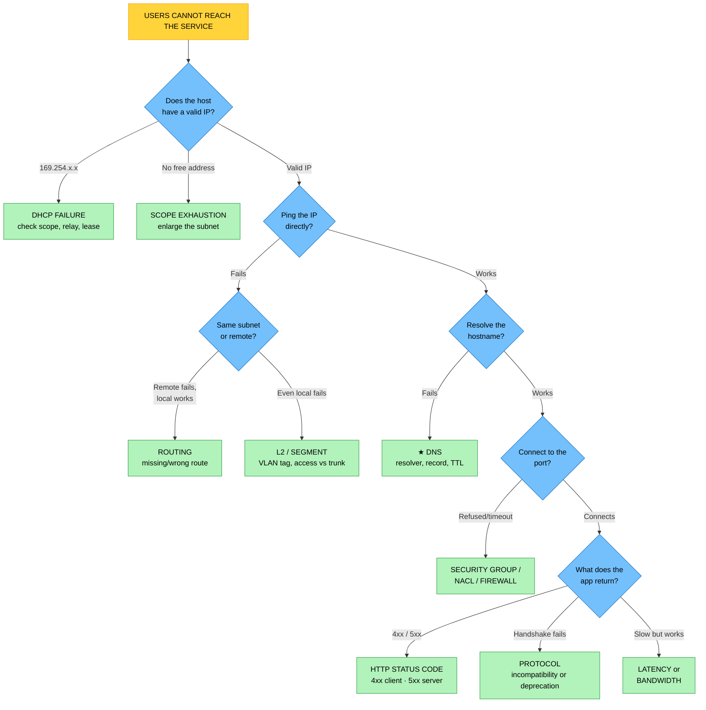

# Objective 6.2 — Given a scenario, troubleshoot network issues

> **Domain 6.0 — Troubleshooting (12% of exam)** · Exam CV0-004 V4 · Objectives doc v5.0
> **Status:** Exam-ready · **Version:** 2.0 (enhanced) · Supersedes `full notes/Objective-6.2-Network-Troubleshooting.md`

---

## 0. How to use this note

| Pass | What to read | Time |
|---|---|---|
| **1st (learn)** | Sections 1 → 11 in order | ~65 min |
| **2nd (drill)** | ★ Section 2.1 (the triage ladder) + Section 3.5 (HTTP status codes) + Section 6 (latency vs bandwidth) + Section 13 (symptom master table) | ~25 min |
| **3rd (test)** | Section 16 (practice) + Section 17 (PBQ drills) | ~30 min |
| **Exam eve** | Section 18 (60-second recall sheet) only | ~5 min |

> 📌 **The largest objective in Domain 6 — nine causes, several with sub-types.** It is also the most mechanical: network symptoms map to causes far more cleanly than deployment symptoms do. Learn the **triage ladder** in Section 2.1 and the **HTTP status codes** in Section 3.5 and you have most of the marks.

---

## 1. Official objective coverage

> **6.2 Given a scenario, troubleshoot network issues.**
> - **Network service unavailability**
>   - Dynamic Host Configuration Protocol (**DHCP**)
>   - Domain Name System (**DNS**)
>   - Network Time Protocol (**NTP**)
>   - Network Address Translation (**NAT**)
>   - Hypertext Transfer Protocol (**HTTP**)
>     - **Status codes**
> - Latency
> - Bandwidth/throughput issues
> - Network device misconfiguration
> - Protocol incompatibility
> - Protocol deprecations
> - **IP addressing issues**
>   - Scope exhaustion
>   - Network overlap
> - **Routing issues**
>   - Missing routes
>   - Misconfigured routes
> - **Switching issues**
>   - **VLAN issues** — misconfigured tags
>   - Access vs. trunk ports

### 1.1 What the verb tells you

**"Given a scenario"** — symptom in, cause and fix out. This objective is prime **performance-based question** territory: expect "these two resources cannot communicate — why?" and "which command would you run next?"

> 💡 **Network+ is a recommended prerequisite for Cloud+**, which is why VLANs, trunk ports, and DHCP appear here even though a public-cloud tenant never touches a physical switch. Study them as **hybrid and private-cloud** concepts.

### 1.2 Coverage checklist

- [ ] ★ I can distinguish **"IP works but the name doesn't"** (DNS) from every other failure
- [ ] I know **APIPA `169.254.x.x`** means DHCP failed
- [ ] I know clock skew breaks **authentication** → NTP
- [ ] ★ I know **502 vs 503 vs 504**, and **401 vs 403**
- [ ] ★ I can separate **latency** from **bandwidth** from **packet loss**
- [ ] I know **security groups are stateful; NACLs are stateless** and need both directions
- [ ] ★ I know **incompatibility vs deprecation** — and *who* caused the change
- [ ] I know **scope exhaustion** vs **network overlap**
- [ ] I know **missing** vs **misconfigured** routes
- [ ] ★ I know **access port vs trunk port** and what a **misconfigured VLAN tag** does
- [ ] I know which **diagnostic command** answers which question

---

## 2. The core mental model

### 2.1 ★ The triage ladder — work bottom-up

```text
╔══════════════════════════════════════════════════════════════════════╗
║  START AT THE BOTTOM. THE FIRST RUNG THAT FAILS IS YOUR ANSWER.      ║
╠══════════════════════════════════════════════════════════════════════╣
║  ⑦ APPLICATION   Does the app respond correctly?                     ║
║                  → HTTP STATUS CODES · protocol incompatibility      ║
║                  4xx = client's fault · 5xx = server's fault         ║
║  ─────────────────────────────────────────────────────────────────   ║
║  ⑥ NAME          Can I RESOLVE the name?                             ║
║                  ★ IP works, NAME fails → DNS. The cleanest signal.  ║
║  ─────────────────────────────────────────────────────────────────   ║
║  ⑤ PORT/POLICY   Can I reach the specific PORT?                      ║
║                  → SECURITY GROUP · NACL · firewall · LB health      ║
║                  ping works but the port is refused → a POLICY block ║
║  ─────────────────────────────────────────────────────────────────   ║
║  ④ ROUTING       Is there a PATH to the destination network?         ║
║                  → MISSING or MISCONFIGURED ROUTE · NAT · gateway    ║
║                  local subnet fine, remote fails → routing           ║
║  ─────────────────────────────────────────────────────────────────   ║
║  ③ ADDRESSING    Do I have a VALID, UNIQUE address?                  ║
║                  ★ 169.254.x.x → DHCP FAILED                         ║
║                  → SCOPE EXHAUSTION · NETWORK OVERLAP                ║
║  ─────────────────────────────────────────────────────────────────   ║
║  ② SEGMENT (L2)  Am I on the RIGHT SEGMENT?                          ║
║                  → VLAN TAG · ACCESS vs TRUNK PORT                   ║
║  ─────────────────────────────────────────────────────────────────   ║
║  ① LINK          Is the link up and fast enough?                     ║
║                  → BANDWIDTH · LATENCY · packet loss · MTU           ║
╚══════════════════════════════════════════════════════════════════════╝
```

### 2.2 ★ The four-test decision tree



---

## 3. Network service unavailability

Five supporting services that other systems depend on. **The application server can be perfectly healthy while one of these breaks everything.**

### 3.1 DHCP — Dynamic Host Configuration Protocol

| | |
|---|---|
| **What it does** | Automatically assigns an **IP address, subnet mask, default gateway, and DNS servers** to clients on lease. |
| **★ The signature symptom** | ★ **An address in `169.254.x.x`** — this is **APIPA / link-local**, which a host self-assigns **only when no DHCP server answered**. It is the single clearest tell in this objective |
| **Other symptoms** | New hosts get no address while existing ones (holding valid leases) keep working · connectivity dies suddenly when a lease expires and cannot renew · a host gets an address from the **wrong** scope |
| **Causes** | The DHCP server or service is down · ★ **scope exhaustion** — the pool has no free addresses (Section 9.1) · the **DHCP relay / IP helper** is missing, so broadcasts do not cross the router to another subnet · a **rogue DHCP server** handing out bad addresses · wrong DHCP options (bad gateway or DNS) |
| **Fix** | Restart or repoint the DHCP service · enlarge the scope or shorten lease times · configure the relay/helper on the router · locate and remove the rogue server · correct the option set |
| **★ Related but different** | ★ **`169.254.169.254`** is in the same link-local block but is the **cloud instance metadata endpoint** (4.6) — not a DHCP failure. Read the whole address |
| **Exam triggers** | "169.254", "APIPA", "self-assigned address", "no IP address", "worked until the lease expired", "new VMs get no address" |

### 3.2 DNS — Domain Name System

| | |
|---|---|
| **What it does** | Resolves **names to IP addresses**. |
| **★ The signature symptom** | ★ **`ping 8.8.8.8` succeeds but `ping example.com` fails.** Raw IP connectivity is fine; only name resolution is broken. **This is DNS, and it is never routing or a firewall** |
| **Other symptoms** | "Could not resolve host" / `NXDOMAIN` · some clients resolve correctly and others do not (different resolvers, or **cached** results) · the name resolves to an **old** IP after a change |
| **Causes** | The resolver is unreachable or misconfigured (often via a bad DHCP option) · a **missing or wrong record** · ★ **TTL caching** — clients keep the previous answer until the TTL expires · **split-horizon** DNS returning the internal view externally or vice versa · a private zone not associated with the network · recursion or forwarding misconfigured |
| **★ The TTL trap** | ★ After changing a record, clients keep the old answer **for up to the TTL**. Nothing is broken — you must **wait out the TTL or flush the cache**. Lower TTLs *before* a planned change |
| **Records to recognise** | **A** (IPv4) · **AAAA** (IPv6) · **CNAME** (alias) · **MX** (mail) · **TXT** (verification/SPF) · **PTR** (reverse) · **NS** · **SOA** |
| **Fix** | Correct the resolver address · add or fix the record · flush caches and wait out the TTL · associate the private zone with the network |
| **Exam triggers** | "resolves by IP but not by name", "NXDOMAIN", "could not resolve host", "still points to the old server after we changed it", "works from one subnet but not another" |

### 3.3 NTP — Network Time Protocol

| | |
|---|---|
| **What it does** | Synchronises system clocks (UDP **123**), hierarchically by **stratum**. |
| **★ The signature symptom** | ★ **Authentication fails while connectivity is perfect.** Time-based security is intolerant of drift |
| **What clock skew breaks** | ★ **Certificate validation** ("certificate not yet valid" / "expired") · **Kerberos** (typically a **5-minute** default tolerance) · **TOTP / MFA codes** · signed API requests · **log correlation** — events appear out of order across hosts, making incident analysis impossible (3.1) · database replication ordering |
| **Causes** | The NTP source is unreachable or blocked (UDP 123 filtered) · the host points at a bad or unsynchronised source · virtualisation-induced clock drift · a firewall dropping NTP |
| **Fix** | Repoint to a reliable source (the provider's internal time service, where available) · permit UDP 123 · force a resync · monitor drift |
| **Exam triggers** | "clock skew", "certificate not yet valid", "Kerberos ticket rejected", "MFA codes rejected", "logs out of order across servers", "authentication fails intermittently but the network is fine" |

### 3.4 NAT — Network Address Translation

| | |
|---|---|
| **What it does** | Translates **private addresses to public ones**, letting hosts without public IPs reach the internet. |
| **★ The signature symptom** | Private hosts cannot reach the internet, while public-facing hosts can — with **identical** security rules |
| **Causes** | ★ **No route to the NAT device** from the private subnet (a routing issue, Section 10) · the NAT gateway is placed in the **wrong subnet** — ★ **a NAT gateway must sit in a *public* subnet** with its own path to the internet gateway · ★ **port exhaustion** — a single NAT device supports a finite number of simultaneous translations, so very high connection counts start failing · the NAT device itself has failed · no elastic/public IP attached |
| **★ Port exhaustion** | Symptom: **most connections work but a fraction fail intermittently under heavy load**, worsening at peak. Fix: add NAT devices, distribute across zones, reduce connection churn with **keep-alive and connection pooling** |
| **★ Design consequence** | NAT permits **outbound-initiated** connections only. Inbound connections need a load balancer, port forwarding, or a public address |
| **Fix** | Add the `0.0.0.0/0` route to the NAT device · relocate the NAT gateway to a public subnet · scale out NAT · attach the public IP |
| **Exam triggers** | "private subnet cannot reach the internet", "public subnet works, private does not", "cannot download patches", "intermittent connection failures at peak through the NAT" |

### 3.5 ★ HTTP and status codes

**CompTIA explicitly lists status codes as a sub-item. These are guaranteed marks — learn the table.**

| Class | Meaning | ★ Whose fault |
|---|---|---|
| **1xx** | Informational | — |
| **2xx** | **Success** — 200 OK, 201 Created, 204 No Content | — |
| **3xx** | **Redirection** — 301 permanent, 302 temporary, 304 Not Modified (cached) | — |
| **4xx** | ★ **CLIENT error** — the request was wrong | ★ **The caller** |
| **5xx** | ★ **SERVER error** — the request was fine, the server failed | ★ **The server** |

| Code | Meaning | What it tells you |
|---|---|---|
| **400** Bad Request | Malformed request | Client sent something invalid |
| ★ **401** Unauthorized | ★ **Not authenticated** — "I don't know who you are" | Missing or invalid credentials |
| ★ **403** Forbidden | ★ **Authenticated but not permitted** — "I know who you are; you may not" | An authorization/permission problem (4.3) |
| **404** Not Found | The resource or path does not exist | Wrong URL, or the route is not deployed |
| **408** Request Timeout | The client was too slow to send | — |
| ★ **429** Too Many Requests | ★ **Rate limited / throttled** | Back off with jitter (6.1, 5.3) |
| **500** Internal Server Error | The application threw an unhandled error | Look in the application logs |
| ★ **502** Bad Gateway | ★ A proxy or load balancer got an **invalid response from the backend** | The backend is broken or crashed mid-response |
| ★ **503** Service Unavailable | ★ **No healthy backends**, or the service is overloaded or in maintenance | Health checks are failing, or targets are unregistered |
| ★ **504** Gateway Timeout | ★ The backend **did not respond in time** | The backend is alive but **too slow** — a latency or capacity problem |

```text
   ★ THE LOAD-BALANCER TRIO — the single most-tested distinction here

   502 BAD GATEWAY       backend replied, but with GARBAGE
                         → the app crashed or returned a malformed response
   503 SERVICE UNAVAIL.  ★ NO HEALTHY BACKENDS AT ALL
                         → health checks failing · targets deregistered ·
                           the whole tier is down or overloaded
   504 GATEWAY TIMEOUT   backend is ALIVE but TOO SLOW
                         → it never answered within the timeout window
                         → look at latency, resource sizing, slow queries

   ★ AND: 401 = "WHO are you?"   403 = "I know you. NO."
```

| | |
|---|---|
| **Other HTTP causes** | Wrong port or protocol (plain HTTP to an HTTPS listener) · a redirect loop · a certificate error interrupting the connection before any status code is returned |
| **Exam triggers** | Any explicit status code · "the load balancer returns 503", "backends are healthy but requests time out" (504), "requests are rejected as unauthorized" (401 vs 403) |

---

## 4. Latency

| | |
|---|---|
| **Definition** | The **delay** between sending a request and receiving a response — usually measured as **round-trip time (RTT)** in milliseconds. |
| **★ The tell** | ★ **Everything works — it is just slow.** Small requests are as slow as large ones, because the delay is per **round trip**, not per byte |
| **Components** | **Propagation delay** — physical distance, bounded by the speed of light in fibre · **queuing delay** — congestion · **processing delay** — devices inspecting the packet · **serialization delay** — putting bits on the wire |
| **★ The physics** | Light travels ~200,000 km/s in fibre, so **1,000 km ≈ 5 ms one way ≈ 10 ms round trip**. ★ **No amount of bandwidth reduces this** — distance is the floor |
| **★ Why chatty apps suffer** | Latency multiplies by the number of **round trips**. 100 sequential queries at 100 ms RTT = **10 seconds**, regardless of how little data moves. This is exactly the under-fetching problem GraphQL addresses (5.3) |
| **Causes** | Geographic distance between tiers · cross-region calls · a chatty protocol or N+1 query pattern · congestion and queuing · too many network hops · under-provisioned devices |
| **Fix** | ★ **Co-locate** the tiers that talk most · **cache** (in-memory or CDN) so the request never crosses the distance · **reduce round trips** — batch, pipeline, use persistent connections and connection pooling · place read replicas near the consumers · use the provider's backbone rather than the public internet |
| **Exam triggers** | "slow but nothing is down", "the database is in another region", "each page takes seconds but the files transfer fine", "high RTT", "response time degraded after we moved the tier" |

---

## 5. Bandwidth and throughput issues

| | |
|---|---|
| **Definitions** | ★ **Bandwidth** = the link's maximum **capacity** (bits per second). ★ **Throughput** = what you **actually achieve**. Throughput is always ≤ bandwidth |
| **★ The tell** | ★ **Bulk transfers are slow or stall**, while small requests are fine. Time-of-day patterns are common |
| **Causes** | The link is **saturated** — total demand exceeds capacity · a bulk job (backup, replication, migration) competing with production · an instance-level network cap on a smaller instance type · a throttled or metered link · **packet loss** forcing retransmission |
| **★ The advanced trap — the bandwidth-delay product** | ★ On a **long, fat network** (high bandwidth *and* high latency), throughput is capped by the **TCP window size**, not by the link. Upgrading a trans-oceanic link from 1 Gbps to 10 Gbps can change nothing. Fix: **TCP window scaling**, parallel streams, or a purpose-built transfer protocol (see 1.10) |
| **★ Packet loss** | Even ~1% loss collapses TCP throughput, because TCP interprets loss as congestion and backs off. Symptom: **erratic** throughput and retransmissions — distinct from a cleanly saturated link |
| **Fix** | Schedule bulk work **off-peak** · apply **QoS or rate limiting** to background jobs · increase the link or instance network tier · use a **dedicated private connection** for sustained replication · compress · parallelise · fix the underlying loss |
| **Exam triggers** | "the nightly backup slows production", "a large transfer never finishes", "saturated link", "slow only between 02:00 and 04:00", "we upgraded the link and it made no difference" |

---

## 6. ★ Latency vs bandwidth vs packet loss

```text
   ┌──────────────┬────────────────────┬───────────────────────────────┐
   │              │ SYMPTOM            │ FIX                           │
   ├──────────────┼────────────────────┼───────────────────────────────┤
   │ LATENCY      │ ★ Everything is    │ ★ Co-locate · cache · CDN ·   │
   │ (delay, ms)  │ slow, big AND      │ REDUCE ROUND TRIPS            │
   │              │ small alike        │ ⚠ more bandwidth does NOT help│
   ├──────────────┼────────────────────┼───────────────────────────────┤
   │ BANDWIDTH    │ ★ BULK transfers   │ ★ Bigger pipe · off-peak      │
   │ (capacity)   │ crawl; small       │ scheduling · QoS · compress · │
   │              │ requests are fine  │ parallelise                   │
   ├──────────────┼────────────────────┼───────────────────────────────┤
   │ PACKET LOSS  │ ★ ERRATIC — works, │ ★ Find the faulty link/device·│
   │              │ then stalls, then  │ check MTU · relieve congestion│
   │              │ works; retransmits │                               │
   └──────────────┴────────────────────┴───────────────────────────────┘

   ★ THE ANALOGY:
     LATENCY   = how long the road is       (a longer road)
     BANDWIDTH = how many lanes it has      (a narrower road)
     LOSS      = potholes throwing cars off  (an unreliable road)

   ★ THE DECIDING TEST:
     Is a SMALL request also slow?  YES → LATENCY.  NO → BANDWIDTH.
```

---

## 7. Network device misconfiguration

| | |
|---|---|
| **Definition** | A wrong setting on a device or virtual control that inspects or forwards traffic — **security groups, network ACLs, firewalls, load balancers, routers, switches, gateways**. |
| **★ The tell** | ★ **The host is running and healthy, but nothing can reach it** — or it can be pinged yet the specific port refuses |
| **★ Stateful vs stateless** | ★ **Security groups are STATEFUL** — allow inbound and the reply is automatically permitted. ★ **NACLs are STATELESS** — you must allow **both directions explicitly**, including the **ephemeral port range** for return traffic. ★ **Forgetting the outbound ephemeral rule on a NACL is a classic exam scenario** (1.3) |
| **Other common faults** | An **implicit deny** at the end of a rule list · rules in the wrong **order** (a broad deny above a specific allow) · the wrong port or protocol · a **load balancer health check** pointing at the wrong path/port so healthy targets are marked unhealthy → **503** · targets not registered · ★ **MTU mismatch** — see below · on-premises speed/duplex mismatch |
| **★ The MTU trap** | ★ Symptom: **small packets succeed, large transfers hang**. `ping` works, SSH connects, then the session freezes on a big response. Cause: an MTU mismatch (often **jumbo frames** enabled on one side, or tunnel overhead from a VPN) plus **blocked ICMP**, which breaks path-MTU discovery and creates a **black hole**. Fix: align the MTU, lower the TCP MSS, or permit the necessary ICMP |
| **Fix** | Add the specific allow rule · fix NACL return traffic · reorder rules · correct the health-check path and port · align the MTU |
| **Exam triggers** | "the server is up but unreachable", "ping works but the port is refused", "worked until the ACL was changed", "small requests fine, large ones hang", "the load balancer marks healthy instances unhealthy" |

---

## 8. Protocol incompatibility and protocol deprecations

These two are constantly confused. **The discriminator is *who* changed something, and *whether it is gone for everyone*.**

### 8.1 Protocol incompatibility

| | |
|---|---|
| **Definition** | Two live endpoints **cannot agree on a common protocol version or cipher**. Both are running; they simply share no overlap. |
| **★ The tell** | ★ **The TCP connection opens, then the handshake fails.** The path is fine; the negotiation is not |
| **Examples** | A client offering only TLS 1.0 against a server requiring TLS 1.2+ · **no cipher suite in common** · an SSH key-exchange or algorithm mismatch · **IPv6-only client, IPv4-only server** (or a missing AAAA record) · an SMB version mismatch |
| **Fix** | ★ **Align both ends** — upgrade the client, or (as a documented temporary measure) widen the server's accepted set |
| **Exam triggers** | "handshake failure", "no cipher in common", "the TCP connection opens then resets", "after we tightened our own TLS policy", "the client is IPv6-only" |

### 8.2 Protocol deprecations

| | |
|---|---|
| **Definition** | A **provider or standards body has retired** a protocol or version — for everyone, on an announced date. |
| **★ The tell** | ★ **It broke for every old client at once, on a known date, and no configuration of yours brings it back** |
| **Examples** | **SSL 3.0, TLS 1.0 and 1.1** disabled across the industry · weak ciphers (RC4, 3DES) removed · **SMBv1** disabled by default · older SSH algorithms withdrawn · a provider API version sunset |
| **Fix** | ★ **Migrate to the supported protocol.** There is no way to keep using the retired one |
| **Prevent** | Track deprecation notices and sunset dates (3.4) · inventory legacy clients **before** the cutoff · test against the new minimum early |
| **Exam triggers** | "on the announced date", "the provider disabled TLS 1.0", "all legacy clients failed simultaneously", "end of support for the protocol" |

### 8.3 ★ Telling them apart

```text
   THE HANDSHAKE FAILS. WHICH ONE?

   ┌─ WHO MADE THE CHANGE, AND HOW WIDE IS IT? ────────────────────────┐
   │                                                                   │
   │  YOU tightened YOUR OWN server/policy, and it affects             │
   │  the pairs that no longer overlap                                 │
   │        → ★ PROTOCOL INCOMPATIBILITY                               │
   │        → FIX: align the two ends (you CAN relax your own policy)  │
   │                                                                   │
   │  THE PROVIDER or the STANDARD retired it, on a date,              │
   │  for EVERYONE, everywhere                                         │
   │        → ★ PROTOCOL DEPRECATION                                   │
   │        → FIX: MIGRATE. You cannot turn it back on.                │
   └───────────────────────────────────────────────────────────────────┘

   ★ THE ONE-QUESTION TEST:
     "Could I fix this by changing a setting on my own server?"
       YES → INCOMPATIBILITY      NO  → DEPRECATION
```

> ⚠️ **Note on a v1 inconsistency:** the earlier version of this note labelled "our load balancer now enforces TLS 1.2 and an old client fails" as *deprecation* in one section and *incompatibility* in another. It is **incompatibility** — **you** changed **your own** policy and could reverse it. It becomes deprecation only when the **provider or standard** removes the protocol so that no setting of yours restores it.

---

## 9. IP addressing issues

### 9.1 Scope exhaustion

| | |
|---|---|
| **Definition** | The DHCP pool or subnet has **no free addresses left** to assign. |
| **Symptoms** | New hosts cannot obtain an address (**APIPA**) · new instances or interfaces fail to launch with an "insufficient free addresses" error · autoscaling stops adding capacity |
| **Causes** | ★ **The subnet was sized too small at design time** — the most common cause, and it is painful because subnets usually cannot be shrunk or resized in place · lease times too long, so departed devices hold addresses · unreleased addresses from churn · ★ **hidden consumers** — load balancer interfaces, container/pod addressing, managed-service endpoints, and **provider-reserved addresses in every subnet** all consume from the same pool |
| **★ Reserved addresses** | Every subnet loses the **network** and **broadcast** addresses, and cloud providers typically reserve **around five** addresses per subnet for the gateway, DNS, and future use. A `/28` gives you far fewer usable addresses than 16 |
| **Fix** | Add a secondary CIDR range or a new, larger subnet · shorten lease times · release unused addresses · migrate to a larger block · consider IPv6 |
| **Prevent** | ★ **Plan CIDR generously up front** — address space is free, and re-addressing later is extremely disruptive |
| **Exam triggers** | "no free IP addresses", "cannot allocate address", "the subnet is full", "autoscaling stopped and there are no capacity or quota errors" |

### 9.2 Network overlap

| | |
|---|---|
| **Definition** | Two networks use the **same or overlapping CIDR ranges**, making routing ambiguous. |
| **★ The tell** | ★ **The tunnel or peering shows healthy, but no traffic flows** — or a connection cannot be established at all. A host cannot tell whether `10.0.1.5` is local or remote, so it never leaves |
| **Why it is so common** | ★ Everyone defaults to the same private ranges — **RFC 1918: `10.0.0.0/8`, `172.16.0.0/12`, `192.168.0.0/16`**. Two organisations that both chose `10.0.0.0/16` cannot peer. It surfaces during **mergers, acquisitions, partner connections, and hybrid VPNs** |
| **Fix** | ★ **Re-address one side** to a non-overlapping range (correct but disruptive) · **NAT the overlap** so each side sees the other through a distinct range (a common practical workaround) · use a transit design with translation |
| **Prevent** | ★ **Maintain a central IP address plan** allocating non-overlapping ranges to every environment, region, and partner before anything is built |
| **Exam triggers** | "both use 10.0.0.0/16", "VPC peering cannot be created", "the VPN is up but no traffic passes", "after the acquisition the two networks cannot connect", "overlapping CIDR" |

---

## 10. Routing issues

| | |
|---|---|
| **What a route table does** | Tells traffic **where to go next** for a given destination network. |
| **★ Longest prefix match** | ★ The **most specific** matching route wins, regardless of order. `10.0.1.0/24` beats `10.0.0.0/16`, which beats `0.0.0.0/0` (1.3). A too-specific wrong route silently overrides the correct general one |

### 10.1 Missing routes

| | |
|---|---|
| **Definition** | There is **no entry** for the destination, so traffic is dropped — a **black hole**. |
| **★ The tell** | ★ **Local subnet traffic works; anything remote fails.** Traceroute stops at the gateway with nothing beyond |
| **Classic case** | ★ A private subnet's route table lacks `0.0.0.0/0 → NAT gateway`, so instances cannot reach the internet to patch — while the public subnet, which *has* its route to the internet gateway, works fine with identical security rules |
| **Other cases** | A subnet not **associated** with the intended route table (it silently uses the default) · a VPN or peering route never propagated · a missing return route causing one-way traffic |
| **Fix** | Add the route · associate the subnet with the correct table · enable route propagation |

### 10.2 Misconfigured routes

| | |
|---|---|
| **Definition** | A route **exists but points to the wrong target** or has the wrong prefix. |
| **★ The tell** | ★ **Traffic goes somewhere — just not where it should.** This is often worse than a missing route, because it fails silently or unpredictably |
| **Cases** | The next hop points at the internet gateway instead of the VPN/transit gateway, so private traffic leaks toward the internet · an overly specific prefix hijacking traffic via longest-prefix match · ★ **asymmetric routing** — traffic leaves by one path and returns by another, so a **stateful** firewall sees a reply with no matching outbound state and **drops it** · a routing loop, visible as repeating hops in traceroute until TTL expires |
| **Fix** | Correct the target and the prefix · make paths symmetric · remove the conflicting specific route |
| **Exam triggers** | "no route to the destination", "traceroute ends at the gateway", "private subnet cannot reach the internet with identical security groups", "traffic for the on-premises network is being sent to the internet", "the connection works one way only" |

---

## 11. Switching issues — VLANs

> 💡 **Where this applies:** VLANs are a **Layer 2** construct on physical or virtual switches. You configure them in **private cloud, hosted, and on-premises/hybrid** environments. Public-cloud tenants do not manage VLAN tags — the provider abstracts Layer 2 away, and the equivalent controls are subnets and security groups. **Answer VLAN questions in their own terms.**

| | |
|---|---|
| **What a VLAN is** | A logically separated Layer 2 broadcast domain on shared physical switches. **802.1Q** adds a **tag** carrying the VLAN ID to the frame. |
| **★ Access port** | ★ Carries **one untagged VLAN**. For **end devices** — servers, workstations, printers. The switch adds and strips the tag; the device knows nothing about VLANs |
| **★ Trunk port** | ★ Carries **multiple VLANs, tagged**. For links **between switches**, to a router, or to a **hypervisor host** running VMs in several VLANs |
| **★ Native VLAN** | The one VLAN sent **untagged** on a trunk. A **native VLAN mismatch** between the two ends causes traffic to land in the wrong VLAN — a security concern as well as a connectivity fault |

### 11.1 The symptoms

| Fault | Symptom |
|---|---|
| ★ **Access port where a trunk is needed** | ★ Only **one** VLAN works; every other VLAN on that link is dead. Classic on a **hypervisor uplink** — VMs in one VLAN work, all others are isolated |
| ★ **Trunk port where access is needed** | The end device receives **tagged frames it cannot interpret** and drops them — no connectivity at all |
| ★ **Misconfigured VLAN tag / wrong VLAN ID** | The device lands in the **wrong segment**: it may get an address from the wrong DHCP scope, or none at all, and cannot see its expected peers |
| **VLAN not allowed on the trunk** | The trunk is correct but that VLAN ID is not in the allowed list — that one VLAN fails while others work |
| **Native VLAN mismatch** | Untagged traffic lands in a different VLAN on each side |
| ★ **No inter-VLAN routing** | ★ VLAN 10 and VLAN 20 cannot reach each other **by design** — VLANs are separate broadcast domains and require a **Layer 3 router or switch virtual interface (SVI)** to communicate. This is often **not a fault at all** |

| | |
|---|---|
| **How to spot it** | Layer 3 looks perfect — correct IP, mask, and gateway — yet the host cannot reach devices that should be on its own segment |
| **Fix** | Set the correct port mode · correct the VLAN ID · add the VLAN to the trunk's allowed list · align the native VLAN · configure inter-VLAN routing where cross-VLAN traffic is genuinely required |
| **Exam triggers** | "access port", "trunk port", "802.1Q", "tagged/untagged", "the VM is in the wrong VLAN", "only one VLAN passes over the uplink", "VLAN 10 cannot reach VLAN 20" |

---

## 12. Diagnostic commands

> 💡 **Not a listed sub-bullet**, but "which tool would you use next?" is a natural scenario question, and Network+ is a Cloud+ prerequisite.

| Question | Command | What it proves |
|---|---|---|
| Is the host reachable at all? | `ping` | Basic IP reachability and RTT (⚠️ ICMP is often blocked — no reply ≠ host down) |
| Where does the path break? | `traceroute` / `tracert` · `mtr` | The hop at which traffic stops, plus per-hop latency and loss |
| Is it DNS? | `nslookup` · `dig` | Whether the name resolves, to what, and from which resolver |
| What is my own configuration? | `ipconfig /all` · `ip addr` / `ifconfig` | ★ Reveals **169.254.x.x**, the mask, the gateway, and DNS servers |
| Is the port open? | `telnet host port` · `nc -zv` · `Test-NetConnection` | ★ Separates a **policy block** from a routing failure — ping may work while the port is refused |
| What is my routing table? | `route print` · `ip route` · `netstat -r` | Missing or wrong routes |
| What is actually on the wire? | `tcpdump` · Wireshark | Retransmissions, resets, handshake failures, MTU problems |
| What does the web service return? | `curl -v` | ★ The **status code**, headers, redirects, and TLS negotiation details |
| What connections exist? | `netstat` · `ss` | Listening ports and established sessions |
| Which cloud component blocks the path? | The provider's reachability/path analyzer and **flow logs** | ★ Names the exact security group, NACL, or missing route |
| Renew addressing | `ipconfig /release` + `/renew` · `dhclient` | Whether DHCP responds |
| Clear stale name answers | `ipconfig /flushdns` | Whether a **TTL-cached** record was the problem |

> ★ **The high-yield pair:** `ping` proves the **path**; `telnet`/`nc` to the port proves the **policy**. Ping succeeding while the port is refused points squarely at a **security group, NACL, or firewall**.

---

## 13. ★ Symptom → cause → fix master table

| Symptom | Cause | Fix |
|---|---|---|
| Host has a **`169.254.x.x`** address | **DHCP failure** | Restore DHCP; check scope, relay, and lease |
| "Insufficient free addresses"; the subnet is full | **Scope exhaustion** | Add a CIDR or larger subnet; shorten leases |
| ★ Ping by **IP works**, by **name fails** | ★ **DNS** | Fix the resolver or record |
| Name resolves to the **old** server after a change | **DNS TTL caching** | Wait out the TTL; flush caches |
| Authentication fails, connectivity perfect, clock skew | **NTP** | Resync the clock; permit UDP 123 |
| Certificate "not yet valid"; Kerberos rejected | **NTP** | Fix time synchronisation |
| Private subnet cannot reach the internet, public can, identical rules | ★ **Missing route to NAT** | Add `0.0.0.0/0 → NAT gateway` |
| Intermittent outbound failures at peak through NAT | **NAT port exhaustion** | Scale out NAT; pool connections |
| Load balancer returns **503** | **No healthy backends** | Fix health checks; register targets |
| Load balancer returns **504** | **Backend too slow** | Address latency and capacity |
| Load balancer returns **502** | **Backend returned an invalid response** | Fix the crashing application |
| **401** vs **403** | Not authenticated vs **not permitted** | Credentials vs authorization (4.3) |
| Everything slow; small requests slow too | ★ **Latency** | Co-locate, cache, reduce round trips |
| Bulk transfers crawl; small requests fine | ★ **Bandwidth** | Off-peak, QoS, bigger link, parallelise |
| Upgraded a long-distance link, no improvement | **Bandwidth-delay product** | TCP window scaling; parallel streams |
| Erratic — works, stalls, works; retransmissions | **Packet loss** | Find the faulty link; check MTU |
| Host running but nothing reaches it | **Security group / NACL / firewall** | Add the specific allow rule |
| Ping works but the port is refused | **Policy block** | Open the port; check NACL return traffic |
| Return traffic dropped though inbound is allowed | ★ **Stateless NACL missing ephemeral ports** | Allow the ephemeral range outbound |
| ★ Small packets fine, large transfers hang | ★ **MTU mismatch** | Align MTU; lower MSS; allow ICMP |
| TCP connects, then the handshake fails | **Protocol incompatibility** | Align TLS/cipher on both ends |
| All legacy clients failed on an announced date | **Protocol deprecation** | Migrate to the supported protocol |
| Peering/VPN healthy but no traffic; both use `10.0.0.0/16` | ★ **Network overlap** | Re-address one side, or NAT the overlap |
| Traceroute ends at the gateway, nothing beyond | **Missing route** | Add the route; check subnet association |
| On-premises traffic leaving toward the internet | **Misconfigured route target** | Point the route at the VPN/transit gateway |
| Works one direction only; a stateful firewall drops replies | **Asymmetric routing** | Make the paths symmetric |
| Correct IP and mask, but isolated from expected peers | **VLAN tag / wrong segment** | Correct the VLAN ID or port mode |
| Only one VLAN passes over a hypervisor uplink | ★ **Access port where a trunk is needed** | Convert the port to a trunk |
| VLAN 10 cannot reach VLAN 20 | **No inter-VLAN routing** | Add L3 routing — or confirm it is intended |

---

## 14. Exam traps & distractor patterns

| # | Trap | The truth |
|---|---|---|
| 1 | "Name resolution fails, so it must be a routing or firewall problem" | ❌ ★ **IP works, name fails = DNS.** Always |
| 2 | "`169.254.169.254` is unreachable, so DHCP failed" | ❌ That address is the **instance metadata endpoint** (4.6). A `169.254` address **assigned to the host** is the DHCP tell |
| 3 | "More bandwidth will fix high latency" | ❌ ★ **Distance is physics.** Co-locate, cache, or reduce round trips |
| 4 | "Slow performance always means insufficient bandwidth" | If **small** requests are also slow, it is **latency** |
| 5 | "Ping fails, so the host is down" | ⚠️ **ICMP is frequently blocked.** Test the actual port |
| 6 | "Ping works, so the network is fine" | Ping proves the **path**, not the **policy**. The port can still be blocked |
| 7 | "The security group allows inbound, so return traffic is fine" | ✅ For a **stateful** security group. ❌ For a **stateless NACL** — allow the **ephemeral range outbound** too |
| 8 | "503 means the backend is slow" | ❌ **503 = no healthy backends.** **504** is the slow one. **502** is an invalid response |
| 9 | "401 and 403 are the same" | ❌ **401 = not authenticated. 403 = authenticated but forbidden** |
| 10 | "A 4xx means the server failed" | ❌ **4xx = client. 5xx = server** |
| 11 | "We tightened our own TLS policy, so this is deprecation" | ❌ ★ You can reverse your own setting → **incompatibility**. Deprecation is the **provider/standard** removing it |
| 12 | "The VPN is up, so addressing cannot be the problem" | ❌ ★ **Overlapping CIDRs** let the tunnel establish while no traffic can route |
| 13 | "Two sites both using `10.0.0.0/16` can be peered by adding routes" | ❌ Ambiguous destinations cannot be resolved by routing. **Re-address or NAT** |
| 14 | "Route order determines which route wins" | ❌ ★ **Longest prefix match** — the most specific route wins |
| 15 | "VLAN 10 cannot reach VLAN 20, so something is broken" | ⚠️ VLANs are separate broadcast domains **by design** — cross-VLAN traffic needs **L3 routing** |
| 16 | "Set the hypervisor uplink as an access port" | ❌ A host carrying **multiple VLANs** needs a **trunk** |
| 17 | "Ping works and SSH connects, so MTU is fine" | ❌ ★ **MTU mismatch** shows as **small packets working and large ones hanging** |
| 18 | "The clock is a few minutes off — harmless" | ❌ It breaks **certificates, Kerberos, MFA, and log correlation** |
| 19 | "Only the load balancer needs the health-check port open" | The **targets** must accept the health check on the configured **path and port**, or they are marked unhealthy → 503 |

**Disambiguation drill:**

| Pair | The deciding question |
|---|---|
| **DNS vs routing** | Does the **raw IP** work? |
| **Latency vs bandwidth** | Is a **small** request also slow? |
| **Bandwidth vs packet loss** | Is it **consistently** slow, or **erratic**? |
| **Routing vs firewall** | Does **ping** succeed while the **port** is refused? |
| **Missing vs misconfigured route** | Does traffic **vanish**, or **go to the wrong place**? |
| **Incompatibility vs deprecation** | ★ Could **your own setting** restore it? |
| **Exhaustion vs overlap** | **No addresses available**, or **duplicate addresses**? |
| **Access vs trunk** | **One** VLAN, or **several**? |
| **502 / 503 / 504** | **Bad response** / **no backend** / **too slow** |
| **401 vs 403** | **Who are you?** vs **I know you — no** |
| **DHCP vs DNS** | **No address**, or **address but no name**? |

---

## 15. Keyword → answer trigger table

| If you see… | Think |
|---|---|
| `169.254.x.x` · APIPA · self-assigned · no IP · lease expired | **DHCP failure** |
| "insufficient free addresses" · subnet full · cannot allocate | **Scope exhaustion** |
| ping by IP works, by name fails · NXDOMAIN · "could not resolve" | ★ **DNS** |
| still resolving to the old server after a change | **DNS TTL cache** |
| clock skew · certificate not yet valid · Kerberos rejected · MFA codes fail · logs out of order | **NTP** |
| private subnet no internet · public works · cannot patch | **Missing route to NAT** |
| intermittent outbound failures at peak through NAT | **NAT port exhaustion** |
| 502 · bad gateway | **Backend returned an invalid response** |
| 503 · service unavailable | ★ **No healthy backends** |
| 504 · gateway timeout | ★ **Backend too slow** |
| 401 / 403 | **Not authenticated / not permitted** |
| 429 | **Throttling** |
| slow everything, small requests too · cross-region · high RTT | **Latency** |
| nightly backup · large transfer stalls · saturated link | **Bandwidth** |
| upgraded the long-haul link, no change | **Bandwidth-delay product / TCP window** |
| erratic, retransmissions | **Packet loss** |
| running but unreachable · ping ok, port refused | **Security group / NACL / firewall** |
| return traffic dropped, inbound allowed | ★ **Stateless NACL, ephemeral ports** |
| small packets fine, large hang · jumbo frames · VPN overhead | ★ **MTU mismatch** |
| handshake failure · no cipher in common · we tightened our policy | **Protocol incompatibility** |
| announced cutoff · provider disabled TLS 1.0 · all legacy clients at once | **Protocol deprecation** |
| both sides use 10.0.0.0/16 · peering refused · tunnel up, no traffic · after the merger | ★ **Network overlap** |
| traceroute stops at the gateway · black hole | **Missing route** |
| traffic sent to the wrong target · works one way only | **Misconfigured / asymmetric route** |
| access port · trunk port · 802.1Q · tagged/untagged · wrong VLAN | **Switching / VLAN** |
| only one VLAN works on the hypervisor uplink | ★ **Access port where a trunk is needed** |

---

## 16. Practice questions

<details>
<summary><b>Q1.</b> A server can successfully `ping 8.8.8.8` but `ping www.example.com` fails with "could not resolve host." What is the cause?</summary>

A. Missing route · B. Firewall blocking all traffic · **C. DNS failure** · D. Bandwidth exhaustion

**Correct: C.** ★ IP connectivity is proven by the successful numeric ping, so the path and the firewall are fine — only **name resolution** is broken.
- **A wrong:** A missing route would break the numeric ping too.
- **B wrong:** A blanket firewall block would stop both.
- **D wrong:** Bandwidth problems slow transfers; they do not cause resolution failures.
</details>

<details>
<summary><b>Q2.</b> Newly provisioned VMs come up with addresses in `169.254.0.0/16` and cannot communicate, while existing VMs work normally. What is the MOST likely cause?</summary>

**A. DHCP failure or scope exhaustion** · B. DNS misconfiguration · C. A missing default route · D. Protocol deprecation

**Correct: A.** ★ A `169.254.x.x` address is **APIPA** — the host self-assigned it because **no DHCP server responded**. Existing VMs still work because they hold valid leases.
- **B wrong:** DNS problems leave the host with a real address.
- **C wrong:** A missing route still leaves a valid address assigned.
- **D wrong:** Unrelated to address assignment.
</details>

<details>
<summary><b>Q3.</b> A load balancer returns `503 Service Unavailable`. What does this indicate?</summary>

A. The backend responded too slowly · **B. There are no healthy backend targets available** · C. The client sent a malformed request · D. The client is not authenticated

**Correct: B.** ★ **503 = nothing healthy to send the request to** — typically failing health checks, deregistered targets, or an overloaded tier.
- **A wrong:** That is **504 Gateway Timeout**.
- **C wrong:** That is **400 Bad Request**.
- **D wrong:** That is **401 Unauthorized**.
</details>

<details>
<summary><b>Q4.</b> Requests through a load balancer intermittently return `504 Gateway Timeout`, and the backend instances show CPU pegged at 100%. What is the cause?</summary>

A. No healthy backends · **B. The backends are alive but responding too slowly for the timeout window** · C. DNS resolution failure · D. A missing route

**Correct: B.** ★ **504 means the backend did not answer in time** — it is reachable and alive, just too slow. Address the capacity or query performance.
- **A wrong:** That would produce **503**.
- **C/D wrong:** Neither yields a gateway timeout from a functioning load balancer.
</details>

<details>
<summary><b>Q5.</b> Instances in a private subnet cannot reach the internet, while instances in a public subnet can. Both use identical security groups. What is the MOST likely cause?</summary>

A. A security group block · **B. The private subnet's route table is missing a route to the NAT gateway** · C. DNS failure · D. Scope exhaustion

**Correct: B.** ★ With **identical** security groups, the differing element is the **route table** — the private subnet needs `0.0.0.0/0 → NAT gateway`.
- **A wrong:** Identical rules would affect both subnets equally.
- **C wrong:** DNS failure would break name resolution specifically, not all egress, and not per-subnet.
- **D wrong:** Exhaustion prevents address assignment, not egress.
</details>

<details>
<summary><b>Q6.</b> Users authenticate successfully in the morning but are rejected later in the day with "certificate is not yet valid" errors, while network connectivity is perfect. What is the cause?</summary>

**A. NTP failure causing clock drift** · B. DNS failure · C. Bandwidth saturation · D. A misconfigured route

**Correct: A.** ★ **Time-based security is intolerant of drift** — certificate validity windows, Kerberos tickets, and TOTP codes all fail when clocks diverge. Connectivity being perfect is the clue.
- **B/C/D wrong:** None produces time-validity errors while the network functions normally.
</details>

<details>
<summary><b>Q7.</b> A web application in one region queries a database in another. Individual queries return quickly in isolation, but page loads take seconds. Large file transfers between the two regions are fast. What is the cause?</summary>

A. Bandwidth limitation · **B. Latency multiplied across many sequential round trips** · C. Packet loss · D. Protocol incompatibility

**Correct: B.** ★ Fast bulk transfer rules out bandwidth. The page makes **many sequential round trips**, and each pays the cross-region RTT. Reduce round trips, cache, or co-locate.
- **A wrong:** Large transfers being fast disproves a capacity constraint.
- **C wrong:** Loss produces erratic behaviour, not consistent per-request delay.
- **D wrong:** Incompatibility prevents connection entirely.
</details>

<details>
<summary><b>Q8.</b> A nightly 500 GB replication job causes production latency spikes and packet drops between 02:00 and 04:00 every night. What is the cause and BEST first remediation?</summary>

**A. Bandwidth saturation — reschedule or rate-limit the bulk job, or apply QoS** · B. Latency — co-locate the tiers · C. DNS failure — fix the resolver · D. Protocol deprecation — upgrade TLS

**Correct: A.** ★ A **predictable time window** and a large transfer competing with production traffic is the signature of link saturation.
- **B wrong:** Distance has not changed; the problem is volume during a window.
- **C/D wrong:** Neither is time-window dependent.
</details>

<details>
<summary><b>Q9.</b> An organisation upgrades a trans-continental link from 1 Gbps to 10 Gbps, but single large file transfers complete no faster. What explains this?</summary>

**A. Throughput is limited by the bandwidth-delay product and the TCP window size, not the link capacity** · B. The link is faulty · C. DNS caching · D. A VLAN misconfiguration

**Correct: A.** ★ On a **long fat network**, a single TCP stream cannot fill the pipe unless the window is scaled to cover the delay. Use window scaling, parallel streams, or a purpose-built transfer protocol.
- **B wrong:** Nothing indicates a fault; other traffic works.
- **C/D wrong:** Neither affects sustained single-stream throughput.
</details>

<details>
<summary><b>Q10.</b> An instance is running and its web server is listening on port 443, but no client can connect. `ping` to the instance succeeds. What is the MOST likely cause?</summary>

A. DNS failure · B. A missing route · **C. A security group, NACL, or firewall rule not permitting port 443** · D. Scope exhaustion

**Correct: C.** ★ **Ping proves the path; the refused port proves the policy.** The traffic reaches the host and is blocked by a rule.
- **A wrong:** Name resolution is not involved when connecting to a reachable address.
- **B wrong:** A missing route would break the ping as well.
- **D wrong:** The instance already holds an address.
</details>

<details>
<summary><b>Q11.</b> Inbound traffic to an instance is permitted by the network ACL, but replies never reach the client. What is the MOST likely cause?</summary>

**A. The NACL is stateless and the outbound ephemeral port range is not permitted** · B. The security group is stateless · C. DNS caching · D. Scope exhaustion

**Correct: A.** ★ **NACLs are stateless — both directions must be allowed explicitly**, and return traffic uses high-numbered **ephemeral ports**. This is a classic exam scenario.
- **B wrong:** Reversed — **security groups are stateful**, so replies are automatically allowed.
- **C/D wrong:** Neither affects return traffic.
</details>

<details>
<summary><b>Q12.</b> Two organisations merge. Both networks use `10.0.0.0/16`. A VPN tunnel establishes successfully, but no traffic passes between them. What is the cause?</summary>

A. A missing route · **B. Network overlap — the CIDR ranges are identical, so destinations are ambiguous** · C. Protocol incompatibility · D. Bandwidth exhaustion

**Correct: B.** ★ **The tunnel being healthy while nothing flows is the overlap signature.** A host cannot tell whether `10.0.1.5` is local or remote, so packets never leave. Fix by re-addressing one side or **NAT-ing the overlap**.
- **A wrong:** Routes cannot disambiguate identical destinations.
- **C wrong:** The tunnel negotiated successfully.
- **D wrong:** No traffic is passing at all.
</details>

<details>
<summary><b>Q13.</b> Traffic destined for the on-premises network is being sent to the internet gateway instead of the VPN gateway. What is the cause?</summary>

A. A missing route · **B. A misconfigured route pointing at the wrong target** · C. DNS failure · D. VLAN tag mismatch

**Correct: B.** ★ Traffic is going **somewhere** — so a route exists, and its **next hop is wrong**. A missing route would black-hole the traffic instead.
- **A wrong:** Missing routes cause silent drops, not misdirection.
- **C/D wrong:** Neither determines the next hop.
</details>

<details>
<summary><b>Q14.</b> A hypervisor host runs VMs in five different VLANs, but only VMs in one VLAN have connectivity. What is the MOST likely cause?</summary>

**A. The switch port for the hypervisor uplink is configured as an access port instead of a trunk port** · B. DNS misconfiguration · C. Scope exhaustion · D. Protocol deprecation

**Correct: A.** ★ An **access port carries a single untagged VLAN**. A host carrying multiple VLANs needs a **trunk** (802.1Q tagged). Exactly one VLAN working is the tell.
- **B wrong:** DNS failures do not follow VLAN boundaries this cleanly.
- **C wrong:** Exhaustion would prevent addressing broadly.
- **D wrong:** Unrelated.
</details>

<details>
<summary><b>Q15.</b> A client can `ping` a server and open an SSH session, but the session freezes whenever a command produces a large amount of output. What is the MOST likely cause?</summary>

**A. An MTU mismatch, with blocked ICMP preventing path-MTU discovery** · B. DNS failure · C. Scope exhaustion · D. A missing route

**Correct: A.** ★ **Small packets succeed and large ones hang** is the MTU signature — often jumbo frames on one side, or VPN encapsulation overhead. Blocked ICMP turns it into a silent black hole.
- **B/C/D wrong:** None would allow a session to establish and then fail only on large payloads.
</details>

<details>
<summary><b>Q16.</b> After a company enforces a TLS 1.2 minimum on its own load balancer, a legacy internal agent that supports only TLS 1.0 fails its handshake. How is this BEST classified?</summary>

**A. Protocol incompatibility — the two endpoints share no common version, and the policy is the company's own to adjust** · B. Protocol deprecation · C. Network device misconfiguration · D. Latency

**Correct: A.** ★ **The one-question test: could your own setting restore it?** Yes — the company controls that policy. It becomes **deprecation** only when the provider or standard removes the protocol so that no setting of yours brings it back.
- **B wrong:** No external cutoff removed the protocol.
- **C wrong:** No rule is blocking traffic; the connection opens and negotiation fails.
- **D wrong:** Latency does not fail a handshake.
</details>

<details>
<summary><b>Q17.</b> On an announced date, a cloud provider disables TLS 1.0 and 1.1 across all endpoints, and every legacy client fails simultaneously. How is this classified?</summary>

A. Protocol incompatibility · **B. Protocol deprecation** · C. Full outage · D. Device misconfiguration

**Correct: B.** ★ **Announced, provider-wide, permanent, and unfixable by your configuration** — the definition of deprecation. Migrate the clients.
- **A wrong:** You cannot re-enable the protocol on the provider's endpoint.
- **C wrong:** The service is functioning normally for compliant clients.
- **D wrong:** Nothing is misconfigured.
</details>

<details>
<summary><b>Q18.</b> A subnet can no longer launch new instances, reporting insufficient free addresses. Quota utilisation is low and there is no active incident. What is the cause and BEST fix?</summary>

**A. Scope exhaustion — add a secondary CIDR or a larger subnet, and account for reserved and hidden addresses** · B. Network overlap — re-address the VPC · C. A missing route — add a default route · D. DHCP server failure — restart the service

**Correct: A.** ★ The subnet was sized too small, and **provider-reserved addresses plus load balancer, container, and managed-service interfaces** consume more of the range than expected.
- **B wrong:** Overlap causes routing ambiguity, not address depletion.
- **C wrong:** Routing does not affect address availability.
- **D wrong:** Nothing indicates the DHCP service itself has failed.
</details>

<details>
<summary><b>Q19.</b> A DNS record was changed to point at a new server, but many users still reach the old one hours later. What is happening?</summary>

**A. Resolvers and clients are serving the previous answer from cache until the record's TTL expires** · B. The record change failed · C. A routing loop · D. Network overlap

**Correct: A.** ★ **Nothing is broken.** Cached answers persist for the TTL. Flush caches where possible, and **lower the TTL in advance** of a planned change.
- **B wrong:** Some users reach the new server, so the change applied.
- **C/D wrong:** Neither produces a split between old and new answers.
</details>

<details>
<summary><b>Q20.</b> Which pair of tests BEST distinguishes a routing problem from a firewall or security group problem?</summary>

**A. `ping` the host, then attempt a TCP connection to the specific port** · B. `nslookup` then `ipconfig` · C. `netstat` then `route print` · D. `curl` then `ping`

**Correct: A.** ★ **Ping proves the path; the port test proves the policy.** Ping succeeding while the port is refused points squarely at a rule, not a route.
- **B wrong:** Both address name resolution and local configuration.
- **C wrong:** Useful, but neither actively tests reachability end to end.
- **D wrong:** Reversed order and less diagnostic.
</details>

<details>
<summary><b>Q21.</b> A connection succeeds in one direction only, and a stateful firewall in the path logs dropped replies with no matching session. What is the MOST likely cause?</summary>

A. DNS failure · **B. Asymmetric routing — the reply returns via a different path than the request took** · C. Scope exhaustion · D. Protocol deprecation

**Correct: B.** ★ A **stateful** device only permits replies matching outbound state it recorded. If the return path bypasses it, the reply is dropped as unsolicited.
- **A/C/D wrong:** None produces path-dependent one-way behaviour.
</details>

<details>
<summary><b>Q22.</b> Devices in VLAN 10 cannot communicate with devices in VLAN 20, although both VLANs work internally and all IP settings are correct. What should be verified FIRST?</summary>

**A. Whether inter-VLAN routing exists — VLANs are separate broadcast domains and require Layer 3 routing to communicate** · B. The DHCP scope · C. The bandwidth of the uplink · D. TLS versions

**Correct: A.** ★ This may not be a fault at all — VLAN separation is the **point** of VLANs. Cross-VLAN traffic requires a router or a switch virtual interface.
- **B wrong:** Both VLANs work internally, so addressing is fine.
- **C/D wrong:** Neither explains segment isolation.
</details>

<details>
<summary><b>Q23.</b> Which HTTP status code indicates the requester is authenticated but not permitted to access the resource?</summary>

A. 401 · **B. 403** · C. 404 · D. 429

**Correct: B.** ★ **401 = "who are you?" (not authenticated). 403 = "I know who you are, and no." (not authorized.)**
- **A wrong:** 401 means authentication is missing or invalid.
- **C wrong:** 404 means the resource does not exist.
- **D wrong:** 429 means rate limited.
</details>

<details>
<summary><b>Q24.</b> Outbound connections through a NAT gateway fail intermittently during peak hours, while most connections succeed. What is the MOST likely cause?</summary>

A. DNS caching · **B. NAT port exhaustion — the device has run out of simultaneous translations** · C. Protocol incompatibility · D. A missing route

**Correct: B.** ★ **Partial, load-correlated failure** is the tell. A missing route would fail **all** connections, all the time. Scale out NAT and reduce connection churn with pooling and keep-alive.
- **A wrong:** Caching does not cause load-dependent connection failures.
- **C wrong:** That would fail consistently for the affected pairs.
- **D wrong:** A routing fault is absolute, not intermittent.
</details>

<details>
<summary><b>Q25.</b> Which statement about security groups and network ACLs is CORRECT?</summary>

**A. Security groups are stateful, so return traffic is automatically allowed; NACLs are stateless and require explicit rules in both directions** · B. Both are stateful · C. Both are stateless · D. Security groups are stateless and NACLs are stateful

**Correct: A.** ★ This distinction produces the "inbound is allowed but replies are dropped" scenario, whose fix is permitting the **ephemeral port range outbound** on the NACL.
- **B/C/D wrong:** All invert or conflate the two behaviours.
</details>

---

## 17. PBQ-style drills

### Drill A — Symptom → cause

| # | Symptom | Cause? |
|---|---|---|
| 1 | Host has `169.254.14.7` | |
| 2 | `ping 8.8.8.8` works, `ping example.com` fails | |
| 3 | Certificate "not yet valid", network fine | |
| 4 | Private subnet cannot reach the internet, public can | |
| 5 | Load balancer returns 503 | |
| 6 | Load balancer returns 504 | |
| 7 | Small requests fine, 500 GB transfer stalls | |
| 8 | Every request slow, including tiny ones | |
| 9 | Ping works, port 443 refused | |
| 10 | Small packets fine, large transfers hang | |
| 11 | VPN up, both sides `10.0.0.0/16`, no traffic | |
| 12 | Only one VLAN works on a hypervisor uplink | |

<details><summary>Answers</summary>

1 → **DHCP failure (APIPA)** · 2 → **DNS** · 3 → **NTP / clock skew** · 4 → **Missing route to NAT** · 5 → **No healthy backends** · 6 → **Backend too slow** · 7 → **Bandwidth** · 8 → **Latency** · 9 → **Security group / NACL / firewall** · 10 → **MTU mismatch** · 11 → **Network overlap** · 12 → **Access port where a trunk is needed**
</details>

### Drill B — HTTP status codes

| # | Code | Meaning? |
|---|---|---|
| 1 | 401 | |
| 2 | 403 | |
| 3 | 404 | |
| 4 | 429 | |
| 5 | 500 | |
| 6 | 502 | |
| 7 | 503 | |
| 8 | 504 | |

<details><summary>Answers</summary>

1 → **Unauthorized — not authenticated** · 2 → **Forbidden — authenticated but not permitted** · 3 → **Not Found** · 4 → **Too Many Requests — throttled** · 5 → **Internal Server Error** · 6 → **Bad Gateway — backend returned an invalid response** · 7 → **Service Unavailable — no healthy backends** · 8 → **Gateway Timeout — backend too slow**

★ **4xx = client's fault · 5xx = server's fault.**
</details>

### Drill C — Which command answers the question?

| # | Question | Command? |
|---|---|---|
| 1 | Does the name resolve, and to what? | |
| 2 | At which hop does the path break? | |
| 3 | Do I have an APIPA address? | |
| 4 | Is the specific port open? | |
| 5 | Is there a route to that network? | |
| 6 | What status code does the endpoint return? | |
| 7 | Is a stale cached DNS answer the problem? | |

<details><summary>Answers</summary>

1 → **`nslookup` / `dig`** · 2 → **`traceroute` / `tracert` / `mtr`** · 3 → **`ipconfig /all` / `ip addr`** · 4 → **`telnet host port` / `nc -zv` / `Test-NetConnection`** · 5 → **`route print` / `ip route` / `netstat -r`** · 6 → **`curl -v`** · 7 → **`ipconfig /flushdns`**
</details>

### Drill D — Latency, bandwidth, or packet loss?

| # | Scenario | Which? |
|---|---|---|
| 1 | Every request takes 300 ms, regardless of size | |
| 2 | Bulk uploads cap at a fixed rate; small calls are instant | |
| 3 | Throughput swings wildly; retransmissions in the capture | |
| 4 | Slow only during the nightly backup window | |
| 5 | Upgrading a trans-oceanic link changed nothing | |

<details><summary>Answers</summary>

1 → **Latency** · 2 → **Bandwidth** · 3 → **Packet loss** · 4 → **Bandwidth (saturation)** · 5 → **Bandwidth-delay product / TCP window scaling**
</details>

### Drill E — Access port or trunk port?

| # | Connection | Which? |
|---|---|---|
| 1 | A desktop workstation | |
| 2 | The uplink between two switches | |
| 3 | A hypervisor host running VMs in six VLANs | |
| 4 | A network printer | |
| 5 | A router providing inter-VLAN routing on one physical link | |

<details><summary>Answers</summary>

1 → **Access** · 2 → **Trunk** · 3 → **Trunk** · 4 → **Access** · 5 → **Trunk**

★ **One VLAN, untagged, end device → access. Multiple VLANs, tagged → trunk.**
</details>

---

## 18. 60-second recall sheet

```text
╔══════════════════════════════════════════════════════════════════════╗
║  6.2 — TROUBLESHOOT NETWORK ISSUES  ("Given a scenario")             ║
║  ★ WORK BOTTOM-UP: link → segment → address → route → policy →       ║
║    name → application. FIRST RUNG THAT FAILS IS THE ANSWER.          ║
╠══════════════════════════════════════════════════════════════════════╣
║ ★★ THE THREE SIGNATURE TELLS — memorise these three alone            ║
║   ① IP works, NAME fails            → DNS                            ║
║   ② Host has 169.254.x.x (APIPA)    → DHCP FAILED                    ║
║       ⚠ 169.254.169.254 = METADATA endpoint, NOT a DHCP fault        ║
║   ③ Auth fails, network PERFECT     → NTP / CLOCK SKEW               ║
║       breaks certs · Kerberos (5 min) · MFA/TOTP · log ordering      ║
╠══════════════════════════════════════════════════════════════════════╣
║ ★ HTTP STATUS CODES — 4xx = CLIENT'S FAULT · 5xx = SERVER'S FAULT    ║
║   401 "WHO are you?" not authenticated                               ║
║   403 "I know you. NO." authenticated, NOT PERMITTED                 ║
║   404 not found   ·   429 THROTTLED (backoff + jitter)               ║
║   ★ THE LB TRIO:                                                     ║
║     502 BAD GATEWAY  backend replied with GARBAGE (app crashed)      ║
║     503 UNAVAILABLE  ★ NO HEALTHY BACKENDS (health checks/targets)   ║
║     504 TIMEOUT      backend ALIVE but TOO SLOW → latency/capacity   ║
╠══════════════════════════════════════════════════════════════════════╣
║ ★ LATENCY vs BANDWIDTH — TEST: IS A SMALL REQUEST ALSO SLOW?         ║
║   YES → LATENCY   delay(ms) · RTT · ~10ms per 1000km ROUND TRIP      ║
║          multiplies by ROUND TRIPS (100 queries x 100ms = 10s)      ║
║          FIX: co-locate · cache/CDN · REDUCE ROUND TRIPS             ║
║          ⚠⚠ MORE BANDWIDTH DOES NOT FIX LATENCY — it's physics       ║
║   NO  → BANDWIDTH capacity(bps) · bulk stalls · nightly backups      ║
║          FIX: off-peak · QoS · bigger tier · compress · parallelise  ║
║   ERRATIC + retransmits → PACKET LOSS (TCP backs off hard)           ║
║   ⚠ Upgraded a long-haul link, no change → BANDWIDTH-DELAY PRODUCT   ║
║     (TCP WINDOW caps it) → window scaling / parallel streams         ║
╠══════════════════════════════════════════════════════════════════════╣
║ ★ DEVICE MISCONFIG — "running but UNREACHABLE"                       ║
║   ★ SECURITY GROUPS = STATEFUL  (reply auto-allowed)                 ║
║   ★ NACLs = STATELESS → MUST allow BOTH directions incl.             ║
║     ★ EPHEMERAL PORTS OUTBOUND ← classic "inbound ok, replies dropped"║
║   LB health check on wrong path/port → targets unhealthy → 503       ║
║   ★ MTU MISMATCH: small packets FINE, LARGE TRANSFERS HANG           ║
║     (jumbo frames / VPN overhead + blocked ICMP = black hole)        ║
║   ★ PING proves the PATH · PORT TEST proves the POLICY               ║
║     ⚠ ICMP often blocked — "no ping" does NOT mean "host down"       ║
╠══════════════════════════════════════════════════════════════════════╣
║ ★ INCOMPATIBILITY vs DEPRECATION — ONE QUESTION:                     ║
║   "Could I fix it by changing a setting on MY OWN server?"           ║
║     YES → INCOMPATIBILITY (two live ends, no common version/cipher;  ║
║           TCP OPENS then HANDSHAKE FAILS) → align both ends          ║
║     NO  → DEPRECATION (provider/standard retired it, ANNOUNCED DATE, ║
║           EVERYONE, permanently) → MIGRATE                           ║
╠══════════════════════════════════════════════════════════════════════╣
║ ★ IP ADDRESSING                                                      ║
║   SCOPE EXHAUSTION  no free addresses · subnet sized too small       ║
║     ⚠ providers RESERVE ~5 per subnet + LB/container/service ENIs    ║
║     FIX: add CIDR / bigger subnet · PLAN GENEROUSLY UP FRONT         ║
║   NETWORK OVERLAP   ★ TUNNEL UP BUT NO TRAFFIC · both 10.0.0.0/16    ║
║     everyone picks the same RFC1918 → mergers/partners collide       ║
║     FIX: RE-ADDRESS one side, or NAT THE OVERLAP                     ║
║     ⚠ routes CANNOT disambiguate identical destinations              ║
╠══════════════════════════════════════════════════════════════════════╣
║ ★ ROUTING — ★ LONGEST PREFIX MATCH WINS (not order)                  ║
║   MISSING       traffic VANISHES · traceroute dies at the gateway    ║
║     ★ classic: private subnet lacks 0.0.0.0/0 → NAT GW               ║
║       ("public works, private doesn't, SAME security groups")        ║
║   MISCONFIGURED traffic goes to the WRONG PLACE (wrong next hop)     ║
║     ★ ASYMMETRIC routing → STATEFUL firewall DROPS the reply         ║
║       = "works one direction only"                                   ║
║   ⚠ NAT GATEWAY MUST LIVE IN A *PUBLIC* SUBNET                       ║
║   NAT PORT EXHAUSTION = INTERMITTENT failures AT PEAK                ║
╠══════════════════════════════════════════════════════════════════════╣
║ ★ SWITCHING / VLAN (802.1Q) — L2, so private/hybrid clouds           ║
║   ★ ACCESS PORT = ONE VLAN, UNTAGGED → END DEVICES (PC, printer)     ║
║   ★ TRUNK PORT  = MANY VLANs, TAGGED → switch-switch, router,        ║
║                   ★ HYPERVISOR UPLINK                                ║
║   ★ "Only ONE VLAN works on the host uplink" = ACCESS where TRUNK    ║
║      is needed                                                       ║
║   Trunk where access needed → device gets tagged frames, drops them  ║
║   Wrong TAG/VLAN ID → wrong segment, wrong DHCP scope, isolated      ║
║   ★ VLAN 10 ↛ VLAN 20 may be BY DESIGN → needs L3 INTER-VLAN ROUTING ║
╚══════════════════════════════════════════════════════════════════════╝
```

---

## 19. Cross-references

| Related objective | Connection |
|---|---|
| **1.3 Cloud networking** | The foundations — VPC, CIDR, **longest prefix match**, **NACL statelessness**, security groups, load balancers, DNS |
| **1.5 Cloud-native design** | Retries with backoff, circuit breakers, and timeouts are how applications survive the faults in this objective |
| **1.10 Optimizing workloads** | **Latency, bandwidth, and the bandwidth-delay product** in depth |
| **3.1 Observability** | Flow logs, metrics, and traces are how you see these symptoms — and **NTP skew destroys log correlation** |
| **4.2 Compliance** | Data sovereignty constrains where you may place tiers, which sets your latency floor |
| **4.3 Identity and access management** | **401 vs 403**, and Kerberos time tolerance |
| **4.6 Monitor suspicious activities** | The **`169.254.169.254`** metadata endpoint and attacks against it |
| **5.3 Integration of systems** | **HTTP status codes**, REST, and why chatty APIs magnify latency |
| **6.1 Troubleshoot deployment** | **`429` throttling**, provider outages, and the deployment-side causes |
| **6.3 Security troubleshooting** | **Cipher-suite deprecations** — the security-layer view of Section 8 |

> 🔑 **Carry this forward:** three tells cover a large share of the marks — **IP works but the name fails → DNS**, **`169.254.x.x` → DHCP**, and **authentication fails while the network is perfect → NTP**. After that, ask whether a **small request is also slow** (latency vs bandwidth), and whether **ping succeeds while the port is refused** (route vs policy).

---

*Source of truth: CompTIA Cloud+ CV0-004 V4 Exam Objectives, document version 5.0. Diagnostic commands (Section 12) are not a listed sub-bullet but follow from the "given a scenario" verb and the Network+ prerequisite. VLAN and trunk-port content applies to private, hosted, and hybrid environments; public-cloud tenants do not configure Layer 2 directly.*
