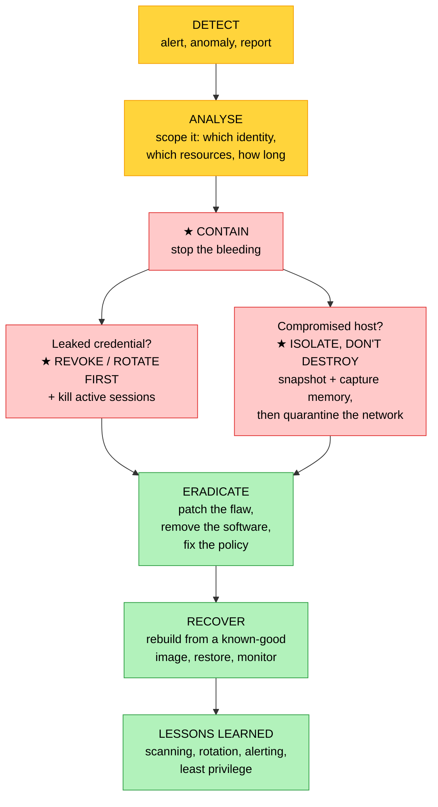

# Objective 6.3 — Given a scenario, troubleshoot security issues

> **Domain 6.0 — Troubleshooting (12% of exam)** · Exam CV0-004 V4 · Objectives doc v5.0
> **Status:** Exam-ready · **Version:** 2.0 (enhanced) · Supersedes `full notes/Objective-6.3-Security-Troubleshooting.md`
> 🏁 **This is the final objective of the exam-ready set — 33 of 33.**

---

## 0. How to use this note

| Pass | What to read | Time |
|---|---|---|
| **1st (learn)** | Sections 1 → 7 in order | ~55 min |
| **2nd (drill)** | ★ Section 2.1 (root cause vs symptom) + Section 2.3 (response order) + Section 8 (the confusable pairs) | ~20 min |
| **3rd (test)** | Section 12 (practice) + Section 13 (PBQ drills) | ~30 min |
| **Exam eve** | Section 14 (60-second recall sheet) only | ~5 min |

> 📌 **The distinguishing skill here is naming the ROOT CAUSE, not the symptom.** Security incidents form a chain: a leaked credential leads to unauthorized access, which leads to privilege escalation, which leads to a crypto-miner. Every link is technically true, and the exam wants the **first** one. Section 2.1 is the whole objective in one diagram.

---

## 1. Official objective coverage

> **6.3 Given a scenario, troubleshoot security issues.**
> - Cipher suite deprecations
> - **Authorization issues**
>   - Privilege escalation
>   - Unauthorized access
> - **Authentication issues**
>   - Leaked credentials
> - Software vulnerability issues
> - Unauthorized software

### 1.1 What the verb tells you

**"Given a scenario"** — incident in, root cause and correct response out. Expect **"what happened?"** and, just as often, **"what should you do FIRST?"** The second question type is where candidates lose marks, because the intuitive answer is usually the wrong order.

> 💡 **Note on ordering:** CompTIA lists *authorization* before *authentication*. This note covers **authentication first**, because you must prove who you are before anything decides what you may do — and the exam's favourite distinction depends on getting that sequence straight. The content is identical; only the reading order differs.

### 1.2 Coverage checklist

- [ ] ★ I can name the **root cause** rather than the downstream symptom
- [ ] ★ I know **authentication = who you are**; **authorization = what you may do**
- [ ] ★ I know **privilege escalation** is gaining rights **above** what was granted — and the difference from an over-permissive policy
- [ ] I know **vertical vs horizontal** escalation
- [ ] ★ I know the response order — **contain first, and preserve evidence before destroying anything**
- [ ] ★ I know that for leaked credentials the **first action is to revoke/rotate**
- [ ] I know which cipher suites and TLS versions are **deprecated**, and which are current
- [ ] I know **cipher deprecation** vs **protocol incompatibility** (6.2)
- [ ] I know **software vulnerability** (a flaw in approved software) vs **unauthorized software** (software that should not be there)
- [ ] I know the detection signals — impossible travel, off-hours API calls, failed-auth spikes, unexplained CPU

---

## 2. The core mental model

### 2.1 ★ The attack chain — root cause vs symptom

```text
╔═══════════════════════════════════════════════════════════════════════╗
║  A SINGLE INCIDENT USUALLY TOUCHES EVERY CATEGORY IN THIS OBJECTIVE.  ║
║  ★ THE EXAM WANTS THE FIRST LINK, NOT THE LAST.                       ║
╠═══════════════════════════════════════════════════════════════════════╣
║                                                                       ║
║   ENTRY (the root cause — pick ONE)                                   ║
║   ┌───────────────────────┬───────────────────────┐                   ║
║   │ ★ LEAKED CREDENTIAL   │ ★ SOFTWARE            │                   ║
║   │   key in a public repo│   VULNERABILITY       │                   ║
║   │   phishing · hardcoded│   unpatched CVE       │                   ║
║   │   → AUTHENTICATION    │   → exploit/RCE       │                   ║
║   └───────────┬───────────┴───────────┬───────────┘                   ║
║               └───────────┬───────────┘                               ║
║                           ▼                                           ║
║               UNAUTHORIZED ACCESS        ← reaching what it shouldn't ║
║                           │                                           ║
║                           ▼                                           ║
║               PRIVILEGE ESCALATION       ← gaining MORE rights        ║
║                           │                                           ║
║                           ▼                                           ║
║               UNAUTHORIZED SOFTWARE      ← the miner, the backdoor    ║
║                                            (the SYMPTOM you SEE)      ║
╠═══════════════════════════════════════════════════════════════════════╣
║  ★ YOU DETECT THE BOTTOM. YOU MUST REPORT THE TOP.                    ║
║    "A miner is running" is what you SAW.                              ║
║    "A leaked access key" is what HAPPENED.                            ║
║  ★ If you fix only the symptom, the attacker walks back in.           ║
╚═══════════════════════════════════════════════════════════════════════╝
```

### 2.2 ★ Authentication vs authorization

| | **Authentication (AuthN)** | **Authorization (AuthZ)** |
|---|---|---|
| Question | ★ **"Who are you?"** | ★ **"What may you do?"** |
| Proves | Identity | Permission |
| Mechanisms | Passwords, MFA, certificates, keys, tokens, SSO/SAML/OIDC | Policies, roles, RBAC/ABAC, resource policies |
| Failure looks like | Cannot log in · token rejected · **credentials stolen and reused** | Logged in successfully, then **does or reaches too much** |
| HTTP code (5.3, 6.2) | ★ **401 Unauthorized** | ★ **403 Forbidden** |
| Fix | Rotate credentials · enforce MFA · shorten token lifetimes · federate | **Least privilege** · scope roles · remove wildcards |

> ★ **The tell:** if the attacker **got in as someone**, start with authentication. If they were **already legitimately in** and did too much, it is authorization.

### 2.3 ★ Response order — what to do FIRST



| ★ Principle | Why it is tested |
|---|---|
| ★ **Contain before you investigate deeply** | Every minute of active abuse widens the damage. Revoking a key takes seconds; a full forensic analysis takes days |
| ★ **Revoking the credential comes before rotating it everywhere else** | An attacker holding a valid key is an ongoing breach, not a finding |
| ★ **Isolate, do not terminate** | ★ Terminating a compromised instance **destroys the evidence** — memory, running processes, and attacker artefacts. **Snapshot the volume and capture memory first**, then isolate it on the network |
| ★ **Fix the entry vector, not just the payload** | Deleting the miner without rotating the leaked key means it returns within hours |
| **Rebuild rather than clean** | A compromised host should be replaced from a known-good image, not disinfected in place |

---

## 3. Cipher suite deprecations

| | |
|---|---|
| **Definition** | A weak **encryption algorithm, hash, or TLS version** has been retired by a provider or standards body, so clients still offering only the old suite can no longer connect. |
| **What a cipher suite is** | The negotiated bundle used for a TLS session: **key exchange** (how the session key is agreed) + **authentication** (the certificate algorithm) + **bulk encryption** (protecting the data) + **MAC/hash** (integrity) |
| **★ Deprecated — recognise these** | ★ **SSL 2.0, SSL 3.0, TLS 1.0, TLS 1.1** · **RC4** · **DES and 3DES** · **MD5** and **SHA-1** · **NULL** and **EXPORT-grade** ciphers · static RSA key exchange (no forward secrecy) |
| **★ Current — recognise these** | ★ **TLS 1.2 and TLS 1.3** · **AES-GCM** and **ChaCha20-Poly1305** · **SHA-256** and above · **ECDHE** key exchange, which provides ★ **perfect forward secrecy** so a compromised long-term key cannot decrypt past sessions |
| **Why the retirement happens** | Demonstrated cryptographic weaknesses and **downgrade attacks** (POODLE, BEAST, and similar) let an attacker force the weakest mutually supported suite. Compliance regimes such as **PCI DSS** mandate the removals (4.2) |
| **Symptoms** | ★ **Handshake failures on the announced date**, affecting **only** legacy clients while modern ones are unaffected · "no cipher in common" · "unsupported protocol" · a partner or embedded device (POS terminal, IoT sensor, appliance) suddenly cannot connect |
| **Fix** | ★ **Upgrade the client** to negotiate TLS 1.2+ with modern ciphers. Weakening the server to accommodate the old client re-introduces the vulnerability and usually breaks compliance |
| **Prevent** | Inventory client TLS capability **before** the cutoff · monitor negotiated protocol versions in access logs · track deprecation announcements (3.4) · test against the new minimum early |
| **★ Distinguish** | ★ **Cipher deprecation** = the suite was removed **for everyone**, on a date, and no setting of yours restores it. **Protocol incompatibility (6.2)** = **you** tightened your own policy and could relax it. ★ **The test: could you fix it by changing your own configuration?** |
| **Exam triggers** | "on the announced cutoff date", "TLS 1.0 disabled", "RC4 removed", "no cipher in common", "only legacy clients fail", "PCI requires disabling" |

---

## 4. Authentication issues

### 4.1 ★ Leaked credentials

| | |
|---|---|
| **Definition** | A secret — password, API key, token, certificate, or SSH key — has been **exposed** and is available for abuse. |
| **★ Where they leak from** | ★ **Public code repositories** (the single most common) · **container image layers** — a secret deleted in a later layer is still readable in the earlier one · CI/CD build **logs** · hardcoded configuration and `.env` files · client-side JavaScript or mobile app bundles · **phishing** · breach dumps reused via **credential stuffing** · ★ **the instance metadata endpoint `169.254.169.254`** reached through an **SSRF** flaw (4.6) · shared accounts and unrotated long-lived keys |
| **★ Detection signals** | ★ **Impossible travel** — logins from two distant locations too close together · access from an **unfamiliar country or IP** · activity **outside normal working hours** · API calls the identity has never made before · sudden enumeration or reconnaissance calls · a spike in **failed** authentications preceding a success (brute force or **password spraying**) · **MFA fatigue** — repeated push prompts until the user accepts |
| **★ FIRST response** | ★ **Revoke or disable the credential immediately, and invalidate active sessions and assumed-role tokens.** A rotated key does not help if the attacker's existing session is still live. Only then investigate scope |
| **Then** | Audit the logs for everything that credential did · assess what data was reached · scan all repositories and image history for other secrets · notify per your breach obligations (4.2) |
| **★ Prevent** | ★ **Eliminate long-lived credentials** — use short-lived, automatically rotated identities (instance roles, workload identity federation, OIDC in CI/CD) · a **secrets manager**, never source control · **pre-commit secret scanning** and repository scanning · **enforce MFA** · shorten token lifetimes (4.3, 4.4) |
| **Exam triggers** | "key found in a public repository", "credentials used from an unfamiliar IP at 3 a.m.", "impossible travel", "hardcoded secret", "the same password appeared in a breach dump" |

### 4.2 Other authentication failures

| Failure | Symptom | Fix |
|---|---|---|
| **MFA not enforced** | Privileged logins succeed with a password alone | Enforce MFA, especially for administrative and break-glass accounts |
| ★ **Clock skew** | ★ SSO/SAML assertions and Kerberos tickets rejected, certificates "not yet valid" — while the network is perfect | ★ **Fix NTP** (6.2). Assertions carry tight validity windows |
| **Expired certificate or secret** | Sudden, total failure at a precise moment for everyone | Renew; monitor expiry dates and automate rotation |
| **Broken federation trust** | SSO fails after an identity-provider change or certificate rotation | Re-establish the trust and update the signing certificate |
| **Shared or orphaned accounts** | Actions cannot be attributed to a person; a departed employee's account still works | Individual accounts; deprovisioning tied to HR offboarding (3.4, 4.3) |
| **Credential stuffing / spraying** | High volume of failed logins across many accounts | Rate limiting, lockout, MFA, impossible-travel detection |

---

## 5. Authorization issues

### 5.1 ★ Privilege escalation

| | |
|---|---|
| **Definition** | ★ An identity **obtains rights beyond those it was granted**. |
| **★ Vertical escalation** | ★ Moving **up** — a standard user or service becomes an administrator |
| **★ Horizontal escalation** | ★ Moving **sideways** — accessing **another user's** data at the same privilege level (for example, changing an ID in a URL to read someone else's record — *broken object-level authorization*, 4.4) |
| **★ How it happens in the cloud** | ★ A permission that lets an identity **grant itself more** — attaching a policy to itself, passing a privileged role to a resource it controls, or creating credentials for a more privileged identity · assuming a role whose **trust policy is too broad** · ★ **a container running as root or as a privileged container escaping to the host** (1.6, 4.4) · exploiting a local flaw such as a misconfigured `sudo` rule or a setuid binary · exploiting a software vulnerability that yields elevated code execution |
| **★ Distinguish from over-permissive policy** | ★ **A role that was *granted* `*` from the start is excessive privilege — a violation of least privilege.** Escalation is *acquiring* rights you were never given. Both sit under **authorization issues**, and an over-permissive policy is usually what **makes** escalation possible — but naming them precisely matters when a question contrasts the two |
| **Detection** | Alerts on permission-changing API calls · a principal using an action for the first time · new administrator or role creation · unexpected role assumption |
| **Fix** | ★ **Least privilege** — remove wildcards, scope to specific actions and resources · restrict the permissions that allow self-granting · tighten role trust policies · never run containers as root or privileged · **just-in-time / time-bound** elevation with approval · separate duties so no single identity can both grant and use a permission |
| **Exam triggers** | "gained administrator rights", "attached a policy to their own role", "escaped the container to the host", "a standard user performed administrative actions", "read another customer's records" |

### 5.2 Unauthorized access

| | |
|---|---|
| **Definition** | An identity — internal or external — **reaches a resource it should not**. |
| **★ How it happens** | ★ **Publicly exposed storage** — a bucket or share readable by anyone, the classic cloud breach · a resource policy granting access to a **wildcard principal** or an unintended external account · **overly broad network exposure** — a database with a public endpoint or a management port open to the internet (0.0.0.0/0) · **missing tenant isolation**, so one customer reads another's data · an insider accessing records outside their role · a stale grant left after a project ended |
| **★ Detection** | Access-analysis tooling that reports resources shared externally or publicly · access from unexpected principals · reads of sensitive data by identities that never touched it before · data-egress spikes |
| **Fix** | Remove the public or external grant · enable account-level **block-public-access** style guardrails · restrict network exposure to private endpoints · apply least privilege at the **resource** policy, not just the identity policy · encrypt and tokenise sensitive data so exposure is less damaging (4.4) |
| **★ Distinguish** | ★ **Unauthorized access** = an identity reaching a **resource**. **Privilege escalation** = an identity gaining **rights**. **Leaked credentials** = the **means** an outsider used to become an identity at all |
| **Exam triggers** | "publicly readable bucket", "wildcard principal", "an external account can read", "another tenant's data was visible", "an employee accessed records unrelated to their role" |

---

## 6. Software vulnerability issues

| | |
|---|---|
| **Definition** | A **known flaw in software you are legitimately running** — application code, a library, an operating system package, or a container base image — that an attacker can exploit. |
| **★ The tell** | ★ **The software is approved and expected. The problem is that it is *defective or unpatched*** |
| **Vocabulary (4.1)** | ★ **CVE** — the identifier for a *specific* vulnerability · **CWE** — the *class* of weakness (for example, injection or buffer overflow) · **CVSS** — the severity score, 0.0–10.0, used to prioritise · **zero-day** — no patch exists yet |
| **Where they hide** | Direct dependencies **and transitive ones** — the library your library uses · outdated base images · unpatched OS packages · abandoned components with no maintainer · **firmware and appliances** |
| **★ Fix, in order of preference** | ★ **1. Patch or upgrade** the component and rebuild the image · **2. Mitigate** — disable the affected feature or block the exploit path · **3. Apply a compensating control** — a **WAF rule as virtual patching**, network restriction, or runtime protection — when patching cannot happen immediately · **4. Isolate** the system if none of the above is possible |
| **★ After an exploited vulnerability** | ★ **Patching alone is not enough.** Assume anything reachable was compromised — **rotate every secret the host could access**, review what the attacker did, and rebuild from a clean image |
| **Prevent** | ★ **Scanning in CI/CD** — SCA for dependencies, image scanning before promotion (5.2) · an **SBOM** so you can answer "are we affected?" within minutes of a disclosure · a patch cadence with defined SLAs by severity (3.4) · reduce the attack surface by using minimal base images |
| **★ Distinguish** | ★ **Software vulnerability** = **approved** software with a **flaw**. **Unauthorized software** = software that **should not be there at all** |
| **Exam triggers** | "a known CVE", "CVSS 9.8", "unpatched library", "the vulnerability was disclosed months ago", "remote code execution in a dependency", "the base image contains a critical finding" |

---

## 7. Unauthorized software

| | |
|---|---|
| **Definition** | Any program, container, agent, or workload running in the environment that was **never approved**. |
| **★ Three distinct flavours** | ★ **Shadow IT** — a well-meaning employee installing an unapproved but benign tool, bypassing change control · ★ **Malware** — a backdoor, ransomware, or remote-access tool placed by an attacker · ★ **Cryptojacking** — hijacked compute mining cryptocurrency, the most common cloud case (4.6) |
| **★ Detection signals** | ★ **Unexplained sustained CPU or GPU utilisation** — the classic cryptojacking signature, often with **a cloud bill that rises with no business reason** · a process or binary matching no deployment manifest · outbound connections to mining pools or unknown destinations · a container image from an **untrusted registry** · **configuration drift** from the approved baseline · instances launched in regions you do not use (4.6) |
| **★ FIRST response** | ★ **Isolate the host — do not terminate it.** Terminating destroys the memory, running processes, and artefacts you need to determine how it got in. **Snapshot the volume and capture memory first**, then remove network access |
| **Then** | ★ **Find the entry vector** — almost always a **leaked credential** or an **exploited vulnerability**. Fix that, or it recurs · rotate every secret the host could reach · rebuild from a known-good image rather than cleaning in place |
| **★ Prevent** | ★ **Allowlisting beats blocklisting** — permit only what is approved, rather than chasing what is not · **signed images from private registries only** · **admission control** rejecting non-compliant workloads · endpoint detection and runtime protection · **drift detection** against the baseline (2.4) · least privilege, so a compromise cannot deploy anything |
| **★ Distinguish** | ★ **Unauthorized software** is a **symptom** far more often than a root cause. Name it as the cause only when the scenario truly is shadow IT with no compromise behind it |
| **Exam triggers** | "unknown process consuming 100% CPU", "an unexpected cost increase with no traffic increase", "a container from an unknown registry", "software not in any manifest", "an employee installed an unapproved tool" |

---

## 8. ★ The confusable pairs

```text
   ┌──────────────────────────────────────────────────────────────────┐
   │ AUTHENTICATION  vs  AUTHORIZATION                                │
   │   "WHO are you?" (401)  vs  "What may you DO?" (403)             │
   │   Got in AS someone → AuthN. Already in, did too much → AuthZ.   │
   ├──────────────────────────────────────────────────────────────────┤
   │ PRIVILEGE ESCALATION  vs  UNAUTHORIZED ACCESS                    │
   │   Gained RIGHTS it never had  vs  Reached a RESOURCE it shouldn't│
   │   ★ escalation = the IDENTITY changed level                      │
   │     unauthorized access = the RESOURCE was reachable             │
   ├──────────────────────────────────────────────────────────────────┤
   │ PRIVILEGE ESCALATION  vs  EXCESSIVE PRIVILEGE                    │
   │   ACQUIRED rights beyond the grant  vs  GRANTED too much from    │
   │   the start (a least-privilege violation)                        │
   │   ★ Both are AUTHORIZATION issues; the over-broad policy is      │
   │     usually what MAKES escalation possible.                      │
   ├──────────────────────────────────────────────────────────────────┤
   │ LEAKED CREDENTIALS  vs  SOFTWARE VULNERABILITY                   │
   │   Attacker used a valid SECRET  vs  exploited a code FLAW        │
   │   ★ FIX: revoke/rotate the secret  vs  patch the component       │
   │   Both are ENTRY vectors — both are legitimate ROOT causes.      │
   ├──────────────────────────────────────────────────────────────────┤
   │ SOFTWARE VULNERABILITY  vs  UNAUTHORIZED SOFTWARE                │
   │   ★ APPROVED software that is BROKEN                             │
   │     vs  software that SHOULD NOT BE THERE                        │
   │   ★ FIX: PATCH it  vs  REMOVE it (and find how it arrived)       │
   ├──────────────────────────────────────────────────────────────────┤
   │ CIPHER DEPRECATION  vs  PROTOCOL INCOMPATIBILITY (6.2)           │
   │   ★ ONE QUESTION: could YOUR OWN setting restore it?             │
   │     NO → DEPRECATION (provider/standard removed it, on a date)   │
   │     YES → INCOMPATIBILITY (you tightened your own policy)        │
   └──────────────────────────────────────────────────────────────────┘
```

### 8.1 Naming the root cause — worked examples

| Scenario | ❌ The symptom | ★ The root cause |
|---|---|---|
| A key from a public repo was used to launch mining instances | "Unauthorized software" | ★ **Leaked credentials** |
| An unpatched library gave RCE, then a backdoor was installed | "Unauthorized software" | ★ **Software vulnerability** |
| A stolen key read a private bucket | "Unauthorized access" | ★ **Leaked credentials** |
| An over-broad role let a compromised account delete production | "Unauthorized access" | ★ **Authorization — excessive privilege** (and the credential compromise, if stated) |
| A developer installed an unapproved productivity tool | — | ★ **Unauthorized software** (genuinely the cause — shadow IT) |
| Legacy terminals failed on the day TLS 1.0 was disabled | "Authentication failure" | ★ **Cipher suite deprecation** |
| SSO assertions rejected while the network is healthy | "Authentication failure" | ★ **Clock skew — NTP** (6.2) |

---

## 9. ★ Symptom → cause → first response

| Symptom | Root cause | ★ FIRST response |
|---|---|---|
| Access key found in a public repository | **Leaked credentials** | ★ **Revoke the key and kill active sessions**, then audit its activity |
| API calls from an unfamiliar country at 3 a.m. | **Leaked credentials** | Revoke, invalidate sessions, scope the blast radius |
| Impossible travel between two logins | **Leaked credentials** | Disable the account, force re-authentication with MFA |
| Spike in failed logins across many accounts | **Credential stuffing / spraying** | Rate limit and lock out; enforce MFA |
| Privileged logins succeeding without MFA | **Authentication weakness** | Enforce MFA on privileged accounts |
| SSO/Kerberos rejected, network perfect, certs "not yet valid" | ★ **Clock skew — NTP** | Resynchronise time (6.2) |
| A standard user performed administrative actions | **Privilege escalation** | Revoke the elevated rights; restrict self-granting permissions |
| A container escaped to the host | **Privilege escalation** | Isolate the host; stop running privileged/root containers |
| A user changed an ID in a URL and read another customer's record | **Horizontal escalation / broken object-level authorization** | Enforce per-object authorization checks (4.4) |
| A storage bucket is readable by anyone on the internet | **Unauthorized access** | Remove public access; enable account-wide guardrails |
| A resource is shared with an unintended external account | **Unauthorized access** | Revoke the external grant |
| A database has a public endpoint | **Unauthorized access (network exposure)** | Move to private endpoints; restrict the security group |
| A known CVE with a published patch was exploited | **Software vulnerability** | Patch or apply a compensating control; ★ **then rotate every secret the host could reach** |
| A scanner reports a critical CVE in the base image | **Software vulnerability** | Rebuild from a patched base and redeploy |
| An unknown process at 100% CPU; costs rising with no traffic | **Unauthorized software (cryptojacking)** | ★ **Snapshot and capture memory, then isolate** — do not terminate |
| A container from an unknown registry is running in production | **Unauthorized software** | Remove it; enforce signed images from private registries |
| An employee installed an unapproved tool | **Unauthorized software (shadow IT)** | Remove it; address the need through change control |
| Legacy clients fail handshakes on an announced date | **Cipher suite deprecation** | Upgrade the clients — do **not** re-enable the weak suite |
| "No cipher in common" from a partner integration | **Cipher suite deprecation** | Have the partner move to TLS 1.2+ with modern ciphers |

---

## 10. Exam traps & distractor patterns

| # | Trap | The truth |
|---|---|---|
| 1 | "A crypto-miner is running, so the cause is unauthorized software" | ⚠️ ★ That is the **symptom**. The cause is the **leaked credential or vulnerability** that let it in |
| 2 | "Delete the miner and you are done" | ❌ ★ **Fix the entry vector** or it returns within hours |
| 3 | "Terminate the compromised instance immediately" | ❌ ★ That **destroys the evidence**. **Snapshot and capture memory, then isolate** |
| 4 | "Investigate thoroughly before revoking the leaked key" | ❌ ★ **Contain first.** An active key is an ongoing breach |
| 5 | "Rotate the key — that is enough" | ⚠️ Also **invalidate existing sessions and assumed-role tokens**, or the live session continues |
| 6 | "Re-enable the old cipher so the partner can connect" | ❌ ★ Re-introduces the vulnerability and breaks compliance. **Upgrade the client** |
| 7 | "Authentication and authorization are interchangeable" | ❌ **AuthN = who you are (401). AuthZ = what you may do (403)** |
| 8 | "A role granted `*` from day one is privilege escalation" | ⚠️ Precisely, that is **excessive privilege**. **Escalation** is *acquiring* rights beyond the grant — though both are authorization issues |
| 9 | "Unauthorized access and privilege escalation are the same" | **Access** = reached a **resource**. **Escalation** = gained **rights** |
| 10 | "A vulnerable dependency is unauthorized software" | ❌ It is **approved software with a flaw** → **patch it**. Unauthorized software should not be there at all → **remove it** |
| 11 | "Patching the exploited CVE closes the incident" | ❌ ★ Assume compromise — **rotate the secrets that host could reach** and rebuild |
| 12 | "SSO suddenly fails, so the identity provider is breached" | ⚠️ Check **clock skew** first — assertions have tight validity windows (6.2) |
| 13 | "Blocklist the known bad software" | ★ **Allowlisting** is stronger — permit only what is approved |
| 14 | "MFA on the admin console is enough" | Programmatic **API keys** bypass console MFA entirely — that is why short-lived roles matter |
| 15 | "The bucket had no credentials attached, so it was not a breach" | ❌ **Public exposure IS unauthorized access** — no credential is needed |
| 16 | "Clean the malware off the server and return it to service" | ★ **Rebuild from a known-good image.** You cannot prove a compromised host is clean |
| 17 | "It was an internal user, so it is not unauthorized access" | ❌ **Insiders reaching data outside their role is unauthorized access** |

**Disambiguation drill:**

| Pair | The deciding question |
|---|---|
| **AuthN vs AuthZ** | Did they get in **as someone**, or were they already in? |
| **Escalation vs unauthorized access** | Did the **identity's rights** change, or was a **resource** reachable? |
| **Escalation vs excessive privilege** | Did they **acquire** it, or were they **given** it? |
| **Leaked credential vs vulnerability** | Did the attacker use a **valid secret** or a **code flaw**? |
| **Vulnerability vs unauthorized software** | Should the software **be there**? |
| **Cipher deprecation vs incompatibility** | ★ Could **your own setting** restore it? |
| **Root cause vs symptom** | ★ **What was the FIRST link in the chain?** |

---

## 11. Keyword → answer trigger table

| If you see… | Think |
|---|---|
| key in a public repo · hardcoded secret · impossible travel · unfamiliar IP at 3 a.m. · phishing · credential stuffing | ★ **Leaked credentials** |
| logins succeed without MFA · shared account · orphaned account | **Authentication weakness** |
| SSO/Kerberos rejected · "certificate not yet valid" · network fine | ★ **Clock skew — NTP** |
| gained admin rights · attached a policy to itself · container escaped to the host · sudo misconfiguration | ★ **Privilege escalation** |
| read another user's record by changing an ID | **Horizontal escalation / broken object-level authorization** |
| public bucket · wildcard principal · shared with an external account · database with a public endpoint · another tenant's data | ★ **Unauthorized access** |
| CVE · CVSS 9.8 · unpatched library · vulnerable base image · RCE in a dependency | ★ **Software vulnerability** |
| unknown process at 100% CPU · costs rising with no traffic · mining pool traffic · image from an untrusted registry · not in any manifest | ★ **Unauthorized software** |
| employee installed an unapproved tool, no compromise | **Unauthorized software (shadow IT)** |
| TLS 1.0/1.1 disabled · RC4 · 3DES · SHA-1 · "no cipher in common" · on the announced date · PCI requirement | ★ **Cipher suite deprecation** |
| snapshot before acting · preserve memory · chain of custody | ★ **Evidence preservation — isolate, don't terminate** |
| revoke first, investigate second | ★ **Containment order** |

---

## 12. Practice questions

<details>
<summary><b>Q1.</b> An access key committed to a public repository is being used to make API calls from an unfamiliar country. What should be done FIRST?</summary>

A. Open a forensic investigation to determine the full scope · **B. Revoke or disable the key and invalidate active sessions** · C. Rotate the key in the application configuration · D. Notify regulators

**Correct: B.** ★ **Contain first.** While a valid key is in the attacker's hands the breach is ongoing; revocation takes seconds and investigation takes days. ★ Note that revoking alone is insufficient — **existing sessions and assumed-role tokens must also be invalidated**.
- **A wrong:** Correct, but not first — investigate after the bleeding stops.
- **C wrong:** Rotating for your own app without revoking the old key leaves the attacker's access intact.
- **D wrong:** Notification obligations follow containment and scoping.
</details>

<details>
<summary><b>Q2.</b> Instances show sustained 100% CPU from a process matching no deployment manifest, and cloud costs have risen sharply without any increase in traffic. What is the MOST likely root cause to report?</summary>

A. Unauthorized software is the root cause · **B. Unauthorized software is the symptom; the root cause is the entry vector — typically leaked credentials or an exploited vulnerability** · C. A sizing issue · D. Cipher deprecation

**Correct: B.** ★ **Cryptojacking is what you detected, not what happened.** Removing the miner without closing the entry path means it returns. Investigate how the attacker got in.
- **A wrong:** True at surface level, but the exam wants the first link in the chain.
- **C wrong:** Sizing does not create unknown processes or mining traffic.
- **D wrong:** Unrelated to encryption.
</details>

<details>
<summary><b>Q3.</b> A compromised cloud instance is discovered running a backdoor. What is the BEST immediate action?</summary>

A. Terminate the instance immediately · **B. Snapshot the volume, capture memory, then isolate it from the network** · C. Reboot it · D. Run antivirus and return it to service

**Correct: B.** ★ **Isolate, do not destroy.** Terminating erases memory, running processes, and attacker artefacts — the evidence needed to determine the entry vector and scope. Isolation stops the harm while preserving the evidence.
- **A wrong:** Destroys the evidence and leaves you unable to explain the incident.
- **C wrong:** Rebooting clears volatile memory and may not remove persistence.
- **D wrong:** ★ A compromised host should be **rebuilt from a known-good image**, never cleaned and trusted.
</details>

<details>
<summary><b>Q4.</b> On an announced date, a provider disables TLS 1.0 and RC4. Legacy payment terminals now fail with "no cipher in common," while modern clients are unaffected. What is the cause and the correct fix?</summary>

**A. Cipher suite deprecation — upgrade the terminals to TLS 1.2+ with modern ciphers** · B. Cipher suite deprecation — re-enable RC4 on the load balancer · C. Authentication failure — reset the terminal credentials · D. Unauthorized access — audit the terminals

**Correct: A.** ★ The suite was retired **for everyone, on a date**. Only the clients still offering it are affected.
- **B wrong:** ★ Re-enabling a weak cipher reintroduces the vulnerability and typically breaks **PCI DSS** compliance.
- **C/D wrong:** No credential or access-control issue is described.
</details>

<details>
<summary><b>Q5.</b> Which statement BEST distinguishes authentication from authorization?</summary>

**A. Authentication proves who you are (401 Unauthorized); authorization determines what you may do (403 Forbidden)** · B. They are the same control · C. Authentication happens after authorization · D. Authorization proves identity

**Correct: A.** ★ The status codes cement it: **401 = "who are you?"; 403 = "I know you, and no."**
- **B wrong:** They are distinct controls that fail in distinct ways.
- **C wrong:** You must be authenticated before anything can authorize you.
- **D wrong:** Reversed.
</details>

<details>
<summary><b>Q6.</b> A user with a standard role discovers they can attach an administrator policy to their own role, and does so. How is this BEST classified?</summary>

**A. Privilege escalation (vertical)** · B. Unauthorized access · C. Leaked credentials · D. Unauthorized software

**Correct: A.** ★ The identity **acquired rights beyond what it was granted**, moving **up** a privilege level. The fix is restricting permission-granting actions and separating duties.
- **B wrong:** Unauthorized access is reaching a **resource**; here the identity's **rights** changed.
- **C wrong:** No secret was exposed; a legitimate identity abused a permission.
- **D wrong:** No rogue program is involved.
</details>

<details>
<summary><b>Q7.</b> A user modifies a record ID in a URL and successfully retrieves another customer's data. How is this classified?</summary>

A. Vertical privilege escalation · **B. Horizontal privilege escalation — broken object-level authorization** · C. Cipher deprecation · D. Software vulnerability only

**Correct: B.** ★ The user moved **sideways** to another user's data at the **same** privilege level. The fix is enforcing a per-object authorization check on every request (4.4).
- **A wrong:** No elevation to a higher privilege level occurred.
- **C wrong:** Unrelated to encryption.
- **D wrong:** It is an authorization design flaw rather than a CVE-tracked defect.
</details>

<details>
<summary><b>Q8.</b> A storage bucket containing customer records is configured so that any internet user can read it. No credentials were stolen. How is this classified?</summary>

A. Leaked credentials · **B. Unauthorized access** · C. Privilege escalation · D. Unauthorized software

**Correct: B.** ★ **Public exposure is unauthorized access — no credential is required.** Remove the public grant and enable account-wide public-access guardrails.
- **A wrong:** Nothing was stolen; the resource was simply open.
- **C wrong:** No identity's rights changed.
- **D wrong:** No rogue program is involved.
</details>

<details>
<summary><b>Q9.</b> An internet-facing application is exploited through a dependency with a published CVE and an available patch. After patching, what else is REQUIRED?</summary>

A. Nothing — patching closes it · **B. Assume compromise: rotate every secret the host could access, review what the attacker did, and rebuild from a clean image** · C. Re-enable the old cipher suite · D. Terminate the account

**Correct: B.** ★ **Patching closes the door; it does not evict anyone already inside.** Anything the compromised host could reach must be treated as exposed.
- **A wrong:** This is the most commonly missed step in incident scenarios.
- **C wrong:** Unrelated and harmful.
- **D wrong:** Disproportionate and does not address the exposure.
</details>

<details>
<summary><b>Q10.</b> Which BEST distinguishes a software vulnerability from unauthorized software?</summary>

**A. A software vulnerability is a flaw in software you approved and should patch; unauthorized software should not be present at all and should be removed** · B. They are the same · C. Vulnerabilities apply only to containers · D. Unauthorized software is always benign

**Correct: A.** ★ **"Should it be there?"** answers it — and the remediation differs completely: **patch** versus **remove and find how it arrived**.
- **B wrong:** Different causes and different fixes.
- **C wrong:** Vulnerabilities affect all software layers.
- **D wrong:** It ranges from benign shadow IT to ransomware.
</details>

<details>
<summary><b>Q11.</b> Single sign-on assertions are suddenly rejected across the organisation. Network connectivity is perfect and the identity provider reports no incident. What should be checked FIRST?</summary>

**A. Time synchronisation — SAML assertions and Kerberos tickets have narrow validity windows and fail on clock skew** · B. The bucket policies · C. The container registry · D. The TLS cipher suite

**Correct: A.** ★ **Clock skew breaks time-bounded security assertions** while leaving connectivity untouched — the same NTP cause covered in 6.2.
- **B/C wrong:** Neither affects authentication assertions.
- **D wrong:** A cipher problem would fail the handshake, not the assertion validation.
</details>

<details>
<summary><b>Q12.</b> Logs show hundreds of failed logins across many different accounts, each trying only a small number of common passwords, followed by one success. What occurred?</summary>

A. Privilege escalation · **B. Password spraying leading to a leaked/compromised credential** · C. Unauthorized software · D. Cipher deprecation

**Correct: B.** ★ **Spraying tries a few passwords across many accounts** to avoid lockout thresholds, unlike brute force which hammers one account. Enforce MFA, rate limiting, and lockout.
- **A wrong:** No rights were elevated in what is described.
- **C/D wrong:** Neither matches an authentication attack pattern.
</details>

<details>
<summary><b>Q13.</b> A container in production is running as root and is able to access the host filesystem. How is this BEST classified, and what is the fix?</summary>

**A. Privilege escalation — run containers as a non-root user, drop unnecessary capabilities, and disallow privileged containers** · B. Unauthorized software — remove the container · C. Leaked credentials — rotate secrets · D. Cipher deprecation

**Correct: A.** ★ A container reaching the host has **exceeded its intended privilege boundary**. The controls are non-root users, dropped capabilities, and admission policies rejecting privileged containers (1.6, 4.4).
- **B wrong:** The container is approved; its **privileges** are wrong.
- **C/D wrong:** Neither is involved.
</details>

<details>
<summary><b>Q14.</b> Which practice MOST effectively prevents leaked credentials from being usable?</summary>

**A. Replace long-lived static keys with short-lived, automatically rotated identities such as instance roles and OIDC federation** · B. Longer passwords · C. Storing keys in a private repository instead of a public one · D. Annual key rotation

**Correct: A.** ★ **A credential that expires in minutes has almost no value once leaked.** This is why workload identity federation replaces static keys in CI/CD.
- **B wrong:** Length does not help once a secret is exposed verbatim.
- **C wrong:** Private repositories still leak through clones, forks, insiders, and image layers.
- **D wrong:** Annual rotation leaves a year-long exposure window.
</details>

<details>
<summary><b>Q15.</b> A critical vulnerability is disclosed and no patch is yet available for a public-facing application. What is the BEST interim action?</summary>

A. Take no action until a patch exists · **B. Apply a compensating control — a WAF rule blocking the exploit path, restricted network access, or disabling the affected feature** · C. Rotate all user passwords · D. Re-enable legacy ciphers

**Correct: B.** ★ **Virtual patching** buys time when no vendor patch exists. Restricting exposure or disabling the affected feature achieves the same end.
- **A wrong:** Leaves a known-exploitable service exposed.
- **C wrong:** Credentials are not the vector here.
- **D wrong:** Actively harmful.
</details>

<details>
<summary><b>Q16.</b> Which control is MOST effective at preventing unauthorized software from running?</summary>

**A. Allowlisting — permitting only approved, signed software and images from trusted registries** · B. Blocklisting known malware signatures · C. Quarterly manual audits · D. Longer passwords

**Correct: A.** ★ **Allowlisting is a default-deny posture**; blocklisting is a perpetual chase that cannot cover unknown threats. Pair it with admission control and image signing.
- **B wrong:** Signature-based blocking misses novel and modified malware.
- **C wrong:** Too infrequent to prevent anything.
- **D wrong:** Unrelated to software execution.
</details>

<details>
<summary><b>Q17.</b> A resource policy grants access to a wildcard principal, and an external party reads sensitive data. Which two categories does this involve, and which is the root cause?</summary>

**A. Unauthorized access is the outcome; the root cause is the overly permissive resource policy — an authorization misconfiguration** · B. Leaked credentials · C. Software vulnerability · D. Unauthorized software

**Correct: A.** ★ **No credential was stolen and no software was flawed** — the resource was configured to permit anyone. Remove the wildcard and apply account-wide guardrails.
- **B wrong:** A wildcard principal requires no credential at all.
- **C/D wrong:** Neither is present.
</details>

<details>
<summary><b>Q18.</b> Which of the following is a DEPRECATED cipher or protocol that should no longer be accepted?</summary>

A. TLS 1.3 with AES-GCM · B. TLS 1.2 with ECDHE and AES-GCM · **C. TLS 1.0 with RC4** · D. ChaCha20-Poly1305

**Correct: C.** ★ **TLS 1.0 and RC4 are both retired** — TLS 1.0/1.1, SSL 2.0/3.0, RC4, DES/3DES, MD5, and SHA-1 are the set to recognise as deprecated.
- **A/B/D wrong:** All are current and recommended; **ECDHE** additionally provides **forward secrecy**.
</details>

<details>
<summary><b>Q19.</b> An employee installs an unapproved file-sharing application on a corporate workstation to make their work easier. There is no evidence of compromise. How is this classified?</summary>

A. Malware infection · **B. Unauthorized software — shadow IT** · C. Privilege escalation · D. Leaked credentials

**Correct: B.** ★ **This is the case where unauthorized software genuinely IS the root cause** — no attacker, no compromise, just software outside change control. It still expands the attack surface and may breach compliance.
- **A wrong:** Nothing indicates malicious code.
- **C/D wrong:** No rights were elevated and no secret was exposed.
</details>

<details>
<summary><b>Q20.</b> Which sequence correctly orders incident response?</summary>

A. Eradicate, contain, detect, recover · **B. Detect and analyse, contain, eradicate, recover, lessons learned** · C. Recover, detect, contain, eradicate · D. Contain, detect, recover, analyse

**Correct: B.** ★ **Containment comes before eradication** — stop the damage before you clean up, and preserve evidence throughout.
- **A/C/D wrong:** All invert the order; eradicating before containing lets the attacker persist while you work.
</details>

<details>
<summary><b>Q21.</b> A leaked API key was revoked, but the attacker's activity continues for another twenty minutes. What was missed?</summary>

**A. Active sessions and assumed-role tokens issued before revocation were not invalidated** · B. The key was not long enough · C. The cipher suite was deprecated · D. MFA was enabled

**Correct: A.** ★ **Revoking the credential does not automatically kill sessions already established with it.** Temporary tokens remain valid until they expire unless explicitly revoked — which is why short token lifetimes matter.
- **B wrong:** Key length is irrelevant to an already-exposed secret.
- **C/D wrong:** Neither explains continued access.
</details>

<details>
<summary><b>Q22.</b> An identity is granted a policy with full wildcard permissions on all resources from the day it is created. How is this BEST described?</summary>

**A. Excessive privilege — a least-privilege violation, and an authorization issue that enables escalation** · B. Privilege escalation, because the identity now has admin rights · C. Unauthorized access · D. Authentication failure

**Correct: A.** ★ **Escalation means acquiring rights beyond the grant.** Here the rights were **granted** — over-broadly. Both sit under authorization issues, and this over-permission is typically what **makes** later escalation possible.
- **B wrong:** Nothing was acquired beyond what was assigned.
- **C wrong:** No resource has been improperly reached yet.
- **D wrong:** Identity proof is not at issue.
</details>

<details>
<summary><b>Q23.</b> Two logins for the same account occur eleven minutes apart from cities on different continents. What does this indicate, and what should happen?</summary>

**A. Impossible travel indicating compromised credentials — disable the account, invalidate sessions, and require re-authentication with MFA** · B. Normal VPN behaviour; ignore it · C. Cipher deprecation · D. A sizing issue

**Correct: A.** ★ **Impossible travel is a primary credential-compromise signal.** Treat it as compromise until proven otherwise.
- **B wrong:** It warrants investigation even if a VPN eventually explains it.
- **C/D wrong:** Neither relates to authentication anomalies.
</details>

<details>
<summary><b>Q24.</b> Which action MOST reduces the impact of a future vulnerability disclosure?</summary>

**A. Maintaining an SBOM plus dependency and image scanning in the pipeline, so exposure can be determined immediately** · B. Disabling logging to reduce noise · C. Using only public container images · D. Extending patch cycles to reduce churn

**Correct: A.** ★ **The critical question after a disclosure is "are we affected, and where?"** An SBOM plus pipeline scanning answers it in minutes rather than weeks (4.1, 5.2).
- **B wrong:** Logging is essential to detection and forensics.
- **C wrong:** Untrusted public images increase supply-chain risk.
- **D wrong:** Slower patching increases exposure.
</details>

<details>
<summary><b>Q25.</b> An attacker exploited an unpatched CVE, escalated privileges through an over-permissive role, and deployed a crypto-miner. Which should be reported as the root cause?</summary>

**A. The software vulnerability — it was the initial entry vector** · B. The crypto-miner, because it caused the financial damage · C. The over-permissive role · D. Unauthorized access

**Correct: A.** ★ **Report the first link in the chain.** The escalation and the miner are consequences; the unpatched vulnerability is how the attacker got in. ★ The over-permissive role is a genuine **contributing** factor that must also be fixed — but it is not the entry point.
- **B wrong:** That is the most visible symptom, not the cause.
- **C wrong:** A contributing factor that amplified the damage.
- **D wrong:** A consequence of the exploitation.
</details>

---

## 13. PBQ-style drills

### Drill A — Symptom → root cause

| # | Scenario | Root cause? |
|---|---|---|
| 1 | Access key found in a public repository, now in use abroad | |
| 2 | Legacy terminals fail handshakes on the announced cutoff date | |
| 3 | A standard user attached an admin policy to their own role | |
| 4 | A bucket of customer data is readable by anyone on the internet | |
| 5 | An unpatched library with a published CVE was exploited for RCE | |
| 6 | An unknown binary at 100% CPU; costs rising, no traffic increase | |
| 7 | An employee installed an unapproved tool; no compromise found | |
| 8 | SSO assertions rejected everywhere; network perfect | |
| 9 | A user changed an ID in a URL and read another customer's record | |
| 10 | Two logins, eleven minutes apart, different continents | |

<details><summary>Answers</summary>

1 → **Leaked credentials** · 2 → **Cipher suite deprecation** · 3 → **Privilege escalation (vertical)** · 4 → **Unauthorized access** · 5 → **Software vulnerability** · 6 → **Unauthorized software — but report the entry vector as the root cause** · 7 → **Unauthorized software (shadow IT — genuinely the cause)** · 8 → **Clock skew / NTP** · 9 → **Horizontal escalation — broken object-level authorization** · 10 → **Leaked credentials (impossible travel)**
</details>

### Drill B — What do you do FIRST?

| # | Situation | First action? |
|---|---|---|
| 1 | A leaked key is actively being used | |
| 2 | A compromised instance is running a backdoor | |
| 3 | A critical CVE is disclosed with no patch available | |
| 4 | A bucket is found publicly readable | |
| 5 | A patched host was previously exploited | |

<details><summary>Answers</summary>

1 → ★ **Revoke/disable the key AND invalidate active sessions** · 2 → ★ **Snapshot the volume and capture memory, then isolate — do not terminate** · 3 → **Apply a compensating control (WAF rule, restrict access, disable the feature)** · 4 → **Remove public access, then assess what was exposed** · 5 → ★ **Rotate every secret the host could reach and rebuild from a clean image**
</details>

### Drill C — Which category?

| # | Description | Category? |
|---|---|---|
| 1 | Approved software containing a known flaw | |
| 2 | Software that should not be present at all | |
| 3 | An identity gained rights beyond its grant | |
| 4 | An identity reached a resource it should not | |
| 5 | A secret was exposed and reused | |
| 6 | A weak encryption suite was retired provider-wide | |

<details><summary>Answers</summary>

1 → **Software vulnerability — patch it** · 2 → **Unauthorized software — remove it and find the entry** · 3 → **Privilege escalation** · 4 → **Unauthorized access** · 5 → **Leaked credentials** · 6 → **Cipher suite deprecation**
</details>

### Drill D — Deprecated or current?

| # | Item | Which? |
|---|---|---|
| 1 | TLS 1.0 | |
| 2 | RC4 | |
| 3 | AES-GCM | |
| 4 | SHA-1 | |
| 5 | TLS 1.3 | |
| 6 | 3DES | |
| 7 | ECDHE | |
| 8 | SSL 3.0 | |

<details><summary>Answers</summary>

**Deprecated:** 1 (TLS 1.0), 2 (RC4), 4 (SHA-1), 6 (3DES), 8 (SSL 3.0)
**Current:** 3 (AES-GCM), 5 (TLS 1.3), 7 (ECDHE — provides **forward secrecy**)
</details>

### Drill E — Order the incident response

| Step | Action |
|---|---|
| ? | Rebuild from a known-good image and restore service |
| ? | Contain — revoke the credential or isolate the host |
| ? | Detect and analyse — scope the incident |
| ? | Lessons learned — add scanning, rotation, and least privilege |
| ? | Eradicate — patch the flaw, remove the software, fix the policy |

<details><summary>Answers</summary>

1 → **Detect and analyse** · 2 → ★ **Contain** · 3 → **Eradicate** · 4 → **Recover (rebuild)** · 5 → **Lessons learned**

★ **Containment precedes eradication** — and evidence is preserved before anything is destroyed.
</details>

---

## 14. 60-second recall sheet

```text
╔══════════════════════════════════════════════════════════════════════╗
║  6.3 — TROUBLESHOOT SECURITY ISSUES  ("Given a scenario")            ║
║  ★★ NAME THE ROOT CAUSE, NOT THE SYMPTOM.                            ║
║     THE CHAIN: LEAKED CRED or VULNERABILITY (entry)                  ║
║                → UNAUTHORIZED ACCESS → PRIV ESCALATION               ║
║                → UNAUTHORIZED SOFTWARE (what you SEE)                ║
║     ★ You DETECT the bottom. You REPORT the top.                     ║
╠══════════════════════════════════════════════════════════════════════╣
║ ★★ WHAT DO I DO FIRST? — CONTAIN, and PRESERVE EVIDENCE              ║
║   LEAKED KEY  → ★ REVOKE/DISABLE **AND KILL ACTIVE SESSIONS**        ║
║                  (rotating alone leaves the live session running)    ║
║   COMPROMISED HOST → ★ SNAPSHOT + CAPTURE MEMORY, **THEN ISOLATE**   ║
║                  ⚠⚠ NEVER TERMINATE — it DESTROYS THE EVIDENCE       ║
║   EXPLOITED CVE → patch, ★ THEN ROTATE EVERY SECRET IT COULD REACH   ║
║                  and REBUILD from a known-good image (never "clean") ║
║   ★ ALWAYS FIX THE ENTRY VECTOR or the attacker walks back in        ║
║   ORDER: DETECT/ANALYSE → ★ CONTAIN → ERADICATE → RECOVER → LESSONS  ║
╠══════════════════════════════════════════════════════════════════════╣
║ ★ AUTHENTICATION (401 "WHO are you?")                                ║
║   ★ LEAKED CREDENTIALS — the #1 entry vector                         ║
║     FROM: public repos · ★ container IMAGE LAYERS · CI logs ·        ║
║     .env · client-side code · phishing · credential stuffing ·       ║
║     ★ SSRF → 169.254.169.254 METADATA endpoint                       ║
║     SIGNALS: ★ IMPOSSIBLE TRAVEL · unfamiliar IP/country ·           ║
║     off-hours · never-seen API calls · failed-auth spike             ║
║     (SPRAYING = few passwords, MANY accounts, dodges lockout)        ║
║     ★ PREVENT: kill LONG-LIVED keys → SHORT-LIVED roles/OIDC ·       ║
║       secrets manager · pre-commit scanning · MFA                    ║
║   OTHER AUTHN: MFA not enforced · expired cert · shared/orphaned     ║
║     accounts · ★ CLOCK SKEW breaks SAML/Kerberos → FIX NTP (6.2)     ║
╠══════════════════════════════════════════════════════════════════════╣
║ ★ AUTHORIZATION (403 "I know you. NO.")                              ║
║   ★ PRIVILEGE ESCALATION = ACQUIRED rights ABOVE the grant           ║
║      VERTICAL = user → ADMIN  ·  HORIZONTAL = → ANOTHER USER'S data  ║
║      HOW: self-attach a policy · pass a privileged role · broad      ║
║      trust policy · ★ ROOT/PRIVILEGED CONTAINER ESCAPING TO HOST ·   ║
║      sudo/setuid flaw                                                ║
║      ⚠ A role GRANTED `*` on day one = EXCESSIVE PRIVILEGE, not      ║
║        escalation — but it's what MAKES escalation possible          ║
║   ★ UNAUTHORIZED ACCESS = reached a RESOURCE it shouldn't            ║
║      public bucket · WILDCARD PRINCIPAL · external account share ·   ║
║      public DB endpoint · cross-tenant · insider outside their role  ║
║      ⚠ PUBLIC EXPOSURE IS A BREACH — no credential needed            ║
║   ★ ESCALATION = the IDENTITY's RIGHTS changed                       ║
║     ACCESS    = the RESOURCE was reachable                           ║
╠══════════════════════════════════════════════════════════════════════╣
║ ★ SOFTWARE VULNERABILITY vs UNAUTHORIZED SOFTWARE                    ║
║   ★ ASK: "SHOULD THIS SOFTWARE BE HERE?"                             ║
║   VULNERABILITY  YES — approved but BROKEN → ★ PATCH IT              ║
║     CVE=the bug · CWE=the bug CLASS · CVSS=severity 0-10 ·           ║
║     zero-day=no patch yet · watch TRANSITIVE dependencies            ║
║     FIX ORDER: patch → mitigate → ★ COMPENSATING CONTROL             ║
║       (WAF = VIRTUAL PATCHING) → isolate                             ║
║     PREVENT: SCA + image scanning in CI · ★ SBOM ("are we affected?")║
║   UNAUTHORIZED   NO — shouldn't be here → ★ REMOVE + FIND THE ENTRY  ║
║     3 FLAVOURS: SHADOW IT (benign) · MALWARE · ★ CRYPTOJACKING       ║
║     SIGNAL: ★ 100% CPU + ★ COST RISES WITH NO TRAFFIC INCREASE ·     ║
║       no manifest · untrusted registry · baseline DRIFT              ║
║     PREVENT: ★ ALLOWLIST > blocklist · SIGNED images, private        ║
║       registries · admission control · drift detection               ║
╠══════════════════════════════════════════════════════════════════════╣
║ ★ CIPHER SUITE DEPRECATIONS                                          ║
║   ★ DEPRECATED: SSL 2.0/3.0 · TLS 1.0/1.1 · RC4 · DES/3DES ·         ║
║                 MD5 · SHA-1 · NULL/EXPORT                            ║
║   ★ CURRENT:    TLS 1.2/1.3 · AES-GCM · ChaCha20-Poly1305 ·          ║
║                 SHA-256+ · ★ ECDHE = PERFECT FORWARD SECRECY         ║
║   TELL: handshake fails ON THE ANNOUNCED DATE, ONLY legacy clients   ║
║         "no cipher in common" · PCI DSS mandates the removal         ║
║   ★ FIX: UPGRADE THE CLIENT                                          ║
║     ⚠⚠ NEVER re-enable the weak suite — reintroduces the flaw        ║
║        and breaks compliance                                         ║
║   ★ vs PROTOCOL INCOMPATIBILITY (6.2) — ONE QUESTION:                ║
║     "Could MY OWN setting restore it?"  NO → DEPRECATION             ║
║                                          YES → INCOMPATIBILITY       ║
╚══════════════════════════════════════════════════════════════════════╝
```

---

## 15. Cross-references

| Related objective | Connection |
|---|---|
| **1.6 Containerization** | Privileged containers, running as root, and container escape |
| **3.1 Observability** | Logs and audit trails are how every incident here is detected — and **clock skew destroys log correlation** |
| **3.3 Backup and recovery** | Rebuilding from a known-good image; ransomware recovery |
| **3.4 Resource life cycle** | Patch cadence, EOL/EOS, and deprovisioning orphaned accounts |
| **4.1 Vulnerability management** | **CVE, CWE, CVSS**, scanning, and prioritisation in full |
| **4.2 Compliance and regulation** | Breach notification duties; **PCI DSS** driving cipher deprecation |
| **4.3 Identity and access management** | **AAA**, least privilege, MFA, federation, and role trust |
| **4.4 Security best practices** | Zero trust, secrets management, hardening, API security |
| **4.5 Security controls** | Preventive, detective, and corrective controls — and where each fits in the response |
| **4.6 Monitor suspicious activities** | **Cryptojacking, the metadata endpoint, and anomaly detection** — the detection side of this objective |
| **5.2 CI/CD** | Pipeline secrets, SAST/DAST/SCA, and supply-chain risk |
| **6.1 Troubleshoot deployment** | `AccessDenied` as a **permission** issue rather than a security incident |
| **6.2 Network troubleshooting** | **Protocol incompatibility vs deprecation**; **NTP clock skew**; 401 vs 403 |

> 🔑 **Carry this forward:** two questions answer nearly every scenario in this objective. ★ **"What was the FIRST link in the chain?"** gives you the root cause. ★ **"What stops the bleeding right now, without destroying the evidence?"** gives you the first action. Everything else follows.

---

🏁 **Objective 33 of 33 — the exam-ready set is complete.**

---

*Source of truth: CompTIA Cloud+ CV0-004 V4 Exam Objectives, document version 5.0. Named algorithms and attack patterns are included for recognition; the exam is vendor-neutral. This note presents authentication before authorization, reversing the objective document's order, because authorization is meaningless until identity is established.*
